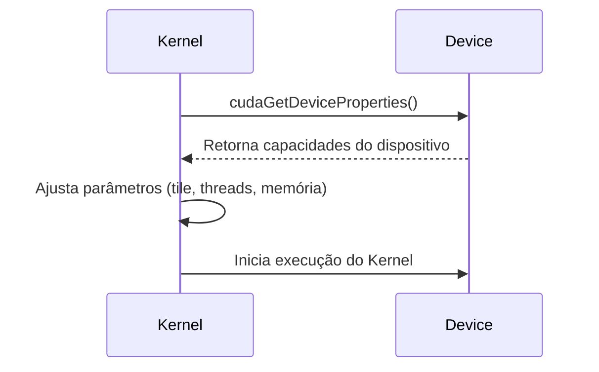
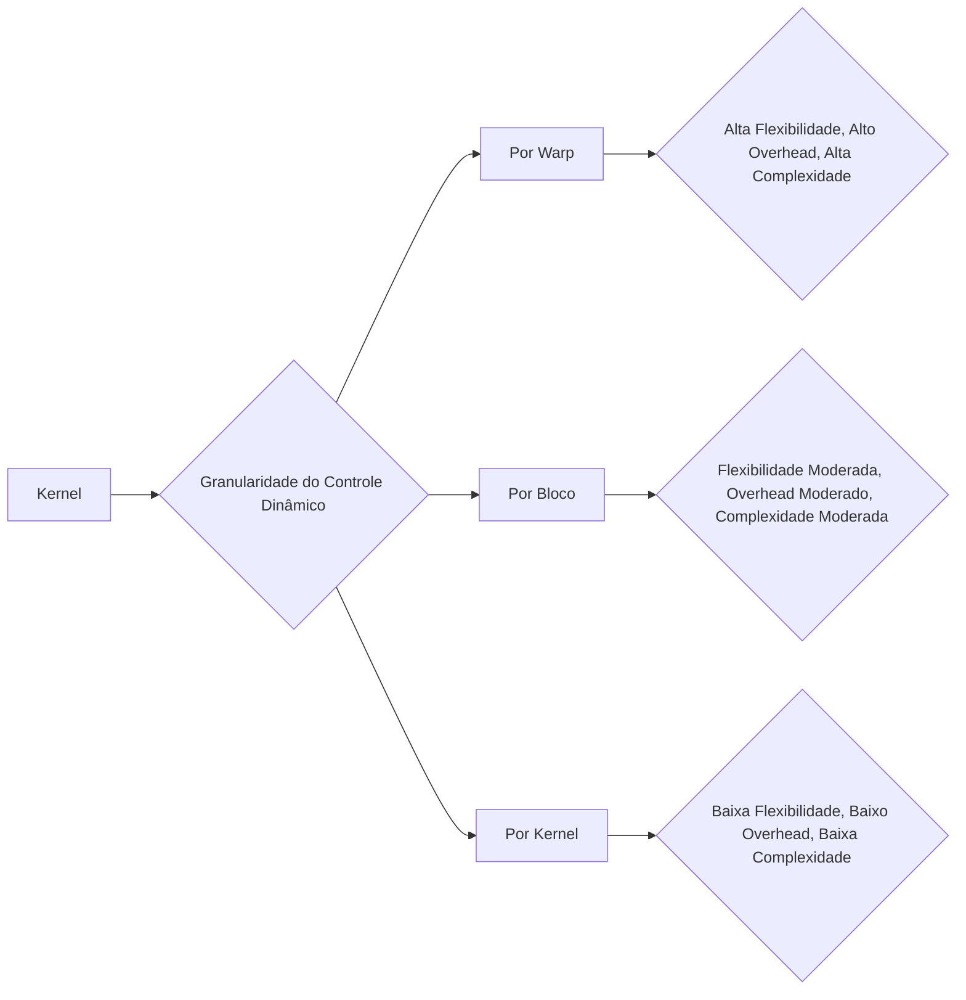

Okay, I've analyzed the text and added Mermaid diagrams where they would be most helpful. Here's the enhanced text:

## Adaptação Dinâmica de Recursos em CUDA: Otimizando Kernels para Diferentes Dispositivos

```mermaid
graph LR
    A[Kernel CUDA] --> B{Consulta Capacidades do Device};
    B --> C{Ajusta Parâmetros (threads, memória compartilhada)};
   C --> D[Executa no Dispositivo];
   D --> E{Desempenho Otimizado};
```

### Introdução

Em um ambiente computacional heterogêneo como CUDA, as capacidades de hardware variam significativamente entre diferentes dispositivos. As limitações de recursos, como o número de **registradores** e a quantidade de **memória compartilhada** disponíveis por Streaming Multiprocessor (SM), podem variar de uma geração de GPUs para outra, ou entre dispositivos com diferentes arquiteturas. A capacidade de adaptar dinamicamente o uso de recursos a essas variações é fundamental para garantir que um kernel obtenha o máximo desempenho em qualquer plataforma. Este capítulo explora em detalhes como as aplicações CUDA podem verificar dinamicamente as capacidades do dispositivo e ajustar seus kernels de acordo com elas, como essa adaptação dinâmica permite que o kernel seja otimizado para diferentes arquiteturas de hardware e como essa abordagem é fundamental para o desenvolvimento de aplicações portáveis e de alto desempenho.

### Variações de Recursos entre Dispositivos

As arquiteturas de GPUs CUDA e suas capacidades variam significativamente entre diferentes dispositivos. A quantidade de registradores e memória compartilhada disponíveis por SM, a capacidade dos caches L1 e L2, o número de unidades de processamento (SPs) por SM, a quantidade de memória global e outros recursos podem variar entre dispositivos de diferentes gerações e mesmo entre dispositivos da mesma geração, mas com diferentes configurações.

**Conceito 1: Variações de Hardware entre Dispositivos CUDA**

As capacidades de hardware, como registradores e memória compartilhada, variam entre dispositivos CUDA de diferentes gerações e configurações.

**Lemma 1:** *As limitações de recursos, como o número de registradores e a quantidade de memória compartilhada por SM, podem variar significativamente entre diferentes dispositivos CUDA, devido a diferenças nas arquiteturas de hardware.*

*Prova:* Dispositivos com arquiteturas diferentes possuem capacidades de hardware diferentes. $\blacksquare$

**Conceito 2: Necessidade de Adaptação Dinâmica**

Devido às variações de hardware, kernels CUDA que são otimizados para uma determinada arquitetura podem não ter um bom desempenho em outras arquiteturas. A adaptação dinâmica do código é necessária para que o código seja eficiente em diferentes devices.

**Corolário 1:** *A variação nas capacidades dos dispositivos CUDA exige que os kernels sejam adaptados dinamicamente para diferentes hardwares, de forma a utilizar o máximo do potencial de cada device.*

*Derivação:* A otimização do código para um dispositivo pode não levar ao melhor desempenho em outros dispositivos, devido às diferenças de hardware. $\blacksquare$

### Consulta Dinâmica das Capacidades do Device

Para que um kernel CUDA possa se adaptar dinamicamente a diferentes hardwares, a aplicação deve ser capaz de consultar as capacidades do dispositivo no qual está sendo executada. Isso é feito através da API CUDA, utilizando a função `cudaGetDeviceProperties()` [^11]. Essa função retorna informações sobre o dispositivo, como o número de registradores por SM, a quantidade de memória compartilhada por SM, a capacidade de computação, entre outros recursos.

**Conceito 3: Uso da API CUDA para Consultar as Capacidades**

A API CUDA oferece a função `cudaGetDeviceProperties()` que permite obter informações sobre o hardware para adaptar o código do kernel dinamicamente.

**Lemma 2:** *A função cudaGetDeviceProperties() permite que um kernel CUDA consulte dinamicamente as capacidades do dispositivo no qual está sendo executado, como o número de registradores por SM e a quantidade de memória compartilhada por SM.*

*Prova:* A função retorna informações sobre o dispositivo. $\blacksquare$

### Ajuste Dinâmico de Parâmetros do Kernel

Com as informações obtidas pela consulta ao dispositivo, o kernel pode ajustar seus parâmetros dinamicamente. Parâmetros como o tamanho do *tile* (`TILE_WIDTH`), o número de threads por bloco e o uso de registradores e memória compartilhada podem ser ajustados para obter o melhor desempenho possível em cada dispositivo.



**Conceito 4: Ajuste Dinâmico para Otimizar a Performance**

A partir das informações sobre o hardware do device, o kernel deve adaptar o número de threads por bloco, a utilização da memória compartilhada e o tamanho do *tile*.

**Corolário 2:** *Com base nas informações obtidas através da função `cudaGetDeviceProperties()`, o kernel pode ajustar dinamicamente seus parâmetros de execução, como o tamanho do tile, o número de threads e o uso de memória compartilhada, de forma a otimizar o desempenho para aquele dispositivo específico.*

*Derivação:* A utilização das informações sobre o device permite que o kernel seja otimizado para o hardware específico. $\blacksquare$

### Otimização Específica para Cada Plataforma

A adaptação dinâmica dos parâmetros do kernel garante que o código seja otimizado para cada arquitetura específica, o que maximiza o desempenho da aplicação em diferentes plataformas. É importante que o programador use as informações sobre o dispositivo para que o código tenha o melhor desempenho possível.

**Conceito 5: Adaptação Dinâmica para Diferentes Hardwares**

A adaptação dinâmica permite que o kernel seja otimizado para diferentes arquiteturas de hardware.

**Lemma 3:** *A adaptação dinâmica de parâmetros do kernel garante que o código seja otimizado para cada arquitetura específica, resultando em maior eficiência e melhor desempenho em diferentes plataformas.*

*Prova:* Cada arquitetura tem parâmetros de execução ótimos, que são obtidos através da adaptação dinâmica. $\blacksquare$

### Flexibilidade na Programação CUDA

A capacidade de adaptar dinamicamente os parâmetros do kernel permite maior flexibilidade no desenvolvimento de aplicações CUDA. O programador não precisa se preocupar em criar versões diferentes do kernel para cada arquitetura, e o código pode ser otimizado para qualquer hardware compatível com CUDA.

**Conceito 6: Flexibilidade no Código CUDA**

A capacidade de se adaptar dinamicamente aos diferentes hardwares garante maior flexibilidade no desenvolvimento de aplicações CUDA.

**Corolário 3:** *A capacidade de adaptar dinamicamente os kernels CUDA a diferentes dispositivos garante maior flexibilidade para o programador e permite que o mesmo código seja executado de forma eficiente em diferentes plataformas, o que é fundamental para o desenvolvimento de aplicações portáveis e de alto desempenho.*

*Derivação:* O código que se adapta a diferentes plataformas permite um maior alcance da aplicação. $\blacksquare$

### Diagrama do Processo de Adaptação Dinâmica
```mermaid
graph LR
    A[Aplicação CUDA] --> B{Consulta Capacidades do Device};
    B --> C{Obtém Dados (registradores, Memória Compartilhada)};
   C --> D{Decide Tamanho do Tile};
   C --> E{Decide Número de Threads};
   C --> F{Decide Uso da Memória Compartilhada};
   D --> G[Inicia o Kernel com Parâmetros Otimizados];
   E --> G;
     F --> G;
```

**Explicação:** O diagrama mostra o fluxo da adaptação dinâmica, como os dados do dispositivo são utilizados para escolher os parâmetros do kernel, e como a aplicação inicia o kernel com a melhor configuração para aquele hardware.

### Análise Matemática da Adaptação Dinâmica de Recursos

Podemos analisar matematicamente como a adaptação dinâmica dos recursos pode otimizar a performance em diferentes dispositivos.

Suponha que:

* $P_1$ seja a performance de um kernel com parâmetros fixos para um device 1.
* $P_2$ seja a performance de um kernel com parâmetros fixos para um device 2.
* $P_{1\_adapt}$ seja a performance do kernel com parâmetros adaptados para o device 1.
* $P_{2\_adapt}$ seja a performance do kernel com parâmetros adaptados para o device 2.

Idealmente, $P_{1\_adapt} \ge P_1$ e $P_{2\_adapt} \ge P_2$, e em um cenário ideal o dispositivo com melhor arquitetura teria $P_{1\_adapt} > P_{2\_adapt}$ ou $P_{2\_adapt} > P_{1\_adapt}$, de acordo com a arquitetura e parâmetros de cada um. O desempenho é sempre melhor com o uso de parâmetros dinâmicos.

**Lemma 4:** *A adaptação dinâmica dos parâmetros de um kernel CUDA, com base nas informações obtidas do device, permite que o kernel atinja uma performance igual ou superior ao obtido com parâmetros fixos, em qualquer arquitetura CUDA.*

*Prova:* A adaptação dinâmica permite que a performance de um kernel seja otimizada para o hardware específico, resultando em um melhor desempenho em todos os devices. $\blacksquare$

**Corolário 4:** *Kernels CUDA que utilizam a API para descobrir as informações do device, e com base nelas utilizam parâmetros de execução otimizados, são, em geral, mais eficientes que os kernels com parâmetros fixos.*

*Derivação:* O uso da API para otimizar a execução do kernel permite que a performance seja a melhor possível para aquele hardware. $\blacksquare$

### Pergunta Teórica Avançada

**Como a escolha da granularidade do controle dinâmico (por *warp*, por bloco ou por kernel) afeta a complexidade da implementação, o *overhead* de execução e a capacidade de um kernel CUDA se adaptar a variações nas cargas de trabalho e na disponibilidade de recursos em diferentes arquiteturas de dispositivos?**

**Resposta:**

A escolha da granularidade do controle dinâmico, ou seja, se o ajuste dos parâmetros do kernel é feito por *warp*, por bloco ou por kernel, afeta a complexidade da implementação, o *overhead* de execução e a capacidade de um kernel CUDA se adaptar a variações nas cargas de trabalho e na disponibilidade de recursos em diferentes arquiteturas de dispositivos:

*   **Controle Dinâmico por *Warp*:** Ajustar parâmetros por *warp* permitiria uma granularidade muito fina de controle, o que significa que a alocação de registradores e memória compartilhada poderia ser feita de acordo com a necessidade de cada *warp* e não do bloco como um todo. Isso também permitiria que as otimizações em tempo de execução fossem mais sensíveis a mudanças de carga e a disponibilidade de recursos, porém teria um *overhead* muito elevado, e seria extremamente complexo de implementar.

*   **Controle Dinâmico por Bloco:** Ajustar os parâmetros por bloco oferece um bom compromisso entre flexibilidade e *overhead*. Os blocos são unidades relativamente grandes, e o *overhead* de ajuste de recursos seria menor do que o de *warps*. O kernel poderia otimizar a alocação de recursos para cada bloco em cada execução, baseado nas informações de cada dispositivo.

*   **Controle Dinâmico por Kernel:** O ajuste de parâmetros ao nível de kernel é a solução mais comum. A consulta às informações sobre o hardware é feita uma única vez no início da execução do kernel, e os parâmetros do kernel são ajustados para aquela execução, mas não podem ser alterados durante a execução do kernel. Essa solução é a mais simples de implementar, possui um baixo *overhead* de execução, mas também é a menos flexível, pois não consegue se adaptar a mudanças de carga durante a execução do kernel.

**Adaptação às Variações de Carga:**

*   A capacidade de adaptação da utilização da memória compartilhada e de registradores durante a execução depende da granularidade do controle dinâmico. Se o controle for feito por kernel, o kernel não se adapta à variação da carga. Se o controle for feito por bloco ou por *warp*, o ajuste dinâmico pode ser mais eficiente, com o custo de uma maior complexidade da implementação e maior *overhead*.

**Trade-offs:**

*   **Granularidade vs. *Overhead*:** Quanto mais granular o controle dinâmico, maior a complexidade e o *overhead* de implementação, mas também maior a capacidade do código de se adaptar às variações de carga. Um controle dinâmico por *warp* permite um ajuste muito específico do uso dos recursos, mas tem um *overhead* muito alto. Um controle dinâmico por bloco oferece um bom balanço entre flexibilidade e *overhead*. Um controle dinâmico ao nível de kernel é o mais simples de implementar, mas também o menos flexível.
*   **Complexidade da Implementação:** O controle dinâmico por *warp* envolve uma implementação muito mais complexa do que o controle por bloco, que por sua vez, é mais complexo do que o controle por kernel.
*  **Disponibilidade de Recursos:** A disponibilidade de recursos de um SM varia em tempo de execução. Um sistema que consiga se adaptar dinamicamente à essas variações é capaz de ter um desempenho superior.

**Lemma 6:** *A escolha da granularidade do controle dinâmico (por warp, por bloco ou por kernel) afeta a complexidade da implementação, o *overhead* de execução, a capacidade de adaptação às variações da carga de trabalho e a disponibilidade de recursos.*

*Prova:* A escolha de um nível de granularidade maior (por *warp*) exige um nível de controle muito maior, o que aumenta a complexidade e o *overhead* de execução. $\blacksquare$

**Corolário 5:** *A otimização de kernels CUDA que devem se adaptar a diferentes dispositivos e variações de carga de trabalho exige uma cuidadosa consideração do nível de granularidade do controle dinâmico, buscando um equilíbrio entre a flexibilidade da adaptação e o overhead de execução, para alcançar o melhor desempenho possível.*

*Derivação:* O balanceamento entre *overhead* e a possibilidade de otimizar a performance em diferentes condições é fundamental para o melhor desempenho. $\blacksquare$

### Conclusão

A adaptação dinâmica de recursos é fundamental para o desenvolvimento de kernels CUDA portáveis e de alto desempenho. A consulta dinâmica das capacidades do dispositivo e o ajuste dos parâmetros do kernel com base nessas informações garantem que o código seja otimizado para diferentes arquiteturas de hardware. A escolha adequada da granularidade do controle dinâmico, considerando o *overhead* e a necessidade de se adaptar a diferentes cargas de trabalho, são passos fundamentais para o desenvolvimento de aplicações CUDA flexíveis e eficientes.

### Referências

[^11]: "Note that the number of registers available to each SM varies from device to device. An application can dynamically determine the number of registers available in each SM of the device used and choose a version of the kernel that uses the number of registers appropriate for the device." *(Trecho do Capítulo 5, página 116)*
