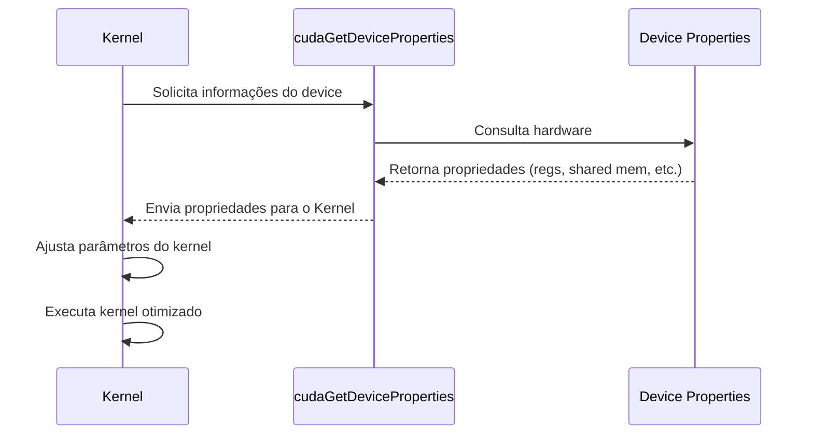

Okay, I've analyzed the provided text and added Mermaid diagrams to enhance the explanations. Here's the modified text with the diagrams included:

## Funções de Consulta de Propriedades do Dispositivo: Adaptando Kernels CUDA com `cudaGetDeviceProperties()`

```mermaid
graph LR
    A[Kernel CUDA] --> B{Consulta Propriedades do Device};
    B --> C[Ajusta Parâmetros (e.g., tiles, threads)];
    C --> D[Execução Otimizada];
    style B fill:#f9f,stroke:#333,stroke-width:2px
```

### Introdução

Em kernels CUDA, a otimização do desempenho exige o conhecimento das capacidades do hardware em que o kernel está sendo executado. As diferentes arquiteturas de dispositivos CUDA possuem características distintas, como o número de registradores e a quantidade de memória compartilhada por Streaming Multiprocessor (SM). Para que um kernel possa se adaptar a essas variações e obter o máximo de desempenho, a API CUDA oferece funções de consulta de propriedades do dispositivo, como a função `cudaGetDeviceProperties()`. Este capítulo explora em detalhes a necessidade de utilizar funções como `cudaGetDeviceProperties()` para obter informações sobre as limitações de recursos do dispositivo, e como essas informações podem ser utilizadas para ajustar dinamicamente os parâmetros do kernel, como o tamanho dos *tiles*, o número de threads por bloco e o uso da memória compartilhada.

### A Necessidade de Consultar as Propriedades do Dispositivo

A capacidade de um kernel CUDA se adaptar dinamicamente a diferentes arquiteturas de hardware depende da capacidade de consultar as propriedades do dispositivo em que o kernel está sendo executado. Cada arquitetura possui diferentes quantidades de registradores, memória compartilhada e largura de banda da memória global, de modo que o ajuste dos parâmetros do kernel deve ser feito considerando essas diferenças.

**Conceito 1: Variações de Hardware e a Necessidade de Consulta**

As variações de hardware entre dispositivos CUDA exigem que o kernel seja capaz de consultar dinamicamente as propriedades do dispositivo, para que a alocação dos recursos seja feita de forma correta.

**Lemma 1:** *A variação das propriedades do hardware em diferentes dispositivos CUDA torna necessário o uso de funções de consulta, como `cudaGetDeviceProperties()`, para adaptar dinamicamente os kernels a diferentes plataformas.*

*Prova:* A necessidade de se adaptar a diferentes hardwares requer que o kernel possa consultar as características desse hardware. $\blacksquare$

**Conceito 2: A Função `cudaGetDeviceProperties()`**

A API CUDA oferece a função `cudaGetDeviceProperties()` para obter informações sobre as propriedades do dispositivo, como o número de registradores por SM e a quantidade de memória compartilhada por SM.

**Corolário 1:** *A função cudaGetDeviceProperties() é fundamental para que as aplicações CUDA possam obter informações sobre o hardware disponível e utilizar essas informações para otimizar o desempenho do kernel.*

*Derivação:* A função permite obter informações necessárias para a otimização do kernel. $\blacksquare$

### Obtendo Limitações de Recursos com `cudaGetDeviceProperties()`

A função `cudaGetDeviceProperties()` preenche uma estrutura de dados com informações sobre o dispositivo, incluindo as limitações de recursos, como o número de registradores por SM, a quantidade de memória compartilhada por SM, o número máximo de threads por bloco, entre outros dados importantes para o planejamento da execução do kernel. Essas informações são utilizadas para ajustar os parâmetros do kernel para aquele hardware específico.

**Conceito 3: Informações sobre as Limitações de Recursos**

A função `cudaGetDeviceProperties()` informa as limitações de recursos do device, tais como o número de registradores e a capacidade da memória compartilhada, que são essenciais para o planejamento da execução do kernel.

**Lemma 2:** *A função `cudaGetDeviceProperties()` fornece informações sobre as limitações de recursos do dispositivo, incluindo o número de registradores disponíveis em cada SM, a quantidade de memória compartilhada disponível em cada SM e outros parâmetros importantes para a otimização do kernel.*

*Prova:* A função preenche uma estrutura com informações detalhadas sobre o hardware. $\blacksquare$

### Uso das Informações para Definir Parâmetros do Kernel

As informações obtidas com `cudaGetDeviceProperties()` podem ser utilizadas para definir parâmetros do kernel, como o tamanho do *tile* (`TILE_WIDTH`), o número de threads por bloco, e o uso da memória compartilhada. Ao ajustar esses parâmetros com base nas capacidades do hardware, o programador pode garantir que o kernel utilize ao máximo os recursos disponíveis e atinja um desempenho eficiente.



**Conceito 4: Ajuste Dinâmico dos Parâmetros do Kernel**

O uso da função `cudaGetDeviceProperties()` possibilita o ajuste dinâmico dos parâmetros do kernel para que ele seja executado de forma eficiente naquele hardware.

**Corolário 2:** *As informações obtidas através da função `cudaGetDeviceProperties()` permitem o ajuste dinâmico de parâmetros do kernel, como o tamanho do *tile*, o número de threads e o uso da memória compartilhada, para maximizar o desempenho em diferentes arquiteturas de hardware.*

*Derivação:* O ajuste dos parâmetros do kernel para cada hardware específico leva a um maior aproveitamento do potencial do hardware e consequentemente maior performance. $\blacksquare$

### Adaptação para Diferentes Arquiteturas de Dispositivos

A utilização da função `cudaGetDeviceProperties()` é fundamental para o desenvolvimento de kernels CUDA que sejam adaptáveis a diferentes arquiteturas de dispositivos. Ao consultar as capacidades do dispositivo no momento da execução, o kernel pode escolher a estratégia de alocação de memória, e de computação mais adequada para cada hardware. Essa adaptação dinâmica garante a portabilidade do código e a eficiência em diferentes plataformas.

**Conceito 5: Adaptação para Portabilidade**

A utilização da função `cudaGetDeviceProperties()` permite que o mesmo código seja utilizado em diferentes dispositivos, garantindo a portabilidade da aplicação.

**Lemma 3:** *O uso da função `cudaGetDeviceProperties()` permite a adaptação dinâmica do kernel a diferentes arquiteturas de hardware, tornando o código mais portável e com melhor desempenho em diferentes dispositivos.*

*Prova:* A adaptação dinâmica permite que a aplicação tenha uma boa performance em diferentes arquiteturas, sem a necessidade de um código específico para cada uma delas. $\blacksquare$

### Uso Prático da Função `cudaGetDeviceProperties()`

No código de um kernel CUDA, a utilização da função `cudaGetDeviceProperties()` envolve as seguintes etapas:

1.  **Obtenção do *device*:** Obter o identificador do dispositivo a ser utilizado (geralmente 0, que é o primeiro dispositivo disponível).
2.  **Declaração de uma Estrutura:** Declarar uma variável do tipo `cudaDeviceProp` para armazenar as informações do dispositivo.
3.  **Chamada da Função:** Chamar a função `cudaGetDeviceProperties(&devProp, device)`, passando o identificador do dispositivo e o endereço da estrutura.
4.  **Acesso às Propriedades:** Acessar os dados da estrutura `devProp`, como `devProp.regsPerBlock` (registradores por bloco) e `devProp.sharedMemPerBlock` (memória compartilhada por bloco).
5.  **Ajuste dos Parâmetros:** Ajustar os parâmetros do kernel com base nas informações obtidas.

### Diagrama Detalhado do Uso da Função `cudaGetDeviceProperties()`

```mermaid
graph LR
    A[Aplicação CUDA] --> B{Obtém Identificador do Device};
     B --> C{Declara Estrutura cudaDeviceProp};
     C --> D{cudaGetDeviceProperties(&devProp, device)};
    D --> E{Acessa devProp.regsPerBlock, devProp.sharedMemPerBlock};
    E --> F[Ajusta Parâmetros do Kernel];
   F --> G[Executa o Kernel com Parâmetros Otimizados];
```

**Explicação:** O diagrama mostra o fluxo de execução do uso da função `cudaGetDeviceProperties()`, que permite que a aplicação obtenha informações sobre o device e ajuste o kernel de acordo.

### Análise Matemática da Eficiência com `cudaGetDeviceProperties()`

A eficiência do uso de `cudaGetDeviceProperties()` para ajustar os parâmetros do kernel pode ser expressa matematicamente da seguinte forma:

Suponha que:

*   $P_{fixo}$ seja o desempenho de um kernel com parâmetros fixos, sem levar em consideração as capacidades do hardware.
*   $P_{dinamico}$ seja o desempenho do mesmo kernel ajustando dinamicamente os parâmetros do kernel para cada device, utilizando `cudaGetDeviceProperties()`.

Em geral, a adaptação do kernel dinamicamente deve resultar em um ganho de performance:
$$P_{dinamico} \ge P_{fixo}$$
Se o device for muito similar aquele para o qual o kernel foi originalmente projetado, a diferença entre os dois valores de performance será pequena. Se os devices forem muito diferentes, a diferença será maior.

**Lemma 4:** *O uso da função `cudaGetDeviceProperties()` e a adaptação dinâmica do kernel para as capacidades do hardware podem levar a um aumento significativo na performance da aplicação CUDA, em comparação a um kernel que utilize parâmetros fixos.*

*Prova:* O uso da função `cudaGetDeviceProperties()` permite a otimização do kernel para cada dispositivo específico. $\blacksquare$

**Corolário 3:** *A capacidade de adaptar dinamicamente os parâmetros do kernel através da função `cudaGetDeviceProperties()` permite que aplicações CUDA tenham melhor performance em diferentes plataformas e arquiteturas.*

*Derivação:* A otimização do código para cada hardware leva a uma melhor performance. $\blacksquare$

### Pergunta Teórica Avançada

**Como a combinação do uso de `cudaGetDeviceProperties()` com *just-in-time compilation* (compilação JIT) pode permitir a criação de kernels CUDA que se adaptem ainda mais dinamicamente a variações de arquitetura e carga de trabalho, e quais os desafios e limitações dessa abordagem?**

**Resposta:**
A combinação do uso de `cudaGetDeviceProperties()` com *just-in-time compilation* (compilação JIT) pode permitir a criação de kernels CUDA ainda mais flexíveis e adaptáveis, capazes de otimizar o desempenho em diferentes arquiteturas e cargas de trabalho.

*   **`cudaGetDeviceProperties()` e Adaptação de Parâmetros:** A função `cudaGetDeviceProperties()` permite que a aplicação consulte as capacidades de hardware do dispositivo em tempo de execução. As informações obtidas podem ser utilizadas para definir parâmetros do kernel, como o tamanho do tile, o número de threads por bloco, o uso de registradores e memória compartilhada, e outras características. Essa informação define como o kernel será executado, mas o código do kernel em si não é modificado.

*  ***Just-in-Time Compilation* (Compilação JIT):** A compilação JIT é uma técnica em que o código do kernel é compilado em tempo de execução, o que possibilita que o código seja adaptado de forma dinâmica para as características do hardware e para os dados específicos. A compilação JIT pode ser usada para criar diferentes versões do kernel com parâmetros específicos para cada device e até mesmo para cada situação de execução. O *overhead* da compilação JIT durante a execução pode ser maior que a compilação antecipada (AOT).

**Combinação de `cudaGetDeviceProperties()` com Compilação JIT:** A combinação dessas duas técnicas pode levar a:

*   **Adaptação Dinâmica do Código:** O *device query* através de `cudaGetDeviceProperties()` permite que a compilação JIT compile uma versão otimizada do código para o device específico em que o kernel será executado. A escolha correta dos parâmetros para o compilador faz com que o código seja compilado da melhor forma para aquele device.
*  **Otimização para Diferentes Arquiteturas:** Cada arquitetura pode ter uma compilação otimizada diferente, de acordo com a disponibilidade de recursos e as características da arquitetura.
*   **Adaptação à Carga de Trabalho:** Em alguns casos, os dados de entrada podem requerer um comportamento específico. A compilação JIT permite que o código seja adaptado para o tipo de dado de entrada.
*   **Redução do *Overhead*:** A compilação JIT combinada com o *device query* pode reduzir o overhead da decisão da melhor configuração para o kernel. Ao compilar o código especificamente para aquele device, o compilador pode otimizar o uso de recursos, o *loop unrolling*, a vetorização e outros parâmetros.

**Desafios e Limitações:**

*   ***Overhead* da Compilação:** A compilação JIT introduz um *overhead* durante a execução do kernel, pois o kernel precisa ser compilado. Esse *overhead* pode ser significativo, dependendo da complexidade do código e das otimizações que são realizadas durante a compilação.
*   **Complexidade da Implementação:** A implementação da compilação JIT é muito mais complexa do que a implementação do uso de `cudaGetDeviceProperties()` sem a compilação JIT. A compilação JIT exige que um compilador seja executado em tempo de execução.
*  **Recompilação Necessária:** Se o código for modificado, ou se novas opções de otimização forem encontradas, o código precisa ser recompilado para que a melhor performance seja utilizada.
*   **Necessidade de Estudo:** A escolha dos parâmetros de compilação e das opções de otimização deve ser feita de acordo com a arquitetura do hardware e com as características do problema. Um estudo e conhecimento profundos do código e do hardware são necessários para que uma implementação correta de compilação JIT seja feita.

**Lemma 7:** *A combinação da função `cudaGetDeviceProperties()` com a compilação JIT permite a criação de kernels CUDA mais flexíveis e adaptáveis, mas a complexidade da implementação e o overhead de compilação devem ser considerados.*

*Prova:* A compilação JIT é muito mais flexível, mas também mais complexa de se implementar. $\blacksquare$

**Corolário 5:** *O uso combinado da função `cudaGetDeviceProperties()` com a compilação JIT representa o futuro da otimização de kernels CUDA, mas essa abordagem requer um entendimento profundo da arquitetura do hardware, e um planejamento cuidadoso para garantir que a compilação JIT gere otimizações que superem o seu overhead, para que a melhor performance seja obtida.*

*Derivação:* A utilização de ferramentas avançadas para otimizar o kernel permite um desempenho ainda melhor da aplicação. $\blacksquare$

### Conclusão

A função `cudaGetDeviceProperties()` é fundamental para o desenvolvimento de kernels CUDA portáveis e eficientes. Ao permitir que as aplicações consultem dinamicamente as capacidades do dispositivo e ajustem os parâmetros do kernel de acordo, essa função garante que o código seja otimizado para diferentes arquiteturas e que o máximo desempenho seja alcançado. A combinação com compilação JIT oferece uma oportunidade para obter ainda mais flexibilidade e performance.

### Referências

[^11]: "Note that the number of registers available to each SM varies from device to device. An application can dynamically determine the number of registers available in each SM of the device used and choose a version of the kernel that uses the number of registers appropriate for the device." *(Trecho do Capítulo 5, página 116)*

**Deseja que eu continue com as próximas seções?**
