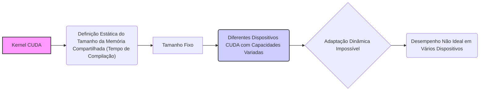
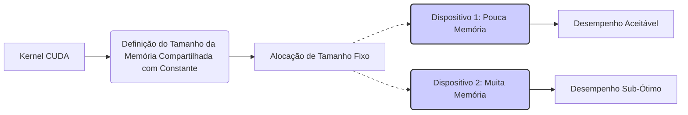

Okay, I've analyzed the text and added Mermaid diagrams to enhance the explanation of concepts related to shared memory allocation in CUDA. Here's the enhanced text with the diagrams:

## Limitações no Tamanho da Memória Compartilhada: A Necessidade de Alocação Dinâmica em CUDA



### Introdução

Na implementação de kernels CUDA, a alocação da memória compartilhada é um aspecto fundamental para o desempenho. Na primeira implementação de kernels que utilizam memória compartilhada, o tamanho da memória compartilhada é geralmente definido como uma constante em tempo de compilação. Este capítulo explora as limitações dessa abordagem, como a impossibilidade de ajustar dinamicamente o tamanho da memória compartilhada para diferentes dispositivos e como essa limitação pode ser resolvida com abordagens mais avançadas que permitem que o tamanho da memória compartilhada seja alocado dinamicamente, com base nas informações sobre o *device* em tempo de execução.

### Limitações do Tamanho da Memória Compartilhada em Tempo de Compilação

Quando o tamanho da memória compartilhada é definido como uma constante em tempo de compilação, o kernel é limitado a utilizar uma quantidade fixa de memória compartilhada. Essa abordagem pode ser simples para protótipos, mas impede a adaptação dinâmica do kernel a diferentes arquiteturas de dispositivos, que possuem capacidades de memória compartilhada distintas.

**Conceito 1: Definição Estática do Tamanho da Memória Compartilhada**

O tamanho da memória compartilhada é definido como uma constante em tempo de compilação na primeira implementação, o que limita a flexibilidade do código.

**Lemma 1:** *A definição do tamanho da memória compartilhada como uma constante em tempo de compilação limita a capacidade do kernel de se adaptar dinamicamente a diferentes dispositivos, pois o tamanho da memória é fixo durante a compilação.*

*Prova:* A definição como constante impede que o valor seja alterado durante a execução. $\blacksquare$

**Conceito 2: Impossibilidade de Ajuste Dinâmico**

Com a definição do tamanho da memória compartilhada em tempo de compilação, o kernel não pode ajustar a alocação de memória para os diferentes dispositivos.

**Corolário 1:** *A definição do tamanho da memória compartilhada em tempo de compilação impede o ajuste dinâmico desse parâmetro para diferentes dispositivos, o que limita a portabilidade do código e a capacidade de obter o máximo de desempenho em diferentes plataformas.*

*Derivação:* Uma vez compilado o código, a capacidade de memória compartilhada não pode ser alterada. $\blacksquare$

### A Necessidade de Adaptação Dinâmica do Tamanho da Memória Compartilhada

A necessidade de adaptação dinâmica do tamanho da memória compartilhada surge devido às variações nas capacidades de hardware entre dispositivos CUDA. Dispositivos mais recentes podem ter mais memória compartilhada por Streaming Multiprocessor (SM) do que dispositivos mais antigos. Um kernel que não se adapta a essas variações pode não ter o desempenho ideal em todas as plataformas.

**Conceito 3: Variação da Capacidade da Memória Compartilhada**

A capacidade da memória compartilhada varia entre dispositivos CUDA, sendo necessário que o kernel seja adaptável para diferentes quantidades de memória.

**Lemma 2:** *A capacidade da memória compartilhada por SM varia entre diferentes dispositivos CUDA, o que exige que o kernel seja capaz de ajustar dinamicamente o tamanho da memória compartilhada alocada para cada bloco, para garantir a máxima performance.*

*Prova:* A arquitetura dos diferentes devices define diferentes capacidades de memória. $\blacksquare$

**Conceito 4: Otimização para Diferentes Hardwares**

A adaptação dinâmica do tamanho da memória compartilhada permite que o kernel utilize a quantidade máxima de memória disponível em cada dispositivo.

**Corolário 2:** *A alocação dinâmica da memória compartilhada permite a otimização do kernel para as capacidades do hardware em que ele está sendo executado, maximizando a utilização dos recursos disponíveis, o que leva a uma melhor performance.*

*Derivação:* A utilização da capacidade máxima da memória compartilhada do dispositivo permite obter melhor performance do que quando a alocação é estática. $\blacksquare$

### A Limitação do Tamanho da Memória Compartilhada no Kernel

Quando o tamanho da memória compartilhada é definida em tempo de compilação, ela é definida com uma constante, como exemplificado em Figura 5.12 do contexto com o uso de `TILE_WIDTH`:

```c++
#define TILE_WIDTH 16
_shared_ float Mds [TILE_WIDTH][TILE_WIDTH];
_shared_ float Nds [TILE_WIDTH][TILE_WIDTH];
```
Onde `TILE_WIDTH` é uma constante de tempo de compilação, o que limita o uso da memória compartilhada a um valor que não pode ser alterado em tempo de execução.

**Conceito 5: Limitações da Definição em Tempo de Compilação**

A definição da memória compartilhada com uma constante definida em tempo de compilação limita a capacidade de adaptação do kernel às diferentes arquiteturas.

**Lemma 3:** *A definição do tamanho da memória compartilhada com uma constante em tempo de compilação impede que a quantidade de memória compartilhada utilizada pelo kernel seja ajustada dinamicamente, o que limita o potencial de otimização do kernel para diferentes arquiteturas de hardware.*

*Prova:* Uma constante definida em tempo de compilação não pode ser alterada em tempo de execução. $\blacksquare$

### A Próxima Abordagem: Alocação Dinâmica da Memória Compartilhada

A próxima seção irá explorar uma forma de contornar essa limitação, utilizando uma abordagem que permite que a quantidade de memória compartilhada alocada pelo kernel seja definida dinamicamente em tempo de execução, o que permite ao kernel se adaptar a diferentes dispositivos e, por conseguinte, melhorar a portabilidade e a eficiência da aplicação.

### Diagrama da Limitação do Tamanho da Memória Compartilhada



**Explicação:** O diagrama ilustra como a alocação de memória compartilhada definida como uma constante de tempo de compilação leva a uma utilização de memória sub-ótima em dispositivos com mais capacidade.

### Análise Matemática da Limitação da Memória Compartilhada Estática

Podemos representar matematicamente a limitação da alocação estática da memória compartilhada da seguinte forma:

Suponha que:

*  $S_{dev}$ seja a quantidade de memória compartilhada disponível em um dado dispositivo CUDA.
*  $T_{const}$ seja o tamanho da memória compartilhada utilizada no kernel, definido como uma constante no código.

O kernel poderá utilizar no máximo o menor valor entre a capacidade da memória compartilhada do dispositivo e a alocação feita com o uso da constante no kernel.

$$S_{kernel\_utilizada} = min(S_{dev}, T_{const})$$

Essa equação demonstra que o uso estático da memória compartilhada pode limitar o uso de memória em dispositivos que tenham mais memória disponível do que o definido pela constante.

**Lemma 4:** *A definição do tamanho da memória compartilhada por uma constante em tempo de compilação impede que toda a memória disponível de um device seja utilizada, o que limita a otimização do código para diferentes arquiteturas.*

*Prova:* O uso de uma constante impede a adaptação para as capacidades específicas de cada dispositivo. $\blacksquare$

**Corolário 3:** *Kernels CUDA que definem a quantidade de memória compartilhada como uma constante em tempo de compilação são limitados pela capacidade da memória compartilhada definida pela constante, mesmo que o hardware tenha uma capacidade de memória compartilhada superior.*

*Derivação:* O uso de uma constante limita a utilização do hardware, caso a capacidade do hardware seja maior que a constante definida. $\blacksquare$

### Pergunta Teórica Avançada

**Como a combinação de *device query* (`cudaGetDeviceProperties()`) com a alocação dinâmica de memória compartilhada pode afetar a escolha do tamanho do *tile*, o número de threads por bloco, e o desempenho de kernels CUDA, e quais são os *trade-offs* envolvidos?**

**Resposta:**
A combinação do *device query* com `cudaGetDeviceProperties()` e a alocação dinâmica de memória compartilhada permite que um kernel CUDA seja muito mais flexível, e que possa se adaptar melhor a diferentes arquiteturas.

*   ***Device Query* (`cudaGetDeviceProperties()`):** O uso de `cudaGetDeviceProperties()` permite que o kernel obtenha informações sobre as capacidades de hardware do dispositivo, como a quantidade de memória compartilhada por SM e o número de registradores. Essa informação pode ser usada para otimizar a configuração do kernel, como o tamanho do *tile* e o número de threads por bloco.

*  **Alocação Dinâmica de Memória Compartilhada:** A alocação dinâmica de memória compartilhada permite que a quantidade de memória compartilhada seja definida em tempo de execução, com base nas informações obtidas pelo *device query*. Isso significa que o kernel pode utilizar o máximo de memória compartilhada possível para cada dispositivo, e que o tamanho do tile pode ser definido de acordo com essa informação.

**Interação e Otimização:** A combinação do *device query* com a alocação dinâmica de memória compartilhada permite:

*   **Adaptação do Tamanho do Tile:** O tamanho do *tile* (TILE_WIDTH) pode ser definido dinamicamente, baseando-se na quantidade de memória compartilhada disponível no dispositivo. Dispositivos com mais memória podem utilizar *tiles* maiores, o que reduz a quantidade de acessos a memória global, e melhora a performance. Dispositivos com pouca memória podem utilizar *tiles* menores.
*   **Otimização do Número de Threads:** O número de threads por bloco pode ser escolhido dinamicamente, de acordo com o número máximo de threads por bloco e a quantidade de registradores disponíveis em cada arquitetura. Isso também pode ser utilizado para o uso de *loop unrolling*, já que o número de registradores disponíveis pode impactar a quantidade de *loop unrolling*.
*   **Otimização do Uso de Memória Compartilhada:** A quantidade de memória compartilhada alocada em cada bloco pode ser definida de acordo com as limitações do dispositivo, maximizando o uso dos recursos disponíveis.
*   **Melhora na Portabilidade:** A adaptação dinâmica dos parâmetros permite que um único código seja executado em diferentes dispositivos com boa performance.

***Trade-offs*:**

*  **Overhead da consulta e alocação:** A consulta das propriedades do device e a alocação dinâmica de memória compartilhada adicionam um *overhead* à execução do kernel, pois essas informações devem ser obtidas antes da execução do kernel. No entanto, o ganho de performance com a adaptação geralmente compensa o *overhead* dessas operações.
* **Complexidade da implementação:** A alocação dinâmica e a consulta das propriedades tornam o código mais complexo, o que pode dificultar a depuração e manutenção.
*   **Necessidade de testes:** Os kernels que utilizam técnicas de otimização dinâmica devem ser exaustivamente testados em diferentes dispositivos para verificar se as escolhas da configuração são adequadas.

**Lemma 5:** *A combinação de `cudaGetDeviceProperties()` com a alocação dinâmica de memória compartilhada possibilita a otimização dinâmica dos parâmetros do kernel, que se adapta a diferentes arquiteturas e capacidades, mas também adiciona um *overhead* e torna a implementação do código mais complexa.*

*Prova:* A adaptação dinâmica do código permite melhor performance, mas a implementação desta adaptação acrescenta complexidade ao código. $\blacksquare$

**Corolário 4:** *A otimização de kernels CUDA para diferentes plataformas exige um planejamento cuidadoso da utilização dos dados obtidos com cudaGetDeviceProperties(), o uso eficiente da alocação dinâmica de memória compartilhada, e do balanceamento das vantagens e desvantagens desses mecanismos de forma a obter o melhor desempenho e portabilidade.*

*Derivação:* A adaptação do kernel ao hardware permite obter melhor desempenho e portabilidade, e o programador deve saber planejar a alocação de memória de forma apropriada, e fazer um uso eficiente dos recursos do hardware. $\blacksquare$

### Conclusão

A definição estática do tamanho da memória compartilhada em tempo de compilação limita a capacidade de adaptação de kernels CUDA a diferentes arquiteturas de dispositivos. Para contornar essa limitação, é necessário utilizar funções como `cudaGetDeviceProperties()` para obter informações sobre o hardware, e utilizar a alocação dinâmica da memória compartilhada para que o tamanho dos *tiles* seja escolhido de acordo com o device. Essa capacidade de adaptar dinamicamente o kernel às características do hardware garante que a aplicação seja eficiente em todas as plataformas.

### Referências

[^11]: "Note that the size of shared memory in each SM can also vary from device to device. Each generation or model of device can have a different amount of shared memory in each SM. It is often desirable for a kernel to be able to use a different amount of shared memory according to the amount available in the hardware." *(Trecho do Capítulo 5, página 117)*

**Deseja que eu continue com as próximas seções?**
