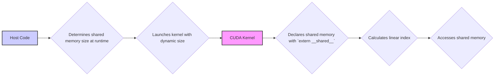
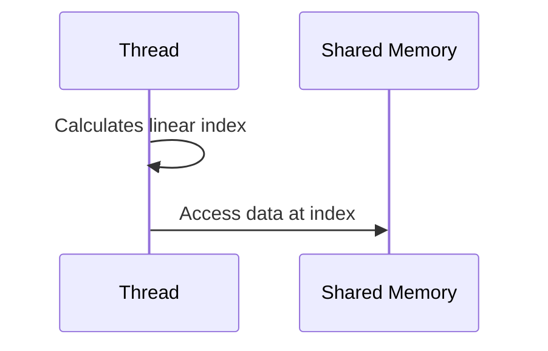
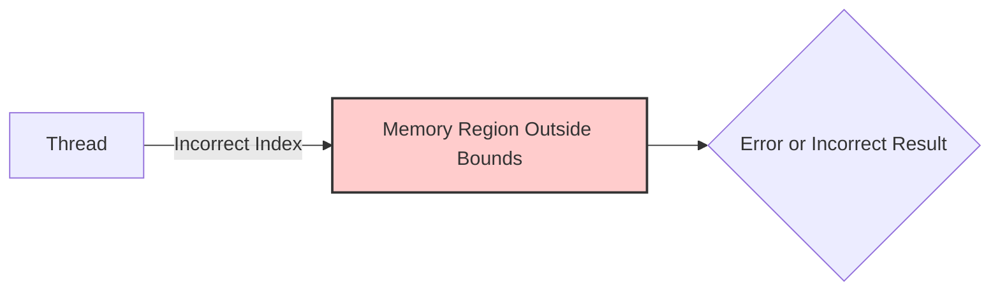

Okay, I've analyzed the text and added Mermaid diagrams where they would be most helpful. Here's the enhanced version:

## Alocação Dinâmica da Memória Compartilhada: Flexibilidade e Desafios com `extern __shared__`



### Introdução

Na busca por maior flexibilidade e otimização de kernels CUDA, a declaração da memória compartilhada utilizando a palavra-chave `extern __shared__` oferece uma alternativa à definição estática do tamanho em tempo de compilação. Essa abordagem permite que o tamanho da memória compartilhada seja ajustado dinamicamente em tempo de execução. Este capítulo explora em detalhes o uso da palavra-chave `extern __shared__` para declarar variáveis de memória compartilhada sem especificar o tamanho, como essa abordagem permite ajustes dinâmicos em tempo de execução, como o desenvolvedor precisa calcular manualmente o índice linearizado dos elementos e como essa abordagem expõe a aplicação ao risco de acesso fora dos limites da memória compartilhada.

### Declaração Dinâmica da Memória Compartilhada com `extern __shared__`

A declaração da memória compartilhada utilizando `extern __shared__` permite que o tamanho da memória não seja definido durante a compilação do kernel. Em vez de definir um tamanho fixo com um array bidimensional, a memória compartilhada passa a ser declarada como um array unidimensional cujo tamanho será definido em tempo de execução, utilizando uma chamada do kernel que determina esse tamanho. Essa flexibilidade permite que o kernel se adapte a diferentes dispositivos, utilizando a quantidade apropriada de memória compartilhada.

**Conceito 1: Declaração com `extern __shared__`**

A palavra-chave `extern __shared__` é usada para declarar a memória compartilhada sem definir o seu tamanho, permitindo que a alocação do tamanho seja feita em tempo de execução.

**Lemma 1:** *A declaração da memória compartilhada utilizando a palavra-chave `extern __shared__` permite que o tamanho da memória compartilhada não seja especificado durante a compilação, e sim em tempo de execução, tornando o kernel mais flexível e adaptável.*

*Prova:* A palavra-chave `extern` omite a definição do tamanho, o que permite que ela seja definida dinamicamente. $\blacksquare$

**Conceito 2: Ajuste Dinâmico do Tamanho da Memória Compartilhada**

A alocação da memória compartilhada em tempo de execução permite que o kernel se adapte ao hardware em que está sendo executado, utilizando mais memória compartilhada em dispositivos com maior capacidade, e utilizando menos memória compartilhada quando a capacidade do dispositivo é limitada.

**Corolário 1:** *A declaração dinâmica da memória compartilhada permite que o tamanho da memória seja ajustado em tempo de execução de acordo com a capacidade do dispositivo CUDA, o que possibilita que o kernel seja otimizado para o dispositivo em que ele está sendo executado.*

*Derivação:* A adaptação dinâmica do tamanho da memória compartilhada permite utilizar o máximo de recursos de cada hardware. $\blacksquare$

### Cálculo Manual do Índice Linearizado

Com o uso da palavra-chave `extern __shared__`, a memória compartilhada é declarada como um array unidimensional, e o programador precisa calcular manualmente o índice linearizado para acessar os elementos corretos, já que não há a facilidade de acesso através de índices bidimensionais, como no caso da alocação estática. Essa etapa exige um planejamento cuidadoso por parte do programador para garantir a correção dos acessos. A escolha do layout e do padrão de acesso também afeta a possibilidade de ocorrência de *bank conflicts*.



**Conceito 3: Índice Linearizado em Memória Compartilhada**

O programador precisa calcular o índice linearizado para o acesso correto aos dados em memória compartilhada alocada dinamicamente.

**Lemma 2:** *Ao utilizar a palavra-chave `extern __shared__` para declarar a memória compartilhada, o programador é responsável por calcular o índice linearizado para o acesso correto aos elementos, o que requer um planejamento cuidadoso e pode aumentar a complexidade do código.*

*Prova:* O uso de *arrays* unidimensionais exige que as posições das matrizes bidimensionais sejam mapeadas para o espaço unidimensional. $\blacksquare$

**Conceito 4: Responsabilidade do Programador**

A declaração da memória compartilhada com `extern __shared__` exige um planejamento cuidadoso do programador e o deixa responsável pelo acesso aos dados.

**Corolário 2:** *O uso da palavra-chave `extern __shared__` coloca a responsabilidade do cálculo correto dos índices e dos acessos a memória nas mãos do programador, aumentando a complexidade do código e a possibilidade de erros.*

*Derivação:* A declaração de memória sem tamanho requer que o programador controle o acesso a memória de forma manual. $\blacksquare$

### Risco de Acesso Fora dos Limites da Memória

Um dos principais desafios da alocação dinâmica da memória compartilhada é o risco de acesso fora dos limites (*out-of-bounds access*). Se o programador não calcular corretamente o índice linearizado, a thread pode tentar acessar uma região de memória fora do limite alocado para a memória compartilhada, o que pode gerar erros ou resultados incorretos.



**Conceito 5: Risco de Acesso Fora dos Limites**

A alocação dinâmica de memória compartilhada torna o programador responsável por mapear corretamente os dados, e o acesso inadequado à memória pode levar a erros ou a travamento do programa.

**Lemma 3:** *A alocação dinâmica da memória compartilhada, quando combinada com o cálculo manual do índice linearizado, expõe o kernel CUDA ao risco de *out-of-bounds access*, o que pode levar a erros ou comportamentos inesperados durante a execução.*

*Prova:* O controle manual do acesso a memória aumenta a possibilidade de erros por parte do programador. $\blacksquare$

**Conceito 6: Necessidade de Verificação Rigorosa**

O uso da alocação dinâmica exige uma verificação cuidadosa e rigorosa do código, para evitar erros de acesso a memória compartilhada.

**Corolário 3:** *O uso da palavra-chave `extern __shared__` para alocação dinâmica da memória compartilhada exige um planejamento cuidadoso e uma verificação rigorosa dos cálculos de índices para evitar acessos fora dos limites da memória e garantir a correção dos resultados.*

*Derivação:* A maior flexibilidade e poder de otimização também levam a uma maior responsabilidade por parte do programador. $\blacksquare$

###  A Abordagem Prática com `extern __shared__`

Para utilizar a palavra-chave `extern __shared__` na prática, o código do kernel deve:

1.  **Declarar a Memória Compartilhada:** Declarar as variáveis `Mds` e `Nds` como `extern __shared__ float Mds[];` e `extern __shared__ float Nds[];`, sem especificar seu tamanho.
2.  **Calcular o Tamanho:** Calcular o tamanho total de memória compartilhada que será utilizada para armazenar os *tiles* de M e N.
3.  **Passar o Tamanho:** Passar o tamanho calculado como um terceiro parâmetro da chamada do kernel (após o número de blocos e o número de threads).
4.  **Usar a Memória Compartilhada:** Calcular os índices lineares para acesso aos dados dentro da memória compartilhada, e usar os dados de forma adequada.

### Diagrama Detalhado da Alocação Dinâmica com `extern __shared__`

```mermaid
graph LR
    A[Host Code] --> B{Calculate Shared Memory Size};
    B --> C{Launch Kernel with Size};
    C --> D[CUDA Kernel];
    D --> E{extern __shared__ float Mds[];};
    D --> F{extern __shared__ float Nds[];};
    E --> G{Access Shared Memory with Linear Index}
    F --> G
    style D fill:#aaf,stroke:#333,stroke-width:2px
    style A fill:#ccf,stroke:#333,stroke-width:2px
```

**Explicação:** O diagrama mostra como a palavra-chave `extern __shared__` permite que o tamanho da memória compartilhada seja definida dinamicamente.

### Análise Matemática do Uso de `extern __shared__`

Podemos analisar matematicamente o impacto do uso de `extern __shared__` da seguinte forma:

Suponha que:

*   $T$ seja a dimensão do *tile* (TILE_WIDTH).
*   $S_{Mds}$ seja a quantidade de memória necessária para armazenar a variável Mds.
*   $S_{Nds}$ seja a quantidade de memória necessária para armazenar a variável Nds.
*  $S_{total}$ seja a quantidade total de memória compartilhada necessária.

Com a declaração estática, o tamanho da memória compartilhada é definido como:

$$ S_{total} =  S_{Mds} + S_{Nds} = 2T^2 \times sizeof(float)$$

Com a declaração dinâmica usando `extern __shared__`, a quantidade de memória total é a mesma, mas o controle da alocação de memória é feito em tempo de execução, e a declaração no código do kernel é:

```c++
extern __shared__ float Mds[];
extern __shared__ float Nds[];
```

E a quantidade total de memória compartilhada a ser utilizada é passada como um argumento do kernel. O cálculo dos índices deve levar em consideração que a memória agora é um array linear, e que a alocação dinâmica permite escolher o melhor tamanho de *tile* em função do hardware disponível.

**Lemma 4:** *A declaração dinâmica da memória compartilhada através da palavra-chave extern __shared__ permite que o tamanho da memória seja definido durante o *launch* do kernel, e possibilita que o mesmo kernel seja utilizado em diferentes arquiteturas de hardware, e com diferentes quantidades de memória.*

*Prova:* A declaração `extern __shared__` omite a definição do tamanho, que é definida durante a execução. $\blacksquare$

**Corolário 4:** *O uso de extern __shared__ oferece maior flexibilidade no uso da memória compartilhada, mas ao mesmo tempo aumenta a complexidade do kernel e a responsabilidade do programador na gestão do acesso a memória.*

*Derivação:* A utilização de `extern __shared__` deixa a alocação de memória a cargo do programador, que passa a ter que se preocupar em escolher a quantidade certa, mapear corretamente os dados, e garantir a performance. $\blacksquare$

### Pergunta Teórica Avançada

**Como a alocação dinâmica de memória compartilhada, juntamente com o uso de *launch bounds* e *attributes* do kernel, podem ser combinadas para ajustar o uso de recursos (registradores e memória compartilhada) e maximizar a ocupação do SM e o desempenho em diferentes arquiteturas e cargas de trabalho, em kernels CUDA que utilizam multiplicação de matrizes com *tiling*?**

**Resposta:**

A combinação da alocação dinâmica de memória compartilhada com o uso de *launch bounds* e *attributes* do kernel oferece um mecanismo poderoso para otimizar o desempenho de kernels CUDA de multiplicação de matrizes com *tiling* em diferentes arquiteturas e cargas de trabalho.

*   ***Device Query* e Alocação Dinâmica:** A função `cudaGetDeviceProperties()` permite consultar as capacidades de hardware do dispositivo. Com base nas informações do *device query*, o kernel pode alocar dinamicamente a quantidade apropriada de memória compartilhada. Essa alocação dinâmica garante que a memória compartilhada seja utilizada ao máximo, sem exceder as capacidades do dispositivo.

*   ***Launch Bounds*:** O uso de *launch bounds*, através do qualificador `__launch_bounds__`, permite que o programador especifique o número máximo de threads por bloco e o mínimo de blocos por SM. O compilador usa essa informação para otimizar o código e fazer um melhor planejamento da utilização dos registradores e outros recursos do SM, considerando a arquitetura do hardware.

*   ***Attributes* do Kernel:** *Attributes* do kernel são diretivas de compilação que permitem ao programador definir como a execução do kernel deve ser feita, incluindo a otimização do uso de registradores e da memória compartilhada. Os *attributes* do kernel também permitem que o programador especifique quais tipos de recursos devem ser otimizados, como a memória compartilhada, ou a quantidade de registradores.

**Otimização Através da Combinação:** A combinação do *device query*, alocação dinâmica, *launch bounds* e *attributes* do kernel permite:

*   **Adaptação a Diferentes Arquiteturas:** Ajustar o uso de registradores, o tamanho do *tile* e o uso da memória compartilhada de acordo com cada arquitetura.
*   **Otimização para Cargas de Trabalho:** Otimizar a alocação de memória para diferentes conjuntos de dados.
*   **Controle da Ocupação do SM:** Ajustar o número máximo de threads por bloco para maximizar a ocupação do SM, sem que ocorra *spilling* da memória para a memória local.
*  **Uso Eficiente dos Recursos:** O compilador, com as informações de *launch bounds* e *attributes*, consegue otimizar a utilização dos recursos, diminuindo o número de acessos a memória e aumentando a velocidade da computação.

**Desafios:**

*  **Complexidade:** A combinação de todos esses mecanismos torna a implementação do código mais complexa e o programador precisa ter um conhecimento profundo de cada recurso, para tirar o máximo proveito deles.
*   **Planejamento:** O programador precisa planejar cuidadosamente como cada recurso será utilizado, como os dados serão carregados na memória compartilhada, e como os dados serão processados pelas threads para obter o melhor desempenho possível.

**Lemma 6:** *A combinação da alocação dinâmica de memória compartilhada com o uso de launch bounds e attributes do kernel permite que o programador ajuste o uso dos recursos de forma dinâmica, de acordo com a arquitetura de cada device e a carga de trabalho, permitindo o desenvolvimento de kernels CUDA mais flexíveis, portáveis e com maior desempenho.*

*Prova:* O controle dinâmico e a especificação de requisitos para o compilador permite a obtenção de melhor performance. $\blacksquare$

**Corolário 5:** *O desenvolvimento de kernels CUDA com alocação dinâmica de memória compartilhada, launch bounds e attributes do kernel exige um conhecimento profundo das arquiteturas de hardware e do impacto dessas escolhas na performance do kernel, sendo necessário balancear a utilização de todos os recursos disponíveis para obter o melhor desempenho e portabilidade.*

*Derivação:* A escolha dos parâmetros corretos exige um estudo detalhado do hardware e o seu comportamento. $\blacksquare$

### Conclusão

A declaração dinâmica da memória compartilhada utilizando a palavra-chave `extern __shared__` permite que kernels CUDA sejam adaptados dinamicamente a diferentes dispositivos e cargas de trabalho. Embora essa abordagem ofereça maior flexibilidade, ela exige que o programador tenha mais cuidado com o planejamento da alocação da memória compartilhada e o cálculo dos índices para o acesso correto aos dados. A combinação do uso de `extern __shared__` com *device query*, *launch bounds* e *attributes* representa um mecanismo poderoso para o desenvolvimento de kernels portáveis e eficientes, permitindo ao programador controlar e utilizar os recursos do dispositivo de forma mais adequada.

### Referências

[^11]: "Unfortunately, the kernel in Figure 5.12 does not support this. The declarations used in Figure 5.12 hardwire the size of its shared memory usage to a compile-time constant:
_shared_float Mds[TILE_WIDTH][TILE_WIDTH];
_shared_ float Nds[TILE_WIDTH][TILE_WIDTH];
That is, the size of Mds and Nds is set to be TILE_WIDTH² elements, whatever the value of TILE_WIDTH is set to be at compile time." *(Trecho do Capítulo 5, página 117)*

**Deseja que eu continue com as próximas seções?**
