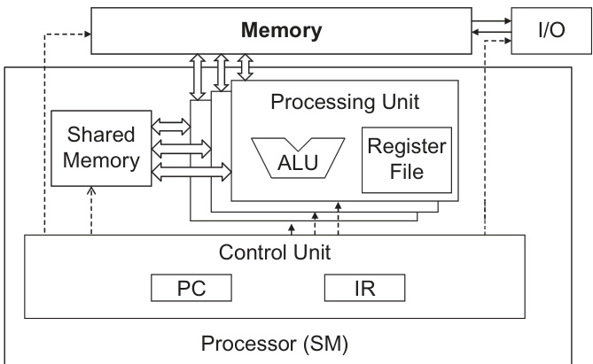
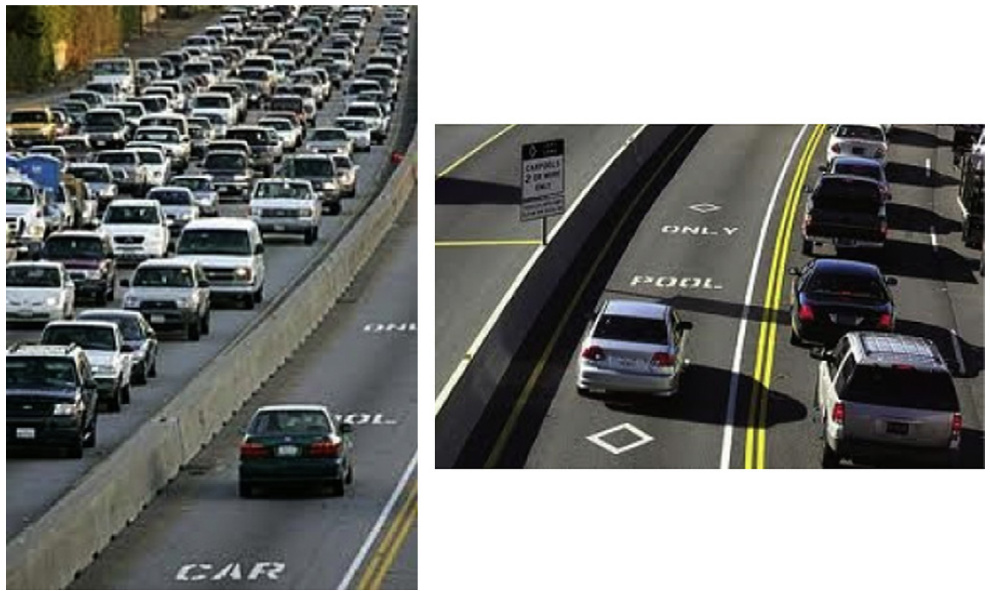
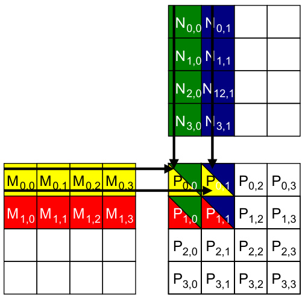
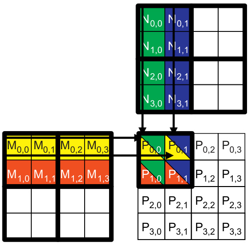
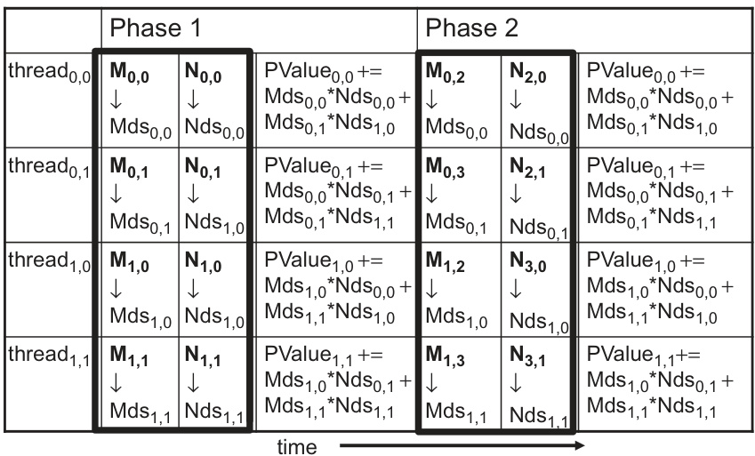
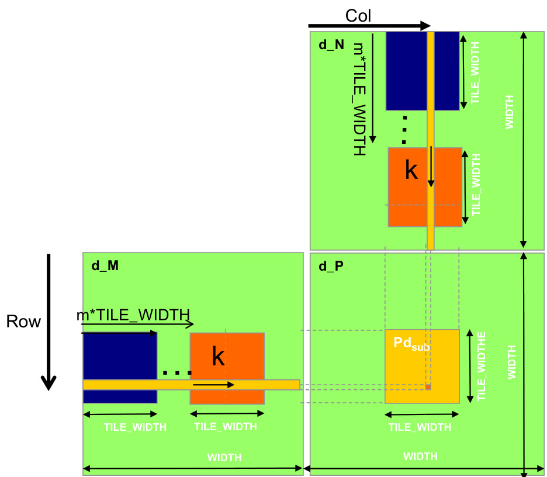
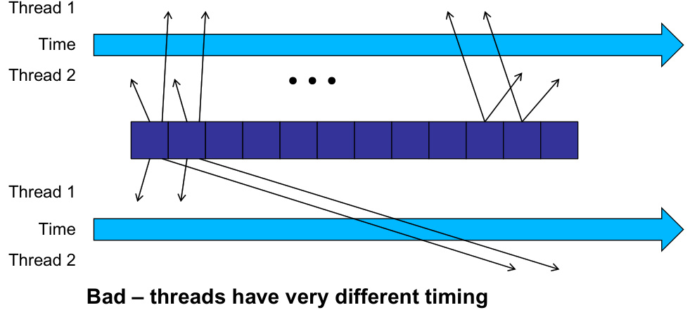
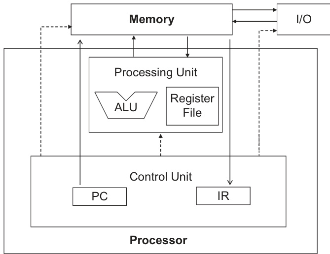
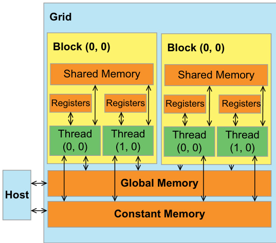
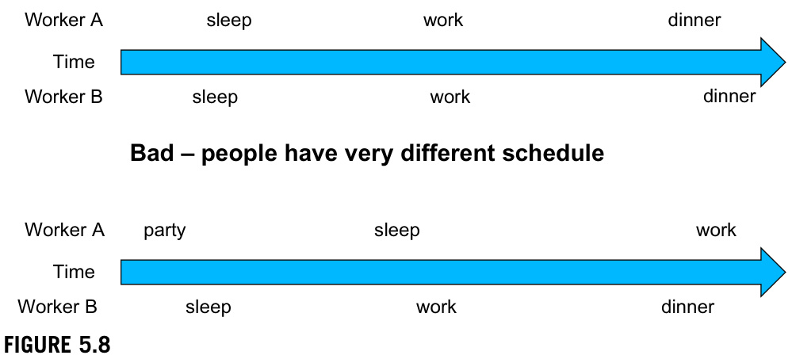

The image illustrates the von Neumann architecture for a CUDA device Streaming Multiprocessor (SM), as described in Chapter 5 of the document. The diagram highlights the interaction between the 'Memory', 'Processing Unit' (containing the ALU and Register File), 'Control Unit' (with PC and IR), 'Shared Memory', and 'I/O' components within the processor. Dashed lines indicate data flow, with solid lines indicating data transfer pathways between different functional blocks, representing how data and instructions move within the SM.

The image, referenced on page 106 of Chapter 5, illustrates the global memory accesses performed by threads within a block in a CUDA environment. It depicts a table where rows represent threads and columns represent the order of memory access, with each cell containing a multiplication operation involving elements from matrices M and N. The figure highlights data re-use, showing how multiple threads access the same memory locations, specifically elements M0,0 and N1,0, which are framed in red and blue respectively, demonstrating the potential for optimizing memory traffic through thread collaboration.

A imagem representa uma comparação visual de engarrafamentos em rodovias, destacando a diferença entre o uso de faixas convencionais e faixas exclusivas para caronas (carpool lanes). No lado esquerdo, observa-se um tráfego intenso em faixas convencionais, enquanto no lado direito, as faixas de carona apresentam um fluxo mais livre. A imagem é usada no Capítulo 5, especificamente na seção 5.3 (página 107), para ilustrar o conceito de redução de tráfego e congestionamento, analogamente à otimização de acessos à memória em programação CUDA através de técnicas de "tiling" e compartilhamento de dados entre threads, visando melhorar a eficiência e reduzir a latência.

Table 5.1, located on page 102 of the document, outlines CUDA variable type qualifiers. It defines the memory location, scope, and lifetime of variables based on their declaration. The table contrasts automatic variables with those explicitly declared using `__device__`, `__shared__`, or `__constant__`, indicating how each is managed within the CUDA memory model.

The image illustrates the concept of matrix tiling in matrix multiplication as described in Section 5.3 of the document, showing how matrices M and N are divided into tiles (in this case, 2x2 tiles) for processing. Arrows indicate data flow from the input tiles of matrices M and N to create the output matrix P, highlighting the tiled structure and data dependencies for computing elements P0,0, P0,1, P1,0, and P1,1. This organization is relevant to CUDA memory access optimization, facilitating efficient use of shared memory.

The image illustrates a tiled matrix multiplication, corresponding to the discussion in Section 5.3, showing how data is partitioned into tiles for processing by CUDA threads. It depicts the partitioning of input matrices M and N, along with the resulting matrix P, into 2x2 tiles, where specific threads (e.g., thread(0,0) and thread(0,1)) access and process elements within these tiles. Arrows indicate data flow, emphasizing the collaborative loading of tiles into shared memory to reduce global memory accesses and enhance data locality.

The image illustrates the execution phases of a tiled matrix multiplication in CUDA, as discussed in Section 5.4 and visualized in Figure 5.11 of the document. It depicts a two-phase process where threads within a block collaboratively load tiles of matrices M and N into shared memory (Mds and Nds), followed by computations using these shared tiles to accumulate products into the Pvalue variable. The diagram shows the data flow for four threads, highlighting how values are fetched from global memory and stored in shared memory for efficient reuse during the computation phases, crucial for minimizing global memory accesses.

A imagem ilustra o cálculo dos índices de matriz em uma multiplicação em mosaico, conforme discutido na página 114 do documento. Ela demonstra como os elementos d_M e d_N são acessados e combinados para calcular um elemento d_P, com destaque para o uso de TILE_WIDTH para particionar as matrizes e o papel de Row, Col e m no processo. A figura também ajuda a entender como os threads colaboram para carregar os dados em memória compartilhada e realizar a multiplicação.

The image, found in Chapter 5 (CUDA Memories), specifically referenced as Figure 5.9 on page 109, illustrates the timing of data accesses in tiled algorithms, contrasting scenarios with similar and very different timings. The top half depicts two threads accessing data with similar timing, while the bottom half shows threads with significantly different access timings to the data, with the blue horizontal arrow representing the timeline of both threads. It serves to demonstrate the importance of synchronizing threads' data access patterns when using tiled algorithms to improve performance.

The image illustrates the von Neumann model, a fundamental architecture for modern computers. It depicts a processor comprising a Control Unit (with PC and IR), a Processing Unit (containing ALU and Register File), and Memory, interconnected with I/O. The model emphasizes the stored-program concept, where instructions and data are stored in memory, allowing for flexible computer behavior as described on page 97.

The image, referenced on page 97 and again on page 98 as Figure 5.2, illustrates the CUDA device memory model, showing a grid of thread blocks each with shared memory and registers. It highlights the hierarchy of memory access from threads to shared memory and registers within blocks, and from the host to global and constant memory, detailing the different scopes and access permissions associated with each type of memory, which is pivotal for achieving high compute to global memory access (CGMA) ratios in CUDA kernels.

Figure 5.8 illustrates the importance of synchronized schedules for effective carpooling, drawing an analogy to tiled algorithms in CUDA programming, which are discussed in Section 5.3. The top diagram represents a favorable scenario where Worker A and Worker B have similar schedules, allowing for easy coordination. Conversely, the bottom diagram depicts a problematic scenario where Worker A and Worker B have drastically different schedules, hindering the ability to carpool effectively and highlighting the need for threads with similar data access patterns to cooperate and reduce memory traffic in CUDA kernels.
