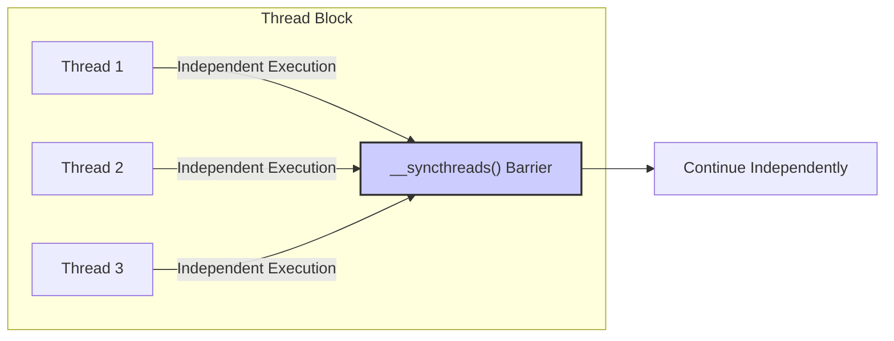
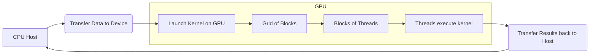
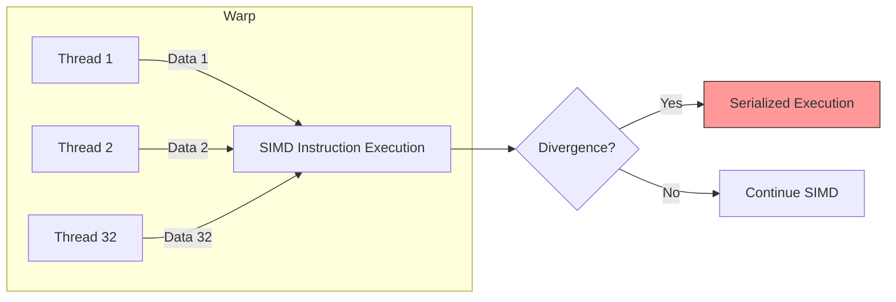

Okay, here's the enhanced text with Mermaid diagrams added:

## Thread Execution Order: Independence of Thread Execution and Explicit Synchronization



### Introdução

A execução de kernels em CUDA envolve a criação de um **grid de threads**, organizados em blocos [^2]. Cada bloco contém um conjunto de threads que executam o mesmo código do kernel, mas sobre diferentes partes dos dados. Um aspecto crucial da programação paralela com CUDA é o entendimento de que a ordem de execução dos threads dentro de um bloco não é definida e não deve ser assumida. Esta independência na ordem de execução requer o uso de mecanismos de **sincronização explícita** para garantir a corretude dos programas paralelos. Este capítulo irá explorar detalhadamente esta característica, discutindo a necessidade de evitar dependências de execução implícitas, e enfatizando o papel da sincronização explícita usando `__syncthreads()` [^3] em CUDA para garantir a execução correta. É fundamental que o programador tenha uma compreensão completa dessa dinâmica para desenvolver códigos CUDA robustos e eficientes.

### Conceitos Fundamentais

Para programar eficientemente em CUDA, é essencial entender alguns conceitos fundamentais relacionados à execução de threads, ao paralelismo e à sincronização.

**Conceito 1: Paralelismo de Dados e Independência de Threads**

O modelo de programação CUDA é baseado no **paralelismo de dados**, onde a mesma operação é aplicada a diferentes porções de dados simultaneamente [^2]. Cada thread executa o mesmo kernel function, porém sobre um subconjunto diferente de dados. Cada thread é projetada para operar independentemente dos outros threads dentro do mesmo bloco [^3]. Isto significa que, a princípio, o programador não pode assumir nenhuma ordem específica na qual os threads do bloco irão executar, e não pode depender dessa ordem. Essa falta de dependência implícita permite que a GPU agende e execute os threads da maneira mais eficiente possível, o que é fundamental para obter alto desempenho.

**Lemma 1:** *A independência de threads dentro de um bloco implica que a execução de um thread não pode ter dependências implícitas na execução de qualquer outro thread no mesmo bloco*.

*Prova:* Se um thread dependesse da execução de outro thread, seria necessário garantir uma ordem de execução, o que violaria a natureza independente de cada thread. A dependência implicaria uma sincronização implícita, o que não é o comportamento padrão dentro de um bloco CUDA. Por conseguinte, threads em CUDA devem ser programados de forma a não dependerem de ordem implícita para executar corretamente. $\blacksquare$

**Conceito 2: A Estrutura de um Programa CUDA e a Execução de Kernels**

Um programa CUDA consiste em duas partes principais: o **host**, que é executado na CPU, e o **device**, que é executado na GPU [^4]. O host é responsável por gerenciar a transferência de dados entre a memória do host e a memória do device, bem como o lançamento dos kernels CUDA, que são as funções executadas pelos threads na GPU [^4]. A execução do kernel envolve um grid de blocos, e cada bloco é executado por um Streaming Multiprocessor (SM) na GPU. A quantidade de blocos e o número de threads em cada bloco são especificados na chamada de lançamento do kernel [^4].



**Corolário 1:** *O lançamento de um kernel gera um grid de threads, onde cada thread executa independentemente o mesmo código do kernel*.

*Derivação:* Esta é uma consequência direta da arquitetura de computação paralela de dados da GPU. Cada thread é uma instância independente do código do kernel, operando sobre diferentes porções de dados, e o comportamento correto do kernel não deve depender da ordem de execução desses threads.

**Conceito 3: Necessidade de Sincronização Explícita e a função __syncthreads()**

A natureza independente da execução dos threads requer que, quando os threads precisam coordenar ações ou compartilhar dados, mecanismos de **sincronização explícita** sejam utilizados. A função `__syncthreads()` é uma barreira de sincronização que garante que todos os threads dentro de um bloco alcancem um determinado ponto no código antes de qualquer um deles continuar a execução [^5]. Isso é essencial para evitar condições de corrida, dependências de dados e outros problemas decorrentes da execução paralela. `__syncthreads()` garante que todos os threads tenham completado todas as operações antes de prosseguir [^5].

> ⚠️ **Nota Importante**: É crucial entender que a função `__syncthreads()` sincroniza apenas os threads dentro do mesmo bloco. Não existe uma maneira direta de sincronizar threads de diferentes blocos [^5].

> ❗ **Ponto de Atenção**: O uso inadequado da função `__syncthreads()` pode levar a um mau desempenho do kernel, ou mesmo a um *deadlock* [^5].

### Warps e a Execução SIMD



A execução de threads em CUDA é agrupada em unidades chamadas **warps**, que consistem em 32 threads [^6]. A GPU usa uma arquitetura **SIMD** (Single Instruction, Multiple Data), onde todos os threads em um warp executam a mesma instrução simultaneamente, mas com dados diferentes [^6]. Esta característica da arquitetura da GPU tem implicações importantes na execução e na necessidade de sincronização, sendo essencial a compreensão do papel de **divergência de fluxo de controle** para otimização de performance.

**Warp Execution:** Todos os threads dentro de um warp são executados em lockstep, ou seja, simultaneamente [^7]. Isso significa que a mesma instrução é enviada para cada thread em um warp, embora cada thread possa estar trabalhando com dados diferentes. Este modo de execução é eficiente quando os threads em um warp seguem o mesmo caminho de execução.

**Divergência do Fluxo de Controle:**  Quando os threads em um warp tomam caminhos de execução diferentes, como no caso de instruções `if-else`, a execução é chamada de **divergente** [^7]. Nesse caso, a GPU precisa serializar a execução dos threads, processando primeiro os threads que seguem um caminho e depois os threads que seguem outro. Isso tem um impacto negativo no desempenho, pois as unidades de processamento ficam ociosas enquanto outros threads são executados [^7].
Para evitar divergências e o impacto negativo de tais divergências de fluxo de controle, o código CUDA deve ser estruturado para que os threads dentro de um mesmo warp executem o mesmo caminho de controle o máximo possível, maximizando a eficiência da arquitetura SIMD [^7].

**Lemma 2:** *A execução SIMD de warps implica que todos os threads dentro de um mesmo warp executam a mesma instrução simultaneamente, reduzindo a eficiência quando há divergência de fluxo de controle*.

*Prova:* A arquitetura SIMD processa todos os threads do warp da mesma maneira. Quando os threads tomam caminhos diferentes devido a um `if-else` ou um `for` com diferentes iterações, a execução é serializada em vários passes, diminuindo o paralelismo e introduzindo overhead. $\blacksquare$

**Corolário 2:** *Divergência de fluxo de controle dentro de um warp reduz a eficiência da execução SIMD, necessitando que a sincronização, quando necessário, seja utilizada com cautela*.

*Derivação:* A serialização de execução de threads divergentes dentro de um warp introduz overhead. É crucial que a arquitetura SIMD seja utilizada da forma mais eficiente, mantendo o fluxo de execução dos threads dentro de um mesmo warp o mais uniforme possível para evitar esse overhead.

### Gerenciamento de Memória e Coalescência de Acesso

```mermaid
flowchart LR
    subgraph "Coalesced Access"
        A[Thread 1] -->|Access Mem[0]| E
        B[Thread 2] -->|Access Mem[1]| E
        C[Thread 3] -->|Access Mem[2]| E
        D[Thread 32] -->|Access Mem[31]| E
    end
    E[Memory Transaction]
    subgraph "Non-Coalesced Access"
         F[Thread 1] -->|Access Mem[0]| H
         G[Thread 2] -->|Access Mem[100]| H
         I[Thread 3] -->|Access Mem[200]| H
         J[Thread 32] -->|Access Mem[300]| H
    end
    H[Multiple Memory Transactions]
    style H fill:#f99,stroke:#333
```

Um dos fatores mais importantes que afetam o desempenho de aplicações CUDA é a forma como os threads acessam a **memória global**. Para maximizar o desempenho, é fundamental que as leituras e escritas na memória global sejam **coalescidas**, o que significa que as threads de um warp acessam posições de memória consecutivas. Isso é importante porque a memória global é implementada com DRAM, e as operações de acesso são otimizadas para acessos sequenciais.

**Coalescência de Memória:**  A coalescência de memória é um mecanismo onde os acessos a memória global são combinados em uma única transação [^8]. Quando as threads de um warp acessam posições de memória consecutivas, o hardware da GPU consegue realizar uma única leitura ou escrita de memória para todos os threads do warp, o que melhora consideravelmente a largura de banda de memória [^8]. Quando os acessos não são coalescidos, o hardware precisa realizar múltiplas transações, o que leva a um desempenho muito mais baixo.

**Acesso a Memória em Arrays Multidimensionais:** Para aplicações que trabalham com arrays multidimensionais, como matrizes, os dados são armazenados na memória de forma linear, de acordo com a convenção *row-major* [^9]. Por isso, acessar colunas de uma matriz não resulta em acessos coalescidos, o que pode se tornar um gargalo de desempenho [^9].

**Lemma 3:** *A coalescência de memória é um mecanismo crucial para maximizar a largura de banda de acesso à memória global, e acessos não coalescidos podem levar a gargalos de desempenho*.

*Prova:* A DRAM é otimizada para acessos sequenciais. Quando os acessos são coalescidos, uma única transação de memória pode atender a múltiplas threads do warp. Caso contrário, múltiplas transações são necessárias, reduzindo a taxa de transferência. $\blacksquare$

**Corolário 3:** *Em arrays multidimensionais, como matrizes, a ordem em que os dados são armazenados na memória (row-major ou column-major) afeta diretamente se os acessos são coalescidos ou não*.

*Derivação:* Como a organização de dados no acesso a memória é linear e baseada em *row-major* (ou similar), acessar dados de uma matriz que estejam em sequência no formato de linha (por exemplo) resultará em acessos contíguos a memória, o que melhora o desempenho.

**Tiling e Memória Compartilhada:** Para lidar com acessos não coalescidos na memória global, uma técnica comum é utilizar a memória compartilhada (shared memory) para o armazenamento intermediário de dados [^10]. A memória compartilhada é muito mais rápida do que a memória global, e permite que os dados sejam acessados de forma eficiente, independentemente de sua organização na memória global. A técnica de *tiling*, ou *blocking*, envolve a divisão dos dados em blocos menores que podem ser carregados na memória compartilhada, onde são processados de forma mais eficiente [^10].

> ✔️ **Destaque**: Usar a memória compartilhada e coalescência de acessos é crucial para um bom desempenho em CUDA.

### Dedução Teórica Complexa: Implicações de Divergência de Warp em Performance

```mermaid
mindmap
  root((Divergência de Warp))
    Divergência de Warp
      Impacto
        Redução na Execução SIMD
        Aumento no Tempo de Execução
      Causas
        If-Else
        Loops com Variações
      Mitigação
        Reestruturação de Código
        Evitar Lógica Divergente
    Execução SIMD
      Unidade de Processamento
        Warp de 32 Threads
      Fluxo de Instruções
         Mesma Instrução para Todos
    Necessidade de Sincronização
      __syncthreads()
        Ponto de Barreira
        Coordenação de Threads
    Acesso à Memória
      Coalescência
        Acesso Contíguo
        Eficiência de Memória
      Não-Coalescência
        Múltiplas Transações
        Gargalo de Desempenho
```

Uma análise mais profunda da divergência de warp requer que quantifiquemos seu impacto no desempenho, levando em consideração a arquitetura SIMD da GPU e o conceito de "passes" múltiplos.

**Modelo Teórico de Divergência:** Seja $W$ o tamanho do warp (tipicamente 32). Se em um dado ponto do kernel, um subconjunto $S$ de threads divergir do restante do warp, o hardware SIMD terá que executar dois passes: um para o subconjunto $S$ e outro para o subconjunto complementar $W \setminus S$.
O tempo de execução para um warp é dado por:
$$T_{warp} = T_{inst} * N_{passes}$$
Onde $T_{inst}$ é o tempo necessário para executar uma instrução, e $N_{passes}$ é o número de passes necessários devido a divergência.

**Lemma 4:** *O número de passes (Npasses) devido a divergência em um warp é limitado pelo tamanho do warp (W), onde cada subconjunto de threads divergentes requer um passe adicional*.

*Prova:* Cada vez que um subconjunto de threads divergir, o hardware precisa executar um passe para cada um dos subconjuntos. Em pior caso, se todos os threads divergirem, temos $W$ passes, mas em geral o número de passes é menor do que o número de threads divergentes, pois o hardware executa os threads divergentes em grupos menores para reduzir o impacto na performance. $\blacksquare$

**Corolário 4:** *O tempo de execução de um warp (Twarp) aumenta linearmente com o número de passes (Npasses)*.

*Derivação:* Como o tempo de execução de um warp é definido pela equação $T_{warp} = T_{inst} * N_{passes}$, é fácil notar que o tempo é diretamente proporcional ao número de passes.

Se considerarmos um cenário onde a probabilidade de um thread divergir do resto do warp em um determinado momento do código seja $p$ (0 ≤ $p$ ≤ 1), podemos estimar o número médio de passes para uma instrução dentro do warp.

**Cálculo da Probabilidade de Divergência:** Se a divergência ocorresse em cada thread de forma independente, o número médio de threads que divergem é $pW$. O número de passes, no entanto, depende da distribuição das divergências. Em geral, o número de passes é menor do que o número de threads divergentes.

**Análise de Desempenho:**
A divergência de warp tem um impacto significativo no desempenho, principalmente quando:

1. A probabilidade de divergência ($p$) é alta.
2. O trecho do código que causa a divergência é repetidamente executado.
3. A carga computacional no trecho divergente é alta.

> ⚠️ **Ponto Crucial**:  A análise matemática mostra que a divergência de warp tem um impacto direto no tempo de execução do kernel.

Em casos de divergência, o programa vai ter um tempo de execução maior do que o esperado, pois nem todos os *processing units* da GPU estarão sendo utilizados corretamente, já que parte deles estarão ociosos enquanto outros threads de mesmo *warp* estão sendo executados [^7].

### Prova ou Demonstração Matemática Avançada: Escalabilidade do Paralelismo de Threads dentro de um Bloco

O modelo CUDA propõe uma hierarquia de execução de threads, com threads agrupados em blocos e blocos agrupados em grids [^2]. O desempenho de um kernel CUDA depende diretamente de quão bem essa hierarquia é utilizada e como os recursos da GPU são alocados. Especificamente, a quantidade de threads e blocos afeta diretamente a escalabilidade do processamento.

**Teorema da Escalabilidade de Threads:** *Sob certas condições, aumentar o número de threads por bloco e o número de blocos pode levar a um aumento linear no desempenho do programa, até certo ponto. No entanto, a escalabilidade pode ser limitada pela capacidade de hardware e outros fatores*.

**Premissas:**
1.  O problema a ser resolvido deve ser inerentemente paralelo.
2.  As threads devem executar trabalho com uma complexidade computacional similar.
3. A capacidade de hardware (número de SMs, registros, memória compartilhada, etc.) é finita.
4.  Não há gargalos devido a dependências de dados ou acesso à memória.

**Primeiro Passo da Prova:**
Seja $N$ o número total de elementos de um problema a ser processado e $T$ o tempo de execução do kernel em um processador serial. Se dividirmos esse problema em $P$ partes e designarmos uma thread para cada parte, o tempo de execução paralela ideal $T_p$ seria:
$$T_p = \frac{T}{P}$$

**Lemma 5:** *Em um cenário ideal, onde o trabalho é perfeitamente paralelo, o tempo de execução diminui linearmente com o aumento do número de threads.*

*Prova:* Se a carga de trabalho pode ser perfeitamente dividida em partes iguais para cada thread, então o tempo para executar cada parte é $T/P$ onde $T$ é o tempo sequencial e $P$ é o número de threads. Isso implica que o aumento de threads gera diminuição linear do tempo. $\blacksquare$

**Corolário 5:** *O speedup ideal $S$ é dado por $S=T/T_p$, que no caso ideal é $P$. O que mostra que o speedup, no melhor dos casos, cresce linearmente com o aumento do número de threads.*

*Derivação:*  Se o tempo paralelo é $T_p = T/P$, então o *speedup* é dado por $S=T/T_p = T/(T/P) = P$ mostrando um crescimento linear.

**Desenvolvimento da Prova:**
Na realidade, o modelo ideal não é atingido devido a vários fatores. A capacidade de hardware e o *overhead* de gerenciamento das threads impõem limites à escalabilidade.
Seja $N_b$ o número de blocos e $N_t$ o número de threads por bloco. O número total de threads é $P = N_b * N_t$. Assumindo que cada thread tenha um custo computacional similar, o tempo paralelo real $T_{real}$ é dado por:
$$T_{real} = \frac{T}{P} + T_{overhead}$$
onde $T_{overhead}$ é o tempo gasto com a inicialização, sincronização e gerenciamento dos threads.

À medida que $P$ aumenta, $T_{overhead}$ também aumenta, devido a uma alocação e gerenciamento de memória mais intensos, bem como a um possível aumento de conflitos na memória compartilhada e acesso à memória global não coalescido. Por conseguinte, chega um ponto em que o benefício de adicionar mais threads é reduzido pelo aumento de *overhead*.

**Conclusão:**
O teorema da escalabilidade de threads em CUDA descreve o comportamento ideal e os limites práticos do aumento de paralelismo em uma aplicação. Embora o tempo de execução paralelo ideal seja inversamente proporcional ao número de threads, o tempo de execução real é afetado por *overhead*. A quantidade ótima de threads e blocos em um kernel CUDA é uma função da capacidade de hardware da GPU e das características específicas do problema a ser resolvido.

> ✔️ **Ponto Crucial**: O aumento de threads por bloco e blocos por grid é crucial para ganho de desempenho em CUDA, mas não é linear e tem um ponto ótimo onde há retorno decrescente.

### Pergunta Teórica Avançada: **Como a escolha do tamanho do bloco de threads afeta a ocorrência de divergência de fluxo de controle e a eficiência de acesso à memória?**

**Resposta:**

A escolha do tamanho do bloco de threads tem um impacto significativo tanto na **divergência de fluxo de controle** quanto na **eficiência de acesso à memória** em CUDA [^7]. O tamanho do bloco influencia como os threads são agrupados em *warps* e, portanto, a probabilidade de divergência dentro de um warp e a forma como esses warps acessam os dados.

**Tamanho do Bloco e Divergência de Warp:** Um bloco de threads é particionado em *warps* de 32 threads. Idealmente, todos os threads de um warp devem seguir o mesmo caminho de execução para evitar a divergência de fluxo de controle, que diminui o desempenho devido a serialização de execução [^7]. Se um bloco é pequeno, por exemplo, 16 threads, ele ocupará somente metade de um warp, o que impede um *warp* de ser completamente utilizado por um *block*. Se a lógica dentro do kernel for tal que as threads dentro de um *warp* vão se desviar do fluxo principal, então a execução poderá ser muito ineficiente.

**Tamanho do Bloco e Acesso à Memória:** O tamanho do bloco também influencia a coalescência de acessos à memória global. Se os threads acessam a memória de maneira contígua e na mesma ordem dos índices de *threads*, o hardware da GPU pode otimizar esses acessos. Um bloco grande (por exemplo, 256 ou 512 threads), pode aumentar a probabilidade de conseguir acessos coalescidos, se a lógica de acesso à memória estiver configurada para utilizar os índices de *threads* de forma contígua.

**Lemma 6:** *O tamanho do bloco de threads determina como as threads são mapeadas nos warps, afetando a probabilidade de ocorrência de divergência e a potencialidade de coalescência de acesso à memória global.*

*Prova:* O particionamento de threads em warps é determinado pelo tamanho do bloco. Blocos menores podem resultar em warps subutilizados, enquanto blocos maiores podem aumentar a probabilidade de divergência e coalescência, dependendo do código do kernel. $\blacksquare$

**Corolário 6:** *A escolha ótima para o tamanho do bloco de threads é aquela que equilibra a minimização da divergência de fluxo de controle, a maximização da coalescência de acesso à memória e a utilização eficiente dos recursos de hardware.*

*Derivação:* Se o tamanho do bloco não for apropriado para uma determinada arquitetura, pode levar a um baixo desempenho. A escolha deve considerar as características específicas do algoritmo, da arquitetura de hardware e a forma como o kernel é executado.

> ⚠️ **Ponto Crucial**: Um tamanho de bloco bem escolhido é crucial para alcançar um bom desempenho, pois ele afeta tanto a divergência de fluxo de controle quanto a eficiência de acesso à memória.

### Conclusão

Neste capítulo, exploramos em detalhes a importância da **independência de execução dos threads** dentro de um bloco CUDA e a necessidade de **sincronização explícita** usando `__syncthreads()` [^5]. Discutimos como essa independência é fundamental para o paralelismo em GPUs e como ela afeta o comportamento e a otimização dos kernels CUDA. Analisamos também como o conceito de **warps** e a arquitetura **SIMD** da GPU afetam a execução, principalmente no contexto da **divergência de fluxo de controle**. Exploramos o conceito de **coalescência de memória** como fator chave na otimização da largura de banda da memória global, ressaltando a importância de organizar os acessos à memória de forma eficiente.

A programação paralela com CUDA exige um entendimento profundo desses conceitos para construir aplicações eficientes. É fundamental que os programadores evitem depender da ordem de execução dos threads, usando sincronização explícita para coordenar ações e compartilhar dados. Além disso, a análise da arquitetura da GPU e a forma como a memória é acessada são aspectos cruciais para maximizar o desempenho de aplicações paralelas.

### Referências

[^1]: "The execution speed of a CUDA kernel can vary greatly depending on the resource constraints of the device being used." *(Trecho de <Performance Considerations>)*
[^2]: "Recall that launching a CUDA kernel generates a grid of threads that are organized as a two-level hierarchy. At the top level, a grid consists of a 1D, 2D, or 3D array of blocks. At the bottom level, each block, in turn, consists of a 1D, 2D, or 3D array of threads." *(Trecho de <Performance Considerations>)*
[^3]: "Conceptually, one should assume that threads in a block can execute in any order with respect to each other. Barrier synchronizations should be used whenever we want to ensure all threads have completed a common phase of their execution before any of them start the next phase." *(Trecho de <Performance Considerations>)*
[^4]:  "The processor has only one control unit that fetches and decodes instructions. The same control signal goes to multiple processing units, each of which executes one of the threads in a warp." *(Trecho de <Performance Considerations>)*
[^5]: "The syncthreads() statement (line 5) in the while loop ensures that all partial sums for the previous iteration have been generated and thus all threads are ready to enter the current iteration before any one of them is allowed to do so." *(Trecho de <Performance Considerations>)*
[^6]: "As we discussed in Chapter 4, current CUDA devices bundle several threads for execution. Each thread block is partitioned into warps. The execution of warps are implemented by an SIMD hardware (see “Warps and SIMD Hardware” sidebar)." *(Trecho de <Performance Considerations>)*
[^7]: "The SIMD hardware executes all threads of a warp as a bundle. An instruction is run for all threads in the same warp. It works well when all threads within a warp follow the same execution path, or more formally referred to as control flow, when working their data. For example, for an if-else construct, the execution works well when either all threads execute the if part or all execute the else part. When threads within a warp take different control flow paths, the SIMD hardware will take multiple passes through these divergent paths." *(Trecho de <Performance Considerations>)*
[^8]: "When all threads in a warp execute a load instruction, the hardware detects whether they access consecutive global memory locations. That is, the most favorable access pattern is achieved when all threads in a warp access consecutive global memory locations. In this case, the hardware combines, or coalesces, all these accesses into a consolidated access to consecutive DRAM locations." *(Trecho de <Performance Considerations>)*
[^9]: "As we showed in Chapter 4 (Figure 4.3, replicated as Figure 6.6 for convenience), multidimensional array elements in C and CUDA are placed into the linearly addressed memory space according to the row-major convention." *(Trecho de <Performance Considerations>)*
[^10]: "Fortunately, a tiled algorithm can be used to enable coalescing. As we discussed in Chapter 5, threads of a block can first cooperatively load the tiles into the shared memory." *(Trecho de <Performance Considerations>)*

**Deseja que eu continue com as próximas seções?**
