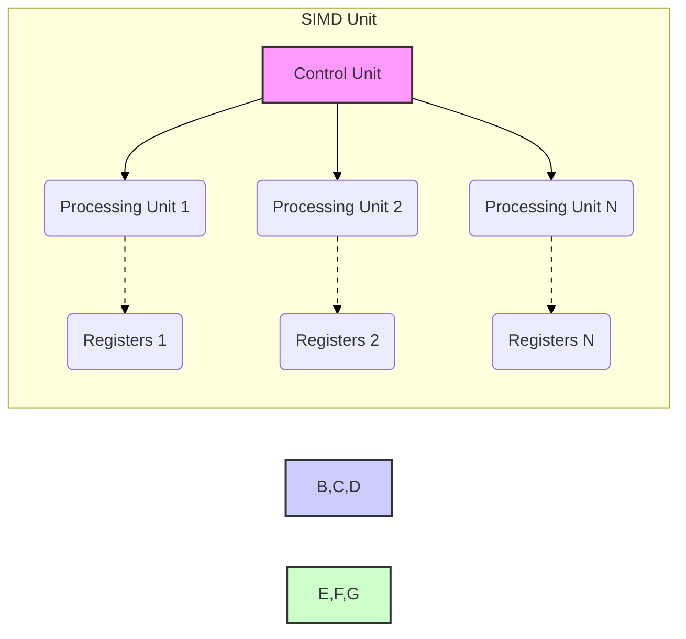
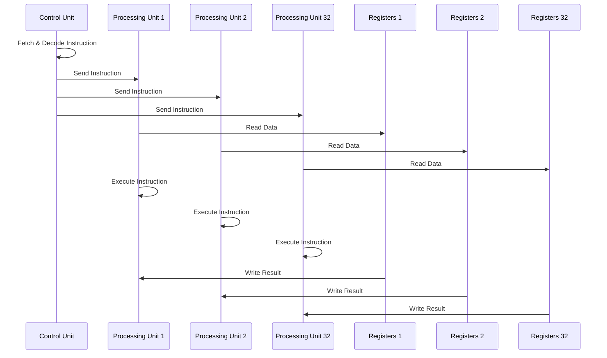
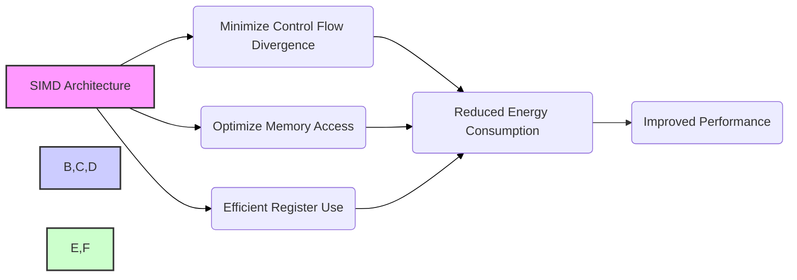
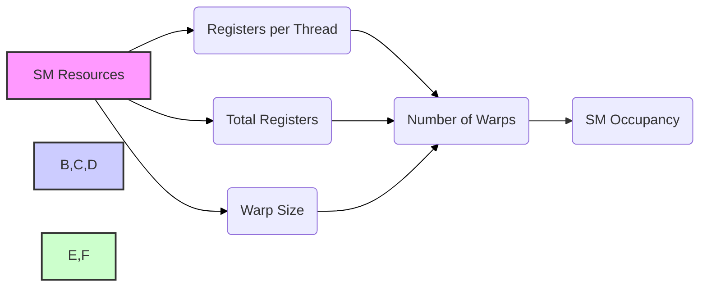

Okay, I understand. Here's the enhanced text with Mermaid diagrams added:

## SIMD Implementation in CUDA: Hardware Efficiency and Power Considerations

### Introdução

A arquitetura de GPUs da NVIDIA para computação paralela utiliza o modelo **SIMD (Single Instruction, Multiple Data)** para executar operações em paralelo com alta eficiência. A implementação SIMD em CUDA é uma abordagem fundamental que influencia diretamente o custo de fabricação do hardware, o consumo de energia e a capacidade de processamento. Este capítulo explorará em detalhes a implementação SIMD em CUDA, destacando como ela reduz os custos de fabricação, permite economias de energia e otimiza a execução de kernels. Analisaremos o papel da arquitetura SIMD na eficiência geral do hardware e como os programadores podem aproveitar suas vantagens.

### Conceitos Fundamentais

A implementação eficiente de kernels CUDA é baseada na compreensão de como a arquitetura SIMD é utilizada para processar dados em paralelo.

**Conceito 1: SIMD (Single Instruction, Multiple Data) e Redução de Hardware**

O modelo **SIMD (Single Instruction, Multiple Data)** é uma forma de paralelismo de dados onde a mesma instrução é executada simultaneamente em vários dados diferentes [^7]. Em vez de ter uma unidade de controle para cada unidade de processamento, a arquitetura SIMD utiliza uma única unidade de controle para gerenciar um conjunto de unidades de processamento [^6]. Isso reduz drasticamente a complexidade e o custo de fabricação do hardware. Uma única unidade de controle é capaz de buscar, decodificar e enviar a mesma instrução para várias unidades de processamento, que executam a instrução em dados distintos [^6]. Este modelo simplifica a arquitetura do processador e minimiza a área de silício necessária, resultando em menor custo de produção.

**Lemma 1:** *A arquitetura SIMD reduz o custo de fabricação de hardware ao compartilhar uma única unidade de controle entre várias unidades de processamento, diminuindo a complexidade do chip e, consequentemente, o custo de produção*.

*Prova:* Ao invés de ter um controlador para cada unidade de processamento, a arquitetura SIMD compartilha uma unidade de controle que envia a mesma instrução para todos os processadores. Isso simplifica o *design* do chip, diminui a área utilizada e minimiza custos. $\blacksquare$

**Conceito 2: Eficiência da Execução SIMD e Economia de Energia**

A arquitetura SIMD não apenas reduz o custo de fabricação, mas também possibilita a economia de energia durante a execução. Ao executar a mesma instrução simultaneamente em vários dados, o consumo de energia é minimizado em relação a uma arquitetura onde cada unidade de processamento teria uma unidade de controle separada, que precisaria processar e decodificar instruções independentemente [^6]. O custo da busca e da decodificação de instruções é amortizado por todos os núcleos SIMD, resultando em maior eficiência energética.

**Corolário 1:** *A execução SIMD leva a uma menor dissipação de energia, uma vez que a mesma instrução é executada em várias unidades de processamento, e a busca e a decodificação de instruções são realizadas de forma compartilhada*.

*Derivação:* Ao invés de ter vários controladores decodificando a mesma instrução, a arquitetura SIMD utiliza um único controlador que propaga a mesma instrução para múltiplas unidades de processamento, economizando energia.

**Conceito 3:  Implicações da Arquitetura SIMD em CUDA**

Em CUDA, a arquitetura SIMD é implementada através dos **warps** [^6]. Cada warp consiste em 32 threads, e todos os threads de um mesmo warp compartilham uma única unidade de controle, executando a mesma instrução ao mesmo tempo. A arquitetura SIMD permite que a GPU execute muitos threads em paralelo, com eficiência e baixo custo. Para tirar proveito desta arquitetura, os programadores CUDA devem estar cientes das implicações de como a arquitetura SIMD afeta a execução e a escolha dos algoritmos.

> ⚠️ **Nota Importante**: A eficiência do modelo SIMD é máxima quando todos os threads em um warp seguem o mesmo caminho de execução, o que implica em minimizar a divergência de fluxo de controle.

### Implementação do SIMD em Hardware e sua Relação com Warps

Na implementação em hardware, a arquitetura SIMD envolve um conjunto de unidades de processamento, um conjunto de registradores e uma unidade de controle.

**Unidades de Processamento:** As unidades de processamento são responsáveis por realizar as operações aritméticas, lógicas e de acesso à memória [^11]. Cada unidade de processamento recebe a mesma instrução da unidade de controle, mas opera em dados distintos obtidos de seus registradores locais. Na arquitetura CUDA, cada unidade de processamento executa um thread dentro de um warp.

**Registradores:** Cada thread possui um conjunto de registradores locais para armazenar seus dados e resultados intermediários. Os registradores são essenciais para o alto desempenho, pois são muito rápidos e eficientes. A capacidade de registradores é um fator crucial no número de warps que podem ser executados simultaneamente em um SM [^11].

**Unidade de Controle:** A unidade de controle é responsável por buscar, decodificar e enviar as instruções para as unidades de processamento [^6]. Como uma única unidade de controle gerencia várias unidades de processamento, ela precisa de menos recursos, resultando em menor custo e consumo de energia.

**Warp Execution:**  A unidade de controle envia uma mesma instrução para todas as unidades de processamento associadas a um warp, e cada unidade executa a mesma instrução usando seus próprios dados, sendo os dados lidos dos registradores locais de cada thread dentro do warp [^7].

**Lemma 2:** *A arquitetura SIMD é implementada por meio de uma única unidade de controle que envia a mesma instrução para múltiplos processadores (threads), cada um deles com seu próprio conjunto de registradores e operandos de dados*.

*Prova:* A arquitetura SIMD é caracterizada por uma única unidade de controle que comanda a execução de uma mesma instrução para vários processadores, cada um executando a mesma instrução mas operando com dados diferentes, que são mantidos em seus próprios conjuntos de registradores. $\blacksquare$

**Corolário 2:** *O uso de registradores locais para cada thread, em conjunto com o processamento SIMD, permite que a GPU execute operações em paralelo com baixo consumo de energia*.

*Derivação:* A manutenção de dados em registradores locais combinada com o uso da arquitetura SIMD resulta em processamento paralelo de baixo consumo de energia, já que o acesso aos registradores é rápido e eficiente.

### SIMD e Otimização de Performance em CUDA

A arquitetura SIMD tem implicações diretas no desenvolvimento de código CUDA de alto desempenho.

**Minimize Divergência de Fluxo de Controle:**  Para maximizar a eficiência do SIMD, os desenvolvedores devem estruturar seus kernels para evitar a divergência de fluxo de controle, como instruções `if-else` ou loops que não seguem os mesmos caminhos de execução [^7]. Divergências levam a uma execução serializada dos warps, reduzindo o desempenho. A criação de código onde threads de um mesmo warp seguem o mesmo fluxo de execução é fundamental para o bom desempenho.

**Utilize Acessos Coalescidos à Memória:** O uso de acessos coalescidos à memória global é fundamental para evitar gargalos na largura de banda da memória [^8]. As threads de um warp devem acessar posições contíguas na memória para que o hardware possa combinar múltiplos acessos em uma única transação. A forma de organizar os dados na memória (row-major ou column-major) tem um impacto significativo na eficiência dos acessos.

**Otimização do Uso de Registradores:** O número de registradores utilizados por thread influencia o número de warps que podem ser executados simultaneamente em um SM. Se o kernel utiliza muitos registradores, menos warps poderão ser executados em paralelo, resultando em uma ocupação do SM menor, o que reduz o desempenho. O uso eficiente de registradores é essencial para manter alta a ocupação do SM e o máximo desempenho [^11].

> ✔️ **Destaque**: Um bom programador CUDA deve ter uma compreensão detalhada do modelo SIMD e de suas implicações para otimizar o desempenho e utilizar os recursos de hardware de maneira eficiente.

### Dedução Teórica Complexa: Análise do Impacto da Divergência e Tamanho do Warp no Desempenho Energético

Para uma análise mais profunda, vamos considerar o impacto da divergência e do tamanho do warp no desempenho energético.

**Modelo Teórico de Consumo de Energia:** Seja $E_{inst}$ a energia consumida por uma instrução em um thread quando executada em um warp ideal sem divergência. Quando ocorre divergência de fluxo de controle, a energia consumida aumenta devido à necessidade de executar múltiplas passes.

O consumo de energia de um warp com divergência é dado por:
$$E_{warp} = E_{inst} * N_{passes} * N_{threads,active}$$
Onde $N_{passes}$ é o número de passes devido a divergência, e $N_{threads,active}$ é o número médio de threads ativas em cada passe. Em um warp sem divergência $N_{passes} = 1$, e $N_{threads,active}$ é igual ao tamanho do warp. Em um cenário onde há divergência de fluxo, o hardware precisa executar múltiplas passes para as threads que não se encontram no mesmo fluxo.

**Efeito do Tamanho do Warp:**
O tamanho do warp afeta diretamente o número de threads em cada passe e a quantidade de energia que é gasta no processamento de threads divergentes. Para um tamanho de warp de $W$, a energia total consumida por uma unidade SIMD durante o processamento de um warp com divergência é:
$$E_{total,warp} = \sum_{i=1}^{N_{passes}} E_{inst} * N_{threads,active,i}$$
Onde $N_{threads,active,i}$ é o número de threads ativas no passe $i$ e $N_{passes}$ é o número total de passes.

**Lemma 3:** *A divergência de fluxo de controle aumenta o consumo de energia devido à necessidade de executar múltiplos passes em uma arquitetura SIMD.*

*Prova:* A execução de um warp com divergência requer passes adicionais de execução, que aumenta a energia consumida pela unidade SIMD. Threads que não precisam ser executados em um determinado passo ficam ociosas, mas consomem alguma energia, uma vez que a execução é feita em grupo, resultando em desperdício. $\blacksquare$

**Corolário 3:** *O consumo de energia em uma arquitetura SIMD cresce linearmente com o número de passes e com o número de threads ativos em cada passe.*

*Derivação:* A equação $E_{warp} = E_{inst} * N_{passes} * N_{threads,active}$ mostra que o consumo de energia aumenta diretamente com o número de passes e número de threads ativos.

**Implicações:** Minimizar a divergência de fluxo de controle não apenas melhora o desempenho, mas também reduz o consumo de energia, aumentando a eficiência geral da GPU. A otimização para coalescência de acesso à memória também reduz o consumo de energia por minimizar a quantidade de vezes que os dados são transferidos da memória para os núcleos de processamento, e os registradores são projetados para minimizar o consumo de energia.

### Prova ou Demonstração Matemática Avançada: Derivação da Relação entre Ocupação, Registradores e o Número de Warps em um SM

Para entender a relação entre ocupação, registradores e número de warps, vamos derivar um modelo matemático que descreve como esses fatores se influenciam mutuamente dentro de um SM.

**Modelo de Recursos do SM:**

Seja:

*   $R_{total}$ o número total de registradores em um SM.
*   $R_{thread}$ o número de registradores usados por cada thread.
*   $W$ o tamanho do warp (fixo, normalmente 32).
*   $N_{warps}$ o número de warps em execução simultânea em um SM.
*   $N_{threads}$ o número total de threads em execução simultânea.
*   $O$ a ocupação do SM, que é dada pela razão entre threads ativos e o número máximo de threads suportados.

**Derivação da Relação:**
O número total de registradores utilizados por todos os threads em execução simultânea em um SM deve ser menor ou igual ao número total de registradores disponíveis:
$$N_{threads} * R_{thread} \le R_{total}$$
Como cada warp contém um número fixo de threads ($W$), o número total de threads é dado por:
$$N_{threads} = N_{warps} * W$$
Substituindo a segunda equação na primeira:
$$N_{warps} * W * R_{thread} \le R_{total}$$
Portanto, o número máximo de warps que podem ser executados simultaneamente em um SM, limitado pelos registradores, é dado por:
$$N_{warps} \le \frac{R_{total}}{W * R_{thread}}$$
A ocupação do SM ($O$) é definida como:
$$O = \frac{N_{threads}}{N_{threads,max}}$$
Onde $N_{threads,max}$ é o número máximo de threads que o SM suporta. Assumindo que o gargalo é o número de registradores, temos que:
$$N_{threads,max} = \frac{R_{total}}{R_{thread}}$$

Substituindo o valor de $N_{threads}$ por $N_{warps} * W$ e reorganizando, a ocupação se torna:
$$O = \frac{N_{warps} * W }{R_{total}/R_{thread}}$$

**Lemma 4:** *O número de warps que podem ser executados simultaneamente em um SM é limitado pelo número total de registradores e pelo consumo de registradores por thread.*

*Prova:* O número total de registradores utilizados por todos os threads em execução não pode exceder o número total de registradores disponíveis no SM. Assim, o número de warps executando é determinado pela divisão do número total de registradores pelo número de registradores requeridos por cada thread e pelo tamanho do warp. $\blacksquare$

**Corolário 4:** *A ocupação do SM depende diretamente do número de warps em execução, do tamanho do warp, e inversamente do consumo de registradores por thread.*

*Derivação:* A equação $O = \frac{N_{warps} * W }{R_{total}/R_{thread}}$ demonstra que a ocupação aumenta linearmente com o número de warps e com o tamanho do warp e diminui linearmente com o aumento do consumo de registradores por thread.

**Implicações Práticas:**

1.  Para maximizar a ocupação e, consequentemente, o desempenho, é importante usar o menor número possível de registradores por thread, sem comprometer a funcionalidade do kernel.
2.  Ao projetar kernels, o desenvolvedor deve usar o `CUDA Occupancy Calculator` e analisar a quantidade de registradores e outros recursos que estão sendo utilizados, ajustando os parâmetros de compilação e programação para obter a máxima ocupação do SM.

> ⚠️ **Ponto Crucial**: Otimizar o uso de registradores é essencial para maximizar a ocupação do SM e o desempenho das aplicações CUDA, o que requer a análise de parâmetros de compilação e programação e análise da quantidade de recursos que estão sendo utilizados.

### Pergunta Teórica Avançada: **Em que medida a implementação SIMD afeta o design de algoritmos e a escolha de estruturas de dados para aplicações CUDA?**

**Resposta:**

A implementação SIMD tem um impacto profundo no design de algoritmos e na escolha de estruturas de dados para aplicações CUDA. A eficiência da arquitetura SIMD depende de como o código é estruturado, de como os dados são organizados e de como o fluxo de controle é gerenciado.

**Impacto no Design de Algoritmos:**

1.  **Paralelismo de Dados:** Algoritmos que podem ser expressos como operações sobre diferentes partes de um conjunto de dados são naturalmente mais adequados para a arquitetura SIMD. A aplicação da mesma operação sobre diferentes dados é o ponto forte do SIMD.
2.  **Evitar Divergência:** Algoritmos com divergência de fluxo de controle tendem a ter baixo desempenho devido ao processamento serializado dos warps. Algoritmos com execução uniforme são ideais para o SIMD.
3. **Granularidade:** A granularidade das operações afeta o desempenho. É eficiente ter um número adequado de operações por thread para aproveitar o paralelismo do SIMD.
4.  **Reduções:** As operações de redução, onde múltiplos dados são combinados para gerar um único resultado, podem ser otimizadas para utilizar o SIMD (com o uso da memória compartilhada) e minimizar a quantidade de operações de redução, para utilizar o máximo de paralelismo do hardware.

**Impacto na Escolha de Estruturas de Dados:**

1.  **Organização dos Dados:** A organização dos dados na memória afeta a coalescência dos acessos. A escolha do formato de representação (row-major ou column-major) influencia se os acessos serão sequenciais, levando a transações de memória eficientes.
2.  **Alinhamento de Memória:** O alinhamento adequado dos dados na memória é fundamental para garantir acessos eficientes, que minimizem o número de transações de memória. O desalinhamento pode levar a acessos não-coalescidos.
3.  **Memória Compartilhada:** Algoritmos que utilizam memória compartilhada para armazenar dados temporários aproveitam o potencial de acesso rápido e maximizam a eficiência do modelo SIMD.
4.  **Uso Eficiente de Registradores:** A utilização eficiente de registradores minimiza a necessidade de acessos à memória, garantindo que a unidade SIMD processe os dados mais rapidamente.

**Lemma 5:** *A implementação SIMD requer que os algoritmos e estruturas de dados sejam projetados de forma que minimizem a divergência de fluxo de controle, otimizem os acessos à memória e utilizem de forma eficiente os recursos do hardware.*

*Prova:* Algoritmos que não consideram as características do SIMD tendem a apresentar baixo desempenho. A organização adequada dos dados e a utilização de estruturas que explorem o paralelismo SIMD são requisitos para atingir a máxima eficiência. $\blacksquare$

**Corolário 5:** *O design de algoritmos e a escolha de estruturas de dados em CUDA devem ser baseados em como a arquitetura SIMD é utilizada, com o objetivo de evitar divergência de fluxo, otimizar os acessos à memória e a utilização dos recursos do hardware.*

*Derivação:* A arquitetura SIMD é mais eficiente quando executando o mesmo fluxo sobre múltiplos dados, o que implica em algoritmos com paralelismo de dados. A escolha de estruturas que maximizem a coalescência e o uso eficiente da memória compartilhada também são cruciais.

> 💡 **Destaque:** A implementação SIMD afeta diretamente o design de algoritmos e estruturas de dados, e é importante que desenvolvedores CUDA estejam cientes de como ela influencia o desempenho para escrever aplicações eficientes e otimizadas.

### Conclusão

Neste capítulo, exploramos em detalhes a **implementação SIMD** em CUDA, destacando suas vantagens em termos de custo, consumo de energia e desempenho. Vimos como a arquitetura SIMD utiliza uma única unidade de controle para gerenciar várias unidades de processamento, o que simplifica o hardware e permite que a GPU execute muitos threads em paralelo. Analisamos também o impacto da implementação SIMD no desenvolvimento de kernels CUDA, como a necessidade de evitar divergência de fluxo de controle, otimizar acessos à memória e utilizar os registradores de forma eficiente. Para programar com alto desempenho em CUDA, é essencial compreender:

*   **SIMD (Single Instruction, Multiple Data):** Uma única instrução é executada em múltiplos dados.
*   **Redução de Hardware:** A arquitetura SIMD reduz o custo e complexidade da fabricação do chip ao utilizar uma única unidade de controle.
*   **Eficiência Energética:** A execução SIMD resulta em economia de energia, devido à otimização do uso das unidades de processamento e da busca de instruções.
*   **Warps:** Em CUDA, a arquitetura SIMD é implementada através de warps, onde 32 threads compartilham uma única unidade de controle.
*   **Otimização:** Para obter o máximo desempenho, é essencial evitar a divergência de fluxo de controle, utilizar acessos coalescidos à memória global e maximizar a ocupação do SM.

O conhecimento desses conceitos e técnicas é essencial para criar aplicações CUDA de alto desempenho e utilizar o poder das GPUs de maneira eficaz, além de contribuir para a economia de energia.

### Referências

[^6]: "The processor has only one control unit that fetches and decodes instructions. The same control signal goes to multiple processing units, each of which executes one of the threads in a warp." *(Trecho de <Performance Considerations>)*
[^7]: "The SIMD hardware executes all threads of a warp as a bundle. An instruction is run for all threads in the same warp. It works well when all threads within a warp follow the same execution path, or more formally referred to as control flow, when working their data. For example, for an if-else construct, the execution works well when either all threads execute the if part or all execute the else part. When threads within a warp take different control flow paths, the SIMD hardware will take multiple passes through these divergent paths." *(Trecho de <Performance Considerations>)*
[^8]: "When all threads in a warp execute a load instruction, the hardware detects whether they access consecutive global memory locations. That is, the most favorable access pattern is achieved when all threads in a warp access consecutive global memory locations. In this case, the hardware combines, or coalesces, all these accesses into a consolidated access to consecutive DRAM locations." *(Trecho de <Performance Considerations>)*
[^11]: "The execution resources in a streaming multiprocessor (SM) include registers, shared memory, thread block slots, and thread slots." *(Trecho de <Performance Considerations>)*

**Deseja que eu continue com as próximas seções?**
