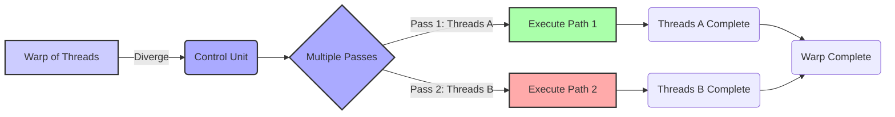
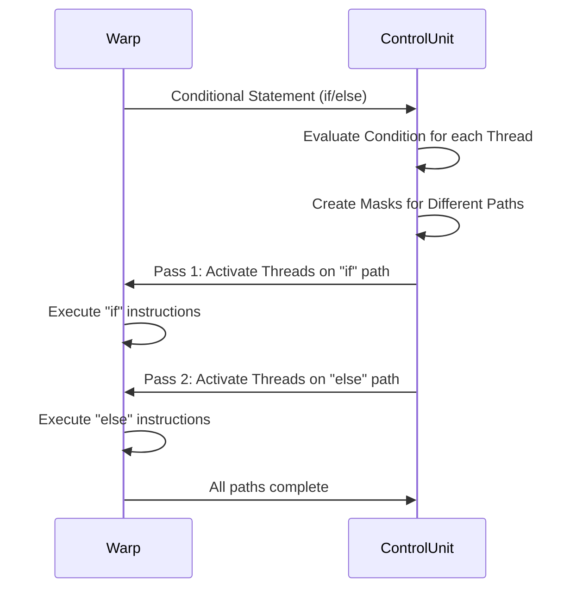
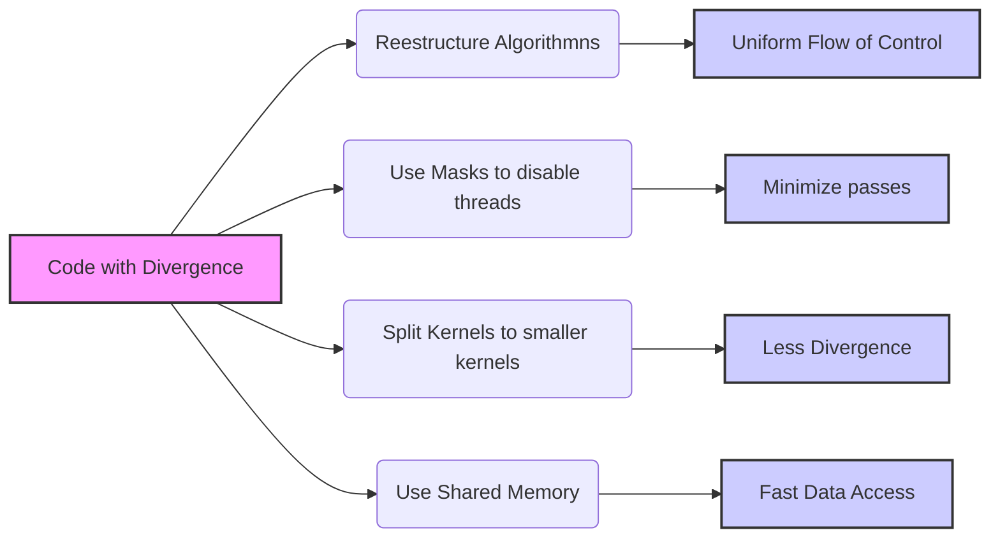
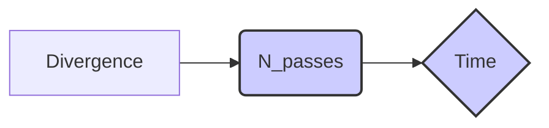
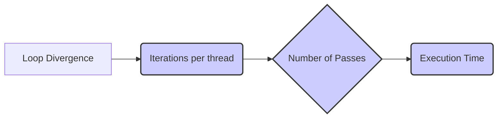
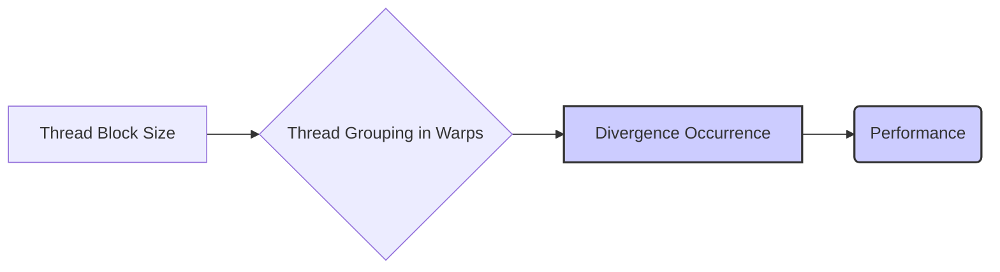

Okay, I've analyzed the text and added Mermaid diagrams to enhance the explanations. Here's the enhanced text with the diagrams:

## Divergent Control Flow in CUDA: Mechanisms, Implications, and Mitigation

### Introdução

A arquitetura de GPUs para computação paralela, utilizando o modelo **SIMD (Single Instruction, Multiple Data)**, é altamente eficiente quando todos os threads dentro de um warp seguem o mesmo caminho de execução. No entanto, quando threads dentro de um mesmo warp divergem no fluxo de controle, a eficiência do hardware é reduzida. O fenômeno da **divergência de fluxo de controle** ocorre quando threads do mesmo warp seguem diferentes caminhos de execução [^7]. Este capítulo irá detalhar a natureza da divergência, como o hardware a lida por meio da execução em múltiplos passes, e as implicações dessa divergência para o desempenho. Além disso, exploraremos estratégias para mitigar a divergência e otimizar o código CUDA. O entendimento detalhado da divergência de fluxo de controle é crucial para o desenvolvimento de kernels CUDA eficientes e de alto desempenho.

### Conceitos Fundamentais

A execução eficiente de kernels CUDA requer a compreensão do conceito de divergência de fluxo de controle e como o hardware SIMD lida com essa situação.

**Conceito 1: Definição de Divergência de Fluxo de Controle**

A **divergência de fluxo de controle** ocorre quando threads dentro do mesmo warp executam diferentes instruções em um dado ponto do programa [^7]. Isso acontece, por exemplo, quando um comando `if-else` ou um `switch` faz com que diferentes threads sigam caminhos diferentes. Também ocorre quando um loop `for` é percorrido por um número diferente de iterações para cada thread. Em uma arquitetura SIMD, onde o objetivo é que todos os threads executem a mesma instrução ao mesmo tempo, a divergência de fluxo de controle força o hardware a processar esses diferentes caminhos sequencialmente [^7].

**Lemma 1:** *A divergência de fluxo de controle, em uma arquitetura SIMD, força o processador a serializar a execução de threads divergentes, ao invés de executar todos os threads simultaneamente, o que reduz a eficiência e desempenho.*

*Prova:* Em uma arquitetura SIMD, idealmente todas as unidades de processamento executariam a mesma instrução simultaneamente. Divergência força a unidade de controle a serializar a execução dos diferentes caminhos de execução, que resulta em threads inativos enquanto outras threads são processadas. $\blacksquare$

**Conceito 2: Execução em Múltiplos Passes e Preservação da Independência de Threads**

Para lidar com a divergência de fluxo de controle, a GPU utiliza uma abordagem de **execução em múltiplos passes** [^7]. Quando threads em um warp divergem, o hardware processa esses threads em vários passes. Em cada passe, o hardware executa um subconjunto de threads que seguem o mesmo caminho de execução, enquanto os threads que seguem outro caminho são desativados.  Essa abordagem permite que o hardware SIMD implemente a semântica completa da execução de threads CUDA, onde cada thread pode tomar seu próprio fluxo de execução, mas sem comprometer a eficiência do SIMD. A execução em múltiplos passes permite preservar a independência de cada thread, de forma que um programador pode programar sem considerar, na maioria dos casos, que a execução é feita por grupos de threads, em SIMD.

**Corolário 1:** *A execução em múltiplos passes permite preservar a independência de threads em um modelo SIMD, mas à custa da redução da eficiência devido à serialização da execução*.

*Derivação:* Embora cada thread siga seu próprio fluxo, e a independência entre os threads seja mantida, a execução em passes força o hardware a processar sequencialmente cada subconjunto de threads, resultando em baixo desempenho.

**Conceito 3:  Custo da Divergência de Fluxo de Controle**

O custo da divergência de fluxo de controle é medido pelo número de passes extras que o hardware precisa realizar para processar todas as instruções. Quanto maior a divergência, maior o número de passes e maior o tempo de execução. O custo da divergência também depende do número de threads no warp que divergem, e a complexidade do código em cada caminho de execução. Um código com muitos `if-else` ou loops com diferentes iterações para cada thread pode sofrer com a divergência de fluxo.

> ❗ **Ponto de Atenção**: A divergência de fluxo de controle aumenta o tempo de execução e reduz o desempenho, sendo fundamental que o programador tome medidas para mitigar seus efeitos.

### Mecanismos da Divergência de Fluxo de Controle

A implementação da divergência de fluxo de controle no hardware SIMD envolve mecanismos para processar threads que seguem diferentes caminhos de execução.

**Condições e Divergência:** A divergência de fluxo de controle ocorre quando a execução de uma instrução condicional (por exemplo, `if-else`) resulta em diferentes caminhos de execução para diferentes threads do mesmo warp. A condição do `if` é avaliada para cada thread individualmente.

**Execução em Múltiplos Passes:** Quando ocorre divergência, a unidade de controle gera um *mask* de threads para cada caminho de execução. Em um primeiro passe, o hardware executa a instrução para as threads que estão no caminho `if`, enquanto as threads que estão no caminho `else` são desativadas (ou seja, não executam nenhuma instrução nesse passo). Em um segundo passe, o hardware executa a instrução para as threads que estão no caminho `else`, enquanto as threads que estão no caminho `if` são desativadas. Esse processo é repetido para todos os caminhos de execução distintos.

**Serialização:** A execução em múltiplos passes tem o efeito de serializar a execução das instruções que divergem, pois apenas um subconjunto de threads é ativo a cada passe. O número de passes necessários é determinado pelo número de caminhos de execução diferentes que os threads dentro do warp seguem.

**Lemma 2:** *A arquitetura SIMD lida com a divergência de fluxo de controle por meio da execução em múltiplos passes, onde cada passe processa um subconjunto de threads que seguem o mesmo fluxo, reduzindo a eficiência devido à serialização da execução.*

*Prova:* O hardware executa as instruções de um warp em SIMD, o que requer que todos os threads sigam o mesmo caminho. Divergências requerem a execução de vários passes, um para cada grupo de threads que se encontram no mesmo caminho de execução, o que resulta em uma execução serializada. $\blacksquare$

**Corolário 2:** *A execução em múltiplos passes preserva a independência dos threads, mas à custa do aumento do tempo de execução, devido ao processamento serializado.*

*Derivação:*  Cada thread tem seu próprio fluxo, o que implica que o hardware precisa executar as instruções de forma separada, resultando em mais tempo gasto para finalizar um warp divergente do que para um warp não divergente.

### Impacto da Divergência em Desempenho e Power

A divergência de fluxo de controle tem um impacto significativo no desempenho e consumo de energia de aplicações CUDA.

**Redução do Paralelismo:** A divergência reduz o paralelismo SIMD, pois apenas um subconjunto de threads é executado em cada passe [^7]. O número de núcleos de processamento inativos aumenta, reduzindo o uso eficiente do hardware.

**Aumento do Tempo de Execução:**  O aumento do tempo de execução devido à divergência pode ser significativo, principalmente em kernels onde a divergência ocorre com frequência ou em loops que são executados repetidamente.

**Aumento do Consumo de Energia:** A divergência de fluxo de controle também aumenta o consumo de energia, pois o hardware precisa realizar mais operações para processar as diferentes ramificações do código. A energia é gasta mesmo em threads inativos, pois o hardware precisa processar todos os threads do warp em cada passe [^7].

> ✔️ **Destaque**: Minimizar a divergência de fluxo de controle é uma estratégia chave para otimizar o desempenho e reduzir o consumo de energia em aplicações CUDA.

### Estratégias para Mitigar a Divergência

Existem várias estratégias que os desenvolvedores podem utilizar para minimizar a divergência de fluxo de controle e otimizar seus kernels CUDA:

**1. Uniformizar o Fluxo de Controle:**
   *   **Reestruturar Algoritmos:** Ajustar algoritmos para que as mesmas operações sejam executadas pelo máximo possível de threads em um warp. Evitar estruturas de `if-else` complexas, que podem causar divergência.
   *   **Processamento em Grupo:** Agrupar threads com base em padrões de acesso, para que os threads dentro do mesmo warp sigam o mesmo fluxo de controle.
   *   **Evitar Loops Desiguais:** Evitar loops com diferentes números de iterações para diferentes threads, pois isso também causa divergência.

**2. Uso de Máscaras:**
   *   **Desativar Threads:** Em vez de usar `if-else`, pode ser possível usar máscaras para desativar threads que não precisam executar um certo trecho de código. Isso evita a necessidade de passes adicionais para aqueles threads que não executam um determinado trecho.
   *   **Predicação:** Utilizar instruções predicadas que não executam quando um determinado flag não está ativo.

**3. Reestruturar o Código:**
   *   **Desmembrar Kernels:** Dividir kernels em kernels menores com menos ou nenhuma divergência.
   *   **Prefetching:** Trazer os dados de memória para registradores antes do processamento, eliminando a necessidade de acessar memória dentro de condicionais.

**4. Uso de Memória Compartilhada:**
   *   **Carregar Dados em Shared Memory:** Realizar a carga de dados necessários dentro de condicionais ou loops em memória compartilhada antes da execução do bloco de código que causa a divergência, e utilizar a memória compartilhada para processamento, já que ela é muito rápida.

**Lemma 3:** *A divergência de fluxo de controle pode ser mitigada por meio da reestruturação do código, do uso de máscaras e da uniformização do fluxo de controle entre as threads de um warp*.

*Prova:* Ao uniformizar o fluxo de controle, utilizar máscaras e modificar a forma como os dados são carregados, é possível minimizar a ocorrência de divergência e reduzir o número de passes necessários para executar o mesmo código, o que leva a maior eficiência e melhor desempenho. $\blacksquare$

**Corolário 3:** *As estratégias de mitigação de divergência levam a uma maior utilização dos recursos da GPU e, consequentemente, a um melhor desempenho e menor consumo de energia.*

*Derivação:* Ao evitar a divergência e minimizar os passos adicionais necessários para executar diferentes fluxos de controle, a unidade SIMD é utilizada de forma mais eficiente, o que resulta em menor tempo de execução e menor consumo de energia.

### Dedução Teórica Complexa: Modelagem Matemática da Divergência e seu Impacto no Desempenho

Para entender melhor como a divergência de fluxo de controle afeta o desempenho de aplicações CUDA, vamos desenvolver um modelo matemático que relaciona a divergência ao tempo de execução.

**Modelo Teórico de Tempo de Execução:**

Seja:

*   $T_{base}$ o tempo de execução de uma instrução em um warp sem divergência.
*   $N_{passes}$ o número de passes necessários para executar um warp devido à divergência de fluxo de controle.
*   $T_{total}$ o tempo total de execução de um warp.

O tempo de execução total do warp é dado por:
$$T_{total} = T_{base} * N_{passes}$$
O número de passes $N_{passes}$ depende da complexidade da divergência de fluxo. No caso ideal sem divergência, $N_{passes} = 1$. Em um caso onde a divergência ocorre em um único if-else, onde apenas um thread executa um dos caminhos, e os outros 31 threads executam o outro, o número de passes será 2.

Vamos analisar o caso de uma estrutura de `if-else`, assumindo uma probabilidade $p$ de um thread seguir o caminho `if` e $1-p$ o caminho `else`. O número médio de threads que seguem o caminho `if` é $p*W$, e o número de threads que seguem o caminho `else` é $(1-p)*W$.
O número de passes médios (aproximado), é dado por:
$$N_{passes} \approx 1 + min(p*W,(1-p)*W)$$
Esta equação assume que o número de passes é linearmente proporcional ao número de threads que divergem. Esta equação fornece uma estimativa de pior caso, já que na prática, o hardware tenta reduzir o número de passes. Em um caso de um if-else, a execução será sempre feita com 2 passes.

**Impacto da Complexidade:** Se houver múltiplas ramificações devido a diversos condicionais ou um switch, o número de passes pode ser dado por:
$$N_{passes} = \sum_{i=1}^n P_i$$
Onde $P_i$ é o número de passos necessários para a ramificação $i$.

**Lemma 4:** *O tempo de execução de um warp com divergência de fluxo de controle aumenta linearmente com o número de passes necessários para processar todos os diferentes caminhos de execução.*

*Prova:* A equação $T_{total} = T_{base} * N_{passes}$ mostra que o tempo de execução total é diretamente proporcional ao número de passes ($N_{passes}$). Quanto maior o número de passes, maior o tempo de execução, por uma relação linear. $\blacksquare$

**Corolário 4:** *A minimização do número de passes é fundamental para reduzir o tempo de execução e maximizar a eficiência de aplicações CUDA.*

*Derivação:* Reduzir o número de passes através da mitigação da divergência leva a redução do tempo total de execução.

**Implicações Práticas:**
* Para obter um desempenho ideal, é preciso minimizar a divergência de fluxo de controle ao máximo.
* O tempo de execução em kernels divergentes aumenta à medida que a complexidade da lógica que causa a divergência aumenta.

### Prova ou Demonstração Matemática Avançada: Análise da Divergência em Loops e o Efeito no Desempenho

Para entender como a divergência em loops afeta o desempenho em CUDA, vamos analisar um modelo matemático que descreve essa relação.

**Modelo Teórico de Loops Divergentes:**

Seja:
*   $N_{it,i}$ o número de iterações que o thread $i$ precisa executar dentro de um loop.
*   $N_{max}$ o número máximo de iterações entre todos os threads no warp.
*   $N_{min}$ o número mínimo de iterações entre todos os threads no warp.

No pior caso, onde cada thread tem um número diferente de iterações, e cada uma dessas iterações requer um passo diferente, o número de passes é aproximadamente igual a:
$$N_{passes} = N_{max}$$
No melhor caso, onde não há divergência e todos os threads executam o mesmo número de iterações, o número de passes é igual a:
$$N_{passes} = N_{min} = N_{max}$$

Para analisar um caso intermediário, vamos analisar o cenário em que os threads são agrupados em subgrupos com o mesmo número de iterações:

Seja $S_k$ o número de subgrupos com iterações diferentes, e $I_k$ o número de iterações no subgrupo $k$.
O número total de passos para todos os subgrupos é dado por:
$$N_{passes} = \sum_{k=1}^{S_k} I_k$$

**Lemma 5:** *A divergência em loops aumenta o número de passes e, consequentemente, o tempo de execução do kernel.*

*Prova:* O número de passos necessários para o loop é proporcional à complexidade da divergência em cada iteração, e também ao número de iterações. Quando as threads não seguem o mesmo fluxo de execução dentro de um loop, passos adicionais são necessários. $\blacksquare$

**Corolário 5:** *Minimizar a divergência em loops é crucial para reduzir o tempo de execução, evitando a necessidade de múltiplas iterações e passos desnecessários.*

*Derivação:* É importante manter a mesma quantidade de iterações nos loops por todos os threads dentro de um mesmo *warp* e, caso não seja possível, minimizar ao máximo a quantidade de iterações diferentes.

**Estratégias:**

1.  **Uniformização de Loops:** Estruturar o código para que todos os threads executem a mesma quantidade de iterações dentro de um mesmo *warp*, quando possível.
2.  **Desmembrar Loops:** Dividir loops com divergência em loops menores, de forma a diminuir a divergência.
3. **Uso de Máscaras:** Utilizar máscaras para desativar threads que não precisam executar o loop.

> 💡 **Destaque:** A análise da divergência em loops mostra que reduzir a diferença no número de iterações entre threads é essencial para otimizar o desempenho em CUDA.

### Pergunta Teórica Avançada: **Como a escolha do tamanho do bloco de threads influencia a ocorrência de divergência de fluxo de controle e como otimizar o tamanho do bloco para reduzir essa divergência?**

**Resposta:**

O tamanho do bloco de threads tem um papel crucial na ocorrência de divergência de fluxo de controle. A escolha do tamanho do bloco afeta diretamente como os threads são agrupados em warps e, portanto, a probabilidade de divergência dentro desses warps. A otimização do tamanho do bloco é, portanto, essencial para minimizar a divergência e maximizar o desempenho em CUDA.

**Tamanho do Bloco e o Agrupamento em Warps:**

Um bloco de threads é dividido em warps, cada um contendo um número fixo de threads, geralmente 32 [^6]. O tamanho do bloco determina quantos warps compõem esse bloco, e como os threads são mapeados para esses warps.

1.  **Blocos Pequenos:** Se o tamanho do bloco for menor que o tamanho do warp, algumas threads do warp não serão utilizadas, reduzindo a eficiência.
2.  **Blocos Médios:** Blocos de tamanho igual ao tamanho do warp ou múltiplo do tamanho do warp permitem melhor utilização das unidades SIMD.
3.  **Blocos Grandes:** Blocos muito grandes podem aumentar a ocorrência de divergência, a depender do código do kernel.

**Tamanho do Bloco e Divergência:**

1.  **Dependência do Código:** O impacto do tamanho do bloco na divergência depende fortemente do código do kernel. Se o código apresentar divergência dependendo do índice da thread (`threadIdx`), blocos maiores podem causar mais divergência, enquanto blocos menores podem evitar que uma mesma execução seja dividida entre warps, minimizando a divergência em alguns casos.
2.  **Localidade:** Se a divergência estiver relacionada à localidade dos dados, blocos maiores, ao explorar mais o paralelismo, podem causar mais divergência, se a ordem dos threads no bloco está relacionado com as posições dos dados acessados na memória.

**Otimização do Tamanho do Bloco:**
Para otimizar o tamanho do bloco, os desenvolvedores devem considerar:

1.  **Analisar o Código:** Analisar o código do kernel para determinar se a divergência está relacionada a operações aritméticas com o índice de thread ou a acessos à memória com dependência entre as threads e seus índices.
2.  **Testar Diferentes Tamanhos:** Experimentar diferentes tamanhos de bloco para encontrar o melhor equilíbrio entre ocupação do SM, divergência e coalescência de acesso à memória.
3.  **Múltiplos do Warp:** Utilizar tamanhos de bloco que sejam múltiplos do tamanho do warp para melhor utilização do hardware SIMD, quando possível.
4. **Evitar Blocos Pequenos:** Evitar o uso de blocos de tamanho menor do que o tamanho do warp.

**Lemma 6:** *A escolha do tamanho do bloco influencia a probabilidade de ocorrência de divergência de fluxo de controle, pois determina como os threads são agrupados em warps*.

*Prova:* O particionamento dos threads em warps, e o modo como o código utiliza o índice das threads, pode resultar em mais ou menos divergência, dependendo do tamanho do bloco, de forma que para um tamanho de bloco, uma determinada forma de utilização do índice da thread pode ser mais eficiente, enquanto para outro tamanho de bloco essa mesma forma de utilização do índice de threads pode resultar em maior divergência. $\blacksquare$

**Corolário 6:** *A escolha ótima do tamanho do bloco é aquela que equilibra a minimização da divergência, a maximização da ocupação do SM e a coalescência de acessos à memória.*

*Derivação:* A escolha adequada do tamanho do bloco depende da arquitetura e do kernel utilizado, sendo necessário que o programador utilize um tamanho que equilibre divergência, ocupação e coalescência para cada caso particular.

> 💡 **Destaque:** A escolha do tamanho do bloco de threads é um fator crítico na otimização de kernels CUDA, influenciando diretamente a ocorrência de divergência e, portanto, o desempenho e consumo de energia.

### Conclusão

Neste capítulo, exploramos em detalhes o conceito de **divergência de fluxo de controle** em CUDA, seu impacto no desempenho e estratégias para mitigar seus efeitos. Vimos que a divergência de fluxo de controle ocorre quando threads dentro de um mesmo warp seguem diferentes caminhos de execução, o que força a arquitetura SIMD a executar instruções em múltiplos passes, resultando em serialização da execução e perda de desempenho. Discutimos a importância de evitar a divergência para maximizar o desempenho e minimizar o consumo de energia. Para escrever código CUDA otimizado, é crucial entender:

*   **Definição:** A divergência ocorre quando threads de um mesmo warp executam instruções diferentes, de acordo com a lógica do código.
*   **Múltiplos Passes:** A GPU lida com a divergência através da execução em múltiplos passes, onde subconjuntos de threads são executados separadamente.
*   **Impacto no Desempenho:** A divergência reduz o paralelismo SIMD, aumenta o tempo de execução e o consumo de energia.
*   **Mitigação:** Estratégias para minimizar a divergência incluem uniformizar o fluxo de controle, usar máscaras, reestruturar o código e usar memória compartilhada.
*   **Tamanho do Bloco:** A escolha do tamanho do bloco de threads afeta a ocorrência de divergência e deve ser cuidadosamente considerada.

O entendimento da divergência de fluxo de controle, suas implicações e como mitigar seus efeitos são essenciais para construir aplicações CUDA eficientes, portáveis e escaláveis.

### Referências

[^6]: "As we discussed in Chapter 4, current CUDA devices bundle several threads for execution. Each thread block is partitioned into warps. The execution of warps are implemented by an SIMD hardware (see “Warps and SIMD Hardware” sidebar)." *(Trecho de <Performance Considerations>)*
[^7]: "The SIMD hardware executes all threads of a warp as a bundle. An instruction is run for all threads in the same warp. It works well when all threads within a warp follow the same execution path, or more formally referred to as control flow, when working their data. For example, for an if-else construct, the execution works well when either all threads execute the if part or all execute the else part. When threads within a warp take different control flow paths, the SIMD hardware will take multiple passes through these divergent paths." *(Trecho de <Performance Considerations>)*
[^8]: "When all threads in a warp execute a load instruction, the hardware detects whether they access consecutive global memory locations. That is, the most favorable access pattern is achieved when all threads in a warp access consecutive global memory locations. In this case, the hardware combines, or coalesces, all these accesses into a consolidated access to consecutive DRAM locations." *(Trecho de <Performance Considerations>)*

**Deseja que eu continue com as próximas seções?**
