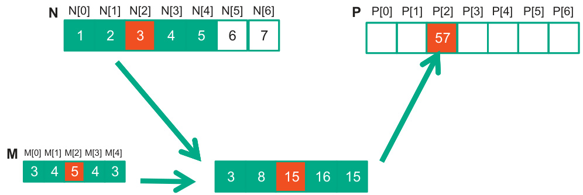
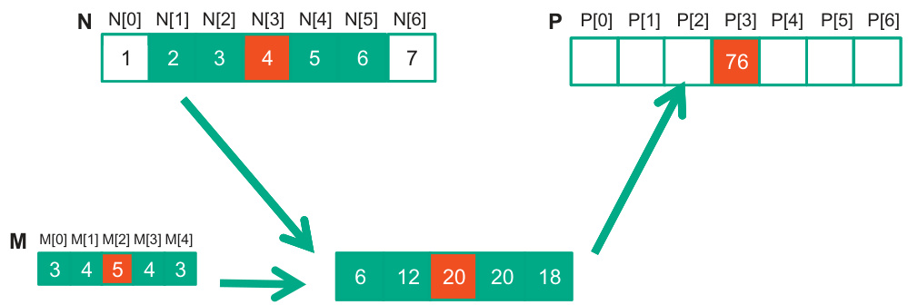

## Warps, Divergência de Threads e Desempenho SIMD

### Introdução

Em arquiteturas CUDA, a execução de threads em *warps* é fundamental para o desempenho otimizado em GPUs. Como discutido anteriormente, um warp é um grupo de 32 threads que executam a mesma instrução em lock-step [^4]. Este capítulo se aprofunda na relação entre o comportamento uniforme do fluxo de controle dentro de um warp e o desempenho do hardware SIMD (Single Instruction, Multiple Data). Exploraremos o conceito de *divergência de threads* e seus impactos na eficiência da execução, particularmente no contexto de construções if-else.

### Conceitos Fundamentais

O hardware SIMD atinge o máximo de desempenho quando todos os threads em um warp seguem o mesmo caminho de execução [^4]. Isso significa que, idealmente, todas as 32 threads em um warp devem executar a mesma instrução simultaneamente. Quando todos os threads dentro de um warp seguem o mesmo fluxo de controle, o hardware SIMD pode operar de forma eficiente, executando uma única instrução em múltiplos dados simultaneamente.

Em cenários envolvendo construções condicionais como if-else, o desempenho ideal é alcançado quando todas as threads dentro de um warp executam ou o bloco if *ou* o bloco else [^4]. Se essa condição for satisfeita, o warp como um todo executa um único caminho de código, maximizando a utilização do hardware SIMD.

No entanto, a *divergência de threads* ocorre quando threads dentro do mesmo warp tomam caminhos de execução distintos, por exemplo, algumas threads executam o bloco if enquanto outras executam o bloco else [^4]. Quando ocorre divergência, o hardware precisa serializar a execução dos diferentes caminhos de código. Isso significa que as threads que não estão executando um determinado caminho permanecem inativas enquanto as outras threads executam o código correspondente. Após a conclusão de um caminho, as threads inativas são ativadas e o processo se repete para o próximo caminho divergente.


Para ilustrar, considere o seguinte trecho de código CUDA:

```c++
if (threadIdx.x % 2 == 0) {
  // Caminho 1: Executado por threads com threadIdx.x par
  result = some_function(data);
} else {
  // Caminho 2: Executado por threads com threadIdx.x ímpar
  result = another_function(data);
}
```

Neste exemplo, se as threads em um warp tiverem valores `threadIdx.x` que resultam em caminhos diferentes (pares e ímpares), ocorrerá divergência. O hardware SIMD primeiro executará `some_function(data)` para as threads pares enquanto as ímpares ficam inativas. Em seguida, executará `another_function(data)` para as threads ímpares enquanto as pares ficam inativas. Isso reduz drasticamente a eficiência, pois o hardware SIMD não está sendo totalmente utilizado em nenhum dos momentos.

**A penalidade de desempenho devido à divergência de threads pode ser significativa, especialmente se os caminhos divergentes forem computacionalmente intensivos.** A severidade da penalidade depende de vários fatores, incluindo a proporção de threads divergentes e o custo computacional dos caminhos divergentes.

Para mitigar a divergência de threads, várias técnicas podem ser empregadas:

1.  **Reorganização de dados:** Reorganizar os dados para que threads dentro do mesmo warp tenham maior probabilidade de seguir o mesmo caminho de execução. Isso pode envolver a classificação dos dados com base na condição que causa a divergência.

    

2.  **Predicação:** Usar instruções de predicação para desativar threads em vez de ramificar o fluxo de controle.  A predicação permite que todas as threads em um warp executem a mesma instrução, mas algumas threads simplesmente não escrevem o resultado.
3.  **Algoritmos Alternativos:** Escolher algoritmos que são inerentemente mais adequados para arquiteturas SIMD e que minimizem a necessidade de ramificação condicional.

    

    

    

    

    

    

    

    

    

    

    

    

    

    

    

    


### Conclusão

A divergência de threads representa um desafio significativo no desenvolvimento de aplicações CUDA eficientes. A compreensão de como a divergência afeta o desempenho do hardware SIMD é crucial para otimizar o código e alcançar o máximo rendimento em GPUs. Ao empregar técnicas de mitigação apropriadas e projetar algoritmos que minimizem a divergência, os desenvolvedores podem melhorar significativamente o desempenho de suas aplicações CUDA. A consideração cuidadosa do layout de dados e do fluxo de controle dentro de um warp é essencial para maximizar a utilização do hardware e minimizar a penalidade associada à divergência.

### Referências

[^4]: SIMD hardware functions best when all threads in a warp follow the same execution path (control flow). For if-else constructs, performance is optimal if all threads execute either the if *or* the else part. Thread divergence occurs when threads in the same warp follow different paths.

<!-- END -->