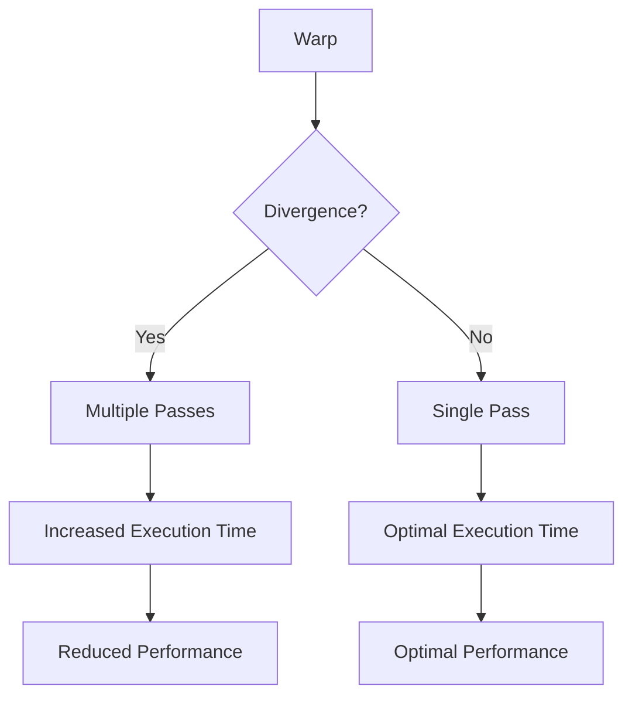
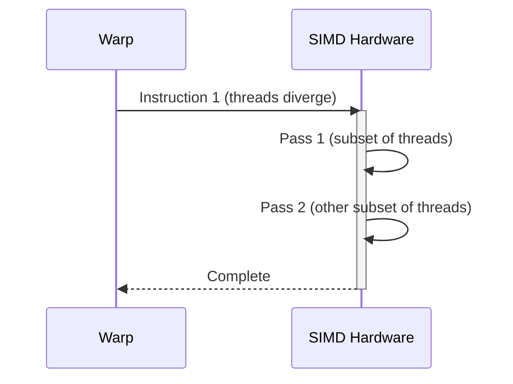
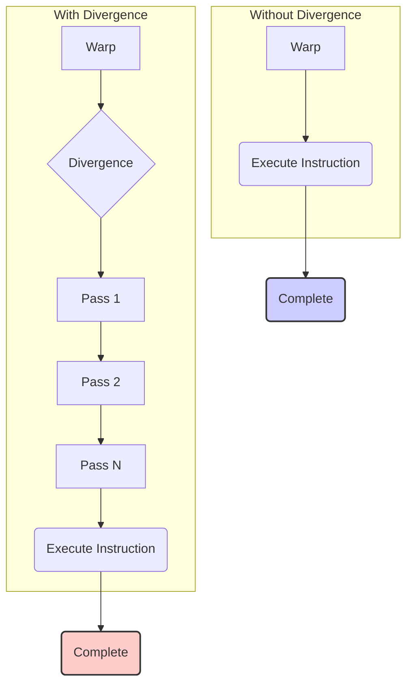
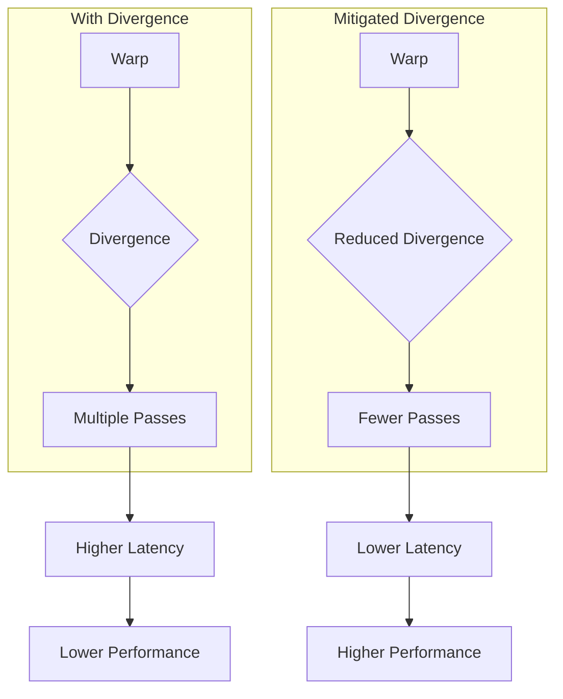
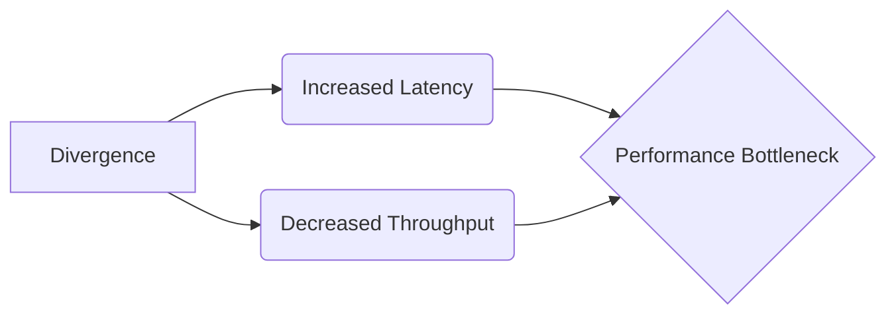
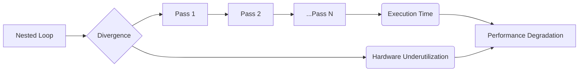
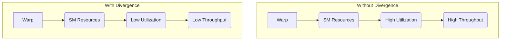

Okay, I will add Mermaid diagrams to enhance the text as requested.

## The Cost of Divergence in CUDA: Analyzing the Overhead of Multiple Execution Passes

### Introdução

Na arquitetura de GPUs para computação paralela, o modelo **SIMD (Single Instruction, Multiple Data)** é otimizado para cenários em que todos os threads de um warp executam a mesma instrução simultaneamente. No entanto, quando há divergência de fluxo de controle, os threads de um warp seguem diferentes caminhos de execução, e o hardware precisa executar em **múltiplos passes**. Este capítulo irá detalhar o custo da divergência, especificamente como esses passes adicionais afetam o tempo de execução, e como esse custo impacta o desempenho geral. Analisaremos as causas desse overhead e o que os desenvolvedores podem fazer para mitigar seus efeitos. O entendimento completo do impacto dos múltiplos passes é essencial para o desenvolvimento de kernels CUDA eficientes e de alto desempenho.

### Conceitos Fundamentais

O impacto da divergência na performance está diretamente ligado ao mecanismo de execução em múltiplos passes e ao custo associado a cada um desses passes.

**Conceito 1: Múltiplos Passes e Serialização da Execução**

Quando ocorre a **divergência de fluxo de controle**, o hardware SIMD precisa executar os threads do warp em diferentes passos, para acomodar os diferentes caminhos que os threads seguem, pois todos os threads de um mesmo warp devem executar a mesma instrução simultaneamente. Cada um desses passos é um **passe de execução**, onde as unidades de processamento executam a instrução em apenas um subconjunto dos threads, aqueles que seguem o mesmo caminho naquele passe [^7]. Os threads que seguem caminhos diferentes são desativados nesse passe e serão executados em passes subsequentes. O processo de execução em múltiplos passes serializa parcialmente a execução de um warp que divergiu, pois em cada passe somente um subconjunto dos threads são ativados.

**Lemma 1:** *A execução em múltiplos passes, necessária para lidar com a divergência de fluxo de controle, serializa parcialmente a execução do warp, pois em cada passe apenas um subconjunto de threads está ativo.*

*Prova:* A execução SIMD requer que todos os threads executem a mesma instrução. Quando há divergência, o hardware executa passes adicionais para acomodar threads que se encontram em diferentes caminhos de execução, serializando parcialmente a execução do warp. $\blacksquare$

**Conceito 2: O Custo Direto dos Passes Adicionais**

Cada passo adicional na execução de um warp com divergência tem um custo direto em termos de tempo de execução. Em cada passe, apenas uma parte dos recursos computacionais da GPU está sendo utilizada ativamente, enquanto os demais ficam ociosos. Isso significa que o tempo total de execução aumenta linearmente com o número de passes, pois o hardware precisa executar um mesmo trecho de código múltiplas vezes, quando há divergência, fazendo com que o tempo de processamento de um warp aumente quando há divergência. O tempo adicional resulta na redução do paralelismo do hardware.

**Corolário 1:** *O tempo total de execução de um warp com divergência aumenta proporcionalmente ao número de passes adicionais necessários para lidar com os diferentes caminhos de execução, devido à utilização parcial dos recursos de hardware em cada passe.*

*Derivação:* Cada passo adicional significa um tempo adicional de execução, que resulta na redução de desempenho.

**Conceito 3: Implicações da Divergência na Ocupação do SM**

A divergência de fluxo de controle também impacta na ocupação do Streaming Multiprocessor (SM), já que a execução de cada warp é feita de forma mais ineficiente quando há divergência. Isso acontece porque em cada passe de um warp que diverge, alguns dos núcleos de processamento do SM estão ociosos. Assim, o SM precisa de mais tempo para executar um warp que diverge, o que resulta em menor ocupação, pois o mesmo número de warps ocupa os SMs por mais tempo. A baixa ocupação implica em uma menor utilização do hardware e em perda de desempenho.

> ⚠️ **Nota Importante**: A divergência não apenas aumenta o tempo de execução, mas também reduz a ocupação do SM, resultando em menor utilização do paralelismo do hardware.

### Análise Detalhada do Custo dos Passes Adicionais

Para entender completamente o custo dos passes adicionais, vamos analisar os mecanismos que contribuem para esse overhead.

**Overhead da Busca de Instruções:**
Cada passe adicional requer uma nova busca e decodificação da instrução, mesmo que a instrução seja a mesma. A busca e a decodificação de instruções consomem energia e tempo, e múltiplas repetições desses passos adicionam tempo de execução ao kernel.

**Overhead na Desativação e Ativação de Threads:**
Em cada passo, a unidade de controle precisa ativar os threads que executam o caminho do passe atual, e desativar os threads que seguem outros caminhos. As operações de ativação e desativação de threads consomem tempo, o que contribui para o overhead.

**Overhead no Processamento de Dados:**
Em cada passo, as unidades de processamento realizam as operações necessárias com seus próprios dados. Se todos os threads estivessem ativos, o número de operações por unidade de tempo seria máximo, o que não é o caso quando ocorre divergência de fluxo de controle.  No caso de divergência, apenas um subconjunto de threads realiza o trabalho real.

**Lemma 2:** *O custo dos passes adicionais em um warp com divergência é resultado da busca de instruções, ativação e desativação de threads e do processamento de dados por um subconjunto de threads, o que resulta em overhead e maior tempo de execução*.

*Prova:* Cada passe adicional requer uma nova busca da instrução, e uma nova ativação e desativação das threads, que são operações que consomem tempo, e são repetidas a cada passo. $\blacksquare$

**Corolário 2:** *Minimizar o número de passes é fundamental para evitar o overhead associado à divergência e para manter a eficiência do paralelismo SIMD.*

*Derivação:* A redução do número de passes diminui a quantidade de tempo gasto com a busca de instruções, e também com a ativação e desativação de threads.

### Impacto do Custo da Divergência na Performance

O custo dos passes adicionais tem um impacto significativo na performance das aplicações CUDA:

**Redução do Paralelismo:**
A divergência leva à redução do paralelismo SIMD, uma vez que as unidades de processamento ficam ociosas enquanto esperam que um determinado subconjunto de threads seja executado em um dado passe. Isso reduz a eficiência do hardware, que foi projetado para processar muitos threads em paralelo.

**Aumento do Tempo de Execução:**
O tempo de execução de um kernel aumenta diretamente com a quantidade de divergência no código, devido à necessidade de execução de múltiplas passes, que aumenta o tempo total necessário para execução do kernel.

**Diminuição da Eficiência Energética:**
A divergência não apenas reduz o desempenho, mas também diminui a eficiência energética, pois o hardware consome energia adicional para executar múltiplas instruções e para manter os recursos ativos mesmo quando eles não estão realizando trabalho útil.

> ❗ **Ponto de Atenção:** É fundamental evitar a divergência de fluxo de controle para melhorar o desempenho e a eficiência energética de aplicações CUDA.

### Mitigação do Custo da Divergência

Existem algumas técnicas para mitigar os custos da divergência de fluxo de controle, melhorando o desempenho das aplicações CUDA.

**1. Reestruturação do Código:**

   *   **Fluxo de Controle Uniforme:** Reestruturar o código para que as operações sejam executadas pelo máximo de threads possível simultaneamente, e que seja reduzida a necessidade de caminhos de execução distintos.
   *   **Evitar Condicionais Complexos:** Evitar condicionais muito complexos, que causem divergência, utilizando máscaras, quando possível.
   *   **Desmembramento de Kernels:** Dividir kernels maiores em kernels menores, que realizem tarefas mais específicas e tenham menos divergência.

**2. Uso Eficiente de Máscaras e Predicação:**

   *   **Desativar Threads:** Desativar threads que não precisam executar um trecho de código utilizando máscaras. Em vez de usar um `if-else`, usar uma variável booleana para desativar a execução em threads que não precisam executar um determinado código, em vez de obrigar o hardware a processar esse código em um novo passo.
   *   **Predicação de Instruções:** Utilizar a predicação de instruções para evitar a execução de instruções sem necessidade.

**3. Uso Eficiente de Memória:**

   *   **Cache de Dados:** Utilizar a memória compartilhada para carregar dados antes do trecho de código que causa a divergência, de forma que esses dados estejam disponíveis rapidamente para os threads, sem precisar realizar acessos adicionais, principalmente na memória global.
   *   **Evitar Acessos Condicionais:** Evitar acessos à memória que dependam de condições, realizando esses acessos previamente, quando possível, e utilizando a memória compartilhada.

**Lemma 3:** *A mitigação do custo da divergência de fluxo de controle envolve a reestruturação do código, o uso de máscaras e predicação, e o uso eficiente de memória, visando reduzir o número de passes adicionais durante a execução.*

*Prova:* A reestruturação do código resulta em melhor uniformização do fluxo, o uso de máscaras resulta na diminuição de passes adicionais desnecessários, e o uso da memória compartilhada evita acessos adicionais que poderiam causar divergência. $\blacksquare$

**Corolário 3:** *Ao minimizar o número de passes adicionais, é possível reduzir o tempo de execução e aumentar a eficiência energética das aplicações CUDA.*

*Derivação:* A redução da quantidade de passes reduz o número de repetições das mesmas instruções, o que resulta em menor tempo de execução e menor consumo de energia.

### Dedução Teórica Complexa: Modelagem do Impacto da Divergência na Latência e Taxa de Transferência

Para uma análise mais profunda do impacto da divergência, vamos analisar como ela afeta a latência e a taxa de transferência em um kernel CUDA.

**Latência e Divergência:**

A **latência** é o tempo necessário para executar uma instrução ou um conjunto de instruções. A divergência aumenta a latência, pois o hardware precisa de passes adicionais para processar todos os threads que divergem. Se a divergência ocorre no início da execução de um warp, isso significa que o tempo para o warp finalizar sua execução é maior, aumentando a latência de todo o kernel.

**Taxa de Transferência e Divergência:**

A **taxa de transferência** é a quantidade de trabalho que pode ser realizado por unidade de tempo. A divergência diminui a taxa de transferência, uma vez que os recursos do hardware são subutilizados durante os passes adicionais, e o tempo total para executar todos os threads do warp é aumentado devido aos múltiplos passes.

**Modelo Matemático da Latência:**

Seja:
*   $T_{exec}$ o tempo de execução de um único passo no warp.
*  $N_{passes}$ o número de passes devido a divergência.
*   $L$ a latência total do warp.

A latência total é dada por:
$$L = T_{exec} * N_{passes}$$

**Modelo Matemático da Taxa de Transferência:**
Seja:
*   $W$ o tamanho do warp (32 threads).
*   $N_{instr}$ o número de instruções executadas por thread no warp.
*   $T_{total}$ o tempo de execução total do warp.
*   $R$ a taxa de transferência do warp.

A taxa de transferência é dada por:
$$R = \frac{N_{instr} * W}{T_{total}}$$
A taxa de transferência diminui quando a divergência aumenta, devido ao aumento do tempo de execução $T_{total}$ que é causado pelo aumento do número de passes $N_{passes}$.

**Lemma 4:** *A divergência de fluxo de controle aumenta a latência e diminui a taxa de transferência, devido aos passes adicionais e à subutilização do hardware.*

*Prova:* O número de passes adicionais que um warp precisa executar para acomodar a divergência aumenta a latência. O tempo de execução também aumenta, o que resulta em menor taxa de transferência. $\blacksquare$

**Corolário 4:** *Minimizar a divergência resulta em menor latência e maior taxa de transferência, levando a um aumento de desempenho.*

*Derivação:* Ao diminuir a latência e o tempo de execução, a taxa de transferência aumenta.

> ✔️ **Ponto Crucial**: A divergência impacta tanto na latência quanto na taxa de transferência, mostrando que a otimização para evitar a divergência é essencial para um bom desempenho em CUDA.

### Prova ou Demonstração Matemática Avançada: Análise do Impacto da Divergência em Loops Aninhados

Para um entendimento mais profundo do impacto da divergência em código CUDA, vamos analisar o efeito da divergência em loops aninhados, mostrando como o custo se propaga através de cada nível de aninhamento.

**Modelo Matemático de Loops Aninhados:**

Seja:
*   $L_1$ um loop externo que contém outros loops.
*   $L_2, L_3, ..., L_n$ loops aninhados dentro do loop $L_1$.
*   $D_i$ a taxa de divergência no loop $L_i$ (entre 0 e 1).
*  $N_{passos,i}$ o número de passos que são causados pela divergência no loop $L_i$, onde $N_{passos,i} = 1 +  min(D_i * W, (1 - D_i)*W )$.
*   $N_{max,i}$ o número máximo de iterações no loop $L_i$ dentre os threads do warp.

**Análise da Divergência:**

O efeito da divergência se multiplica em cada nível do loop aninhado. Se $L_1$ tem uma taxa de divergência $D_1$, e $L_2$ tem uma taxa de divergência $D_2$, o número total de passos devido a divergência é aproximadamente:
$$N_{passes} \approx \prod_{i=1}^{n} (1 + min(D_i*W,(1-D_i)*W)) * N_{max,i}$$
A equação acima é uma simplificação, que assume que a divergência de cada loop é independente das outras. Na prática, a divergência se multiplica de forma mais complexa.

**Impacto no Tempo de Execução:**
O tempo de execução do código com loops aninhados e divergência aumenta exponencialmente com o número de níveis de aninhamento, devido ao número de passos que são multiplicados a cada novo nível do loop.

**Impacto na Taxa de Transferência:**
A taxa de transferência também diminui significativamente com a divergência em loops aninhados, pois os recursos do hardware são subutilizados em cada nível de aninhamento.

**Lemma 5:** *A divergência em loops aninhados resulta em um aumento exponencial no número de passes, afetando significativamente o tempo de execução e a taxa de transferência.*

*Prova:* O número de passos, em loops aninhados, se multiplica a cada novo nível de aninhamento, mostrando que a divergência em loops aninhados aumenta de forma exponencial. $\blacksquare$

**Corolário 5:** *É fundamental evitar a divergência em loops aninhados, pois ela leva a uma redução exponencial do desempenho.*

*Derivação:* A otimização para evitar a divergência em loops aninhados deve ser realizada em cada nível de aninhamento, pois o efeito da divergência é multiplicado a cada nível.

> 💡 **Destaque:** A análise de loops aninhados mostra que a divergência, quando ocorre em loops aninhados, tem um impacto exponencial no tempo de execução, e deve ser minimizada o máximo possível.

### Pergunta Teórica Avançada: **Como a arquitetura de multiprocessamento da GPU lida com a execução de warps divergentes e qual é o impacto no desempenho em comparação com a execução de warps sem divergência?**

**Resposta:**

A arquitetura de multiprocessamento da GPU é projetada para executar múltiplos warps simultaneamente, com o objetivo de maximizar a utilização dos recursos de hardware. No entanto, a execução de warps divergentes tem um impacto direto no desempenho em comparação com a execução de warps sem divergência.

**Execução de Warps em Streaming Multiprocessors (SMs):**

1.  **Compartilhamento de Recursos:** Cada SM contém múltiplas unidades de processamento, registradores e memória compartilhada. Esses recursos são compartilhados entre os warps que estão sendo executados no SM.
2.  **Agendamento de Warps:** A unidade de controle do SM é responsável por agendar a execução dos warps disponíveis. A capacidade de agendamento, ou o número máximo de warps que podem ser agendados, depende da disponibilidade de recursos.

**Execução de Warps Sem Divergência:**
*   **Paralelismo Ideal:** Warps sem divergência são executados de forma altamente eficiente, pois todas as unidades de processamento executam a mesma instrução simultaneamente, com baixo *overhead*.
*   **Ocupação Máxima:** A execução de warps sem divergência permite que o SM alcance sua ocupação máxima, pois os recursos são utilizados de forma eficiente.

**Execução de Warps Divergentes:**

1.  **Serialização:** Warps com divergência são executados de forma serializada, com múltiplos passes para diferentes caminhos de execução, diminuindo a eficiência do paralelismo.
2. **Baixa Ocupação:** A execução de warps divergentes leva a uma menor ocupação do SM, pois as unidades de processamento ficam ociosas durante os passes extras. O SM precisa de mais tempo para finalizar um warp divergente, o que significa que menos warps são processados por unidade de tempo, impactando no desempenho de todo o kernel.
3.  **Concorrência Reduzida:** Devido a maior latência e menor taxa de transferência, o número de warps que podem ser processados simultaneamente é reduzido.

**Impacto no Desempenho:**

1.  **Latência:** Warps divergentes aumentam a latência da execução, pois requerem mais tempo para completar a execução devido à necessidade de passos extras.
2. **Taxa de Transferência:** A taxa de transferência dos warps divergentes é menor que a dos warps não divergentes devido à necessidade de múltiplos passos.
3. **Ocupação:** Warps divergentes também afetam a ocupação geral do SM, levando à subutilização do hardware.

**Lemma 6:** *A arquitetura de multiprocessamento da GPU executa warps sem divergência com maior eficiência e ocupação, enquanto warps divergentes levam à serialização da execução, menor ocupação do SM e diminuição do desempenho.*

*Prova:* A execução SIMD é mais eficiente quando todos os threads seguem o mesmo fluxo. Divergências obrigam o hardware a serializar a execução, utilizando os recursos da GPU de forma menos eficiente e também diminuindo a ocupação, pois cada warp leva mais tempo para finalizar a execução. $\blacksquare$

**Corolário 6:** *O desempenho da arquitetura de multiprocessamento é maximizado quando todos os warps seguem o mesmo fluxo de execução, e a minimização da divergência é essencial para atingir esse objetivo.*

*Derivação:* Ao minimizar a divergência, o paralelismo do hardware é melhor aproveitado, resultando em maior taxa de transferência, menor latência e maior ocupação.

### Conclusão

Neste capítulo, exploramos em detalhes o **custo da divergência** em CUDA, demonstrando como a necessidade de múltiplos passes impacta diretamente no tempo de execução e no desempenho. Analisamos os mecanismos por trás da divergência, como as instruções condicionais causam caminhos de execução distintos e como a arquitetura SIMD lida com essa divergência através da execução em múltiplos passes. Detalhamos como esses passes adicionais contribuem para a serialização da execução e para a redução da eficiência do hardware. Apresentamos estratégias para mitigar a divergência através da reestruturação do código, do uso de máscaras e do uso eficiente de memória, e como o tamanho do bloco afeta a divergência. A partir da análise detalhada, pudemos entender que:

*   **Múltiplos Passes:** A divergência de fluxo de controle obriga a GPU a executar warps através de múltiplos passes.
*  **Serialização:** A execução em múltiplos passes serializa parcialmente a execução do warp.
*   **Custo Adicional:** Cada passe adicional tem um custo direto em termos de tempo de execução e redução da eficiência do hardware.
*   **Impacto no Desempenho:** A divergência aumenta a latência, diminui a taxa de transferência, reduz a ocupação do SM e aumenta o consumo de energia.
*   **Mitigação:** A reestruturação do código, o uso de máscaras e o uso eficiente de memória são técnicas eficazes para mitigar os efeitos da divergência.
*  **Loops Aninhados:** A divergência em loops aninhados resulta em aumento exponencial de tempo de execução e menor utilização do hardware.

O entendimento detalhado do impacto da divergência e como mitigá-la é fundamental para o desenvolvimento de aplicações CUDA de alto desempenho, eficientes e escaláveis, utilizando o poder das GPUs de forma ótima.

### Referências

[^6]: "As we discussed in Chapter 4, current CUDA devices bundle several threads for execution. Each thread block is partitioned into warps. The execution of warps are implemented by an SIMD hardware (see “Warps and SIMD Hardware” sidebar)." *(Trecho de <Performance Considerations>)*
[^7]: "The SIMD hardware executes all threads of a warp as a bundle. An instruction is run for all threads in the same warp. It works well when all threads within a warp follow the same execution path, or more formally referred to as control flow, when working their data. For example, for an if-else construct, the execution works well when either all threads execute the if part or all execute the else part. When threads within a warp take different control flow paths, the SIMD hardware will take multiple passes through these divergent paths." *(Trecho de <Performance Considerations>)*
[^8]: "When all threads in a warp execute a load instruction, the hardware detects whether they access consecutive global memory locations. That is, the most favorable access pattern is achieved when all threads in a warp access consecutive global memory locations. In this case, the hardware combines, or coalesces, all these accesses into a consolidated access to consecutive DRAM locations." *(Trecho de <Performance Considerations>)*

**Deseja que eu continue com as próximas seções?**
