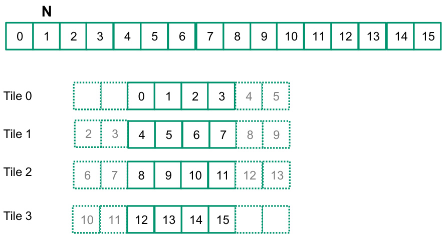
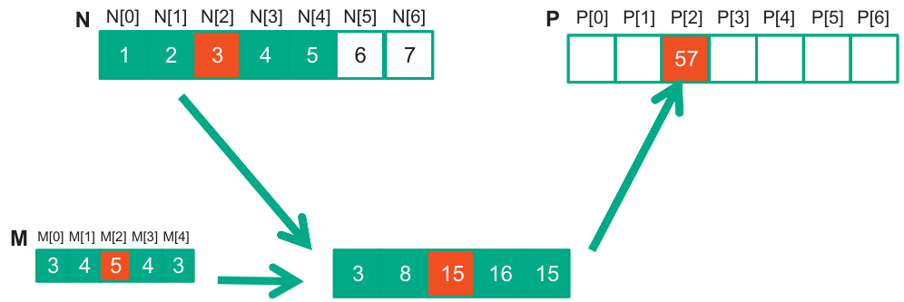
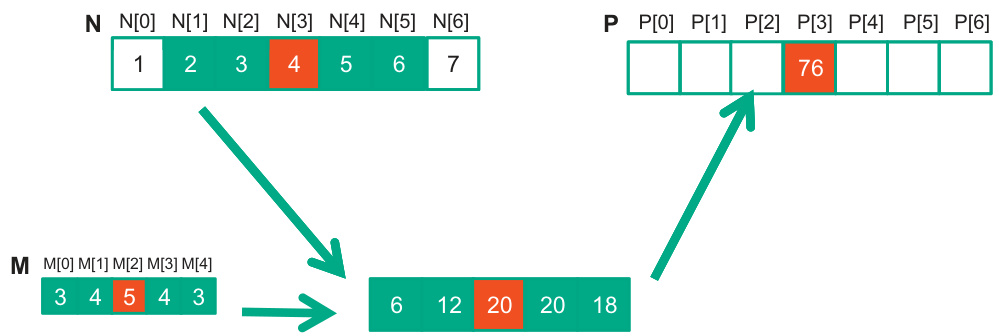

## Algoritmos de Redução Paralelos em CUDA

### Introdução

Este capítulo aborda em profundidade os **algoritmos de redução paralelos** em CUDA, explorando como derivar um único valor de um array de maneira eficiente utilizando a arquitetura paralela das GPUs. Em continuidade ao estudo da execução de warps e threads [^1], discutiremos como implementar algoritmos de redução, tanto de forma sequencial quanto paralela, com ênfase na versão paralela que se assemelha a uma estrutura de torneio com múltiplas rodadas. A utilização de memória compartilhada e a função `__syncthreads()` são cruciais para garantir a correta execução e sincronização dos threads dentro de um bloco.

### Conceitos Fundamentais

Um **algoritmo de redução** tem como objetivo fundamental reduzir um conjunto de dados, tipicamente um array, a um único valor, utilizando uma operação associativa. Exemplos comuns incluem a soma, o produto, o máximo, o mínimo, etc. A escolha entre uma implementação sequencial ou paralela depende do tamanho do array de entrada e dos recursos computacionais disponíveis.

**Implementação Sequencial:**

Em uma implementação sequencial, o algoritmo percorre o array elemento a elemento, aplicando a operação de redução iterativamente. Embora simples de implementar, essa abordagem é limitada pelo gargalo de serialização, tornando-se ineficiente para grandes volumes de dados.

**Implementação Paralela:**

A implementação paralela, por outro lado, explora a capacidade de processamento massivo das GPUs. A ideia central é dividir o array em seções menores e atribuir cada seção a um thread block. Cada thread block, por sua vez, executa uma redução parcial em sua seção alocada, armazenando o resultado em memória compartilhada. Após a redução parcial, os resultados parciais de todos os thread blocks são combinados para obter o resultado final. Este processo frequentemente se assemelha a uma estrutura de torneio, onde cada rodada combina resultados de pares de participantes até que reste apenas um vencedor.


**Passos da Implementação Paralela:**

1.  **Divisão do Array:** O array de entrada é dividido em seções, com cada seção sendo processada por um thread block.



2.  **Redução Parcial:** Cada thread block executa uma redução parcial em sua seção utilizando memória compartilhada. Dentro de cada thread block, cada thread pode processar múltiplos elementos do array para aumentar a granularidade e eficiência.



3.  **Sincronização:** A função `__syncthreads()` é crucial para garantir que todos os threads dentro de um bloco tenham concluído sua redução parcial antes que a próxima iteração comece. Isso evita condições de corrida e garante a consistência dos dados na memória compartilhada.
4.  **Combinação de Resultados Parciais:** Os resultados parciais de cada thread block são combinados para obter o resultado final. Essa etapa pode ser implementada usando um único thread block ou, para arrays muito grandes, através de múltiplas etapas de redução.



**Memória Compartilhada:**

A **memória compartilhada** (shared memory) desempenha um papel fundamental nos algoritmos de redução paralelos. Ela oferece um acesso muito mais rápido aos dados do que a memória global, permitindo que os threads dentro de um bloco colaborem de forma eficiente. Ao armazenar os resultados parciais na memória compartilhada, evitamos o acesso frequente à memória global, o que melhoria significativamente o desempenho.


**Exemplo de Código (Soma Paralela):**

Embora o contexto não forneça um exemplo de código específico, podemos ilustrar o conceito com um pseudo-código:

```c++
__global__ void reduce_sum(float *input, float *output, int n) {
    __shared__ float partial_sum[BLOCK_SIZE];
    int tid = threadIdx.x;
    int i = blockIdx.x * blockDim.x + threadIdx.x;

    // Carregar dados para a memória compartilhada
    partial_sum[tid] = (i < n) ? input[i] : 0.0f;
    __syncthreads();

    // Redução paralela dentro do bloco
    for (int stride = blockDim.x / 2; stride > 0; stride /= 2) {
        if (tid < stride) {
            partial_sum[tid] += partial_sum[tid + stride];
        }
        __syncthreads();
    }

    // Escrever o resultado para a memória global
    if (tid == 0) {
        output[blockIdx.x] = partial_sum[0];
    }
}
```

Neste exemplo, cada thread carrega um elemento do array de entrada para a memória compartilhada. A função `__syncthreads()` garante que todos os threads tenham carregado seus dados antes que a redução comece. A redução é realizada em múltiplas iterações, com cada thread somando seu valor com o valor de outro thread dentro do bloco. Finalmente, o thread 0 escreve o resultado da soma para a memória global.

### Conclusão

Os algoritmos de redução paralelos representam uma poderosa ferramenta para extrair um único valor de um array em GPUs. A utilização eficiente da memória compartilhada e a sincronização cuidadosa dos threads são cruciais para obter o máximo desempenho. A estrutura de torneio, com suas múltiplas rodadas de redução, permite explorar o paralelismo massivo das GPUs, tornando esses algoritmos ideais para aplicações que exigem o processamento de grandes volumes de dados. O entendimento da execução de warps e threads [^1] é fundamental para otimizar o desempenho destes algoritmos, garantindo a correta utilização dos recursos da GPU.

### Referências

[^1]: Warps and Thread Execution (tópico anterior).
<!-- END -->