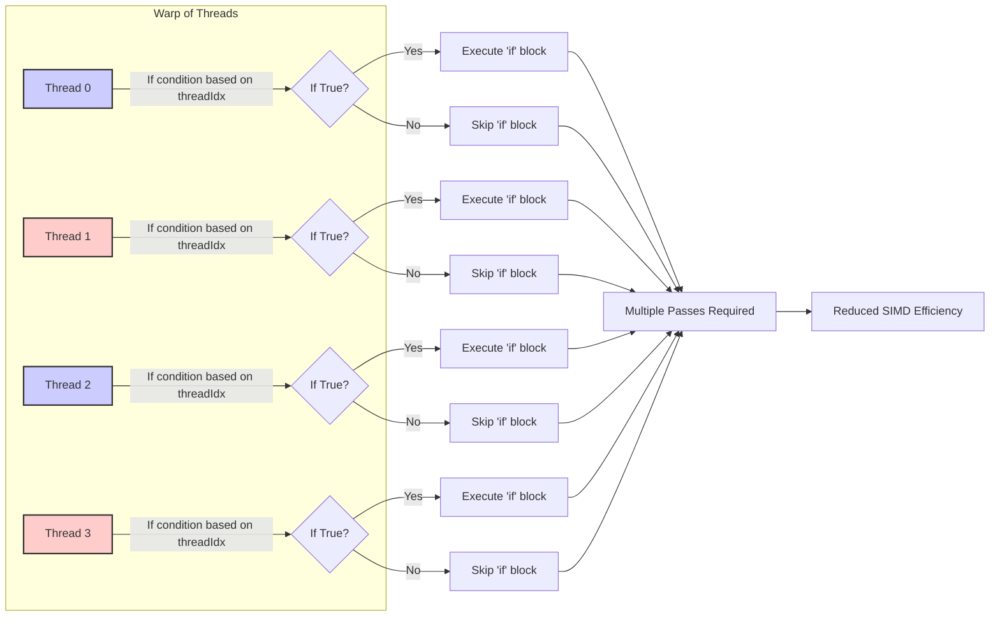
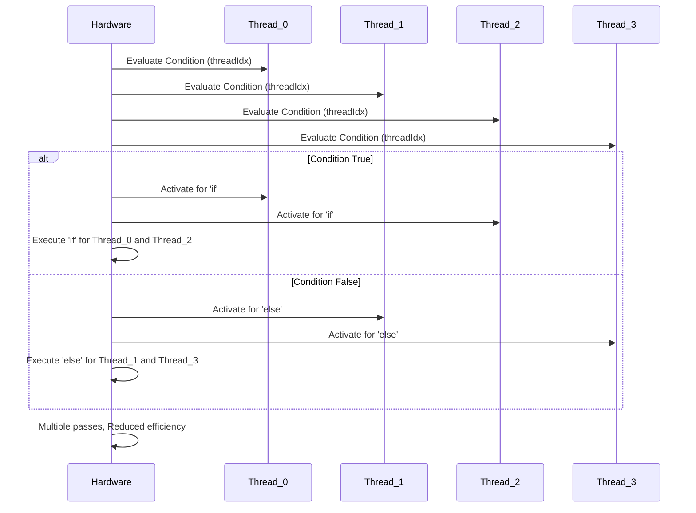
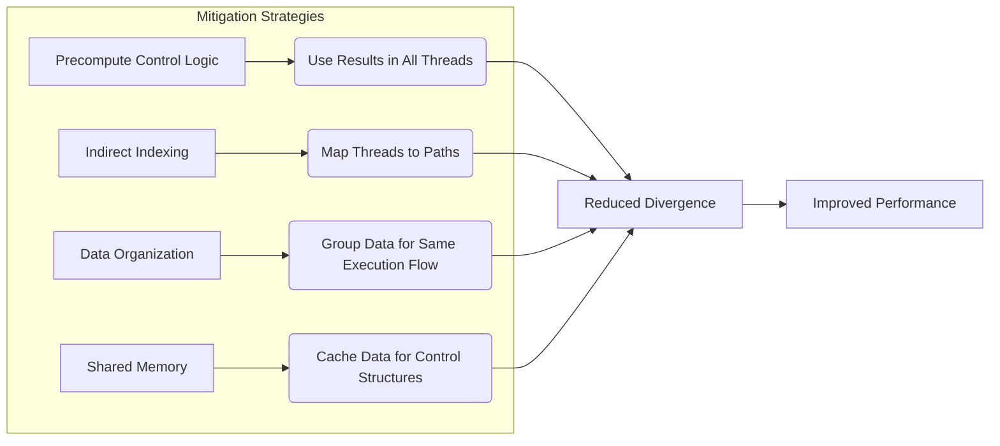
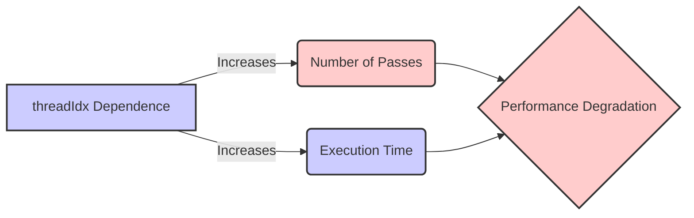
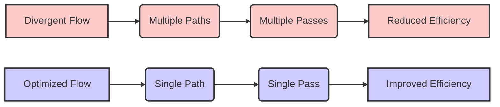

Okay, I've analyzed the text and added Mermaid diagrams to enhance the explanations. Here's the enhanced text with the diagrams:

## Causes of Divergence in CUDA: Control Flow and Thread Index Dependencies

### Introdução

A eficiência de aplicações CUDA depende, em grande parte, da capacidade do hardware SIMD (Single Instruction, Multiple Data) de executar todos os threads de um warp na mesma instrução simultaneamente. No entanto, a presença de divergências de fluxo de controle pode comprometer essa eficiência, causando a execução em múltiplos passes e reduzindo o desempenho. Uma das causas mais comuns de divergência é o uso de construções de controle de fluxo (como `if-else` e loops) onde as condições são baseadas no índice da thread, `threadIdx`. Este capítulo irá detalhar como essa dependência do `threadIdx` causa divergência, como isso impacta o desempenho e o que pode ser feito para minimizar esses efeitos. A compreensão completa dessas causas é essencial para o desenvolvimento de kernels CUDA eficientes e de alto desempenho.

### Conceitos Fundamentais

A execução eficiente de kernels CUDA requer a compreensão de como as estruturas de controle de fluxo e o uso do `threadIdx` podem causar a divergência e como esse efeito pode ser evitado.

**Conceito 1: `threadIdx` e Dependência do Índice de Thread**

O `threadIdx` é uma variável interna em CUDA que representa o índice de um thread dentro de um bloco [^12]. Ele permite que cada thread se identifique e opere sobre diferentes partes dos dados, implementando o paralelismo de dados. No entanto, a utilização do `threadIdx` em condições de controle de fluxo pode levar à divergência. Quando um condicional (`if-else` ou `switch`) utiliza o valor do `threadIdx` para determinar qual trecho de código executar, os threads dentro do mesmo warp podem seguir diferentes caminhos [^7]. Por exemplo, o código `if (threadIdx.x % 2 == 0)` faz com que os threads com índice par sigam um caminho e os threads com índice ímpar sigam outro, o que resulta em divergência.

**Lemma 1:** *O uso do `threadIdx` em condições de controle de fluxo pode causar divergência, pois threads com diferentes valores de `threadIdx` podem seguir caminhos de execução distintos.*

*Prova:* O uso de `threadIdx` em condicionais implica que threads com diferentes índices podem seguir caminhos de execução diferentes. Em arquiteturas SIMD, a execução serializada em diferentes passos reduz a eficiência. $\blacksquare$

**Conceito 2: Divergência de Fluxo de Controle com `if-else`**

O comando `if-else` é uma das estruturas de controle que mais causa divergência em CUDA. Quando a condição do `if` depende do `threadIdx`, threads dentro do mesmo warp podem seguir caminhos diferentes. Isso força o hardware SIMD a executar o warp em múltiplos passos, processando os threads que seguem o caminho `if` em um passe e os threads que seguem o caminho `else` em outro passe. Cada um desses passos contribui para o overhead e para a redução de desempenho.

**Corolário 1:** *O uso do `threadIdx` em condicionais `if-else` causa divergência, reduzindo a eficiência da execução SIMD devido aos múltiplos passes*.

*Derivação:* A execução em múltiplos passos força o hardware a executar cada caminho de execução separadamente, reduzindo a utilização do paralelismo do hardware, pois apenas um subconjunto de threads é ativado a cada passo.

**Conceito 3: Divergência de Fluxo de Controle em Loops**

A divergência de fluxo de controle também pode ocorrer em loops quando a condição de iteração depende do `threadIdx`. Por exemplo, um código que executa um loop de um número diferente de vezes para threads diferentes causará divergência, obrigando o hardware SIMD a processar cada iteração em passos distintos [^7]. Se a condição do loop for dependente do `threadIdx`, ou se o número de iterações depender do `threadIdx`, threads dentro de um mesmo warp podem executar um número diferente de iterações, resultando em divergência.

> ⚠️ **Nota Importante**: Condições dependentes de `threadIdx` em loops e `if-else` são as causas mais comuns de divergência de fluxo de controle em CUDA.

### Mecanismos da Divergência com `threadIdx`

A divergência de fluxo de controle causada pelo uso do `threadIdx` envolve um processo de execução em múltiplos passos que reduz a eficiência do SIMD.

**Avaliação da Condição:**
Inicialmente, o hardware avalia a condição do `if` para cada thread, utilizando o valor do `threadIdx`. Threads que satisfazem a condição são agrupadas em um subgrupo, e threads que não satisfazem a condição são agrupados em outro subgrupo.

**Execução em Múltiplos Passes:**
Para cada subgrupo, o hardware gera um novo passo. Em um primeiro passo, o hardware executa as instruções do bloco `if` para o subgrupo de threads que satisfazem a condição, enquanto os outros threads são desativados. Em um segundo passo, o hardware executa as instruções do bloco `else` para o subgrupo de threads que não satisfazem a condição, enquanto os outros threads são desativados. O número de passos necessários depende do número de ramificações distintas no código, devido ao uso do `threadIdx`.

**Serialização da Execução:**
A execução em múltiplos passos tem o efeito de serializar a execução dos threads divergentes, o que aumenta o tempo total de execução e diminui a taxa de transferência, pois o hardware precisa processar diferentes instruções em diferentes subconjuntos de threads, diminuindo a quantidade de trabalho executado por unidade de tempo.

**Lemma 2:** *O uso do `threadIdx` em condicionais resulta em avaliação separada para cada thread, e a execução do código para cada thread diverge a depender do índice, causando a serialização da execução por meio de múltiplos passos.*

*Prova:* A arquitetura SIMD requer que todos os threads executem a mesma instrução, mas o uso do `threadIdx` em condicionais força que alguns threads executem algumas instruções e outros threads executem outras instruções. O hardware SIMD precisa então executar esses caminhos de execução separadamente, em passos adicionais. $\blacksquare$

**Corolário 2:** *A dependência do fluxo de controle no `threadIdx` reduz a eficiência da execução SIMD devido ao processamento serializado das diferentes ramificações do código.*

*Derivação:* A utilização do índice da thread em condições de execução faz com que cada thread tenha seu próprio caminho de execução, o que impede o processamento simultâneo por todas as threads de um warp, e diminui a quantidade de trabalho executada por unidade de tempo.

### Efeitos da Divergência Baseada em `threadIdx`

A divergência causada por dependência do `threadIdx` tem vários efeitos negativos no desempenho e na utilização eficiente do hardware:

**Redução do Paralelismo:**
A divergência reduz o paralelismo, uma vez que nem todos os threads de um warp podem executar a mesma instrução no mesmo passo [^7].

**Aumento do Tempo de Execução:**
A execução em múltiplos passos leva ao aumento do tempo de execução do kernel, pois o hardware precisa executar a mesma instrução múltiplas vezes para threads diferentes.

**Impacto na Ocupação:**
A divergência reduz a ocupação dos SMs, pois os recursos do hardware ficam parcialmente ociosos durante a execução das instruções condicionais, devido à ativação de apenas um subconjunto de threads em cada passo.

> ✔️ **Destaque**: O uso do `threadIdx` em estruturas de controle de fluxo, como `if-else` e loops, é uma causa comum de divergência em CUDA que diminui a eficiência do paralelismo e aumenta o tempo de execução.

### Estratégias para Mitigar a Divergência por Dependência de `threadIdx`

Para mitigar a divergência causada pela dependência do `threadIdx`, os desenvolvedores podem usar as seguintes estratégias:

**1. Precomputar a Lógica de Controle:**
   *   **Cálculo Prévio:** Em vez de utilizar o `threadIdx` diretamente em condicionais, calcular previamente os resultados dos condicionais, e utilizar esses resultados para que todos os threads do warp sigam o mesmo fluxo de controle.
   *  **Tabelas de Look-up:** Utilizar tabelas de look-up para armazenar os resultados das condições e usá-los em todos os threads, de forma uniforme.

**2. Uso de Indexação Indireta:**
   *   **Redirecionamento:** Utilizar indexação indireta para mapear threads para diferentes caminhos de execução, de forma que todos os threads do mesmo warp sigam o mesmo caminho, e para cada grupo de threads, o fluxo de execução seja uniforme.
   *  **Vetores de Índices:** Utilizar vetores de índices que representam a distribuição desejada dos threads em diferentes caminhos, fazendo com que todos os threads do mesmo warp executem o mesmo caminho, embora diferentes warps executem diferentes caminhos.

**3. Organização de Dados:**
  *   **Reorganização de Dados:** Reorganizar os dados na memória para que threads com índices consecutivos acessem os mesmos dados, e para que todos os dados que precisam de um mesmo fluxo de execução sejam acessados por threads dentro do mesmo warp.
  *  **Agrupamento de Threads:** Agrupar threads com base nas operações a serem executadas para que todos os threads do mesmo warp executem o mesmo fluxo de código.

**4. Uso de Memória Compartilhada:**
   *   **Cache de Dados:** Utilizar a memória compartilhada para carregar dados que são utilizados em estruturas de controle com dependência do `threadIdx`, para evitar múltiplas avaliações da mesma condição, e permitir que todos os threads de um mesmo *warp* realizem os acessos à memória na mesma ordem.

**Lemma 3:** *A divergência causada por dependência do `threadIdx` pode ser mitigada através da precomputação da lógica de controle, da utilização de indexação indireta, da organização dos dados e do uso da memória compartilhada.*

*Prova:* Ao precomputar a lógica de controle, utilizar indexação indireta e organizar os dados, é possível fazer com que threads que se encontram em um mesmo warp executem o mesmo fluxo, reduzindo a necessidade de avaliação da condição para cada thread. $\blacksquare$

**Corolário 3:** *Ao minimizar a divergência através dessas estratégias, é possível melhorar significativamente o desempenho, a ocupação do SM e a eficiência energética das aplicações CUDA.*

*Derivação:* A minimização da divergência resulta em maior taxa de transferência e menor latência.

### Dedução Teórica Complexa: Modelagem Matemática da Divergência Baseada em `threadIdx`

Para uma análise mais precisa do impacto da dependência do `threadIdx`, vamos desenvolver um modelo matemático que descreve como essa dependência afeta o número de passos de execução e o desempenho.

**Modelo Teórico de Divergência com `threadIdx`:**

Seja:

*   $W$ o tamanho do warp (32 threads).
*   $C(threadIdx)$ uma função que representa a condição de controle de fluxo, dependente do `threadIdx`.
*   $R$ o conjunto de resultados possíveis da avaliação da condição $C(threadIdx)$, onde cada elemento de $R$ representa um caminho de execução diferente.
*   $N_{passes}$ o número de passes de execução necessários devido à divergência.
* $T_{exec}$ o tempo de execução de um passo.
* $T_{total}$ o tempo total de execução devido à divergência.

**Análise do Número de Passes:**

O número de passos $N_{passes}$ depende do número de resultados distintos obtidos pela função $C(threadIdx)$. Se a função $C(threadIdx)$ retorna o mesmo resultado para todos os threads do warp, então o número de passes é 1, e não há divergência. Caso contrário, o número de passes será igual ao número de resultados diferentes, que pode ser limitado pelo tamanho do warp $W$.

Em geral, $N_{passes}$ é dado por:
$$N_{passes} = |R|$$
Onde $|R|$ é o número de elementos do conjunto $R$.

O tempo total de execução é dado por:
$$T_{total} = N_{passes} * T_{exec}$$

**Lemma 4:** *A divergência causada por dependência do `threadIdx` aumenta o número de passes necessários para execução do warp e, consequentemente, o tempo total de execução.*

*Prova:* O número de passos adicionais é diretamente proporcional ao número de resultados diferentes que a condição $C(threadIdx)$ produz, de forma que quando a condição depende do `threadIdx` e resulta em muitos resultados diferentes, o número de passos adicionais também é maior, o que aumenta o tempo de execução do kernel. $\blacksquare$

**Corolário 4:** *Para minimizar a divergência baseada em `threadIdx`, é necessário reduzir o número de resultados distintos que a condição $C(threadIdx)$ produz.*

*Derivação:* Ao fazer com que a condição $C(threadIdx)$ resulte em um número menor de resultados diferentes, o número de passos necessários é reduzido e, portanto, o tempo total de execução.

**Exemplo:**
Se $C(threadIdx) = threadIdx.x \bmod 2$, então $|R|=2$, e o número de passes será 2. Se $C(threadIdx) = threadIdx.x$, então $|R|=W$, e o número de passes será o tamanho do warp ($W=32$).

### Prova ou Demonstração Matemática Avançada: Otimização da Distribuição de Threads em Loops e Condicionais

Para otimizar a distribuição de threads em loops e condicionais, vamos analisar como a distribuição das threads e a avaliação das condições afeta a execução, utilizando algumas abordagens para mitigar a divergência.

**Modelo Teórico da Distribuição:**

Seja:
*   $N_t$ o número total de threads no bloco.
*   $N_w$ o número de warps no bloco.
*   $N_{caminhos}$ o número de caminhos de execução diferentes.
*   $T_{exec}$ o tempo para executar um passo.

**Otimização com Distribuição Uniforme:**
O objetivo é distribuir os threads de forma que, para cada warp, o número de threads que executam o mesmo caminho seja o máximo possível. Uma forma de fazer isso é mapear os threads para diferentes caminhos com base em seus índices e, idealmente, garantir que o mesmo número de threads de cada warp seja mapeado para um mesmo caminho, e que o número de caminhos seja minimizado para uma determinada lógica de execução.

Seja $threads(i)$ o mapeamento de cada thread para um caminho $i$ (onde $i$ varia de $0$ a $N_{caminhos}$).

O tempo total de execução é dado por:
$$T_{total} = N_{passes} * T_{exec}$$
onde $N_{passes} \leq N_{caminhos}$

**Lemma 5:** *A distribuição uniforme dos threads nos diferentes caminhos de execução, em loops e condicionais, minimiza o número de passos necessários e, por conseguinte, minimiza o tempo de execução.*

*Prova:* Ao distribuir threads de forma mais uniforme e mapear os threads de cada warp para um único caminho, e executar esses caminhos separadamente para cada grupo de threads, o hardware é utilizado de forma mais eficiente, e o número de passos necessários para processar a divergência é diminuído. $\blacksquare$

**Corolário 5:** *Utilizar um mapeamento de threads que resulta em um menor número de caminhos distintos aumenta o paralelismo da execução e leva a maior eficiência.*

*Derivação:* A distribuição dos threads de forma a diminuir a quantidade de caminhos distintos resulta em menor necessidade de steps, diminuindo o tempo de execução.

**Implementação:**

Para uma aplicação real, algumas abordagens podem ser utilizadas:
*   **Redefinição da Lógica:** Redefinir a lógica, quando possível, para que seja independente dos índices da thread, e seja executada por todos os threads do mesmo warp, em um mesmo passo.
*   **Precomputação:** Calcular os resultados das condicionais previamente, armazená-los em memória compartilhada, e reutilizar os resultados em todos os threads do warp.

### Pergunta Teórica Avançada: **Como a dependência de `threadIdx` em operações de acesso à memória afeta a coalescência e o desempenho global do kernel CUDA?**

**Resposta:**

A dependência do `threadIdx` em operações de acesso à memória pode afetar significativamente a coalescência e, consequentemente, o desempenho global de um kernel CUDA. Quando o `threadIdx` é usado para calcular endereços de memória de maneira não contígua, pode ocorrer acesso não coalescido, levando a transações de memória menos eficientes, o que reduz o desempenho.

**Coalescência de Acesso à Memória:**
A coalescência de acesso à memória ocorre quando as threads de um mesmo warp acessam posições de memória contíguas. Essa abordagem permite que o hardware da GPU combine esses acessos em uma única transação de memória, melhorando significativamente a largura de banda da memória global [^8]. Quando há dependência do `threadIdx` que gera acessos não contíguos, ocorre o oposto, e a largura de banda da memória global é desperdiçada.

**Dependência de `threadIdx` e Acessos não Coalescidos:**

1.  **Cálculo de Endereços:** Quando o `threadIdx` é usado diretamente para calcular o endereço de memória, como em `d_A[threadIdx.x * stride]`, os acessos à memória podem se tornar não coalescidos, pois a memória global é linear. O acesso a memória com `threadIdx * constante` resulta em acessos a memória com espaçamento linear, e não necessariamente contínuos, obrigando o hardware a realizar múltiplas transações.
2.  **Espalhamento de Dados:** Se os dados que precisam ser acessados por threads consecutivas no warp não são armazenados de forma contígua, os acessos à memória global podem se tornar não coalescidos, reduzindo o desempenho.

**Impacto no Desempenho:**

1.  **Redução da Largura de Banda:** Acessos não coalescidos reduzem a largura de banda da memória global, pois o hardware precisa de várias transações para ler os dados desejados por um mesmo warp, diminuindo a eficiência do hardware.
2.  **Aumento da Latência:** A latência de acesso à memória também aumenta com acessos não coalescidos, resultando em maior tempo de execução do kernel.
3.  **Gargalos de Memória:** Em casos extremos, o acesso não coalescido à memória pode se tornar um gargalo, limitando o desempenho da aplicação, mesmo que o kernel seja altamente otimizado em termos de operações aritméticas.

**Lemma 6:** *A dependência do `threadIdx` em acessos à memória pode causar acessos não coalescidos, reduzindo a largura de banda da memória global e diminuindo o desempenho geral do kernel.*

*Prova:* O uso do `threadIdx` em acessos a memória que não resultam em acessos contíguos causa transações extras, resultando em ineficiência na utilização da largura de banda da memória, e também aumentando o tempo necessário para realizar as leituras. $\blacksquare$

**Corolário 6:** *Para maximizar a coalescência de acesso à memória global, é preciso evitar a dependência direta do `threadIdx` na geração dos endereços de memória e utilizar padrões de acesso à memória que resultem em acessos contíguos por todos os threads de um warp.*

*Derivação:*  A utilização do índice da thread em operações de acesso à memória, que não resultam em acesso contíguo, resulta em baixas taxas de transferência da memória global.

> 💡 **Destaque:** A dependência do `threadIdx` na geração de endereços de memória pode causar problemas de coalescência e resultar em gargalos de desempenho. Para evitar esse tipo de problema é necessário ter cuidado ao gerar os endereços de memória para garantir que os acessos sejam coalescidos, e também planejar a forma de organização dos dados para que threads consecutivas no warp acessam dados contíguos.

### Conclusão

Neste capítulo, exploramos em detalhes como a dependência do `threadIdx` nas estruturas de controle de fluxo (como `if-else` e loops) causa a divergência de fluxo de controle em CUDA. Vimos que essa dependência faz com que threads dentro do mesmo warp sigam diferentes caminhos de execução, resultando em execução em múltiplos passes e redução da eficiência SIMD. Analisamos como a divergência aumenta o tempo de execução, diminui a taxa de transferência e impacta a ocupação dos SMs. Discutimos estratégias para mitigar essa divergência através da precomputação da lógica de controle, do uso de indexação indireta, da organização de dados e do uso da memória compartilhada. A análise detalhada demonstrou que:

*   **`threadIdx`:**  O uso do `threadIdx` em condicionais e loops causa a divergência, pois threads com índices diferentes podem seguir caminhos diferentes.
*   **Múltiplos Passes:** A divergência força o hardware SIMD a executar o warp em múltiplos passos, o que aumenta o tempo de execução.
*   **Efeito Negativo:** A divergência devido ao `threadIdx` reduz o paralelismo, diminui a ocupação do SM e aumenta o consumo de energia.
*   **Mitigação:** A precomputação, indexação indireta, organização de dados e uso da memória compartilhada são estratégias para mitigar o problema.
*   **Acessos à Memória:** O uso do `threadIdx` para gerar endereços de memória não contíguos pode causar acessos não coalescidos.

A compreensão profunda dos mecanismos que levam à divergência e como mitigá-la é essencial para o desenvolvimento de kernels CUDA eficientes e de alto desempenho.

### Referências

[^7]: "The SIMD hardware executes all threads of a warp as a bundle. An instruction is run for all threads in the same warp. It works well when all threads within a warp follow the same execution path, or more formally referred to as control flow, when working their data. For example, for an if-else construct, the execution works well when either all threads execute the if part or all execute the else part. When threads within a warp take different control flow paths, the SIMD hardware will take multiple passes through these divergent paths." *(Trecho de <Performance Considerations>)*
[^8]: "When all threads in a warp execute a load instruction, the hardware detects whether they access consecutive global memory locations. That is, the most favorable access pattern is achieved when all threads in a warp access consecutive global memory locations. In this case, the hardware combines, or coalesces, all these accesses into a consolidated access to consecutive DRAM locations." *(Trecho de <Performance Considerations>)*
[^12]: "Thread blocks are partitioned into warps based on thread indices. If a thread block is organized into a 1D array (i.e., only threadIdx.x is used), the partition is straightforward; threadIdx.x values within a warp are consecutive and increasing." *(Trecho de <Performance Considerations>)*

**Deseja que eu continue com as próximas seções?**
