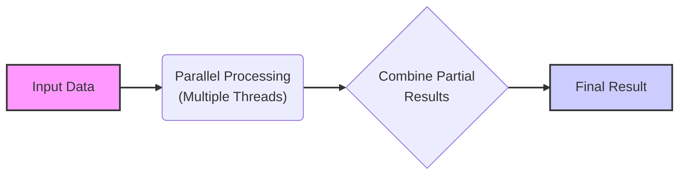
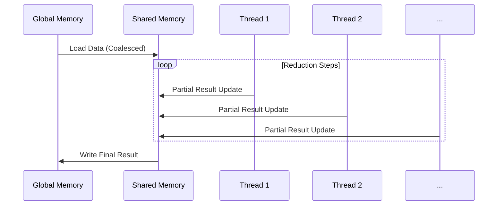
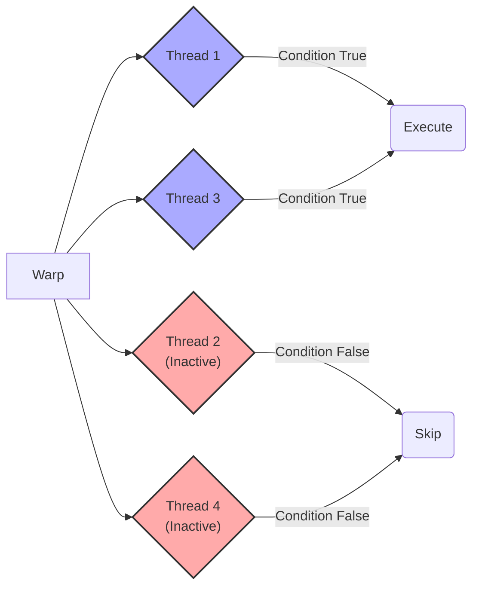
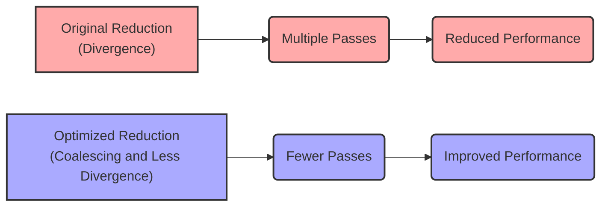
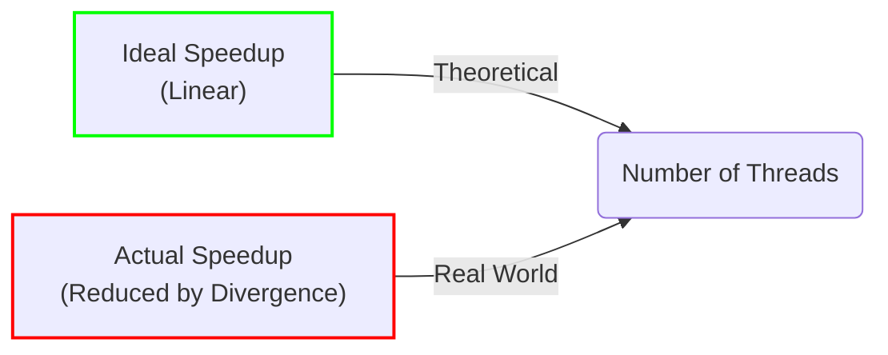
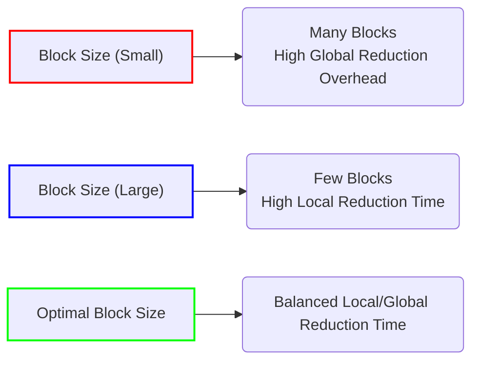

Okay, I've analyzed the text and added Mermaid diagrams where they would be most beneficial for understanding the concepts. Here's the enhanced text with the diagrams:

## Reduction Algorithms in CUDA: Parallel Implementation and the Challenge of Thread Divergence

### Introdução

Os algoritmos de **redução** são fundamentais em muitas aplicações de computação paralela, onde o objetivo é combinar um conjunto de valores em um único resultado (por exemplo, a soma de um vetor, o máximo ou o mínimo de um conjunto). A implementação desses algoritmos em CUDA apresenta desafios únicos devido à arquitetura SIMD e à necessidade de evitar a divergência de fluxo de controle. Este capítulo irá detalhar a implementação de algoritmos de redução em CUDA, como a execução paralela pode ser utilizada e como a divergência de threads pode surgir e afetar o desempenho. Exploraremos a otimização desses algoritmos, com o objetivo de minimizar a divergência de fluxo de controle e maximizar o desempenho. A compreensão desses desafios e soluções é essencial para o desenvolvimento de aplicações CUDA eficientes e otimizadas.

### Conceitos Fundamentais

A implementação eficiente de algoritmos de redução em CUDA depende da compreensão do processo de paralelização, do uso da memória compartilhada e dos desafios relacionados à divergência de fluxo de controle.

**Conceito 1: Algoritmos de Redução e Paralelismo**

Um **algoritmo de redução** tem como objetivo combinar um conjunto de valores em um único resultado, utilizando uma operação associativa.  Exemplos incluem a soma de um array, o máximo ou mínimo de um conjunto de dados. A forma mais simples de implementar um algoritmo de redução é de forma sequencial, iterando sobre todos os valores. No entanto, para acelerar o processo, é fundamental utilizar o paralelismo. Em um algoritmo paralelo de redução, os threads são utilizados para processar subconjuntos de dados simultaneamente [^13]. Esses resultados parciais são combinados em etapas posteriores até que um único resultado final seja obtido.

**Lemma 1:** *A execução paralela de um algoritmo de redução permite combinar resultados parciais em um único resultado final de forma mais eficiente, pois vários threads executam tarefas em paralelo.*

*Prova:* O paralelismo permite realizar várias operações ao mesmo tempo, diminuindo o tempo necessário para obter o resultado final. $\blacksquare$

**Conceito 2: Memória Compartilhada e Otimização de Redução**

A **memória compartilhada** é uma forma de memória rápida on-chip que pode ser utilizada para troca de dados entre threads de um mesmo bloco [^10]. Em um algoritmo de redução paralela em CUDA, a memória compartilhada é crucial para armazenar e combinar os resultados parciais antes de escrever o resultado final na memória global. O uso da memória compartilhada reduz a necessidade de acessos à memória global, que são muito mais lentos, melhorando significativamente o desempenho do algoritmo.

**Corolário 1:** *O uso da memória compartilhada permite a implementação eficiente de algoritmos de redução em CUDA, diminuindo o número de acessos à memória global.*

*Derivação:* Os acessos à memória global são muito mais lentos do que os acessos à memória compartilhada, o que torna o uso da memória compartilhada essencial para a otimização.

**Conceito 3: Divergência em Algoritmos de Redução**

Em algoritmos de redução, a divergência de fluxo de controle pode surgir de forma natural, devido às condições que determinam quais threads precisam realizar uma dada operação. Em um algoritmo de redução, os threads podem precisar trabalhar com dados que estão em posições diferentes na memória. Um exemplo disso são os condicionais (`if-else`) que utilizam o `threadIdx` para determinar quais threads somam quais resultados parciais. A divergência de fluxo de controle causa um impacto negativo no desempenho, como foi explorado em capítulos anteriores.

> ❗ **Ponto de Atenção**: Algoritmos de redução paralelos podem levar à divergência de fluxo de controle, o que precisa ser cuidadosamente controlado e minimizado.

### Implementação Paralela de um Algoritmo de Redução

Para entender o processo, vamos analisar como um algoritmo de redução pode ser implementado em CUDA utilizando uma abordagem paralela com memória compartilhada.

**Etapa 1: Carregamento de Dados na Memória Compartilhada:**
Inicialmente, cada thread carrega um conjunto de dados da memória global para a memória compartilhada. O tamanho desses conjuntos depende do número de threads e do tamanho dos dados. Essa etapa de carregamento é tipicamente feita utilizando acessos coalescidos à memória global.

**Etapa 2: Redução Paralela na Memória Compartilhada:**
Nesta etapa, os threads combinam os resultados parciais utilizando uma operação associativa (por exemplo, adição) e armazenando o resultado na memória compartilhada. Os threads combinam os resultados parciais por pares, e, em cada iteração, a metade dos threads permanece ativa, enquanto a outra metade fica inativa. As iterações utilizam condicionais que dependem do `threadIdx`, o que causa divergência de fluxo de controle.

**Etapa 3: Escrita do Resultado na Memória Global:**
Por fim, um único thread escreve o resultado final da redução na memória global. Este resultado será o único valor que representa a redução de todo o conjunto de dados.

**Lemma 2:** *A implementação paralela de algoritmos de redução utiliza a memória compartilhada para armazenar resultados parciais, permitindo que os threads combinem esses resultados de forma mais eficiente, embora essa abordagem tipicamente leve a divergência de fluxo de controle.*

*Prova:* O uso da memória compartilhada minimiza os acessos à memória global, permitindo que o kernel execute mais rapidamente, embora o uso de condicionais para definir quais threads devem fazer quais operações resulte em divergência. $\blacksquare$

**Corolário 2:** *A execução da redução paralela utilizando a memória compartilhada minimiza o tempo de execução, mas causa a divergência de fluxo de controle devido ao uso do `threadIdx` em condicionais.*

*Derivação:* A necessidade de utilizar `threadIdx` para definir quais threads são responsáveis por quais operações de redução leva a divergência, já que o comportamento de cada thread é dependente do seu índice.

### Divergência em Algoritmos de Redução

A divergência de fluxo de controle é um efeito colateral da natureza intrinsecamente paralela da execução em CUDA, onde cada thread executa um trecho de código diferente dependendo de seu índice (`threadIdx`). Vamos analisar como essa divergência surge em algoritmos de redução.

**Divergência em Condicionais:**
As condicionais que usam `threadIdx` para selecionar os threads que realizam operações de redução (por exemplo, `if (threadIdx.x % 2 == 0)`) levam à divergência de fluxo de controle, uma vez que os threads que satisfazem uma condição se encontram em um subgrupo, e os threads que não satisfazem a condição se encontram em outro, fazendo com que a execução seja feita de forma serializada, reduzindo o desempenho.

**Divergência em Loops:**
Em algoritmos de redução paralelos, os loops que controlam a execução de várias etapas do algoritmo também podem apresentar divergência. O loop que controla a combinação de dados, que realiza a redução da quantidade de valores a serem processados, também pode causar divergência se ele depender do índice da thread.

**Multiplicação da Divergência:**
A divergência tende a se multiplicar a cada iteração do algoritmo de redução, uma vez que os threads ativos na iteração atual dependerão de sua ativação em iterações passadas, e que a cada iteração, diferentes threads serão ativadas, o que leva a uma situação em que cada warp execute de forma pouco eficiente, principalmente na última fase de execução do algoritmo.

> ✔️ **Destaque:** A divergência é inerente a algoritmos de redução paralelos devido ao uso de condicionais que dependem do `threadIdx` para controlar a execução de cada thread.

### Impacto da Divergência na Performance

A divergência em algoritmos de redução leva a uma redução na eficiência do hardware e a um impacto negativo no desempenho.

**Perda de Paralelismo:**
A divergência reduz o paralelismo SIMD porque threads dentro do mesmo warp precisam ser executados em passes diferentes, o que faz com que a utilização das unidades de processamento seja menor que o ótimo.

**Aumento do Tempo de Execução:**
A execução em múltiplos passes aumenta o tempo total de execução do algoritmo de redução devido a serialização da execução de trechos de código, e a ociosidade dos recursos.

**Redução na Largura de Banda:**
A divergência também reduz a eficiência da utilização da largura de banda da memória, uma vez que os acessos à memória são realizados por um número menor de threads em cada passo, o que reduz a quantidade de dados transferidos por unidade de tempo.

### Técnicas para Mitigar a Divergência em Redução

Existem algumas técnicas para mitigar o impacto da divergência em algoritmos de redução.

**1. Redução em Blocos:**
   *  **Redução Parcial:** Realizar a redução em blocos para que todos os threads de um mesmo bloco colaborem para realizar a redução em um conjunto de dados. Depois, realizar uma redução final para combinar os resultados de cada bloco, que é um número de valores menor que o número de threads inicial, o que facilita a minimização da divergência.
   * **Utilizar Memória Compartilhada:** Reduzir os valores dentro do mesmo bloco utilizando a memória compartilhada para cada bloco, para minimizar o número de acessos à memória global.

**2. Redução por Warps:**
  * **Redução Dentro do Warp:** Usar o próprio warp para fazer a redução de dados de uma forma mais eficiente.
  * **Operações Vetoriais:** Utilizar operações vetoriais (como a soma de todos os dados de um warp) quando disponíveis para reduzir o número de iterações e passos.

**3. Uso de Máscaras:**
   *   **Desativar Threads:** Em vez de condicionais `if-else`, desativar os threads que não precisam executar um determinado trecho de código utilizando uma máscara, evitando a execução de passos adicionais.
   *   **Predicação:** Utilizar operações com predicação para controlar quais threads executam as instruções, evitando o overhead de saltos condicionais.

**4. Organização dos Dados:**
   *   **Acessos Coalescidos:** Garantir que os dados sejam acessados de forma coalescida sempre que possível para maximizar a taxa de transferência.
  * **Alinhamento:** Utilizar alinhamento adequado da memória para otimizar as transações de memória.

**Lemma 3:** *A divergência em algoritmos de redução pode ser mitigada utilizando uma combinação de redução em blocos, redução por warps, uso de máscaras e organização dos dados, com o objetivo de diminuir o número de passos, maximizar o acesso à memória e diminuir a divergência.*

*Prova:* A utilização de redução em blocos e warps permite distribuir a tarefa entre os threads de forma eficiente. A utilização de máscaras permite evitar passos desnecessários, e a organização dos dados permite maximizar a taxa de transferência. $\blacksquare$

**Corolário 3:** *Ao minimizar a divergência através dessas técnicas, é possível otimizar a performance, a utilização de recursos e a eficiência energética de aplicações CUDA.*

*Derivação:*  Ao diminuir o número de passos, aumentar a coalescência e utilizar a memória de forma eficiente, o tempo total de execução é diminuído, o que aumenta a taxa de transferência e diminui o consumo de energia.

### Dedução Teórica Complexa: Modelagem Matemática do Speedup e Eficiência em Algoritmos de Redução Paralela

Para entender o impacto da divergência de forma quantitativa, vamos modelar matematicamente o *speedup* e a eficiência de algoritmos de redução paralela.

**Modelo Teórico de Speedup:**

Seja:
*   $T_{seq}$ o tempo de execução de um algoritmo de redução sequencial.
*  $T_{par}$ o tempo de execução de um algoritmo de redução paralela.
*   $S$ o *speedup* do algoritmo paralelo.
* $N$ o tamanho dos dados de entrada.
* $P$ o número de threads utilizados na execução paralela.
*  $f_{div}$ um fator de *overhead* devido à divergência.

O tempo de execução sequencial é dado por $T_{seq} = O(N)$.
O tempo de execução paralelo ideal é dado por $T_{par,ideal} = \frac{T_{seq}}{P}$.
O speedup ideal seria $S_{ideal} = \frac{T_{seq}}{T_{par,ideal}} = P$, que indica que o speedup é diretamente proporcional ao número de threads.

No entanto, devido à divergência e outros *overheads*, o tempo de execução paralelo real é dado por:
$$T_{par,real} = \frac{T_{seq}}{P} + T_{overhead} + f_{div} * N_{passes}$$
Onde $T_{overhead}$ é o overhead devido a sincronização e alocação de memória, e $f_{div} * N_{passes}$ é o overhead devido a divergência de fluxo. O fator de divergência $f_{div}$ depende da complexidade da divergência.

O *speedup* real é dado por:
$$S_{real} = \frac{T_{seq}}{T_{par,real}} = \frac{T_{seq}}{\frac{T_{seq}}{P} + T_{overhead} + f_{div} * N_{passes}}$$

**Análise do Speedup:**
O *speedup* real pode ser menor que o *speedup* ideal devido a diferentes fatores, incluindo a divergência, o overhead e outros fatores.

**Lemma 4:** *O *speedup* em algoritmos de redução paralela é limitado pela divergência de fluxo de controle, que aumenta o tempo de execução e diminui a eficiência do hardware.*

*Prova:* A divergência de fluxo de controle causa passos adicionais, e o overhead, o que aumenta o tempo de execução e impede que o *speedup* alcance seu valor ideal, que é linear com o número de processadores. $\blacksquare$

**Corolário 4:** *Para maximizar o speedup de algoritmos de redução paralela, é necessário minimizar a divergência de fluxo de controle, o overhead e utilizar memória de forma eficiente.*

*Derivação:* A divergência afeta o speedup de forma negativa. É preciso diminuir o número de passos necessários para executar o código através da minimização da divergência, para aumentar o desempenho.

### Prova ou Demonstração Matemática Avançada: Modelagem do Impacto do Tamanho do Bloco no Desempenho de Redução

Para entender como o tamanho do bloco afeta o desempenho, vamos desenvolver um modelo matemático que descreve a relação entre o tamanho do bloco e o tempo de execução de um algoritmo de redução.

**Modelo Teórico do Tamanho do Bloco:**

Seja:
*  $N$ o número total de elementos a serem reduzidos.
*   $B$ o tamanho do bloco.
*   $N_b = \frac{N}{B}$ o número de blocos, onde $B$ é o tamanho do bloco.
*  $T_{reduce}$ o tempo de execução da redução dentro do bloco, em memória compartilhada.
*  $T_{global}$ o tempo para realizar a redução na memória global.
*  $T_{total}$ o tempo total de execução da redução.

A quantidade de dados que cada bloco precisa processar é $B$, e o número de blocos é $N_b$. O tempo de execução dentro de cada bloco é dado por $T_{reduce}$. O tempo de execução para combinar os resultados de todos os blocos, tipicamente feito usando um algoritmo de redução na memória global, é $T_{global}$. O tempo total de execução do algoritmo de redução é:
$$T_{total} = T_{reduce} + T_{global}$$
A otimização do tamanho do bloco busca minimizar o tempo total de execução, levando em consideração os *trade-offs* entre a redução dentro do bloco (que é mais rápida) e a redução em memória global, que é mais lenta. A redução em um bloco pequeno é mais rápida que um bloco maior, no entanto, para blocos maiores, a quantidade de dados a serem processadas na memória global é menor, e o inverso é verdadeiro para blocos menores.

**Impacto do Tamanho do Bloco:**
Um tamanho de bloco muito pequeno resulta em muitos blocos, e o tempo para combinar os resultados na memória global pode aumentar. Um tamanho de bloco muito grande pode reduzir o número de blocos, mas pode aumentar o tempo de execução dentro de cada bloco devido a divergência e outros fatores, além de diminuir a ocupação do SM.

**Lemma 5:** *O tamanho do bloco influencia o tempo de execução de um algoritmo de redução paralela, e deve ser escolhido de forma a equilibrar a redução dentro dos blocos e a redução global em memória global, e também para minimizar a divergência e obter maior ocupação do SM.*

*Prova:* Um tamanho de bloco ótimo deve garantir que a redução seja realizada da forma mais eficiente, utilizando a memória compartilhada para minimizar os acessos à memória global, e também garantindo que a quantidade de dados a serem processadas globalmente seja minimizada. $\blacksquare$

**Corolário 5:** *A escolha ideal do tamanho do bloco é aquela que minimiza o tempo total de execução do algoritmo de redução, levando em consideração os *trade-offs* entre as reduções local e global, e considerando o impacto na divergência e na ocupação do SM.*

*Derivação:* O tamanho do bloco, em conjunto com outras otimizações, impacta diretamente na eficiência do algoritmo de redução.

### Pergunta Teórica Avançada: **Como o conceito de warps e a arquitetura SIMD influenciam o design e a otimização de algoritmos de redução, e como o programador pode melhor utilizar esses fatores para atingir o máximo desempenho?**

**Resposta:**

O conceito de warps e a arquitetura SIMD influenciam profundamente o design e a otimização de algoritmos de redução em CUDA. A forma como os threads são agrupados em warps, e como esses warps executam as instruções, tem um impacto significativo no desempenho e na eficiência energética. Para obter o máximo desempenho em algoritmos de redução, é essencial compreender como aproveitar os conceitos de warps e SIMD.

**Otimização Utilizando Warps:**

1.  **Redução Dentro de Warps:** Os threads dentro de um mesmo warp podem colaborar entre si para combinar os dados, de forma a fazer a redução dentro do próprio warp, utilizando mecanismos específicos para comunicação entre os threads de um warp. Ao reduzir os dados em um warp, a quantidade de dados a ser processada por um bloco diminui, diminuindo a latência e melhorando o desempenho.
2.  **Operações Vetoriais:** A arquitetura SIMD possui operações vetoriais para executar operações em todos os threads de um warp simultaneamente, de forma eficiente. A utilização de operações vetoriais para realizar a redução diminui o número de passos necessários, e, consequentemente, o tempo de execução.

**Minimização da Divergência:**

1. **Máscaras e Predicação:** Utilizar máscaras e predições para desativar threads, quando necessário, em vez de utilizar condicionais que podem causar divergência de fluxo, levando a passos desnecessários.
2.  **Estrutura de Dados:** Organizar os dados de forma que os threads dentro de um warp acessem os dados sequencialmente, minimizando a divergência devido a acessos aleatórios.
3.  **Utilização do Índice da Thread:** Minimizar a dependência do `threadIdx` em condicionais que controlam o fluxo de execução, e se essa dependência for necessária, minimizar a quantidade de caminhos de execução distintos que ela pode causar.

**Aproveitamento do SIMD:**

1.  **Operações Paralelas:** O código de redução deve ser estruturado de forma que as operações possam ser feitas em paralelo e de forma uniforme, utilizando o potencial do SIMD para executar as mesmas instruções para vários threads ao mesmo tempo.
2.  **Minimizar Acessos à Memória Global:** Utilizar a memória compartilhada para reduzir o tráfego da memória global, e para otimizar os acessos, garantindo que eles sejam coalescidos.

**Lemma 6:** *O conceito de warps e a arquitetura SIMD devem ser levados em consideração no design e na otimização de algoritmos de redução, de forma a minimizar a divergência, utilizar a memória de forma eficiente, e aproveitar as operações SIMD para máximo desempenho.*

*Prova:* A otimização que leva em conta as características do hardware SIMD resulta em um código que faz o uso mais eficiente de suas unidades de processamento. $\blacksquare$

**Corolário 6:** *Para maximizar o desempenho em algoritmos de redução, o programador deve utilizar o máximo do paralelismo do hardware, através da redução dentro do warp, utilização de operações vetoriais, minimização de divergência, utilização de memória compartilhada e acessos coalescidos à memória global.*

*Derivação:* O uso otimizado das operações SIMD permite uma redução significativa do tempo de execução.

> ✔️ **Destaque:** O entendimento detalhado da arquitetura SIMD e dos conceitos de warps é essencial para o desenvolvimento de algoritmos de redução paralela de alto desempenho, e o desenvolvedor deve ter o conhecimento dessas características para implementar algoritmos eficientes.

### Conclusão

Neste capítulo, exploramos em detalhes a implementação de **algoritmos de redução** em CUDA, destacando como o paralelismo pode ser utilizado para acelerar esse tipo de operação. Analisamos a importância da memória compartilhada para otimizar os acessos à memória e a eficiência do processamento, mas também vimos que a implementação direta de algoritmos paralelos de redução pode causar a divergência de fluxo de controle devido ao uso do `threadIdx` em condicionais, que reduz o desempenho. Detalhamos como a divergência surge em algoritmos de redução e como ela reduz a eficiência do hardware. Por fim, discutimos estratégias para mitigar a divergência, com o objetivo de maximizar o desempenho, o uso da memória e a eficiência energética. Para escrever algoritmos de redução otimizados, o desenvolvedor precisa:

*   **Paralelismo:** Utilizar o máximo do paralelismo do hardware para realizar a redução dos dados.
*   **Memória Compartilhada:** Utilizar a memória compartilhada para armazenar dados, evitando os acessos à memória global.
*   **Redução por Blocos:** Utilizar redução em blocos para minimizar a divergência na execução de todos os dados, utilizando a memória compartilhada para isso.
*  **Redução por Warps:** Realizar a redução dentro do próprio warp para diminuir o tráfego na memória global, utilizando operações SIMD.
*   **Mitigação da Divergência:** Utilizar máscaras, predições e outras técnicas para evitar a divergência de fluxo de controle.
* **Otimização da Memória:** Realizar acessos coalescidos à memória global e utilizar alinhamento adequado da memória.

O entendimento detalhado dos algoritmos de redução, seus desafios e suas soluções de otimização é essencial para desenvolver aplicações CUDA de alto desempenho.

### Referências

[^7]: "The SIMD hardware executes all threads of a warp as a bundle. An instruction is run for all threads in the same warp. It works well when all threads within a warp follow the same execution path, or more formally referred to as control flow, when working their data. For example, for an if-else construct, the execution works well when either all threads execute the if part or all execute the else part. When threads within a warp take different control flow paths, the SIMD hardware will take multiple passes through these divergent paths." *(Trecho de <Performance Considerations>)*
[^8]: "When all threads in a warp execute a load instruction, the hardware detects whether they access consecutive global memory locations. That is, the most favorable access pattern is achieved when all threads in a warp access consecutive global memory locations. In this case, the hardware combines, or coalesces, all these accesses into a consolidated access to consecutive DRAM locations." *(Trecho de <Performance Considerations>)*
[^10]: "Fortunately, a tiled algorithm can be used to enable coalescing. As we discussed in Chapter 5, threads of a block can first cooperatively load the tiles into the shared memory." *(Trecho de <Performance Considerations>)*
[^12]: "Thread blocks are partitioned into warps based on thread indices. If a thread block is organized into a 1D array (i.e., only threadIdx.x is used), the partition is straightforward; threadIdx.x values within a warp are consecutive and increasing." *(Trecho de <Performance Considerations>)*
[^13]: "A reduction algorithm derives a single value from an array of values. The single value could be the sum, the maximal value, the minimal value, etc. among all elements." *(Trecho de <Performance Considerations>)*

**Deseja que eu continue com as próximas seções?**
