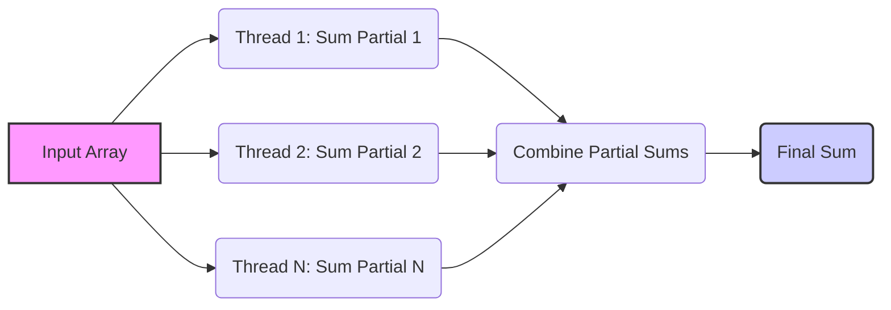
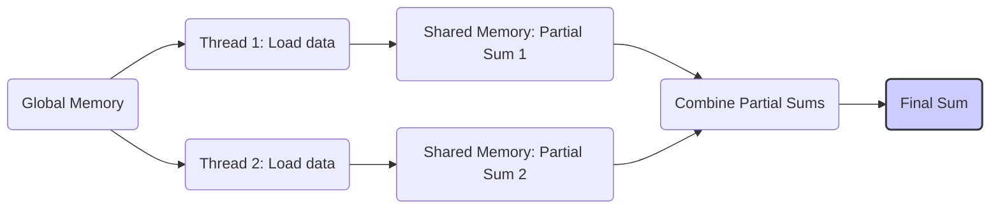
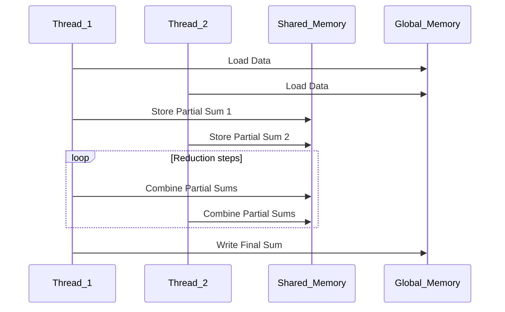
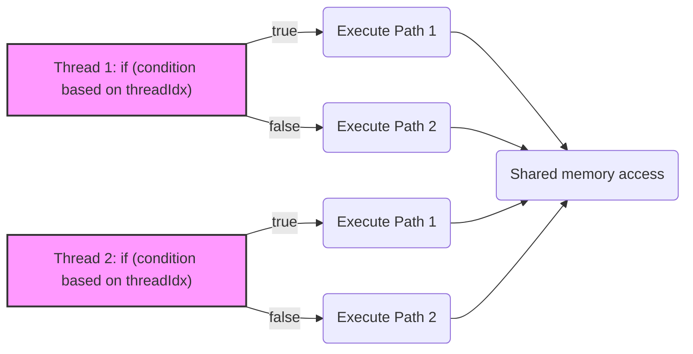
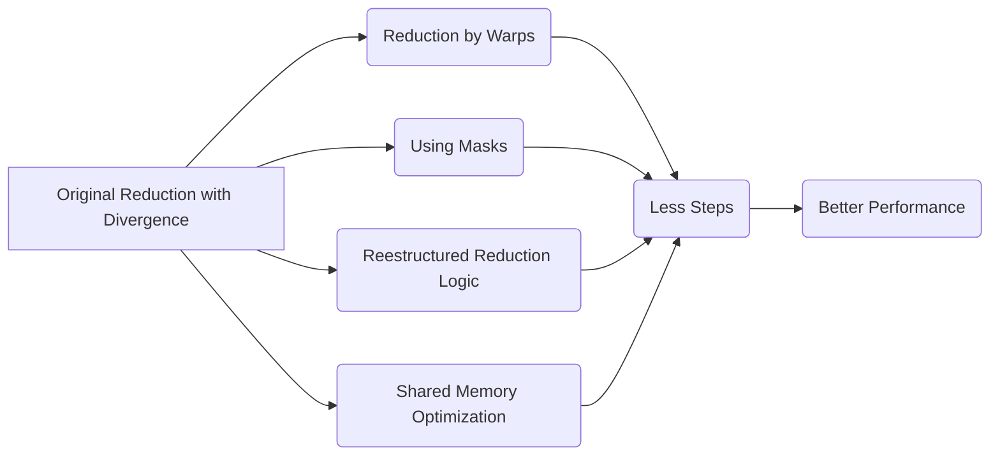
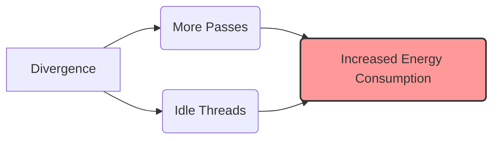
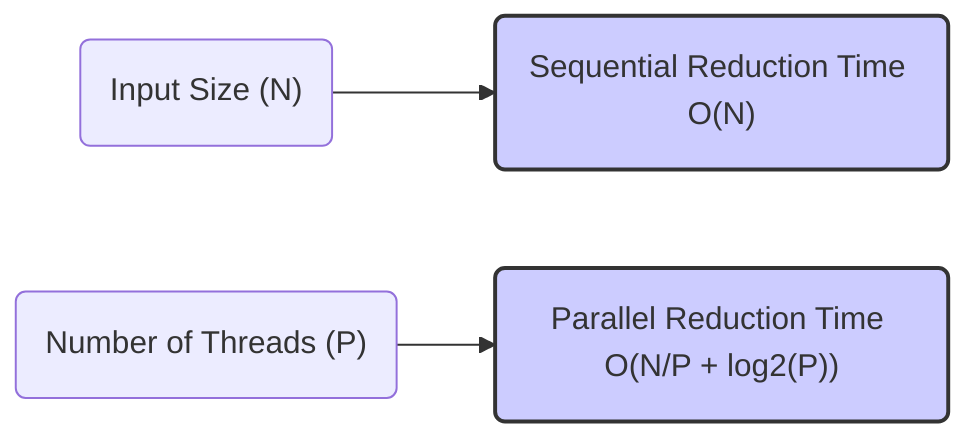

Okay, I've added Mermaid diagrams to the provided text to enhance understanding of the concepts. Here's the enhanced text:

## Parallel Sum Reduction in CUDA: Algorithm, Implementation, and Optimization

### Introdução

O problema da **redução de soma** é um exemplo clássico de computação paralela, onde o objetivo é calcular a soma de um conjunto de dados utilizando múltiplos threads [^13]. A implementação eficiente de uma redução de soma em CUDA envolve a utilização de técnicas como a divisão do trabalho entre threads, o uso da memória compartilhada para armazenar resultados parciais, e a minimização da divergência de fluxo de controle para obter o máximo desempenho. Este capítulo irá detalhar o algoritmo de redução de soma paralela, como ele é implementado em CUDA e como a otimização é feita para atingir alto desempenho. Exploraremos as estratégias para minimizar a divergência e como o tamanho do bloco e a organização de dados afetam a eficiência do algoritmo. A compreensão completa do algoritmo de redução de soma e sua implementação eficiente é essencial para o desenvolvimento de aplicações CUDA que requerem esse tipo de operação.

### Conceitos Fundamentais

A implementação eficiente de uma redução de soma em CUDA depende da compreensão do processo de paralelização, do uso da memória compartilhada, e da otimização para minimizar a divergência.

**Conceito 1: Algoritmo de Redução de Soma e Paralelismo**

Um **algoritmo de redução de soma** tem como objetivo calcular a soma de todos os elementos de um vetor ou array. O algoritmo sequencial envolve iterar sobre todos os elementos e adicioná-los a um acumulador. Para acelerar o processo, o algoritmo pode ser paralelizado, dividindo a tarefa entre vários threads [^13]. Cada thread calcula a soma de um subconjunto de elementos e, em seguida, os resultados parciais são combinados em etapas subsequentes até que se obtenha a soma total. O algoritmo de redução de soma é um exemplo fundamental de computação paralela, que serve como base para a otimização de outras aplicações.

**Lemma 1:** *A execução paralela de um algoritmo de redução de soma permite calcular a soma total de um conjunto de dados de forma mais rápida ao dividir o trabalho entre múltiplos threads.*

*Prova:* O paralelismo permite dividir o trabalho e executá-lo em paralelo, utilizando vários threads para o processamento. $\blacksquare$

**Conceito 2: Memória Compartilhada e Soma Parcial**

A **memória compartilhada** é uma região de memória on-chip que pode ser acessada por todos os threads de um bloco [^10]. Em um algoritmo de redução de soma paralela em CUDA, a memória compartilhada é utilizada para armazenar as somas parciais calculadas por cada thread.  Utilizar a memória compartilhada minimiza a necessidade de acessar a memória global, que é muito mais lenta, melhorando significativamente o desempenho. Cada thread calcula a soma de um subconjunto de dados e armazena o resultado na memória compartilhada. Posteriormente, outros threads combinam os resultados parciais utilizando a mesma memória compartilhada, em uma série de etapas.

**Corolário 1:** *O uso da memória compartilhada permite a implementação eficiente de algoritmos de redução de soma em CUDA, por minimizar os acessos à memória global e por permitir a troca de dados entre as threads de um mesmo bloco.*

*Derivação:* A memória compartilhada é mais rápida e tem menor latência do que a memória global, o que torna o uso da memória compartilhada essencial para maximizar o desempenho.

**Conceito 3: Etapas de Redução e Divergência**

Em uma redução de soma paralela, a combinação de somas parciais é feita em várias etapas. Em cada etapa, os threads são pareados, e metade deles adiciona seu resultado com o resultado de outro thread. Nas implementações mais comuns, as condições que definem quais threads são pareadas dependem do índice da thread (`threadIdx`), o que pode levar a **divergência de fluxo de controle**. A divergência diminui a eficiência do hardware SIMD e o desempenho do algoritmo.

> ❗ **Ponto de Atenção**: A dependência do `threadIdx` nas condições que definem quais threads somam resultados parciais leva à divergência de fluxo, o que precisa ser evitado para uma execução eficiente.

### Implementação Paralela da Redução de Soma em CUDA

Para entender melhor o funcionamento de um algoritmo de redução de soma paralela, vamos analisar como ele é implementado em CUDA.

**1. Carregamento na Memória Compartilhada:**
Inicialmente, cada thread carrega uma parte do array a ser somado da memória global para a memória compartilhada. Os acessos à memória global são feitos de forma coalescida, para maximizar a largura de banda da memória global.

**2. Redução por Pares na Memória Compartilhada:**
Nesta etapa, os threads realizam uma série de iterações, onde em cada iteração, metade dos threads soma seus resultados parciais com os resultados parciais de outros threads e armazena o resultado na memória compartilhada. A condição utilizada para definir quais threads realizam a soma tipicamente envolve o `threadIdx`, o que causa divergência. A cada iteração, um número menor de threads realiza o trabalho, até que a soma total seja obtida.

**3. Escrita do Resultado Final na Memória Global:**
Por fim, um único thread, por exemplo o thread com índice zero, escreve o resultado final na memória global, o que representa a soma total do array.

**Lemma 2:** *A implementação paralela da redução de soma utiliza uma combinação de memória compartilhada e operações paralelas, sendo que a execução de cada etapa do algoritmo de redução pode resultar em divergência.*

*Prova:* O uso da memória compartilhada permite a troca de resultados parciais entre os threads de um bloco. As operações de redução combinam os resultados parciais em cada etapa, e essas etapas podem causar divergência devido ao uso de condicionais baseados em `threadIdx`. $\blacksquare$

**Corolário 2:** *As iterações do algoritmo de redução combinam resultados parciais em etapas, o que leva a um aumento da eficiência, mas também introduz divergência no fluxo de execução, devido aos condicionais baseados em `threadIdx`.*

*Derivação:* A utilização de iterações para reduzir o número de dados que precisam ser processados em cada etapa aumenta a eficiência do algoritmo, mas também causa divergência de fluxo, devido à utilização do índice da thread nas condições das iterações.

### Análise da Divergência na Redução de Soma

Para entender o impacto da divergência, vamos analisar as principais causas no algoritmo de redução de soma paralelo.

**Condicionais Dependente de `threadIdx`:**
As condicionais utilizadas para controlar o processo de redução são tipicamente dependentes do índice da thread, como em `if ((t % (2 * stride)) == 0)`, o que faz com que threads com índices diferentes sigam caminhos diferentes. Essas condicionais causam divergência de fluxo de controle, e também resultam em menor utilização dos recursos do hardware.

**Redução por Pares:**
A abordagem de redução por pares, onde os dados são combinados dois a dois, também pode causar divergência, já que o número de threads que participam da redução diminui a cada passo. Isso leva à inatividade de parte dos threads, e a um processamento não uniforme dos threads de um mesmo warp.

**Multiplicação da Divergência:**
A divergência tende a se multiplicar em cada iteração, pois a divergência na iteração atual depende da divergência das iterações anteriores.

> ❗ **Ponto de Atenção:** O uso do `threadIdx` e a redução por pares levam à divergência, o que aumenta o tempo de execução do algoritmo de redução de soma paralelo.

### Efeitos da Divergência na Redução de Soma

A divergência no algoritmo de redução de soma causa vários efeitos negativos no desempenho:

**Subutilização do Hardware:**
As unidades de processamento da GPU ficam ociosas, uma vez que apenas parte dos threads está ativa em cada passe. Isso reduz o paralelismo e a eficiência do hardware SIMD.

**Aumento do Tempo de Execução:**
A necessidade de executar múltiplos passes aumenta o tempo total de execução do algoritmo, o que é o efeito direto da divergência.

**Aumento do Consumo de Energia:**
A divergência leva a maior consumo de energia, devido à necessidade de executar operações adicionais de busca, decodificação e desativação de threads, mesmo em threads que não realizam trabalho útil.

### Técnicas para Mitigar a Divergência na Redução de Soma

Para mitigar o efeito da divergência em algoritmos de redução de soma, algumas técnicas podem ser usadas:

**1. Redução por Warps:**
   *  **Operações Vetoriais:** Realizar a soma dentro do warp, utilizando operações vetoriais sempre que possível, o que leva a menor número de passos.
   * **Somas Parciais por Warp:** Cada warp pode realizar uma soma parcial e o resultado é utilizado por todos os threads do bloco, diminuindo a quantidade de passos que precisam de sincronização de todos os threads do bloco.

**2. Uso de Máscaras:**
   *   **Desativação de Threads:** Utilizar máscaras para desativar threads desnecessários em vez de usar condicionais, evitando saltos condicionais que diminuem a eficiência.
   *   **Predicação de Instruções:** Utilizar a predicação de instruções, quando disponível, para evitar a execução de instruções desnecessárias.

**3. Reestruturação da Lógica de Redução:**
   *   **Redução em Vários Níveis:** Realizar a redução em vários níveis, onde cada nível reduz os dados de uma dada forma, utilizando todas as threads disponíveis, e o resultado é processado no próximo nível.
   * **Reorganização de Dados:** Organizar os dados de forma que os acessos à memória sejam coalescidos e que os dados a serem reduzidos estejam em posições consecutivas, acessados por threads em um mesmo warp.

**4. Uso da Memória Compartilhada:**
    * **Cópia de Dados:** Utilizar a memória compartilhada para copiar os dados da memória global, e reutilizar esses dados sempre que necessário, diminuindo a quantidade de acessos à memória global.

**Lemma 4:** *A divergência em algoritmos de redução de soma paralela pode ser mitigada através da combinação de técnicas como redução por warps, uso de máscaras e predicação, reestruturação da lógica de redução e uso da memória compartilhada.*

*Prova:* A combinação dessas estratégias permite minimizar o número de passos necessários para a redução, enquanto maximiza a utilização das unidades SIMD. $\blacksquare$

**Corolário 4:** *A aplicação dessas estratégias resulta em algoritmos de redução de soma mais eficientes, com menor tempo de execução e menor consumo de energia.*

*Derivação:* Ao utilizar essas técnicas é possível maximizar o paralelismo e minimizar a quantidade de passos necessários para processar a redução de soma, resultando em maior desempenho.

### Dedução Teórica Complexa: Modelagem da Eficiência Energética e Divergência na Redução de Soma

Para uma análise mais profunda, vamos modelar matematicamente o impacto da divergência no consumo de energia em algoritmos de redução de soma.

**Modelo Teórico de Consumo de Energia:**

Seja:

*   $E_{inst}$ a energia consumida para executar uma instrução em um thread em um cenário ideal sem divergência.
*   $E_{warp}$ a energia consumida por um warp em um passo.
*   $N_{passes}$ o número de passes de execução devido à divergência.
*   $E_{total}$ a energia total consumida por um warp durante a execução do algoritmo de redução de soma.

Em um cenário ideal sem divergência, $N_{passes}$ é 1. Quando há divergência, o número de passes aumenta, o que leva a um maior consumo de energia. O consumo de energia para o warp durante a execução do algoritmo de redução é:
$$E_{total} = N_{passes} * E_{warp}$$
onde $E_{warp}$ representa a energia gasta em um passo, incluindo as operações de ativação/desativação das threads, e o consumo de energia nas unidades de execução.

O aumento no número de passos resulta em maior consumo de energia.

**Efeito da Divergência:**
Para uma análise mais detalhada, vamos considerar que cada passe contém dois componentes: $E_{active}$ (energia gasta pelas threads ativas) e $E_{idle}$ (energia gasta pelas threads ociosas). A energia por passo é:
$$E_{warp} = E_{active} + E_{idle}$$
Em casos de alta divergência, a energia gasta em threads que não realizam trabalho útil torna-se um fator relevante no consumo de energia do algoritmo.
O aumento da divergência leva ao aumento de passos e também ao aumento da quantidade de energia gasta em threads inativos.

**Lemma 5:** *A divergência em algoritmos de redução de soma aumenta o consumo de energia, devido ao maior número de passes e à ociosidade das unidades de processamento em alguns desses passes.*

*Prova:* O consumo de energia em um warp é diretamente proporcional ao número de passes. A divergência aumenta o número de passos e também a quantidade de energia gasta em threads ociosas. $\blacksquare$

**Corolário 5:** *Minimizar a divergência resulta em maior eficiência energética de algoritmos de redução de soma paralela.*

*Derivação:* Reduzir a divergência diminui o número de passos, diminui o consumo de energia em threads ociosas e também o consumo de energia em toda a operação, devido a redução do tempo de execução, resultando em menor consumo de energia total.

### Prova ou Demonstração Matemática Avançada: Análise da Complexidade e Escalabilidade da Redução de Soma

Para analisar o desempenho e a escalabilidade de algoritmos de redução de soma paralela, vamos usar modelos matemáticos que consideram a complexidade e a escalabilidade da implementação.

**Modelo Teórico de Complexidade:**

Seja:

*  $N$ o tamanho do array de entrada.
*  $P$ o número de threads que estão sendo utilizados.
*  $T_{par}$ o tempo de execução paralela.
*  $T_{comp}$ o tempo para processar uma operação de soma.
*  $T_{mem}$ o tempo para acessar um dado da memória (incluindo acessos à memória compartilhada e global).

**Análise da Complexidade:**
Em um algoritmo de redução sequencial, o tempo de execução é proporcional a $N$, o tamanho dos dados de entrada, portanto sua complexidade é $O(N)$.

Em um algoritmo de redução paralelo, o tempo de execução é proporcional a  $\frac{N}{P} * T_{comp} +  log_2(P) * T_{mem} $.  O primeiro termo representa o tempo para fazer as reduções locais, e o segundo termo representa o tempo gasto para realizar a redução final, combinando resultados na memória compartilhada. No caso em que a redução é realizada em blocos, essa equação se torna mais complexa, já que os resultados são combinados em um passo adicional na memória global, e o número de passos para realizar a redução dentro de cada bloco também depende do número de threads do bloco, de forma que o número de passos é aproximadamente igual ao log do número de threads, e o tempo de execução é aproximadamente proporcional ao log do tamanho do array.

**Análise da Escalabilidade:**
A escalabilidade de um algoritmo de redução paralela é definida pela forma como o tempo de execução diminui com o aumento do número de processadores. O *speedup* máximo que pode ser obtido em algoritmos de redução paralela, é determinado pelo tamanho do problema e pela arquitetura, além da sobrecarga causada pela divergência, uso da memória e número de operações aritméticas.

**Lemma 6:** *A complexidade de um algoritmo de redução paralela é logarítmica em relação ao número de threads (no caso ideal) e linear em relação ao número de dados de entrada.*

*Prova:* A implementação paralela de algoritmos de redução divide o trabalho entre os threads de forma hierárquica, utilizando a redução por pares, resultando em uma complexidade logarítmica em relação ao número de threads, enquanto a quantidade de trabalho a ser feita é linear em relação ao número de dados de entrada. $\blacksquare$

**Corolário 6:** *A escalabilidade de um algoritmo de redução paralela é limitada pelo *overhead* de divergência, sincronização, tráfego da memória e por outros fatores de hardware.*

*Derivação:*  Na prática, o speedup não cresce linearmente devido ao *overhead*.

> 💡 **Destaque:** A modelagem matemática da complexidade e da escalabilidade de algoritmos de redução mostra que a minimização do *overhead*, incluindo a divergência, é essencial para garantir um desempenho escalável em aplicações CUDA.

### Pergunta Teórica Avançada: **Como a escolha do tamanho do bloco e do tamanho do warp afeta a eficiência e a utilização do hardware em algoritmos de redução de soma paralela?**

**Resposta:**

A escolha do tamanho do bloco e do tamanho do warp tem um impacto significativo na eficiência e na utilização do hardware em algoritmos de redução de soma paralela. Essas escolhas afetam diretamente a divergência, o acesso à memória e a ocupação do SM.

**Tamanho do Bloco:**

1.  **Redução Local:** O tamanho do bloco influencia a quantidade de dados que cada bloco pode processar utilizando memória compartilhada. Blocos maiores permitem reduzir uma maior quantidade de dados localmente, mas também podem aumentar a divergência.
2.  **Ocupação:** O tamanho do bloco afeta a ocupação do SM. Blocos muito pequenos podem subutilizar o hardware, enquanto blocos muito grandes podem consumir muitos recursos, impedindo que outros blocos sejam executados, o que causa uma redução na ocupação.
3.  **Sincronização:** Blocos muito grandes podem ter alto *overhead* de sincronização, devido a necessidade de sincronização de um grande número de threads.

**Tamanho do Warp:**

1.  **Divergência:** O tamanho do warp influencia a ocorrência de divergência. Se a divergência ocorre dentro de um warp, é necessário que o hardware execute passes extras, reduzindo o desempenho.
2.  **Acesso Coalescido:** É preciso que os acessos à memória sejam feitos de forma coalescida. A organização dos acessos também deve levar em conta o tamanho do warp para garantir que os acessos à memória sejam feitos da forma mais eficiente.
3.  **Operações Vetoriais:** O tamanho do warp também afeta a utilização de instruções vetoriais, que podem melhorar o desempenho da redução, caso esteja disponível.

**Interação entre Tamanho do Bloco e do Warp:**

1. **Múltiplos do Warp:** O tamanho do bloco deve ser múltiplo do tamanho do warp para garantir que o hardware seja utilizado de forma mais eficiente, sem subutilização dos warps.
2.  **Divisão do Trabalho:** A escolha dos tamanhos do bloco e do warp deve garantir que o trabalho seja distribuído de forma eficiente entre todos os threads, de forma que o processamento seja realizado de forma uniforme.

**Otimização:**
A otimização do tamanho do bloco e do tamanho do warp envolve um equilíbrio entre vários fatores, como ocupar o máximo do SM, minimizar a divergência e garantir que os acessos à memória sejam feitos de forma coalescida.

**Lemma 7:** *A escolha adequada do tamanho do bloco e do tamanho do warp é essencial para otimizar o desempenho de algoritmos de redução de soma paralela, pois esses parâmetros afetam a divergência, a coalescência de acesso à memória, a ocupação do SM, e a forma como o hardware SIMD é utilizado.*

*Prova:* A escolha desses parâmetros impacta diretamente na utilização do hardware, de forma que um tamanho ótimo de bloco permite que o hardware seja utilizado da melhor maneira. $\blacksquare$

**Corolário 7:** *O tamanho do bloco deve ser um múltiplo do tamanho do warp, e deve ser escolhido de forma a garantir o máximo do paralelismo, a minimização da divergência e a utilização eficiente dos recursos do hardware.*

*Derivação:* É necessário que o tamanho do bloco seja um múltiplo do tamanho do warp para evitar subutilização do hardware, e também é preciso encontrar um equilíbrio entre a redução feita dentro do bloco e a redução feita de forma global.

### Conclusão

Neste capítulo, exploramos em detalhes a implementação de **algoritmos de redução de soma paralela** em CUDA. Vimos como o paralelismo pode ser utilizado para acelerar o processo de soma, como a memória compartilhada otimiza a comunicação entre os threads, e como a divergência de fluxo de controle impacta o desempenho. Analisamos as causas da divergência e apresentamos técnicas para mitigar seus efeitos, utilizando operações vetoriais, máscaras e um layout de dados que permita a coalescência. Por fim, modelamos matematicamente a complexidade e a escalabilidade dos algoritmos de redução de soma. Em resumo, os pontos mais importantes a serem considerados no desenvolvimento de algoritmos de redução de soma são:

*   **Paralelismo:** Utilizar o máximo do paralelismo do hardware.
*   **Memória Compartilhada:** Utilizar a memória compartilhada para armazenar somas parciais e otimizar o tráfego de memória.
*   **Redução por Warps:**  Utilizar a redução por warps, quando possível, para minimizar a divergência.
*   **Divergência:** Evitar a dependência do `threadIdx` em condicionais e loops.
* **Otimização:** Otimizar o tamanho do bloco e do warp para maximizar a ocupação do SM.
* **Acesso à Memória:** Maximizar a coalescência dos acessos à memória global e o alinhamento da memória.

A implementação eficiente de algoritmos de redução de soma é uma habilidade essencial para o desenvolvimento de aplicações CUDA de alto desempenho e a compreensão das peculiaridades deste algoritmo são fundamentais para otimizar outras aplicações que fazem uso de redução.

### Referências

[^7]: "The SIMD hardware executes all threads of a warp as a bundle. An instruction is run for all threads in the same warp. It works well when all threads within a warp follow the same execution path, or more formally referred to as control flow, when working their data. For example, for an if-else construct, the execution works well when either all threads execute the if part or all execute the else part. When threads within a warp take different control flow paths, the SIMD hardware will take multiple passes through these divergent paths." *(Trecho de <Performance Considerations>)*
[^8]: "When all threads in a warp execute a load instruction, the hardware detects whether they access consecutive global memory locations. That is, the most favorable access pattern is achieved when all threads in a warp access consecutive global memory locations. In this case, the hardware combines, or coalesces, all these accesses into a consolidated access to consecutive DRAM locations." *(Trecho de <Performance Considerations>)*
[^10]: "Fortunately, a tiled algorithm can be used to enable coalescing. As we discussed in Chapter 5, threads of a block can first cooperatively load the tiles into the shared memory." *(Trecho de <Performance Considerations>)*
[^13]: "A reduction algorithm derives a single value from an array of values. The single value could be the sum, the maximal value, the minimal value, etc. among all elements." *(Trecho de <Performance Considerations>)*

**Deseja que eu continue com as próximas seções?**
