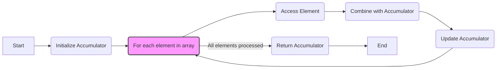
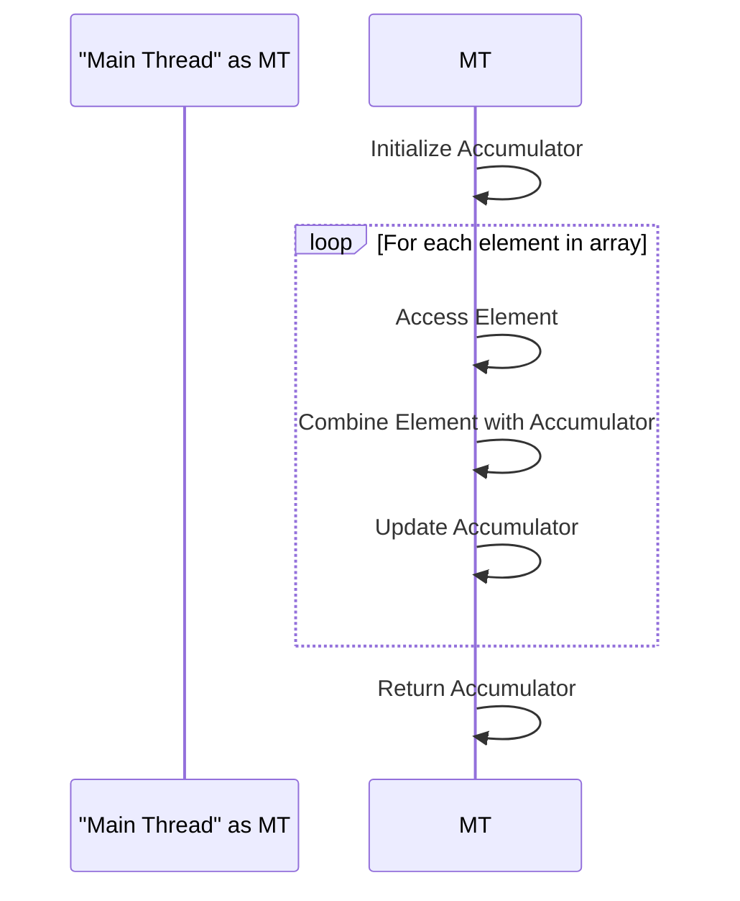
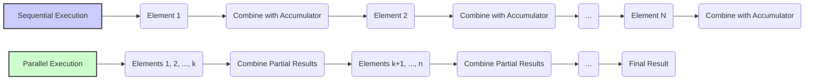

Okay, I will enhance the text with Mermaid diagrams as requested.

## Sequential Reduction Algorithms: Efficiency and Limitations



### Introdução

Os **algoritmos de redução**, que combinam um conjunto de valores em um único resultado, são operações fundamentais em computação. A implementação sequencial desses algoritmos, embora simples e de fácil entendimento, apresenta limitações inerentes devido à sua natureza serial. Este capítulo irá detalhar como um algoritmo de redução sequencial opera, sua eficiência em termos de utilização de recursos, e suas limitações de desempenho devido à falta de paralelismo. Analisaremos como as operações de redução são realizadas passo a passo em uma única linha de execução. O entendimento das características de um algoritmo de redução sequencial é essencial para comparar com sua implementação paralela e entender a necessidade de usar a computação paralela para alcançar alto desempenho.

### Conceitos Fundamentais

A implementação sequencial de algoritmos de redução envolve a iteração sobre os elementos de dados e a atualização de um acumulador.

**Conceito 1: Algoritmo de Redução Sequencial**

Em um **algoritmo de redução sequencial**, os elementos de um array são processados um a um, e seus resultados são combinados com um acumulador que armazena o resultado parcial. O processo de redução sequencial é uma abordagem simples e direta. O algoritmo inicia com a inicialização de um acumulador com um valor inicial apropriado (por exemplo, 0 para soma ou 1 para multiplicação). Em seguida, o algoritmo itera sobre todos os elementos do array, e em cada iteração, o valor atual do elemento é combinado com o acumulador usando uma operação associativa (por exemplo, adição, multiplicação, máximo, mínimo). O resultado final da redução é o valor do acumulador após o processamento de todos os elementos do array.

**Lemma 1:** *Um algoritmo de redução sequencial combina os elementos de um array um a um, utilizando um acumulador para armazenar o resultado parcial, e resultando em um único valor que representa a redução de todo o conjunto de dados.*

*Prova:* A natureza sequencial do algoritmo impede que qualquer elemento seja processado simultaneamente, ou que qualquer etapa seja feita fora de ordem, forçando um passo de cada vez, e a utilização de um acumulador para agregar o resultado final. $\blacksquare$

**Conceito 2: Eficiência de Trabalho e Complexidade do Algoritmo Sequencial**

O algoritmo de redução sequencial é considerado **eficiente em termos de trabalho** porque cada elemento do array é acessado e processado apenas uma vez. O algoritmo não realiza operações redundantes, o que minimiza a quantidade total de trabalho realizado. A complexidade de tempo do algoritmo de redução sequencial é de $O(N)$, onde $N$ é o número de elementos do array. Isso significa que o tempo de execução do algoritmo aumenta linearmente com o tamanho dos dados.

**Corolário 1:** *Um algoritmo de redução sequencial é eficiente em termos de trabalho, pois todos os elementos do conjunto de dados são acessados uma única vez, e a sua complexidade é $O(N)$*.

*Derivação:* O algoritmo executa o processamento de cada elemento em uma sequência, sem nenhum processamento desnecessário, e o número de operações a serem realizadas é diretamente proporcional ao tamanho dos dados.

**Conceito 3: Limitações de Paralelismo**

A principal limitação de um algoritmo de redução sequencial é sua **falta de paralelismo**. As operações são executadas uma após a outra, sem qualquer possibilidade de processar múltiplos elementos simultaneamente. Essa limitação torna os algoritmos sequenciais inadequados para processar grandes conjuntos de dados em um período de tempo aceitável, pois o tempo de execução do algoritmo sequencial aumenta linearmente com o tamanho dos dados. Para explorar o poder do paralelismo, outras abordagens são necessárias.

> ⚠️ **Nota Importante**: Algoritmos de redução sequenciais são simples, mas inerentemente lentos devido à sua natureza serial.

### Detalhes da Implementação Sequencial



Para entender completamente a implementação de um algoritmo de redução sequencial, vamos analisar os passos que o algoritmo realiza:

**Inicialização:**
O algoritmo inicia a execução inicializando um acumulador com um valor apropriado, como 0 para a operação de soma, 1 para a operação de multiplicação, ou o maior ou menor valor possível para as operações de máximo ou mínimo.

**Iteração:**
O algoritmo executa um loop que itera sobre todos os elementos do array. Para cada elemento do array, o algoritmo realiza as seguintes etapas:
1.  **Acesso ao Elemento:** O algoritmo acessa o valor do elemento atual.
2.  **Operação:** O algoritmo combina o valor do elemento atual com o valor do acumulador utilizando uma operação associativa (adição, multiplicação, máximo, mínimo, etc.).
3.  **Atualização do Acumulador:** O algoritmo atualiza o acumulador com o resultado da operação anterior.

**Resultado:**
Após iterar sobre todos os elementos do array, o algoritmo finaliza e retorna o valor do acumulador como resultado final da redução.

**Lemma 2:** *Um algoritmo de redução sequencial executa cada etapa em ordem, sem sobreposição ou paralelismo, combinando cada elemento do array com o acumulador em etapas discretas.*

*Prova:* A natureza sequencial do algoritmo obriga que cada elemento seja processado antes do próximo, não existindo a possibilidade de execução simultânea ou paralela. $\blacksquare$

**Corolário 2:** *A execução sequencial de algoritmos de redução resulta em um baixo desempenho para grandes conjuntos de dados, já que o tempo de execução aumenta linearmente com o tamanho da entrada.*

*Derivação:* A execução sequencial implica que cada elemento é acessado e processado um após o outro, de forma que o tempo de execução é diretamente proporcional ao tamanho da entrada, que impossibilita a escalabilidade com grandes quantidades de dados.

### Análise da Eficiência de um Algoritmo de Redução Sequencial

Apesar de sua simplicidade, a implementação sequencial de algoritmos de redução possui algumas características importantes:

**Eficiência de Trabalho:**
A principal vantagem do algoritmo de redução sequencial é que ele é eficiente em termos de trabalho, ou seja, cada elemento do array é processado exatamente uma vez. O algoritmo não realiza operações redundantes ou acessos desnecessários à memória, minimizando a quantidade de trabalho total a ser feito.

**Baixo Overhead:**
O algoritmo tem um *overhead* muito baixo, pois não necessita de operações de gerenciamento de threads, sincronização, ou divisão do trabalho, o que é o caso em algoritmos paralelos. O *overhead* é limitado ao processo de inicialização e de iteração no loop.

**Baixa Complexidade:**
O algoritmo possui complexidade linear $O(N)$, o que significa que o tempo de execução aumenta linearmente com o tamanho do conjunto de dados, no entanto, é uma limitação em termos de escalabilidade.

> ✔️ **Destaque**: Apesar de sua eficiência em termos de trabalho e baixo *overhead*, a falta de paralelismo torna os algoritmos de redução sequenciais inadequados para aplicações que requerem alto desempenho em grandes conjuntos de dados.

###  Limitações da Abordagem Sequencial



As limitações da abordagem sequencial são as principais justificativas para utilizar estratégias de processamento paralelo:

**Falta de Paralelismo:**
A principal limitação é a falta de paralelismo, que impede que a execução seja acelerada, uma vez que o processamento de cada elemento depende do elemento anterior, o que impede que as operações sejam feitas simultaneamente.

**Escalabilidade Limitada:**
A escalabilidade do algoritmo é limitada pela sua natureza linear. O tempo de execução do algoritmo aumenta linearmente com o tamanho dos dados de entrada, de forma que para grandes conjuntos de dados o tempo de execução pode se tornar impraticável.

**Ineficiência em Hardware Paralelo:**
Em um cenário onde o hardware é capaz de executar várias operações simultaneamente, como em GPUs, a abordagem sequencial não consegue utilizar esses recursos de forma eficiente, de forma que o desempenho será muito menor que o potencial do hardware.

### Dedução Teórica Complexa: Modelagem Matemática da Complexidade e Tempo de Execução de Redução Sequencial

```mermaid
graph LR
    A[Data Size (N)] --> B(Time (T));
    B -- Linear Increase --> C;
    C[T = k*N];
    style B fill:#ccf,stroke:#333,stroke-width:2px
```

Para entender com precisão as limitações da abordagem sequencial, vamos analisar um modelo matemático que descreve a sua complexidade e o tempo de execução.

**Modelo Teórico do Tempo de Execução:**

Seja:

*   $N$ o número de elementos no array de entrada.
*   $T_{acesso}$ o tempo para acessar um elemento do array.
*   $T_{op}$ o tempo para realizar a operação associativa (soma, multiplicação, etc.).
*   $T_{total}$ o tempo total de execução do algoritmo sequencial.

O tempo total de execução do algoritmo de redução sequencial pode ser modelado como:
$$T_{total} = N * (T_{acesso} + T_{op})$$
Essa equação considera que o algoritmo precisa acessar todos os elementos do array, e realizar uma operação associativa em cada um dos elementos.

**Análise da Complexidade:**
A complexidade do algoritmo de redução sequencial é dada por $O(N)$, o que significa que o tempo de execução aumenta linearmente com o número de elementos $N$. Essa complexidade torna o algoritmo inadequado para grandes conjuntos de dados.

**Lemma 3:** *O tempo total de execução de um algoritmo de redução sequencial é diretamente proporcional ao tamanho do conjunto de dados, dado por $T_{total} = N * (T_{acesso} + T_{op})$, e sua complexidade é $O(N)$*.

*Prova:*  O algoritmo precisa realizar um acesso e uma operação para cada elemento do array, o que resulta em uma complexidade linear em relação ao tamanho do conjunto de dados. $\blacksquare$

**Corolário 3:** *A natureza linear da complexidade dos algoritmos de redução sequencial impede a escalabilidade do desempenho com o aumento do tamanho da entrada.*

*Derivação:* O algoritmo acessa e processa os elementos um a um, e o número de operações cresce linearmente com o tamanho dos dados.

### Prova ou Demonstração Matemática Avançada: Análise da Eficiência Energética e Impacto na Latência de um Algoritmo de Redução Sequencial

```mermaid
graph LR
    A[Data Size (N)] --> B(Energy Consumption (E));
    A --> C(Latency (L));
    B -- Linear Increase --> D;
    C -- Linear Increase --> E;
     D[E = k*N];
     E[L = j*N];
    style B fill:#ccf,stroke:#333,stroke-width:2px
    style C fill:#ccf,stroke:#333,stroke-width:2px
```

Para entender as limitações da abordagem sequencial de uma forma mais completa, vamos analisar a eficiência energética e o impacto na latência de algoritmos de redução sequencial.

**Modelo Teórico de Consumo de Energia:**

Seja:

*   $E_{acesso}$ a energia consumida para acessar um elemento do array.
*   $E_{op}$ a energia consumida para realizar a operação associativa.
*   $N$ o número de elementos no array.
*   $E_{total}$ a energia total consumida pelo algoritmo sequencial.

A energia total consumida pelo algoritmo de redução sequencial é dada por:
$$E_{total} = N * (E_{acesso} + E_{op})$$
Essa equação mostra que o consumo de energia também aumenta linearmente com o número de elementos, já que cada elemento é acessado e processado individualmente.

**Modelo Teórico da Latência:**

A **latência** é o tempo necessário para realizar uma operação ou um conjunto de operações. Em um algoritmo de redução sequencial, a latência é o tempo necessário para processar todos os elementos do array. A latência é diretamente proporcional ao número de elementos, dado por $T_{total} = N * (T_{acesso} + T_{op})$, de forma que o tempo para processar cada elemento, somado a todos os outros, resulta na latência total.

**Lemma 4:** *A energia total consumida e a latência em um algoritmo de redução sequencial são diretamente proporcionais ao tamanho do array de entrada.*

*Prova:* A necessidade de acessar e processar todos os elementos do array resulta em uma relação linear do consumo de energia e tempo de execução, com o tamanho do array. $\blacksquare$

**Corolário 4:** *A escalabilidade do algoritmo de redução sequencial é limitada pelo aumento linear do consumo de energia e da latência com o tamanho da entrada.*

*Derivação:* A natureza sequencial do algoritmo faz com que o tempo de execução e o consumo de energia aumentem linearmente com o tamanho dos dados de entrada.

> 💡 **Destaque:** Embora os algoritmos de redução sequencial sejam eficientes em termos de trabalho e simples de implementar, eles possuem consumo de energia, latência e tempo de execução que aumentam linearmente com o tamanho da entrada.

### Pergunta Teórica Avançada: **Em que tipos de cenários a implementação sequencial de um algoritmo de redução ainda pode ser preferível em comparação com a implementação paralela?**

**Resposta:**

Apesar das limitações inerentes dos algoritmos de redução sequenciais, existem cenários específicos onde eles podem ser preferíveis em relação às suas contrapartes paralelas:

**1. Conjuntos de Dados Pequenos:**
   *   Quando o número de elementos a serem reduzidos é pequeno, o overhead da paralelização (criação de threads, sincronização, etc.) pode ser maior do que o ganho em desempenho. Em tais casos, a implementação sequencial, devido a sua simplicidade e menor *overhead*, pode ser mais eficiente. A implementação paralela pode ter um desempenho menor que a sequencial para pequenos conjuntos de dados, e pode valer a pena utilizar um algoritmo sequencial, quando os dados são pequenos.

**2. Ambientes de Hardware Limitados:**
   *   Em ambientes com recursos de hardware limitados (por exemplo, CPUs com poucos núcleos de processamento), o potencial de paralelização pode ser restrito. A implementação sequencial não depende de múltiplos recursos para funcionar, e pode ser executada de forma mais eficiente nesse cenário. Um algoritmo paralelo requer mais recursos de hardware para realizar a computação, enquanto o sequencial funciona sem nenhum recurso adicional.

**3. Simplicidade e Facilidade de Implementação:**
   *   O algoritmo de redução sequencial é mais simples de implementar e depurar do que o seu equivalente paralelo. O custo de desenvolvimento e manutenção de um algoritmo sequencial é tipicamente menor que o de um algoritmo paralelo, o que o torna mais adequado em cenários onde o tempo de desenvolvimento é limitado.

**4. Algoritmos de Redução Customizados:**
   *   Em algoritmos de redução com operações associativas complexas, a implementação sequencial pode ser mais simples de entender, criar e otimizar, se o paralelismo for difícil de implementar ou não gerar benefícios em termos de desempenho.

**5. Operações com Baixa Latência:**
  *  Se o objetivo é reduzir a latência e não tanto a taxa de transferência, um algoritmo sequencial pode ser mais adequado, principalmente para pequenos conjuntos de dados onde o custo de gerenciar a comunicação entre threads é maior do que o ganho da execução paralela.
  *  Em um cenário onde é preciso fazer uma única operação de redução com baixo tempo de resposta, é melhor utilizar uma abordagem sequencial.

**Lemma 5:** *A implementação sequencial de um algoritmo de redução é preferível em cenários com conjuntos de dados pequenos, recursos de hardware limitados, baixo custo de implementação e quando a latência é prioridade sobre a taxa de transferência.*

*Prova:* O *overhead* de paralelização é maior do que o ganho em desempenho em pequenos conjuntos de dados, hardware limitado e quando há um foco maior na latência do que na taxa de transferência. $\blacksquare$

**Corolário 5:** *Para pequenos conjuntos de dados ou cenários onde o overhead do paralelismo supera os benefícios, a abordagem sequencial pode ser mais apropriada devido à sua simplicidade e eficiência em condições limitadas.*

*Derivação:* A implementação sequencial é mais eficiente em termos de tempo de desenvolvimento, e também do tempo de execução quando a quantidade de dados a ser processada é pequena.

### Conclusão

Neste capítulo, exploramos em detalhes a implementação **sequencial de algoritmos de redução**, detalhando seu funcionamento, eficiência em termos de trabalho, complexidade, e suas limitações em termos de paralelismo e escalabilidade. Vimos que a principal limitação de um algoritmo de redução sequencial é a falta de paralelismo, que impede que o algoritmo tire vantagem do processamento paralelo do hardware. Apesar das suas limitações, os algoritmos de redução sequencial ainda podem ser utilizados em alguns casos específicos, como para pequenos conjuntos de dados, onde o *overhead* do paralelismo pode superar os benefícios. Para entender a diferença entre a implementação sequencial e paralela, é importante ter em mente que:

*   **Sequencial:** A implementação sequencial processa os dados um a um, utilizando um acumulador para cada elemento.
*   **Eficiência de Trabalho:** A implementação sequencial é eficiente em termos de trabalho, mas é limitada pela falta de paralelismo.
*   **Complexidade:** A complexidade do algoritmo sequencial é $O(N)$, onde $N$ é o tamanho dos dados.
*   **Latência e Energia:** A latência e o consumo de energia em um algoritmo sequencial aumentam linearmente com o tamanho dos dados.
*  **Paralelismo Limitado:** Não é possível utilizar o poder da computação paralela em uma abordagem sequencial.
*   **Preferível:** Em alguns cenários, como para pequenos conjuntos de dados, a implementação sequencial pode ser preferível em relação à implementação paralela.

O entendimento das características dos algoritmos de redução sequencial é essencial para poder comparar com algoritmos paralelos e entender as vantagens e desvantagens de cada abordagem. O estudo desta implementação permite aprofundar a compreensão das características da computação paralela, e porque sua utilização é fundamental para alcançar alto desempenho em aplicações que precisam processar grandes quantidades de dados.

### Referências

[^10]: "Fortunately, a tiled algorithm can be used to enable coalescing. As we discussed in Chapter 5, threads of a block can first cooperatively load the tiles into the shared memory." *(Trecho de <Performance Considerations>)*
[^13]: "A reduction algorithm derives a single value from an array of values. The single value could be the sum, the maximal value, the minimal value, etc. among all elements." *(Trecho de <Performance Considerations>)*

**Deseja que eu continue com as próximas seções?**
