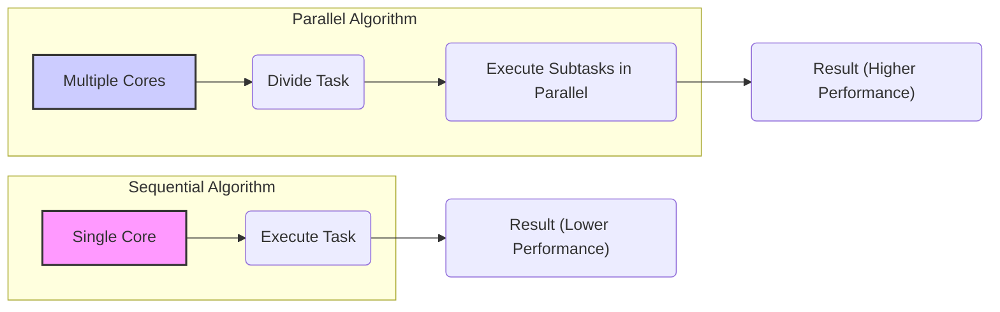
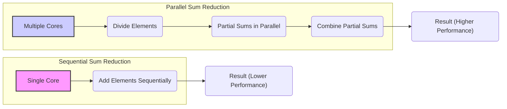
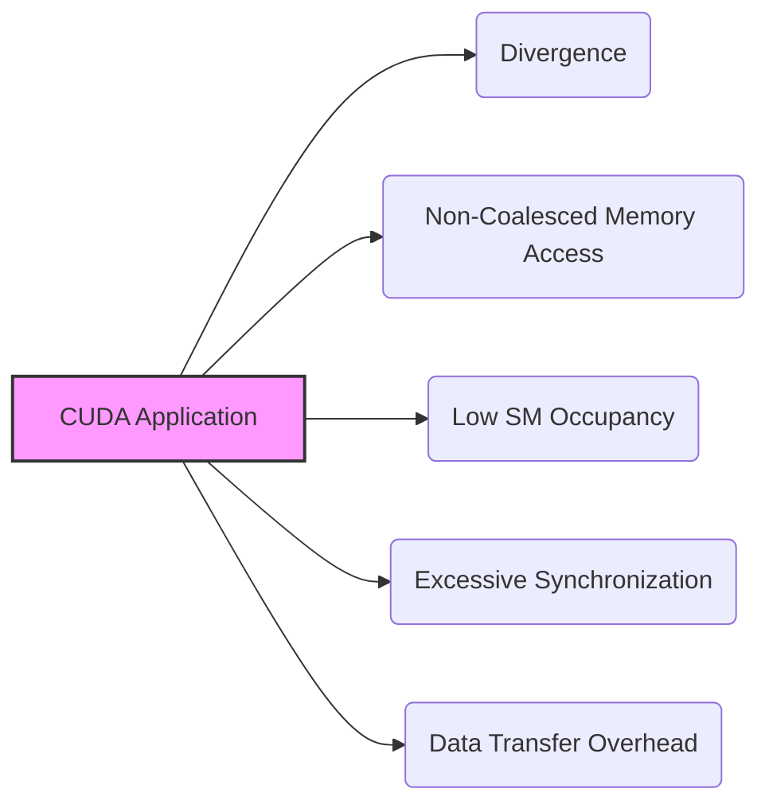
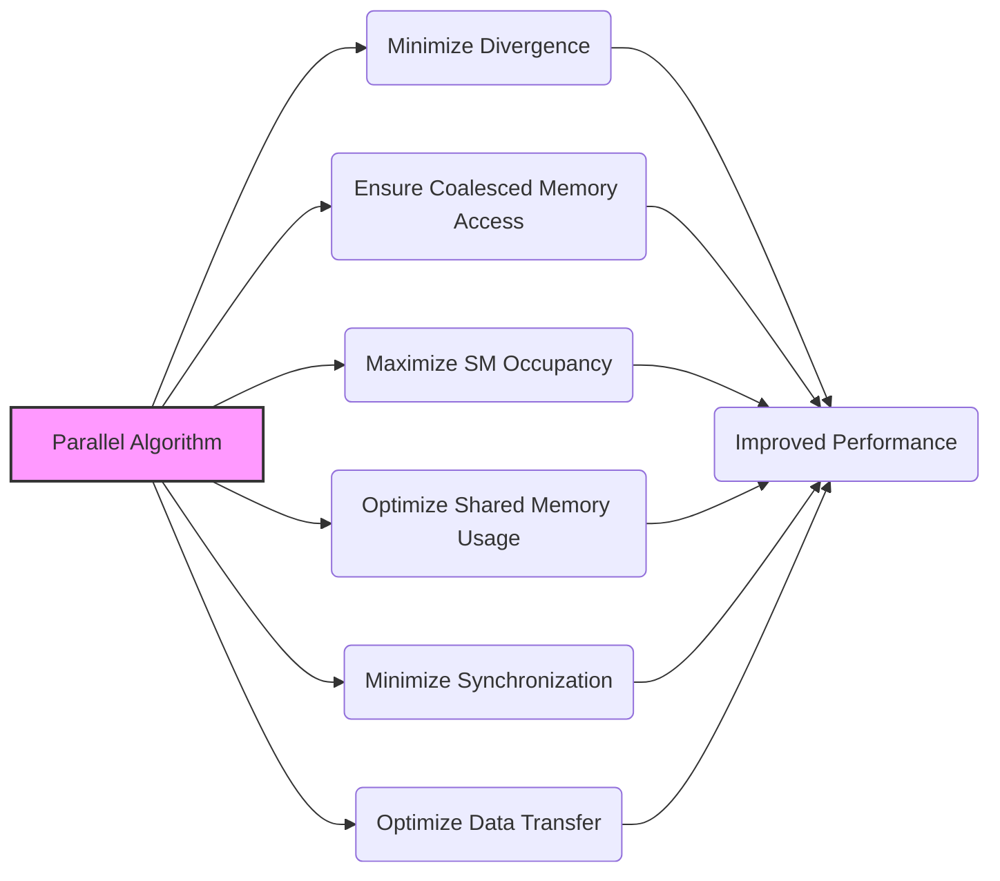
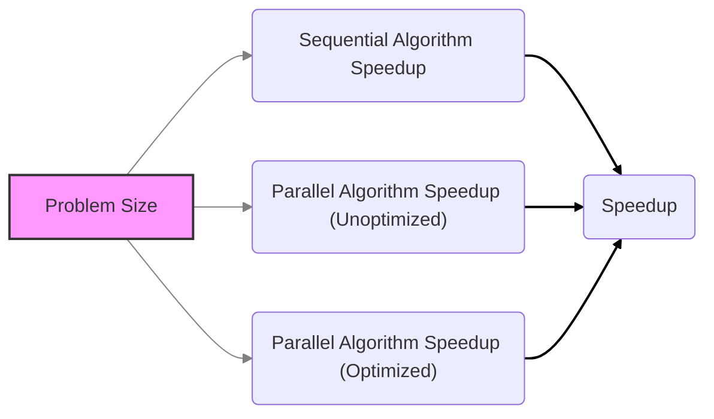

Okay, I will enhance the text with Mermaid diagrams as requested.

## Work Efficiency vs. Hardware Utilization in CUDA: Optimizing for Parallel Performance

### Introdução

Na otimização de aplicações CUDA, é fundamental entender a diferença entre a **eficiência de trabalho** de um algoritmo e a **utilização eficiente do hardware**. Um algoritmo pode ser eficiente em termos de trabalho, ou seja, realizar o mínimo de operações necessárias para computar um resultado, mas ainda assim apresentar baixo desempenho em uma arquitetura paralela como a GPU, se ele não permitir que o hardware utilize seus recursos ao máximo. Este capítulo irá explorar essa distinção, destacando que mesmo algoritmos com baixa complexidade podem ter baixo desempenho se eles não forem implementados de forma a otimizar a utilização das unidades de processamento e da memória. Analisaremos como a escolha entre eficiência de trabalho e utilização eficiente do hardware impacta na performance de aplicações CUDA, e o que pode ser feito para equilibrar esses fatores, para atingir o máximo desempenho.

### Conceitos Fundamentais

Para compreender a importância da otimização em CUDA, é essencial entender as diferenças entre eficiência de trabalho e utilização eficiente do hardware, e como cada um desses fatores afeta o desempenho.

**Conceito 1: Eficiência de Trabalho de um Algoritmo**

A **eficiência de trabalho** de um algoritmo se refere à quantidade de operações elementares (como operações aritméticas, acessos à memória, etc.) que o algoritmo realiza para computar a resposta desejada [^13]. Um algoritmo com alta eficiência de trabalho é aquele que realiza o mínimo de operações possível para produzir a saída correta, evitando operações redundantes ou desnecessárias. A eficiência de trabalho é uma propriedade do algoritmo, e não de sua implementação.

**Lemma 1:** *A eficiência de trabalho de um algoritmo é medida pela quantidade de operações necessárias para completar a tarefa, e um algoritmo eficiente é aquele que realiza o mínimo de operações possível.*

*Prova:* A quantidade de operações a serem realizadas em um algoritmo com alta eficiência é menor, de forma que o algoritmo termina sua execução em um número mínimo de passos. $\blacksquare$

**Conceito 2: Utilização Eficiente do Hardware**

A **utilização eficiente do hardware** se refere à capacidade de uma implementação de um algoritmo em aproveitar ao máximo os recursos da arquitetura do processador (por exemplo, unidades de processamento, memória, registradores, etc.) [^11]. Um algoritmo pode ter alta eficiência de trabalho, mas ainda assim apresentar baixo desempenho em uma arquitetura paralela, se sua implementação não permitir que o hardware utilize seus recursos ao máximo, devido à divergência, falta de coalescência e baixa ocupação do SM. A utilização eficiente do hardware depende da implementação do algoritmo e de como ela consegue explorar o paralelismo do hardware.

**Corolário 1:** *A utilização eficiente do hardware mede a capacidade de um código em aproveitar os recursos da arquitetura do processador, incluindo os múltiplos núcleos de processamento e as unidades de acesso à memória.*

*Derivação:* Uma utilização eficiente do hardware implica que os recursos disponíveis, como os núcleos de processamento, a memória compartilhada e os registradores, são usados de forma otimizada para executar o código.

**Conceito 3: A Relação entre Eficiência de Trabalho e Utilização do Hardware**

É importante entender que a eficiência de trabalho e a utilização eficiente do hardware são conceitos distintos, mas interdependentes. Um algoritmo pode ter alta eficiência de trabalho, mas se ele não estiver implementado corretamente em CUDA, ele pode não usar o hardware de forma eficiente, resultando em baixo desempenho. Para obter alto desempenho em CUDA, é preciso equilibrar a eficiência de trabalho com a utilização eficiente do hardware, maximizando o uso das unidades de processamento, da memória e outros recursos da GPU.

> ⚠️ **Nota Importante:** Um algoritmo eficiente em termos de trabalho pode ser lento se sua implementação não permitir uma utilização eficiente do hardware, o que mostra que a otimização de ambos os aspectos é necessária para obter alto desempenho.

### O Exemplo da Redução de Soma: Sequencial vs Paralelo

Para ilustrar a distinção entre eficiência de trabalho e utilização do hardware, vamos analisar a redução de soma sequencial e paralela em CUDA.

**Redução de Soma Sequencial:**
Em um algoritmo de redução de soma sequencial, cada elemento do array é acessado e adicionado um após o outro. A quantidade de operações realizadas é exatamente igual ao tamanho do array (considerando uma única operação de adição), de forma que o algoritmo é eficiente em termos de trabalho. No entanto, um algoritmo de redução sequencial não consegue aproveitar a arquitetura de processamento paralelo da GPU. A execução do algoritmo sequencial é feita em um único núcleo, e todos os outros recursos da GPU ficam ociosos.

**Redução de Soma Paralela:**
Em um algoritmo de redução de soma paralelo, os elementos são divididos entre os threads, e cada thread calcula uma soma parcial. As somas parciais são combinadas em etapas posteriores utilizando a memória compartilhada. Embora o algoritmo paralelo possa realizar algumas operações adicionais (como cálculos de índices, sincronização, etc.), ele permite o uso de múltiplos núcleos de processamento, resultando em um menor tempo de execução total, ao mesmo tempo em que permite que a arquitetura SIMD seja mais utilizada do que na implementação sequencial, que não aproveita o SIMD.

**Análise:**
O algoritmo de redução sequencial é eficiente em termos de trabalho, uma vez que realiza o mínimo de operações de adição necessárias para computar a resposta. No entanto, ele tem baixa utilização do hardware devido à sua natureza serial. Já o algoritmo de redução paralela pode ter maior quantidade total de operações, mas ao utilizar múltiplos núcleos, sua implementação consegue atingir um tempo de execução menor, mesmo que seu número de operações totais seja maior.

**Lemma 2:** *Um algoritmo pode ter alta eficiência de trabalho, mas se sua implementação não utilizar o paralelismo do hardware de forma eficiente, ele pode apresentar baixo desempenho.*

*Prova:* A eficiência do algoritmo não é garantia de que sua implementação será rápida. Utilizar ao máximo os recursos do hardware é crucial para atingir o alto desempenho, e um algoritmo sequencial não consegue utilizar o paralelismo. $\blacksquare$

**Corolário 2:** *Para obter alto desempenho em arquiteturas paralelas como as GPUs, é necessário equilibrar a eficiência de trabalho com a utilização eficiente do hardware, de forma a fazer o máximo proveito do processamento paralelo.*

*Derivação:* Uma implementação que consegue utilizar o paralelismo do hardware e minimizar o overhead é preferível, mesmo que ela realize um número de operações um pouco maior que uma implementação sequencial, que não tem como utilizar o paralelismo.

### Fatores que Afetam a Utilização Eficiente do Hardware

A utilização eficiente do hardware em aplicações CUDA depende de uma série de fatores, que vão desde o *design* do algoritmo até a implementação e otimizações do código.

**Divergência de Fluxo de Controle:**
Como discutido em outros capítulos, a divergência de fluxo de controle é uma das principais causas de baixa utilização do hardware. Quando os threads de um warp divergem no fluxo de controle, a execução é serializada, e as unidades de processamento ficam subutilizadas [^7].

**Acessos Não Coalescidos à Memória:**
Acessos não coalescidos à memória global reduzem a largura de banda da memória e aumentam o tempo de execução, já que são necessárias múltiplas transações para processar um único warp [^8]. O acesso à memória não contígua resulta em um baixo desempenho.

**Baixa Ocupação do SM:**
A baixa ocupação do Streaming Multiprocessor (SM) significa que o hardware está subutilizado, pois a quantidade de warps em execução é inferior ao máximo suportado pelo hardware. Isso é causado por alocação inadequada dos recursos do SM, como registradores, memória compartilhada e número de threads.

**Sincronização e Comunicação:**
O uso excessivo de sincronização entre threads, e a comunicação entre blocos através de acesso à memória global, podem levar a gargalos e diminuir a eficiência do paralelismo. A sincronização excessiva impede o paralelismo da execução.

**Transferência de Dados:**
As transferências de dados entre a CPU e a GPU podem se tornar um gargalo, principalmente quando essas transferências são feitas de forma desnecessária ou ineficiente. A transferência de dados é uma operação que precisa ser realizada com atenção para não causar *overhead*.

> ✔️ **Destaque:** É essencial entender os fatores que afetam a utilização eficiente do hardware para poder otimizar aplicações CUDA e obter alto desempenho, o que envolve reduzir a divergência, utilizar acessos coalescidos à memória, maximizar a ocupação do SM e minimizar os tempos de sincronização e transferência de dados.

### Otimizando para Utilização Eficiente do Hardware

A otimização de aplicações CUDA envolve a combinação de técnicas para minimizar a divergência, otimizar o acesso à memória, maximizar a ocupação do SM e também a minimização de *overhead*.

**1. Minimização da Divergência:**
   * **Reestruturar o Código:** Reestruturar o código para evitar operações condicionais que dependem do `threadIdx`, ou usar máscaras e operações predicadas para evitar saltos condicionais.
   *  **Uniformizar Loops:** Utilizar loops com um número fixo de iterações, quando possível.

**2. Acesso Coalescido à Memória:**
  *  **Organizar Dados:** Organizar os dados na memória de forma que os threads do warp acessem dados contíguos, resultando em acessos coalescidos.
  * **Acessos Lineares:** Utilizar padrões de acesso à memória que garantam a coalescência, por meio do uso do índice da thread, e da forma como os dados são organizados na memória.

**3. Maximizar a Ocupação do SM:**
   *   **Escolher Tamanho do Bloco:** Escolher um tamanho de bloco adequado que garanta que todos os recursos do SM estejam sendo utilizados, sem causar contenção excessiva por recursos.
   *  **Otimizar Uso de Registradores:** Minimizar o uso de registradores para permitir que mais warps sejam executados simultaneamente.

**4. Otimizar Memória Compartilhada:**
   * **Redução Local:** Utilizar a memória compartilhada para realizar a redução de forma local, reduzindo o número de acessos à memória global, e também de operações de sincronização globais.
   *   **Cache de Dados:** Utilizar a memória compartilhada para armazenar os dados que serão utilizados, de forma que cada thread acesse a memória compartilhada, que é muito mais rápida do que a memória global.

**5. Minimizar a Sincronização:**
   * **Evitar Sincronizações Globais:** Evitar sincronizações que englobem todos os threads, utilizando sincronização de warps ou sincronização dentro de blocos menores, quando necessário.
   *  **Sincronização com Cautela:** Utilizar sincronização apenas quando necessário, pois ela impõe um custo de desempenho.

**6. Otimizar Transferência de Dados:**
   * **Transferência em Lotes:** Agrupar as transferências de dados entre CPU e GPU em lotes maiores, quando possível, para reduzir o overhead da transferência.
  *   **Transferência Assíncrona:** Usar transferências assíncronas de dados, de forma que o processamento na GPU possa ser feito em paralelo com a transferência de dados.

**Lemma 3:** *A utilização eficiente do hardware em algoritmos CUDA requer a aplicação de técnicas para minimizar a divergência, garantir acessos coalescidos à memória, maximizar a ocupação do SM, otimizar a memória compartilhada e minimizar os custos de sincronização e transferência de dados.*

*Prova:* Ao otimizar todos os aspectos de um código CUDA, como o uso da memória, a sincronização, a utilização das unidades de processamento, a coalescência, o *overhead*, e outros fatores, o desenvolvedor consegue utilizar o máximo do potencial da arquitetura paralela. $\blacksquare$

**Corolário 3:** *A otimização do uso dos recursos de hardware resulta em maior desempenho, menor tempo de execução e também em um menor consumo de energia para as aplicações CUDA.*

*Derivação:* A utilização eficiente do hardware resulta em maior quantidade de trabalho por unidade de tempo, e também diminui o consumo de energia, uma vez que a latência é diminuída.

### Dedução Teórica Complexa: Modelagem Matemática do *Speedup* e Eficiência em Algoritmos com Utilização Otimizada do Hardware

Para entender o impacto da utilização eficiente do hardware no desempenho, vamos analisar o *speedup* e a eficiência de um algoritmo com e sem otimizações, utilizando um modelo matemático.

**Modelo Teórico de Speedup e Eficiência:**

Seja:
*   $T_{seq}$ o tempo de execução do algoritmo sequencial.
*  $T_{par}$ o tempo de execução do algoritmo paralelo.
*   $S$ o *speedup* do algoritmo paralelo.
*   $P$ o número de processadores paralelos (threads, warps, etc.).
* $f_{util}$ o fator que representa o quão bem o hardware é utilizado, o qual está entre 0 e 1.
*   $T_{overhead}$ o *overhead* causado por sincronização, comunicação e outros fatores.

O tempo de execução sequencial é dado por $T_{seq}$, enquanto o tempo de execução paralelo sem utilizar os recursos de forma eficiente é dado por:
$$T_{par, sem\_otimizacao} = \frac{T_{seq}}{P} + T_{overhead} + f_{divergencia} * N_{passes}$$
Onde $f_{divergencia} * N_{passes}$ representa o efeito da divergência e múltiplos passos no tempo total de execução.

O tempo de execução paralelo com a utilização eficiente do hardware é dado por:
$$T_{par, com\_otimizacao} = \frac{T_{seq}}{P} * f_{util} + T_{overhead,otimizado}$$
onde $f_{util}$ representa o uso mais eficiente do hardware e $T_{overhead,otimizado}$ representa um *overhead* menor, devido a utilização das técnicas de otimização. O tempo de execução do algoritmo sequencial é $T_{seq}$. O *speedup* de ambas as implementações é dado por:
$$S = \frac{T_{seq}}{T_{par}}$$
O *speedup* com a implementação otimizada é dado por:
$$S_{otimizado} = \frac{T_{seq}}{\frac{T_{seq}}{P} * f_{util} + T_{overhead, otimizado}}$$
O *speedup* da implementação sem otimizações é dado por:
$$S_{sem\_otimizacao} = \frac{T_{seq}}{\frac{T_{seq}}{P} + T_{overhead} + f_{divergencia} * N_{passes}}$$
Em um cenário ideal, o valor de $f_{util}$ é igual a 1, e os *overheads* são nulos, e o *speedup* alcança o seu máximo valor que é $P$.

**Análise do *Speedup* e Eficiência:**
O *speedup* real é menor que o ideal devido aos *overheads* de sincronização, transferência de dados, e divergência, que diminuem a utilização do hardware. Uma implementação com uma maior utilização do hardware e um menor *overhead* resulta em um *speedup* maior e mais próximo do valor ideal, além de melhorar a eficiência do processamento.

**Lemma 6:** *A utilização eficiente do hardware resulta em maior speedup e eficiência do algoritmo, ao diminuir o overhead e maximizar o uso das unidades de processamento.*

*Prova:*  O *speedup* e a eficiência da implementação são diretamente relacionados com a utilização do hardware, e a otimização para utilizar o máximo dos recursos do hardware resulta em maior *speedup*. $\blacksquare$

**Corolário 6:** *Para alcançar alto desempenho em aplicações CUDA, é essencial combinar algoritmos com alta eficiência de trabalho com implementações que utilizem o hardware de forma otimizada, minimizando a divergência, o overhead e outros fatores que limitam o desempenho.*

*Derivação:* A utilização eficiente do hardware, juntamente com algoritmos eficientes em termos de trabalho, permite atingir o máximo desempenho nas arquiteturas paralelas.

> ✔️ **Destaque**: A otimização de algoritmos paralelos em CUDA requer um entendimento das limitações da arquitetura de hardware, e também a aplicação de técnicas para maximizar o uso dos seus recursos, incluindo as unidades de processamento, a memória e as operações vetoriais.

### Pergunta Teórica Avançada: **Como a escolha do algoritmo influencia a balança entre eficiência de trabalho e utilização eficiente do hardware em aplicações CUDA, e como escolher o algoritmo mais adequado para um dado cenário?**

**Resposta:**

A escolha do algoritmo tem um impacto fundamental na balança entre a eficiência de trabalho e a utilização eficiente do hardware em aplicações CUDA. Diferentes algoritmos podem ter diferentes características em termos de complexidade, paralelismo e uso de recursos.

**Impacto da Escolha do Algoritmo:**

1.  **Complexidade:** Algoritmos com alta complexidade computacional podem ter alto desempenho em hardware paralelo, desde que o tempo de computação seja maior do que o *overhead*. Algoritmos com baixa complexidade, mesmo se otimizados, podem não ser tão eficientes se o *overhead* para a implementação paralela for alto.
2. **Paralelismo:** Algoritmos inerentemente paralelos são mais adequados para a execução em GPUs. Algoritmos sequenciais, como a redução sequencial, não exploram o paralelismo do hardware e acabam apresentando baixo desempenho, mesmo que tenham alta eficiência de trabalho.
3.  **Divergência:** Algoritmos que levam à divergência de fluxo de controle podem reduzir a eficiência do SIMD, o que diminui o desempenho. A escolha do algoritmo pode afetar a quantidade de divergência e, portanto, o uso eficiente do hardware.
4.  **Acessos à Memória:** Algoritmos com padrões de acesso à memória bem definidos permitem a utilização da coalescência de acessos, que aumentam a largura de banda da memória. Algoritmos com acesso aleatório à memória podem resultar em acessos não coalescidos, diminuindo o desempenho.
5.  **Overhead:** Algoritmos que necessitam de muita sincronização e transferência de dados apresentam baixo desempenho. A escolha de um algoritmo com pouco overhead é mais eficiente, e pode aumentar o desempenho geral.

**Escolha do Algoritmo Mais Adequado:**
Para escolher o algoritmo mais adequado para um dado cenário, é necessário considerar:

1.  **Natureza do Problema:** Analisar as características do problema, como tamanho dos dados, operações a serem realizadas, e dependências entre as operações, para escolher um algoritmo adequado.
2.  **Hardware:** Entender as limitações e o potencial do hardware (número de SMs, memória, registradores, etc.).
3. **Balanceamento:** Escolher um algoritmo que equilibre a eficiência de trabalho com a utilização eficiente do hardware, de forma que o paralelismo seja utilizado ao máximo.
4. **Otimização:** Otimizar o algoritmo para a arquitetura CUDA, buscando minimizar a divergência, maximizar o acesso coalescido, e utilizar a memória compartilhada, quando possível.

**Lemma 7:** *A escolha do algoritmo deve ser feita levando em consideração tanto a eficiência de trabalho do algoritmo quanto a forma como a implementação irá utilizar os recursos do hardware, para atingir o máximo desempenho em um dado cenário.*

*Prova:* A otimização é feita em nível de algoritmo e em nível de implementação, de forma que o algoritmo seja eficiente em termos de quantidade de trabalho, e também eficiente em termos de utilização dos recursos do hardware. $\blacksquare$

**Corolário 7:** *Em arquiteturas paralelas como as GPUs, é preciso equilibrar a eficiência de trabalho com a utilização eficiente do hardware, e a escolha do algoritmo deve ser feita com base no problema e na arquitetura, com o objetivo de otimizar o desempenho, a eficiência e a escalabilidade.*

*Derivação:* Uma escolha inadequada do algoritmo, que não considere as características do hardware, pode levar a baixo desempenho e utilização ineficiente dos recursos.

### Conclusão

Neste capítulo, exploramos a distinção fundamental entre a **eficiência de trabalho** de um algoritmo e a **utilização eficiente do hardware** em aplicações CUDA. Vimos como um algoritmo pode ter alta eficiência de trabalho, mas ainda assim apresentar baixo desempenho se sua implementação não utilizar o paralelismo do hardware de forma adequada. Analisamos exemplos como a redução de soma sequencial e paralela, onde a implementação paralela consegue alcançar um maior desempenho mesmo utilizando um número maior de operações, devido ao melhor aproveitamento do hardware. Discutimos os fatores que afetam a utilização do hardware, como a divergência, a coalescência, a ocupação do SM e o *overhead* de sincronização. Para finalizar, exploramos estratégias para otimizar a utilização do hardware, minimizando esses fatores que afetam o desempenho. A partir da análise, torna-se claro que:

*   **Eficiência de Trabalho:** A eficiência de trabalho se refere à quantidade de trabalho necessário para computar uma resposta e é uma propriedade do algoritmo.
*  **Utilização do Hardware:** A utilização do hardware se refere à forma como o algoritmo implementado usa os recursos da arquitetura, como os processadores, a memória e as unidades de execução.
* **Redução Sequencial:** Algoritmos sequenciais são eficientes em termos de trabalho, mas não utilizam o paralelismo do hardware, apresentando baixo desempenho.
*  **Redução Paralela:** A implementação paralela, se bem otimizada, apresenta melhor desempenho, pois utiliza o potencial do paralelismo do hardware, e maximiza a quantidade de operações que podem ser realizadas simultaneamente, o que leva a um menor tempo de execução.
*   **Divergência e Coalescência:** É crucial minimizar a divergência, utilizar acessos coalescidos à memória e maximizar a ocupação do SM para obter bom desempenho.

A otimização de aplicações CUDA exige um entendimento completo dessas diferenças, o que permite escolher o algoritmo mais adequado e otimizá-lo para o hardware em que ele será executado, garantindo alto desempenho e a escalabilidade das aplicações.

### Referências

[^7]: "The SIMD hardware executes all threads of a warp as a bundle. An instruction is run for all threads in the same warp. It works well when all threads within a warp follow the same execution path, or more formally referred to as control flow, when working their data. For example, for an if-else construct, the execution works well when either all threads execute the if part or all execute the else part. When threads within a warp take different control flow paths, the SIMD hardware will take multiple passes through these divergent paths." *(Trecho de <Performance Considerations>)*
[^8]: "When all threads in a warp execute a load instruction, the hardware detects whether they access consecutive global memory locations. That is, the most favorable access pattern is achieved when all threads in a warp access consecutive global memory locations. In this case, the hardware combines, or coalesces, all these accesses into a consolidated access to consecutive DRAM locations." *(Trecho de <Performance Considerations>)*
[^11]: "The execution resources in a streaming multiprocessor (SM) include registers, shared memory, thread block slots, and thread slots." *(Trecho de <Performance Considerations>)*
[^13]: "A reduction algorithm derives a single value from an array of values. The single value could be the sum, the maximal value, the minimal value, etc. among all elements." *(Trecho de <Performance Considerations>)*

**Deseja que eu continue com as próximas seções?**
