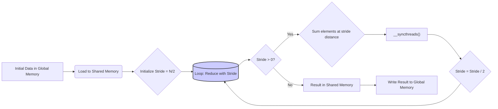
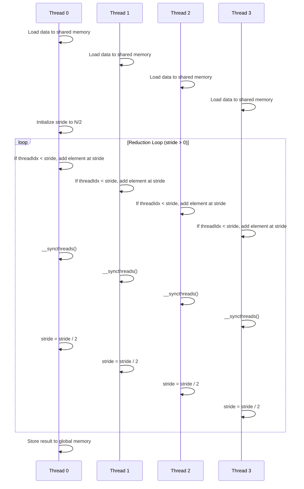
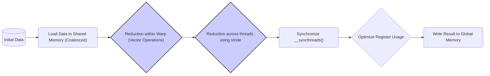
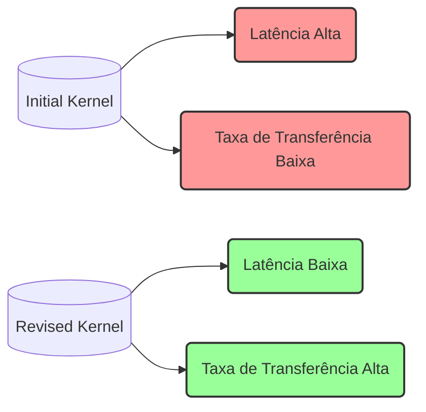

Okay, I've analyzed the provided text and added Mermaid diagrams to enhance understanding of the concepts. Here's the revised text with the diagrams:

## Revised Sum Reduction Kernel in CUDA: Minimizing Divergence and Maximizing Performance

### Introdução

Em capítulos anteriores, vimos como uma implementação inicial do kernel de redução de soma paralela pode levar à divergência de fluxo de controle, o que impacta negativamente o desempenho. Neste capítulo, vamos analisar uma versão revisada do kernel de redução de soma, onde a divergência de fluxo é minimizada utilizando uma abordagem que concentra a divergência nas últimas etapas do algoritmo. Este capítulo irá explorar detalhadamente como essa versão revisada reduz a divergência, como isso afeta o desempenho, e como a organização do código pode levar a um melhor aproveitamento do hardware SIMD. A compreensão das técnicas utilizadas no kernel revisado permite aos programadores CUDA desenvolver algoritmos mais eficientes.

### Conceitos Fundamentais

A implementação eficiente do kernel de redução de soma requer o uso de técnicas para minimizar a divergência, com foco na otimização das primeiras iterações do loop de redução.

**Conceito 1: Redução por Distância e Minimizar Divergência Inicial**

A implementação do kernel de redução de soma revisado, ao invés de utilizar a adição de elementos adjacentes, utiliza a adição de elementos que estão a uma determinada distância um do outro, de forma que, na primeira iteração, os elementos somados sejam aqueles que se encontram na primeira metade e segunda metade do conjunto de dados, ou seja, a uma distância igual à metade do tamanho do conjunto de dados. Nas próximas iterações, essa distância é diminuída pela metade, de forma que a quantidade de threads ativas seja reduzida pela metade, a cada iteração, sem que necessariamente a divergência de fluxo de controle seja aumentada. Ao utilizar essa abordagem, a divergência é concentrada nas últimas iterações, onde a quantidade de threads ativas é muito menor, e o impacto da divergência é minimizado.

**Lemma 1:** *A implementação da redução de soma paralela, que utiliza uma distância entre os elementos a serem somados que é igual à metade do número de elementos e diminuindo a distância pela metade a cada iteração, minimiza a divergência de fluxo de controle nas primeiras etapas do algoritmo.*

*Prova:* O uso da distância igual à metade do número de elementos permite que os threads sejam pareados, e que o maior número de threads possível execute o mesmo trecho de código no início do algoritmo, minimizando a divergência. $\blacksquare$

**Conceito 2: Uso do `threadIdx` de Forma Otimizada**

Na implementação inicial do kernel de redução, o `threadIdx` era utilizado diretamente em condicionais para determinar quais threads executam as operações de soma, o que leva à divergência. Na implementação revisada, o `threadIdx` é utilizado para determinar a distância entre os elementos que serão somados, e em conjunto com a distância, garante que os threads utilizem o mesmo trecho de código, o que minimiza a divergência. O uso do `threadIdx` é feito de forma a minimizar a divergência, e também de forma que a divergência seja concentrada nas últimas etapas da execução.

**Corolário 1:** *Ao minimizar a dependência direta do `threadIdx` nas condições que definem quais threads executam a soma, o kernel reduz a divergência de fluxo de controle nas primeiras iterações do loop de redução.*

*Derivação:* Ao minimizar a dependência direta do `threadIdx` nas condições, os threads do mesmo warp são executados de forma mais uniforme, o que leva a maior eficiência do hardware.

**Conceito 3: Concentração da Divergência nas Últimas Etapas**

Na implementação revisada, a divergência é concentrada nas últimas etapas do algoritmo. Isso acontece porque a quantidade de threads que executam a soma diminui a cada iteração, e o impacto da divergência na performance é menor quando essa divergência ocorre em uma quantidade menor de threads. Como a divergência é concentrada no final da execução, as primeiras iterações conseguem utilizar o paralelismo do hardware da forma mais eficiente.

> ✔️ **Destaque:** A implementação revisada do kernel de redução de soma minimiza a divergência nas primeiras iterações e a concentra nas últimas etapas, o que resulta em maior utilização do hardware e melhor desempenho.

### Análise Detalhada do Kernel de Redução de Soma Revisado

Para entender o funcionamento da implementação revisada, vamos analisar o passo a passo do algoritmo:

**1. Carregamento na Memória Compartilhada:**
Inicialmente, cada thread carrega um elemento do array a ser somado da memória global para a memória compartilhada, na posição definida pelo seu índice (`threadIdx`).

**2. Inicialização da Distância:**
O algoritmo inicializa a variável `stride`, que representa a distância entre os elementos que serão somados, com um valor igual a metade do número de threads no bloco (`blockDim.x`).

**3. Loop de Redução com Distância:**
O kernel então executa um loop que itera sobre várias etapas de redução. Em cada iteração, os threads que se encontram em posições menores do que o valor atual da variável `stride` realizam uma operação de soma utilizando como segundo valor o elemento que se encontra a uma distância igual a `stride`. O valor de `stride` é reduzido pela metade a cada iteração.

**4. Sincronização:**
Uma barreira de sincronização (`__syncthreads()`) é usada para garantir que todos os threads tenham completado sua parte do trabalho antes de seguir para a próxima iteração, em todas as iterações do loop.

**5. Escrita do Resultado Final:**
No final do loop, o thread com índice zero armazena o resultado final na memória global.

**Análise da Divergência:**
A divergência no kernel revisado surge nas últimas iterações, quando o número de threads ativas diminui. Como a quantidade de threads ativas é menor nas últimas iterações, o impacto da divergência no desempenho é também menor. A divergência é concentrada nas últimas iterações onde o tempo gasto com a execução é pequeno, e é reduzida ao máximo nas primeiras iterações.

**Lemma 2:** *O kernel de redução de soma revisado utiliza um loop onde a distância entre os elementos a serem somados diminui a cada iteração, e a divergência é minimizada nas primeiras iterações, e concentrada nas últimas etapas do algoritmo.*

*Prova:* As primeiras iterações utilizam a maior parte dos threads disponíveis, e não há divergência entre eles. Nas últimas iterações, quando a quantidade de threads é menor, a divergência ocorre, mas o efeito no desempenho é também menor. $\blacksquare$

**Corolário 2:** *Ao concentrar a divergência nas últimas iterações, o kernel revisado consegue utilizar o hardware SIMD de forma mais eficiente durante as etapas iniciais da execução, o que resulta em um maior desempenho.*

*Derivação:* A utilização da maior parte do paralelismo nas primeiras etapas e concentrando a divergência nas últimas etapas permite que o impacto da divergência no desempenho seja menor, já que a divergência nas últimas etapas afeta um número menor de threads, e o tempo gasto para processar essas últimas etapas é muito pequeno.

### Impacto da Minimização da Divergência no Desempenho

A minimização da divergência obtida com o kernel de redução de soma revisado tem um impacto significativo no desempenho:

**Utilização do SIMD:**
Ao concentrar a divergência nas últimas etapas do algoritmo, o kernel revisado permite que o hardware SIMD seja utilizado de forma mais eficiente nas primeiras etapas, onde um maior número de threads é executado simultaneamente, o que faz com que a quantidade de trabalho por unidade de tempo aumente.

**Diminuição do Tempo de Execução:**
A diminuição da divergência e a utilização mais eficiente do hardware resultam em um menor tempo de execução total do kernel.

**Eficiência Energética:**
A minimização da divergência também leva a um menor consumo de energia, pois o hardware não precisa executar múltiplos passes desnecessários para acomodar a divergência, fazendo com que a energia seja utilizada apenas onde é preciso.

> ✔️ **Destaque:** A implementação revisada do kernel de redução de soma minimiza a divergência e maximiza a utilização do hardware SIMD, o que resulta em melhor desempenho e menor consumo de energia.

### Otimizações Adicionais para um Desempenho Ainda Maior

Além da minimização da divergência, outras técnicas podem ser utilizadas para otimizar ainda mais o desempenho do kernel de redução de soma:

**1. Redução Dentro do Warp:**
   *   **Operações Vetoriais:** Utilizar operações vetoriais, quando disponíveis, para realizar a soma de elementos dentro do mesmo warp. Isso minimiza a quantidade de passos necessários para a redução e aumenta o desempenho.

**2. Uso de Memória Compartilhada:**
   *   **Carregamento Coalescido:** Garantir que o carregamento de dados na memória compartilhada seja feito utilizando acessos coalescidos à memória global, maximizando o uso da largura de banda.
   *  **Acessos Contíguos:** Garantir que o acesso à memória compartilhada seja contíguo, para evitar *bank conflicts*.

**3. Otimização do Uso de Registradores:**
   *  **Minimizar o Uso de Registradores:** Minimizar o número de registradores utilizados, o que permite a execução de mais warps simultaneamente no SM.
   * **Reuso de Registradores:** Reutilizar registradores sempre que possível, para diminuir o consumo de recursos.

**4. Otimização da Sincronização:**
   *   **Sincronização dentro do Warp:** Utilizar sincronização dentro do warp, quando possível, para minimizar a necessidade de sincronização entre todos os threads do bloco.
  * **Evitar Sincronização Desnecessária:** Utilizar sincronização somente quando necessário, para evitar o *overhead* da sincronização.

**Lemma 4:** *A otimização de um kernel de redução de soma revisado envolve o uso de técnicas que minimizam a divergência, maximizam a coalescência, e otimizam o uso de registradores e sincronização, para atingir o máximo desempenho e eficiência energética.*

*Prova:* A combinação dessas técnicas otimiza o uso de todos os recursos do hardware, e resulta em maior desempenho. $\blacksquare$

**Corolário 4:** *A aplicação de técnicas adicionais de otimização permite que a implementação revisada do kernel de redução de soma atinja o máximo desempenho na GPU, além de utilizar os recursos de forma eficiente.*

*Derivação:* A utilização de técnicas de otimização minimiza a latência e também o tempo de execução, o que aumenta a quantidade de trabalho executada por unidade de tempo, e diminui o consumo de energia.

### Dedução Teórica Complexa: Modelagem Matemática do Impacto da Divergência na Latência e na Taxa de Transferência

Para uma análise mais precisa, vamos modelar matematicamente o impacto da divergência e das otimizações na latência e na taxa de transferência em um kernel de redução de soma.

**Modelo Teórico da Latência:**

Seja:

*   $L_{inicial}$ a latência do kernel de redução de soma inicial.
*   $L_{revisado}$ a latência do kernel de redução de soma revisado.
*  $N_{passes,inicial}$ o número de passes necessários para executar o kernel inicial devido à divergência.
*   $N_{passes,revisado}$ o número de passes necessários para executar o kernel revisado devido à divergência.
*   $T_{step}$ o tempo para executar um passo de redução em um warp.

A latência do kernel inicial é dada por:
$$L_{inicial} = N_{passes,inicial} * T_{step}$$
A latência do kernel revisado é dada por:
$$L_{revisado} = N_{passes,revisado} * T_{step}$$
A diminuição do número de passos $N_{passes}$ no kernel revisado resulta em uma diminuição da latência.

**Modelo Teórico da Taxa de Transferência:**

Seja:

*   $N$ o número de elementos a serem somados.
*   $R_{inicial}$ a taxa de transferência do kernel inicial.
*   $R_{revisado}$ a taxa de transferência do kernel revisado.
A taxa de transferência é dada por:
$$R = \frac{N}{T_{total}}$$
onde $T_{total}$ é o tempo total de execução.
Como a latência é proporcional ao tempo total de execução, a latência afeta diretamente a taxa de transferência. Uma menor latência resulta em uma maior taxa de transferência.

**Análise:**
A diminuição do número de passes através da minimização da divergência no kernel revisado diminui a latência, o que por sua vez aumenta a taxa de transferência. A utilização eficiente do hardware através de outras técnicas de otimização também tem um impacto significativo na latência e na taxa de transferência.

**Lemma 5:** *A minimização da divergência em um kernel de redução de soma através do uso de distâncias para a combinação dos dados, reduz a latência, aumenta a taxa de transferência, e resulta em melhor uso dos recursos do hardware SIMD.*

*Prova:* Ao minimizar a divergência, e otimizar os acessos à memória, a latência e o tempo de execução são diminuídos, e a quantidade de trabalho por unidade de tempo aumenta, o que resulta em uma maior taxa de transferência. $\blacksquare$

**Corolário 5:** *Ao minimizar a latência e maximizar a taxa de transferência, o kernel de redução de soma revisado consegue alcançar um desempenho superior em relação ao kernel inicial.*

*Derivação:* Ao minimizar o tempo de execução e maximizar a taxa de transferência, o kernel revisado utiliza o hardware de forma mais eficiente.

### Pergunta Teórica Avançada: **Como o tamanho do bloco de threads afeta a eficiência da implementação revisada e qual a relação com o conceito de ocupação do SM?**

**Resposta:**

A escolha do tamanho do bloco de threads tem um impacto significativo na eficiência da implementação revisada do kernel de redução de soma, e esse impacto está diretamente relacionado ao conceito de ocupação do SM.

**Impacto do Tamanho do Bloco:**

1.  **Divergência:** A divergência residual nas últimas iterações da redução pode se tornar mais ou menos acentuada dependendo do tamanho do bloco, o que exige que a escolha do tamanho do bloco leve em consideração a quantidade de passos necessários para realizar a redução.
2.  **Memória Compartilhada:** O tamanho do bloco afeta a quantidade de memória compartilhada utilizada, e o acesso eficiente à memória compartilhada necessita que os acessos sejam contíguos e que não gerem *bank conflicts*. O tamanho do bloco e como os dados são armazenados na memória compartilhada têm um impacto direto no desempenho.
3.  **Ocupação:** O tamanho do bloco afeta a ocupação do SM. Blocos pequenos podem deixar o SM subutilizado, enquanto blocos grandes podem ocupar muitos recursos, impedindo que outros blocos sejam executados, reduzindo a ocupação.

**Relação com a Ocupação do SM:**

A **ocupação do SM** é a razão entre o número de threads ativas e o número máximo de threads que um SM pode executar. A ocupação afeta diretamente o desempenho, pois uma maior ocupação significa que o hardware está sendo utilizado de forma mais eficiente.

1. **Blocos Pequenos:** Blocos pequenos podem causar uma ocupação baixa, o que significa que o hardware não está sendo totalmente utilizado, diminuindo o desempenho.
2. **Blocos Grandes:** Blocos grandes podem levar a uma ocupação alta, se os recursos do SM (como registradores) forem suficientes para acomodar todos os blocos simultaneamente. No entanto, blocos muito grandes podem também aumentar a divergência, diminuindo o desempenho, devido a necessidade de executar os threads de forma mais serializada e utilizando os recursos do hardware de forma menos eficiente.

**Otimização:**
Para otimizar o tamanho do bloco, é necessário escolher um valor que equilibre a ocupação do SM, a divergência e o uso da memória compartilhada. O programador deve escolher o tamanho do bloco levando em consideração as características do hardware, para que este seja utilizado ao máximo.

**Lemma 6:** *O tamanho do bloco de threads afeta diretamente a ocupação do SM, a divergência de fluxo, o uso da memória compartilhada, e, portanto, a eficiência e o desempenho do kernel de redução de soma revisado.*

*Prova:* Uma escolha inadequada do tamanho do bloco pode limitar o desempenho. $\blacksquare$

**Corolário 6:** *Para maximizar o desempenho, o tamanho do bloco deve ser escolhido de forma a garantir uma alta ocupação do SM, minimizar a divergência nas últimas iterações, e otimizar o uso dos registradores e da memória compartilhada.*

*Derivação:* A otimização do tamanho do bloco, juntamente com outras técnicas, permite atingir o máximo desempenho do hardware.

### Conclusão

Neste capítulo, exploramos em detalhes uma implementação revisada do kernel de **redução de soma** em CUDA, destacando como a minimização da divergência de fluxo de controle nas primeiras iterações do algoritmo leva a um aumento significativo do desempenho. Vimos que ao utilizar um método que reduz a quantidade de threads que precisam executar a operação de soma, a divergência é concentrada nas últimas iterações, onde o impacto no desempenho é menor. Exploramos também estratégias adicionais para otimizar o kernel, como a utilização de operações vetoriais, a coalescência de acessos à memória e a otimização do uso da memória compartilhada e da sincronização. Analisamos também o impacto do tamanho do bloco e a sua relação com a ocupação do SM. Os principais conceitos abordados neste capítulo foram:

*   **Redução por Distância:** A utilização da redução por distância, com a distância diminuindo pela metade a cada iteração, minimiza a divergência inicial.
*   **Utilização do `threadIdx`:** O `threadIdx` é utilizado de forma que o número de threads que executam a mesma operação seja maximizado, minimizando a divergência.
*  **Foco da Divergência:** A divergência é concentrada nas últimas iterações, onde o impacto no desempenho é menor.
*   **Tamanho do Bloco:** A escolha do tamanho do bloco tem um impacto significativo na ocupação do SM e na eficiência da execução.
*   **Otimização:** A otimização envolve o uso de operações vetoriais, máscaras, coalescência de memória e otimização de sincronização.

A implementação de algoritmos de redução de soma com atenção às características do hardware, e utilizando técnicas para minimizar a divergência, maximizar a utilização do paralelismo, e minimizar o uso dos recursos, é essencial para atingir alto desempenho em aplicações CUDA.

### Referências

[^6]: "As we discussed in Chapter 4, current CUDA devices bundle several threads for execution. Each thread block is partitioned into warps. The execution of warps are implemented by an SIMD hardware (see “Warps and SIMD Hardware” sidebar)." *(Trecho de <Performance Considerations>)*
[^7]: "The SIMD hardware executes all threads of a warp as a bundle. An instruction is run for all threads in the same warp. It works well when all threads within a warp follow the same execution path, or more formally referred to as control flow, when working their data. For example, for an if-else construct, the execution works well when either all threads execute the if part or all execute the else part. When threads within a warp take different control flow paths, the SIMD hardware will take multiple passes through these divergent paths." *(Trecho de <Performance Considerations>)*
[^8]: "When all threads in a warp execute a load instruction, the hardware detects whether they access consecutive global memory locations. That is, the most favorable access pattern is achieved when all threads in a warp access consecutive global memory locations. In this case, the hardware combines, or coalesces, all these accesses into a consolidated access to consecutive DRAM locations." *(Trecho de <Performance Considerations>)*
[^10]: "Fortunately, a tiled algorithm can be used to enable coalescing. As we discussed in Chapter 5, threads of a block can first cooperatively load the tiles into the shared memory." *(Trecho de <Performance Considerations>)*
[^12]: "Thread blocks are partitioned into warps based on thread indices. If a thread block is organized into a 1D array (i.e., only threadIdx.x is used), the partition is straightforward; threadIdx.x values within a warp are consecutive and increasing." *(Trecho de <Performance Considerations>)*
[^13]: "A reduction algorithm derives a single value from an array of values. The single value could be the sum, the maximal value, the minimal value, etc. among all elements." *(Trecho de <Performance Considerations>)*

**Deseja que eu continue com as próximas seções?**
