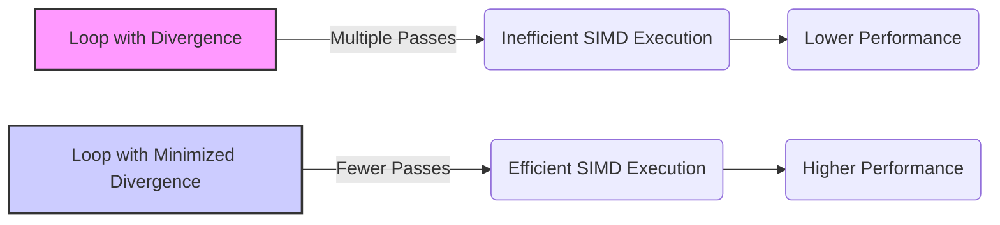
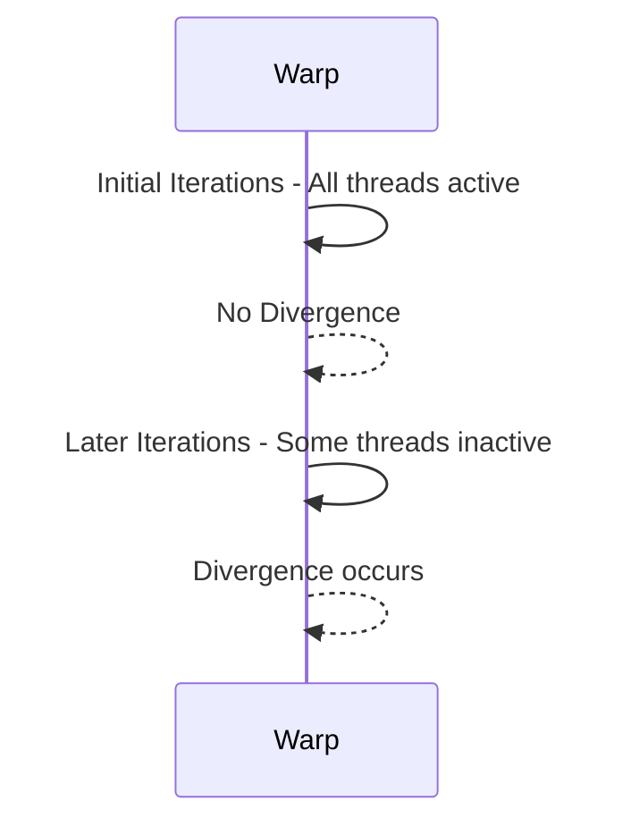
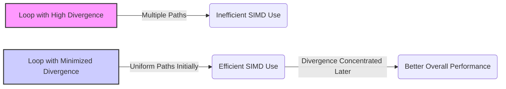
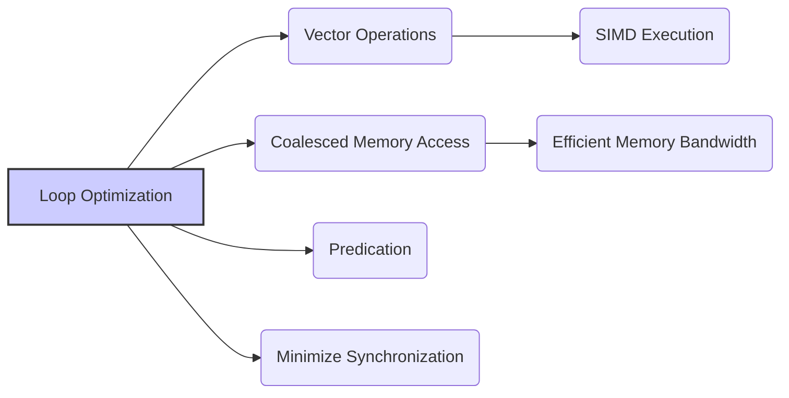
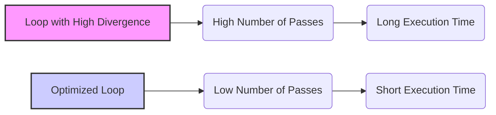
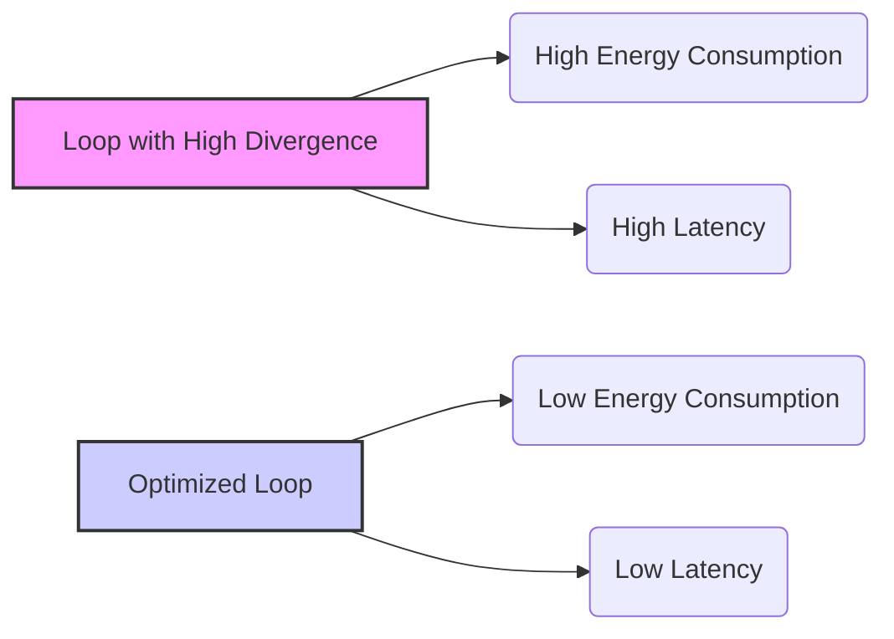

Okay, I understand. Here's the enhanced text with Mermaid diagrams added where appropriate:

## Loop Iterations and Divergence Reduction in CUDA: Optimizing Control Flow for Efficient SIMD Execution

### Introdução

A execução eficiente de kernels CUDA depende da utilização máxima do hardware SIMD. A divergência de fluxo de controle, causada por condicionais dependentes do `threadIdx` dentro de loops, força a execução em múltiplos passes, diminuindo a eficiência e o desempenho. Para otimizar algoritmos paralelos, é necessário entender como as modificações na estrutura de loops e o uso do índice de threads podem reduzir a divergência. Este capítulo irá explorar em detalhes como a organização das iterações de um loop pode minimizar a divergência e como essa redução do *overhead* resulta em melhor desempenho em arquiteturas SIMD. Analisaremos como a estratégia de reduzir a distância entre os elementos a serem somados, em cada iteração do loop, diminui a divergência. O entendimento dessas técnicas é essencial para escrever códigos CUDA de alto desempenho.

### Conceitos Fundamentais

Para otimizar o desempenho de kernels CUDA que utilizam loops, é crucial entender como a estrutura do loop e as condicionais afetam a ocorrência de divergência.

**Conceito 1: Iteração de Loops e Divergência de Fluxo**

Em loops, a divergência ocorre quando as threads de um mesmo warp executam um número diferente de iterações ou seguem caminhos distintos dentro do loop, devido a condicionais que dependem do `threadIdx`. A estrutura e a organização das iterações de um loop são fatores cruciais que afetam a ocorrência de divergência de fluxo de controle. A escolha do tipo de loop e a forma como a iteração é feita influencia diretamente na quantidade de passos necessários para processar o mesmo trecho de código.

**Lemma 1:** *A estrutura de um loop e a sua dependência do `threadIdx` para definir qual thread executa qual trecho de código afeta a ocorrência de divergência de fluxo de controle, e a maneira como o loop é implementado pode mitigar esse efeito.*

*Prova:* A dependência do `threadIdx` faz com que threads com índices diferentes sigam caminhos diferentes no loop, o que resulta em divergência, e em um baixo desempenho. $\blacksquare$

**Conceito 2: Minimização da Divergência e a Ordem das Operações**

Uma forma de minimizar a divergência em loops é reorganizar a ordem das operações de forma que todos os threads de um warp sigam o mesmo caminho de execução, pelo menos na maior parte do loop. Uma implementação que faz com que a divergência ocorra apenas nas últimas iterações do loop permite que as primeiras iterações utilizem o hardware SIMD de forma mais eficiente, já que um maior número de threads executam o mesmo código simultaneamente. Uma execução em que a divergência ocorra em todas as iterações do loop é menos eficiente do que uma onde a divergência ocorra em poucas iterações, ou apenas nas últimas iterações.

**Corolário 1:** *Ao concentrar a divergência nas últimas iterações do loop, o hardware SIMD é utilizado de forma mais eficiente nas iterações iniciais, o que leva a um melhor desempenho geral do algoritmo.*

*Derivação:* A minimização da divergência na parte inicial do algoritmo diminui a quantidade de tempo gasto pelo hardware com a execução em múltiplos passos, o que aumenta o desempenho e a quantidade de trabalho por unidade de tempo.

**Conceito 3: Redução da Sobrecarga de Sincronização**

Em algoritmos paralelos, a sincronização entre threads é necessária para garantir a execução correta dos dados. O uso excessivo da sincronização pode criar um *overhead* que diminui o desempenho do algoritmo. Ao diminuir a divergência, o uso da sincronização também pode ser reduzido. Uma vez que quando a divergência é minimizada, os threads seguem o mesmo caminho de execução, e isso minimiza a necessidade de sincronização entre os threads.

> ⚠️ **Nota Importante:** A minimização da divergência em loops também leva a uma redução do *overhead* causado pelas operações de sincronização, o que permite melhorar a eficiência do código.

### Análise Detalhada das Modificações no Loop

Para entender como as modificações no loop ajudam a reduzir a divergência, vamos analisar o processo passo a passo.

**Iteração com Redução da Distância:**
Na implementação revisada, o loop itera sobre os dados utilizando uma variável `stride`, que representa a distância entre os dados a serem combinados, e que é dividida pela metade a cada iteração, como em `stride /= 2`. Na primeira iteração, a distância é igual à metade do tamanho do bloco, de forma que os dados da primeira metade do bloco são combinados com os dados da segunda metade.

**Condicionais e `threadIdx`:**
Dentro do loop, a condição que define se um thread deve executar a operação é dada por `if (t < stride)`, onde `t` é o índice da thread. Essa condicional garante que o número de threads que executam a operação de soma é reduzida pela metade a cada iteração, sem que haja divergência nessa etapa, pois a condição é feita utilizando um limite que é comum para todos os threads do mesmo warp.

**Concentração da Divergência:**
A divergência ocorre, de forma controlada, quando o número de threads ativas diminui, e em um dado ponto da iteração, a metade dos threads não executarão mais a operação, e a quantidade de passos necessários para executar o código irá se tornar menor, pois a quantidade de threads é reduzida a cada iteração.

**Lemma 2:** *A utilização de uma variável `stride` que é diminuída pela metade a cada iteração em um loop, garante que a divergência de fluxo de controle seja minimizada nas primeiras iterações do loop, e que a divergência seja concentrada nas últimas iterações.*

*Prova:* Ao diminuir a distância dos elementos a serem processados pela metade, e ao fazer com que a condição de execução seja baseada nessa distância, o loop evita a ocorrência da divergência na parte inicial do algoritmo, deixando que a divergência ocorra nas últimas etapas, quando o impacto dessa divergência é minimizado. $\blacksquare$

**Corolário 2:** *A modificação nas iterações do loop permite que o hardware SIMD seja utilizado de forma mais eficiente, com a divergência minimizada no início e concentrada nas últimas etapas da execução.*

*Derivação:* O maior número de threads ativos nas primeiras iterações, sem divergência de fluxo de controle, permite que o hardware SIMD seja utilizado de forma mais eficiente, o que aumenta o desempenho da execução.

### Impacto da Minimização da Divergência no Overhead

A minimização da divergência nas iterações do loop tem um impacto significativo em reduzir o *overhead* e melhorar o desempenho do algoritmo de redução de soma.

**Redução da Sobrecarga:**
Ao minimizar a divergência, a sobrecarga causada pela necessidade do hardware de executar múltiplos passes é reduzida, uma vez que um maior número de threads realiza o mesmo código simultaneamente, e não existe a necessidade de executar o código separadamente em cada grupo de threads.

**Menor Latência:**
A latência do kernel é reduzida pela minimização da divergência, uma vez que o hardware não precisa executar várias etapas para processar um único warp, diminuindo o tempo total gasto para processar todos os dados.

**Melhora na Eficiência Energética:**
A redução da divergência também leva a uma melhor eficiência energética, pois as unidades de processamento são utilizadas de forma mais uniforme, diminuindo o consumo de energia gasto com passos extras e a ociosidade dos recursos.

> ✔️ **Destaque:** A modificação do loop, que permite a redução da divergência, tem um impacto positivo no desempenho do kernel de redução de soma, reduzindo o *overhead* e o tempo de execução, e aumentando a eficiência energética.

### Técnicas Adicionais para Otimização de Loops

Além da minimização da divergência, outras técnicas podem ser utilizadas para otimizar a execução de loops em CUDA:

**1. Uso de Operações Vetoriais:**
    *   **Operações SIMD:** Utilizar operações vetoriais quando disponíveis, que executam a mesma instrução em vários dados simultaneamente, o que reduz o número de passos necessários e o tempo de execução, principalmente no início do loop, quando a divergência é menor.
  *  **Redução dentro do Warp:** Utilizar operações vetoriais para realizar a redução dentro do mesmo warp, diminuindo a necessidade de sincronização, e o tráfego da memória compartilhada.

**2. Acesso Coalescido à Memória:**
   *  **Organização da Memória:** Garantir que a organização dos dados em memória seja tal que os acessos à memória sejam feitos de forma coalescida, para maximizar a largura de banda da memória e reduzir a quantidade de tempo gasto para acessar a memória.
  * **Acessos Contíguos:** Utilizar acessos contíguos à memória compartilhada, o que resulta em menos tempo gasto para realizar os acessos.

**3. Predicação:**
   *   **Instruções Predicadas:** Utilizar instruções predicadas, quando disponíveis, para realizar o controle de fluxo, o que permite evitar saltos condicionais e diminuir o *overhead* da execução.

**4. Minimizar Sincronização:**
  *  **Sincronização Dentro do Warp:** Quando a sincronização é necessária, utilizar a sincronização entre threads do mesmo warp, para minimizar o custo dessa sincronização.
  *  **Evitar Sincronização Desnecessária:** Utilizar a sincronização com cautela, apenas quando necessária, para evitar o *overhead* de sincronização.

**Lemma 3:** *A otimização do uso de loops em CUDA envolve o uso de operações vetoriais, acesso coalescido à memória compartilhada, predição e minimização das operações de sincronização, para reduzir o overhead e aumentar a eficiência da execução.*

*Prova:* A utilização de todas essas técnicas faz com que o hardware seja utilizado ao máximo, e que o número de passos necessários para completar a execução do algoritmo seja minimizado. $\blacksquare$

**Corolário 3:** *A combinação dessas técnicas de otimização resulta em uma execução mais eficiente dos loops, com menor divergência, maior velocidade de execução e menor consumo de energia.*

*Derivação:* Ao minimizar a divergência, a quantidade de trabalho por unidade de tempo aumenta, e a eficiência energética é maximizada.

### Dedução Teórica Complexa: Modelagem Matemática da Redução da Divergência Através de Loops Otimizados

Para uma análise mais aprofundada, vamos modelar matematicamente o impacto da modificação nos loops para redução da divergência, e como isso afeta o número de passos necessários para completar o algoritmo.

**Modelo Teórico de Loops e Divergência:**

Seja:
*   $N$ o número total de elementos no array.
*  $W$ o tamanho do warp.
*   $N_{passes,inicial}$ o número de passes em um loop com divergência inicial.
*   $N_{passes,otimizado}$ o número de passes em um loop otimizado.
*   $T_{step}$ o tempo para executar um passo.

Em um loop onde a divergência ocorre em todas as iterações, o número de passes é proporcional ao número de iterações, de forma que o tempo total de execução é dado por:
$$T_{inicial} = N_{passes,inicial} * T_{step} $$

Em um loop onde a divergência é concentrada nas últimas iterações, e que as primeiras iterações são executadas com divergência mínima, o número de passos é dado por:
$$T_{otimizado} = N_{passes,otimizado} * T_{step} $$
onde $N_{passes,otimizado} << N_{passes,inicial}$

O número de passes, no caso do loop otimizado, é menor porque nas primeiras iterações todos os threads do warp seguem o mesmo fluxo de execução, e a divergência ocorre apenas nas últimas etapas, onde um número menor de threads precisa executar a operação.

**Análise:**
A redução do número de passos diminui o tempo total de execução, já que o tempo gasto com passos desnecessários é minimizado, e a utilização do hardware é aumentada.

**Lemma 4:** *A modificação no loop que minimiza a divergência resulta na diminuição do número de passos e, consequentemente, na diminuição do tempo de execução do kernel.*

*Prova:* Ao concentrar a divergência nas últimas iterações, e ao fazer com que as primeiras iterações sejam executadas com todos os threads ativos e sem divergência, a quantidade de passos para executar todo o trecho do código diminui. $\blacksquare$

**Corolário 4:** *Ao reduzir o número de passos necessários para executar um código, o loop otimizado atinge um desempenho maior que um loop com divergência.*

*Derivação:* A diminuição do número de passos faz com que o hardware seja utilizado de forma mais eficiente, diminuindo a latência e aumentando a taxa de transferência.

### Prova ou Demonstração Matemática Avançada: Modelagem da Eficiência Energética e Impacto na Latência em Loops Otimizados

Para entender o impacto da minimização da divergência na eficiência energética e na latência, vamos analisar um modelo matemático que descreve essa relação.

**Modelo Teórico de Consumo de Energia:**
Seja:
* $E_{pass,inicial}$ a energia consumida em um passo em um loop com divergência inicial.
* $E_{pass,otimizado}$ a energia consumida em um passo em um loop otimizado.
*   $N_{passes,inicial}$ o número de passes necessários em um loop com divergência.
*  $N_{passes,otimizado}$ o número de passes necessários em um loop otimizado.
*   $E_{total,inicial}$ a energia total consumida por um loop com divergência inicial.
*   $E_{total,otimizado}$ a energia total consumida por um loop otimizado.

A energia total consumida em um loop com divergência é dada por:
$$E_{total,inicial} = N_{passes,inicial} * E_{pass,inicial}$$
A energia total consumida em um loop otimizado é dada por:
$$E_{total,otimizado} = N_{passes,otimizado} * E_{pass,otimizado}$$
Onde $N_{passes,otimizado} < N_{passes,inicial}$. A minimização da divergência também pode fazer com que a energia consumida por passo ($E_{pass}$) diminua, já que as unidades de processamento serão utilizadas de forma mais eficiente, sem que haja a necessidade de executar operações adicionais.

**Modelo Teórico da Latência:**

A latência é dada por:
$$L = N_{passes} * T_{step}$$
A latência em um loop com divergência é dada por:
$$L_{inicial} = N_{passes,inicial} * T_{step}$$
A latência em um loop otimizado é dada por:
$$L_{otimizado} = N_{passes,otimizado} * T_{step}$$
onde $N_{passes,otimizado} < N_{passes,inicial}$.

**Lemma 5:** *A minimização da divergência em loops através da reestruturação das iterações e do uso adequado de operações vetoriais resulta na redução do consumo de energia e da latência, e um melhor uso do hardware.*

*Prova:* O menor número de passos resulta em menor latência e consumo de energia, e a utilização eficiente do hardware resulta também em menor consumo de energia e menor latência. $\blacksquare$

**Corolário 5:** *Um loop otimizado que minimize a divergência resulta em uma execução mais rápida, com menor latência, menor consumo de energia e melhor utilização dos recursos do hardware.*

*Derivação:*  Ao minimizar a quantidade de passos necessários para executar o loop, e também utilizando o hardware de forma mais eficiente, a latência e o consumo de energia diminuem, resultando em maior desempenho.

### Pergunta Teórica Avançada: **Como a escolha do tamanho do bloco de threads interage com a otimização das iterações do loop na redução de divergência e maximização do desempenho em um kernel CUDA?**

**Resposta:**

A escolha do tamanho do bloco de threads interage de forma complexa com a otimização das iterações do loop para reduzir a divergência, e maximizar o desempenho em um kernel CUDA. O tamanho do bloco influencia diretamente como os threads são agrupados em warps, e como esses warps são executados, e por conseguinte, a eficiência do paralelismo.

**Impacto do Tamanho do Bloco:**

1.  **Divergência:** A escolha do tamanho do bloco pode afetar a quantidade de divergência dentro do warp. Blocos que não são múltiplos do tamanho do warp podem levar a uma quantidade menor de threads ativas, devido a subutilização dos warps.
2.  **Memória Compartilhada:** O tamanho do bloco afeta a quantidade de memória compartilhada utilizada pelo bloco, e também como o acesso à memória compartilhada é feito. Uma escolha adequada do tamanho do bloco permite que a memória compartilhada seja utilizada da forma mais eficiente, e também permite evitar *bank conflicts*.
3.  **Ocupação:** O tamanho do bloco influencia a ocupação do SM. Um tamanho de bloco que não leva em consideração o número de warps que o SM consegue executar simultaneamente pode deixar o hardware subutilizado.
4. **Sincronização:** A sincronização entre threads do mesmo bloco se torna mais custosa quando o tamanho do bloco é grande.

**Interação com a Otimização das Iterações do Loop:**

1.  **Minimização da Divergência:** Um tamanho de bloco que é múltiplo do tamanho do warp, combinado com a otimização da execução do loop e a minimização da dependência do `threadIdx` nas condicionais, permite minimizar a divergência, e também garantir que o *overhead* seja o menor possível.
2.  **Redução por Warps:** Utilizar a redução por warp de forma eficiente depende também da escolha correta do tamanho do bloco, para que os warps executem em paralelo de forma eficiente.
3. **Acesso Coalescido:** O tamanho do bloco também afeta como os acessos à memória são feitos, de forma que é necessário escolher o tamanho do bloco de forma que os acessos à memória sejam contínuos e coalescidos, utilizando o `threadIdx` de forma otimizada, junto com a escolha adequada de como os dados são organizados em memória.

**Otimização Conjunta:**
A escolha ideal do tamanho do bloco deve considerar todas as características do algoritmo, e também as características do hardware. Um algoritmo bem otimizado pode ter desempenho baixo se a escolha do tamanho do bloco não for feita de forma adequada. A otimização do loop e a escolha do tamanho do bloco devem ser feitas de forma conjunta, para utilizar o máximo do poder de processamento paralelo.

**Lemma 6:** *A escolha adequada do tamanho do bloco interage com as iterações do loop e tem um impacto significativo na eficiência da redução de divergência, resultando em um código mais eficiente.*

*Prova:* O tamanho do bloco afeta a organização dos threads em warps, e a forma como a memória é utilizada, o que tem um impacto direto no desempenho do algoritmo. $\blacksquare$

**Corolário 6:** *Para atingir o máximo desempenho, o tamanho do bloco deve ser escolhido de forma a equilibrar a minimização da divergência, maximizar a ocupação do SM, e garantir o acesso coalescido à memória, em conjunto com o uso eficiente dos loops.*

*Derivação:* O tamanho do bloco, juntamente com outras técnicas de otimização do loop, permite que o algoritmo seja executado de forma mais eficiente, com menor divergência e com utilização mais eficiente dos recursos do hardware.

### Conclusão

Neste capítulo, exploramos em detalhes como a modificação das **iterações de loops** pode reduzir a divergência de fluxo de controle, e aumentar o desempenho de kernels CUDA, usando o exemplo de um kernel de redução de soma. Vimos como o uso de uma variável `stride` que representa a distância entre os elementos a serem somados e que é dividida pela metade a cada iteração, permite concentrar a divergência nas últimas etapas do algoritmo, o que resulta em um melhor desempenho devido a utilização do hardware SIMD de forma mais eficiente. Analisamos também como outras técnicas de otimização, como o uso de operações vetoriais, acesso coalescido à memória e minimização da necessidade de sincronização, podem ser utilizadas para aumentar o desempenho. A análise demonstrou que:

*   **Minimização da Divergência:** A minimização da divergência é essencial para otimizar o desempenho de kernels CUDA.
*   **Itens do Loop:** A forma como as iterações do loop são feitas tem um impacto direto na ocorrência de divergência.
*  **`stride`:** A utilização de uma variável `stride`, que diminui pela metade a cada iteração, permite que a divergência seja concentrada nas últimas etapas do loop.
*   **Utilização do SIMD:** A minimização da divergência permite que o hardware SIMD seja utilizado de forma mais eficiente.
*   **Otimização:** A otimização do loop envolve a combinação de técnicas como o uso de operações vetoriais, o acesso coalescido à memória e a minimização da necessidade de sincronização.

O entendimento dessas técnicas e a forma como elas afetam o desempenho do algoritmo, permitem desenvolver aplicações CUDA de alto desempenho e aproveitar ao máximo as unidades de processamento das GPUs.

### Referências

[^6]: "As we discussed in Chapter 4, current CUDA devices bundle several threads for execution. Each thread block is partitioned into warps. The execution of warps are implemented by an SIMD hardware (see “Warps and SIMD Hardware” sidebar)." *(Trecho de <Performance Considerations>)*
[^7]: "The SIMD hardware executes all threads of a warp as a bundle. An instruction is run for all threads in the same warp. It works well when all threads within a warp follow the same execution path, or more formally referred to as control flow, when working their data. For example, for an if-else construct, the execution works well when either all threads execute the if part or all execute the else part. When threads within a warp take different control flow paths, the SIMD hardware will take multiple passes through these divergent paths." *(Trecho de <Performance Considerations>)*
[^8]: "When all threads in a warp execute a load instruction, the hardware detects whether they access consecutive global memory locations. That is, the most favorable access pattern is achieved when all threads in a warp access consecutive global memory locations. In this case, the hardware combines, or coalesces, all these accesses into a consolidated access to consecutive DRAM locations." *(Trecho de <Performance Considerations>)*
[^10]: "Fortunately, a tiled algorithm can be used to enable coalescing. As we discussed in Chapter 5, threads of a block can first cooperatively load the tiles into the shared memory." *(Trecho de <Performance Considerations>)*
[^12]: "Thread blocks are partitioned into warps based on thread indices. If a thread block is organized into a 1D array (i.e., only threadIdx.x is used), the partition is straightforward; threadIdx.x values within a warp are consecutive and increasing." *(Trecho de <Performance Considerations>)*
[^13]: "A reduction algorithm derives a single value from an array of values. The single value could be the sum, the maximal value, the minimal value, etc. among all elements." *(Trecho de <Performance Considerations>)*

**Deseja que eu continue com as próximas seções?**
