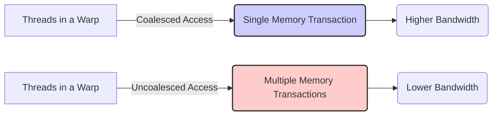
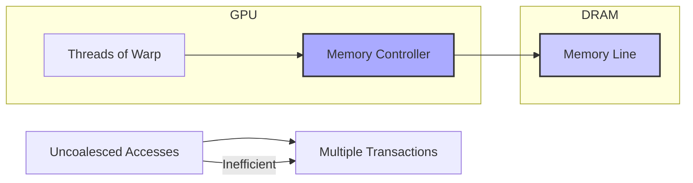
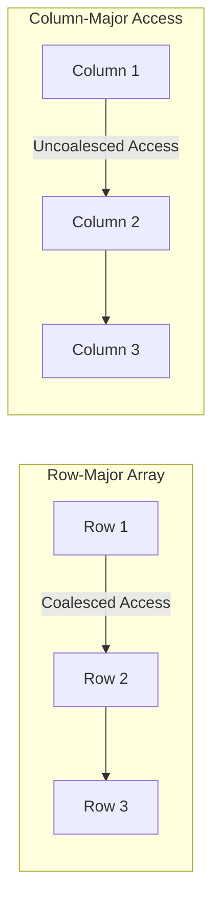
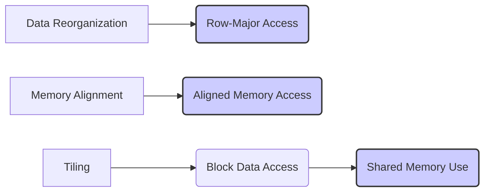
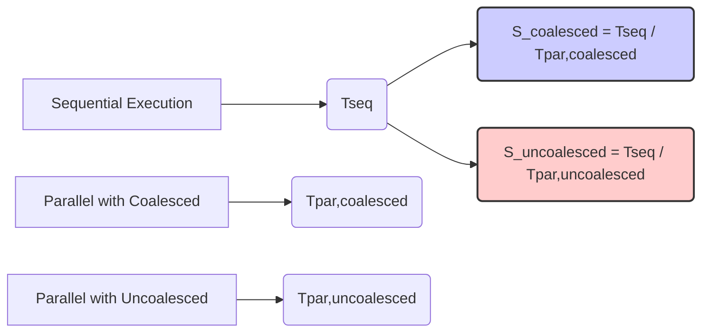
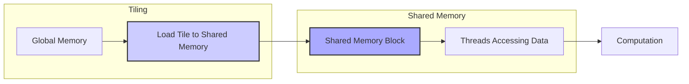

Okay, I've analyzed the text and added Mermaid diagrams to enhance the explanation of memory coalescing in CUDA. Here's the enhanced text with the diagrams:

## Memory Coalescing in CUDA: Maximizing Global Memory Bandwidth through Optimized Access Patterns



### Introdução

A eficiência do acesso à **memória global** é um dos fatores mais importantes que afetam o desempenho de aplicações CUDA. Para atingir a alta taxa de transferência de dados necessária em aplicações de alto desempenho, é essencial utilizar técnicas de **coalescência de memória**, que permitem que o hardware da GPU combine múltiplos acessos de threads adjacentes em uma única transação de memória. Este capítulo explorará em detalhes o conceito de coalescência de memória, como a arquitetura DRAM utilizada na memória global funciona, e como o padrão de acesso à memória impacta no desempenho. Analisaremos também as técnicas de programação para garantir acessos coalescidos e como elas levam ao máximo desempenho em aplicações CUDA. O entendimento desses mecanismos de coalescência é fundamental para o desenvolvimento de código CUDA otimizado.

### Conceitos Fundamentais

A otimização de acesso à memória global em CUDA depende da compreensão de como as arquiteturas de memória DRAM funcionam e de como as operações de leitura e escrita podem ser combinadas.

**Conceito 1: A Arquitetura DRAM e Acesso à Memória Global**

A memória global da GPU é implementada utilizando chips de **DRAM (Dynamic Random Access Memory)**. A organização física da DRAM influencia diretamente como os dados são acessados e como os acessos são combinados. Na DRAM, os dados são armazenados em células que são organizadas em linhas e colunas, e os acessos à memória ocorrem em unidades chamadas "linhas" de memória. Quando um endereço de memória é requisitado, a memória DRAM não apenas acessa essa posição, mas acessa um conjunto de posições contíguas, e o hardware seleciona apenas o dado correto que foi solicitado, pois ele tem um endereço para identificar o dado correto. As operações de acesso à memória podem ser otimizadas quando os acessos às posições contíguas de um dado bloco são feitas simultaneamente, e é essa característica que é explorada pela coalescência de memória.

**Lemma 1:** *A memória global é construída utilizando DRAM, e o acesso à memória DRAM é feito em unidades de linhas, o que significa que o acesso a uma posição de memória também acessa posições contíguas.*

*Prova:* A arquitetura da DRAM implica que os acessos à memória são feitos em blocos de memória contíguos, e o hardware utiliza um endereço para acessar uma posição dentro desse bloco. $\blacksquare$

**Conceito 2: Coalescência de Acesso à Memória**

A **coalescência de acesso à memória** é uma técnica de otimização onde o hardware da GPU combina as requisições de acesso à memória global de threads adjacentes em uma única transação de memória [^8]. Em um warp de 32 threads, se os threads acessam posições contíguas da memória, o hardware da GPU consegue realizar um único acesso à memória para atender às requisições de todos os threads do warp. Isso resulta em um uso mais eficiente da largura de banda da memória, o que diminui o tempo necessário para realizar as operações de leitura e escrita na memória global, pois é necessário realizar menos acessos à memória. A coalescência de memória é essencial para que aplicações CUDA consigam atingir o alto desempenho.

```mermaid
sequenceDiagram
    participant Thread 1
    participant Thread 2
    participant Thread 3
    participant ...
    participant Thread 32
    participant GPU Memory Controller
    
    Thread 1->>GPU Memory Controller: Request Memory Address X
    Thread 2->>GPU Memory Controller: Request Memory Address X+1
    Thread 3->>GPU Memory Controller: Request Memory Address X+2
    ...
    Thread 32->>GPU Memory Controller: Request Memory Address X+31
    
    activate GPU Memory Controller
    GPU Memory Controller-->>GPU Memory Controller: Combine Requests
    GPU Memory Controller-->>GPU Memory Controller: Single Memory Transaction
    GPU Memory Controller-->>Thread 1: Data for Thread 1
    GPU Memory Controller-->>Thread 2: Data for Thread 2
    GPU Memory Controller-->>Thread 3: Data for Thread 3
    ...
    GPU Memory Controller-->>Thread 32: Data for Thread 32
    deactivate GPU Memory Controller
```

**Corolário 1:** *A coalescência de acessos à memória permite que um único acesso à memória atenda a vários threads simultaneamente, maximizando o uso da largura de banda da memória global.*

*Derivação:* Ao combinar acessos, o hardware diminui a quantidade de operações de leitura e escrita na memória, aumentando a taxa de transferência de dados.

**Conceito 3: Acessos Não Coalescidos e a Perda de Desempenho**

Acessos não coalescidos ocorrem quando os threads de um mesmo warp acessam posições não contíguas de memória, ou quando a ordem dos threads não coincide com a ordem dos dados em memória. Quando ocorre o acesso não coalescido, o hardware precisa realizar múltiplas transações de memória para atender às requisições dos threads, o que aumenta o tempo necessário para leitura ou escrita, diminuindo a largura de banda da memória global. Acessos não coalescidos são extremamente ineficientes e devem ser evitados em aplicações CUDA que visam alto desempenho.

> ⚠️ **Nota Importante:** Os acessos não coalescidos à memória global reduzem a largura de banda da memória, e causam um impacto negativo no desempenho, e devem ser evitados para otimizar o acesso à memória global.

### Detalhes da Implementação da Coalescência



Para entender o funcionamento da coalescência, vamos detalhar como ela é implementada em hardware e como ela afeta a transferência de dados.

**Acessos Sequenciais:**
Na coalescência, os threads de um mesmo warp acessam posições de memória contíguas e sequenciais, e essas posições se encontram na mesma linha de memória na DRAM. O hardware da GPU detecta que as threads estão acessando posições de memória contíguas, e combina todas as requisições em um único acesso à memória.

**Transação Única:**
Em uma única transação de memória, o hardware acessa a linha da memória DRAM onde se encontram os dados requeridos por todos os threads de um warp. Essa transação é feita na largura da linha da DRAM, que corresponde a vários bytes. O hardware então direciona a porção correta da linha da memória para cada thread.

**Eficiência:**
A coalescência reduz drasticamente o número de transações necessárias, e como uma única transação atende a múltiplos threads, a largura de banda da memória é maximizada. A quantidade de tempo para realizar o acesso é reduzida, o que resulta em maior desempenho e menor consumo de energia.

**Acessos Não Coalescidos:**
Quando os acessos não são contíguos, o hardware precisa realizar uma transação para cada acesso à memória, e os dados podem se encontrar em diferentes linhas da DRAM, de forma que a quantidade de operações para ler a mesma quantidade de dados aumenta, e o tempo total de leitura também. O tempo gasto com a leitura é multiplicado quando os acessos não são contíguos, o que reduz drasticamente o desempenho do código.

**Lemma 2:** *O hardware da GPU combina acessos coalescidos de threads adjacentes em uma única transação de memória, maximizando a largura de banda, enquanto os acessos não coalescidos levam a múltiplas transações, o que reduz a largura de banda e o desempenho.*

*Prova:*  A arquitetura da DRAM obriga que cada acesso à memória resulte na leitura ou escrita de um bloco de memória contígua, que corresponde a uma linha da DRAM, de forma que, quando vários threads acessam dados dentro da mesma linha de memória, o hardware consegue utilizar a leitura da linha como uma única operação para vários threads. $\blacksquare$

**Corolário 2:** *A implementação da coalescência em hardware permite que aplicações CUDA alcancem o alto desempenho utilizando uma largura de banda da memória global próxima da capacidade máxima do hardware.*

*Derivação:* A técnica de coalescência diminui a necessidade de acesso à memória, e por isso consegue aumentar a taxa de transferência de dados da memória global.

### Padrões de Acesso à Memória Global e Coalescência



Para garantir o acesso coalescido à memória, os desenvolvedores precisam estar cientes de como os dados são organizados na memória.

**Arrays Multidimensionais:**
Em arrays multidimensionais (como matrizes), os dados são armazenados na memória linearmente, de acordo com a convenção *row-major*. Isso significa que os elementos de uma linha são armazenados de forma contígua. O acesso a linhas de uma matriz resulta em acesso coalescido, enquanto o acesso a colunas resulta em acesso não coalescido, o que exige que o acesso à matriz, seja feito por linhas, para que a memória seja acessada de forma eficiente.

**Stride:**
O *stride* representa o número de posições de memória que um thread precisa pular para acessar o próximo dado que precisa ser lido ou escrito, e tem um papel importante na coalescência. Um *stride* igual a 1 resulta em acesso coalescido. Um *stride* diferente de um, como por exemplo em `d_A[threadIdx.x * stride]` resulta em acessos não contíguos e não coalescidos, e deve ser evitado sempre que possível.

**Acessos Contíguos:**
A organização dos dados na memória, juntamente com a forma como os threads acessam os dados, deve garantir que o acesso seja contíguo. Se os threads de um warp acessam posições de memória que não são contíguas ou sequenciais, os acessos não serão coalescidos.

> ❗ **Ponto de Atenção**: O padrão de acesso à memória global tem um impacto direto na coalescência, e a escolha de como organizar os dados e como fazer os acessos é fundamental para obter alto desempenho em CUDA.

### Técnicas para Garantir Acessos Coalescidos



Para maximizar a coalescência, os desenvolvedores podem utilizar as seguintes técnicas:

**1. Alinhamento de Memória:**
   *  **Alinhamento de Dados:** Utilizar alinhamento adequado para garantir que os dados iniciem em endereços que respeitem o tamanho da transação da memória global, de forma que, o acesso a uma posição inicial resulte no acesso a todos os dados necessários para um warp.

**2. Reorganização de Dados:**
   *   **Row-major vs Column-major:** Para arrays multidimensionais, como matrizes, organizar o código para que os acessos sejam feitos por linhas (ou seja, acessando elementos contíguos na memória), para garantir o acesso coalescido, e quando o acesso for por colunas, é preciso utilizar técnicas adicionais para que a leitura seja feita de forma eficiente.
   *  **Transposição:** Utilizar a transposição de dados quando o acesso original não é coalescido, de forma a reorganizar os dados na memória.

**3. Tiling e Memória Compartilhada:**
    *   **Carregamento em Blocos:** Dividir os dados em blocos menores e carregar esses blocos na memória compartilhada, para depois realizar os acessos de forma mais eficiente.
  * **Reutilização de Dados:** Reutilizar os dados carregados na memória compartilhada para diminuir a necessidade de acessos à memória global.

**4. Índices de Threads:**
   *  **Acessos Sequenciais:** Utilizar o `threadIdx` e outros mecanismos de indexação de forma que os acessos à memória sejam sempre sequenciais. Utilizar uma lógica de acesso à memória que garanta que todos os threads de um mesmo warp acessam dados contíguos.
   *   **Minimizar *Stride*:** Minimizar o valor de *stride*, e garantir que a unidade de acesso da memória global seja contínua.

**Lemma 4:** *A otimização de acesso à memória global para garantir a coalescência envolve a organização adequada de dados na memória, a utilização de *tiling*, o alinhamento dos dados, e o planejamento correto do uso do índice da thread para gerar endereços contíguos.*

*Prova:* A implementação dessas técnicas garante que a memória seja acessada da forma mais eficiente e também utilizando o potencial do hardware SIMD, onde as threads acessam posições de memória contíguas. $\blacksquare$

**Corolário 4:** *O uso adequado dessas técnicas de otimização permite que aplicações CUDA alcancem um alto desempenho devido a utilização eficiente da largura de banda da memória global.*

*Derivação:* A otimização dos acessos à memória resulta em maior velocidade na transferência de dados e maior quantidade de trabalho por unidade de tempo, o que aumenta o desempenho das aplicações.

### Dedução Teórica Complexa: Modelagem Matemática do *Speedup* em Acessos Coalescidos vs Não Coalescidos à Memória Global



Para uma análise mais precisa do impacto da coalescência no desempenho, vamos modelar matematicamente o *speedup* em acessos coalescidos e não coalescidos à memória global.

**Modelo Teórico de *Speedup*:**

Seja:

*   $T_{seq}$ o tempo de execução do algoritmo sequencial.
*   $T_{par,coalesced}$ o tempo de execução do algoritmo paralelo com acessos coalescidos.
*   $T_{par,uncoalesced}$ o tempo de execução do algoritmo paralelo com acessos não coalescidos.
*  $S_{coalesced}$ o *speedup* do algoritmo com acessos coalescidos.
*  $S_{uncoalesced}$ o *speedup* do algoritmo com acessos não coalescidos.
* $N$ o número de elementos a serem acessados.
*  $B_{efetiva,coalesced}$ a largura de banda efetiva do acesso coalescido.
* $B_{efetiva,uncoalesced}$ a largura de banda efetiva do acesso não coalescido.
*   $T_{comp}$ o tempo de computação por elemento.

O tempo de execução sequencial é dado por $T_{seq} = N * (T_{comp} + T_{mem})$.
O tempo de execução com acessos coalescidos é dado por $T_{par,coalesced} = \frac{N}{P} * (T_{comp} + \frac{T_{mem}}{B_{efetiva,coalesced}})$.

O tempo de execução com acessos não coalescidos é dado por $T_{par,uncoalesced} =  \frac{N}{P} * (T_{comp} + \frac{T_{mem}}{B_{efetiva,uncoalesced}})$

O *speedup* com acessos coalescidos é dado por:
$$S_{coalesced} = \frac{T_{seq}}{T_{par,coalesced}}$$
O *speedup* com acessos não coalescidos é dado por:
$$S_{uncoalesced} = \frac{T_{seq}}{T_{par,uncoalesced}}$$
Onde $B_{efetiva,coalesced} > B_{efetiva,uncoalesced}$.

**Análise do *Speedup*:**

A modelagem matemática mostra que a diferença entre $S_{coalesced}$ e $S_{uncoalesced}$ é diretamente proporcional à diferença entre a largura de banda obtida com acessos coalescidos e não coalescidos. Uma maior largura de banda, causada por acessos coalescidos, leva a um maior *speedup*.

**Lemma 5:** *O *speedup* de algoritmos em CUDA é diretamente afetado pela coalescência de acessos à memória, onde acessos coalescidos resultam em maior largura de banda e, portanto, maior desempenho.*

*Prova:* A largura de banda da memória global é o fator limitante no acesso à memória, e a coalescência permite que essa largura de banda seja utilizada de forma mais eficiente. $\blacksquare$

**Corolário 5:** *Para obter o máximo desempenho em aplicações CUDA, é essencial organizar o acesso à memória de forma a garantir a coalescência, o que resulta em uma maior largura de banda da memória global.*

*Derivação:* A largura de banda da memória é um fator limitante do desempenho, e o acesso coalescido permite que essa largura de banda seja utilizada de forma mais eficiente, resultando em melhor desempenho.

### Pergunta Teórica Avançada: **Como as técnicas de *tiling* e o uso de memória compartilhada interagem com a coalescência de acesso à memória global e como elas podem ser utilizadas para otimizar o desempenho?**

**Resposta:**

As técnicas de *tiling* (ou *blocking*) e o uso da memória compartilhada interagem de forma significativa com a coalescência de acesso à memória global, e a combinação dessas técnicas é fundamental para otimizar o desempenho de kernels CUDA, especialmente em algoritmos que necessitam de alto tráfego da memória.



***Tiling* e Memória Compartilhada:**

1.  **Blocos de Dados:** A técnica de *tiling* divide o conjunto de dados grande em blocos menores, que são carregados e processados em paralelo, de forma que o tempo de acesso à memória global é diminuído.
2.  **Memória Compartilhada:** A memória compartilhada é utilizada como um cache para armazenar esses blocos de dados, permitindo acesso mais rápido aos dados e reduzindo o tempo de acesso à memória global, e também o volume de dados transferidos entre a memória global e as unidades de processamento.

**Interação com a Coalescência:**

1.  **Carregamento Coalescido:** Os dados precisam ser carregados da memória global para a memória compartilhada utilizando acessos coalescidos, de forma a maximizar a largura de banda da memória global durante a transferência.
2.  **Acessos Locais:** Dentro da memória compartilhada, os acessos não precisam ser coalescidos, já que a memória compartilhada tem um acesso muito mais rápido.

**Como Utilizar a Combinação de Técnicas para Otimização:**

1. **Carregamento:** O carregamento dos dados da memória global para a memória compartilhada deve ser feito com acessos coalescidos. O padrão de acesso à memória e a forma como os threads acessam os dados deve garantir que os acessos sejam contíguos.
2. **Processamento:** Os threads do bloco podem utilizar os dados da memória compartilhada para realizar o processamento, sem a necessidade de acessar a memória global novamente, e também sem a necessidade de utilizar acesso coalescido. A memória compartilhada atua como um cache, que minimiza o tráfego na memória global.
3.  **Reutilização:** Reutilizar os dados que estão na memória compartilhada, o máximo possível, para minimizar o número de acessos à memória global e também à memória compartilhada, e maximizar o desempenho.
4. **Tamanho dos Blocos:** O tamanho dos blocos de dados deve ser adequado ao tamanho da memória compartilhada e também ao número de threads que estão sendo utilizados para o processamento, e para o acesso eficiente à memória compartilhada.

**Lemma 6:** *A combinação das técnicas de *tiling* e uso de memória compartilhada com a coalescência de acesso à memória global permite que os kernels CUDA atinjam um desempenho significativamente maior, utilizando a memória da forma mais eficiente.*

*Prova:* As técnicas de *tiling* e memória compartilhada diminuem o número de acessos à memória global. Ao garantir que os acessos à memória global sejam coalescidos, o hardware é utilizado de forma mais eficiente. $\blacksquare$

**Corolário 6:** *O *tiling*, juntamente com o uso da memória compartilhada, e um planejamento adequado da forma como os dados são acessados, e combinados com a coalescência dos acessos, permite otimizar o desempenho de aplicações CUDA com alto tráfego da memória global.*

*Derivação:* A coalescência e o *tiling* combinados com o uso adequado da memória compartilhada permitem diminuir a necessidade de acesso à memória global e também o tempo necessário para realizar as operações de leitura e escrita na memória global.

### Conclusão

Neste capítulo, exploramos o conceito de **coalescência de acesso à memória global** em CUDA, e a sua importância para maximizar a largura de banda e o desempenho das aplicações. Vimos que a arquitetura da memória DRAM na GPU é organizada em linhas, e que o hardware combina os acessos dos threads que se encontram dentro de uma mesma linha de memória em um único acesso, desde que os acessos sejam sequenciais. Analisamos como os acessos não coalescidos podem levar a uma perda significativa de desempenho, devido à necessidade de realizar múltiplas transações de memória. Exploramos as técnicas para garantir acessos coalescidos, incluindo a organização dos dados em memória, o uso de alinhamento, e o uso de *tiling* e memória compartilhada para otimizar o acesso. Por fim, vimos que o tamanho dos blocos de dados tem um impacto significativo no desempenho. Para otimizar o acesso à memória global é essencial entender:

*   **DRAM:** A memória global é implementada com DRAM e tem alta latência.
*   **Coalescência:** O acesso coalescido permite que múltiplos acessos sejam combinados em uma única transação, o que resulta em maior largura de banda.
*   **Acessos Não Coalescidos:** Acessos não coalescidos levam a múltiplas transações, o que diminui o desempenho.
*   **Row-Major:** Em arrays multidimensionais, o acesso a linhas resulta em acessos coalescidos, enquanto o acesso a colunas não.
*  **Memória Compartilhada:** A utilização da memória compartilhada como um cache, juntamente com o *tiling*, permite otimizar o acesso à memória global.
*   **Alinhamento:** O alinhamento dos dados é importante para garantir acessos coalescidos.

O entendimento detalhado da coalescência de acesso à memória global é fundamental para o desenvolvimento de aplicações CUDA de alto desempenho, e também para otimizar o consumo de energia em aplicações que requerem alto tráfego da memória.

### Referências

[^6]: "As we discussed in Chapter 4, current CUDA devices bundle several threads for execution. Each thread block is partitioned into warps. The execution of warps are implemented by an SIMD hardware (see “Warps and SIMD Hardware” sidebar)." *(Trecho de <Performance Considerations>)*
[^7]: "The SIMD hardware executes all threads of a warp as a bundle. An instruction is run for all threads in the same warp. It works well when all threads within a warp follow the same execution path, or more formally referred to as control flow, when working their data. For example, for an if-else construct, the execution works well when either all threads execute the if part or all execute the else part. When threads within a warp take different control flow paths, the SIMD hardware will take multiple passes through these divergent paths." *(Trecho de <Performance Considerations>)*
[^8]: "When all threads in a warp execute a load instruction, the hardware detects whether they access consecutive global memory locations. That is, the most favorable access pattern is achieved when all threads in a warp access consecutive global memory locations. In this case, the hardware combines, or coalesces, all these accesses into a consolidated access to consecutive DRAM locations." *(Trecho de <Performance Considerations>)*
[^10]: "Fortunately, a tiled algorithm can be used to enable coalescing. As we discussed in Chapter 5, threads of a block can first cooperatively load the tiles into the shared memory." *(Trecho de <Performance Considerations>)*
[^14]: "The global memory of a CUDA device is implemented with DRAMs." *(Trecho de <Performance Considerations>)*

**Deseja que eu continue com as próximas seções?**
