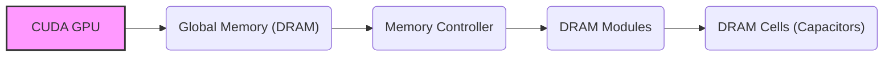
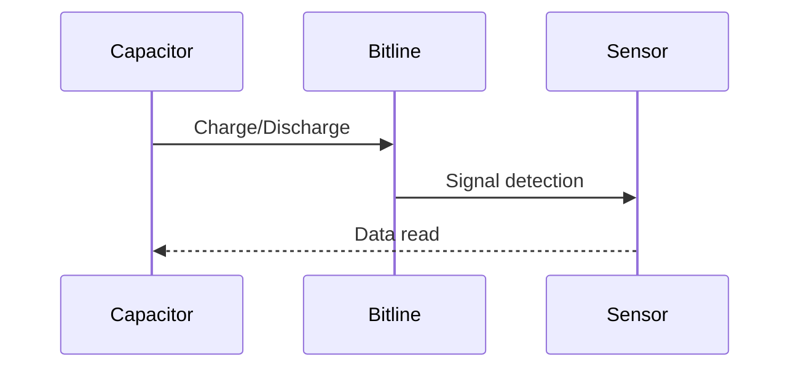
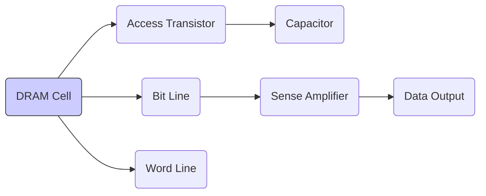
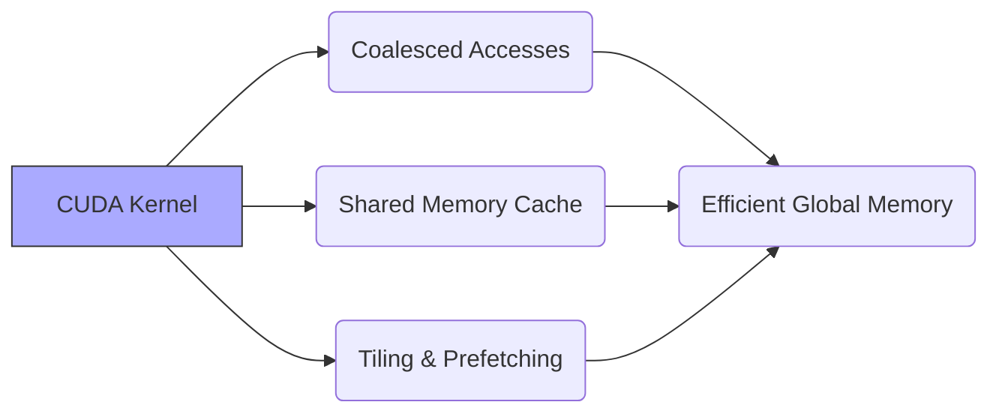
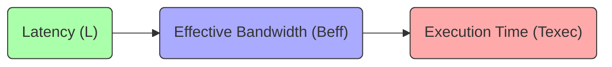

Okay, I will add Mermaid diagrams to the provided text to enhance its explanations, focusing on architecture and system relationships.

## DRAM Memory Storage in CUDA: Characteristics, Access Mechanisms, and Performance Implications

### Introdução

A **memória DRAM (Dynamic Random Access Memory)** é a tecnologia predominante utilizada para implementar a memória global nas GPUs da NVIDIA. A compreensão dos mecanismos de armazenamento e acesso da memória DRAM é fundamental para otimizar o desempenho de aplicações CUDA. Este capítulo irá detalhar como os dados são armazenados em DRAMs, como os acessos de leitura e escrita funcionam, e as implicações desses mecanismos para a latência e largura de banda da memória global. Analisaremos como as características da DRAM afetam diretamente o desempenho de aplicações CUDA, e como os desenvolvedores podem otimizar o acesso a essa memória para maximizar a taxa de transferência de dados.

### Conceitos Fundamentais

Para otimizar o acesso à memória global em CUDA, é essencial compreender as características e o funcionamento interno da memória DRAM.

**Conceito 1: Armazenamento de Dados em Capacitores**

As células de memória DRAM armazenam os dados utilizando pequenos **capacitores** [^14]. Cada capacitor armazena um bit de informação, onde a presença ou ausência de uma carga elétrica representa um valor binário (1 ou 0). A simplicidade das células de memória DRAM as torna muito compactas, permitindo alta densidade de armazenamento, e também um baixo custo por unidade de armazenamento. No entanto, como os capacitores perdem a carga elétrica ao longo do tempo, a informação precisa ser constantemente refrescada, o que é a razão para o nome "Dynamic" da DRAM.

**Lemma 1:** *A memória DRAM armazena os dados em pequenos capacitores, onde a presença ou ausência de carga elétrica representa um valor binário, o que permite alta densidade de armazenamento, embora precise ser constantemente refrescada.*

*Prova:* O armazenamento de dados em capacitores é o mecanismo fundamental da DRAM. A necessidade de recarregar os capacitores periodicamente é o que justifica o nome "Dynamic". $\blacksquare$

**Conceito 2: Mecanismo de Leitura de Dados em DRAM**

O mecanismo de leitura de dados em uma célula DRAM envolve um processo de **detecção** relativamente lento [^14]. Para ler um dado, a pequena carga elétrica no capacitor precisa conduzir uma linha de alta capacitância até um sensor. O sensor detecta a presença ou a ausência de uma carga elétrica suficiente para determinar se o bit armazenado no capacitor representa um 1 ou um 0. Esse processo de detecção consome tempo devido à necessidade de carregar ou descarregar a linha até que ela atinja um patamar que possa ser detectado pelo sensor, resultando na alta latência da DRAM, se comparada a outros tipos de memória, como a SRAM.

**Corolário 1:** *O processo de leitura de dados em uma célula DRAM é relativamente lento, pois requer que o capacitor conduza uma linha de alta capacitância, resultando na alta latência da memória DRAM.*

*Derivação:* A necessidade de carregar ou descarregar um capacitor para que um sensor detecte o estado do mesmo faz com que a operação de leitura consuma uma certa quantidade de tempo.

**Conceito 3: Limitações da DRAM e a Necessidade de Otimização**

As características da DRAM, como a alta latência e a necessidade de refresh, impõem limitações ao desempenho de aplicações que utilizam a memória global da GPU. Para maximizar o desempenho, é necessário utilizar técnicas de otimização, como a coalescência de acessos e o uso da memória compartilhada como cache. A compreensão dessas limitações e o seu impacto no desempenho, são fundamentais para desenvolver aplicações que utilizem a memória global da forma mais eficiente possível.

> ⚠️ **Nota Importante**: O tempo necessário para realizar uma operação de leitura na memória DRAM é um fator limitante para a performance de aplicações CUDA, sendo necessário minimizar a quantidade de operações de leitura ou escrita e maximizar a largura de banda da memória, com o objetivo de obter alto desempenho.

### Análise Detalhada do Processo de Leitura e Escrita em DRAM

Para entender melhor como a memória DRAM funciona, vamos analisar o processo de leitura e escrita em nível de hardware.

**Armazenamento (Escrita):**
Durante a operação de escrita, o transistor de acesso da célula DRAM é ativado, permitindo que uma carga elétrica seja aplicada ao capacitor para representar o valor binário a ser armazenado. A quantidade de carga armazenada depende do tempo que o transistor de acesso permanece ativo. A carga é utilizada para representar o valor 1, e a falta de carga representa o valor 0.

**Leitura:**
Durante a operação de leitura, o transistor de acesso é novamente ativado para que a carga do capacitor seja utilizada para carregar uma linha de alta capacitância. A carga que passa para essa linha de alta capacitância é detectada por um sensor, que a compara com um valor de referência para determinar se o bit é um 0 ou um 1. Um amplificador é utilizado para amplificar a diferença de potencial entre a linha de alta capacitância e o valor de referência, para aumentar a sensibilidade da detecção.

**Refrescamento:**
Como os capacitores perdem a carga elétrica com o tempo, é necessário que o hardware realize operações de refrescamento periodicamente. Durante o refrescamento, todas as linhas da memória são acessadas e as cargas nos capacitores são restauradas, de forma que a informação não seja perdida. A frequência desse refrescamento e a energia gasta com essa operação dependem da tecnologia de fabricação da memória, do consumo e da velocidade de acesso, e pode ter um impacto no desempenho geral do sistema.

**Lemma 2:** *O acesso à memória DRAM envolve um processo complexo de carregamento e descarregamento de capacitores, além de um processo de detecção, resultando em uma latência significativa, comparada com outras formas de memória.*

*Prova:* O processo de leitura e escrita da DRAM necessita de um circuito que faça a ligação entre o capacitor e o sensor, de forma que o capacitor seja capaz de carregar ou descarregar a linha de alta capacitância. A detecção da carga ou falta dela necessita de um sensor que leve um dado tempo para detectar o resultado. $\blacksquare$

**Corolário 2:** *A complexidade do processo de acesso à memória DRAM impõe uma limitação no desempenho das aplicações que fazem uso da memória global das GPUs, e é necessário utilizar técnicas de otimização para minimizar esse impacto.*

*Derivação:* A latência do processo de leitura, juntamente com a necessidade de recarregar a memória periodicamente, e também a necessidade de realizar acessos de memória contíguos, mostram a complexidade da arquitetura da memória DRAM.

### Impacto da Latência da DRAM no Desempenho CUDA

A alta latência da DRAM tem um impacto significativo no desempenho de aplicações CUDA.

**Tempo de Acesso:**
O tempo necessário para acessar um dado na memória global é relativamente alto, devido à latência da DRAM, e a cada leitura o tempo gasto para acessar a memória se torna um gargalo da aplicação.

**Gargalo de Desempenho:**
A alta latência da DRAM pode se tornar um gargalo no desempenho, principalmente em aplicações que fazem acessos aleatórios à memória global. A espera para que os dados cheguem na unidade de processamento pode fazer com que o tempo de execução aumente significativamente.

**Largura de Banda:**
A latência da DRAM limita a largura de banda da memória global, uma vez que os dados não podem ser acessados com a velocidade desejada, devido aos mecanismos internos da DRAM. A otimização do acesso é uma forma de fazer o melhor uso da largura de banda disponível.

> ❗ **Ponto de Atenção:** A latência da DRAM é um fator limitante para o desempenho em aplicações CUDA, e é preciso utilizar técnicas que otimizem o acesso, de forma a fazer o melhor uso da largura de banda da memória global.

### Otimizações para Minimizar o Impacto da Latência da DRAM

Para minimizar o impacto da latência da DRAM e aumentar o desempenho, algumas técnicas podem ser utilizadas.

**1. Acessos Coalescidos:**
   *   **Acessos Contíguos:** Organizar os acessos à memória de forma que os threads de um warp acessem posições contíguas de memória, o que permite que o hardware realize um único acesso para atender a múltiplos threads, e economize tempo.

**2. Uso da Memória Compartilhada:**
   *   **Caching de Dados:** Utilizar a memória compartilhada como um cache para dados que serão acessados por um bloco, minimizando o acesso à memória global e utilizando o potencial de acesso mais rápido da memória compartilhada.

**3. Tiling e *Prefetching*:**
  *   **Blocos de Dados:** Dividir o espaço de dados em blocos, de forma que os dados necessários para o processamento sejam carregados para a memória compartilhada em blocos, para depois realizar o processamento.
   *  **Prefetching:** Realizar o *prefetching* dos dados, carregando os dados para a memória compartilhada antecipadamente, para que quando o processamento precisar desses dados, eles estejam na memória compartilhada.

**4. Evitar Acessos Aleatórios:**
   *  **Acessos Sequenciais:** Utilizar acessos sequenciais à memória, evitando acessar dados de posições aleatórias que levam a transações extras, e perdas de desempenho.

**5. Operações Vetoriais:**
   *   **Operações SIMD:** Utilizar operações vetoriais, quando disponíveis, que permitem realizar o processamento de múltiplos dados simultaneamente, e que também pode reduzir o número de operações de acesso à memória, caso seja possível combinar acessos a posições de memória contíguas.

**Lemma 4:** *As técnicas de otimização, incluindo coalescência, uso da memória compartilhada, *tiling*, *prefetching*, e a escolha adequada de algoritmos que utilizem operações vetoriais, permitem minimizar o impacto da latência da DRAM e aumentar o desempenho de aplicações CUDA.*

*Prova:* A utilização dessas técnicas permite maximizar a quantidade de dados que são transferidos por unidade de tempo, e minimizar a quantidade de operações de leitura e escrita. $\blacksquare$

**Corolário 4:** *A aplicação dessas técnicas resulta em maior largura de banda da memória global, menor latência e maior desempenho das aplicações CUDA, e também em menor consumo de energia.*

*Derivação:* Ao reduzir a latência e maximizar a largura de banda da memória, a quantidade de tempo para executar uma determinada tarefa é diminuída.

### Dedução Teórica Complexa: Modelagem Matemática da Latência de Acesso à Memória DRAM e seu Impacto na Taxa de Transferência

Para entender melhor a relação entre a latência da DRAM e o desempenho de aplicações CUDA, vamos analisar um modelo matemático que quantifica esse impacto.

**Modelo Teórico de Latência e Largura de Banda:**

Seja:
*   $L$ a latência do acesso à memória DRAM (tempo necessário para iniciar uma operação de leitura ou escrita na memória global).
*   $S$ o tamanho dos dados acessados em uma única operação de memória.
*   $B$ a largura de banda teórica da memória global.
*  $B_{efetiva}$ a largura de banda efetiva da memória global considerando a latência.
* $T_{exec}$ o tempo de execução de uma aplicação na GPU.

A largura de banda efetiva da memória é dada por:
$$B_{efetiva} = \frac{S}{L}$$
Onde $S$ é o tamanho dos dados e $L$ é a latência do acesso à memória. A latência da DRAM define um limite para a largura de banda máxima que pode ser utilizada pela aplicação.

O tempo de execução de uma aplicação é modelado como:
$$T_{exec} = T_{comp} + \frac{N}{B_{efetiva}}$$
onde $T_{comp}$ é o tempo de computação, e $\frac{N}{B_{efetiva}}$ é o tempo gasto para realizar o acesso à memória.

**Análise do Impacto da Latência:**
A modelagem matemática mostra que quanto maior a latência de acesso à memória, menor a largura de banda efetiva, o que aumenta o tempo total de execução da aplicação. A diminuição da latência, através de técnicas de otimização, resulta em maior largura de banda e menor tempo de execução.

**Lemma 6:** *A latência do acesso à memória DRAM afeta diretamente a largura de banda, de forma que, quanto maior a latência, menor a largura de banda efetiva.*

*Prova:* A largura de banda da memória é definida como a quantidade de dados transferidos por unidade de tempo, e o aumento da latência diminui a largura de banda, uma vez que o tempo para transferir os dados é aumentado. $\blacksquare$

**Corolário 6:** *A diminuição da latência através de técnicas de otimização, leva a uma maior largura de banda, e, portanto, a um maior desempenho das aplicações CUDA.*

*Derivação:*  Ao diminuir a latência, a taxa de transferência de dados aumenta, o que diminui o tempo de execução das aplicações e também o consumo de energia.

### Pergunta Teórica Avançada: **Como a escolha do tamanho do bloco de threads afeta a eficiência do acesso à memória DRAM e como otimizar o tamanho do bloco para minimizar a latência e maximizar a largura de banda?**

**Resposta:**

A escolha do tamanho do bloco de threads tem um impacto significativo na eficiência do acesso à memória DRAM e na largura de banda. O tamanho do bloco afeta diretamente como os threads são agrupados em warps, como esses warps acessam a memória, e como a coalescência é realizada. Uma escolha cuidadosa do tamanho do bloco é essencial para minimizar a latência e maximizar a largura de banda.

**Impacto do Tamanho do Bloco:**

1.  **Coalescência:** O tamanho do bloco influencia a forma como os threads acessam a memória global. Um tamanho de bloco adequado deve garantir que os threads de um mesmo warp acessem posições de memória contíguas, garantindo acessos coalescidos e o melhor uso da largura de banda da memória.
2.  **Memória Compartilhada:** O tamanho do bloco também define a quantidade de dados que são carregados na memória compartilhada. Um tamanho de bloco que seja muito grande para a memória compartilhada pode levar a um uso ineficiente dessa memória.
3. **Ocupação:** O tamanho do bloco também define a ocupação do SM, e a escolha do tamanho do bloco é um fator que precisa ser balanceado com a coalescência e com o uso eficiente da memória compartilhada. Um tamanho de bloco inadequado pode levar a um baixo desempenho, se o SM não estiver sendo utilizado corretamente.

**Otimização do Tamanho do Bloco:**

1.  **Acessos Coalescidos:** Escolher tamanhos de bloco que são múltiplos do tamanho do warp para garantir a coalescência dos acessos à memória. O tamanho do bloco deve ser um múltiplo do tamanho do warp (tipicamente 32), de forma a garantir o acesso coalescido à memória global.
2.  **Memória Compartilhada:** Ajustar o tamanho do bloco para que a quantidade de memória compartilhada utilizada seja a mais eficiente, utilizando um bloco que seja adequado ao tamanho da memória compartilhada disponível.
3.  **Balanceamento:** Balancear o tamanho do bloco com a quantidade de trabalho a ser realizada por cada thread, e também com as operações de sincronização e acesso à memória, de forma a garantir que o tempo de execução do kernel seja o menor possível.

**Lemma 7:** *A escolha do tamanho do bloco de threads é essencial para minimizar a latência e maximizar a largura de banda da memória global, pois o tamanho do bloco define como os threads são agrupados em warps, e como esses warps acessam a memória.*

*Prova:* Um tamanho inadequado de bloco pode levar a acessos não coalescidos, a um baixo uso da memória compartilhada, ou mesmo a subutilização do hardware, devido à baixa ocupação. $\blacksquare$

**Corolário 7:** *Para maximizar o desempenho, o tamanho do bloco deve ser cuidadosamente escolhido de forma a garantir que os acessos à memória sejam coalescidos, o uso da memória compartilhada seja eficiente, e que o SM seja utilizado ao máximo.*

*Derivação:* A escolha adequada do tamanho do bloco, juntamente com outras otimizações, permite que a aplicação utilize a memória global da forma mais eficiente possível, e alcance o maior desempenho.

### Conclusão

Neste capítulo, exploramos os mecanismos de armazenamento da memória **DRAM**, como ela funciona, e como essa tecnologia afeta o desempenho das aplicações CUDA. Vimos que a leitura em uma célula de memória DRAM envolve um processo lento de detecção da carga elétrica de capacitores, e que o uso dessa memória requer uma atenção cuidadosa dos desenvolvedores para garantir que a transferência de dados seja eficiente. Analisamos como a alta latência da DRAM pode se tornar um gargalo, e apresentamos técnicas para minimizar o impacto dessa latência, incluindo a coalescência, o uso da memória compartilhada, o *tiling* e o *prefetching*. Além disso, analisamos como a escolha do tamanho do bloco afeta o acesso à memória global. Os conceitos essenciais abordados neste capítulo foram:

*   **DRAM:** A memória global da GPU é implementada com chips DRAM.
*   **Capacitores:** A DRAM utiliza capacitores para armazenar dados, e o processo de leitura é lento.
*   **Latência:** A latência da DRAM tem um impacto significativo no desempenho das aplicações CUDA.
*  **Coalescência:** A coalescência de acessos à memória maximiza a largura de banda da memória global.
*   **Memória Compartilhada:** O uso da memória compartilhada minimiza a quantidade de acessos à memória global, e permite o processamento dos dados de forma mais eficiente.
*   **Tiling e *Prefetching*:** O *tiling* e o *prefetching* permitem que os dados necessários sejam carregados antecipadamente, o que diminui o impacto da latência.
* **Otimização:** Otimizar o tamanho do bloco também é crucial para o desempenho.

A compreensão detalhada da memória DRAM e das técnicas de otimização dos acessos a essa memória, é essencial para o desenvolvimento de aplicações CUDA de alto desempenho, e para que o desenvolvedor utilize a capacidade da GPU ao máximo.

### Referências

[^6]: "As we discussed in Chapter 4, current CUDA devices bundle several threads for execution. Each thread block is partitioned into warps. The execution of warps are implemented by an SIMD hardware (see “Warps and SIMD Hardware” sidebar)." *(Trecho de <Performance Considerations>)*
[^7]: "The SIMD hardware executes all threads of a warp as a bundle. An instruction is run for all threads in the same warp. It works well when all threads within a warp follow the same execution path, or more formally referred to as control flow, when working their data. For example, for an if-else construct, the execution works well when either all threads execute the if part or all execute the else part. When threads within a warp take different control flow paths, the SIMD hardware will take multiple passes through these divergent paths." *(Trecho de <Performance Considerations>)*
[^8]: "When all threads in a warp execute a load instruction, the hardware detects whether they access consecutive global memory locations. That is, the most favorable access pattern is achieved when all threads in a warp access consecutive global memory locations. In this case, the hardware combines, or coalesces, all these accesses into a consolidated access to consecutive DRAM locations." *(Trecho de <Performance Considerations>)*
[^10]: "Fortunately, a tiled algorithm can be used to enable coalescing. As we discussed in Chapter 5, threads of a block can first cooperatively load the tiles into the shared memory." *(Trecho de <Performance Considerations>)*
[^14]: "The global memory of a CUDA device is implemented with DRAMs. Data bits are stored in DRAM cells that are small capacitors, where the presence or absence of a tiny amount of electrical charge distinguishes between 0 and 1. Reading data from a DRAM cell requires the small capacitor to use its tiny electrical charge to drive a highly capacitive line leading to a sensor and set off its detection mechanism that determines whether a sufficient amount of charge is present in the capacitor to qualify as a “1” (see “Why Are DRAMs So Slow?” sidebar)." *(Trecho de <Performance Considerations>)*

**Deseja que eu continue com as próximas seções?**
