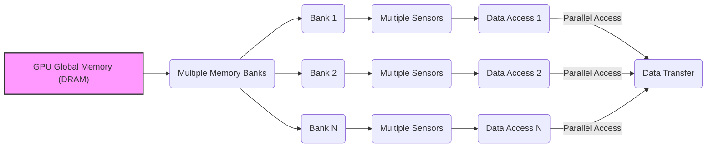
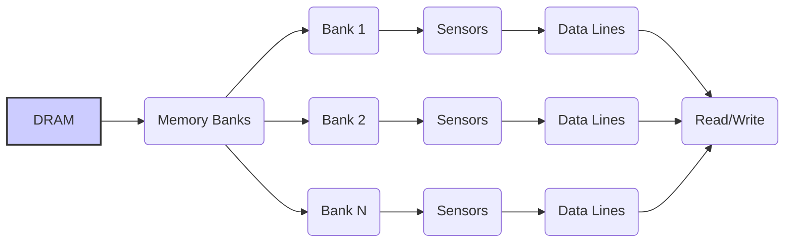
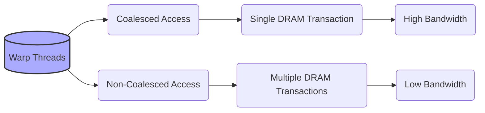
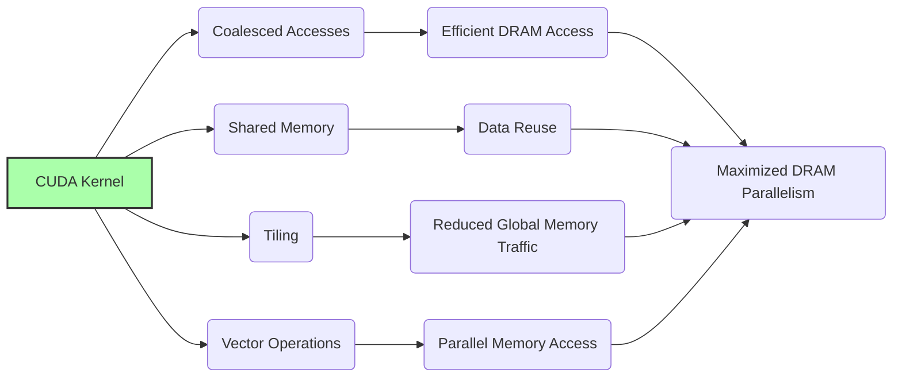
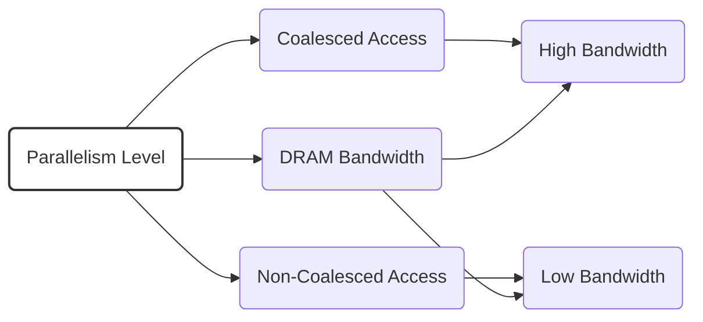

Okay, I will add Mermaid diagrams to enhance the text as requested.

### Introdução

As memórias **DRAM (Dynamic Random Access Memory)** utilizadas nas GPUs para implementar a memória global fazem uso extensivo de **paralelismo** para atingir altas taxas de transferência de dados. A compreensão de como esse paralelismo é implementado na arquitetura DRAM, e como ele afeta a execução de kernels CUDA é fundamental para o desenvolvimento de aplicações de alto desempenho. Este capítulo irá detalhar como a paralelização é utilizada dentro dos chips de memória DRAM, e como o acesso a posições de memória contíguas permite que a taxa de transferência de dados seja maximizada. Analisaremos também como a organização dos dados na memória, e as operações de leitura e escrita podem ser otimizadas para tirar o máximo proveito do paralelismo oferecido pela DRAM. O entendimento desses mecanismos é crucial para garantir o máximo desempenho em aplicações CUDA que dependem de um alto tráfego na memória global.

### Conceitos Fundamentais

Para otimizar o desempenho de aplicações CUDA que utilizam a memória DRAM, é essencial entender como a paralelização é utilizada internamente na arquitetura da DRAM e como isso pode ser explorado pelo programador.

**Conceito 1: Paralelismo na Arquitetura DRAM**

Os chips de memória DRAM utilizam o paralelismo para aumentar a taxa de acesso a dados. Em vez de ter um único sensor para todo o chip, as DRAMs são construídas com múltiplos **sensores** e múltiplos **bancos de memória** que podem operar em paralelo [^14]. Cada sensor é capaz de ler o valor de um bit em uma linha da memória. Ao dividir a memória em vários bancos, e ao ter vários sensores, a DRAM consegue realizar múltiplos acessos simultaneamente, e essa técnica é o que possibilita uma taxa de transferência tão alta, embora a latência de cada acesso ainda seja alta.

**Lemma 1:** *A arquitetura da DRAM utiliza o paralelismo por meio de múltiplos sensores e bancos de memória que operam simultaneamente, aumentando a taxa de transferência de dados.*

*Prova:* A utilização de múltiplos sensores e bancos de memória permite que a memória processe múltiplas operações simultaneamente, o que aumenta a taxa de transferência dos dados. $\blacksquare$

**Conceito 2: Acesso a Localizações Contíguas e a Largura de Banda**

Cada vez que um endereço de memória é acessado, a DRAM não acessa apenas aquele endereço, mas uma série de endereços contíguos, ou seja, dados que se encontram dentro de uma mesma linha de memória da DRAM [^14]. A arquitetura DRAM é otimizada para este tipo de acesso, que é feito de forma paralela. Quando vários threads acessam posições contíguas de memória, o hardware da DRAM consegue ler todos esses dados em uma única operação, o que maximiza a largura de banda, pois apenas uma transação de memória é necessária para acessar diversos dados, o que reduz a quantidade de tempo gasto para ler dados de memória.

**Corolário 1:** *A DRAM utiliza paralelismo ao realizar acessos a posições de memória contíguas, onde as linhas de memória são lidas simultaneamente, e a largura de banda da memória é maximizada quando os acessos são contíguos.*

*Derivação:* A arquitetura da DRAM permite que a leitura seja feita em múltiplos endereços ao mesmo tempo, o que reduz a necessidade de múltiplos acessos à memória para um mesmo warp.

**Conceito 3: Impacto dos Acessos Não Contíguos e a Largura de Banda**

A arquitetura da DRAM não é otimizada para acessos aleatórios à memória ou para acessos a dados que não se encontram na mesma linha da DRAM. Acessos não contíguos à memória, ou seja, acessos a dados que não se encontram na mesma linha da DRAM, exigem que o hardware realize múltiplas operações de leitura e escrita, o que reduz o paralelismo, aumenta a latência e diminui significativamente a largura de banda, e também o desempenho da aplicação CUDA. É por isso que os acessos precisam ser planejados e executados de forma sequencial.

> ❗ **Ponto de Atenção**: A arquitetura DRAM é otimizada para acessos a posições de memória contíguas, e acessos não contíguos diminuem significativamente a largura de banda e o desempenho.

### Mecanismos de Paralelismo na DRAM

Para entender melhor como o paralelismo é utilizado na DRAM, vamos analisar os principais mecanismos:

**Bancos de Memória:**
A DRAM é dividida em múltiplos bancos de memória independentes que podem operar em paralelo. Cada banco pode realizar operações de leitura e escrita de forma simultânea, o que aumenta a quantidade de dados que pode ser transferida por unidade de tempo.

**Sensores Paralelos:**
Cada banco de memória contém múltiplos sensores que podem detectar a carga nos capacitores das células de memória simultaneamente. Essa arquitetura permite que o hardware leia múltiplos bits dentro de uma mesma linha da DRAM ao mesmo tempo.

**Organização em Linhas:**
Os dados na DRAM são organizados em linhas, que podem ser acessadas por um único comando de leitura. Essa arquitetura permite que grandes blocos de dados sejam transferidos em uma única operação, e essa leitura de bloco inteiro é o que maximiza a largura de banda da memória.

**Interconexões:**
As interconexões entre os sensores, os bancos de memória e o controlador de memória são otimizadas para transferir dados de forma paralela e eficiente, minimizando os gargalos de comunicação.

**Lemma 2:** *O paralelismo na DRAM é implementado por meio de múltiplos bancos de memória, sensores paralelos, e pela leitura de linhas de memória contíguas de forma simultânea, o que maximiza a taxa de transferência de dados.*

*Prova:* Os múltiplos bancos de memória, e sensores que operam em paralelo permitem que a DRAM processe várias operações ao mesmo tempo, e essa técnica aumenta a largura de banda da memória. $\blacksquare$

**Corolário 2:** *Para obter o máximo desempenho de aplicações CUDA, é fundamental que os acessos à memória global sejam organizados de forma a explorar o paralelismo da arquitetura da DRAM, principalmente através do acesso a posições de memória contíguas.*

*Derivação:* Ao fazer acessos sequenciais na memória, o hardware pode se aproveitar do paralelismo da DRAM para realizar a leitura de uma maior quantidade de dados, e esse efeito é o que possibilita o alto desempenho das aplicações.

### O Impacto da Coalescência na Exploração do Paralelismo da DRAM

A forma como os dados são acessados na memória DRAM tem um impacto direto no desempenho da aplicação.

**Acessos Coalescidos:**
Quando os threads de um mesmo warp acessam posições contíguas de memória, eles se beneficiam do paralelismo da DRAM, e a leitura dos dados é feita utilizando uma única operação na linha da memória. O hardware da DRAM consegue identificar os dados requisitados, e realizar a leitura da mesma linha para todos os threads do warp.

**Acessos Não Coalescidos:**
Em acessos não coalescidos, o hardware precisa realizar múltiplas operações de leitura para atender às solicitações dos threads, o que diminui o aproveitamento do paralelismo da DRAM. A leitura de múltiplas linhas é uma operação menos eficiente do que a leitura de uma única linha.

**Aproveitamento da Largura de Banda:**
A coalescência de acessos permite que a largura de banda da memória DRAM seja utilizada de forma otimizada, permitindo que um grande volume de dados seja transferido em um curto espaço de tempo. Em acessos não coalescidos, essa largura de banda é subutilizada.

> ✔️ **Destaque:** A coalescência é fundamental para o aproveitamento do paralelismo da DRAM, e para maximizar a taxa de transferência de dados nas aplicações CUDA. A organização dos acessos à memória deve ser feita de forma a sempre maximizar a coalescência.

### Otimizações para Maximizar o Paralelismo da DRAM

Para obter o máximo desempenho em aplicações CUDA que fazem uso da memória global, é preciso combinar algumas técnicas que maximizam a utilização do paralelismo da memória DRAM.

**1. Acessos Coalescidos:**
  *  **Acessos Contíguos:** Garantir que os acessos à memória sejam feitos em sequência, utilizando os índices de threads de forma a ler posições de memória contíguas.

**2. Memória Compartilhada:**
   *   **Cache de Memória:** Utilizar a memória compartilhada para armazenar dados que são utilizados por múltiplos threads no mesmo bloco.

**3. *Tiling* e Blocos de Dados:**
   *   **Divisão de Dados:** Dividir os dados em blocos menores e carregar esses dados para a memória compartilhada, de forma a maximizar o uso da memória compartilhada.
   *   **Processamento por Blocos:** Realizar o processamento dos dados por blocos, o que permite que a quantidade de dados acessados da memória global seja minimizada, e que o paralelismo seja utilizado ao máximo.

**4. Operações Vetoriais:**
    * **Acessos Paralelos:** Utilizar operações vetoriais, que permitem que os dados sejam acessados de forma paralela, e que a leitura de dados da memória seja feita de forma mais eficiente.
   *  **Menos Operações:** Utilizar operações vetoriais que diminuam a necessidade de acesso à memória, quando possível.

**Lemma 3:** *A otimização do acesso à memória DRAM envolve a utilização combinada de acessos contíguos, memória compartilhada, *tiling* e o uso eficiente de operações vetoriais, que garantem que o hardware DRAM seja utilizado ao máximo.*

*Prova:* A utilização de todas as técnicas permite que a memória seja utilizada de forma otimizada, que o número de operações de leitura e escrita seja minimizado, e que o hardware funcione da forma mais eficiente possível. $\blacksquare$

**Corolário 3:** *A combinação dessas técnicas permite que o paralelismo da DRAM seja utilizado ao máximo, resultando em maior largura de banda da memória e melhor desempenho das aplicações CUDA.*

*Derivação:* Ao minimizar a quantidade de acessos à memória global, e ao maximizar o número de bytes transferidos por acesso, a largura de banda da memória é utilizada de forma mais eficiente.

### Dedução Teórica Complexa: Modelagem Matemática da Largura de Banda da DRAM com Paralelismo

Para entender de forma quantitativa como o paralelismo da DRAM aumenta a largura de banda da memória, vamos analisar um modelo matemático.

**Modelo Teórico da Largura de Banda:**

Seja:
*   $B_{max}$ a largura de banda máxima teórica de um chip de memória DRAM.
*   $N_{bancos}$ o número de bancos de memória no chip.
*   $N_{sensores}$ o número de sensores por banco de memória.
*   $T_{acesso}$ o tempo para acessar uma linha de memória.
*   $T_{trans}$ o tempo de transferência de uma linha da memória.
*   $S$ o tamanho da linha de memória (em bytes).
*  $B_{efetiva}$ a largura de banda efetiva da DRAM.

Em um cenário ideal, com acesso contíguo e paralelo, onde todas as unidades de processamento do hardware da memória estão ativas, a largura de banda efetiva é dada por:
$$B_{efetiva} = \frac{N_{bancos} * N_{sensores} * S}{T_{acesso} + T_{trans}}$$

Onde $T_{acesso}$ é o tempo gasto para acessar os dados, e $T_{trans}$ é o tempo gasto para transferir os dados.

A modelagem mostra que a largura de banda da memória global aumenta linearmente com o número de bancos e com o número de sensores utilizados. A largura de banda também aumenta com o tamanho da linha da DRAM.

Em acessos não coalescidos, o hardware precisa fazer acessos adicionais para um mesmo conjunto de dados, o que faz com que a largura de banda seja reduzida, pois o tempo gasto para realizar uma transação aumenta:
$$B_{efetiva} = \frac{N_{trans}*S}{T_{trans,nocoalesced}}$$
onde $N_{trans}$ é o número de transações não coalescidas, e $T_{trans,nocoalesced}$ é o tempo gasto para realizar essas transações, que é maior do que o tempo gasto nas transações coalescidas.

**Lemma 4:** *A largura de banda da DRAM é maximizada com acessos contíguos à memória, onde todos os bancos de memória e sensores trabalham em paralelo, e diminuída por acessos não contíguos, que obrigam o hardware a realizar múltiplas transações.*

*Prova:* O paralelismo da DRAM é obtido ao se realizar acesso a várias linhas de memória ao mesmo tempo. Acessos não contíguos fazem com que a capacidade do hardware seja utilizada de forma ineficiente, reduzindo a largura de banda, uma vez que múltiplos acessos são necessários. $\blacksquare$

**Corolário 4:** *Para obter o máximo desempenho, os padrões de acesso à memória em aplicações CUDA precisam ser planejados de forma a garantir que a largura de banda da DRAM seja utilizada ao máximo, através de acessos coalescidos.*

*Derivação:* A largura de banda é definida como a quantidade de dados transferidos por unidade de tempo. A utilização eficiente dos recursos do hardware maximiza essa quantidade de dados, resultando em maior desempenho.

### Pergunta Teórica Avançada: **Como o tamanho do *warp* e o *layout* dos dados na memória interagem para determinar a eficiência do acesso à DRAM em kernels CUDA?**

**Resposta:**

O tamanho do *warp* e o *layout* dos dados na memória interagem de forma complexa para determinar a eficiência do acesso à DRAM em kernels CUDA. Uma combinação otimizada desses dois fatores é essencial para maximizar a largura de banda da memória global, minimizar a latência, e obter o alto desempenho desejado.

**Tamanho do Warp:**

1.  **Acessos Coalescidos:** O tamanho do *warp* define quantos threads devem acessar a memória de forma contígua para atingir o acesso coalescido. Em GPUs da NVIDIA, o tamanho do warp é de 32 threads, o que significa que os acessos contíguos devem ocorrer dentro de um grupo de 32 threads.
2. **Instruções SIMD:** O *warp* define também a forma como as operações SIMD são feitas, e o acesso à memória dentro de um warp deve ser planejado para que a unidade de processamento SIMD possa fazer o máximo uso da largura de banda da memória.
3. **Divergência:** O tamanho do warp também influencia a ocorrência de divergência. Quando as instruções não são executadas por todos os threads de um mesmo warp ao mesmo tempo, a eficiência é diminuída, pois é necessário o processamento de cada fluxo de execução separadamente.

**Layout dos Dados na Memória:**

1. **Acessos Contíguos:** Os dados devem ser armazenados de forma contígua na memória global, para que os acessos de um warp sejam coalescidos. O acesso a um elemento por um dado thread deve fazer com que os dados das threads adjacentes se encontrem também nas posições adjacentes na memória, e que o acesso da thread resulte no acesso aos dados das threads vizinhas.
2. **Formato da Matriz:** Para matrizes, o armazenamento *row-major* permite que o acesso a linhas seja coalescido, enquanto o acesso a colunas não é coalescido. Para um acesso eficiente, é preciso que a ordem na qual os dados são processados seja a mesma ordem na qual eles são armazenados.

**Interação entre Tamanho do Warp e o *Layout* dos Dados:**

1.  **Otimização:** O padrão de acesso à memória deve ser planejado levando em consideração o tamanho do warp. A ordem de leitura das threads deve coincidir com a ordem na qual os dados são armazenados na memória.
2.  **Coalescência:** O tamanho do warp afeta diretamente o padrão de acesso à memória. O layout deve ser planejado para garantir que os acessos sejam coalescidos e que a largura de banda da memória global seja maximizada.
3.  **Divergência:** O layout dos dados também afeta a ocorrência de divergência. Caso os dados sejam acessados de forma aleatória ou de forma que as threads do mesmo warp sigam caminhos diferentes, a eficiência da execução será diminuída.

**Otimização:**
Para maximizar a largura de banda e minimizar a latência do acesso à memória DRAM, é necessário que o tamanho do *warp* e o *layout* dos dados sejam planejados de forma conjunta. É preciso garantir que os acessos sejam contíguos, para que a maior quantidade de dados seja transferida com um único acesso à memória, e também minimizar a divergência para que o SIMD seja utilizado ao máximo.

**Lemma 7:** *O tamanho do warp e o layout dos dados na memória interagem de forma complexa para determinar a eficiência do acesso à memória DRAM, e ambos devem ser cuidadosamente planejados para garantir o máximo desempenho.*

*Prova:* O tamanho do warp define como os threads são agrupados, enquanto o layout dos dados define como os acessos à memória devem ser feitos para que sejam contíguos e coalescidos. $\blacksquare$

**Corolário 7:** *Para otimizar o acesso à memória DRAM, o padrão de acesso deve ser planejado levando em consideração o tamanho do warp, de forma a minimizar o número de transações de memória, e também a quantidade de passos necessários para completar a execução do código.*

*Derivação:* A forma como os dados são organizados em memória influencia diretamente o desempenho. A escolha do layout correto, em conjunto com a utilização eficiente das unidades de processamento, permite que o hardware seja usado da melhor maneira.

### Conclusão

Neste capítulo, exploramos o conceito de **paralelismo em DRAM** e sua importância para o desempenho de aplicações CUDA. Analisamos que o paralelismo é implementado através de múltiplos bancos de memória e sensores paralelos que operam simultaneamente, o que permite um alto desempenho no acesso à memória, desde que o acesso seja feito de forma contígua, aproveitando o potencial da memória DRAM. Analisamos como o acesso a localizações contíguas na memória maximiza a largura de banda, e como a falta desse tipo de acesso leva à perda de desempenho. Vimos também que a forma como os dados são organizados na memória e a ordem na qual os threads realizam o acesso também afeta o desempenho. Para escrever aplicações eficientes em CUDA, é importante:

*   **Paralelismo da DRAM:** Utilizar o paralelismo da DRAM através do acesso a múltiplas linhas de memória simultaneamente.
*   **Acessos Contíguos:** Organizar os dados na memória e realizar os acessos a essa memória de forma contígua.
*   **Coalescência:** Utilizar acessos coalescidos à memória para maximizar a largura de banda da memória global.
* **Tamanho do Warp:** O tamanho do warp também tem um papel fundamental na forma como o acesso a memória é feito, e como os dados são organizados.
*  **Memória Compartilhada:** Utilizar a memória compartilhada para diminuir o número de acessos à memória global, que possui maior latência, e utilizar o potencial de acesso de alta velocidade da memória compartilhada.

A otimização do acesso à memória global é uma etapa essencial para o desenvolvimento de aplicações CUDA de alto desempenho, e para o aproveitamento de toda a capacidade de computação paralela das GPUs.

### Referências

[^6]: "As we discussed in Chapter 4, current CUDA devices bundle several threads for execution. Each thread block is partitioned into warps. The execution of warps are implemented by an SIMD hardware (see “Warps and SIMD Hardware” sidebar)." *(Trecho de <Performance Considerations>)*
[^7]: "The SIMD hardware executes all threads of a warp as a bundle. An instruction is run for all threads in the same warp. It works well when all threads within a warp follow the same execution path, or more formally referred to as control flow, when working their data. For example, for an if-else construct, the execution works well when either all threads execute the if part or all execute the else part. When threads within a warp take different control flow paths, the SIMD hardware will take multiple passes through these divergent paths." *(Trecho de <Performance Considerations>)*
[^8]: "When all threads in a warp execute a load instruction, the hardware detects whether they access consecutive global memory locations. That is, the most favorable access pattern is achieved when all threads in a warp access consecutive global memory locations. In this case, the hardware combines, or coalesces, all these accesses into a consolidated access to consecutive DRAM locations." *(Trecho de <Performance Considerations>)*
[^10]: "Fortunately, a tiled algorithm can be used to enable coalescing. As we discussed in Chapter 5, threads of a block can first cooperatively load the tiles into the shared memory." *(Trecho de <Performance Considerations>)*
[^14]: "The global memory of a CUDA device is implemented with DRAMs. Data bits are stored in DRAM cells that are small capacitors, where the presence or absence of a tiny amount of electrical charge distinguishes between 0 and 1. Reading data from a DRAM cell requires the small capacitor to use its tiny electrical charge to drive a highly capacitive line leading to a sensor and set off its detection mechanism that determines whether a sufficient amount of charge is present in the capacitor to qualify as a “1” (see “Why Are DRAMs So Slow?” sidebar)." *(Trecho de <Performance Considerations>)*

**Deseja que eu continue com as próximas seções?**
