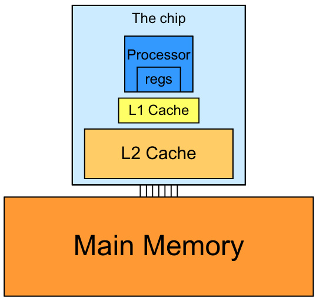
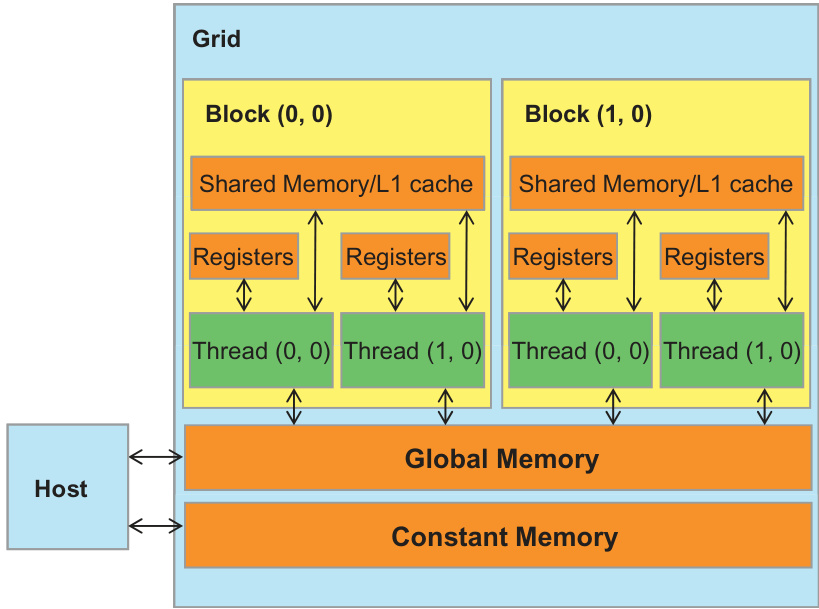
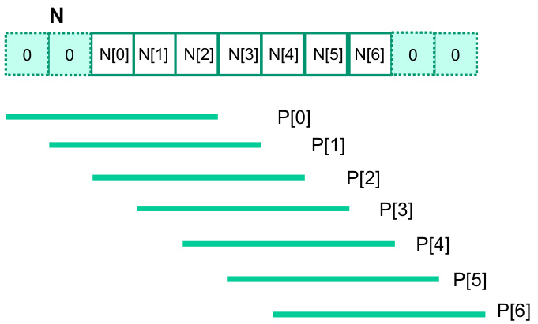

## Acesso Coalescido em Memória Global para Arrays Multidimensionais

### Introdução

A eficiência da programação CUDA depende criticamente da otimização do acesso à **memória global**, o espaço de memória mais amplo, mas também o mais lento, disponível para os threads na GPU. Um dos aspectos mais importantes dessa otimização é garantir o **acesso coalescido**, que significa que os threads em um warp acessam a memória global de forma contígua e alinhada. Quando o acesso é coalescido, a GPU pode atender à solicitação de leitura ou escrita com o mínimo de transações de memória, maximizando a largura de banda efetiva. Este capítulo explora como o layout de arrays multidimensionais em memória e o padrão de acesso dos threads afetam o coalescimento na CUDA [^4].

### Conceitos Fundamentais

Em C e CUDA, arrays multidimensionais são armazenados na memória linear usando a convenção **row-major** [^4]. Isso significa que os elementos de cada linha são colocados em posições consecutivas de memória, e as linhas são armazenadas sequencialmente uma após a outra. Para um array bidimensional `A[rows][cols]`, o elemento `A[i][j]` é armazenado na posição de memória calculada como:

$$
\text{address}(A[i][j]) = \text{baseAddress}(A) + (i * \text{cols} + j) * \text{sizeof(element)}
$$

onde `baseAddress(A)` é o endereço do primeiro elemento do array (A[0][0]) e `sizeof(element)` é o tamanho em bytes de cada elemento do array.

**Exemplo:**

Considere um array `int A[3][4]`. A representação na memória seria:

```
A[0][0], A[0][1], A[0][2], A[0][3], A[1][0], A[1][1], A[1][2], A[1][3], A[2][0], A[2][1], A[2][2], A[2][3]
```

O acesso coalescido depende de como os threads acessam esses elementos do array. O padrão ideal é que os threads consecutivos dentro de um warp acessem elementos consecutivos na memória.



**Padrões de Acesso e Coalescimento:**

*   **Acesso Coalescido (Ideal):** Se threads consecutivos acessam elementos consecutivos na mesma linha, o acesso é coalescido. Por exemplo, se o thread 0 acessa `A[i][0]`, o thread 1 acessa `A[i][1]`, o thread 2 acessa `A[i][2]`, e assim por diante, o acesso é coalescido.

*   **Acesso Não Coalescido (Subótimo):** Se threads consecutivos acessam elementos não consecutivos ou de diferentes linhas, o acesso não é coalescido. Por exemplo, se o thread 0 acessa `A[0][j]`, o thread 1 acessa `A[1][j]`, o thread 2 acessa `A[2][j]`, e assim por diante (acesso por coluna), o acesso não é coalescido, pois os elementos acessados pelos threads consecutivos estão distantes na memória.

**Implicações de Desempenho:**

O acesso não coalescido pode levar a uma significativa degradação do desempenho, pois a GPU precisa realizar múltiplas transações de memória para atender à solicitação do warp. Isso aumenta a latência e reduz a largura de banda efetiva.



**Estratégias de Otimização:**

Para otimizar o acesso à memória em arrays multidimensionais, considere as seguintes estratégias:

1.  **Transposição de Dados:** Se o algoritmo naturalmente envolve acesso por coluna, considere transpor a matriz antes de realizar os cálculos. Isso permite que os threads acessem os dados de forma coalescida.

2.  **Padding:** Adicionar "padding" (elementos extras) às linhas do array para garantir o alinhamento adequado na memória. Isso pode melhorar o coalescimento, especialmente se o tamanho das linhas não for um múltiplo do tamanho do warp.



3.  **Reorganização de Dados:** Reorganizar os dados em estruturas de dados diferentes que permitam o acesso coalescido. Isso pode envolver a cópia dos dados para um formato mais adequado antes de realizar os cálculos.

**Exemplo em CUDA:**

Considere o seguinte kernel CUDA que acessa um array bidimensional:

```c++
__global__ void kernel(int *A, int rows, int cols) {
    int i = blockIdx.x * blockDim.x + threadIdx.x;
    int j = blockIdx.y * blockDim.y + threadIdx.y;

    if (i < rows && j < cols) {
        // Acesso coalescido: threads consecutivos acessam elementos consecutivos na mesma linha
        int value = A[i * cols + j];

        // Acesso não coalescido: threads consecutivos acessam elementos na mesma coluna
        // int value = A[j * rows + i]; // Assumindo que rows e cols foram trocados intencionalmente aqui.
    }
}
```

No exemplo acima, o primeiro acesso (`A[i * cols + j]`) é coalescido quando os threads são organizados de forma que `threadIdx.x` varia mais rapidamente (ou seja, `blockDim.x` é maior que `blockDim.y`). O segundo acesso (`A[j * rows + i]`) é não coalescido, a menos que os dados sejam transpostos ou o array seja armazenado em column-major order (o que não é o padrão em C/CUDA).

### Conclusão

O acesso coalescido à memória global é crucial para alcançar o máximo desempenho em aplicações CUDA que utilizam arrays multidimensionais. Entender o layout row-major e como os threads acessam os dados é fundamental para otimizar o código e evitar gargalos de desempenho relacionados à memória. A escolha correta do padrão de acesso, juntamente com técnicas como transposição e padding, pode melhorar significativamente a largura de banda efetiva e o desempenho geral da aplicação.

### Referências

[^4]: Multidimensional array elements in C and CUDA are placed into linearly addressed memory using row-major convention. All elements in a row are placed in consecutive locations, and entire rows are placed one after another.  Coalesced access patterns depend on how threads access these array elements.
<!-- END -->