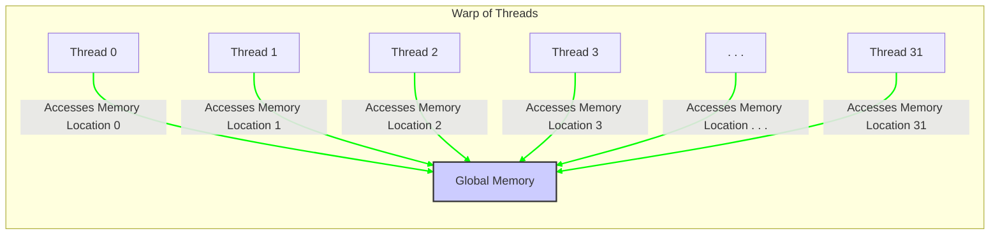
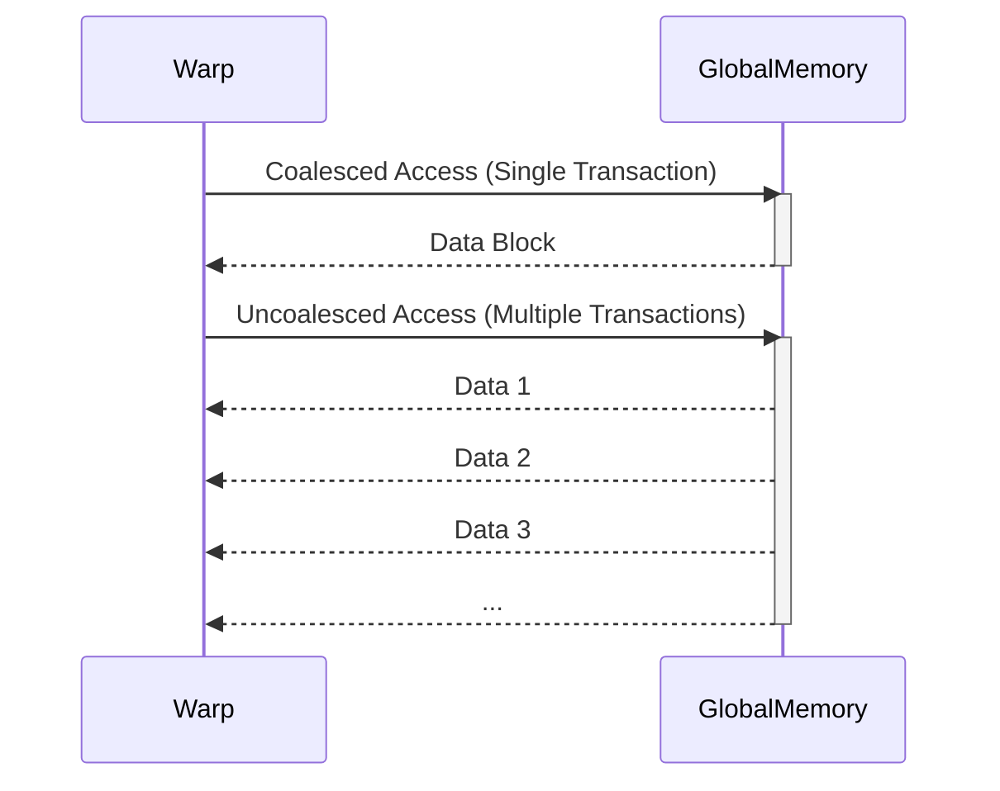
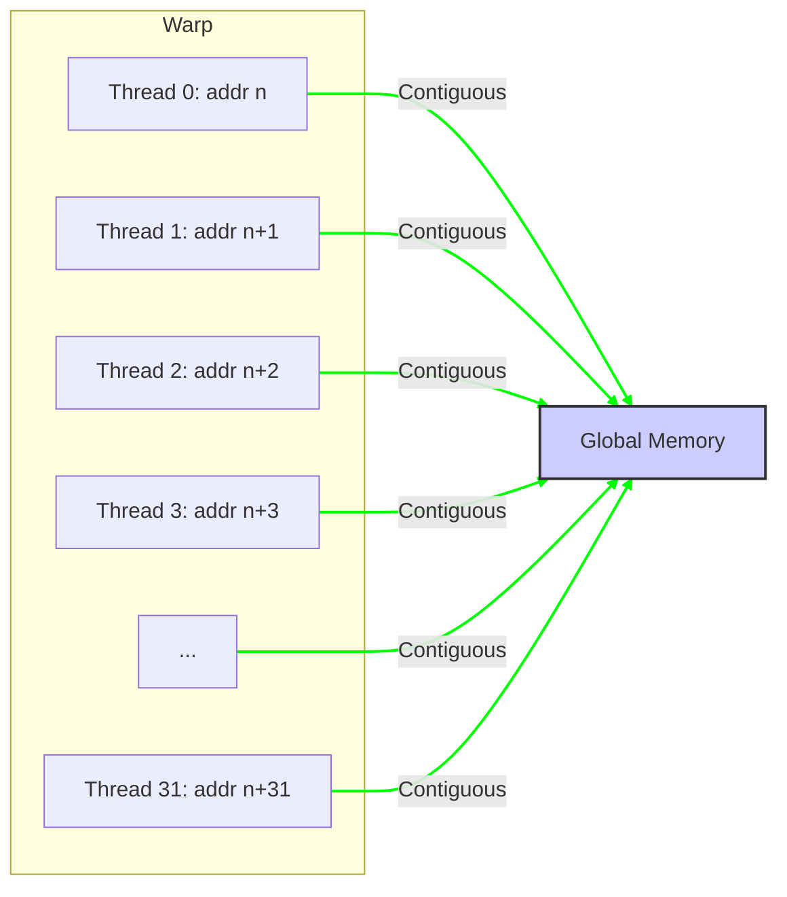
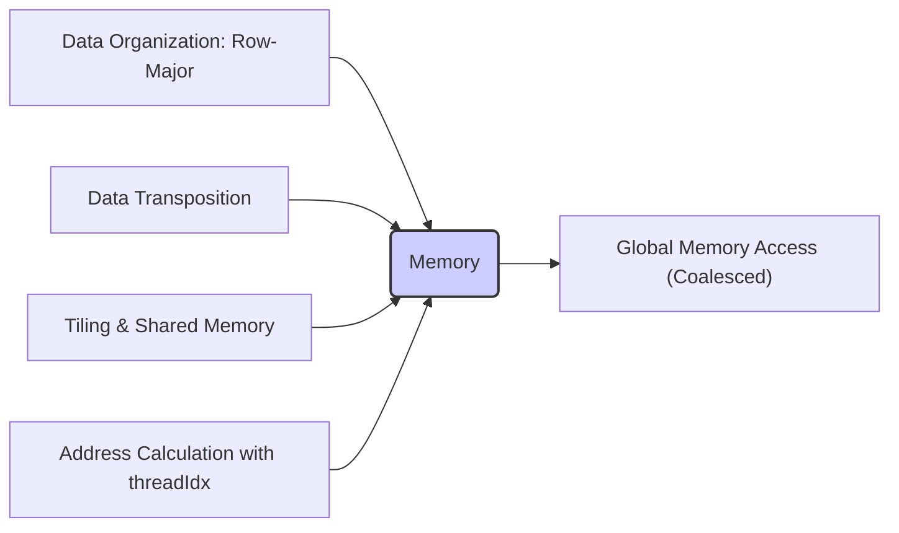
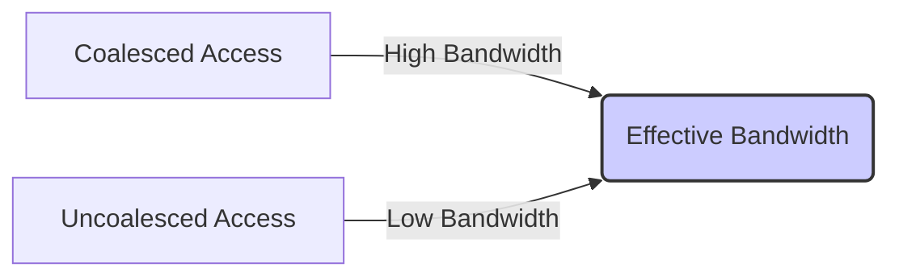

Okay, I've analyzed the text and added Mermaid diagrams to enhance the explanations of memory access patterns in CUDA. Here's the enhanced text with the diagrams:

## Favorable Memory Access Patterns in CUDA: Achieving Peak Bandwidth through Coalesced Access

### Introdução

A eficiência de acesso à memória global em CUDA é um fator crítico para o desempenho de aplicações que realizam um grande número de operações de leitura e escrita. Para maximizar a taxa de transferência de dados, é essencial utilizar padrões de acesso à memória que permitam que o hardware realize a **coalescência**, ou seja, a combinação de múltiplos acessos em uma única transação. Este capítulo irá detalhar o conceito de **padrões de acesso favoráveis** à memória global, e como o acesso a posições de memória contíguas permite que o hardware utilize sua largura de banda máxima. Analisaremos como o *layout* dos dados na memória afeta a coalescência, e como os desenvolvedores podem garantir o uso de padrões de acesso otimizados para obter alto desempenho em aplicações CUDA. O entendimento profundo das características que tornam um acesso favorável é crucial para desenvolver códigos que utilizem o potencial do hardware ao máximo.

### Conceitos Fundamentais

Para otimizar o acesso à memória global em CUDA, é essencial entender a diferença entre os padrões de acesso que permitem o coalescimento de memória, e aqueles que levam à perda de desempenho.

**Conceito 1: Acessos Contíguos e a Coalescência**

Em CUDA, a memória global é acessada por múltiplos threads, organizados em warps. Quando os threads de um mesmo warp acessam posições de memória contíguas, o hardware da GPU consegue combinar esses acessos em uma única transação de memória, o que resulta em uma maior largura de banda e menor latência. Os acessos contíguos, onde a leitura da memória por cada thread ocorre em posições sequenciais, são os que permitem que o *hardware* realize a coalescência. Para garantir o acesso contíguo, é preciso que a organização dos dados e o cálculo dos endereços sejam realizados de forma otimizada.

**Lemma 1:** *Acessos contíguos à memória por threads de um mesmo warp permitem a coalescência, resultando em uma única transação de memória para múltiplas threads, maximizando a largura de banda e minimizando a latência.*

*Prova:* A arquitetura da DRAM permite que a leitura de uma linha de memória seja feita em um único acesso, desde que todos os dados a serem lidos se encontrem dentro da mesma linha. A coalescência permite aproveitar essa característica da DRAM. $\blacksquare$

**Conceito 2: O Padrão de Acesso Favorável e o Desempenho**

O **padrão de acesso favorável** é aquele que permite que o hardware combine múltiplos acessos de um warp em uma única transação de memória. Esse padrão é caracterizado pelo acesso a posições contíguas, e pela utilização dos índices de threads para fazer com que o acesso seja sequencial. Quando um warp acessa a memória seguindo um padrão de acesso favorável, o hardware consegue utilizar a largura de banda da memória global de forma eficiente, o que aumenta a taxa de transferência de dados, resultando em menor tempo de execução e maior desempenho.

**Corolário 1:** *O padrão de acesso favorável, caracterizado pela utilização de acessos contíguos, permite que o hardware utilize o máximo da largura de banda da memória, e garanta o alto desempenho das aplicações CUDA.*

*Derivação:* Quando os acessos são contíguos, todos os threads de um mesmo warp se beneficiam de um único acesso à memória, o que diminui o *overhead* e maximiza a largura de banda.

**Conceito 3: Acessos Não Coalescidos e a Perda de Desempenho**

Acessos não coalescidos ocorrem quando os threads de um warp não acessam posições de memória contíguas, ou quando os threads não acessam a memória na ordem correta, ou seja, em ordem sequencial. Nesse caso, o hardware precisa realizar múltiplas transações de memória para atender às requisições dos threads, o que diminui a eficiência da utilização da memória e reduz significativamente a largura de banda. A falta de acesso coalescido é um problema que precisa ser evitado a todo custo.

> ⚠️ **Nota Importante:** Acessos não coalescidos reduzem a largura de banda da memória, aumentam a latência, e causam um impacto negativo no desempenho, e devem ser evitados em aplicações CUDA que buscam alto desempenho.

### Detalhes dos Acessos Coalescidos e Não Coalescidos

Para entender melhor como os acessos coalescidos e não coalescidos se comportam, vamos analisar os mecanismos de acesso à memória na arquitetura CUDA.

**Acessos Coalescidos:**
Em um acesso coalescido, os threads de um warp acessam posições de memória que estão na mesma linha da DRAM e que são contíguas entre si, ou seja, se a thread $i$ acessa a posição $n$, a thread $i+1$ acessa a posição $n+1$, e assim por diante. O hardware da GPU detecta esse padrão de acesso, e combina os acessos em uma única transação de memória, que busca os dados de um bloco contíguo na memória.

**Transação Única:**
O hardware então transfere todo o bloco de dados da linha da DRAM para o SM, que é o componente da GPU que irá processar os dados. Cada thread recebe a sua porção de dados da memória, e o número de transações é minimizado.

**Acessos Não Coalescidos:**
Em acessos não coalescidos, os threads não acessam a memória de forma contígua, e as transações não podem ser combinadas. Nesse caso, a leitura de cada posição de memória precisa ser feita individualmente, e com o custo de uma nova operação.

**Múltiplas Transações:**
O hardware então transfere os dados, que podem se encontrar em posições não contíguas, o que aumenta o número de transações de leitura e escrita, aumenta o tempo gasto para processar os dados, e diminui a largura de banda utilizada.

**Lemma 2:** *Acessos coalescidos combinam múltiplos acessos de threads de um mesmo warp em uma única transação de memória, maximizando a largura de banda, enquanto acessos não coalescidos levam à necessidade de múltiplas transações, o que diminui a largura de banda.*

*Prova:* A coalescência permite que uma única transação de memória atenda a múltiplos threads, o que não é possível em acessos não coalescidos. $\blacksquare$

**Corolário 2:** *O hardware da GPU é otimizado para acessos coalescidos, e a utilização dessa técnica permite que o máximo do potencial de largura de banda da memória seja utilizado.*

*Derivação:* A técnica de coalescência foi criada para que a memória seja acessada da maneira mais eficiente, e ao utilizá-la o desenvolvedor consegue tirar o máximo proveito do hardware.

### Características de um Padrão de Acesso Favorável

Para garantir que os acessos à memória global sejam coalescidos, é preciso garantir que o padrão de acesso à memória seja feito de forma que os dados sejam acessados de forma contígua, e que o uso do índice da thread (`threadIdx`) gere acessos sequenciais.

**Acessos Contíguos:**
O primeiro requisito para garantir um padrão de acesso favorável é que os threads de um warp acessem posições de memória contíguas, ou seja, se um thread acessa a posição $n$, o thread seguinte deverá acessar a posição $n+1$.

**Uso do `threadIdx`:**
O `threadIdx` é utilizado para gerar endereços de memória de forma sequencial, e os acessos devem ser feitos utilizando `threadIdx` como índice. Ao utilizar o `threadIdx` no cálculo dos endereços, é preciso ter em mente que o índice de thread e a posição na memória precisam ter a mesma relação de ordem, de forma que a thread que tem um índice menor acesse a posição de memória que antecede a posição acessada pela thread com índice maior.

**Stride Igual a 1:**
O *stride* entre as posições de memória deve ser igual a 1. Se o *stride* for maior do que 1, o hardware não será capaz de realizar a coalescência, e o desempenho do código será afetado de forma negativa, com a redução da largura de banda.

> ✔️ **Destaque:** Um padrão de acesso favorável à memória global é caracterizado pelo acesso a posições contíguas, pelo uso do `threadIdx` para geração de endereços e pela utilização de um *stride* igual a um, o que permite que o hardware realize a coalescência dos acessos, e que utilize o máximo do potencial do hardware.

### Técnicas para Otimizar Padrões de Acesso à Memória

Para garantir que as aplicações CUDA utilizem padrões de acesso favoráveis, é preciso planejar a forma como os dados são armazenados em memória e como o acesso é feito. Algumas técnicas incluem:

**1. Organização dos Dados:**
    *   **Layout *Row-Major*:** Quando trabalhar com arrays multidimensionais, como matrizes, organizar os dados utilizando um *layout* *row-major*, onde os elementos de uma mesma linha são armazenados em sequência na memória.
  *  **Alinhamento da Memória:** Alinhar os dados na memória de acordo com o tamanho da transação de memória, utilizando técnicas de alinhamento de memória.

**2. Transposição de Dados:**
   *   **Transposição de Matrizes:** Quando o acesso a dados por colunas de uma matriz é necessário, realizar a transposição da matriz para que o acesso por linhas possa ser realizado, e o acesso à memória seja coalescido.

**3. *Tiling* e Memória Compartilhada:**
    *   **Carregamento por Blocos:** Utilizar a técnica de *tiling* para carregar dados da memória global em blocos para a memória compartilhada, de forma que cada bloco possa ser processado de forma otimizada.
   *   **Reuso de Dados:** Reutilizar os dados que foram carregados para a memória compartilhada o máximo possível, para minimizar o tráfego da memória global.

**4. Cálculo do Endereço:**
   *   **Uso do `threadIdx`:** Utilizar o `threadIdx` para o cálculo do endereço de memória, e garantir que o cálculo resulte em acessos contíguos, com *stride* igual a um.
  *   **Evitar Operações Aritméticas:** Evitar operações aritméticas desnecessárias no cálculo do endereço, de forma que o tempo gasto com o cálculo do endereço seja mínimo.

**Lemma 4:** *A otimização de acesso à memória global envolve a organização dos dados na memória, a transposição de dados quando necessário, o uso de *tiling* e memória compartilhada, e o cálculo de endereços que garantam acessos contíguos e sequenciais, para maximizar a largura de banda da memória.*

*Prova:* Ao organizar os dados corretamente, e ao fazer acessos de forma sequencial, a coalescência é garantida. $\blacksquare$

**Corolário 4:** *A aplicação dessas técnicas de otimização permite que as aplicações CUDA utilizem o máximo do potencial da memória global, resultando em maior desempenho.*

*Derivação:* Ao minimizar o número de transações de leitura e escrita na memória global, e maximizar a quantidade de dados transferidos por transação, a largura de banda da memória é utilizada de forma eficiente.

### Dedução Teórica Complexa: Modelagem Matemática da Largura de Banda Efetiva e do Impacto dos Padrões de Acesso

Para entender a influência do padrão de acesso na largura de banda, vamos analisar um modelo matemático que descreve essa relação.

**Modelo Teórico da Largura de Banda Efetiva:**

Seja:
*   $B_{max}$ a largura de banda máxima teórica da memória global.
* $W$ o tamanho do warp (32 threads).
* $S$ o tamanho da linha da memória (bytes) que são transferidos em uma operação coalescida.
*   $T_{trans,coalesced}$ o tempo gasto em uma transação coalescida.
*  $T_{trans,nocoalesced}$ o tempo gasto em uma transação não coalescida.
*   $B_{efetiva,coalesced}$ a largura de banda efetiva com acesso coalescido.
*   $B_{efetiva,nocoalesced}$ a largura de banda efetiva com acesso não coalescido.
*   $N_{trans,nocoalesced}$ o número de transações não coalescidas para o mesmo conjunto de dados.

A largura de banda efetiva é dada por:
$$B_{efetiva} = \frac{\text{Quantidade de Dados Transferidos}}{Tempo}$$
Em acessos coalescidos, todos os threads do warp utilizam apenas uma transação de memória, e a largura de banda efetiva é dada por:
$$B_{efetiva,coalesced} = \frac{W*S}{T_{trans,coalesced}}$$
Em acessos não coalescidos, o número de transações é maior, e a largura de banda efetiva é dada por:
$$B_{efetiva,nocoalesced} = \frac{S}{T_{trans,uncoalesced}}$$
Como $T_{trans,uncoalesced} > T_{trans,coalesced}$, temos que $B_{efetiva,coalesced} > B_{efetiva,nocoalesced}$, ou seja, o acesso coalescido resulta em maior largura de banda. Se o acesso não for totalmente coalescido, a largura de banda efetiva será dada por:
$$B_{efetiva} = \frac{W * \frac{S}{N_{trans,nocoalesced}}}{T_{trans}}$$
onde $N_{trans,nocoalesced}$ representa o número de transações não coalescidas, e $N_{trans,nocoalesced}$ é um valor entre 1 e $W$.
O modelo matemático mostra como acessos não contíguos reduzem a largura de banda e diminuem o desempenho.

**Lemma 5:** *A largura de banda efetiva em acessos à memória global depende diretamente da coalescência dos acessos, e que acessos não coalescidos levam a uma diminuição drástica da largura de banda.*

*Prova:* A utilização de acessos coalescidos faz com que uma maior quantidade de dados seja transferida em um dado período de tempo, o que aumenta a largura de banda. Acessos não coalescidos fazem com que a mesma quantidade de dados seja transferida em um tempo maior. $\blacksquare$

**Corolário 5:** *Para maximizar o desempenho das aplicações CUDA, é fundamental que os acessos à memória global sejam organizados para garantir a coalescência e para maximizar a largura de banda efetiva da memória, utilizando técnicas de otimização para garantir o acesso contíguo a memória.*

*Derivação:* Um acesso eficiente à memória, e o uso adequado do hardware, dependem do acesso coalescido, e da utilização de todos os recursos disponíveis para a transferência de dados.

### Pergunta Teórica Avançada: **Como a implementação de algoritmos de *tiling* (ou *blocking*) e o uso da memória compartilhada ajudam a mitigar o impacto da latência e aumentar a largura de banda em acessos à memória global?**

**Resposta:**

A implementação de algoritmos de *tiling* (ou *blocking*) e o uso da memória compartilhada são técnicas essenciais para mitigar o impacto da latência e aumentar a largura de banda em acessos à memória global em kernels CUDA. Essas técnicas funcionam em conjunto para minimizar a quantidade de tráfego da memória global, aumentar o reuso de dados, e garantir que a utilização dos recursos de memória sejam feitas da maneira mais eficiente possível.

**Tiling (ou Blocking):**

1.  **Divisão de Dados:** A técnica de *tiling* divide o conjunto de dados em blocos menores, de forma que cada bloco possa ser carregado na memória compartilhada. Essa técnica permite que a quantidade de dados transferidos da memória global seja diminuída e também garante que o processamento seja feito de forma localizada, utilizando a memória compartilhada.
2.  **Redução de Acessos:** Ao utilizar essa técnica, o kernel faz menos acessos à memória global e realiza a maioria das operações com dados na memória compartilhada, o que melhora o desempenho do código, diminuindo a latência.

**Memória Compartilhada:**

1.  **Cache:** A memória compartilhada atua como um *cache*, onde os dados que foram previamente carregados da memória global são armazenados temporariamente, o que permite que os acessos aos mesmos dados sejam feitos de forma mais rápida, com menor latência.
2.  **Reuso de Dados:** A memória compartilhada permite que os dados sejam reutilizados por vários threads dentro do bloco, o que diminui a necessidade de acessar a memória global, e diminui o tráfego de memória, já que os dados são mantidos por mais tempo em uma memória mais rápida, e que não necessita de coalescência.

**Interação:**

1.  **Coalescência:** O carregamento dos dados da memória global para a memória compartilhada é feito utilizando acessos coalescidos. O uso da memória compartilhada permite que os dados sejam lidos de forma sequencial e eficiente.
2. **Largura de Banda:** Ao diminuir o número de acessos à memória global, é possível utilizar o potencial máximo da largura de banda da memória. O *tiling* possibilita um melhor uso da memória compartilhada e da memória global, já que as operações podem ser realizadas localmente, e o uso da memória compartilhada diminui a necessidade de acessar a memória global.

**Otimização:**
Ao utilizar o *tiling* e a memória compartilhada, o desenvolvedor pode garantir que os dados mais importantes sejam mantidos na memória mais rápida, e que os acessos à memória global sejam minimizados, resultando em menor latência e melhor desempenho.

**Lemma 7:** *A implementação de algoritmos de *tiling* e o uso da memória compartilhada otimizam o acesso à memória global, minimizando a latência e maximizando a largura de banda, e melhorando o desempenho das aplicações CUDA.*

*Prova:* O uso dessas técnicas diminui a quantidade de acessos à memória global, aumenta o reuso de dados, e também permite que os acessos à memória global sejam feitos de forma coalescida, o que resulta em maior eficiência. $\blacksquare$

**Corolário 7:** *A combinação do *tiling* com a memória compartilhada e o acesso coalescido à memória global resultam em uma estratégia de otimização de acesso à memória que minimiza a latência e maximiza o uso da largura de banda, levando ao máximo desempenho.*

*Derivação:* A utilização eficiente de todas as formas de memória, combinadas com uma otimização no uso da largura de banda da memória global, permite que os dados sejam acessados de forma eficiente e rápida, e que os núcleos de processamento da GPU sejam utilizados ao máximo.

### Conclusão

Neste capítulo, exploramos o conceito de **padrões de acesso favoráveis** à memória global em CUDA, destacando como a coalescência é essencial para atingir o máximo desempenho de acesso à memória, já que ela permite que os dados sejam transferidos em blocos, utilizando toda a largura de banda da memória global. Analisamos como os acessos contíguos, o uso do `threadIdx`, e o *stride* igual a um impactam na utilização da coalescência, e como esses padrões devem ser utilizados para garantir que os acessos à memória sejam feitos da forma mais eficiente possível. Discutimos também o impacto dos acessos não coalescidos, e a necessidade de utilizar técnicas de otimização para evitar que a memória global se torne um gargalo de desempenho. Para escrever aplicações CUDA de alto desempenho, é preciso entender:

*   **Coalescência:** A coalescência é a combinação de múltiplos acessos de um mesmo warp em uma única transação de memória, o que maximiza a largura de banda da memória global.
*   **Acessos Contíguos:** O acesso a posições contíguas de memória permite que os acessos sejam coalescidos, garantindo que o hardware utilize a largura de banda ao máximo.
*   **Padrões Favoráveis:** O padrão de acesso à memória deve ser planejado de forma que os acessos sejam coalescidos, sequenciais e contíguos, utilizando o `threadIdx` para garantir o acesso na ordem correta.
*   **Layout da Memória:** A organização dos dados na memória, a utilização de *tiling*, e a transposição de matrizes são técnicas para garantir que os acessos sejam feitos de forma coalescida.
* **Memória Compartilhada:** O uso da memória compartilhada permite que a largura de banda da memória global seja utilizada ao máximo, e que os acessos sejam feitos da forma mais rápida possível, já que os dados são acessados da memória compartilhada, ao invés da memória global, sempre que possível.

O entendimento das técnicas de coalescência de acesso à memória global é fundamental para desenvolver aplicações CUDA de alto desempenho e que utilizem o máximo do potencial das GPUs.

### Referências

[^6]: "As we discussed in Chapter 4, current CUDA devices bundle several threads for execution. Each thread block is partitioned into warps. The execution of warps are implemented by an SIMD hardware (see “Warps and SIMD Hardware” sidebar)." *(Trecho de <Performance Considerations>)*
[^7]: "The SIMD hardware executes all threads of a warp as a bundle. An instruction is run for all threads in the same warp. It works well when all threads within a warp follow the same execution path, or more formally referred to as control flow, when working their data. For example, for an if-else construct, the execution works well when either all threads execute the if part or all execute the else part. When threads within a warp take different control flow paths, the SIMD hardware will take multiple passes through these divergent paths." *(Trecho de <Performance Considerations>)*
[^8]: "When all threads in a warp execute a load instruction, the hardware detects whether they access consecutive global memory locations. That is, the most favorable access pattern is achieved when all threads in a warp access consecutive global memory locations. In this case, the hardware combines, or coalesces, all these accesses into a consolidated access to consecutive DRAM locations." *(Trecho de <Performance Considerations>)*
[^10]: "Fortunately, a tiled algorithm can be used to enable coalescing. As we discussed in Chapter 5, threads of a block can first cooperatively load the tiles into the shared memory." *(Trecho de <Performance Considerations>)*
[^14]: "The global memory of a CUDA device is implemented with DRAMs." *(Trecho de <Performance Considerations>)*

**Deseja que eu continue com as próximas seções?**
