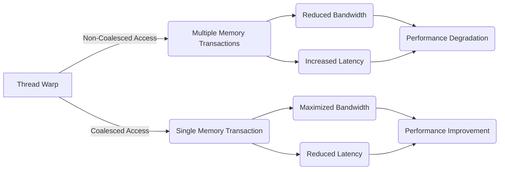
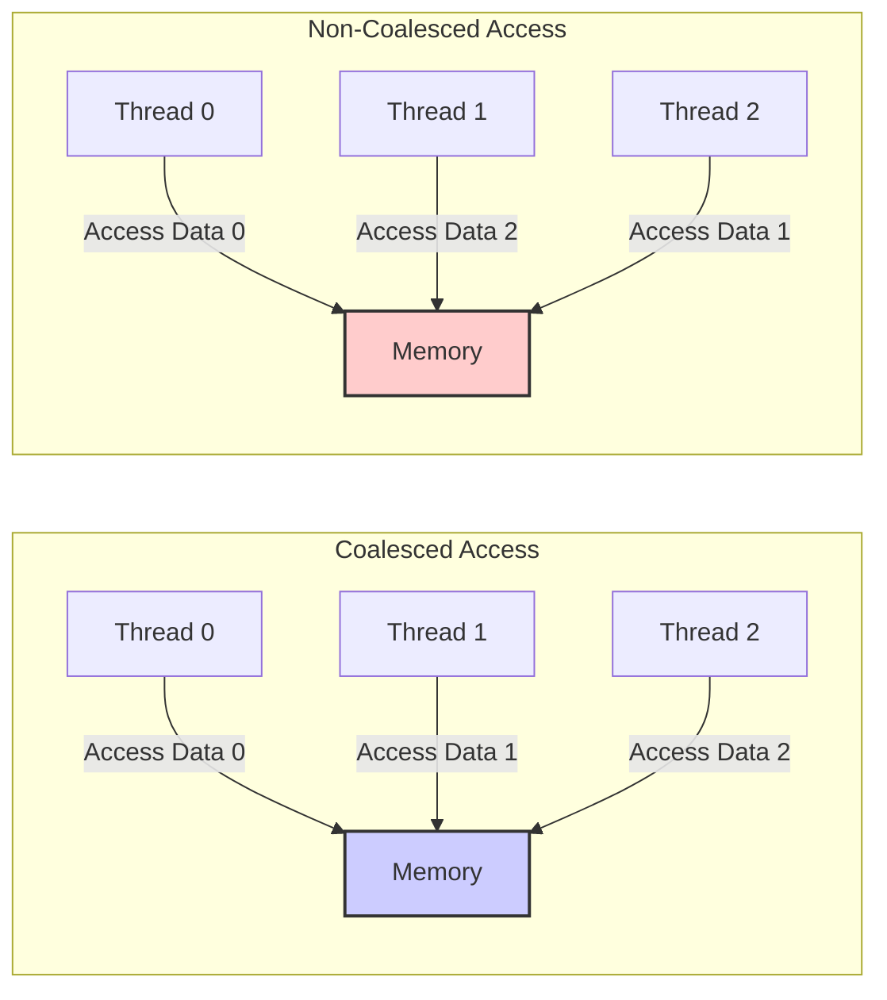
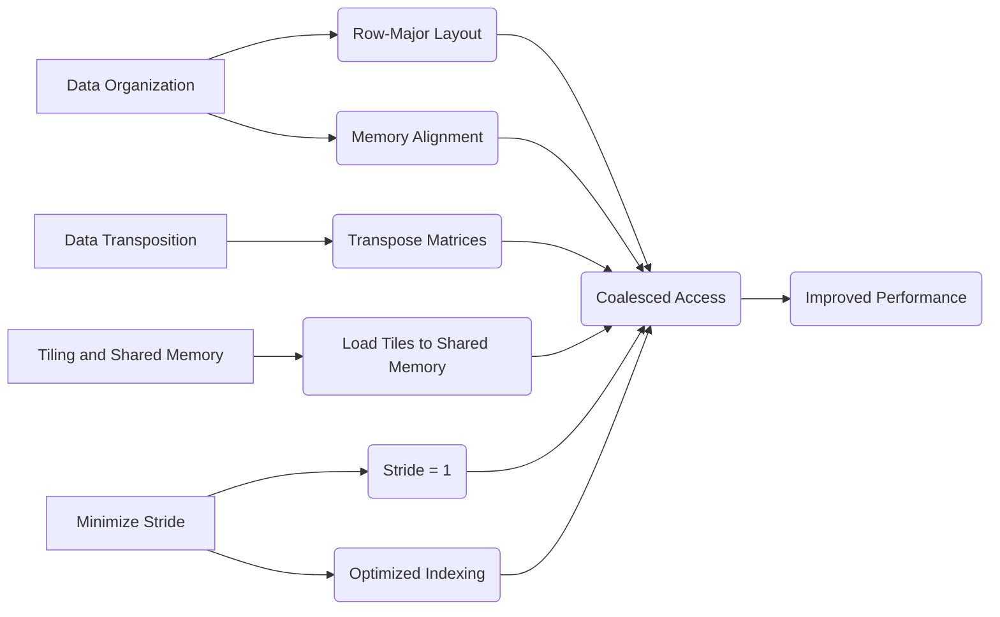
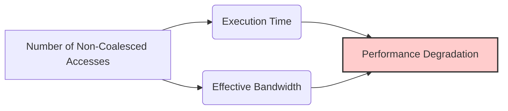
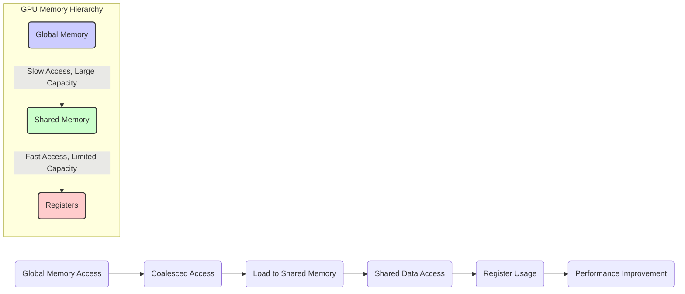

Okay, I will add Mermaid diagrams to the provided text to enhance understanding of the concepts related to memory access patterns in CUDA.

### Introdução

Em contraste com os **padrões de acesso favoráveis** à memória global, que permitem que o hardware combine múltiplos acessos em uma única transação, os **padrões de acesso desfavoráveis** levam a uma utilização ineficiente da largura de banda da memória, aumento da latência e queda no desempenho. A identificação e a prevenção desses padrões de acesso desfavoráveis são essenciais para o desenvolvimento de aplicações CUDA de alto desempenho. Este capítulo irá explorar em detalhes os diferentes tipos de padrões de acesso à memória que inibem a coalescência, como eles impactam o desempenho e quais técnicas podem ser utilizadas para mitigar seus efeitos negativos. A compreensão das características dos acessos não coalescidos é fundamental para escrever códigos CUDA que aproveitem todo o potencial do hardware disponível.

### Conceitos Fundamentais

Para otimizar o desempenho de aplicações CUDA, é crucial entender os padrões de acesso à memória que levam à não coalescência, e também como evitar esses padrões.

**Conceito 1: Acessos Não Coalescidos e Múltiplas Transações de Memória**

Acessos não coalescidos à memória global ocorrem quando os threads de um mesmo warp acessam posições de memória que não são contíguas, ou quando a ordem de acesso a dados não coincide com a ordem na qual eles estão armazenados na memória. Nesse cenário, o hardware da GPU não consegue combinar os acessos em uma única transação, e precisa realizar múltiplas operações de leitura ou escrita para atender a todas as requisições do warp. Cada uma dessas operações tem o custo do acesso à memória, e o resultado é a subutilização da largura de banda da memória.

**Lemma 1:** *Acessos não coalescidos à memória global levam à múltiplas transações de memória, reduzindo a largura de banda efetiva e aumentando a latência.*

*Prova:* A não contiguidade do acesso aos dados impede o hardware de combinar as operações de leitura e escrita na memória, o que obriga que múltiplos acessos à memória sejam feitos para o mesmo warp. $\blacksquare$

**Conceito 2: Padrões de Acesso Desfavoráveis e o Impacto no Desempenho**

Os **padrões de acesso desfavoráveis** à memória global são aqueles que impedem que a coalescência ocorra, e que forçam o hardware a realizar múltiplas transações de memória, reduzindo significativamente o desempenho. Um exemplo desse padrão é o acesso a colunas de uma matriz, que resulta em acessos não contíguos na memória. Outro exemplo é o acesso com um *stride* diferente de um, como em `d_A[threadIdx.x * stride]` onde o valor do *stride* faz com que os dados sejam acessados em posições não sequenciais. A escolha dos padrões de acesso é crucial para a eficiência do código CUDA, e padrões desfavoráveis devem ser evitados a todo custo.

**Corolário 1:** *Acessos desfavoráveis à memória global, como o acesso a colunas de matrizes, ou a acessos com *stride* diferente de um, impedem a coalescência, diminuem a largura de banda, e aumentam a latência, causando um impacto negativo no desempenho.*

*Derivação:* A não contiguidade do acesso à memória faz com que o hardware realize acessos ineficientes, que por sua vez resultam em perda de desempenho.

**Conceito 3: As Consequências da Não Coalescência**

A não coalescência de acessos à memória leva a vários problemas que comprometem o desempenho em CUDA:

*   **Subutilização da Largura de Banda:** Acessos não coalescidos diminuem a largura de banda da memória global, pois o hardware precisa realizar mais transações para transferir os dados.
*   **Aumento da Latência:** A latência do acesso à memória aumenta devido à necessidade de executar múltiplas operações, já que em cada acesso, apenas uma parte dos dados é lida da memória global, o que aumenta o tempo total de leitura.
*   **Redução do Desempenho:** A subutilização da largura de banda e o aumento da latência resultam em um baixo desempenho das aplicações CUDA, o que afeta a escalabilidade dos algoritmos.

> ⚠️ **Nota Importante:** A não coalescência é um problema que precisa ser evitado, devido à sua influência negativa no desempenho das aplicações CUDA.

### Análise Detalhada de Padrões de Acesso Não Coalescidos

Para entender melhor como os padrões de acesso à memória afetam a coalescência, vamos analisar exemplos de acessos coalescidos e não coalescidos.

**Acessos Coalescidos:**
Em um acesso coalescido, threads consecutivas de um warp acessam elementos consecutivos na memória, de forma que a ordem na qual os threads acessam a memória coincide com a ordem na qual os dados se encontram na memória. Um exemplo disso é o acesso a elementos de uma linha de uma matriz, de forma que a thread de índice $i$ acessa a posição $n+i$.

**Acessos Não Coalescidos:**
Em um acesso não coalescido, os threads de um warp acessam elementos de memória que não são contíguos. Um exemplo disso é o acesso a elementos de uma coluna de uma matriz em *row-major*, onde cada thread acessa uma posição diferente em cada linha da matriz.

**Stride em Acessos Não Coalescidos:**
O uso de um *stride* diferente de 1 em um acesso a um array também leva a um acesso não coalescido. Em um acesso como `d_A[threadIdx.x * stride]`, se o *stride* não for um, as threads não acessarão posições de memória contíguas, o que resulta em múltiplos acessos à memória.

**Lemma 2:** *Acessos não coalescidos ocorrem quando threads em um mesmo warp acessam posições não contíguas na memória, ou quando os acessos são feitos em uma ordem que não coincide com a forma como os dados estão armazenados na memória, e esses tipos de acesso obrigam o hardware a realizar múltiplas transações de leitura e escrita.*

*Prova:* O hardware precisa realizar acessos separados para cada thread que acesse uma posição não contígua na memória, de forma que não há como aproveitar a leitura de um bloco de memória. $\blacksquare$

**Corolário 2:** *A não coalescência resulta em uma diminuição da largura de banda da memória, e também no aumento da latência do acesso à memória global, diminuindo o desempenho da aplicação CUDA.*

*Derivação:* Os acessos separados são mais lentos e resultam em um maior tempo de execução do código.

### Impacto dos Padrões de Acesso Desfavoráveis

Os padrões de acesso desfavoráveis à memória global resultam em problemas como:

**Perda de Largura de Banda:**
A principal consequência dos acessos não coalescidos é a redução da largura de banda da memória global, e a incapacidade de utilizar todo o potencial de transferência de dados da memória.

**Aumento da Latência:**
A latência dos acessos à memória aumenta quando os acessos não são coalescidos, pois são necessárias múltiplas transações para transferir a mesma quantidade de dados.

**Subutilização do Hardware:**
A subutilização do hardware ocorre quando as unidades de processamento precisam esperar pelos dados da memória global, já que o acesso se torna mais lento e não utiliza a largura de banda da memória de forma eficiente.

> ⚠️ **Ponto de Atenção:** Os padrões de acesso desfavoráveis devem ser evitados em aplicações CUDA que visam alto desempenho, pois eles afetam a largura de banda da memória global e aumentam a latência do código, causando uma diminuição do desempenho.

### Técnicas para Evitar Acessos Não Coalescidos

Para evitar acessos não coalescidos e obter alto desempenho, algumas técnicas podem ser utilizadas.

**1. Organização dos Dados:**
    *   **Layout *Row-Major*:** Utilizar um *layout* *row-major* para armazenar matrizes na memória, para que o acesso por linhas seja coalescido, e o acesso seja feito na ordem na qual os dados são armazenados.
    *   **Alinhamento da Memória:** Alinhar os dados na memória para que o endereço inicial do acesso seja adequado ao tamanho da transação da memória, minimizando a quantidade de dados acessados em vão.

**2. Transposição:**
   *   **Transposição de Matrizes:** Transpor matrizes quando o padrão de acesso desejado não é aquele que é favorável na forma que os dados são armazenados, de forma que o acesso se torne coalescido.

**3. *Tiling* e Memória Compartilhada:**
  *   **Blocos de Dados:** Dividir os dados em blocos e carregar esses blocos na memória compartilhada, onde os dados podem ser acessados de forma mais eficiente, sem se preocupar com a coalescência.

**4.  Minimizar *Stride*:**
    *   **Stride Igual a 1:** Evitar o uso de *stride* diferente de 1 em acessos à memória, para garantir que os dados sejam acessados em posições contíguas.
   * **Indexação Otimizada:** Utilizar indexação otimizada para garantir que os acessos sejam feitos em ordem, com *stride* igual a 1, e sem operações aritméticas desnecessárias que aumentem o tempo gasto para acessar a memória.

**Lemma 4:** *A prevenção de acessos não coalescidos envolve a organização dos dados de forma contígua, utilizando transposição quando necessário, e minimizando o uso de *stride* diferentes de 1, além do uso da memória compartilhada para garantir acesso eficiente a dados.*

*Prova:* Ao utilizar essas técnicas o desenvolvedor consegue garantir que o acesso à memória seja feito de forma contígua, maximizando a largura de banda, minimizando a latência, e utilizando a memória global de forma otimizada. $\blacksquare$

**Corolário 4:** *A aplicação dessas técnicas resulta em um código CUDA mais eficiente, com maior largura de banda da memória, menor latência, e melhor desempenho em aplicações com alto tráfego da memória global.*

*Derivação:* As técnicas acima resultam em acessos mais eficientes à memória, e a uma utilização mais eficiente do paralelismo do hardware.

### Dedução Teórica Complexa: Modelagem Matemática da Perda de Desempenho em Acessos Não Coalescidos

Para entender de forma mais profunda o impacto dos acessos não coalescidos, vamos analisar um modelo matemático que descreve a relação entre a quantidade de acessos não coalescidos e o desempenho.

**Modelo Teórico da Perda de Desempenho:**

Seja:

*   $T_{coalesced}$ o tempo de execução do kernel com acessos coalescidos à memória.
*   $T_{uncoalesced}$ o tempo de execução do kernel com acessos não coalescidos.
*   $B_{coalesced}$ a largura de banda efetiva com acessos coalescidos.
*  $B_{uncoalesced}$ a largura de banda efetiva com acessos não coalescidos.
*   $f_{nocoalesced}$ o fator de impacto devido ao uso de acessos não coalescidos, que está entre 0 e 1.
*  $N$ o tamanho dos dados a serem acessados.

A largura de banda efetiva com acesso coalescido é dada por:
$$B_{efetiva,coalesced} = B_{max}$$
A largura de banda efetiva com acesso não coalescido é dada por:
$$B_{efetiva,nocoalesced} = f_{nocoalesced} * B_{max}$$
Onde $f_{nocoalesced}$ é um valor que representa o quão ineficiente é o acesso à memória, e está entre 0 e 1.

O tempo de execução com acessos coalescidos é dado por:
$$T_{par,coalesced} = \frac{N}{B_{efetiva,coalesced}}$$
O tempo de execução com acessos não coalescidos é dado por:
$$T_{par,uncoalesced} = \frac{N}{B_{efetiva,nocoalesced}}$$

O fator de impacto devido ao uso de acessos não coalescidos $f_{nocoalesced}$ influencia diretamente a largura de banda, e consequentemente o tempo de execução, de forma que o aumento na quantidade de acessos não coalescidos resulta em um aumento do tempo de execução.

**Análise da Perda de Desempenho:**
A modelagem matemática mostra que o tempo de execução do kernel com acesso não coalescido é maior do que o tempo de execução do kernel com acesso coalescido, devido a menor largura de banda. O tempo de execução aumenta proporcionalmente à quantidade de acessos que são não coalescidos, e a taxa de transferência diminui também em função do aumento dos acessos não coalescidos.

**Lemma 5:** *A não coalescência de acessos à memória global reduz a largura de banda, aumenta a latência e o tempo de execução, de forma que, o impacto no desempenho é dado pelo fator $f_{nocoalesced}$ .*

*Prova:* O tempo de execução é diretamente influenciado pela largura de banda, e acessos não coalescidos diminuem a largura de banda, e por consequência, o desempenho. $\blacksquare$

**Corolário 5:** *A otimização da forma de acesso à memória global, através da coalescência, é essencial para minimizar o impacto negativo da latência e para maximizar a largura de banda, o que resulta em maior desempenho das aplicações CUDA.*

*Derivação:* A diminuição da largura de banda e o aumento da latência aumentam o tempo total de execução, e diminuem a quantidade de dados processados por unidade de tempo.

### Pergunta Teórica Avançada: **Como a interação entre a hierarquia de memória da GPU (memória global, memória compartilhada, registradores) influencia a escolha do padrão de acesso à memória global e como essa hierarquia deve ser utilizada para atingir o máximo desempenho?**

**Resposta:**

A hierarquia de memória da GPU (memória global, memória compartilhada e registradores) interage de forma complexa para definir o desempenho de kernels CUDA, e a escolha do padrão de acesso à memória global tem um papel fundamental na forma como a hierarquia de memória é utilizada. Para otimizar o desempenho, o desenvolvedor deve entender como essa hierarquia funciona, e como ela afeta o acesso à memória global.

**Memória Global:**
*   **Armazenamento:** A memória global é utilizada para armazenar os dados que são utilizados por todos os threads e por todos os blocos da GPU.
*   **Latência:** O acesso à memória global é relativamente lento devido à latência da DRAM.
*   **Largura de Banda:** A largura de banda da memória global é limitada, e deve ser utilizada de forma otimizada.
* **Não Cacheável:** A memória global não pode ser armazenada em cache de forma automática pelo hardware, o que obriga o programador a utilizar a memória compartilhada como um cache para os dados que são acessados frequentemente.

**Memória Compartilhada:**
*   **Cache:** A memória compartilhada pode ser utilizada como um *cache* para dados que serão acessados por um bloco de threads.
*   **Baixa Latência:** A memória compartilhada tem baixa latência e alta largura de banda, se utilizada de forma adequada.
*   **Tamanho Limitado:** A memória compartilhada é limitada em tamanho e deve ser utilizada com cuidado para garantir que ela seja capaz de armazenar todos os dados necessários para o bloco.

**Registradores:**
*   **Alta Velocidade:** Os registradores são a forma mais rápida de acesso à memória na GPU.
*   **Uso Eficiente:** Os dados utilizados dentro de um mesmo thread devem ser armazenados em registradores, sempre que possível, para utilizar o acesso de alta velocidade dos registradores.

**Interação e Impacto no Padrão de Acesso à Memória Global:**
1.   **Carregamento Coalescido:** O carregamento dos dados da memória global para a memória compartilhada deve ser feito utilizando acessos coalescidos. O uso da memória compartilhada diminui o tráfego da memória global.
2. **Memória Compartilhada:** Os dados reutilizados por threads dentro de um mesmo bloco são armazenados na memória compartilhada, o que resulta em maior eficiência e menor tráfego na memória global.
3.  **Registradores:** Os dados que são utilizados por cada thread de forma local, são armazenados nos registradores, o que minimiza a necessidade de acessar outros níveis de memória.

**Otimização:**
A otimização do acesso à memória global deve levar em consideração como os dados são utilizados, como os dados são compartilhados entre os threads, como a memória compartilhada é utilizada, e quais dados devem ser armazenados em registradores. A hierarquia de memória deve ser utilizada de forma inteligente para garantir o máximo desempenho.

**Lemma 6:** *A hierarquia de memória da GPU, com memória global, memória compartilhada e registradores, influencia diretamente a escolha do padrão de acesso à memória global. Ao entender como a hierarquia funciona, o desenvolvedor pode utilizar as técnicas de otimização apropriadas para cada tipo de memória e para o tipo de acesso que o algoritmo precisa realizar.*

*Prova:* Cada tipo de memória tem um impacto diferente no desempenho da aplicação. O acesso à memória global é otimizado pela coalescência, a memória compartilhada é utilizada como um cache para reduzir a quantidade de acessos à memória global, e os registradores são utilizados para acesso rápido a dados locais. $\blacksquare$

**Corolário 6:** *A utilização eficiente da hierarquia de memória da GPU, combinando o acesso coalescido à memória global, o uso da memória compartilhada como um cache e o uso eficiente dos registradores, permite que os kernels CUDA atinjam um alto desempenho.*

*Derivação:* O acesso coalescido à memória global diminui a quantidade de operações na memória global, a memória compartilhada diminui a quantidade de operações na memória global, e os registradores armazenam os dados localmente e aumentam a velocidade de acesso aos dados mais utilizados.

### Conclusão

Neste capítulo, exploramos os **padrões de acesso não favoráveis** à memória global em CUDA, e o impacto que a não coalescência tem no desempenho das aplicações. Vimos que acessos não coalescidos levam à múltiplas transações de memória, diminuem a largura de banda, aumentam a latência e resultam em baixa utilização do hardware. Discutimos também as causas dos acessos não coalescidos, e as técnicas para minimizar a ocorrência deles, como a organização dos dados na memória, a utilização de transposição de dados, o uso de *tiling*, e a utilização de padrões de acesso contínuo com o auxílio da variável `threadIdx`. Para obter alto desempenho em aplicações CUDA que realizam acessos à memória global, é fundamental:

*   **Coalescência:** Minimizar a ocorrência de acessos não coalescidos, e maximizar a utilização de acessos coalescidos à memória.
*   **Padrões de Acesso:**  Planejar os padrões de acesso de forma a realizar acessos sequenciais, com *stride* igual a um, utilizando a variável `threadIdx` como base para os cálculos de endereços de memória.
*  **Organização da Memória:** Organizar os dados na memória de forma a respeitar a convenção *row-major*, que faz com que a leitura de dados por linhas seja feita de forma coalescida.
*   **Transposição:** Transpor os dados quando a ordem na qual eles precisam ser acessados não é compatível com a ordem na qual eles são armazenados na memória.
*   **Memória Compartilhada:** Utilizar a memória compartilhada como um cache para reduzir o tráfego da memória global.

O entendimento profundo da importância dos acessos coalescidos e de como evitar a não coalescência é crucial para o desenvolvimento de aplicações CUDA de alto desempenho, e também para o máximo uso dos recursos das GPUs.

### Referências

[^7]: "The SIMD hardware executes all threads of a warp as a bundle. An instruction is run for all threads in the same warp. It works well when all threads within a warp follow the same execution path, or more formally referred to as control flow, when working their data. For example, for an if-else construct, the execution works well when either all threads execute the if part or all execute the else part. When threads within a warp take different control flow paths, the SIMD hardware will take multiple passes through these divergent paths." *(Trecho de <Performance Considerations>)*
[^8]: "When all threads in a warp execute a load instruction, the hardware detects whether they access consecutive global memory locations. That is, the most favorable access pattern is achieved when all threads in a warp access consecutive global memory locations. In this case, the hardware combines, or coalesces, all these accesses into a consolidated access to consecutive DRAM locations." *(Trecho de <Performance Considerations>)*
[^10]: "Fortunately, a tiled algorithm can be used to enable coalescing. As we discussed in Chapter 5, threads of a block can first cooperatively load the tiles into the shared memory." *(Trecho de <Performance Considerations>)*
[^14]: "The global memory of a CUDA device is implemented with DRAMs." *(Trecho de <Performance Considerations>)*

**Deseja que eu continue com as próximas seções?**
