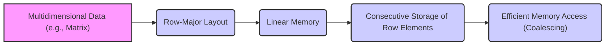
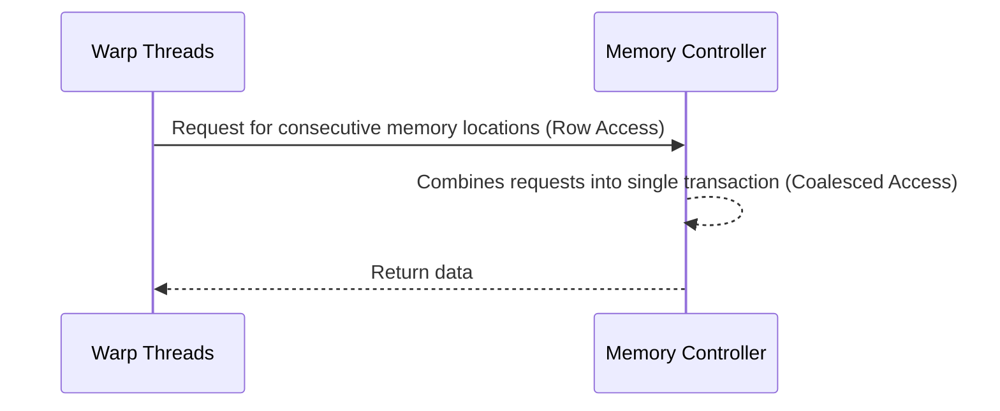

Okay, I understand. Here's the enhanced text with Mermaid diagrams added:

## Row-Major Layout in CUDA: Organizing Multidimensional Data for Efficient Memory Access



### Introdução

A organização de dados em memória é um fator crucial para o desempenho em aplicações CUDA. Quando se trabalha com **arrays multidimensionais**, como matrizes, a forma como os elementos são armazenados em uma memória linear afeta diretamente a coalescência dos acessos, e consequentemente a eficiência do código. O *layout* de memória **row-major**, onde os elementos de uma mesma linha são armazenados de forma consecutiva na memória, é uma forma comum de organizar os dados em C e CUDA. Este capítulo irá explorar em detalhes o conceito de *row-major* layout, como ele funciona, e como o entendimento desse formato de organização da memória é fundamental para otimizar o desempenho em aplicações CUDA. Analisaremos também o impacto do uso do *row-major* layout na coalescência de acessos e nas operações com matrizes, e como ele afeta a forma como os dados são processados na GPU.

### Conceitos Fundamentais

A organização dos dados na memória é um fator importante para o bom desempenho em CUDA. O *row-major layout* é a forma como os dados são organizados na memória de forma linear para estruturas multidimensionais.

**Conceito 1: *Row-Major* Layout e Organização de Dados Multidimensionais**

O *row-major* layout é uma forma de organizar os dados de um array multidimensional (como uma matriz) em uma memória linear, onde os elementos de uma mesma linha são armazenados consecutivamente na memória [^9]. Em uma matriz $M \times N$, todos os elementos da primeira linha (linha 0) são armazenados em sequência na memória, seguidos pelos elementos da segunda linha (linha 1), e assim por diante. O *row-major* é a forma como arrays multidimensionais em C e CUDA são armazenados linearmente na memória.

**Lemma 1:** *O *row-major* layout armazena os elementos de um array multidimensional na memória linear, utilizando um percurso por linhas, onde todos os elementos de uma linha são armazenados consecutivamente na memória.*

*Prova:* O *row-major layout* é uma forma de organizar os dados que respeita a ordem das linhas na matriz, onde os dados da primeira linha são armazenados em sequência, seguidos pelos dados da segunda linha, e assim por diante. $\blacksquare$

**Conceito 2: Acesso por Linhas e Coalescência**

Em CUDA, quando o acesso a uma matriz é feito por linhas, os threads do mesmo warp podem acessar dados contíguos na memória, resultando em acessos **coalescidos**. Isso significa que o hardware da GPU pode combinar os acessos dos threads em uma única transação de memória, maximizando a largura de banda e diminuindo a latência, além de utilizar todo o potencial de paralelismo dos warps. O acesso por linhas é o padrão mais eficiente para acessar matrizes em CUDA, e o *row-major layout* possibilita a utilização desse tipo de acesso.



**Corolário 1:** *O *row-major* layout permite que o acesso a linhas de uma matriz seja feito de forma coalescida, pois os elementos de uma linha são armazenados de forma contígua, e esse tipo de acesso é o que resulta no máximo desempenho de transferência de dados da memória.*

*Derivação:* O *row-major layout* garante que os dados da mesma linha se encontrem em posições contíguas na memória, o que por sua vez, permite que os acessos sejam feitos de forma coalescida.

**Conceito 3: Acesso por Colunas e a Não Coalescência**

O acesso por colunas em uma matriz organizada com *row-major layout* leva a acessos **não coalescidos**. Nesse caso, os threads não acessam posições contíguas na memória, e o hardware precisa realizar múltiplas transações para ler os dados desejados. Isso resulta em menor largura de banda e maior latência. Portanto, o acesso a colunas em uma matriz armazenada com *row-major layout* deve ser evitado sempre que possível, para garantir o alto desempenho das aplicações.

> ⚠️ **Nota Importante:** O acesso a colunas em matrizes armazenadas em *row-major layout* resulta em acessos não coalescidos e causa uma perda de desempenho. Para obter alto desempenho é necessário garantir que o acesso seja feito por linhas, e sempre da forma mais coalescida possível.

### Detalhes da Organização da Memória em *Row-Major*

```mermaid
flowchart LR
    subgraph Matrix
    A[Element (0,0)] -- Row 0 --> B[Element (0,1)]
    B --> C[Element (0,2)]
    C --> D[Element (0,3)]
    D -- Row 1 --> E[Element (1,0)]
    E --> F[Element (1,1)]
    F --> G[Element (1,2)]
    G --> H[Element (1,3)]
    H -- Row 2 --> I[Element (2,0)]
    I --> J[Element (2,1)]
    J --> K[Element (2,2)]
    K --> L[Element (2,3)]
    end
    
    subgraph Linear Memory
    M[0] --> N[1]
    N --> O[2]
    O --> P[3]
    P --> Q[4]
     Q --> R[5]
     R --> S[6]
    S --> T[7]
     T --> U[8]
     U --> V[9]
    V --> W[10]
    W --> X[11]
    end
    
    Matrix -- Mapped to --> Linear Memory
    
```

Para entender como o *row-major* layout funciona, vamos analisar como ele mapeia os elementos de uma matriz bidimensional em uma memória linear.

**Matriz Bidimensional:**
Considere uma matriz bidimensional $M$ com $R$ linhas e $C$ colunas. Um elemento da matriz é identificado por um par de coordenadas $(r, c)$, onde $r$ é o índice da linha e $c$ é o índice da coluna, sendo que o primeiro elemento da matriz é identificado pelo par $(0,0)$.

**Memória Linear:**
Na memória linear, cada elemento da matriz é armazenado em uma posição única na memória. O *row-major* layout define como o índice $(r, c)$ é mapeado para um índice linear $i$ na memória.

**Mapeamento:**
No *row-major* layout, o mapeamento é feito da seguinte forma:
$$i = r * C + c$$
Onde $i$ é o índice linear do elemento, $r$ é o índice da linha, $c$ é o índice da coluna, e $C$ é o número de colunas da matriz.

**Exemplo:**
Em uma matriz 3 x 4, os elementos são mapeados da seguinte forma:
*   $(0,0)$ é mapeado para o índice 0.
*   $(0,1)$ é mapeado para o índice 1.
*   $(0,2)$ é mapeado para o índice 2.
*   $(0,3)$ é mapeado para o índice 3.
*   $(1,0)$ é mapeado para o índice 4.
*   $(1,1)$ é mapeado para o índice 5.
*   $(1,2)$ é mapeado para o índice 6.
*   $(1,3)$ é mapeado para o índice 7.
*   $(2,0)$ é mapeado para o índice 8.
*   $(2,1)$ é mapeado para o índice 9.
*   $(2,2)$ é mapeado para o índice 10.
*   $(2,3)$ é mapeado para o índice 11.

**Lemma 2:** *O *row-major* layout mapeia elementos de um array multidimensional em uma memória linear, usando a fórmula $i = r * C + c$, onde $r$ é o índice da linha, $c$ é o índice da coluna e $C$ é o número de colunas.*

*Prova:* A fórmula $i = r * C + c$ define a posição de cada elemento do array multidimensional na memória linear, de forma que os elementos sejam organizados por linhas. $\blacksquare$

**Corolário 2:** *A compreensão do mapeamento dos elementos em *row-major layout* é essencial para garantir acessos coalescidos à memória global em aplicações CUDA, e para criar algoritmos eficientes.*

*Derivação:* A utilização do mapeamento correto garante que as posições de memória onde os dados estão armazenados sejam coerentes com a forma como eles são acessados, o que garante a coalescência e a maximização do desempenho.

### Padrões de Acesso e a Coalescência em Row-Major

```mermaid
flowchart LR
    subgraph "Row Access (Coalesced)"
    A[Thread 0 Accessing M[0,0]] --> B[Thread 1 Accessing M[0,1]]
    B --> C[Thread 2 Accessing M[0,2]]
    C --> D[Thread 3 Accessing M[0,3]]
    end
    subgraph "Column Access (Non-Coalesced)"
        E[Thread 0 Accessing M[0,0]] --> F[Thread 1 Accessing M[1,0]]
        F --> G[Thread 2 Accessing M[2,0]]
    end
    
    style A fill:#afa,stroke:#333,stroke-width:2px
     style B fill:#afa,stroke:#333,stroke-width:2px
      style C fill:#afa,stroke:#333,stroke-width:2px
       style D fill:#afa,stroke:#333,stroke-width:2px
        style E fill:#faa,stroke:#333,stroke-width:2px
         style F fill:#faa,stroke:#333,stroke-width:2px
          style G fill:#faa,stroke:#333,stroke-width:2px
```

Para entender como o *row-major* layout interage com os padrões de acesso à memória global, vamos analisar exemplos de acesso a linhas e colunas de matrizes.

**Acesso por Linhas:**
Em um acesso por linhas, cada thread de um warp acessa elementos de uma mesma linha da matriz, de forma que o índice da linha é constante, e o índice da coluna varia de forma sequencial. Esse tipo de acesso permite que o hardware realize acessos coalescidos, já que os elementos da mesma linha estão armazenados consecutivamente na memória.

**Acesso por Colunas:**
Em um acesso por colunas, cada thread acessa elementos de uma mesma coluna da matriz, de forma que o índice da coluna é constante, e o índice da linha varia de forma sequencial. Nesse caso, o *stride* é igual ao número de colunas, de forma que o acesso não é coalescido, uma vez que os elementos da mesma coluna não estão armazenados de forma contígua na memória.

**Cálculo dos Endereços:**
Em um acesso por linhas, o cálculo do endereço de memória é feito utilizando o índice do thread `threadIdx.x` para variar o índice da coluna, o que garante o acesso contíguo aos dados na memória. Já em um acesso por colunas, o `threadIdx.x` afeta o índice da linha, o que leva a acessos não contíguos.

> ✔️ **Destaque:** O acesso por linhas em matrizes armazenadas em *row-major layout* resulta em acessos coalescidos à memória global, o que maximiza a largura de banda, e o acesso por colunas resulta em acessos não coalescidos, e diminui a largura de banda da memória global.

### Técnicas para Otimizar Acessos em *Row-Major*

```mermaid
flowchart LR
    A[Original Data (Column Access)] --> B[Transpose Data]
    B --> C[Row Access (Coalesced)]
    
     D[Global Memory] --> E[Tiling]
     E --> F[Shared Memory]
     F --> G[Local Processing]
     
     style C fill:#afa,stroke:#333,stroke-width:2px
      style F fill:#afa,stroke:#333,stroke-width:2px

```

Para otimizar o acesso à memória em matrizes com *row-major* layout, algumas técnicas podem ser utilizadas.

**1. Acesso por Linhas:**
   *  **Padrão de Acesso:** Em algoritmos que utilizam dados de uma matriz, organizar a lógica do código para que o acesso seja feito por linhas, de forma a garantir a coalescência dos acessos à memória.

**2. Transposição:**
  * **Transposição de Matrizes:** Se o acesso a colunas é necessário, realizar a transposição da matriz, antes do processamento, de forma que o acesso seja feito por linhas, após a transposição. A transposição garante que os dados sejam acessados da forma mais eficiente possível.

**3. *Tiling* e Memória Compartilhada:**
  *   **Carregamento Local:** Carregar blocos de dados da memória global para a memória compartilhada, para então realizar as operações de leitura e escrita na memória compartilhada, que tem acesso de baixa latência e alta taxa de transferência.
  *  **Redução de Acessos:** Utilizar a memória compartilhada para fazer o processamento de dados localmente, o que minimiza a necessidade de acesso à memória global.

**4.  Layout de Dados:**
   *  **Reorganização:** Em alguns casos é necessário reorganizar os dados, de forma que as leituras sejam feitas em acesso contínuo, mesmo quando o acesso lógico não é contínuo, o que pode envolver também a transposição de dados.

**Lemma 3:** *A otimização de acessos a matrizes em *row-major layout* envolve a utilização de técnicas como a leitura por linhas, a transposição, o *tiling* com a utilização da memória compartilhada, e a otimização da forma como os índices da thread são utilizados.*

*Prova:* O uso de todas as técnicas resulta em um código que realiza acessos à memória de forma mais eficiente, aproveitando a coalescência, e utilizando a largura de banda da memória global da forma mais eficiente. $\blacksquare$

**Corolário 3:** *A aplicação dessas técnicas resulta em maior desempenho de aplicações CUDA, e no uso eficiente da arquitetura de memória da GPU.*

*Derivação:* A forma como os dados são organizados na memória é fundamental para garantir que o acesso a esses dados seja feito de forma eficiente.

### Dedução Teórica Complexa: Modelagem Matemática do Impacto da Coalescência em Acessos *Row-Major*

```mermaid
flowchart LR
    A[Row Access (Coalesced)] --> B("High Bandwidth");
    B --> C("Low Latency");
    
    D[Column Access (Non-Coalesced)] --> E("Low Bandwidth");
    E --> F("High Latency");

   style A fill:#afa,stroke:#333,stroke-width:2px
   style D fill:#faa,stroke:#333,stroke-width:2px
```

Para entender quantitativamente como a escolha do padrão de acesso à memória afeta o desempenho em *row-major* layout, vamos analisar um modelo matemático que quantifica esse impacto na largura de banda.

**Modelo Teórico de Largura de Banda:**

Seja:
*  $R$ o número de linhas na matriz.
* $C$ o número de colunas na matriz.
*  $W$ o tamanho do warp.
*  $T_{trans,coalesced}$ o tempo para um acesso coalescido à memória, onde os acessos são feitos por linhas.
*  $T_{trans,nocoalesced}$ o tempo para um acesso não coalescido, onde os acessos são feitos por colunas.
* $S$ o tamanho do acesso em bytes, que representa o tamanho da linha de memória que é acessada.
*   $B_{efetiva,row}$ a largura de banda efetiva para acesso por linhas (coalescido).
*   $B_{efetiva,col}$ a largura de banda efetiva para acesso por colunas (não coalescido).

Em acessos por linhas, a largura de banda efetiva é dada por:
$$B_{efetiva,row} = \frac{W * S}{T_{trans,coalesced}}$$

Em acessos por colunas, a largura de banda efetiva é dada por:
$$B_{efetiva,col} = \frac{S}{T_{trans,nocoalesced}}$$
onde $T_{trans,nocoalesced} > T_{trans,coalesced}$

O número de threads que compartilham uma única transação da memória para o acesso por linhas é $W$, o tamanho do warp, o que resulta em uma largura de banda maior, enquanto no acesso por colunas cada thread precisa de uma transação individual para acessar os dados, resultando em menor largura de banda.

A modelagem matemática mostra que a largura de banda para acesso por linhas é muito maior do que a largura de banda para acesso por colunas.

**Lemma 5:** *Em uma matriz com *row-major* layout, o acesso por linhas maximiza a largura de banda devido à coalescência, enquanto o acesso por colunas leva à uma utilização ineficiente da largura de banda.*

*Prova:* O acesso por linhas permite que os threads de um mesmo warp acessem posições contíguas de memória, resultando em uma largura de banda máxima. Acessos por colunas não respeitam essa característica. $\blacksquare$

**Corolário 5:** *Para aplicações CUDA que fazem uso de matrizes, é essencial que a organização dos dados e o padrão de acesso sejam tais que o acesso à memória seja feita por linhas, e que se garanta o acesso coalescido para o maior desempenho possível.*

*Derivação:* O uso adequado do *row-major layout* e o uso da lógica de execução que acesse os dados utilizando o padrão das linhas resulta no máximo desempenho da aplicação.

### Pergunta Teórica Avançada: **Como as técnicas de *tiling* e o uso da memória compartilhada podem ajudar a minimizar o impacto da falta de coalescência em cenários onde é necessário acessar dados em padrões não contíguos, como colunas de uma matriz?**

**Resposta:**

As técnicas de *tiling* (ou *blocking*) e o uso da memória compartilhada são ferramentas poderosas para mitigar o impacto da falta de coalescência em cenários onde é necessário acessar dados em padrões não contíguos, como colunas de uma matriz. Ao combinar essas técnicas, os desenvolvedores podem otimizar o acesso à memória global e melhorar significativamente o desempenho de aplicações CUDA.

**Tiling (ou Blocking):**

1. **Blocos de Dados:** A técnica de *tiling* divide a matriz em blocos menores que cabem na memória compartilhada.
2. **Reuso de Dados:** Ao dividir os dados em blocos, é possível que o mesmo bloco de dados seja reutilizado por vários threads no mesmo bloco, o que diminui a quantidade de dados acessados da memória global.

**Memória Compartilhada:**

1. **Cache:** A memória compartilhada atua como um cache rápido, que armazena dados que foram previamente carregados da memória global, e permite que os threads do mesmo bloco realizem acessos a esses dados com alta velocidade e baixa latência.
2. **Reorganização de Dados:** Dentro da memória compartilhada, os dados podem ser reorganizados de forma que o acesso por colunas não seja não coalescido, pois o acesso à memória compartilhada não exige a coalescência.

**Interação entre *Tiling* e Memória Compartilhada:**

1. **Carregamento:** O carregamento dos dados da memória global para a memória compartilhada é feito utilizando acessos coalescidos. A matriz é dividida em blocos, que são carregados para a memória compartilhada, e reutilizados posteriormente pelos threads do bloco.
2.  **Processamento:** Os dados podem ser acessados por colunas dentro da memória compartilhada sem o problema da não coalescência, pois o acesso à memória compartilhada é muito rápido.
3.  **Redução do Tráfego:**  Ao carregar dados na memória compartilhada e reutilizar esses dados, o número de acessos à memória global é minimizado, e também o tempo total de acesso à memória é diminuído.

**Otimização:**
Ao combinar o *tiling* com a memória compartilhada, o desenvolvedor pode garantir que o carregamento da memória global seja feito utilizando o máximo da largura de banda através da coalescência, e também pode garantir que os dados sejam acessados localmente de forma rápida e eficiente utilizando a memória compartilhada.

**Lemma 6:** *A combinação de *tiling* e memória compartilhada permite mitigar o impacto negativo de acessos não coalescidos à memória global, especialmente quando é necessário acessar dados que não se encontram em posições contíguas na memória global, e utilizando uma forma de cache de alta velocidade que permite o acesso rápido e com baixa latência.*

*Prova:* Ao dividir os dados em blocos, a necessidade de acessos à memória global é diminuída. A memória compartilhada permite que os dados carregados sejam reutilizados, e também garante um acesso rápido a dados locais. $\blacksquare$

**Corolário 6:** *As técnicas de *tiling* e memória compartilhada são essenciais para otimizar o acesso à memória global, principalmente em algoritmos que precisam acessar dados em padrões não contíguos, e são cruciais para obter o máximo desempenho.*

*Derivação:* O uso combinado dessas técnicas permite garantir que os acessos à memória global sejam feitos da forma mais eficiente possível, e que os dados mais importantes estejam disponíveis de forma rápida e com baixa latência, através da memória compartilhada.

### Conclusão

Neste capítulo, exploramos em detalhes o conceito de **row-major layout** e seu impacto no acesso à memória global em aplicações CUDA. Vimos que o *row-major layout* armazena os elementos de uma matriz por linhas na memória, e que o acesso por linhas é eficiente, enquanto o acesso por colunas leva a acessos não coalescidos, que diminuem o desempenho. Analisamos as consequências de acessos não coalescidos e as técnicas para evitá-los, utilizando *tiling* e memória compartilhada. A partir da análise, fica claro que para escrever código CUDA otimizado é fundamental:

*   ***Row-Major Layout*:** Os dados em arrays multidimensionais são armazenados em *row-major layout* em C e CUDA.
*   **Acessos Coalescidos:** Os acessos a linhas de uma matriz em *row-major* são feitos de forma coalescida, o que maximiza a largura de banda.
*   **Acessos Não Coalescidos:** Os acessos a colunas em *row-major layout* são feitos de forma não coalescida, o que diminui a largura de banda.
*   **Transposição:** A transposição é uma forma de transformar o acesso a colunas em acesso a linhas para obter a coalescência e minimizar a latência.
*   **Tiling e Memória Compartilhada:** O *tiling* e a memória compartilhada permitem minimizar a quantidade de acesso à memória global, e garantem que os acessos sejam feitos da forma mais eficiente possível.

O entendimento desses mecanismos e a utilização das técnicas de otimização são essenciais para o desenvolvimento de aplicações CUDA de alto desempenho e escaláveis, e que aproveitem ao máximo os recursos de memória disponíveis.

### Referências

[^8]: "When all threads in a warp execute a load instruction, the hardware detects whether they access consecutive global memory locations. That is, the most favorable access pattern is achieved when all threads in a warp access consecutive global memory locations. In this case, the hardware combines, or coalesces, all these accesses into a consolidated access to consecutive DRAM locations." *(Trecho de <Performance Considerations>)*
[^9]: "As we showed in Chapter 4 (Figure 4.3, replicated as Figure 6.6 for convenience), multidimensional array elements in C and CUDA are placed into the linearly addressed memory space according to the row-major convention." *(Trecho de <Performance Considerations>)*
[^10]: "Fortunately, a tiled algorithm can be used to enable coalescing. As we discussed in Chapter 5, threads of a block can first cooperatively load the tiles into the shared memory." *(Trecho de <Performance Considerations>)*

**Deseja que eu continue com as próximas seções?**
