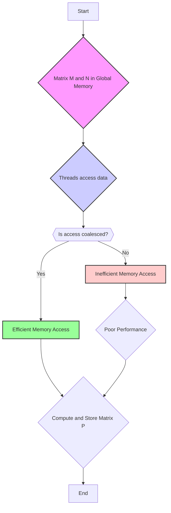
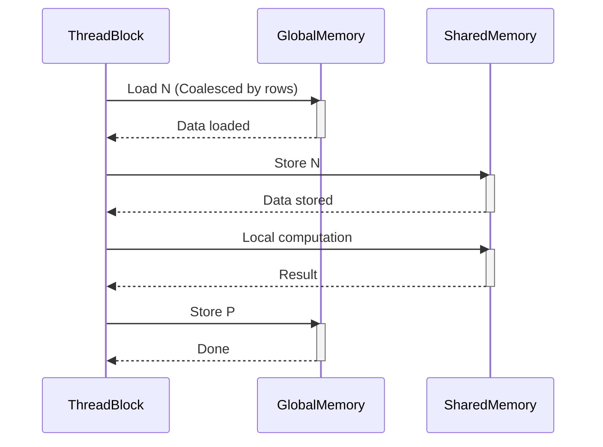
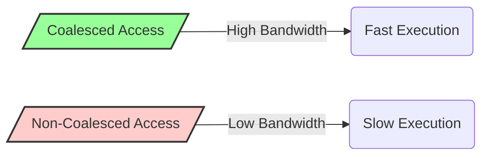
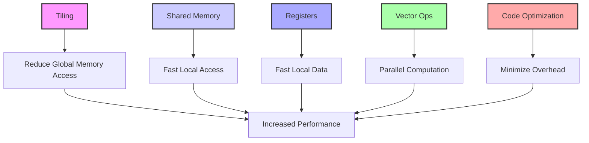
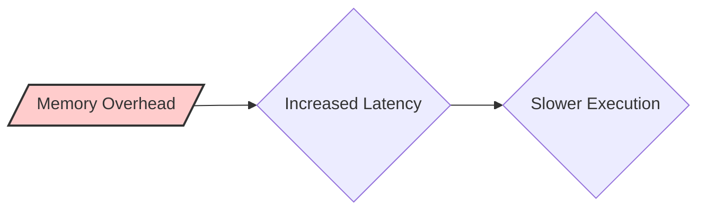

Okay, I understand. Here's the enhanced text with Mermaid diagrams added where appropriate:

## Coalesced Memory Access in Matrix Multiplication: A Practical Example in CUDA



### Introdução

Em aplicações CUDA, a multiplicação de matrizes é um exemplo clássico de computação paralela e uma das operações mais utilizadas no processamento de dados. A otimização do acesso à memória global para esse tipo de operação é essencial para obter alto desempenho. Neste capítulo, iremos analisar como o acesso a colunas de uma matriz em um kernel de multiplicação de matrizes pode ser otimizado para garantir o acesso **coalescido** à memória global. Exploraremos como o *layout row-major* da memória afeta o acesso por colunas, e como uma implementação cuidadosa pode permitir o acesso a esses dados de forma eficiente. Detalharemos um exemplo de código CUDA que implementa a multiplicação de matrizes, e como a coalescência de acessos pode ser realizada com a utilização da memória compartilhada. A compreensão de como o acesso coalescido pode ser garantido é um passo fundamental para o desenvolvimento de aplicações CUDA otimizadas.

### Conceitos Fundamentais

A multiplicação de matrizes é uma operação que necessita de um planejamento cuidadoso de acesso à memória, para utilizar o máximo do potencial do hardware.

**Conceito 1: Multiplicação de Matrizes e o Uso da Memória Global**

Na multiplicação de matrizes, os dados de duas matrizes de entrada (denominadas `M` e `N`) são utilizados para gerar uma matriz de saída (denominada `P`). A forma mais comum de executar essa operação é utilizando o produto escalar entre linhas de `M` e colunas de `N`. Cada thread calcula um elemento de `P`. Os dados de `M` e `N` são armazenados na memória global da GPU, e o acesso eficiente a esses dados é crucial para o desempenho. A arquitetura de memória da GPU otimiza a leitura de dados contíguos, e o acesso por linhas, e o acesso por colunas pode ser problemático, se não for planejado.

**Lemma 1:** *A multiplicação de matrizes em CUDA envolve o acesso a dados da memória global, e a forma como esses dados são acessados afeta diretamente o desempenho da operação, de forma que o acesso a linhas e o acesso a colunas utilizam a memória global de forma diferente.*

*Prova:* O acesso a linhas e o acesso a colunas envolvem diferentes padrões de acesso à memória, e a forma como a memória é acessada é o fator que definirá a sua eficiência. $\blacksquare$

**Conceito 2: Desafio do Acesso a Colunas em *Row-Major* Layout**

Como discutido em capítulos anteriores, a memória da GPU utiliza o *row-major* layout para armazenar matrizes. Isso significa que os elementos de uma mesma linha são armazenados de forma contígua. O acesso a colunas de uma matriz armazenada com *row-major* layout resulta em acessos não coalescidos, o que reduz a eficiência da leitura da memória global. O acesso não coalescido obriga o hardware a realizar mais acessos à memória, e o tempo gasto para cada acesso é aumentado.

**Corolário 1:** *O acesso por colunas em matrizes com *row-major* layout resulta em acessos não coalescidos à memória, o que diminui a largura de banda da memória global e aumenta a latência, e diminui o desempenho.*

*Derivação:* Os elementos de uma coluna não são contíguos na memória, o que impede que a leitura seja feita de forma coalescida.

**Conceito 3: A Importância de Acessos Coalescidos**

Para obter um desempenho ótimo na multiplicação de matrizes em CUDA, é essencial garantir que o acesso aos dados da matriz `N` (que, como visto anteriormente, são acessados por colunas) sejam feitos de forma coalescida. A coalescência de acessos à memória global é a principal forma de garantir o máximo uso da largura de banda da memória.

> ❗ **Ponto de Atenção:** O acesso a colunas em matrizes com *row-major* layout leva a acessos não coalescidos, que precisam ser evitados para obter alto desempenho.

### Acessos Coalescidos à Memória Global em Multiplicação de Matrizes


Para demonstrar como o acesso coalescido pode ser atingido na multiplicação de matrizes, vamos analisar um cenário específico onde a leitura da matriz N é feita por colunas.

**Etapa 1: Carregamento Coalescido da Matriz N na Memória Compartilhada:**
Inicialmente, os threads em um bloco carregam um bloco (ou uma fatia) da matriz `N` da memória global para a memória compartilhada. O acesso à memória global é feito por linhas, utilizando o índice da thread para garantir que os acessos sejam coalescidos.

**Etapa 2: Acesso Local à Memória Compartilhada:**
Após o carregamento dos dados para a memória compartilhada, o kernel realiza o cálculo do produto vetorial, onde cada thread acessa os dados da memória compartilhada de forma local, para fazer a multiplicação. Como a memória compartilhada tem uma latência muito menor do que a memória global, as operações podem ser realizadas de forma muito mais rápida.

**Etapa 3: Geração da Matriz P:**
Cada thread utiliza uma linha da matriz `M` e uma coluna da matriz `N`, realizando o produto vetorial de ambos e escrevendo o resultado na matriz `P`.

**Lemma 2:** *Em uma multiplicação de matrizes, o acesso a colunas da matriz `N` pode ser feito de forma coalescida, carregando os dados em blocos para a memória compartilhada utilizando acessos coalescidos e então fazendo os acessos de forma mais eficiente na memória compartilhada.*

*Prova:* O carregamento dos dados na memória compartilhada é feito por linhas (que é um acesso coalescido). Ao utilizar a memória compartilhada, os dados podem ser acessados localmente, o que permite que a leitura das colunas não seja feita diretamente da memória global, e o impacto da falta de coalescência é minimizado. $\blacksquare$

**Corolário 2:** *O uso da memória compartilhada permite que a multiplicação de matrizes seja otimizada, de forma que a leitura dos dados da matriz N da memória global seja feita de forma coalescida.*

*Derivação:* A utilização da memória compartilhada como um cache resulta em um código que faz o acesso à memória global da maneira mais eficiente, utilizando o seu potencial máximo.

### Exemplo de Código CUDA para Multiplicação de Matrizes com Coalescência

```cpp
__global__ void matrixMulKernel(float* d_M, float* d_N, float* d_P, int Width) {
    __shared__ float Nds[TILE_WIDTH][TILE_WIDTH];

    int bx = blockIdx.x;
    int by = blockIdx.y;
    int tx = threadIdx.x;
    int ty = threadIdx.y;

    int Row = by * TILE_WIDTH + ty;
    int Col = bx * TILE_WIDTH + tx;

    float Pvalue = 0;

    for (int m = 0; m < Width / TILE_WIDTH; ++m) {
        // Carregamento da Matriz N na Memória Compartilhada de Forma Coalescida
        Nds[tx][ty] = d_N[(m * TILE_WIDTH + ty) * Width + Col];
        __syncthreads();

        // Cálculo do Produto Vetorial Utilizando Dados da Memória Compartilhada
        for (int k = 0; k < TILE_WIDTH; ++k) {
          Pvalue += d_M[Row * Width + m*TILE_WIDTH + k] * Nds[k][ty];
        }
      __syncthreads();
    }
  d_P[Row * Width + Col] = Pvalue;
}
```

Nesse exemplo, o carregamento dos dados da matriz `N` para a memória compartilhada é feito utilizando acessos coalescidos. A linha `Nds[tx][ty] = d_N[(m * TILE_WIDTH + ty) *Width + Col];` mostra como os acessos à matriz N são feitos por linhas, o que garante que os threads realizem acessos coalescidos. As outras operações são feitas localmente utilizando dados da memória compartilhada.

### Impacto da Coalescência no Desempenho da Multiplicação de Matrizes



A otimização do acesso à memória global através da coalescência tem um impacto direto no desempenho das aplicações CUDA, e a multiplicação de matrizes é um exemplo claro desse impacto.

**Acesso Coalescido:**
Quando o acesso à memória global é coalescido, o hardware consegue utilizar a largura de banda da memória da forma mais eficiente, o que resulta em uma transferência rápida de dados e um menor tempo de execução do kernel.

**Acesso Não Coalescido:**
A falta de coalescência leva a uma grande redução da largura de banda da memória, o que aumenta o tempo de acesso aos dados, e também o tempo de execução do código. A não coalescência faz com que o desempenho seja muito inferior quando comparado a um algoritmo otimizado para coalescência.

**Comparação:**
A diferença de desempenho entre um código que utiliza acessos coalescidos e um código que utiliza acessos não coalescidos é significativa, principalmente em aplicações com alto tráfego de memória. O uso do padrão correto para acesso à memória é fundamental para o desempenho da aplicação.

> ✔️ **Destaque:** O exemplo da multiplicação de matrizes demonstra a importância da coalescência de acesso à memória global, e como a implementação correta de algoritmos pode resultar em uma melhora significativa do desempenho.

### Técnicas de Otimização Adicionais para Multiplicação de Matrizes



Além da coalescência, outras técnicas podem ser utilizadas para otimizar a implementação da multiplicação de matrizes em CUDA.

**1. Tiling:**
    *   **Submatrizes:** Dividir a matriz em submatrizes menores, para que elas possam ser carregadas em memória compartilhada, e para que o uso da memória compartilhada e dos registradores seja feito de forma mais eficiente, diminuindo a necessidade de acessar a memória global.
    *   **Redução de Acessos:** O *tiling* permite reduzir a quantidade de vezes que a memória global precisa ser acessada, já que os dados podem ser reutilizados localmente.

**2. Uso da Memória Compartilhada:**
   *  **Armazenamento de Dados:** Utilizar a memória compartilhada para armazenar os dados das matrizes que serão acessados por cada bloco, de forma que cada thread possa utilizar o acesso rápido da memória compartilhada, em vez da memória global, que possui latência alta.

**3. Utilização de Registradores:**
   *  **Dados Locais:** Armazenar os resultados parciais e outros dados que serão utilizados dentro de um mesmo thread em registradores, para que o acesso a esses dados seja rápido, e sem a necessidade de acessar a memória.

**4. Operações Vetoriais:**
   *  **Cálculo Paralelo:** Utilizar operações vetoriais quando disponíveis, para realizar o produto vetorial, o que diminui o número de passos e aumenta o desempenho.

**5. Otimização de Código:**
    *   **Loop Desenrolado:** Desenrolar os loops quando necessário, para minimizar a quantidade de operações de controle do loop.
  *   **Minimizar Aritmética:** Minimizar as operações aritméticas, quando possível, para que o tempo de computação seja menor.

**Lemma 4:** *A combinação das técnicas de coalescência de acesso à memória global, do *tiling* com a utilização da memória compartilhada, do uso eficiente de registradores, da utilização de operações vetoriais e da otimização de código permite maximizar o desempenho de algoritmos de multiplicação de matrizes em CUDA.*

*Prova:* Cada técnica de otimização contribui para diminuir o tempo de execução e para aumentar a largura de banda da memória, e a combinação de todas elas resulta em um código eficiente. $\blacksquare$

**Corolário 4:** *O uso adequado de todas as técnicas de otimização permite que a multiplicação de matrizes seja feita da forma mais eficiente, com alto desempenho e baixo consumo de energia.*

*Derivação:* O uso de todas as técnicas de otimização garante que os recursos da GPU sejam utilizados da maneira mais eficiente, resultando em maior velocidade e menor consumo de energia.

### Dedução Teórica Complexa: Modelagem Matemática do *Overhead* de Memória e seu Impacto no Desempenho da Multiplicação de Matrizes


Para uma análise mais detalhada, vamos modelar matematicamente o impacto do *overhead* de memória e como as diferentes técnicas de otimização afetam o tempo de execução.

**Modelo Teórico do Tempo de Execução:**
Seja:
*  $N$ o tamanho das matrizes quadradas a serem multiplicadas.
*  $T_{comp}$ o tempo de computação de um elemento da matriz resultante.
*  $T_{mem,global}$ o tempo de acesso à memória global por elemento.
*  $T_{mem,shared}$ o tempo de acesso à memória compartilhada por elemento.
* $T_{overhead}$ o tempo gasto com operações de sincronização, inicialização, e outros custos do kernel.
*   $T_{total}$ o tempo total de execução do kernel.

Em um kernel sem otimização de memória, o tempo de execução é dado por:
$$T_{total,nocoalesced} = \frac{N^3}{P} * T_{comp} +  N^2 * T_{mem,global} + T_{overhead}$$
O primeiro termo representa o tempo de computação, o segundo termo o acesso à memória global, e o terceiro termo representa o *overhead* da execução do kernel. O termo de acesso à memória global depende da eficiência do acesso, e em acessos não coalescidos, ele é maior.

Em um kernel com acesso coalescido, com o uso da memória compartilhada, o tempo de execução é dado por:
$$T_{total,otimizado} = \frac{N^3}{P} * T_{comp} + N_{tile}^2* T_{mem,global} + \frac{N^2}{B} * T_{mem,shared} + T_{overhead,otimizado}$$
Onde $N_{tile}$ é o tamanho do bloco que é carregado na memória compartilhada e $B$ é o tamanho do bloco utilizado.
O tempo de acesso à memória compartilhada $T_{mem,shared}$ é menor que o tempo de acesso à memória global $T_{mem,global}$, e o carregamento por blocos da memória global $N_{tile}^2* T_{mem,global}$ também resulta em menor tempo total de acesso à memória global, enquanto o *overhead* $T_{overhead,otimizado}$ é menor que o *overhead* no caso sem otimização.

**Análise do *Overhead*:**
A modelagem matemática mostra que a otimização do acesso à memória global através do uso de memória compartilhada e do *tiling* resulta em menor *overhead*, e consequentemente menor tempo de execução. O uso da coalescência garante que a largura de banda da memória global seja utilizada de forma eficiente, o que também diminui o tempo de execução.

**Lemma 7:** *O *overhead* de memória, definido como o tempo gasto para realizar as operações de leitura e escrita, pode ser significativamente reduzido utilizando o acesso coalescido, o uso da memória compartilhada e outras técnicas de otimização.*

*Prova:* Ao diminuir a quantidade de acessos à memória global, e ao usar acessos coalescidos quando necessário, o *overhead* da memória é reduzido. $\blacksquare$

**Corolário 7:** *A otimização do acesso à memória através de coalescência, memória compartilhada e outros mecanismos de otimização, diminui o *overhead* de memória, o que resulta em um aumento significativo da eficiência e do desempenho.*

*Derivação:* A utilização das técnicas de otimização diminui a latência e aumenta a largura de banda da memória, o que resulta em menor tempo de execução do algoritmo, e também em menor consumo de energia.

### Pergunta Teórica Avançada: **Como o conceito de *loop unrolling* interage com a otimização de acessos coalescidos à memória e como essa técnica pode ser usada para melhorar o desempenho de kernels CUDA?**

**Resposta:**

O conceito de *loop unrolling* (desenrolamento de loop) interage de forma significativa com a otimização de acessos coalescidos à memória global, e a combinação dessas técnicas pode levar a uma melhora significativa no desempenho de kernels CUDA. O *loop unrolling* pode ter tanto um impacto positivo como negativo, e a análise do seu efeito no código é fundamental para garantir o máximo desempenho do kernel.

**Loop Unrolling (Desenrolamento de Loop):**
O *loop unrolling* é uma técnica de otimização que consiste em substituir um loop por uma sequência de instruções, de forma que a quantidade de operações de controle do loop seja minimizada. Ao desenrolar o loop, o compilador consegue realizar outras otimizações, como a reutilização de registradores. O *loop unrolling* também diminui a necessidade de acesso à memória para ler o valor da variável de iteração.

**Interação com Acessos Coalescidos:**

1.  **Acessos Contíguos:** O *loop unrolling*, quando bem utilizado, pode melhorar a utilização do acesso contíguo à memória, ao fazer com que os dados sejam processados de forma mais eficiente, dentro da mesma linha de memória, e com um menor *overhead*. Ao fazer com que a quantidade de instruções necessárias para ler os dados seja menor, o uso do *loop unrolling* diminui a necessidade de acessos à memória para a variável de controle do loop, e minimiza o tempo gasto nessas operações.
2.  **Operações Vetoriais:** O *loop unrolling* possibilita a utilização de operações vetoriais que operam simultaneamente em múltiplos dados, o que aumenta o paralelismo e a largura de banda. A reutilização de registradores em conjunto com operações vetoriais permite que mais operações sejam realizadas por unidade de tempo, o que melhora o desempenho geral do código.
3. **Overhead:** A utilização incorreta do *loop unrolling*, em alguns casos, pode resultar em aumento do código e maior uso de registradores, o que pode diminuir o desempenho devido à sobrecarga da alocação de registradores e ao aumento do número de instruções. O *loop unrolling* deve ser feito com cautela, e após uma análise cuidadosa.

**Como Utilizar *Loop Unrolling*:**
Para utilizar *loop unrolling* de forma eficaz, os desenvolvedores devem:

1.  **Analisar o Código:** Analisar o código para identificar loops que se beneficiariam do desenrolamento.
2.  **Testar Diferentes Níveis:** Testar diferentes níveis de desenrolamento do loop para encontrar o melhor desempenho, e o menor *overhead*.
3.  **Balanceamento:** Balancear o ganho em desempenho com o uso adequado de registradores e memória.

**Lemma 7:** *O *loop unrolling* pode melhorar o desempenho de aplicações CUDA que utilizam acessos coalescidos à memória, desde que seja implementado de forma adequada, considerando seus benefícios e o possível aumento do *overhead*.*

*Prova:* O *loop unrolling* possibilita que o compilador realize outras otimizações, e que operações vetoriais sejam utilizadas. No entanto, se o uso do *loop unrolling* aumentar o *overhead* do código ou a utilização de registradores, então o desempenho pode ser diminuído. $\blacksquare$

**Corolário 7:** *A combinação do *loop unrolling* com o acesso coalescido pode aumentar o desempenho, mas a sua utilização deve ser feita com cautela e após uma análise cuidadosa do código, e também da arquitetura do hardware.*

*Derivação:* A utilização do *loop unrolling* pode ser muito útil, mas também pode diminuir o desempenho, se usado de forma inadequada.

### Conclusão

Neste capítulo, analisamos a importância de utilizar **padrões de acesso favoráveis** à memória global em CUDA, destacando que o acesso a dados de forma contígua permite que o hardware utilize a coalescência, o que maximiza a largura de banda da memória. Vimos como acessos não coalescidos resultam em um grande *overhead* e diminuem o desempenho, e como os padrões de acesso à memória impactam na eficiência e na velocidade de processamento. Exploramos um exemplo da multiplicação de matrizes, onde o acesso a colunas da matriz `N` é feito utilizando a memória compartilhada de forma a garantir a coalescência, e como é importante a escolha de um padrão adequado para acessar os dados em memória. Discutimos também estratégias para otimizar o acesso, como a transposição de matrizes, o uso de *tiling* e a utilização de memória compartilhada. Por fim, analisamos como a técnica de *loop unrolling* interage com a coalescência, e como um uso cuidadoso dessa técnica pode resultar em melhor desempenho.  Para escrever código CUDA eficiente é importante:

*   **Coalescência:** A coalescência de acesso à memória permite a utilização máxima da largura de banda, e para isso é preciso que o acesso seja contíguo, utilizando posições sequenciais.
*  **Acessos Não Coalescidos:** Acessos não coalescidos resultam em múltiplos acessos à memória, diminuindo a largura de banda da memória global e o desempenho da aplicação.
*   **Padrões de Acesso:** O padrão de acesso aos dados deve respeitar a organização da memória em *row-major*, fazendo o acesso por linhas sempre que possível.
*  **Memória Compartilhada:** A utilização da memória compartilhada é fundamental para minimizar a quantidade de acessos à memória global e melhorar o desempenho.
* **Loop Unrolling:** Utilizar *loop unrolling*, com cautela, para diminuir o *overhead* e aumentar a utilização das operações vetoriais.

O entendimento de como o acesso à memória global funciona é essencial para o desenvolvimento de aplicações CUDA de alto desempenho, e para o uso eficiente do potencial das GPUs.

### Referências

[^6]: "As we discussed in Chapter 4, current CUDA devices bundle several threads for execution. Each thread block is partitioned into warps. The execution of warps are implemented by an SIMD hardware (see “Warps and SIMD Hardware” sidebar)." *(Trecho de <Performance Considerations>)*
[^7]: "The SIMD hardware executes all threads of a warp as a bundle. An instruction is run for all threads in the same warp. It works well when all threads within a warp follow the same execution path, or more formally referred to as control flow, when working their data. For example, for an if-else construct, the execution works well when either all threads execute the if part or all execute the else part. When threads within a warp take different control flow paths, the SIMD hardware will take multiple passes through these divergent paths." *(Trecho de <Performance Considerations>)*
[^8]: "When all threads in a warp execute a load instruction, the hardware detects whether they access consecutive global memory locations. That is, the most favorable access pattern is achieved when all threads in a warp access consecutive global memory locations. In this case, the hardware combines, or coalesces, all these accesses into a consolidated access to consecutive DRAM locations." *(Trecho de <Performance Considerations>)*
[^9]: "As we showed in Chapter 4 (Figure 4.3, replicated as Figure 6.6 for convenience), multidimensional array elements in C and CUDA are placed into the linearly addressed memory space according to the row-major convention." *(Trecho de <Performance Considerations>)*

**Deseja que eu continue com as próximas seções?**
