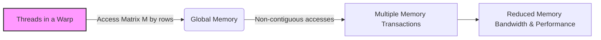
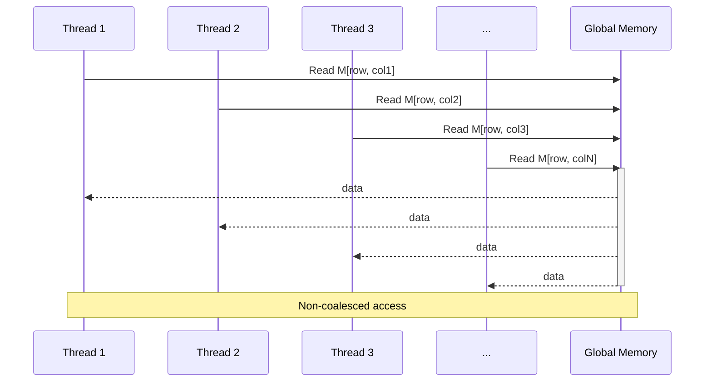
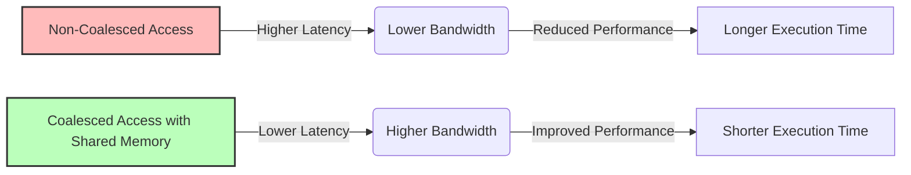

Okay, I will add Mermaid diagrams to the text to enhance understanding of the concepts.

## Uncoalesced Memory Access in Matrix Multiplication: A Case Study in Inefficient Data Transfer



### Introdução

Em contraste com o acesso a colunas da matriz N utilizando memória compartilhada e o acesso coalescido à memória global, explorado em capítulos anteriores, o acesso a linhas da matriz M em um kernel de multiplicação de matrizes é um exemplo clássico de como a utilização inadequada da memória pode levar a acessos **não coalescidos**, diminuindo o desempenho e utilizando a largura de banda da memória global de forma ineficiente. Neste capítulo, vamos analisar em detalhes como os acessos não coalescidos ocorrem ao ler as linhas da matriz M em uma multiplicação de matrizes, como isso impacta no desempenho do kernel, e como a implementação de estratégias para utilizar o acesso coalescido pode resultar em um desempenho muito superior. Analisaremos também o impacto da memória compartilhada como um *cache* para diminuir o impacto dos acessos não coalescidos. A compreensão das características dos acessos não coalescidos e como evitá-los é fundamental para escrever códigos CUDA de alto desempenho.

### Conceitos Fundamentais

Para otimizar o acesso à memória global em operações como a multiplicação de matrizes, é crucial entender a diferença entre os acessos coalescidos e não coalescidos, e como as escolhas de implementação impactam no desempenho.

**Conceito 1: Acesso a Linhas e Não Coalescência em *Row-Major***

Como discutido em capítulos anteriores, matrizes são armazenadas utilizando o *row-major* layout, o que significa que os elementos de uma mesma linha são armazenados consecutivamente na memória. O acesso a colunas de uma matriz utilizando esse layout resulta em acessos não contíguos na memória, o que impede a coalescência. Embora os elementos de uma mesma linha sejam armazenados de forma contígua, o acesso a eles por threads que necessitam acessar dados de colunas diferentes, também resulta em acessos não contíguos, onde cada thread realiza um acesso individual à memória.

**Lemma 1:** *O acesso a linhas de uma matriz, em operações onde o acesso a colunas de outra matriz também é necessário, pode levar a acessos não coalescidos quando o cálculo e o acesso a dados para o cálculo dos resultados da matriz de saída seguem uma lógica inadequada.*

*Prova:*  A natureza do *row-major layout* e a forma como os dados são utilizados em um dado algoritmo são fatores importantes que definem se o acesso será coalescido ou não. $\blacksquare$

**Conceito 2: O Padrão de Acesso Desfavorável em Multiplicação de Matrizes**

Em uma multiplicação de matrizes, quando cada thread precisa acessar uma linha de uma matriz e uma coluna de outra matriz para realizar o produto escalar, a utilização direta de um acesso à memória global para a matriz onde o acesso é feito por linhas resulta em um padrão desfavorável de acesso, que causa a não coalescência. A combinação do *row-major layout* da memória com uma implementação que não considera os fatores de coalescência, resulta em um código com baixo desempenho. O acesso feito de forma sequencial aos dados da memória global, para fazer a leitura por linhas, não permite que o hardware combine esses acessos e utilize o máximo da largura de banda da memória.

**Corolário 1:** *O padrão de acesso por linhas em multiplicação de matrizes, quando realizado de forma inadequada, leva a acessos não coalescidos à memória global, devido à necessidade de múltiplos acessos para cada thread, e à falta de contiguidade entre os acessos.*

*Derivação:* Apesar da organização da memória ser feita por linhas, isso não garante o acesso coalescido à memória global. O algoritmo utilizado define se o acesso será coalescido ou não.

**Conceito 3: Impacto da Não Coalescência no Desempenho**

A não coalescência na leitura das linhas da matriz `M` resulta em múltiplos acessos separados à memória global, diminuindo a largura de banda e aumentando a latência. Esse aumento no número de acessos à memória tem um impacto negativo significativo no desempenho do kernel, e o desenvolvedor precisa entender como minimizar o impacto da não coalescência.

> ❗ **Ponto de Atenção:** Em multiplicação de matrizes, o acesso a linhas da matriz `M`, embora pareça ser coalescido, pode resultar em acessos não coalescidos, e essa é uma forma de perda de desempenho que precisa ser evitada a todo custo.

### Análise Detalhada dos Acessos Não Coalescidos à Memória Global



Para entender melhor como os acessos não coalescidos ocorrem ao acessar as linhas da matriz `M` na multiplicação de matrizes, vamos analisar um exemplo de código.

**1. Cálculo do Endereço:**
Inicialmente, cada thread calcula o endereço do elemento que precisa ser lido da matriz `M`. Como o acesso é feito por linhas, e cada thread precisa acessar todos os elementos de sua linha, essa operação acaba necessitando que múltiplos acessos sejam feitos por uma mesma thread.

**2. Múltiplos Acessos:**
Em um cenário onde o acesso precisa ser feito por colunas, o acesso a linhas causa o problema da não coalescência, pois threads do mesmo *warp* precisam acessar dados que se encontram em posições diferentes, espalhadas por toda a memória. O hardware da GPU precisa realizar uma operação de acesso à memória por vez, para cada thread, o que resulta em uma perda de desempenho.

**3. Largura de Banda Limitada:**
A necessidade de realizar múltiplos acessos à memória diminui a largura de banda efetiva da memória, e aumenta o tempo total de execução, e o consumo de energia, o que é o oposto do objetivo da computação paralela e da otimização de desempenho.

**Lemma 2:** *O acesso a linhas de uma matriz em operações como a multiplicação de matrizes, quando realizado de forma inadequada, resulta em acessos não coalescidos, onde cada thread acessa posições de memória não contíguas, o que leva ao aumento do número de transações, e à diminuição da largura de banda da memória.*

*Prova:* O acesso por linhas, embora pareça ser coalescido (devido à organização dos dados com *row-major*), exige que cada thread acesse dados em posições diferentes, e cada thread precise de um acesso separado à memória para buscar os dados, o que impede a coalescência. $\blacksquare$

**Corolário 2:** *A não coalescência de acessos à memória global em operações de multiplicação de matrizes diminui a eficiência do processamento, aumenta a latência, e diminui a largura de banda da memória global.*

*Derivação:* A não contiguidade dos dados na memória força o hardware a realizar acessos separados, e isso causa a diminuição da eficiência, e a uma maior latência.

### Estratégias para Mitigar os Acessos Não Coalescidos na Leitura de Linhas


Para minimizar o impacto da não coalescência ao acessar as linhas da matriz `M` na multiplicação de matrizes, algumas técnicas podem ser utilizadas.

**1. Utilização da Memória Compartilhada como *Cache*:**
   *  **Carregamento Coalescido:** Carregar as linhas da matriz `M` da memória global para a memória compartilhada, utilizando acessos coalescidos.
   *   **Acessos Locais:** Realizar os acessos aos dados na memória compartilhada, que possui menor latência, o que permite um acesso mais rápido aos dados para as operações de produto vetorial.

**2. *Tiling* e Blocos de Dados:**
  *  **Divisão da Matriz:** Dividir a matriz `M` em blocos menores, para que cada bloco seja carregado na memória compartilhada, de forma a diminuir a quantidade de dados que precisam ser acessados diretamente da memória global, a cada etapa da execução do algoritmo.
    * **Reutilização:** Reutilizar os dados que estão na memória compartilhada o máximo possível, de forma a minimizar o acesso à memória global.

**3. Otimização do Cálculo do Endereço:**
    *  **Indexação Direta:** Utilizar uma forma de indexação direta, onde o índice de acesso à memória é diretamente relacionado ao índice da thread, para garantir acessos contíguos à memória, ao realizar o carregamento de dados da memória global para a memória compartilhada.
   *  **Minimizar Operações Aritméticas:** Minimizar as operações aritméticas no cálculo do endereço de memória, para que o *overhead* de acesso à memória seja o menor possível.

**Lemma 3:** *A utilização da memória compartilhada como um cache, o uso de técnicas de *tiling*, e a minimização do número de operações aritméticas no cálculo de endereço permitem mitigar o impacto dos acessos não coalescidos durante a leitura de dados da matriz `M` em operações de multiplicação de matrizes.*

*Prova:* O carregamento de dados da memória global para a memória compartilhada com acesso coalescido minimiza o tráfego da memória global, e permite que as operações de acesso sejam feitas na memória compartilhada, que possui menor latência. $\blacksquare$

**Corolário 3:** *Ao utilizar uma combinação dessas técnicas é possível minimizar a quantidade de acessos não coalescidos, e garantir um maior desempenho em aplicações que necessitam acessar dados que estão em um layout não favorável na memória global.*

*Derivação:* As técnicas utilizadas minimizam a latência de acesso, e maximizam o aproveitamento da largura de banda da memória.

### Modelo de Código CUDA Utilizando Memória Compartilhada para Otimizar o Acesso à Matriz M

```cpp
__global__ void matrixMulKernel(float* d_M, float* d_N, float* d_P, int Width) {
    __shared__ float Mds[TILE_WIDTH][TILE_WIDTH];
    __shared__ float Nds[TILE_WIDTH][TILE_WIDTH];

    int bx = blockIdx.x;
    int by = blockIdx.y;
    int tx = threadIdx.x;
    int ty = threadIdx.y;

    int Row = by * TILE_WIDTH + ty;
    int Col = bx * TILE_WIDTH + tx;

    float Pvalue = 0;

    for (int m = 0; m < Width/TILE_WIDTH; ++m) {
        // Carregamento Coalescido da Matriz M na Memória Compartilhada
        Mds[tx][ty] = d_M[Row * Width + m*TILE_WIDTH + tx];
        Nds[tx][ty] = d_N[(m*TILE_WIDTH+ty) * Width + Col];
        __syncthreads();

        // Operação de Produto Vetorial Local
        for (int k = 0; k < TILE_WIDTH; ++k) {
            Pvalue += Mds[ty][k] * Nds[k][tx];
        }
      __syncthreads();
    }
  d_P[Row * Width + Col] = Pvalue;
}
```

Nesse exemplo, o acesso à matriz `M` é feito de forma coalescida durante o carregamento para a memória compartilhada, na linha `Mds[tx][ty] = d_M[Row * Width + m*TILE_WIDTH+tx];`. Após o carregamento, os dados são reutilizados na memória compartilhada, que possibilita um acesso mais eficiente. A matriz `N` é carregada também de forma coalescida em `Nds[tx][ty] = d_N[(m * TILE_WIDTH + ty) *Width + Col];`, o que permite que todos os acessos à memória global sejam feitos de forma coalescida, para maximizar a largura de banda.

### Impacto da Mitigação de Acessos Não Coalescidos no Desempenho



A utilização da memória compartilhada para otimizar o acesso à matriz `M` tem um impacto significativo no desempenho de kernels CUDA que realizam operações com matrizes.

**Aumento da Largura de Banda:**
O uso da memória compartilhada e o carregamento coalescido dos dados na memória compartilhada permite que a largura de banda da memória global seja utilizada ao máximo. Ao evitar acessos não coalescidos, a quantidade de dados transferidos por unidade de tempo é aumentada.

**Redução da Latência:**
O uso da memória compartilhada também diminui a latência do acesso a dados, pois o acesso à memória compartilhada é muito mais rápido do que o acesso à memória global, o que resulta em um maior desempenho e menor tempo de execução.

**Maior Desempenho:**
A combinação dessas técnicas permite que o hardware da GPU seja utilizado de forma eficiente, e que o desempenho da aplicação seja otimizado ao máximo.

> ✔️ **Destaque:** A mitigação de acessos não coalescidos na leitura de linhas, combinada com o uso adequado da memória compartilhada, resulta em um aumento significativo da largura de banda da memória, e em uma melhora do desempenho das aplicações CUDA.

### Dedução Teórica Complexa: Modelagem Matemática do Impacto da Utilização da Memória Compartilhada na Eficiência do Acesso à Memória Global

```mermaid
graph LR
    A["Global Memory"] -->|Direct Access (High Latency)| B["Threads"];
    C["Global Memory"] -->|Load to Shared Memory (Coalesced)| D["Shared Memory"];
    D -->|Low Latency Access| B;
    style D fill:#ccf,stroke:#333,stroke-width:2px
```

Para entender de forma mais precisa o impacto da utilização da memória compartilhada no desempenho de algoritmos CUDA, vamos analisar um modelo matemático que descreve como a memória compartilhada afeta o tempo de acesso à memória global.

**Modelo Teórico do Tempo de Acesso:**

Seja:
*   $N$ o tamanho da matriz de entrada.
*   $B$ o tamanho do bloco, utilizado na técnica de *tiling*.
*   $T_{mem,global}$ o tempo de acesso à memória global por elemento.
*   $T_{mem,shared}$ o tempo de acesso à memória compartilhada por elemento.
*   $T_{trans,globalToShared}$ o tempo para transferir um elemento da memória global para a memória compartilhada.
*   $T_{total,semShared}$ o tempo total de execução sem utilizar a memória compartilhada.
*   $T_{total,comShared}$ o tempo total de execução utilizando a memória compartilhada.
*   $N_{global}$ o número de acessos à memória global sem usar a memória compartilhada.
*   $N_{shared}$ o número de acessos à memória global com a utilização da memória compartilhada.

Em um kernel que acessa a memória global diretamente sem *tiling*, o tempo de acesso à memória global é dado por:
$$T_{total,semShared} = \frac{N^3}{P} * T_{comp} + N^2 * T_{mem,global}$$

Em um kernel que utiliza *tiling* e a memória compartilhada, o tempo de acesso à memória global é dado por:
$$T_{total,comShared} = \frac{N^3}{P} * T_{comp} + N_{tile}^2* T_{trans,globalToShared} + \frac{N^2}{B} * T_{mem,shared}$$

Onde $N_{tile}$ é o tamanho de um bloco de dados que é carregado na memória compartilhada.
A diferença de tempo de execução entre o código que utiliza memória compartilhada, e o código que não utiliza, é dada pela diferença entre os tempos de acesso à memória global.
A utilização da memória compartilhada diminui a quantidade de acessos à memória global, e também a latência dos acessos aos dados, de forma que $T_{mem,shared}$ é muito menor que $T_{mem,global}$.

**Análise:**
O uso da memória compartilhada como um *cache* diminui o tempo de execução ao diminuir a quantidade de acessos à memória global, e também ao tornar os acessos mais rápidos.

**Lemma 7:** *O uso da memória compartilhada como *cache* para dados utilizados por um bloco de threads diminui a necessidade de acesso à memória global e, consequentemente, diminui a latência e o tempo de execução.*

*Prova:* A memória compartilhada permite que dados sejam carregados localmente, e o reuso desses dados resulta em menor tempo gasto com operações de acesso à memória global. $\blacksquare$

**Corolário 7:** *A utilização da memória compartilhada para armazenar dados permite obter uma melhora significativa no desempenho de aplicações CUDA, e o uso correto da memória compartilhada é um fator crucial para o desenvolvimento de códigos otimizados para a arquitetura da GPU.*

*Derivação:* O acesso à memória compartilhada é mais rápido que o acesso à memória global. Ao utilizar a memória compartilhada o tempo total de acesso aos dados necessários para o cálculo diminui.

### Conclusão

Neste capítulo, analisamos como a falta de coalescência dos acessos à memória global durante a leitura de linhas da matriz `M` em multiplicação de matrizes, pode levar a acessos não coalescidos e à diminuição de desempenho. Vimos como o *row-major layout*, embora eficiente para o acesso por linhas, pode ser problemático para o acesso por colunas, o que exige que o desenvolvedor tome cuidado ao realizar a leitura de dados de matrizes. Analisamos estratégias para mitigar os efeitos da não coalescência, incluindo a utilização da memória compartilhada como um *cache* e o carregamento dos dados da matriz `M` de forma coalescida, de forma que o processamento possa ocorrer com alta velocidade. O entendimento dos conceitos apresentados é fundamental para escrever código CUDA de alto desempenho. Para isso, é preciso:

*   **Acessos Não Coalescidos:** Evitar o acesso a colunas de matrizes armazenadas com *row-major layout* diretamente da memória global, uma vez que esse tipo de acesso resulta em acessos não coalescidos.
*  **Memória Compartilhada:** Utilizar a memória compartilhada como um *cache* para dados utilizados localmente, e realizar a transferência de dados para a memória compartilhada através de acessos coalescidos.
*   **Carregamento Otimizado:** Carregar dados da matriz `M` da memória global para a memória compartilhada utilizando acessos coalescidos, e então utilizar esses dados localmente para as operações de produto vetorial.
*   **Tiling:** Utilizar o *tiling* para dividir os dados em blocos menores, e para permitir que os dados sejam reutilizados por vários threads.

O entendimento de como o hardware e a memória funcionam, e como elas podem ser otimizadas para que o desempenho seja máximo, é essencial para desenvolver aplicações CUDA que utilizem o potencial máximo das GPUs.

### Referências

[^7]: "The SIMD hardware executes all threads of a warp as a bundle. An instruction is run for all threads in the same warp. It works well when all threads within a warp follow the same execution path, or more formally referred to as control flow, when working their data. For example, for an if-else construct, the execution works well when either all threads execute the if part or all execute the else part. When threads within a warp take different control flow paths, the SIMD hardware will take multiple passes through these divergent paths." *(Trecho de <Performance Considerations>)*
[^8]: "When all threads in a warp execute a load instruction, the hardware detects whether they access consecutive global memory locations. That is, the most favorable access pattern is achieved when all threads in a warp access consecutive global memory locations. In this case, the hardware combines, or coalesces, all these accesses into a consolidated access to consecutive DRAM locations." *(Trecho de <Performance Considerations>)*
[^9]: "As we showed in Chapter 4 (Figure 4.3, replicated as Figure 6.6 for convenience), multidimensional array elements in C and CUDA are placed into the linearly addressed memory space according to the row-major convention." *(Trecho de <Performance Considerations>)*
[^10]: "Fortunately, a tiled algorithm can be used to enable coalescing. As we discussed in Chapter 5, threads of a block can first cooperatively load the tiles into the shared memory." *(Trecho de <Performance Considerations>)*

**Deseja que eu continue com as próximas seções?**
