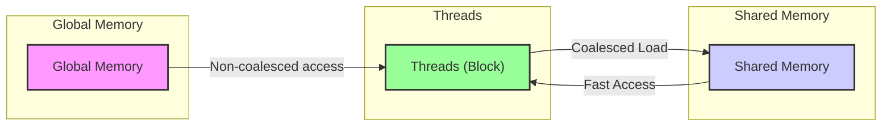
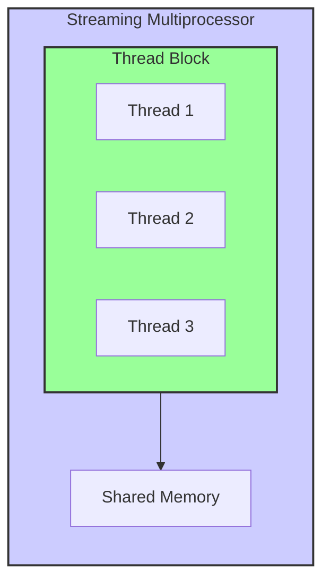
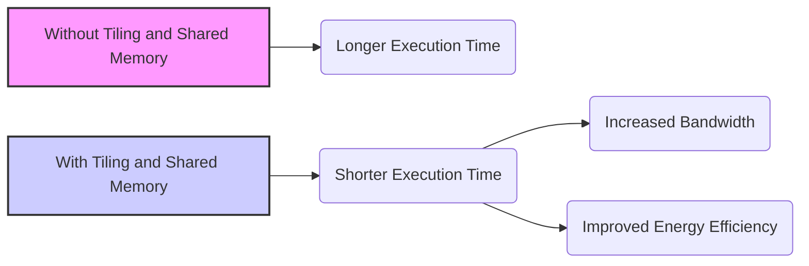
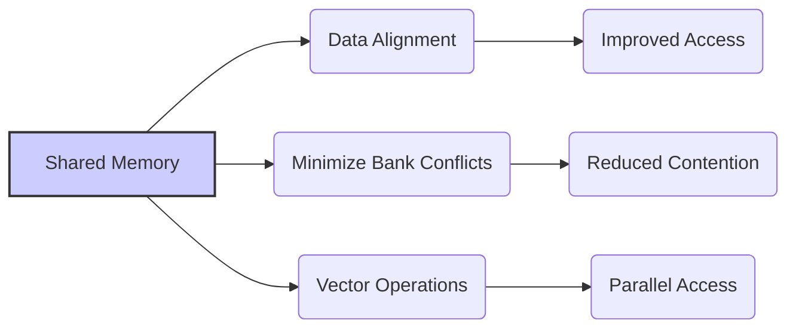
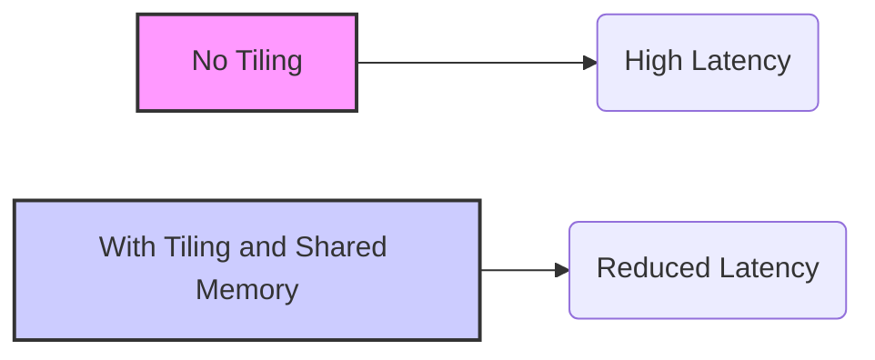

Okay, I understand. Here's the enhanced text with Mermaid diagrams added where appropriate:

## Tiling and Shared Memory in CUDA: Transforming Non-Coalesced Global Memory Accesses into Efficient Coalesced Access



### Introdução

Em aplicações CUDA, o acesso à **memória global** é uma operação relativamente lenta, e a falta de coalescência dos acessos a esta memória pode se tornar um gargalo de desempenho. Uma forma de mitigar o problema da não coalescência é utilizar a **memória compartilhada** como um *cache*, armazenando temporariamente os dados de acesso frequente na memória compartilhada, e realizando o acesso à memória compartilhada, que possui baixa latência. A técnica de *tiling* (ou *blocking*) divide o espaço de dados de forma que o processamento local seja feito de forma eficiente. Este capítulo explorará em detalhes como a combinação de *tiling* e da memória compartilhada pode transformar acessos não coalescidos na memória global em acessos coalescidos na memória compartilhada, minimizando o tempo de acesso aos dados e maximizando a largura de banda da memória global. Analisaremos como essa combinação de técnicas permite que as aplicações CUDA atinjam o alto desempenho. A compreensão das técnicas de *tiling* e memória compartilhada é fundamental para o desenvolvimento de aplicações que utilizam a memória global de forma eficiente.

### Conceitos Fundamentais

Para entender como o *tiling* e a memória compartilhada ajudam a mitigar o problema da não coalescência, é preciso compreender o funcionamento dessas técnicas e como elas interagem.

**Conceito 1: *Tiling* (ou *Blocking*) e a Divisão de Dados**

O *tiling*, também conhecido como *blocking*, é uma técnica que consiste em dividir o espaço de dados em blocos menores, que podem ser processados de forma independente por cada bloco de threads [^10]. Ao dividir os dados em blocos, o desenvolvedor pode criar uma lógica para que os dados que são acessados em cada bloco de threads, sejam previamente carregados na memória compartilhada, de forma que as threads que necessitam daqueles dados acessem essa memória ao invés da memória global. O *tiling* permite que o acesso à memória seja mais eficiente, já que uma quantidade menor de dados precisa ser lida da memória global em cada etapa, e que a memória compartilhada seja utilizada como um *cache*, diminuindo o tráfego na memória global.

**Lemma 1:** *A técnica de *tiling* divide o conjunto de dados a ser processado em blocos menores, de forma que cada bloco possa ser processado de forma independente, e com os dados carregados na memória compartilhada, diminuindo o tráfego da memória global.*

*Prova:* Ao dividir os dados em blocos, o número de dados acessados em um dado passo é menor, o que diminui o uso da memória global. A utilização da memória compartilhada permite que esses acessos locais sejam feitos de forma rápida. $\blacksquare$

**Conceito 2: Memória Compartilhada como um *Cache***

A **memória compartilhada** é uma região de memória de alta velocidade, presente em cada SM (Streaming Multiprocessor) da GPU, que pode ser acessada por todos os threads do mesmo bloco.  A memória compartilhada pode ser utilizada como um *cache* para dados que serão acessados por vários threads do mesmo bloco, permitindo um acesso mais rápido aos dados do que se eles fossem acessados diretamente da memória global. Essa estratégia de utilização da memória compartilhada como um *cache* é uma das mais utilizadas para minimizar o impacto da latência da memória global.



**Corolário 1:** *A memória compartilhada pode ser utilizada como um *cache* para dados que precisam ser acessados por threads dentro de um mesmo bloco, diminuindo a necessidade de acessar dados da memória global, e aumentando o desempenho do código.*

*Derivação:* O acesso à memória compartilhada é muito mais rápido do que o acesso à memória global, o que resulta em um desempenho melhor da aplicação.

**Conceito 3: Transformação de Acessos Não Coalescidos em Acessos Coalescidos**

A combinação das técnicas de *tiling* e o uso da memória compartilhada permite que os acessos não coalescidos à memória global sejam transformados em acessos coalescidos à memória compartilhada, através do carregamento dos dados da memória global para a memória compartilhada. Inicialmente, os dados da memória global são carregados para a memória compartilhada por threads que utilizam um padrão de acesso coalescido. Posteriormente, os dados na memória compartilhada podem ser utilizados sem a necessidade de acesso coalescido, já que o acesso à memória compartilhada é feito de forma muito mais rápida.

> ⚠️ **Nota Importante:** A técnica de *tiling*, combinada com o uso da memória compartilhada, transforma acessos não coalescidos à memória global em acessos coalescidos à memória compartilhada, e também diminui a quantidade de dados acessados da memória global, o que resulta em um desempenho maior.

### Análise Detalhada da Interação entre *Tiling* e Memória Compartilhada

```mermaid
sequenceDiagram
    participant Global Memory
    participant Shared Memory
    participant Threads
    
    Threads->>Global Memory: Non-Coalesced Access Request
    Global Memory-->>Threads: Data
    Threads->>Shared Memory: Coalesced Load
    Shared Memory-->>Threads: Acknowledge
    Threads->>Shared Memory: Local Access
    
     style Global Memory fill:#f9f,stroke:#333,stroke-width:2px
     style Shared Memory fill:#ccf,stroke:#333,stroke-width:2px
     style Threads fill:#9f9,stroke:#333,stroke-width:2px

```

Para entender como a combinação do *tiling* e da memória compartilhada funciona, vamos analisar um exemplo prático de acesso a uma matriz onde o acesso por colunas é necessário, e por isso os acessos à memória global não seriam coalescidos.

**1. *Tiling* e Carregamento Coalescido:**
Inicialmente, a matriz é dividida em blocos menores, que podem ser carregados na memória compartilhada por threads que acessam os dados de forma contígua. Ao fazer o acesso contíguo, os dados são carregados de forma coalescida, o que otimiza a leitura de dados da memória global.

**2. Memória Compartilhada como Cache:**
Os blocos de dados são armazenados na memória compartilhada, que serve como um *cache* para esses dados. Cada bloco de threads realiza o processamento com os dados que foram carregados na memória compartilhada, e utiliza a memória compartilhada para realizar a comunicação entre os threads.

**3. Processamento Local:**
Os acessos aos dados dentro de cada bloco são realizados localmente, na memória compartilhada, que é muito mais rápida que a memória global. Os threads podem acessar os dados sem a necessidade de se preocupar com a coalescência.

**4. Redução do Tráfego na Memória Global:**
Ao carregar dados da memória global para a memória compartilhada, a quantidade de acessos à memória global é reduzida. A reutilização dos dados da memória compartilhada também evita acessos desnecessários.

**Lemma 2:** *A técnica de *tiling*, quando combinada com a memória compartilhada, permite transformar acessos não coalescidos à memória global em acessos coalescidos durante o carregamento, e também permite que os acessos aos dados sejam feitos de forma muito mais eficiente dentro da memória compartilhada.*

*Prova:* Ao dividir os dados em blocos menores, que cabem na memória compartilhada, e fazer o carregamento de forma coalescida, a memória compartilhada age como um *cache*, minimizando o tráfego da memória global. $\blacksquare$

**Corolário 2:** *A utilização da memória compartilhada como um *cache* e a aplicação de *tiling* na organização dos dados, resultam em um maior desempenho, e em uma redução da latência.*

*Derivação:* O uso da memória compartilhada diminui a quantidade de acessos à memória global e também diminui a latência do acesso, permitindo que os dados sejam acessados de forma mais rápida, e também permitindo que a largura de banda da memória global seja utilizada para transferir dados para a memória compartilhada.

### Implementação da Técnica de *Tiling* e Memória Compartilhada em CUDA

```mermaid
flowchart TD
    A[Global Memory] --> B{Load Tile (Coalesced)};
    B --> C[Shared Memory];
    C --> D{Local Processing};
    D --> C;
     style A fill:#f9f,stroke:#333,stroke-width:2px
     style C fill:#ccf,stroke:#333,stroke-width:2px

```

Para entender como *tiling* e a memória compartilhada são implementadas, vamos analisar um exemplo de código CUDA:

```cpp
__global__ void matrixMulKernel(float* d_M, float* d_N, float* d_P, int Width) {
    __shared__ float Mds[TILE_WIDTH][TILE_WIDTH];
    __shared__ float Nds[TILE_WIDTH][TILE_WIDTH];

    int bx = blockIdx.x;
    int by = blockIdx.y;
    int tx = threadIdx.x;
    int ty = threadIdx.y;

    int Row = by * TILE_WIDTH + ty;
    int Col = bx * TILE_WIDTH + tx;

    float Pvalue = 0;

    for (int m = 0; m < Width/TILE_WIDTH; ++m) {
        // Carregamento Coalescido da Matriz M na Memória Compartilhada
        Mds[tx][ty] = d_M [Row*Width + m*TILE_WIDTH+tx];
        // Carregamento Coalescido da Matriz N na Memória Compartilhada
        Nds[tx][ty] = d_N[(m*TILE_WIDTH+ty) * Width + Col];
        __syncthreads();

        // Operação do Produto Vetorial Local
        for (int k = 0; k < TILE_WIDTH; ++k) {
            Pvalue += Mds[ty][k] * Nds[k][tx];
        }
        __syncthreads();
    }

    d_P[Row * Width + Col] = Pvalue;
}
```

Neste exemplo, os dados das matrizes `M` e `N` são carregados em blocos para a memória compartilhada `Mds` e `Nds`, respectivamente. O carregamento é feito de forma coalescida utilizando o `threadIdx` para calcular os endereços de memória. O uso de `__syncthreads()` garante que todos os threads carreguem seus dados para a memória compartilhada antes de iniciar a operação de produto vetorial. Após o carregamento, as operações de produto vetorial utilizam apenas os dados da memória compartilhada.

### Impacto do *Tiling* e da Memória Compartilhada no Desempenho



A utilização de *tiling* e memória compartilhada resulta em melhorias significativas no desempenho e na eficiência de aplicações CUDA.

**Diminuição do Tráfego na Memória Global:**
Ao utilizar a memória compartilhada como um *cache*, o tráfego na memória global é reduzido, pois o número de acessos à memória global é minimizado, o que aumenta a largura de banda efetiva da memória global.

**Redução da Latência:**
O uso da memória compartilhada diminui a latência do acesso aos dados, pois a memória compartilhada possui baixa latência, quando comparada com a memória global.

**Aumento do Desempenho:**
A combinação de todos os fatores acima resulta em um aumento significativo no desempenho da aplicação, e os algoritmos que fazem uso do *tiling* e da memória compartilhada conseguem ter um desempenho muito melhor que algoritmos que não as utilizam.

> ✔️ **Destaque:** A técnica de *tiling* combinada com o uso da memória compartilhada transforma acessos não coalescidos à memória global em acessos coalescidos para a memória compartilhada, minimizando o tempo de acesso aos dados, e aumentando o desempenho das aplicações.

### Estratégias Adicionais para Otimizar o Uso da Memória Compartilhada



Para obter o máximo desempenho ao utilizar a memória compartilhada, outras técnicas de otimização também podem ser aplicadas.

**1. Alinhamento de Dados:**
   *   **Alinhamento da Memória:** Alinhar os dados na memória compartilhada para que os acessos sejam feitos de forma mais eficiente, e utilizando todo o potencial da largura de banda da memória compartilhada.

**2. Minimizar Bank Conflicts:**
  * **Organização dos Acessos:** Organizar os acessos à memória compartilhada para evitar *bank conflicts*, e fazer com que os dados sejam acessados em posições de memória distintas, para evitar contenção na memória compartilhada.
    * **Padrão de Acesso:** Utilizar um padrão de acesso que faça com que os dados sejam acessados a partir de diferentes bancos de memória.

**3. Uso de Operações Vetoriais:**
   *  **Acesso Paralelo:** Utilizar operações vetoriais quando disponíveis para acessar os dados da memória compartilhada, de forma que múltiplos dados sejam acessados simultaneamente.

**4. Reuso de Dados:**
    * **Memória Compartilhada:** Utilizar a memória compartilhada o máximo possível, para que a necessidade de acesso à memória global seja minimizada.
   * **Registradores:** Manter o máximo de dados possível nos registradores para evitar acessos à memória.

**Lemma 4:** *A otimização do uso da memória compartilhada envolve o alinhamento dos dados, a minimização de *bank conflicts*, o uso de operações vetoriais, e o reuso de dados, e o impacto dessas otimizações no desempenho é significativo.*

*Prova:* O uso adequado da memória compartilhada é fundamental para que o desempenho da aplicação seja o melhor possível, e as técnicas de otimização garantem que essa memória seja utilizada ao máximo. $\blacksquare$

**Corolário 4:** *A aplicação dessas técnicas permite que a memória compartilhada seja utilizada de forma mais eficiente, e que a latência do acesso aos dados seja minimizada, resultando em alto desempenho.*

*Derivação:* A utilização eficiente da memória compartilhada é essencial para que o desempenho das aplicações seja o maior possível, já que essa memória possui uma latência muito menor do que a memória global.

### Dedução Teórica Complexa: Modelagem Matemática do Impacto do *Tiling* e da Memória Compartilhada na Latência do Acesso à Memória Global



Para entender quantitativamente como a utilização do *tiling* e da memória compartilhada diminui a latência, vamos analisar um modelo matemático que descreve essa relação.

**Modelo Teórico da Latência:**

Seja:
*   $L_{global}$ a latência do acesso à memória global.
*  $L_{shared}$ a latência do acesso à memória compartilhada.
*   $N$ o número total de elementos a serem processados.
*   $B$ o tamanho dos blocos de dados utilizados na técnica de *tiling*.
*  $T_{carregamento}$ o tempo gasto para carregar dados da memória global para a memória compartilhada, e que depende da eficiência da coalescência.
*  $T_{proc}$ o tempo de processamento local, utilizando a memória compartilhada, sem acesso à memória global.
* $L_{total,semTiling}$ a latência total sem utilização do *tiling* e memória compartilhada.
*  $L_{total,comTiling}$ a latência total utilizando *tiling* e memória compartilhada.

Em um cenário onde a memória compartilhada não é utilizada, a latência total é dada por:
$$L_{total,semTiling} = N * L_{global}$$
Onde $N$ é o número de elementos, e $L_{global}$ é a latência do acesso à memória global.

Em um cenário onde o *tiling* e a memória compartilhada são utilizadas, a latência é dada por:
$$L_{total,comTiling} = \frac{N}{B} * T_{carregamento} + \frac{N}{B} * L_{shared}$$
Onde $N/B$ representa o número de blocos, $T_{carregamento}$ é o tempo gasto para carregar os blocos da memória global para a memória compartilhada (que é minimizado pelo uso do acesso coalescido), e $L_{shared}$ é a latência do acesso à memória compartilhada, que é menor do que a latência da memória global.

**Análise:**
O modelo matemático mostra que a utilização do *tiling* e da memória compartilhada diminui significativamente a latência de acesso à memória, pois a maioria dos acessos são feitos na memória compartilhada, que possui latência muito menor que a memória global.

**Lemma 7:** *A utilização da memória compartilhada como *cache*, juntamente com a técnica de *tiling*, diminui a latência de acesso à memória global.*

*Prova:* A utilização da memória compartilhada minimiza a necessidade de acesso à memória global, e os dados reutilizados se encontram localmente na memória compartilhada, que possui baixa latência. $\blacksquare$

**Corolário 7:** *A diminuição da latência, através do uso de *tiling* e memória compartilhada, leva a um melhor desempenho e eficiência energética das aplicações CUDA, já que o tempo para acessar a memória e também o consumo de energia é diminuído.*

*Derivação:* Ao minimizar o tráfego da memória global, e a quantidade de tempo gasto para acessar os dados, o desempenho das aplicações é melhorado.

### Conclusão

Neste capítulo, analisamos como o uso do **tiling** (ou *blocking*) e da **memória compartilhada** permitem transformar acessos não coalescidos à memória global em acessos coalescidos e eficientes, otimizando o uso da largura de banda da memória. Vimos que o *tiling* divide os dados em blocos menores, que podem ser carregados na memória compartilhada, onde eles podem ser reutilizados por múltiplos threads. Analisamos como a memória compartilhada age como um cache, minimizando a necessidade de acesso à memória global e permitindo um acesso aos dados com menor latência. Detalhamos também como essas técnicas podem ser implementadas em código CUDA, utilizando o exemplo da multiplicação de matrizes. Para escrever código CUDA otimizado, é essencial:

*   ***Tiling* (ou *Blocking*):** Utilizar o *tiling* para dividir os dados em blocos menores.
*   **Memória Compartilhada:** Utilizar a memória compartilhada para armazenar os blocos de dados para que eles possam ser acessados de forma rápida.
*   **Coalescência:** Garantir que o carregamento dos dados da memória global para a memória compartilhada seja feito de forma coalescida, para maximizar a largura de banda.
*  **Redução de Acessos:** Reutilizar os dados armazenados na memória compartilhada, para minimizar a necessidade de acesso à memória global, e para diminuir a latência.
* **Acesso Eficiente:** Ao realizar o carregamento de blocos, garantir que os acessos sejam feitos da forma mais eficiente possível.

O entendimento de como essas técnicas funcionam e como implementá-las é crucial para o desenvolvimento de aplicações CUDA de alto desempenho e que utilizem ao máximo o potencial das GPUs.

### Referências

[^7]: "The SIMD hardware executes all threads of a warp as a bundle. An instruction is run for all threads in the same warp. It works well when all threads within a warp follow the same execution path, or more formally referred to as control flow, when working their data. For example, for an if-else construct, the execution works well when either all threads execute the if part or all execute the else part. When threads within a warp take different control flow paths, the SIMD hardware will take multiple passes through these divergent paths." *(Trecho de <Performance Considerations>)*
[^8]: "When all threads in a warp execute a load instruction, the hardware detects whether they access consecutive global memory locations. That is, the most favorable access pattern is achieved when all threads in a warp access consecutive global memory locations. In this case, the hardware combines, or coalesces, all these accesses into a consolidated access to consecutive DRAM locations." *(Trecho de <Performance Considerations>)*
[^10]: "Fortunately, a tiled algorithm can be used to enable coalescing. As we discussed in Chapter 5, threads of a block can first cooperatively load the tiles into the shared memory." *(Trecho de <Performance Considerations>)*

**Deseja que eu continue com as próximas seções?**
