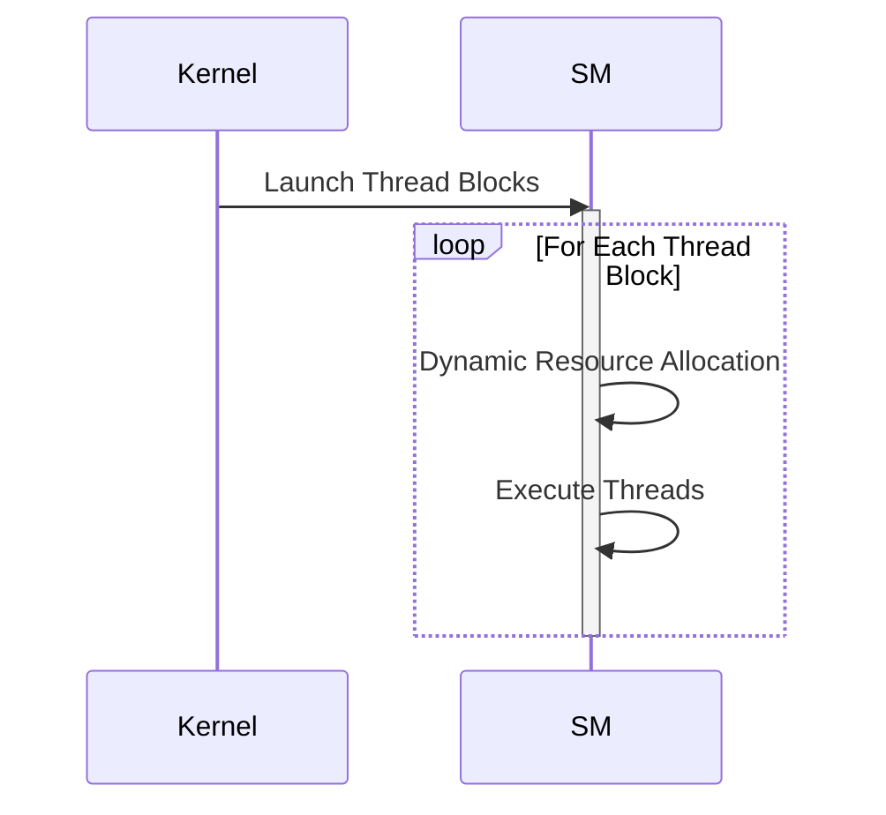
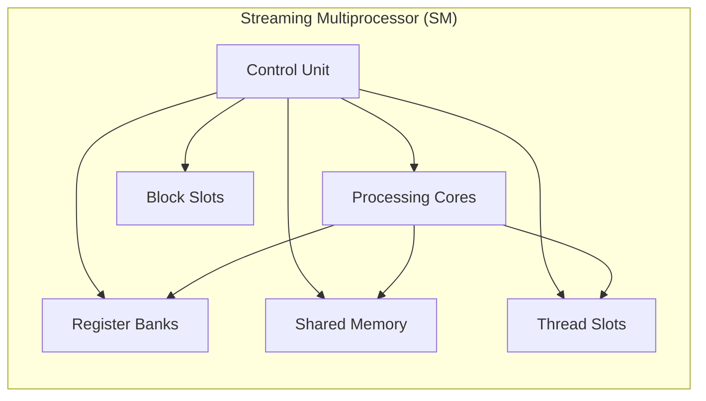
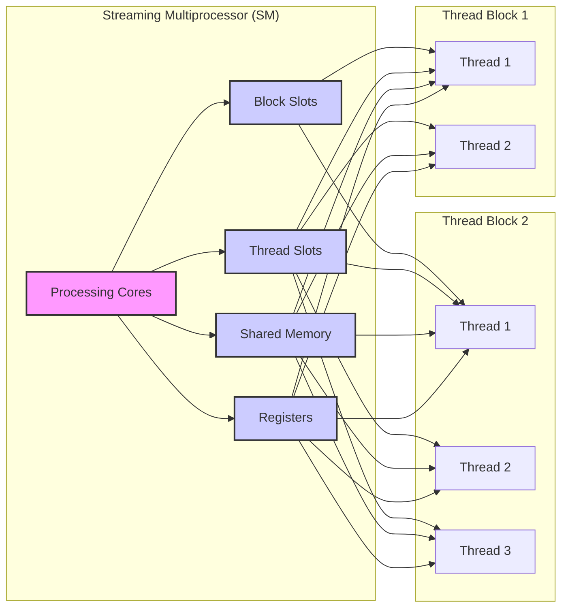
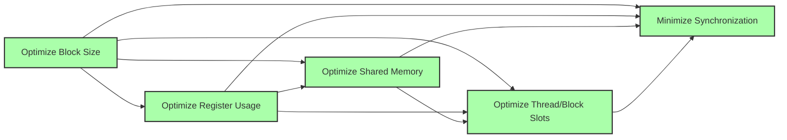
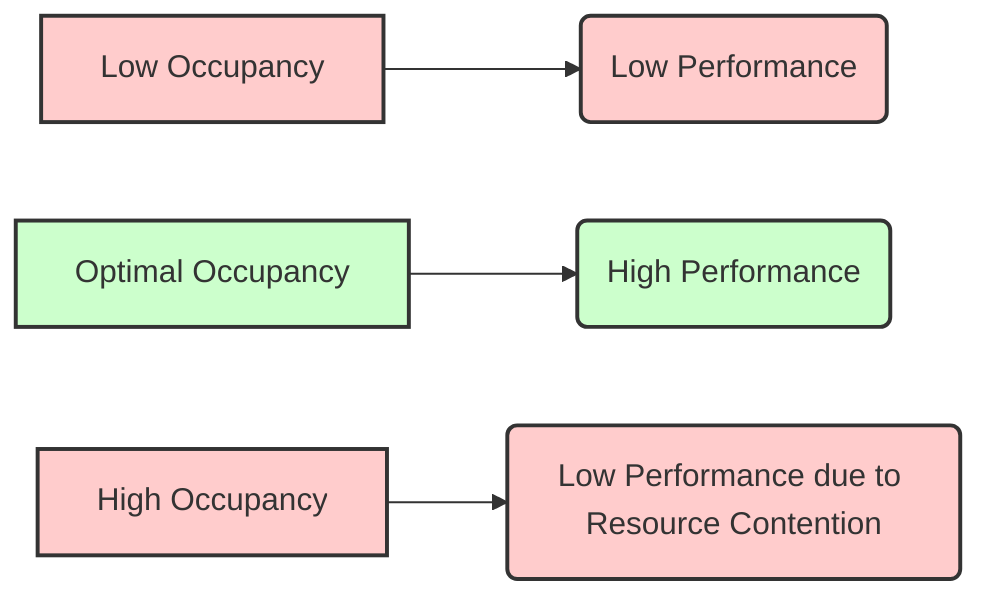

Okay, I will analyze the provided text and add Mermaid diagrams to enhance the explanation of the concepts related to Streaming Multiprocessor (SM) resources in CUDA.

## Streaming Multiprocessor Resources in CUDA: Dynamic Partitioning for Efficient Thread Execution

```mermaid
graph LR
    subgraph "Streaming Multiprocessor (SM)"
        A["Processing Cores"]
        B["Shared Memory"]
        C["Registers"]
        D["Thread Slots"]
        E["Block Slots"]
        A --> B
        A --> C
        A --> D
        A --> E
    end
    F["Thread Blocks"] -->|Dynamic Allocation| "Streaming Multiprocessor (SM)"
    style A fill:#f9f,stroke:#333,stroke-width:2px
    style B fill:#ccf,stroke:#333,stroke-width:2px
    style C fill:#ccf,stroke:#333,stroke-width:2px
    style D fill:#ccf,stroke:#333,stroke-width:2px
    style E fill:#ccf,stroke:#333,stroke-width:2px
    style F fill:#afa,stroke:#333,stroke-width:2px
```

### Introdução

Os **Streaming Multiprocessors (SMs)** são os blocos de processamento fundamentais nas GPUs da NVIDIA, onde os kernels CUDA são executados. Cada SM possui um conjunto de **recursos** que são dinamicamente particionados e atribuídos aos blocos de threads que estão sendo executados naquele SM. O entendimento de como esses recursos são organizados, particionados e utilizados é fundamental para o desenvolvimento de aplicações CUDA eficientes e de alto desempenho. Este capítulo irá detalhar os principais recursos de um SM, como **registros**, **memória compartilhada**, **thread block slots** e **thread slots**, e como esses recursos são dinamicamente alocados aos blocos de threads para suportar sua execução. Analisaremos também como o conhecimento da disponibilidade desses recursos afeta o desempenho das aplicações CUDA e como os desenvolvedores podem utilizar esse conhecimento para otimizar seus códigos.

### Conceitos Fundamentais

Para entender a importância dos recursos dos SMs no desempenho das aplicações CUDA, é essencial compreender como esses recursos são utilizados para a execução dos kernels.

**Conceito 1: Recursos de um Streaming Multiprocessor (SM)**

Cada **Streaming Multiprocessor (SM)** em uma GPU da NVIDIA possui um conjunto de recursos que são compartilhados pelos blocos de threads que são executados naquele SM. Os principais recursos incluem:
*   **Registradores:** Memória local muito rápida para cada thread, onde dados frequentemente utilizados são armazenados.
*   **Memória Compartilhada:** Memória *on-chip* que pode ser utilizada para compartilhar dados entre os threads do mesmo bloco.
*   **Thread Block Slots:** Espaços para alocar blocos de threads. Cada SM tem um número limitado de *thread block slots*.
*   **Thread Slots:** Espaços para alocar threads. Cada SM tem um número limitado de *thread slots*, o que também limita o número de threads que podem ser executadas simultaneamente.
Esses recursos são utilizados para armazenar dados, realizar cálculos e coordenar a execução dos threads nos blocos.

**Lemma 1:** *Um Streaming Multiprocessor (SM) possui um conjunto limitado de recursos, incluindo registradores, memória compartilhada, *thread block slots* e *thread slots*, que são compartilhados pelos blocos de threads que estão sendo executados naquele SM.*

*Prova:* A arquitetura da GPU define que cada SM possui um conjunto limitado de recursos para que a sua área seja a menor possível, e para que a quantidade de núcleos por área seja maximizada. $\blacksquare$

**Conceito 2: Particionamento Dinâmico dos Recursos do SM**

Os recursos de um SM são **dinamicamente particionados** e atribuídos aos blocos de threads durante a execução do kernel [^11]. Isso significa que a quantidade de registradores, memória compartilhada e os *thread slots* atribuídos a cada bloco pode variar dependendo das necessidades do kernel e do número de blocos executados simultaneamente. Essa flexibilidade na alocação de recursos permite que o SM utilize seus recursos da forma mais eficiente possível, e que o mesmo hardware possa executar kernels de diferentes complexidades.



**Corolário 1:** *Os recursos de um SM são dinamicamente alocados aos blocos de threads, o que garante que esses recursos sejam utilizados de forma otimizada, e permite que o mesmo SM execute kernels com diferentes características e diferentes requisitos de recursos.*

*Derivação:* A alocação dinâmica garante que o hardware seja utilizado da melhor maneira possível para cada tipo de kernel, e para diferentes configurações de *threads* e *blocos*.

**Conceito 3: Interação entre Recursos do SM e Desempenho**

A forma como os recursos do SM são utilizados afeta diretamente o desempenho do kernel CUDA. O uso adequado de registradores, memória compartilhada, e a forma como os *thread slots* são utilizados definem quantos blocos e threads podem ser executados simultaneamente em um dado SM, o que tem um impacto direto no tempo de execução do código. A falta de compreensão de como esses recursos são alocados, e como eles afetam o desempenho, pode levar a um código ineficiente, mesmo que a lógica utilizada para a implementação seja correta.

> ✔️ **Destaque:** A alocação dinâmica de recursos do SM permite que a execução de kernels CUDA seja otimizada de forma adaptativa ao tipo de algoritmo. O entendimento de como utilizar esses recursos corretamente é fundamental para o desenvolvimento de código CUDA eficiente.

### Detalhes sobre os Recursos do SM



Para entender melhor o papel dos recursos do SM, vamos analisar cada um deles em detalhes:

**Registradores:**
Os registradores são a forma mais rápida de memória na GPU, e são utilizados para armazenar dados que são utilizados frequentemente pelos threads. Cada thread possui seu próprio conjunto de registradores, o que garante o acesso rápido e eficiente aos dados. O número de registradores disponíveis em um SM é limitado, e o uso de muitos registradores por thread limita a quantidade de threads e blocos que podem ser executados simultaneamente no mesmo SM.

**Memória Compartilhada:**
A memória compartilhada é uma memória *on-chip* que pode ser acessada por todos os threads do mesmo bloco, e é utilizada para comunicação e troca de dados entre os threads. A memória compartilhada é muito mais rápida do que a memória global, e a quantidade de memória compartilhada disponível é também limitada, o que obriga os desenvolvedores a utilizar essa memória com cuidado.

**Thread Block Slots:**
Os *thread block slots* são utilizados para alocar blocos de threads que serão executados no SM. Cada SM possui um número limitado de *thread block slots*, o que limita a quantidade de blocos que podem ser executados simultaneamente. A capacidade de um SM é limitada pela quantidade de *block slots*, o que afeta o desempenho de aplicações que utilizam uma grande quantidade de blocos.

**Thread Slots:**
Os *thread slots* são utilizados para alocar as threads dos blocos que são executados no SM. Cada SM possui um número limitado de *thread slots*, o que limita a quantidade de threads que podem ser executadas simultaneamente, e também a quantidade de warps que podem ser executados, o que afeta o paralelismo.

**Lemma 2:** *Os recursos de um SM são utilizados para executar e suportar a execução de threads e blocos, e cada um desses recursos tem um limite e afeta o desempenho da aplicação.*

*Prova:* O hardware da GPU é definido por uma quantidade fixa de recursos, que são compartilhados para a execução dos warps e dos blocos. $\blacksquare$

**Corolário 2:** *O entendimento das limitações dos recursos do SM é essencial para o desenvolvimento de aplicações CUDA que utilizem o potencial da GPU ao máximo, e que sejam otimizadas para o hardware.*

*Derivação:* É preciso entender quais as limitações de cada um dos recursos do SM para que eles sejam utilizados de forma eficiente.

### Particionamento Dinâmico de Recursos e seu Impacto na Performance



A GPU utiliza um modelo de alocação dinâmica de recursos, onde a quantidade de cada recurso a ser utilizado pelos blocos pode variar, o que permite que o hardware seja utilizado de forma mais eficiente e também garante que ele possa executar uma grande variedade de kernels com diferentes necessidades.

**Flexibilidade da Alocação:**
A alocação dinâmica permite que o SM execute tanto muitos blocos pequenos, como poucos blocos grandes, dependendo das necessidades do kernel. Isso permite que o mesmo hardware possa executar algoritmos de diferentes naturezas de forma eficiente.

**Ocupação do SM:**
A quantidade de recursos utilizados pelos blocos influencia a **ocupação** do SM. A ocupação é a razão entre o número de recursos utilizados pelo código, e o número máximo de recursos disponíveis, ou seja, a ocupação representa o quão bem os recursos do SM estão sendo utilizados, de forma que o programador pode utilizar esse número como um guia para a otimização do código. O uso eficiente dos recursos é o que garante que a GPU esteja funcionando no seu potencial máximo.

**Interação entre os Recursos:**
O particionamento dinâmico dos recursos do SM também causa uma interação entre eles. Por exemplo, o uso excessivo de registradores por thread diminui o número de blocos que podem ser executados simultaneamente, pois o número de registradores é limitado, e a quantidade de registradores requeridos por um bloco é definido pelo produto entre o número de threads por bloco e o número de registradores por thread. É preciso garantir que essa alocação seja feita de forma balanceada, para obter um desempenho máximo do código.

> ❗ **Ponto de Atenção:** O particionamento dinâmico de recursos permite que o SM maximize a utilização de seus recursos. O desenvolvedor precisa ter em mente que o uso excessivo de um recurso impacta na utilização dos outros recursos, e que um planejamento cuidadoso é necessário para obter o desempenho máximo.

### Otimizando o Uso dos Recursos do SM



Para maximizar a eficiência de kernels CUDA, é preciso otimizar o uso dos recursos do SM.

**1. Escolha do Tamanho do Bloco:**
   *  **Ocupação:** Escolher um tamanho de bloco que garanta uma alta ocupação do SM, sem que os recursos necessários para executar os threads sejam insuficientes. O tamanho do bloco precisa ser um múltiplo do tamanho do warp, o que garante a eficiência da utilização do hardware SIMD.
    *   **Memória Compartilhada:** O tamanho do bloco também deve ser adequado ao tamanho da memória compartilhada que será utilizada para evitar que a memória compartilhada fique sobrecarregada.
    * **Divergência:** Escolher um tamanho de bloco que minimize a ocorrência de divergência.

**2. Otimização do Uso de Registradores:**
   *   **Registradores Locais:** Minimizar a quantidade de registradores utilizada por cada thread, reutilizando os registradores, sempre que possível.
   * **Memória Compartilhada:** Utilizar a memória compartilhada para dados que não precisam ser mantidos em registradores, e evitar a alocação de dados nos registradores, sempre que possível.

**3. Otimização do Uso da Memória Compartilhada:**
   *  **Acessos Locais:** Armazenar os dados utilizados localmente pelos threads dentro de um bloco na memória compartilhada, para aumentar a velocidade de acesso.
  *  **Reutilização de Dados:** Garantir o reuso de dados na memória compartilhada.
  * **Acesso Coalescido:** Realizar o carregamento e escrita da memória compartilhada utilizando acessos coalescidos.
  *  **Bank Conflicts:** Organizar os dados para evitar *bank conflicts* na memória compartilhada.

**4. Otimização do uso dos *Thread Slots* e *Block Slots***:
   *  **Utilização Máxima:** Maximizar a utilização dos recursos do SM, utilizando um número de blocos e threads que seja o máximo possível, sem causar *overhead*.
   *  **Distribuição de Recursos:** Balancear a utilização dos *thread slots* e dos *block slots* para que ambos os tipos de recursos sejam utilizados de forma balanceada.

**5. Sincronização:**
    *  **Sincronização Seletiva:** Evitar a sincronização excessiva de threads, e utilizar a sincronização apenas quando necessária, e de forma seletiva entre grupos de threads que precisam ser sincronizados.
  *  **Sincronização de Warps:** Utilizar sincronização entre threads do mesmo warp, quando possível, pois ela é mais rápida que a sincronização entre todos os threads do bloco.

**Lemma 4:** *A otimização do uso dos recursos do SM, incluindo registradores, memória compartilhada, *thread block slots*, e *thread slots*, requer a escolha adequada do tamanho do bloco, um uso eficiente da memória compartilhada, a minimização do uso de registradores, e a minimização do *overhead* da sincronização.*

*Prova:* Ao otimizar todos os aspectos da utilização do SM, o desenvolvedor garante que o potencial do hardware seja utilizado ao máximo. $\blacksquare$

**Corolário 4:** *A combinação de todas essas estratégias de otimização resulta em aplicações CUDA de alto desempenho, com baixa latência e alta taxa de transferência de dados.*

*Derivação:* A otimização da utilização de recursos permite que um maior número de operações seja feita por unidade de tempo, maximizando o desempenho.

### Dedução Teórica Complexa: Modelagem Matemática da Ocupação do SM e seu Impacto no Desempenho



Para entender a importância da ocupação do SM no desempenho das aplicações CUDA, vamos analisar um modelo matemático que descreve essa relação.

**Modelo Teórico de Ocupação:**

Seja:

*   $N_{threads,real}$ o número real de threads que estão sendo executadas em um SM.
*   $N_{threads,max}$ o número máximo de threads que o SM pode suportar, dadas as limitações de recursos.
*   $O$ a ocupação do SM, que é a razão entre o número de threads executando e o número máximo de threads suportadas.
* $R$ o número total de registradores no SM.
* $R_{thread}$ o número de registradores utilizados por cada thread.
*  $S$ a capacidade da memória compartilhada em um SM.
* $S_{block}$ o consumo de memória compartilhada por cada bloco.
* $N_{blocks,max}$ o número máximo de blocos que o SM pode executar, definido pelos *block slots*.

O número máximo de threads que um SM pode executar, é limitado pelo número de registradores, e dado por:
$$N_{threads,registers} = \frac{R}{R_{thread}}$$
O número de blocos que o SM pode executar é dado pelo número de *block slots* disponível, e o número máximo de threads que podem executar, considerando a capacidade da memória compartilhada, é dado por:
$$N_{threads,sharedMemory} = \frac{S}{S_{block}}*B$$
Onde $B$ é o número de threads por bloco.
A ocupação do SM é dada por:
$$O = \frac{N_{threads,real}}{min(N_{threads,registers},N_{threads,sharedMemory}, N_{threads,max})}$$

Onde $N_{threads,real}$ representa o número de threads que estão sendo executados naquele SM, e o denominador representa o máximo de threads que podem ser executados.

A modelagem matemática mostra que uma baixa ocupação resulta em subutilização dos recursos de hardware, enquanto a alta ocupação (quando o número de threads excede o máximo suportado pelo hardware) resulta em contenção de recursos e degradação do desempenho. A ocupação ideal é aquela que utiliza o máximo dos recursos do hardware, sem causar contenção, e consequentemente o maior *throughput* possível.

**Lemma 6:** *A ocupação do SM influencia diretamente o desempenho de kernels CUDA, e a ocupação ideal é aquela que utiliza o máximo do potencial do hardware sem causar contenção de recursos.*

*Prova:* A ocupação representa a quantidade de recursos que são efetivamente utilizados pelo código, e por isso, o desempenho depende diretamente da ocupação. $\blacksquare$

**Corolário 6:** *A otimização para um nível de ocupação adequado resulta no máximo desempenho de aplicações CUDA, e para isso é preciso analisar os recursos utilizados pelo kernel, e também ajustar os parâmetros de compilação e os parâmetros de configuração da execução.*

*Derivação:* Ao utilizar todos os recursos do SM, e garantir que ele esteja executando a maior quantidade de trabalho possível, o desempenho é maximizado.

### Pergunta Teórica Avançada: **Como a escolha do tamanho do *tile* (ou bloco) para algoritmos que usam *tiling* e memória compartilhada afeta a latência e a largura de banda de acesso à memória global em kernels CUDA, e como otimizar esse parâmetro para obter o máximo desempenho?**

**Resposta:**

A escolha do tamanho do *tile* (ou bloco) tem um impacto complexo na latência e na largura de banda de acesso à memória global em kernels CUDA que utilizam *tiling* e memória compartilhada. O tamanho do *tile* define a forma como os dados são processados, como eles são carregados da memória global, e como a memória compartilhada é utilizada. A otimização do tamanho do *tile* é uma etapa fundamental para o desenvolvimento de aplicações CUDA de alto desempenho.

**Impacto do Tamanho do *Tile*:**

1.  **Memória Compartilhada:** O tamanho do *tile* define a quantidade de memória compartilhada que é utilizada por bloco de threads. Um *tile* grande pode levar a um uso excessivo da memória compartilhada, limitando o número de blocos que podem ser executados simultaneamente no SM e diminuindo o número de warps que são executados por unidade de tempo. Um *tile* pequeno pode diminuir o uso da memória compartilhada e limitar o desempenho do kernel.

2.  **Coalescência:** O tamanho do *tile* também afeta a forma como os dados são carregados da memória global para a memória compartilhada. Um *tile* que não é múltiplo do tamanho do warp pode levar a acessos não coalescidos.

3.  **Reuso de Dados:** O tamanho do *tile* influencia na quantidade de vezes que os dados são reutilizados dentro da memória compartilhada. Um *tile* muito pequeno pode diminuir o reuso, o que aumenta a necessidade de acessar a memória global.

4. **Divergência:** O tamanho do *tile* também pode afetar a divergência do fluxo de controle, e pode ter um efeito no desempenho, caso a execução seja serializada em muitos passos devido à divergência de fluxo de controle.

**Otimização do Tamanho do *Tile*:**
Para otimizar o tamanho do *tile*, é preciso analisar o algoritmo para entender quais os dados que precisam ser armazenados em memória compartilhada, e também garantir que a coalescência seja utilizada ao máximo. A escolha do tamanho adequado é importante para que o desempenho da aplicação seja o maior possível.

1.  **Largura de Banda:** Escolher um tamanho de *tile* que utilize a largura de banda da memória global de forma eficiente, garantindo que o acesso seja feito de forma coalescida, ao carregar dados na memória compartilhada.
2.  **Latência:** Ajustar o tamanho do *tile* para minimizar o *overhead* da leitura e escrita na memória compartilhada. Utilizar um tamanho de *tile* que equilibre a quantidade de dados carregados da memória global e a capacidade da memória compartilhada.
3.  **Reuso de Dados:** Garantir que o *tile* seja do tamanho adequado para que os dados sejam reutilizados o máximo possível, e que a quantidade de dados que precisem ser acessados da memória global seja a menor possível.
4.  **Ocupação do SM:** Escolher o tamanho do *tile* para que a ocupação do SM seja a maior possível. É preciso escolher um tamanho que permita que todos os recursos da GPU sejam utilizados, de forma balanceada.

**Lemma 7:** *A escolha do tamanho do *tile* impacta diretamente na latência e na largura de banda dos acessos à memória global e à memória compartilhada em algoritmos que utilizam *tiling*. O tamanho adequado é definido por um equilíbrio entre todos esses fatores.*

*Prova:* Um tamanho inadequado do *tile* resulta na subutilização dos recursos da memória ou do processamento. $\blacksquare$

**Corolário 7:** *A otimização do tamanho do *tile* é fundamental para maximizar o desempenho em algoritmos que utilizam memória compartilhada, e a escolha deve ser feita de forma cuidadosa, e levando em consideração a arquitetura e as características do hardware.*

*Derivação:* A escolha adequada do tamanho do *tile* garante que a largura de banda da memória global seja utilizada ao máximo e que a latência seja a mínima possível, o que leva ao melhor desempenho possível na arquitetura da GPU.

### Conclusão

Neste capítulo, exploramos os **recursos do Streaming Multiprocessor (SM)**, em GPUs da NVIDIA e como eles são dinamicamente alocados para suportar a execução de kernels CUDA. Vimos que os SMs possuem recursos como registradores, memória compartilhada, *thread block slots* e *thread slots*, e que esses recursos são compartilhados entre os blocos que são executados naquele SM. Detalhamos como esses recursos são particionados dinamicamente, e como essas decisões de particionamento afetam o desempenho. Analisamos também como a escolha do tamanho do bloco afeta a ocupação do SM, e como essa ocupação impacta no tempo de execução. A compreensão desses conceitos é fundamental para que o código seja escrito de forma eficiente, utilizando o potencial do hardware ao máximo. Para utilizar os recursos do SM de forma eficiente, é preciso:

*   **Recursos do SM:** Entender quais são os recursos do SM, incluindo registradores, memória compartilhada, *thread block slots* e *thread slots*.
*   **Alocação Dinâmica:** Entender que os recursos do SM são alocados de forma dinâmica, e que o desenvolvedor deve utilizar essas características ao desenvolver o código, e ao realizar a otimização.
*   **Ocupação:** Maximizar a ocupação do SM, para garantir que o paralelismo do hardware seja utilizado ao máximo.
*   **Memória Compartilhada:** Utilizar a memória compartilhada como um *cache*, para reduzir a quantidade de acessos à memória global, e para que os dados possam ser acessados de forma rápida.
*   **Tamanho do Bloco:** Escolher um tamanho de bloco que equilibre a utilização de todos os recursos, e que utilize o máximo potencial de processamento do hardware.

O conhecimento dos recursos do SM e das técnicas para utilizá-los corretamente é essencial para o desenvolvimento de aplicações CUDA de alto desempenho, eficientes e escaláveis.

### Referências

[^6]: "As we discussed in Chapter 4, current CUDA devices bundle several threads for execution. Each thread block is partitioned into warps. The execution of warps are implemented by an SIMD hardware (see “Warps and SIMD Hardware” sidebar)." *(Trecho de <Performance Considerations>)*
[^7]: "The SIMD hardware executes all threads of a warp as a bundle. An instruction is run for all threads in the same warp. It works well when all threads within a warp follow the same execution path, or more formally referred to as control flow, when working their data. For example, for an if-else construct, the execution works well when either all threads execute the if part or all execute the else part. When threads within a warp take different control flow paths, the SIMD hardware will take multiple passes through these divergent paths." *(Trecho de <Performance Considerations>)*
[^10]: "Fortunately, a tiled algorithm can be used to enable coalescing. As we discussed in Chapter 5, threads of a block can first cooperatively load the tiles into the shared memory." *(Trecho de <Performance Considerations>)*
[^11]: "The execution resources in a streaming multiprocessor (SM) include registers, shared memory, thread block slots, and thread slots. These resources are dynamically partitioned and assigned to threads to support their execution." *(Trecho de <Performance Considerations>)*

**Deseja que eu continue com as próximas seções?**
