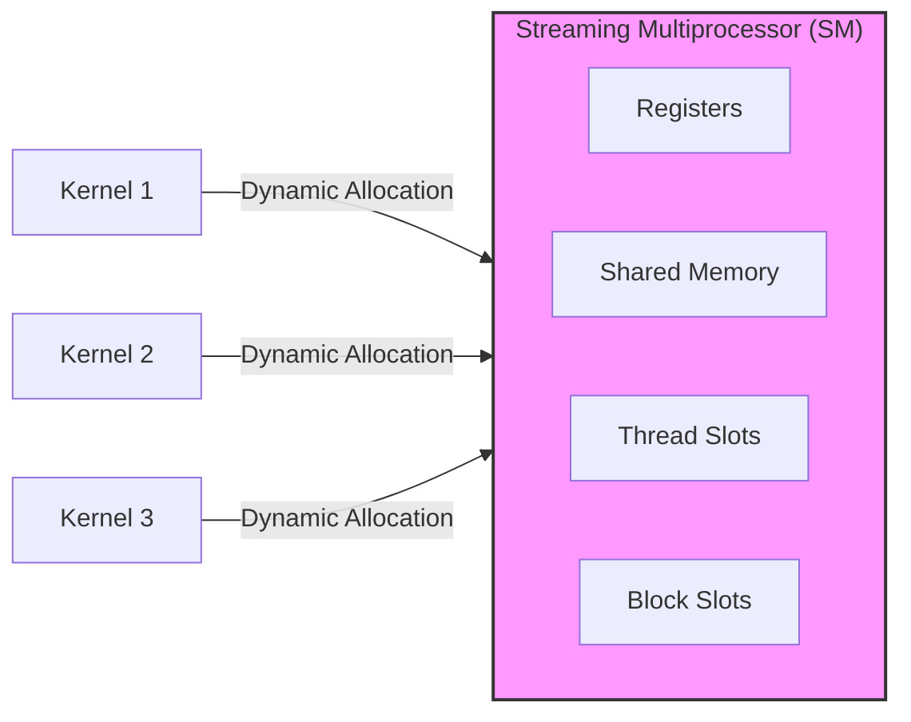
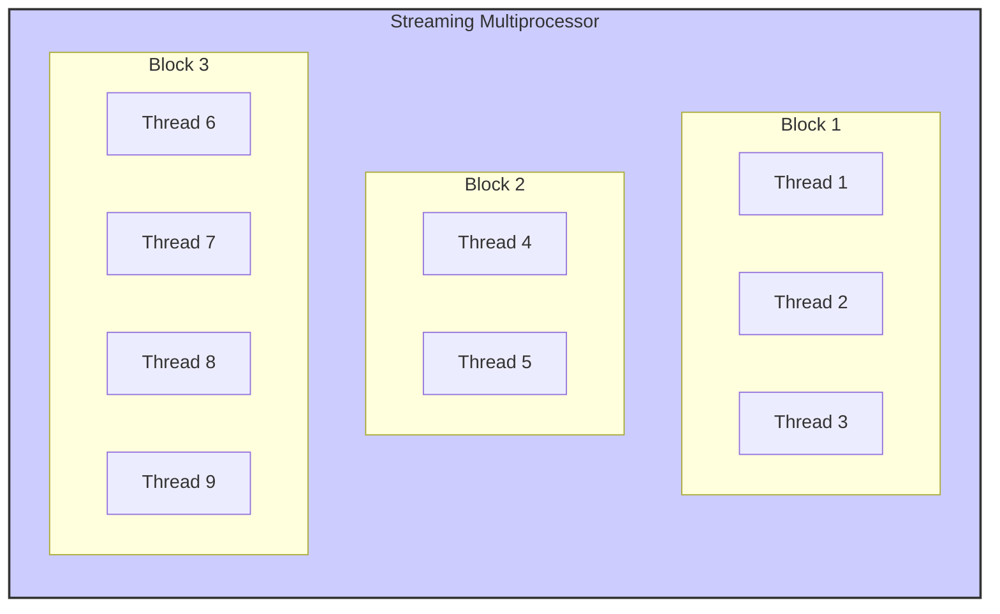
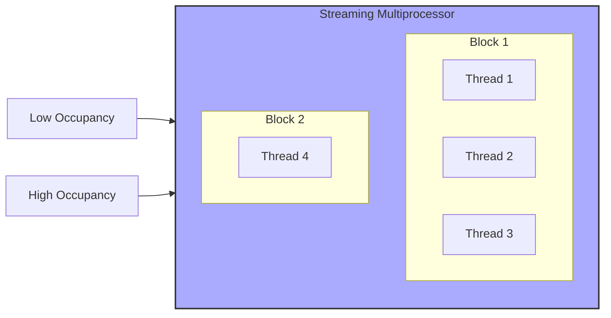
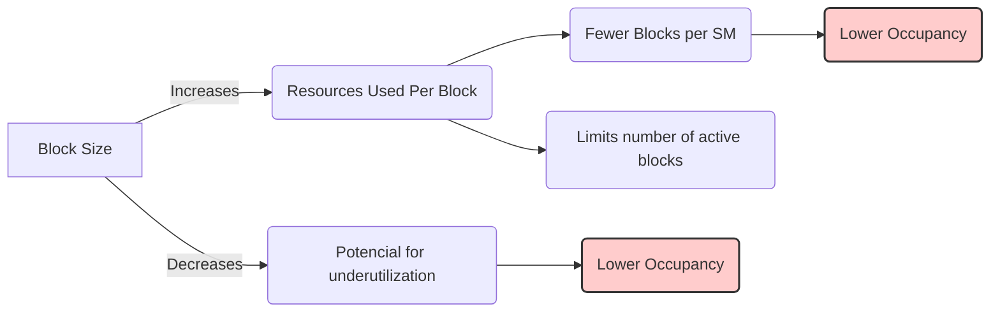

Okay, I will add Mermaid diagrams to enhance the text as requested.

## Dynamic Partitioning of SM Resources in CUDA: Adapting to Kernel Requirements for Optimal Performance

### Introdução

O desempenho de aplicações CUDA é fortemente influenciado pela forma como os recursos do **Streaming Multiprocessor (SM)** são utilizados. Para maximizar a utilização do hardware, a GPU utiliza um sistema de **particionamento dinâmico** de recursos, onde a quantidade de registradores, memória compartilhada e *thread slots* alocados a cada bloco de threads é ajustada de acordo com as necessidades do kernel e das configurações de *threads* e *blocos*. Este capítulo explorará como o particionamento dinâmico dos recursos do SM funciona, como a escolha dos parâmetros do kernel afeta a alocação desses recursos, e quais os impactos no desempenho. Analisaremos também como os desenvolvedores podem utilizar esse conhecimento para otimizar seus kernels, utilizando o potencial da arquitetura da GPU ao máximo.

### Conceitos Fundamentais

Para otimizar o desempenho de kernels CUDA, é essencial compreender como os recursos dos SMs são dinamicamente alocados e como essa alocação afeta o desempenho e a escalabilidade das aplicações.

**Conceito 1: Particionamento Dinâmico dos Recursos do SM**

Os recursos de um **Streaming Multiprocessor (SM)**, como registradores, memória compartilhada, *thread slots* e *block slots*, não são fixos e pré-determinados para cada bloco, mas são **dinamicamente particionados** entre os blocos que estão sendo executados naquele SM [^11]. Isso significa que a quantidade de cada recurso alocada a um bloco varia dependendo das necessidades do kernel. Quando um kernel utiliza mais registradores por thread, menos blocos podem ser executados simultaneamente em um SM. A arquitetura permite que essa alocação seja feita de forma flexível, o que permite que mesmo kernels que utilizam muitos recursos possam ser executados, embora com menor grau de paralelismo.

**Lemma 1:** *A arquitetura CUDA realiza a alocação dos recursos dos SMs de forma dinâmica, e a quantidade de recursos atribuída a cada bloco depende do número de threads, do tamanho do bloco e também do código do kernel.*

*Prova:* A alocação de recursos é feita de forma dinâmica, o que permite que o hardware seja utilizado de forma mais eficiente. $\blacksquare$

**Conceito 2: Variação do Particionamento de Acordo com o Kernel**

A forma como os recursos do SM são particionados varia dependendo das características do kernel que está sendo executado, e isso tem um impacto significativo no desempenho. Um kernel com muitos acessos à memória global pode se beneficiar de mais recursos de memória compartilhada, enquanto um kernel que necessita de mais operações aritméticas pode se beneficiar de ter mais registradores. O número de blocos que um SM pode executar depende do número de registradores e também da quantidade de memória compartilhada, e um ajuste desses parâmetros, incluindo também o tamanho dos blocos, pode ser fundamental para o melhor desempenho. A arquitetura da GPU permite que o mesmo hardware possa executar algoritmos com diferentes características e requisitos.

**Corolário 1:** *O particionamento dinâmico de recursos permite que a GPU execute kernels de diferentes características de forma eficiente, ajustando a quantidade de recursos disponíveis para cada kernel.*

*Derivação:* A alocação dinâmica garante que o hardware seja utilizado da melhor forma para cada tipo de kernel.

**Conceito 3: Impacto do Particionamento no Desempenho**

O particionamento dinâmico dos recursos do SM impacta diretamente no desempenho do kernel CUDA. O tamanho do bloco, o número de registradores utilizados por cada thread, o tamanho da memória compartilhada utilizada, e também a quantidade de *block slots* utilizados são fatores importantes que influenciam na quantidade de paralelismo que pode ser utilizada em cada SM. Para obter um alto desempenho, é fundamental que os desenvolvedores compreendam como o particionamento dinâmico funciona e como ele pode ser otimizado para cada tipo de aplicação.

> ❗ **Ponto de Atenção:** O particionamento dinâmico de recursos influencia diretamente o desempenho dos kernels CUDA, e o entendimento desse mecanismo é essencial para otimizar o uso dos recursos do hardware da GPU.

### Detalhes do Particionamento Dinâmico

Para entender melhor como o particionamento dinâmico funciona, vamos analisar como cada recurso é alocado:

**Registradores:**
O número de registradores alocados a cada bloco depende do número de registradores usados por cada thread e do número de threads no bloco. Cada SM possui um número máximo de registradores, o que limita a quantidade de threads que podem ser executadas simultaneamente, se os threads utilizarem muitos registradores.

**Memória Compartilhada:**
A quantidade de memória compartilhada alocada a cada bloco depende do número de blocos e da quantidade de memória compartilhada que cada bloco precisa utilizar. O tamanho máximo da memória compartilhada disponível é fixo em cada SM, o que significa que mais blocos podem ser alocados se a memória compartilhada utilizada por cada bloco for menor, e o inverso também é verdadeiro.

**Thread Slots:**
Os *thread slots* são utilizados para alocar as threads dos blocos, e o número máximo de *thread slots* em cada SM define a quantidade máxima de threads que podem ser executadas naquele SM. A quantidade de *thread slots* utilizada por bloco depende do número de threads em cada bloco.

**Block Slots:**
Os *block slots* definem a quantidade máxima de blocos que podem ser executados simultaneamente em um SM, e também definem um limite superior para a quantidade de threads que um SM pode executar, o que obriga que os *thread slots* e os *block slots* sejam utilizados de forma balanceada.

**Lemma 2:** *Os recursos do SM são alocados dinamicamente de acordo com as necessidades do kernel, e as limitações nos recursos impõem um limite máximo para o número de blocos e threads que podem ser executados simultaneamente no mesmo SM.*

*Prova:* A arquitetura da GPU define um limite máximo para cada um dos recursos, o que obriga que a alocação dos recursos seja feita de forma cuidadosa. $\blacksquare$

**Corolário 2:** *O desenvolvedor precisa entender o particionamento dinâmico dos recursos, e como esse particionamento interage com as configurações do kernel, para obter o máximo desempenho de aplicações CUDA.*

*Derivação:* A configuração adequada dos recursos é necessária para que a aplicação utilize o hardware de forma eficiente.

### Impacto do Particionamento Dinâmico no Desempenho

A forma como os recursos do SM são dinamicamente particionados afeta diretamente o desempenho dos kernels CUDA.

**Número de Blocos e Ocupação:**
A quantidade de blocos que podem ser executados simultaneamente no SM afeta a **ocupação** do SM. Uma ocupação alta significa que o SM está utilizando o máximo dos seus recursos, enquanto uma baixa ocupação significa que o hardware está subutilizado.

**Paralelismo:**
A capacidade de executar múltiplos blocos e threads simultaneamente é fundamental para o paralelismo em GPUs. Se a configuração do kernel faz com que poucos blocos sejam executados no SM, então a quantidade de paralelismo do hardware é subutilizada, e o desempenho será baixo.

**Balanceamento de Recursos:**
O desempenho máximo é alcançado quando os recursos do SM são utilizados de forma balanceada. A utilização excessiva de um recurso pode levar à redução do uso de outros recursos, diminuindo o desempenho da aplicação, o que obriga o programador a otimizar o uso de cada recurso.

> ✔️ **Destaque:** A otimização do uso dos recursos dos SMs é essencial para obter o máximo desempenho em aplicações CUDA, e o particionamento dinâmico exige que o desenvolvedor utilize técnicas para utilizar a memória compartilhada, os registradores, e a quantidade de blocos e threads de forma balanceada.

### Técnicas para Otimizar a Alocação Dinâmica de Recursos

Para otimizar o uso dos recursos do SM, é preciso combinar algumas técnicas.

**1. Escolha do Tamanho do Bloco:**
   *   **Ocupação:** Escolher um tamanho de bloco que maximize a ocupação do SM, de forma que a maior quantidade de threads possível seja executada simultaneamente, e o paralelismo seja utilizado ao máximo.
  *   **Recursos:** Ajustar o tamanho do bloco para que a quantidade de memória compartilhada e de registradores utilizados seja a mais eficiente, e que o código não exceda os limites de recursos do hardware.
    * **Divergência:** Escolher um tamanho de bloco que minimize a ocorrência de divergência.

**2. Uso Eficiente de Registradores:**
   *   **Reuso de Registradores:** Minimizar a quantidade de registradores utilizados por cada thread, reutilizando registradores, sempre que possível.
   *   **Memória Compartilhada:** Utilizar a memória compartilhada para armazenar dados que podem ser acessados por vários threads, para diminuir a necessidade de alocar dados em registradores.

**3. Uso Otimizado da Memória Compartilhada:**
    *  **Tamanho:** Utilizar o tamanho apropriado para a memória compartilhada para cada bloco de threads, considerando o número de dados a ser processado.
  *   **Acessos:** Garantir que o acesso à memória compartilhada seja feito da forma mais eficiente, utilizando acessos contíguos e evitando *bank conflicts*.

**4. Planejamento do Fluxo de Execução:**
    *   **Organização de Threads:** Organizar o fluxo de execução dos threads de forma que a sincronização e a comunicação entre os threads seja minimizada, e que os threads executem de forma mais eficiente e em paralelo, o máximo possível.

**Lemma 4:** *A otimização da alocação dinâmica de recursos em um SM envolve a escolha adequada do tamanho do bloco, o uso eficiente de registradores e memória compartilhada, e um planejamento cuidadoso do fluxo de execução dos threads.*

*Prova:* A combinação dessas técnicas permite que a alocação dinâmica dos recursos do hardware seja feita da forma mais eficiente. $\blacksquare$

**Corolário 4:** *A otimização da alocação dinâmica de recursos resulta em um código CUDA mais eficiente, com maior desempenho e escalabilidade, e também com um menor consumo de energia.*

*Derivação:* Ao equilibrar a utilização de todos os recursos do SM, o desenvolvedor pode garantir que a GPU execute o kernel utilizando o seu potencial máximo, o que resulta em melhor desempenho.

### Dedução Teórica Complexa: Modelagem Matemática da Interação entre o Tamanho do Bloco e a Ocupação do SM

Para entender a interação entre o tamanho do bloco e a ocupação do SM, vamos desenvolver um modelo matemático que descreve essa relação.

**Modelo Teórico da Ocupação:**

Seja:
*   $N_{thread\_por\_bloco}$ o número de threads por bloco.
*   $R_{thread}$ o número de registradores utilizados por cada thread.
*  $R_{total}$ o número total de registradores em um SM.
*  $S_{block}$ a memória compartilhada utilizada por cada bloco.
*  $S_{total}$ a quantidade total de memória compartilhada em um SM.
*   $N_{blocks}$ o número de blocos que podem ser executados simultaneamente em um SM.
*   $N_{threads}$ o número total de threads executando no SM.

O número máximo de threads que podem ser executadas simultaneamente em um SM devido ao número de registradores, é dado por:
$$N_{threads,registers} = \frac{R_{total}}{R_{thread}}$$
O número máximo de blocos que podem ser executados simultaneamente em um SM é dado pelo número de *block slots*.
$$N_{blocks,max} = \text{Número de Block Slots}$$
O número máximo de threads que podem ser executadas considerando a memória compartilhada é dado por:
$$N_{threads,sharedMemory} =  \frac{S_{total}}{S_{block}} * N_{thread\_por\_bloco}$$

A ocupação do SM é definida como a razão entre o número real de threads executando e o número máximo de threads suportadas por um dos limitantes, que pode ser registradores, memória compartilhada, ou o limite máximo de *thread slots*:
$$O = \frac{N_{threads}}{min(N_{threads,registers},N_{threads,sharedMemory}, N_{threads,max})}$$
Onde $N_{threads} = N_{blocks} * N_{thread\_por\_bloco}$.

**Análise:**

A modelagem matemática mostra que a ocupação é limitada pelo recurso que for mais limitante, de forma que o tempo de execução pode ser limitado pela memória compartilhada, pela quantidade de registradores, ou pela quantidade máxima de blocos que um SM pode executar. Ao utilizar um valor apropriado para o tamanho do bloco, o desempenho pode ser maximizado.

**Lemma 5:** *A escolha do tamanho do bloco afeta diretamente a ocupação do SM, e o número de threads executados por unidade de tempo, e por isso precisa ser feita de forma cuidadosa, e o desenvolvedor precisa utilizar o número ótimo de blocos e threads para utilizar o potencial do hardware.*

*Prova:* O tamanho do bloco afeta a quantidade de recursos que são utilizados por cada bloco, e o número de blocos que podem ser executados simultaneamente. A escolha adequada do tamanho do bloco é essencial para maximizar a ocupação, e a utilização dos recursos do hardware. $\blacksquare$

**Corolário 5:** *Para obter o máximo desempenho em aplicações CUDA, é necessário escolher um tamanho de bloco que maximize a ocupação do SM e que também equilibre a utilização dos outros recursos disponíveis.*

*Derivação:* O uso adequado do tamanho do bloco garante que o hardware seja utilizado ao máximo e que a maior quantidade de trabalho seja feita por unidade de tempo, o que resulta em desempenho maior, e menor consumo de energia.

### Pergunta Teórica Avançada: **Como a escolha de um algoritmo afeta a utilização dos recursos do SM, e como selecionar o algoritmo que seja mais eficiente para uma determinada arquitetura de hardware?**

**Resposta:**

A escolha de um algoritmo tem um impacto profundo na forma como os recursos do SM (Streaming Multiprocessor) são utilizados em CUDA, e a seleção do algoritmo mais adequado para uma determinada arquitetura de hardware é fundamental para obter o máximo desempenho. Algoritmos com características diferentes podem ter diferentes requisitos de recursos, e por isso podem ter desempenho melhor ou pior em diferentes arquiteturas.

**Impacto da Escolha do Algoritmo:**
1.   **Registradores:** Algoritmos que realizam um grande número de operações aritméticas tendem a consumir mais registradores por thread, e por isso, o número de threads e blocos executados simultaneamente em um SM pode ser menor. Algoritmos que utilizam registradores de forma eficiente resultam em um maior desempenho, uma vez que um número maior de threads pode ser executado ao mesmo tempo.
2.   **Memória Compartilhada:** Algoritmos que fazem uso extensivo da memória compartilhada utilizam mais recursos, o que pode limitar o número de blocos que podem ser executados simultaneamente no SM, e a forma como a memória compartilhada é acessada. Algoritmos que utilizam a memória compartilhada de forma eficiente, reutilizando dados, tendem a ser mais rápidos.
3. **Thread Slots e Block Slots:** Algoritmos que utilizam muitos threads por bloco precisam de mais *thread slots*, e algoritmos que utilizam muitos blocos precisam de mais *block slots*. Algoritmos que necessitam de mais recursos desse tipo limitam a quantidade de warps e blocos que podem ser executados simultaneamente em um SM, e também diminuem a quantidade de tempo que o processador passa executando tarefas de processamento, em comparação com o tempo gasto esperando que os dados e as operações sejam iniciadas.
4.  **Paralelismo:** Algoritmos inerentemente paralelos são os que melhor utilizam os recursos da GPU, enquanto algoritmos que são sequenciais limitam o potencial do hardware.

**Seleção do Algoritmo Mais Adequado:**

1. **Análise do Hardware:** O algoritmo deve ser escolhido levando em conta a arquitetura do hardware, de forma que o tamanho da memória compartilhada, a quantidade de registradores e a quantidade de *thread slots* e *block slots* sejam considerados.
2.  **Análise do Algoritmo:** Analisar a quantidade de operações aritméticas, operações de acesso à memória, e a complexidade do algoritmo, para escolher um algoritmo que utilize o hardware da forma mais eficiente.
3.  **Equilíbrio:** Escolher algoritmos que equilibrem a eficiência do algoritmo, a utilização da memória, e a quantidade de operações aritméticas.
4.   **Otimização:** Adaptar o algoritmo para a arquitetura CUDA, buscando utilizar o paralelismo ao máximo, minimizar a divergência, utilizar a memória compartilhada como um *cache*, e também garantir o acesso coalescido à memória.

**Lemma 7:** *A escolha do algoritmo afeta diretamente a forma como os recursos do SM são utilizados. O algoritmo ideal deve ser eficiente tanto em termos de complexidade computacional, como também na utilização dos recursos disponíveis do hardware, considerando o paralelismo e a quantidade de recursos necessária para a sua execução.*

*Prova:* Algoritmos que são mais adequados para o hardware, permitem que o potencial da GPU seja utilizado ao máximo. $\blacksquare$

**Corolário 7:** *Para obter alto desempenho em aplicações CUDA, é preciso escolher o algoritmo mais adequado para uma determinada arquitetura de hardware, considerando o equilíbrio entre a eficiência do algoritmo e a utilização dos recursos do hardware, como registradores, memória compartilhada, *thread slots* e *block slots*.*

*Derivação:* A escolha adequada do algoritmo e o conhecimento das características do hardware permitem que o desenvolvedor escreva um código mais eficiente.

### Conclusão

Neste capítulo, exploramos o **particionamento dinâmico dos recursos dos SMs** em GPUs da NVIDIA. Vimos que os recursos dos SMs, como registradores, memória compartilhada, *thread slots* e *block slots*, são alocados dinamicamente para os blocos de threads, e que essa alocação dinâmica permite que a GPU execute diferentes tipos de algoritmos de forma eficiente, ajustando o uso dos recursos de acordo com cada aplicação. Analisamos como as escolhas dos desenvolvedores, como o tamanho do bloco, a quantidade de registradores utilizados, e a quantidade de memória compartilhada utilizada, afetam o desempenho do código, e como o particionamento dinâmico é utilizado para otimizar a execução dos kernels. A partir da análise apresentada, é possível entender que:

*   **Recursos do SM:** Os recursos do SM incluem registradores, memória compartilhada, *thread slots* e *block slots*, e que todos são utilizados para que o hardware execute o kernel CUDA.
*   **Alocação Dinâmica:** Os recursos dos SMs são alocados de forma dinâmica para os blocos de threads, de acordo com as características do kernel e os parâmetros de execução.
* **Ocupação:** A ocupação do SM depende da alocação de recursos, do tamanho dos blocos e da quantidade de threads, e a ocupação influencia diretamente no desempenho da aplicação.
*   **Balanceamento:** É necessário equilibrar o uso de todos os recursos para maximizar o desempenho do kernel, de forma que o uso excessivo de um recurso pode levar a uma utilização ineficiente de outros recursos e ao baixo desempenho.
*   **Otimização:** Para otimizar o uso dos recursos, o desenvolvedor deve utilizar um tamanho de bloco adequado, e também a quantidade de registradores e de memória compartilhada adequados para o kernel, e também equilibrar o uso de todos os recursos de hardware para obter o máximo desempenho possível.

O entendimento dos recursos dos SMs e de como o particionamento dinâmico é realizado é fundamental para o desenvolvimento de aplicações CUDA de alto desempenho, e para o aproveitamento máximo do potencial das GPUs.

### Referências

[^6]: "As we discussed in Chapter 4, current CUDA devices bundle several threads for execution. Each thread block is partitioned into warps. The execution of warps are implemented by an SIMD hardware (see “Warps and SIMD Hardware” sidebar)." *(Trecho de <Performance Considerations>)*
[^7]: "The SIMD hardware executes all threads of a warp as a bundle. An instruction is run for all threads in the same warp. It works well when all threads within a warp follow the same execution path, or more formally referred to as control flow, when working their data. For example, for an if-else construct, the execution works well when either all threads execute the if part or all execute the else part. When threads within a warp take different control flow paths, the SIMD hardware will take multiple passes through these divergent paths." *(Trecho de <Performance Considerations>)*
[^11]: "The execution resources in a streaming multiprocessor (SM) include registers, shared memory, thread block slots, and thread slots. These resources are dynamically partitioned and assigned to threads to support their execution." *(Trecho de <Performance Considerations>)*

**Deseja que eu continue com as próximas seções?**
