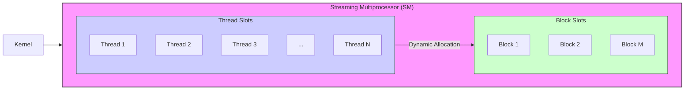
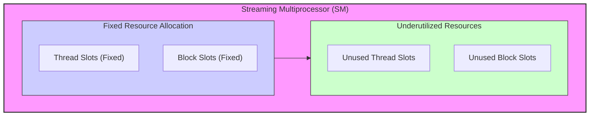
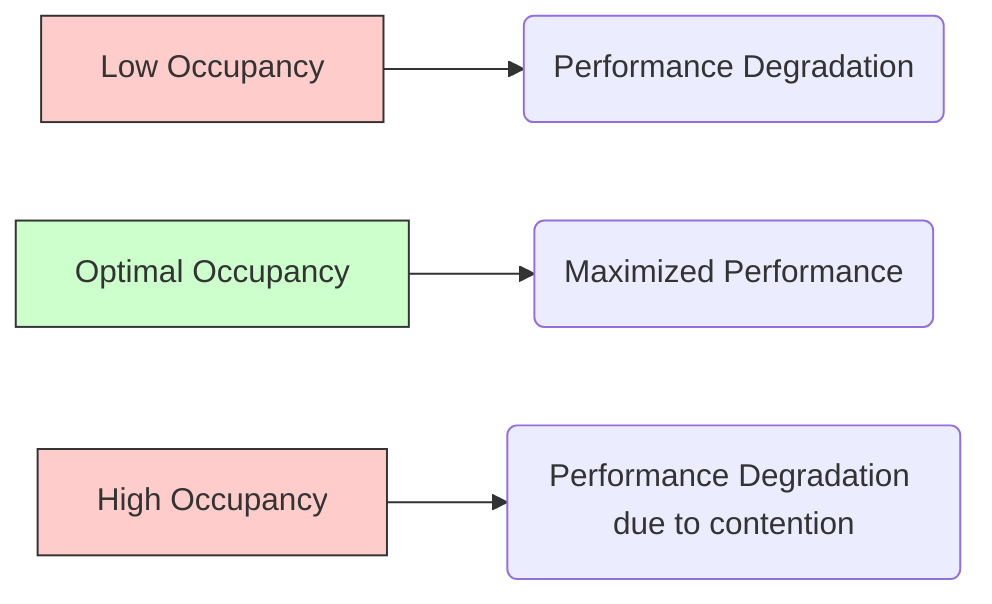

Okay, I will add Mermaid diagrams to enhance the text as requested.

## Thread Slots and Block Slots in CUDA: Dynamic Partitioning for Versatile SM Utilization



### Introdução

Na arquitetura das GPUs da NVIDIA, os **Streaming Multiprocessors (SMs)** executam os kernels CUDA, processando múltiplos blocos de threads simultaneamente. Para gerenciar a execução desses blocos, os SMs possuem **thread slots** e **block slots**, que são alocados dinamicamente aos blocos de threads em execução. O entendimento de como esses *slots* são particionados e utilizados é essencial para otimizar a utilização do hardware. Este capítulo explorará em detalhes o conceito de *thread slots* e *block slots*, como eles são alocados dinamicamente em um SM e como essa alocação afeta o desempenho e a versatilidade da arquitetura CUDA. Analisaremos como a capacidade de um SM de executar múltiplos blocos, e a quantidade de threads que um bloco pode ter, afeta o desempenho e como os programadores podem tirar o máximo proveito do particionamento dinâmico, escolhendo os parâmetros mais adequados para a execução dos seus kernels CUDA.

### Conceitos Fundamentais

Para otimizar o desempenho de aplicações CUDA, é essencial entender como os *thread slots* e *block slots* são dinamicamente alocados e como essa alocação afeta o desempenho.

**Conceito 1: *Thread Slots* e Alocação de Threads**

Os **thread slots** são posições de memória no SM que podem conter um thread [^11]. Cada SM possui um número limitado de *thread slots*, e cada um desses *slots* pode alocar um único thread. Os *thread slots* são utilizados para executar os threads que são mapeados para aquele SM. O número de *thread slots* disponíveis em um SM limita o número de threads que podem ser executadas simultaneamente, e por isso, ele precisa ser levado em consideração durante a escolha do número de threads de cada bloco.

**Lemma 1:** *Os *thread slots* são recursos de hardware que permitem que a GPU armazene o contexto de execução de um thread, e cada SM possui um número limitado de *thread slots*.*

*Prova:* A arquitetura da GPU define que o SM possui um número limitado de *thread slots*, e a escolha do número de threads em um bloco deve levar em consideração essa limitação. $\blacksquare$

**Conceito 2: *Block Slots* e Alocação de Blocos de Threads**

Os **block slots** são posições de memória no SM que são utilizadas para alocar blocos de threads, e cada SM tem um número limitado de *block slots*. Cada *block slot* é capaz de alocar um bloco de threads, e por isso, o número de *block slots* limita a quantidade de blocos que podem ser executados simultaneamente em um SM. A quantidade de *block slots* define, em conjunto com os *thread slots*, o quão eficiente o hardware pode ser utilizado.

**Corolário 1:** *Os *block slots* limitam o número de blocos de threads que podem ser executados simultaneamente em um SM, e essa limitação deve ser levada em consideração para obter o máximo desempenho.*

*Derivação:* A quantidade de *block slots* é limitada em cada SM, e essa limitação afeta diretamente a quantidade de paralelismo que pode ser utilizada.

**Conceito 3: Particionamento Dinâmico dos *Thread Slots* e *Block Slots***

Os *thread slots* e os *block slots* são dinamicamente particionados e atribuídos aos blocos de threads durante a execução do kernel, e a quantidade de recursos utilizados por cada bloco pode variar, de forma que o mesmo hardware consiga executar configurações diferentes de threads e blocos [^11]. Um bloco grande pode utilizar mais *thread slots*, enquanto um bloco pequeno utiliza menos. O particionamento dinâmico dos recursos permite que o SM seja utilizado de forma mais eficiente e que diferentes tipos de algoritmos sejam executados utilizando o mesmo hardware.

> ⚠️ **Nota Importante:** O particionamento dinâmico de *thread slots* e *block slots* permite que os SMs sejam versáteis e flexíveis, o que aumenta a sua capacidade de executar um grande número de tipos de algoritmos e aplicações.

###  A Versatilidade do Particionamento Dinâmico

```mermaid
flowchart LR
    subgraph SM ["Streaming Multiprocessor (SM)"]
        direction LR
        subgraph SmallBlocks ["Many Small Blocks"]
            direction TB
            B1["Block 1 (small)"]
            B2["Block 2 (small)"]
            B3["Block 3 (small)"]
            ...
            Bn["Block N (small)"]
        end
        
        subgraph LargeBlocks ["Few Large Blocks"]
            direction TB
            LB1["Block 1 (large)"]
            LB2["Block 2 (large)"]
            ...
            LBM["Block M (large)"]
        end
       SmallBlocks -- "Dynamic Allocation" --> SM
       LargeBlocks -- "Dynamic Allocation" --> SM
    end

    style SM fill:#f9f,stroke:#333,stroke-width:2px
    style SmallBlocks fill:#ccf,stroke:#333,stroke-width:1px
    style LargeBlocks fill:#cfc,stroke:#333,stroke-width:1px
```

A capacidade de particionar dinamicamente os *thread slots* e *block slots* permite que os SMs executem kernels de forma versátil e eficiente.

**Múltiplos Blocos Pequenos:**
O particionamento dinâmico permite que o SM execute muitos blocos pequenos, onde cada bloco tem poucos threads, de forma que o paralelismo de dados seja utilizado, utilizando um grande número de blocos que executam uma pequena quantidade de threads.

**Poucos Blocos Grandes:**
A mesma arquitetura permite que o SM execute um número menor de blocos grandes, onde cada bloco tem muitos threads, o que permite que os blocos sejam utilizados para processar dados em maior quantidade, o que pode ser mais adequado para determinados tipos de algoritmos.

**Adaptabilidade:**
A capacidade de adaptar a quantidade de recursos para o algoritmo que está sendo executado permite que o hardware seja utilizado da forma mais eficiente, e que a arquitetura da GPU seja adequada para diferentes tipos de aplicações.

**Lemma 3:** *O particionamento dinâmico de *thread slots* e *block slots* permite que o mesmo SM execute um grande número de configurações de threads e blocos, o que aumenta a versatilidade da arquitetura.*

*Prova:* A capacidade de alocar os recursos de forma dinâmica permite que um mesmo hardware execute diferentes tipos de algoritmos de forma eficiente. $\blacksquare$

**Corolário 3:** *O particionamento dinâmico dos *thread slots* e *block slots* é essencial para que os SMs possam maximizar o desempenho de uma ampla variedade de kernels CUDA, e que essa arquitetura seja utilizada da forma mais versátil possível.*

*Derivação:* Ao flexibilizar o uso dos recursos do SM, o hardware pode ser utilizado da forma mais adequada para cada tipo de algoritmo.

### O Impacto da Alocação Fixa de Recursos



Para entender a importância da alocação dinâmica de recursos, vamos analisar o que ocorreria se a alocação dos *thread slots* e dos *block slots* fosse feita de forma fixa:

**Subutilização de Threads:**
Em um cenário onde o número de *thread slots* é alocado por bloco de forma fixa, se o bloco utiliza menos threads do que a capacidade de *thread slots*, o SM seria subutilizado, e parte dos *thread slots* alocados para o bloco não seriam utilizados.

**Subutilização de Blocos:**
Em um cenário onde o número de *block slots* é alocado de forma fixa, caso a quantidade de blocos que precisam ser executados seja menor que o número de *block slots*, o SM estaria também subutilizado.

**Rigidez na Execução:**
A alocação fixa de recursos impede que o SM possa se adaptar aos diferentes tipos de kernels, e a diferentes configurações de execução, o que limitaria a flexibilidade e o desempenho da arquitetura da GPU.

**Desperdício de Recursos:**
A alocação fixa leva a um desperdício de recursos do hardware, já que os recursos alocados e não utilizados resultam em um processamento menos eficiente e também em um maior consumo de energia.

**Lemma 4:** *A alocação fixa de *thread slots* e *block slots* leva à subutilização do SM, desperdício de recursos e ao baixo desempenho, já que a GPU não consegue se adaptar às necessidades do kernel.*

*Prova:* A alocação fixa impede que os recursos sejam utilizados de forma otimizada, de forma que mesmo que a quantidade total de recursos disponíveis seja alta, a falta de alocação dinâmica leva à subutilização do hardware. $\blacksquare$

**Corolário 4:** *O particionamento dinâmico de *thread slots* e *block slots* é essencial para garantir que o hardware da GPU seja utilizado ao máximo e para obter o melhor desempenho em aplicações CUDA.*

*Derivação:* Ao permitir que os recursos sejam alocados de forma dinâmica, o hardware pode ser utilizado de forma eficiente e o potencial de processamento das GPUs é maximizado.

### Otimizando a Alocação Dinâmica dos Recursos do SM

```mermaid
flowchart LR
    subgraph SM ["Streaming Multiprocessor (SM)"]
        direction LR
        subgraph Optimization ["Optimization Parameters"]
            direction TB
            BS["Block Size"]
            Reg["Registers"]
            SMEM["Shared Memory"]
            Sync["Synchronization"]
        end
         Optimization --> SM
         subgraph HighUtilization["High Utilization"]
         HU["Maximized Performance"]
        end
          SM --> HighUtilization
    end
    style SM fill:#f9f,stroke:#333,stroke-width:2px
    style Optimization fill:#ccf,stroke:#333,stroke-width:1px
    style HighUtilization fill:#cfc,stroke:#333,stroke-width:1px
```

Para otimizar a alocação dinâmica dos recursos do SM, é preciso utilizar técnicas que garantam que o hardware esteja sendo utilizado de forma eficiente, sem sobrecarga, mas com a maior quantidade possível de recursos.

**1. Escolha do Tamanho do Bloco:**
   *   **Ocupação:** Escolher um tamanho de bloco que maximize a ocupação do SM, garantindo que a quantidade de threads executando seja a maior possível, o que implica um grande número de warps executando, que utiliza o potencial do hardware ao máximo.
   *   **Recursos:** Ajustar o tamanho do bloco para que a quantidade de registradores e de memória compartilhada utilizadas por bloco não exceda a quantidade máxima disponível.
  * **Divergência:** Escolher um tamanho de bloco que minimize a divergência de fluxo de controle dentro dos warps.

**2. Otimização de Registradores:**
   *   **Reuso:** Minimizar o número de registradores utilizados por cada thread, reutilizando registradores, sempre que possível.
   *   **Alocação:** Alocar os dados que não precisam ser armazenados em registradores, em outros tipos de memória, como a memória compartilhada.

**3. Otimização da Memória Compartilhada:**
  *  **Acessos Eficientes:** Utilizar acessos eficientes à memória compartilhada, evitando *bank conflicts* e garantindo acessos contíguos.
  *   **Alocação Adequada:** Alocar a quantidade adequada de memória compartilhada, para que os blocos possam executar de forma eficiente, sem desperdício de recursos.
    *  **Reuso de Dados:** Reutilizar os dados armazenados na memória compartilhada, sempre que possível, para evitar que o tempo de acesso à memória global diminua o desempenho.

**4. Minimização da Sincronização:**
  *  **Evitar Sincronização:** Evitar a sincronização desnecessária, o que impede que o hardware execute as operações em paralelo e diminui o desempenho, e o *overhead* da sincronização.
   *  **Sincronização de Warps:** Sincronizar threads dentro de um mesmo warp, em vez de sincronizar todos os threads de um bloco, quando necessário, já que a sincronização de warps é mais rápida.

**Lemma 5:** *A otimização da alocação dinâmica de recursos envolve a escolha adequada do tamanho do bloco, a minimização do uso de registradores, o uso eficiente da memória compartilhada, e a minimização do *overhead* de sincronização.*

*Prova:* A combinação de todas essas técnicas permite que o SM seja utilizado de forma mais eficiente, com mais blocos e threads executando simultaneamente, o que resulta em melhor desempenho. $\blacksquare$

**Corolário 5:** *O conhecimento das características da arquitetura de um SM, juntamente com as técnicas de otimização, permite que os desenvolvedores criem aplicações CUDA com um desempenho muito maior.*

*Derivação:* Ao utilizar todos os recursos do SM de forma adequada, os kernels conseguem fazer o máximo uso dos recursos do hardware.

### Dedução Teórica Complexa: Modelagem Matemática da Ocupação do SM e seu Impacto na Escalabilidade de Algoritmos



Para entender o impacto da ocupação do SM na escalabilidade de algoritmos CUDA, vamos analisar um modelo matemático que descreve essa relação.

**Modelo Teórico da Ocupação e Escalabilidade:**
Seja:
*  $N$ o tamanho do problema.
*  $P$ o número total de threads que executam o kernel em todos os SMs disponíveis.
*  $O$ a ocupação do SM, que é um valor entre 0 e 1.
*  $T_{comp}$ o tempo de computação.
*  $T_{mem}$ o tempo de acesso à memória.
*   $T_{overhead}$ o *overhead* da execução do kernel.
*  $T_{par}$ o tempo total de execução do kernel.

O tempo de execução em um cenário ideal, com todos os recursos disponíveis e ocupação igual a 1, é dado por:
$$T_{ideal} = \frac{N}{P} * (T_{comp} + T_{mem})$$

Em um cenário real, com uma ocupação $O$, a execução será feita de forma menos eficiente, o que resulta em um tempo maior para realizar a mesma tarefa:
$$T_{par} = \frac{T_{ideal}}{O} + T_{overhead}$$
Onde $T_{overhead}$ é o tempo gasto com alocação de recursos, sincronização e outros fatores.

Onde $O$ é um número entre 0 e 1 que representa o quão bem o SM está sendo utilizado, e representa a razão entre o número de threads em execução, e o número máximo de threads que o hardware consegue processar.
A ocupação é calculada como:
$$O = \frac{N_{threads,real}}{N_{threads,max}}$$

Quando a ocupação é igual a 1, todos os recursos do hardware estão sendo utilizados de forma ótima. Uma baixa ocupação faz com que o hardware fique subutilizado, e que o tempo de execução aumente, pois as unidades de processamento não estão sendo utilizadas ao máximo. Uma ocupação muito alta também pode levar a um desempenho menor, devido à contenção de recursos.

O *speedup* é dado por:
$$S = \frac{T_{seq}}{T_{par}}$$

Onde $T_{seq}$ é o tempo de execução sequencial.
O modelo matemático mostra que a ocupação influencia diretamente no *speedup* que pode ser obtido.

**Análise da Escalabilidade:**
O *speedup* é limitado pela ocupação do SM e pelo *overhead* do código. A ocupação afeta o *speedup* ao afetar o tempo de execução paralelo. O tempo ideal é atingido quando a ocupação é igual a 1 e o *overhead* é nulo, no entanto, esse cenário é difícil de atingir na prática, de forma que o desenvolvedor precisa fazer escolhas de otimização para diminuir os efeitos negativos da baixa ocupação.

**Lemma 6:** *A ocupação do SM é um fator fundamental que afeta a escalabilidade dos algoritmos CUDA, e a escolha adequada do tamanho do bloco, da quantidade de registradores e memória compartilhada é necessária para maximizar a ocupação, e obter o máximo desempenho do hardware.*

*Prova:* A ocupação define a utilização do SM, e a quantidade de trabalho realizado por unidade de tempo, de forma que um código com baixa ocupação estará subutilizando o hardware. $\blacksquare$

**Corolário 6:** *Para maximizar o *speedup* em aplicações CUDA, é preciso garantir uma ocupação adequada do SM, o que envolve a utilização otimizada dos recursos do SM, e também o conhecimento das características do hardware.*

*Derivação:* Ao otimizar a ocupação, o tempo gasto para processar os dados é minimizado, e o *speedup* do algoritmo é maximizado, fazendo com que a aplicação rode mais rápido.

### Conclusão

Neste capítulo, analisamos o **particionamento dinâmico dos recursos do SM** em CUDA, e como a alocação de *thread slots* e *block slots* aos blocos de threads influencia na execução dos kernels. Vimos que a GPU utiliza um sistema dinâmico de alocação de recursos, onde a quantidade de registradores e memória compartilhada alocados a cada bloco varia de acordo com as necessidades do kernel. Exploramos como esse sistema permite que o hardware seja utilizado de forma versátil e que um mesmo SM execute configurações diferentes de blocos e threads, de forma eficiente. Para otimizar o uso do SM, é preciso:

*   **Particionamento Dinâmico:** Entender como os recursos do SM são alocados dinamicamente.
*   **Thread Slots e Block Slots:** Entender que a quantidade de *thread slots* e *block slots* define a quantidade de threads e blocos que podem ser executados simultaneamente no SM.
*   **Ocupação:** Maximizar a ocupação do SM para garantir que o potencial do hardware seja utilizado ao máximo.
*  **Tamanho do Bloco:** Escolher um tamanho de bloco adequado que garanta a melhor ocupação do SM.
*   **Balanceamento de Recursos:** Equilibrar o uso de registradores, memória compartilhada e também dos *thread slots* e *block slots*, para evitar gargalos e maximizar a eficiência do hardware.

A otimização do particionamento dinâmico dos recursos do SM é fundamental para o desenvolvimento de aplicações CUDA de alto desempenho, e para utilizar o potencial das GPUs da NVIDIA ao máximo.

### Referências

[^7]: "The SIMD hardware executes all threads of a warp as a bundle. An instruction is run for all threads in the same warp. It works well when all threads within a warp follow the same execution path, or more formally referred to as control flow, when working their data. For example, for an if-else construct, the execution works well when either all threads execute the if part or all execute the else part. When threads within a warp take different control flow paths, the SIMD hardware will take multiple passes through these divergent paths." *(Trecho de <Performance Considerations>)*
[^11]: "The execution resources in a streaming multiprocessor (SM) include registers, shared memory, thread block slots, and thread slots. These resources are dynamically partitioned and assigned to threads to support their execution." *(Trecho de <Performance Considerations>)*

**Deseja que eu continue com as próximas seções?**
