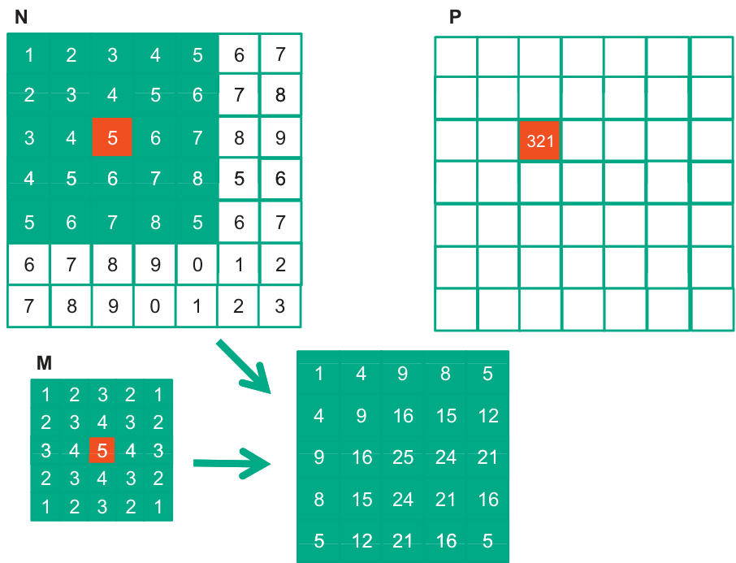

## Alocação Dinâmica de Registradores e o Impacto no Desempenho em Kernels CUDA

### Introdução

Em programação CUDA, a alocação eficiente de recursos de execução, como registradores, é crucial para otimizar o desempenho de kernels. A forma como as variáveis automáticas são tratadas e a capacidade de particionar dinamicamente os registradores nos Multiprocessadores de Streaming (SMs) afetam diretamente o grau de paralelismo alcançável. Este capítulo explora o conceito de alocação dinâmica de registradores, seu impacto no warp parallelism e as consequências de exceder os limites de registradores em um kernel CUDA.

### Conceitos Fundamentais

**Alocação de Registradores para Variáveis Automáticas:** Em um kernel CUDA, as variáveis automáticas (declaradas dentro do kernel) são alocadas em registradores [^4]. Os registradores são uma memória on-chip de alta velocidade dentro de cada SM, e seu uso eficiente é vital para minimizar a latência e maximizar a taxa de transferência. Diferentemente da memória global, que tem alta latência, o acesso a registradores é extremamente rápido, permitindo que os threads executem operações complexas sem gargalos significativos de memória.

**Particionamento Dinâmico de Registradores:** A arquitetura CUDA permite o particionamento dinâmico de registradores dentro de cada SM [^4]. Isso significa que o número de registradores alocados para um kernel não é fixo; ele pode variar dependendo das necessidades do kernel. Um SM pode acomodar mais blocos (e, portanto, mais threads) se cada bloco exigir menos registradores. Por outro lado, se os blocos necessitarem de mais registradores, o SM poderá acomodar menos blocos simultaneamente.

Essa flexibilidade é uma característica fundamental da arquitetura CUDA, que visa otimizar a utilização dos recursos do hardware. A capacidade de adaptar dinamicamente a alocação de registradores permite que o SM maximize o número de threads em execução, aproveitando o paralelismo inerente à aplicação.

**Impacto no Warp Parallelism:** O *warp parallelism* refere-se à capacidade de executar múltiplos warps (grupos de 32 threads) simultaneamente em um SM. A alocação de registradores tem um impacto direto no warp parallelism [^4]. Se um kernel usa muitos registradores por thread, o número de warps que podem ser executados simultaneamente é reduzido, limitando o paralelismo.

A relação entre o número de registradores usados e o warp parallelism é inversa. Mais registradores por thread significam menos warps por SM, e vice-versa. O objetivo, portanto, é encontrar um equilíbrio que maximize o uso dos registradores sem comprometer o número de warps em execução.

**O "Performance Cliff":** Exceder os limites de registradores disponíveis em um SM pode levar a uma queda drástica no desempenho, conhecida como "performance cliff" [^4]. Quando o número de registradores exigidos por um kernel excede o limite imposto pelo hardware, o compilador CUDA pode ser forçado a usar memória local (off-chip) para armazenar variáveis que normalmente estariam em registradores.

O uso da memória local introduz latência significativa, pois envolve o acesso à memória fora do chip. Essa latência pode reduzir drasticamente o desempenho do kernel, pois os threads precisam esperar pelos dados serem carregados da memória local. Além disso, o acesso à memória local geralmente envolve serialização, o que impede o paralelismo total dos threads.

Para evitar o "performance cliff", é essencial monitorar o uso de registradores pelos kernels CUDA e otimizar o código para minimizar o número de registradores necessários. Técnicas como reutilização de variáveis, compartilhamento de dados entre threads e otimizações do compilador podem ser usadas para reduzir a pressão sobre os registradores.

**Exemplo:**

Considere um kernel CUDA que realiza uma operação matricial. Se cada thread precisar armazenar vários elementos da matriz em registradores, o número total de registradores usados pelo kernel pode ser alto. Se o número de registradores exceder o limite, o compilador poderá ser forçado a usar a memória local, resultando em uma diminuição no desempenho.

Para otimizar esse kernel, é possível reduzir o número de elementos da matriz armazenados em registradores, usando técnicas como o tiling (divisão da matriz em blocos menores) ou o compartilhamento de dados entre threads. Ao reduzir o uso de registradores, é possível aumentar o warp parallelism e evitar o "performance cliff".

### Conclusão

A alocação dinâmica de registradores é um aspecto fundamental da programação CUDA que afeta diretamente o desempenho dos kernels. A capacidade de adaptar a alocação de registradores às necessidades do kernel permite que os SMs maximizem o número de threads em execução. No entanto, exceder os limites de registradores pode levar a uma queda drástica no desempenho devido ao uso da memória local e à redução do warp parallelism. Portanto, é crucial monitorar o uso de registradores e otimizar o código para garantir que os kernels CUDA alcancem o máximo desempenho possível.

### Referências
[^4]: Informação retirada do contexto fornecido.

<!-- END -->