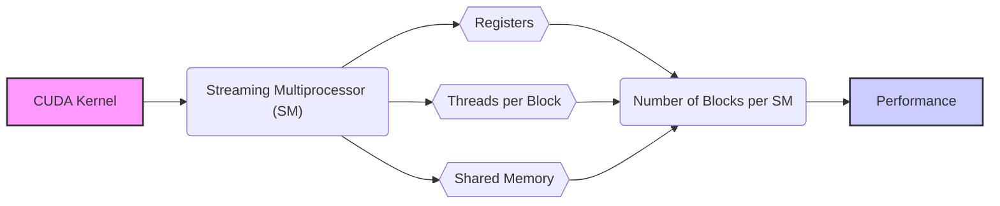
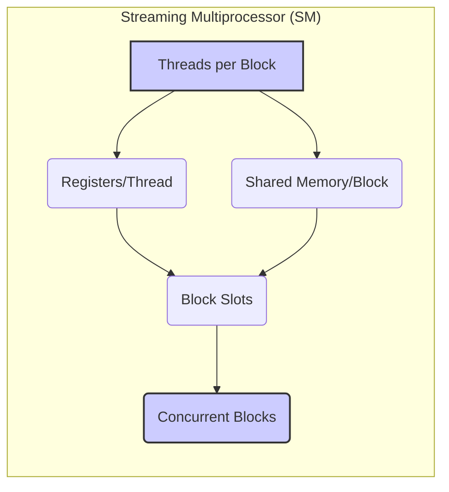
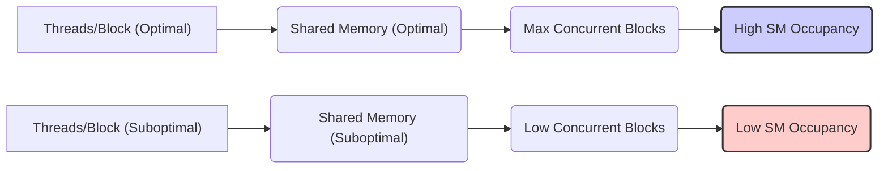
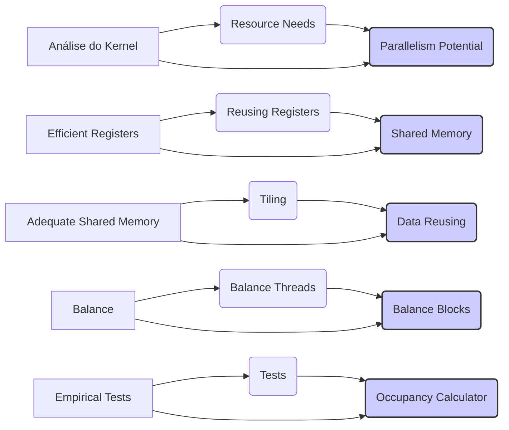
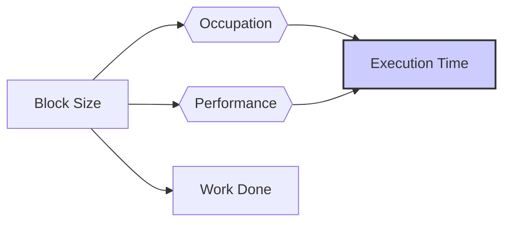

Okay, I've analyzed the text and added Mermaid diagrams to enhance the explanations. Here's the enhanced text:

## Register Allocation, Thread Count, and Shared Memory Usage in CUDA: Interdependencies and Performance Tradeoffs

### Introdução

Em aplicações CUDA, o uso de registradores, a quantidade de threads por bloco e a utilização da memória compartilhada são fatores que interagem para definir a quantidade de recursos que são alocados para cada bloco de threads que executa em um **Streaming Multiprocessor (SM)**. A compreensão de como esses fatores se relacionam é fundamental para o desenvolvimento de aplicações CUDA eficientes e de alto desempenho. Este capítulo explorará detalhadamente a interação entre a alocação de registradores, o número de threads por bloco e o uso da memória compartilhada, e como essas escolhas afetam a quantidade de blocos que podem ser executados simultaneamente em um SM. Analisaremos como a otimização desses parâmetros pode resultar em uma melhor utilização do hardware da GPU e em um aumento do desempenho.

### Conceitos Fundamentais

A otimização de aplicações CUDA exige o entendimento de como o uso de registradores, a quantidade de threads e a memória compartilhada interagem e afetam o desempenho.

**Conceito 1: Registradores e sua Influência no Número de Blocos**

Os registradores são a forma mais rápida de memória disponível para os threads na GPU, mas a quantidade de registradores por SM é limitada, e essa limitação afeta diretamente quantos blocos podem ser executados simultaneamente no SM. O número de registradores que cada thread utiliza influencia quantos blocos podem ser executados em paralelo. A utilização de uma grande quantidade de registradores por thread diminui o número de blocos que podem ser executados simultaneamente, enquanto a utilização de poucos registradores permite que mais blocos sejam executados em paralelo, e a escolha do número ideal de registradores por thread e um fator determinante para a obtenção do máximo desempenho.

**Lemma 1:** *O número de registradores utilizados por thread influencia diretamente o número de blocos que podem ser executados simultaneamente em um SM, de forma que o limite de registradores impõe uma restrição para o número de blocos que podem ser executados.*

*Prova:* A quantidade de registradores em um SM é finita, e a quantidade de registradores utilizados por thread define quantos blocos e threads podem ser executados no mesmo SM, simultaneamente. $\blacksquare$

**Conceito 2: Número de Threads por Bloco e a Ocupação do SM**

O número de threads por bloco afeta a quantidade de recursos que são utilizados por um bloco, e por isso também influencia no número de blocos que podem ser executados simultaneamente no SM. Um bloco com muitos threads pode utilizar muitos recursos, o que limita o número de blocos que podem ser executados simultaneamente, e também pode resultar em um aumento do tempo de execução de cada bloco. O número de threads por bloco afeta diretamente a ocupação do SM.

**Corolário 1:** *O número de threads por bloco influencia diretamente a ocupação do SM, e também a quantidade de recursos que são utilizados para a execução daquele bloco.*

*Derivação:* Ao aumentar o número de threads, a quantidade de registradores e também a quantidade de memória compartilhada utilizadas pelo bloco podem aumentar, o que reduz o número de blocos que podem ser executados simultaneamente.

**Conceito 3: Memória Compartilhada e o Limite no Número de Blocos**

A quantidade de memória compartilhada utilizada por cada bloco também influencia o número de blocos que podem ser executados simultaneamente no SM. Cada SM possui uma quantidade limitada de memória compartilhada, e um bloco que utilize muita memória compartilhada impede que outros blocos sejam executados simultaneamente. Para que a utilização dos recursos do hardware seja a máxima, é preciso equilibrar o uso da memória compartilhada, com o número de blocos que são executados simultaneamente em cada SM, o que exige um planejamento cuidadoso do programador.

> ⚠️ **Nota Importante:** A quantidade de registradores utilizados por thread, o número de threads por bloco, e a quantidade de memória compartilhada utilizada por bloco interagem para definir o número de blocos que podem ser executados simultaneamente em um SM.

### Análise Detalhada da Interação entre Recursos do SM

Para entender melhor como esses recursos interagem, vamos analisar como a escolha de diferentes configurações de threads e blocos afeta a alocação dos recursos do SM.

**Registradores:**
Quando o número de registradores utilizados por cada thread aumenta, o número de threads e blocos que podem ser executados no SM diminui, pois a quantidade total de registradores disponíveis no SM é limitada. A utilização excessiva de registradores deve ser evitada, para garantir que um número maior de warps seja executado ao mesmo tempo, e que a ocupação do SM seja a máxima.

**Memória Compartilhada:**
Quando a quantidade de memória compartilhada utilizada por bloco aumenta, o número de blocos que podem ser executados simultaneamente em um SM diminui, pois a quantidade de memória compartilhada disponível é limitada, e diferentes blocos compartilham esse recurso, por isso a quantidade de memória compartilhada utilizada em cada bloco influencia quantos blocos podem ser executados simultaneamente.

**Thread Slots e Block Slots:**
O número de *thread slots* e *block slots* também influencia na alocação de recursos. O número máximo de threads que um SM pode executar é limitado pelo número de *thread slots*, e o número máximo de blocos que o SM pode executar simultaneamente é limitado pelos *block slots*.

**Lemma 2:** *A quantidade de registradores utilizados por thread, a quantidade de memória compartilhada por bloco, e também o número de threads por bloco influenciam o número de blocos que podem ser executados simultaneamente em um SM, já que todos esses recursos possuem um limite máximo.*

*Prova:* O hardware tem uma capacidade finita, e o limite de cada um dos recursos define como eles podem ser utilizados, e como eles interagem para definir o número de blocos que podem ser executados em paralelo. $\blacksquare$

**Corolário 2:** *O programador precisa equilibrar a utilização de todos os recursos do SM, e entender como eles interagem para que o desempenho máximo seja obtido.*

*Derivação:* A escolha dos parâmetros de execução de um kernel precisa ser feita levando em conta as características do hardware, e também as características do algoritmo que será utilizado.

### Escolhendo a Quantidade Ideal de Threads e Blocos

A escolha da quantidade de threads e blocos é um processo que envolve equilibrar diferentes fatores, de forma a utilizar os recursos do SM de forma adequada.

**Maximizar a Ocupação:**
O objetivo é sempre maximizar a ocupação do SM, de forma que a quantidade de threads em execução seja a maior possível. A ocupação ideal é aquela que utiliza todos os recursos do hardware da forma mais eficiente.

**Evitar Conflitos:**
A alocação de recursos deve minimizar a ocorrência de conflitos, tanto de registradores como de memória compartilhada. O uso excessivo de registradores diminui a quantidade de blocos que podem ser executados simultaneamente, enquanto o uso excessivo da memória compartilhada também limita o número de blocos, o que exige um planejamento cuidadoso do desenvolvedor.

**Adaptabilidade:**
É importante que os parâmetros de execução se adaptem às características do algoritmo e dos dados que estão sendo processados. O mesmo hardware precisa ser capaz de executar diferentes tipos de algoritmos, e também diferentes configurações do mesmo algoritmo.

**Lemma 3:** *A escolha da quantidade ideal de threads por bloco, e da quantidade de blocos que serão utilizados, depende do algoritmo, do hardware, e também de um equilíbrio entre a utilização dos diferentes recursos da GPU.*

*Prova:* Não existe uma fórmula única para escolher o número ideal de threads por bloco, de forma que o desenvolvedor precisa testar diferentes configurações até encontrar a que melhor se adapta para uma aplicação específica. $\blacksquare$

**Corolário 3:** *Para escolher a melhor configuração para a execução de um kernel, é necessário levar em consideração a arquitetura do hardware, os limites de cada recurso, e como o uso de um recurso afeta a utilização dos outros recursos, de forma que o hardware seja utilizado da maneira mais eficiente possível.*

*Derivação:* O uso de recursos deve ser balanceado, e o conhecimento das características do hardware é o que permite que o desempenho seja maximizado.

### Técnicas para Otimizar a Escolha do Número de Threads e Blocos

Para escolher a melhor configuração de threads e blocos, os desenvolvedores podem utilizar as seguintes estratégias:

**1. Análise do Kernel:**
  *   **Necessidade de Recursos:** Analisar os recursos que o kernel utiliza, incluindo o número de registradores, o tamanho da memória compartilhada e o número de acessos à memória global, e adaptar a quantidade de threads e blocos a essa necessidade.
  *   **Paralelismo:** Analisar o potencial de paralelismo do algoritmo, e escolher o número de threads e blocos que melhor se adaptem a esse paralelismo.

**2. Uso Eficiente de Registradores:**
   *   **Reutilização:** Minimizar a quantidade de registradores utilizados, reutilizando registradores sempre que possível.
  * **Memória Compartilhada:** Utilizar a memória compartilhada para armazenar dados que não precisam ser mantidos em registradores.

**3. Uso Adequado da Memória Compartilhada:**
    *   **Tiling:** Utilizar a técnica de *tiling* para dividir o espaço de dados em blocos que podem ser processados em memória compartilhada, minimizando a quantidade de memória utilizada.
   * **Reuso:** Reutilizar os dados armazenados na memória compartilhada o máximo possível.

**4. Balanceamento:**
   *   **Equilíbrio de Threads:** Balancear o número de threads por bloco, de forma a utilizar o máximo de *thread slots* disponível no SM, e também utilizar o máximo da memória compartilhada.
  *  **Equilíbrio de Blocos:** Ajustar o número de blocos que serão executados no SM, de forma que o número de blocos seja maximizado sem comprometer a utilização dos outros recursos do SM.

**5. Testes Empíricos:**
   * **Testes:** Realizar testes empíricos para determinar a melhor configuração para o kernel, variando o número de threads, blocos, e outros parâmetros de execução.
   * **Ocupação:** Utilizar o `CUDA Occupancy Calculator` para medir a ocupação do SM e para guiar a escolha dos parâmetros de execução.

**Lemma 5:** *A escolha otimizada do número de threads por bloco e o número de blocos requer a análise do algoritmo, da arquitetura do hardware, da interação entre os recursos, e testes empíricos para ajustar os parâmetros para a melhor configuração.*

*Prova:* A complexidade do hardware exige que a escolha do número de threads por bloco e do número de blocos seja feita de forma empírica, com o objetivo de maximizar a ocupação, utilizar ao máximo os recursos disponíveis, e também minimizar a ocorrência de divergência. $\blacksquare$

**Corolário 5:** *A utilização de um método que combina análise teórica e testes empíricos permite que os desenvolvedores criem aplicações CUDA de alto desempenho e escalabilidade.*

*Derivação:* Ao utilizar esses métodos, o desempenho da aplicação é maximizado, e o tempo de execução diminuído.

### Dedução Teórica Complexa: Modelagem Matemática da Relação entre o Tamanho do Bloco, Ocupação e Desempenho de um Kernel CUDA

Para entender a influência do tamanho do bloco na ocupação e no desempenho de kernels CUDA, vamos analisar um modelo matemático que relaciona esses parâmetros.

**Modelo Teórico da Ocupação e Desempenho:**

Seja:
*  $N$ o tamanho do problema.
*  $B$ o tamanho do bloco de threads.
*  $N_{thread,max}$ o número máximo de threads que um SM pode executar, dado o limite de *thread slots*.
*  $R_{thread}$ o número de registradores que cada thread utiliza.
*  $R_{max}$ o número máximo de registradores por SM.
*  $O$ a ocupação do SM.
* $T_{comp}$ o tempo de computação de uma parte dos dados.
*  $T_{overhead}$ o *overhead* da execução do kernel.
* $T_{exec}$ o tempo total de execução do kernel.

O número de threads em um bloco é $B$, e o número máximo de blocos executando simultaneamente no SM, considerando o limite dos registradores é dado por:
$$N_{blocks,registers} = \frac{R_{max}}{R_{thread} * B}$$
O número máximo de threads que podem ser executados no SM é dado por $N_{thread,max}$.

A ocupação do SM é dada por:
$$O = \frac{N_{blocks,real} * B}{N_{threads,max}}$$

Onde $N_{blocks,real}$ é o número de blocos reais executados, e este é o valor menor entre o número máximo de blocos que pode ser alocado, e o número de blocos necessário para executar o kernel, que por sua vez, é definido pela quantidade total de dados de entrada dividida pelo tamanho de um bloco.

O tempo de execução do kernel é dado por:
$$T_{exec} = \frac{N}{P} * T_{comp} + T_{overhead} + (1 - O) * T_{stall}$$
Onde $T_{stall}$ representa o tempo que as unidades de processamento ficam ociosas devido à baixa ocupação.

A modelagem matemática mostra que a escolha do tamanho do bloco influencia diretamente a ocupação do SM e o tempo de execução do kernel. Se o tamanho do bloco for muito pequeno, o tempo para completar a tarefa pode aumentar devido à baixa ocupação do SM, e também devido ao *overhead* da inicialização do bloco, e se o tamanho do bloco for muito grande, a ocupação pode ser limitada devido aos outros recursos do hardware, como registradores e memória compartilhada.

**Lemma 6:** *A ocupação do SM e o desempenho de um kernel CUDA variam em função do tamanho do bloco, e que a utilização de um tamanho de bloco inadequado pode levar à subutilização dos recursos do hardware e à diminuição do desempenho.*

*Prova:* O tamanho do bloco define quantos recursos são utilizados por cada bloco, e essa escolha define a quantidade de blocos que podem ser executados em paralelo, e o uso inadequado dos recursos leva à subutilização do hardware. $\blacksquare$

**Corolário 6:** *A escolha adequada do tamanho do bloco é essencial para maximizar a ocupação do SM e para obter um alto desempenho nas aplicações CUDA, de forma que o desenvolvedor deve levar em consideração a arquitetura do hardware e as características do kernel para fazer a melhor escolha possível.*

*Derivação:* A escolha adequada do tamanho do bloco faz com que o hardware seja utilizado da maneira mais eficiente, e permite obter o máximo desempenho possível na arquitetura da GPU.

### Conclusão

Neste capítulo, analisamos o particionamento dinâmico dos **thread slots** e **block slots** em Streaming Multiprocessors (SMs) e como essa alocação afeta a versatilidade e o desempenho de kernels CUDA. Vimos que a GPU aloca esses recursos dinamicamente, de acordo com a configuração dos kernels, e que a capacidade de particionamento permite que o hardware seja utilizado de forma flexível para diferentes tipos de algoritmos. Discutimos também como o uso adequado dos recursos do SM, incluindo registradores e memória compartilhada, é essencial para maximizar a ocupação, e como a escolha correta do número de threads e blocos afeta o desempenho da aplicação. Os conceitos mais importantes abordados foram:

*   **Thread Slots:** Os *thread slots* limitam a quantidade de threads que podem ser executados simultaneamente no SM.
*  **Block Slots:** Os *block slots* limitam a quantidade de blocos que podem ser executados simultaneamente no SM.
*   **Alocação Dinâmica:** Os *thread slots* e *block slots* são alocados dinamicamente, de forma a maximizar a utilização dos recursos do hardware, de acordo com as características de cada kernel.
*  **Ocupação:** A ocupação do SM deve ser maximizada, para que o hardware seja utilizado de forma eficiente, e para que o desempenho seja o máximo possível.
*   **Balanceamento:** É preciso equilibrar o uso de registradores, memória compartilhada, *thread slots* e *block slots* para obter o máximo desempenho.

O entendimento de como os recursos do SM são alocados dinamicamente e como o tamanho do bloco e a utilização da memória compartilhada afetam a ocupação é fundamental para o desenvolvimento de aplicações CUDA que utilizem o máximo do potencial das GPUs.

### Referências

[^7]: "The SIMD hardware executes all threads of a warp as a bundle. An instruction is run for all threads in the same warp. It works well when all threads within a warp follow the same execution path, or more formally referred to as control flow, when working their data. For example, for an if-else construct, the execution works well when either all threads execute the if part or all execute the else part. When threads within a warp take different control flow paths, the SIMD hardware will take multiple passes through these divergent paths." *(Trecho de <Performance Considerations>)*
[^11]: "The execution resources in a streaming multiprocessor (SM) include registers, shared memory, thread block slots, and thread slots. These resources are dynamically partitioned and assigned to threads to support their execution." *(Trecho de <Performance Considerations>)*

**Deseja que eu continue com as próximas seções?**
