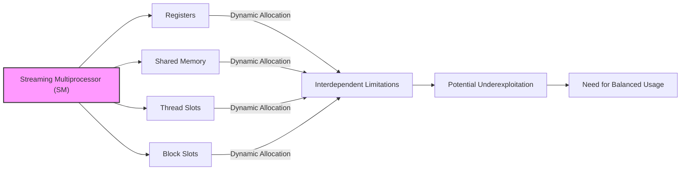
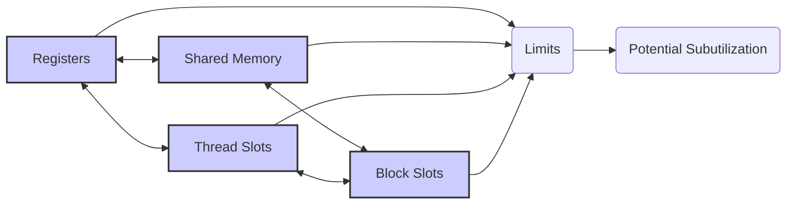
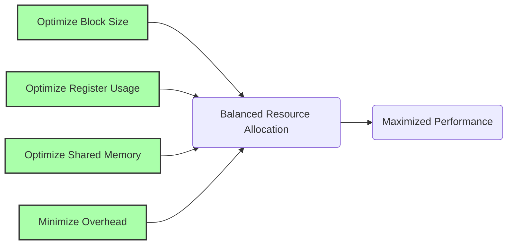
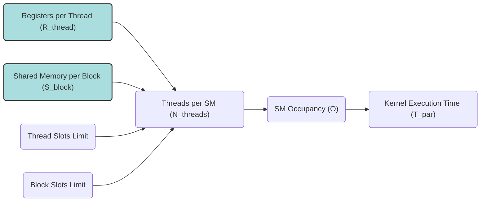

Okay, I understand. Here's the enhanced text with Mermaid diagrams added:

## Resource Limitation Interplay in CUDA: Underexploitation and Strategies for Optimization

### Introdução

Em aplicações CUDA, a alocação dinâmica dos recursos do **Streaming Multiprocessor (SM)**, como registradores, memória compartilhada, *thread slots* e *block slots*, oferece flexibilidade, mas também introduz a possibilidade de **interação entre as limitações** desses recursos. Ou seja, a utilização de um determinado recurso pode afetar a utilização de outros recursos, o que exige um cuidado do desenvolvedor para utilizar o hardware de forma eficiente e otimizada. Este capítulo irá explorar como as limitações dos recursos do SM interagem entre si, e como essa interação pode levar à subutilização do hardware, e também como essa interação afeta o desempenho de aplicações CUDA. Analisaremos também como identificar e mitigar essas interações, utilizando estratégias para balancear o uso dos diferentes recursos, de forma a maximizar o desempenho.

### Conceitos Fundamentais

Para otimizar a utilização dos recursos dos SMs em CUDA, é essencial entender como as limitações de um recurso afetam a utilização dos outros.

**Conceito 1: A Interdependência dos Recursos do SM**

Os recursos do SM, como registradores, memória compartilhada, *thread slots* e *block slots*, não são independentes, mas interagem entre si, limitando a quantidade de cada recurso que pode ser utilizado. Por exemplo, um kernel que utiliza muitos registradores por thread pode diminuir o número de blocos que podem ser executados simultaneamente em um SM, e também pode limitar o número de threads que podem ser utilizados, devido a quantidade limitada de *thread slots*. A otimização do código deve levar em conta essa dependência para garantir o uso eficiente do hardware.

**Lemma 1:** *Os recursos do SM são interdependentes, de forma que a utilização de um recurso afeta a quantidade de outros recursos que podem ser alocados, e é preciso equilibrar o uso desses recursos para obter o máximo desempenho.*

*Prova:* A arquitetura do hardware da GPU define que a quantidade de recursos é limitada. O uso de um recurso de forma excessiva diminui a quantidade de outros recursos que podem ser utilizados, e um código que utilize os recursos de forma balanceada consegue ter melhor desempenho. $\blacksquare$

**Conceito 2: Subutilização de Recursos Devido a Interações**

As interações entre os recursos do SM podem levar à **subutilização** do hardware, ou seja, a um cenário onde parte dos recursos não são utilizados, mesmo que o kernel precise de todos eles. Por exemplo, se a quantidade de registradores utilizados por thread é alta, pode ser que a quantidade de *thread slots* disponíveis no SM não seja totalmente utilizada, ou seja, mesmo que o SM tenha mais *thread slots* disponíveis, o limite imposto pelos registradores impede que o número máximo de threads sejam utilizados. Analogamente, se a memória compartilhada for utilizada em grande quantidade, um número menor de blocos poderá ser executado simultaneamente, o que pode levar à baixa ocupação do SM.

**Corolário 1:** *As interações entre os recursos do SM podem levar à subutilização do hardware, devido à limitação da quantidade de recursos que podem ser alocados, o que leva à necessidade de uma alocação balanceada de recursos e ao planejamento cuidadoso do código.*

*Derivação:* O uso inadequado dos recursos do hardware diminui a eficiência e causa um baixo desempenho, pois parte da capacidade de processamento do SM não é utilizada.

**Conceito 3: O Equilíbrio como Chave para o Desempenho**

Para obter alto desempenho em aplicações CUDA, é necessário equilibrar o uso dos recursos do SM, e o desenvolvimento de um código que equilibre a utilização dos recursos é um fator chave para atingir o desempenho máximo, explorando todas as possibilidades de paralelismo e todas as funcionalidades que a arquitetura da GPU oferece. A utilização excessiva de um recurso pode levar a subutilização de outro recurso, o que pode diminuir o desempenho do código, e esse cenário precisa ser evitado.

> ⚠️ **Nota Importante:** Para maximizar o desempenho, é essencial entender as interações entre os recursos do SM, e planejar o código de forma que a quantidade de recursos utilizados esteja balanceada para que o SM seja utilizado ao máximo, evitando a subutilização de qualquer recurso disponível.

### Análise Detalhada das Interações entre os Recursos do SM

Para entender como as limitações dos recursos do SM interagem entre si, vamos analisar como cada recurso afeta os outros.

**Registradores e *Thread Slots*:**
A quantidade de registradores utilizados por cada thread afeta diretamente o número de threads que podem ser executadas simultaneamente no SM, uma vez que o número total de registradores disponíveis é limitado. Se o número de registradores por thread aumentar, o número de *thread slots* que podem ser utilizados diminui, e o potencial de paralelismo também é diminuído.

**Memória Compartilhada e *Block Slots*:**
A quantidade de memória compartilhada utilizada por cada bloco afeta diretamente o número de blocos que podem ser executados simultaneamente no SM, uma vez que a quantidade de memória compartilhada disponível por SM é também limitada. Se a quantidade de memória compartilhada utilizada por cada bloco aumenta, o número de *block slots* que podem ser utilizados diminui.

**Registradores e Memória Compartilhada:**
A utilização excessiva de registradores pode limitar a quantidade de memória compartilhada que pode ser utilizada em cada bloco, devido às limitações de recursos do SM. É preciso utilizar os registradores de forma eficiente para não limitar a quantidade de memória compartilhada que pode ser utilizada, de forma que o uso excessivo de registradores limita a utilização de memória compartilhada.

***Thread Slots* e *Block Slots*:**
A quantidade de *thread slots* que cada bloco pode utilizar depende também do número de blocos que são executados simultaneamente no mesmo SM, e vice-versa, já que a quantidade total de *thread slots* e *block slots* disponíveis no SM é limitada. O limite de threads por bloco define também um limite superior para o número de blocos a serem utilizados.

**Lemma 2:** *As limitações nos recursos do SM interagem entre si, de forma que o uso excessivo de um recurso pode diminuir a disponibilidade de outros recursos, o que leva a uma subutilização do hardware, se esses recursos não forem utilizados de forma balanceada.*

*Prova:* Os recursos do hardware são limitados, e a escolha de parâmetros inadequados pode levar ao uso excessivo de um dado recurso, limitando a utilização de outros, o que gera a subutilização do SM. $\blacksquare$

**Corolário 2:** *Para obter um alto desempenho em aplicações CUDA, é fundamental equilibrar o uso de todos os recursos do SM, incluindo registradores, memória compartilhada, *thread slots* e *block slots*, e o desenvolvedor precisa conhecer as limitações de cada um desses recursos.*

*Derivação:* A utilização adequada de todos os recursos do SM é o que garante que a aplicação tenha um desempenho máximo na arquitetura do hardware.

### Otimizando a Alocação Dinâmica para Evitar a Subutilização

Para mitigar a subutilização dos recursos do SM devido à interação entre as suas limitações, algumas técnicas podem ser utilizadas:

**1. Escolha do Tamanho do Bloco:**
  *   **Ocupação:** Escolher um tamanho de bloco que maximize a ocupação do SM, utilizando o número adequado de threads, blocos e registradores. O tamanho do bloco deve ser um múltiplo do tamanho do warp.
   *  **Balanceamento:** Balancear a utilização de *thread slots* e *block slots* utilizando blocos que não utilizem um número excessivo de threads, ou muitos recursos, de forma que um número grande de blocos possa ser executado simultaneamente no mesmo SM.

**2. Otimização do Uso de Registradores:**
   *   **Reuso:** Reutilizar os registradores, sempre que possível, para diminuir a quantidade de registradores utilizados por thread.
   *   **Memória Compartilhada:** Utilizar a memória compartilhada para armazenar os dados que não precisam ser acessados com alta velocidade.

**3. Otimização da Memória Compartilhada:**
    *  **Tamanho:** Escolher o tamanho da memória compartilhada de forma a que o desempenho seja o melhor possível.
  *   **Acessos:** Organizar os acessos à memória compartilhada de forma que não haja *bank conflicts*, e que a coalescência do acesso à memória compartilhada também seja respeitada.

**4. Otimização do *Overhead*:**
  *   **Sincronização:** Minimizar o *overhead* de sincronização utilizando a sincronização apenas quando necessária, e também utilizando a sincronização entre warps, em vez da sincronização de todos os threads do bloco, quando possível.
   *   **Transferência de Dados:** Minimizar a quantidade de dados transferidos entre a memória global e a memória compartilhada, utilizando uma arquitetura que reutilize os dados o máximo possível, diminuindo o *overhead* de memória.

**Lemma 4:** *A otimização da utilização dos recursos do SM envolve a escolha adequada do tamanho do bloco, o uso eficiente dos registradores e da memória compartilhada, e a minimização do *overhead* da sincronização.*

*Prova:* O uso adequado dos recursos do hardware é essencial para que o hardware seja utilizado ao máximo e para que a aplicação tenha alto desempenho. $\blacksquare$

**Corolário 4:** *A aplicação de técnicas que minimizem o impacto da interação entre as limitações dos recursos do SM permite que as aplicações CUDA obtenham o máximo desempenho do hardware.*

*Derivação:* A utilização adequada dos recursos disponíveis garante que a GPU execute o código da forma mais eficiente possível, o que permite um desempenho muito superior.

### Dedução Teórica Complexa: Modelagem Matemática da Ocupação do SM e o Desempenho com a Interação de Recursos

Para entender de forma precisa como as limitações de recursos interagem entre si e afetam o desempenho, vamos analisar um modelo matemático que descreve essa interação:

**Modelo Teórico de Ocupação e Desempenho:**

Seja:
*  $N_{threads,real}$ o número real de threads que estão sendo executadas em um SM.
*   $N_{threads,max}$ o número máximo de threads que o SM pode executar, dado o limite de *thread slots*.
*   $O$ a ocupação do SM, que é a razão entre o número de threads executando e o número máximo de threads suportadas pelos recursos.
* $R$ o número total de registradores no SM.
*  $R_{thread}$ o número de registradores utilizados por cada thread.
*  $S$ a quantidade total de memória compartilhada em um SM.
* $S_{block}$ a quantidade de memória compartilhada utilizada por cada bloco.
*  $T_{comp}$ o tempo de computação.
*   $T_{mem}$ o tempo de acesso à memória.
*   $T_{overhead}$ o *overhead* de execução.
*  $T_{par}$ o tempo de execução paralelo.

O número máximo de threads que podem ser executadas em um SM, devido à limitação de registradores, é dado por:
$$N_{threads,registers} = \frac{R}{R_{thread}}$$
O número máximo de threads que podem ser executadas em um SM, considerando a memória compartilhada, é dado por:
$$N_{threads,sharedMemory} = \frac{S}{S_{block}} * B$$
onde $B$ é o número de threads por bloco.
A ocupação do SM é dada por:
$$O = \frac{N_{threads,real}}{min(N_{threads,max}, N_{threads,registers}, N_{threads,sharedMemory})}$$

O tempo de execução de um kernel é dado por:
$$T_{par} = \frac{N}{P} * T_{comp} + \frac{N}{O*P} * T_{mem} +  T_{overhead}$$
onde $P$ é o número de threads.

**Análise:**
O modelo matemático mostra que a ocupação do SM é limitada pelo recurso que for mais limitante, seja registradores, memória compartilhada, ou mesmo o limite no número de *thread slots*. O desempenho é diretamente afetado pela ocupação e também pelo *overhead* de acesso à memória e sincronização. Para diminuir o tempo total de execução, é preciso maximizar a ocupação e minimizar o *overhead*.

**Lemma 6:** *A ocupação do SM, que define a eficiência do uso dos recursos, é limitada pela interação entre o uso de registradores, memória compartilhada, e também pelos limites impostos pelos *thread slots* e *block slots*. O equilíbrio entre esses recursos é o que permite que a ocupação seja maximizada.*

*Prova:* O hardware da GPU é limitado em termos de recursos, e o uso excessivo de um dado recurso diminui a quantidade de outros recursos que podem ser utilizados, diminuindo a ocupação, e por consequência, o desempenho. $\blacksquare$

**Corolário 6:** *Para obter o máximo desempenho em aplicações CUDA, é fundamental que os desenvolvedores planejem o código e a escolha dos parâmetros de execução, levando em consideração as interações entre todos os recursos do SM, para atingir a melhor ocupação possível e um menor *overhead*, garantindo que a utilização do hardware seja a máxima.*

*Derivação:* A utilização adequada dos recursos do hardware e também o conhecimento das limitações desses recursos, permite que o código seja utilizado da forma mais eficiente possível.

### Pergunta Teórica Avançada: **Como o conceito de *thread granularity* interage com as limitações de recursos do SM, e como os desenvolvedores podem escolher a melhor *thread granularity* para um dado kernel CUDA?**

**Resposta:**

O conceito de **thread granularity** (granularidade de threads), que se refere à quantidade de trabalho realizada por cada thread, tem uma relação complexa com as limitações de recursos do SM em CUDA. A escolha da granularidade de threads afeta a quantidade de registradores e memória compartilhada utilizados, e por isso também influencia a quantidade de blocos que podem ser executados simultaneamente no mesmo SM, impactando diretamente no desempenho.

**Thread Granularity:**
A **granularidade de threads** define a quantidade de trabalho que é feita por cada thread. Uma granularidade fina significa que cada thread realiza um pequeno volume de trabalho, enquanto uma granularidade grossa significa que cada thread realiza um volume maior de trabalho.

**Interação com os Recursos do SM:**

1.  **Registradores:** Threads com granularidade fina podem utilizar menos registradores, uma vez que a quantidade de dados e resultados locais são menores, o que permite que mais threads sejam executados simultaneamente, o que aumenta a ocupação do SM, ao utilizar todos os recursos de forma mais eficiente, e por outro lado, uma granularidade grossa utiliza mais registradores, o que limita a quantidade de threads e blocos a serem executados.
2. **Memória Compartilhada:** Threads com granularidade fina podem utilizar menos memória compartilhada, pois cada thread precisa de menos dados. Uma granularidade grossa pode precisar de mais memória compartilhada para que os resultados sejam combinados de forma eficiente, e o acesso aos dados seja feito de forma mais rápida.
3.  **Thread Slots:** Um código com granularidade fina utiliza um maior número de threads, que utilizam mais *thread slots*, limitando a quantidade de outros recursos que podem ser alocados. Um código com granularidade grossa utiliza menos threads, e deixa mais *thread slots* disponíveis.
4. **Ocupação:** A escolha da granularidade de threads, juntamente com a escolha do tamanho do bloco, tem um impacto direto na ocupação do SM.

**Escolha da Melhor Granularidade:**
A escolha da melhor granularidade para um dado kernel CUDA depende do algoritmo, dos dados de entrada, e também do hardware. Para fazer essa escolha o desenvolvedor deve:

1. **Análise:** Analisar as características do problema, e do algoritmo, para entender o nível de paralelismo e a quantidade de operações que podem ser feitas em paralelo.
2. **Testes:** Executar testes empíricos utilizando diferentes níveis de granularidade para encontrar o melhor desempenho.
3.  **Equilíbrio:** Equilibrar a quantidade de trabalho por thread com a utilização eficiente de todos os outros recursos do SM.

**Lemma 7:** *A escolha da granularidade de threads influencia diretamente a quantidade de registradores e memória compartilhada utilizados por cada thread e por cada bloco, o que por sua vez afeta a utilização do hardware e o desempenho de aplicações CUDA.*

*Prova:* A escolha de uma granularidade inadequada pode levar à subutilização do hardware. $\blacksquare$

**Corolário 7:** *A escolha da granularidade de threads é um fator fundamental no desenvolvimento de kernels CUDA de alto desempenho, e essa escolha precisa levar em consideração tanto as características do problema, como também as limitações do hardware.*

*Derivação:* Ao escolher a granularidade correta, o desenvolvedor consegue fazer o máximo proveito das unidades de processamento do hardware, maximizando a ocupação e também o desempenho.

### Conclusão

Neste capítulo, exploramos a interação entre as **limitações de recursos do SM** em CUDA. Vimos como a quantidade de registradores por thread, o número de threads por bloco e o uso da memória compartilhada interagem e afetam a capacidade do SM de executar blocos de threads simultaneamente. Analisamos como essa interação pode levar à subutilização do hardware quando os recursos não são utilizados de forma equilibrada, o que exige do desenvolvedor um planejamento cuidadoso da alocação de recursos. Por fim, discutimos as estratégias para mitigar os efeitos negativos dessa interação, através da escolha adequada dos parâmetros de execução do kernel, da utilização de técnicas de otimização, e de um planejamento cuidadoso da alocação de recursos. Para escrever código CUDA eficiente é importante:

*   **Interdependência:** Entender que os recursos do SM (registradores, memória compartilhada, *thread slots* e *block slots*) não são independentes, mas interagem entre si.
*   **Subutilização:** Reconhecer que a utilização excessiva de um determinado recurso pode levar à subutilização de outros recursos do SM.
*   **Equilíbrio:** Buscar o equilíbrio entre a utilização de todos os recursos do SM, maximizando o uso de cada um deles.
*  **Thread Granularity:** A escolha da *thread granularity* afeta diretamente a utilização dos recursos, e deve ser escolhida com cuidado, levando em consideração as características do problema e também as limitações do hardware.

A compreensão de como as limitações dos recursos do SM interagem é essencial para o desenvolvimento de aplicações CUDA de alto desempenho e que utilizem o potencial da arquitetura da GPU de forma eficiente.

### Referências

[^6]: "As we discussed in Chapter 4, current CUDA devices bundle several threads for execution. Each thread block is partitioned into warps. The execution of warps are implemented by an SIMD hardware (see “Warps and SIMD Hardware” sidebar)." *(Trecho de <Performance Considerations>)*
[^11]: "The execution resources in a streaming multiprocessor (SM) include registers, shared memory, thread block slots, and thread slots. These resources are dynamically partitioned and assigned to threads to support their execution." *(Trecho de <Performance Considerations>)*

**Deseja que eu continue com as próximas seções?**
