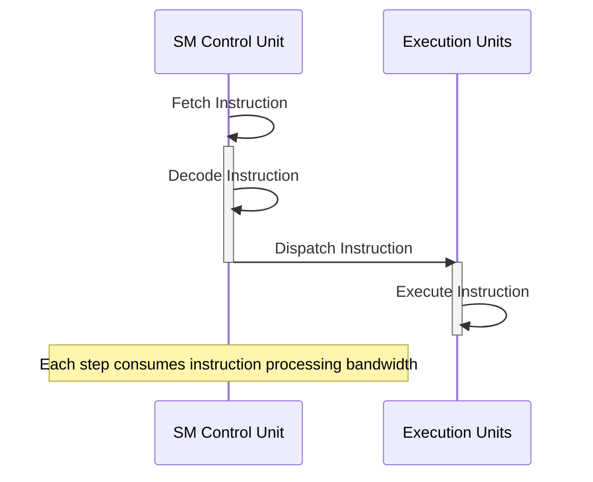
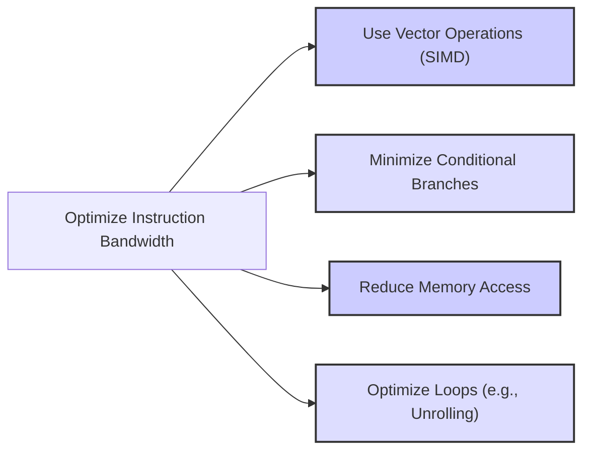
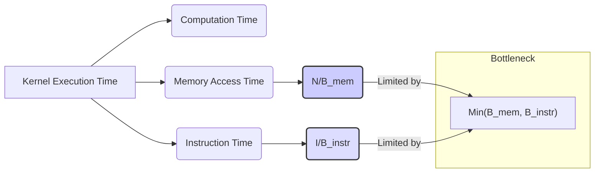

Okay, I will add Mermaid diagrams to the text to enhance understanding of the concepts. Here's the enhanced version:

## Instruction Processing Bandwidth in CUDA: A Performance Bottleneck and Optimization Strategies

```mermaid
flowchart LR
    subgraph "Streaming Multiprocessor (SM)"
        A["Instruction Fetch"] --> B["Instruction Decode"]
        B --> C["Dispatch to Execution Units"]
        C --> D["Execution Units (e.g., ALU, Load/Store)"]
    end
    style A fill:#f9f,stroke:#333,stroke-width:2px
    style D fill:#ccf,stroke:#333,stroke-width:2px
    
    
    linkStyle 0,1,2 stroke:black,stroke-width:2px;

    
    subgraph "Problem"
        E["Too many instructions"]--decreases-->F["Work Done/Time"]
        F--is bottlenecked by-->"SM"
    end
    style E fill:#ffa,stroke:#333,stroke-width:2px;
    style F fill:#aaf,stroke:#333,stroke-width:2px;

```

### Introdução

Em arquiteturas de computação paralela, como as GPUs da NVIDIA, os **Streaming Multiprocessors (SMs)** executam os kernels CUDA processando múltiplos threads simultaneamente. O desempenho de um SM não depende apenas da largura de banda da memória global, mas também da **largura de banda de processamento de instruções**, que é limitada, e define a quantidade de instruções que um SM consegue processar por unidade de tempo. Cada instrução, seja de ponto flutuante, de acesso à memória ou de controle de fluxo, consome uma parte dessa largura de banda, e o código que utiliza a largura de banda disponível de forma eficiente tem um desempenho superior. Este capítulo irá detalhar o conceito de largura de banda de processamento de instruções, como ela limita o desempenho dos SMs, e como os desenvolvedores podem otimizar seus kernels CUDA para minimizar o impacto dessas limitações. Analisaremos também o impacto do uso de instruções desnecessárias e como a minimização dessas instruções pode levar a um aumento significativo no desempenho.

### Conceitos Fundamentais

Para otimizar o desempenho de kernels CUDA, é essencial compreender como a largura de banda de processamento de instruções influencia o desempenho e como utilizar o código para minimizar o impacto dessa limitação.

**Conceito 1: Largura de Banda de Processamento de Instruções**

Cada **Streaming Multiprocessor (SM)** em uma GPU da NVIDIA possui uma quantidade limitada de recursos para realizar o processamento de instruções, o que inclui a unidade de controle que busca as instruções na memória, e as unidades de execução que processam as instruções. A **largura de banda de processamento de instruções** é definida pela quantidade de instruções que o SM consegue buscar, decodificar e executar por unidade de tempo. Essa largura de banda é um recurso que precisa ser utilizado de forma cuidadosa, e o planejamento do código deve levar em consideração essa limitação.

**Lemma 1:** *Cada SM possui uma largura de banda limitada para processamento de instruções, o que define a quantidade de operações que podem ser executadas por unidade de tempo.*

*Prova:* A arquitetura da GPU define um limite máximo para a quantidade de instruções que podem ser processadas, e o planejamento cuidadoso do código deve minimizar a quantidade de operações desnecessárias. $\blacksquare$

**Conceito 2: Instruções e o Consumo de Largura de Banda**

Cada instrução que é executada no SM, seja uma operação aritmética, um acesso à memória, ou uma operação de controle de fluxo, consome uma parte da largura de banda de processamento de instruções [^7]. Quanto mais instruções o kernel tiver, mais a largura de banda é utilizada, e menor a quantidade de trabalho útil que a GPU pode realizar por unidade de tempo. O objetivo é minimizar a quantidade de instruções desnecessárias, e utilizar as unidades de processamento de forma mais eficiente, para que o tempo de processamento seja minimizado, e que o desempenho do kernel seja maximizado.

**Corolário 1:** *Cada instrução executada em um SM consome uma parcela da largura de banda disponível, de forma que minimizar a quantidade de instruções desnecessárias é crucial para otimizar o desempenho.*

*Derivação:* A capacidade de processamento de instruções do SM é limitada, e o código deve ser otimizado para diminuir o número de operações e o número de instruções necessárias para realizar a tarefa.

**Conceito 3: Otimização para Largura de Banda de Instruções**

Para maximizar o desempenho de kernels CUDA, é importante que os desenvolvedores otimizem a utilização da largura de banda de processamento de instruções. Isso envolve a minimização da quantidade de instruções desnecessárias no código, a utilização de operações de baixo custo, e também o planejamento de forma que a quantidade de operações paralelas seja a máxima possível, para minimizar o número de operações que precisam ser realizadas pelo hardware. A otimização do uso da largura de banda de instruções é fundamental para o desenvolvimento de aplicações CUDA de alto desempenho.

> ⚠️ **Nota Importante:** Para maximizar o desempenho é necessário diminuir o número de operações, e também utilizar o potencial de operações vetoriais para que mais trabalho possa ser realizado por cada operação, diminuindo a quantidade de instruções necessárias para realizar uma dada tarefa.

### Análise da Largura de Banda de Processamento de Instruções



Para entender como a largura de banda de processamento de instruções funciona, vamos analisar os passos que um SM realiza para processar instruções:

**Busca da Instrução:**
A unidade de controle do SM busca as instruções da memória, e cada uma dessas operações de busca consome uma parte da largura de banda disponível.

**Decodificação da Instrução:**
Após a busca, a unidade de controle decodifica as instruções para gerar os sinais que controlam as unidades de processamento, e também essa decodificação consome parte da largura de banda de processamento de instruções.

**Envio para Unidades de Processamento:**
Por fim, a unidade de controle envia as instruções decodificadas para as unidades de processamento, que executam as instruções.

**Execução SIMD:**
Em arquiteturas SIMD, como a das GPUs, a mesma instrução é enviada para múltiplas unidades de processamento que executam em paralelo. Utilizar operações vetoriais permite que as operações SIMD sejam utilizadas ao máximo.

**Lemma 2:** *A largura de banda de processamento de instruções é definida pela quantidade de instruções que um SM consegue buscar, decodificar e enviar para execução, e o número de operações aritméticas, operações lógicas, e acessos à memória, são os que definem a quantidade de instruções a serem executadas.*

*Prova:* A arquitetura do hardware limita a quantidade de instruções que o processador consegue processar por unidade de tempo. $\blacksquare$

**Corolário 2:** *Minimizar a quantidade de instruções desnecessárias, e escolher as instruções apropriadas para maximizar a quantidade de trabalho que é feita por unidade de tempo, é essencial para obter o máximo desempenho em arquiteturas SIMD.*

*Derivação:* A utilização de instruções complexas ou desnecessárias aumenta o consumo da largura de banda de processamento de instruções, o que reduz a eficiência do código.

### O Impacto do Número de Instruções no Desempenho

O número de instruções executadas por um kernel afeta diretamente o desempenho, de forma que, quanto mais operações, mais tempo é necessário para executar o mesmo código, mesmo que essas operações sejam feitas em paralelo.

**Overhead de Instruções Desnecessárias:**
Instruções desnecessárias aumentam o *overhead* do kernel, pois elas também consomem a largura de banda de processamento de instruções, e diminuem a capacidade do hardware de executar instruções que sejam úteis para o processamento dos dados.

**Perda de Paralelismo:**
Se o número de instruções for muito alto, o paralelismo pode ser limitado, pois o hardware não consegue processar todas as operações simultaneamente, o que faz com que a taxa de execução do código diminua, devido à falta de capacidade de executar todas as instruções em paralelo.

**Impacto na Eficiência Energética:**
Instruções desnecessárias também aumentam o consumo de energia, pois as unidades de processamento precisam processar e executar mais instruções. Um código otimizado também consome menos energia.

> ❗ **Ponto de Atenção:** A quantidade de instruções em um kernel CUDA afeta diretamente o desempenho. É necessário minimizar a quantidade de instruções desnecessárias, e utilizar operações que maximizem o trabalho feito por instrução.

### Técnicas para Otimizar a Largura de Banda de Instruções



Para otimizar o uso da largura de banda de processamento de instruções, algumas técnicas podem ser utilizadas:

**1. Uso de Operações Vetoriais:**
  *   **SIMD:** Utilizar operações vetoriais, quando disponíveis, que executam a mesma instrução em vários dados, o que aumenta o paralelismo e a eficiência do código.
   * **Múltiplos Dados:** Utilizar operações que façam o processamento de múltiplos dados com uma única instrução, e evitar o processamento de um dado por vez, sempre que possível.

**2. Minimização de Condicionais:**
  *   **Operações Predicadas:** Utilizar operações predicadas, quando disponíveis, em vez de usar instruções `if-else`, pois instruções predicadas não executam se a condição não for verdadeira, o que diminui a necessidade de caminhos de execução separados e o número de instruções necessárias.
    *  **Máscaras:** Utilizar máscaras de *threads* para evitar a execução de um dado trecho de código, em vez de utilizar condicionais, o que diminui a quantidade de saltos e instruções de controle do fluxo, e também a quantidade de instruções desnecessárias.

**3. Redução da Quantidade de Acessos à Memória:**
    *  **Memória Compartilhada:** Utilizar a memória compartilhada como um *cache* para dados de acesso frequente, para diminuir a quantidade de acessos à memória global e também a quantidade de instruções de leitura e escrita.
   *  **Registradores:** Armazenar dados que são utilizados com frequência em registradores, para diminuir o tráfego de dados entre a memória e as unidades de processamento.

**4. Otimização de Loops:**
   *   **Loop Unrolling:** Desenrolar loops, quando apropriado, para reduzir a quantidade de operações de controle do loop, e também permitir que o compilador realize outras otimizações. O *loop unrolling* precisa ser utilizado com cautela, pois pode também aumentar a utilização de registradores.

**Lemma 3:** *A otimização da largura de banda de processamento de instruções envolve a utilização de operações vetoriais, a minimização de condicionais, a redução da quantidade de acessos à memória, e a utilização adequada de técnicas como *loop unrolling*, com o objetivo de que a execução seja a mais eficiente possível.*

*Prova:* Todas as técnicas listadas anteriormente diminuem a quantidade de instruções, ou aumentam o trabalho feito por cada instrução. $\blacksquare$

**Corolário 3:** *A utilização dessas técnicas de otimização resulta em um código CUDA com maior desempenho, com menor tempo de execução e com um menor consumo de energia, pois o hardware é utilizado de forma mais eficiente.*

*Derivação:* A minimização do número de instruções permite que a mesma tarefa seja feita em menos tempo, e também utilizando menos recursos.

### Dedução Teórica Complexa: Modelagem Matemática da Relação entre a Largura de Banda da Memória, Largura de Banda de Instruções e Desempenho



Para entender como a largura de banda da memória global interage com a largura de banda de processamento de instruções, vamos modelar matematicamente como esses fatores afetam o tempo de execução do kernel.

**Modelo Teórico do Tempo de Execução:**

Seja:
*  $N$ o tamanho do problema.
*  $T_{comp}$ o tempo para executar as operações de computação (aritméticas, lógicas, etc.)
*  $T_{mem}$ o tempo gasto para realizar os acessos à memória.
* $T_{instr}$ o tempo gasto para buscar e processar as instruções.
* $B_{mem}$ a largura de banda da memória global.
* $B_{instr}$ a largura de banda de processamento de instruções.
*  $T_{total}$ o tempo total de execução do kernel.

O tempo de execução de um kernel CUDA é definido por três componentes principais:
$$T_{total} = T_{comp} + T_{mem} + T_{instr}$$
O tempo de computação $T_{comp}$ depende da quantidade de operações aritméticas a serem realizadas. O tempo gasto com acesso à memória global é dado por $T_{mem}$, e esse valor é afetado pela largura de banda da memória global. O tempo gasto para processar instruções é dado por $T_{instr}$, e é afetado pela quantidade de instruções e pela largura de banda da unidade de controle do SM.
Seja:
$$ T_{mem} = \frac{N}{B_{mem}} $$
e seja
$$T_{instr} = \frac{I}{B_{instr}}$$
onde $I$ é o número de instruções a serem executadas, e $B_{instr}$ é a largura de banda da unidade de processamento de instruções, e $B_{mem}$ é a largura de banda da memória. O modelo matemático mostra que o desempenho do kernel é limitado pela largura de banda mais baixa entre as duas larguras de banda. A otimização do código precisa levar em consideração esses dois fatores, e ambos precisam ser otimizados, para que não haja nenhum gargalo.

**Análise:**
A modelagem mostra que o desempenho de um kernel CUDA é limitado pelo menor valor entre a largura de banda da memória e a largura de banda de instruções. Otimizar um desses fatores sem levar em consideração o outro, pode não levar a um aumento de desempenho, ou seja, o desempenho é limitado pelo gargalo que for maior.

**Lemma 7:** *O tempo de execução de kernels CUDA é limitado tanto pela largura de banda da memória como pela largura de banda de processamento de instruções, de forma que o desempenho é limitado pelo gargalo mais alto, e por isso o código deve ser otimizado em ambos os aspectos.*

*Prova:* A GPU só pode realizar a quantidade de trabalho que sua largura de banda permite, e as operações de acesso à memória e execução de instruções são os principais fatores que afetam essa largura de banda. $\blacksquare$

**Corolário 7:** *Para atingir o máximo desempenho em kernels CUDA, é necessário balancear a largura de banda da memória com a largura de banda de processamento de instruções, e ambos os recursos precisam ser utilizados de forma eficiente.*

*Derivação:* Otimizar um desses fatores sem considerar o outro pode não ter um impacto positivo no desempenho, pois ele ainda será limitado pelo outro fator.

### Pergunta Teórica Avançada: **Como a escolha da granularidade de threads (ou seja, o volume de trabalho por thread) interage com a largura de banda de processamento de instruções e com outros recursos do SM, e como escolher a melhor granularidade para uma dada aplicação CUDA?**

**Resposta:**

A **granularidade de threads**, que se refere à quantidade de trabalho realizada por cada thread, interage de forma complexa com a largura de banda de processamento de instruções e com os outros recursos do SM, como registradores, memória compartilhada, *thread slots* e *block slots*. A escolha adequada da granularidade de threads é crucial para maximizar o desempenho de kernels CUDA.

**Impacto da Granularidade de Threads:**
1.  **Instruções por Thread:** Uma granularidade fina de threads significa que cada thread realiza poucas instruções, enquanto uma granularidade grossa significa que cada thread realiza muitas instruções, o que afeta o número de instruções necessárias para realizar um determinado trabalho.
2.  **Registradores:** Threads com granularidade fina podem utilizar menos registradores, enquanto threads com granularidade grossa podem precisar de mais registradores. A escolha da granularidade de threads influencia a quantidade de registradores necessários por bloco e, por consequência, a quantidade de blocos que podem ser executados simultaneamente em um SM.
3.  **Memória Compartilhada:** Threads com granularidade fina podem utilizar menos memória compartilhada, enquanto threads com granularidade grossa podem precisar de mais memória compartilhada para armazenar os dados locais necessários para sua execução, o que também influencia a quantidade de blocos que podem ser executados no SM.
4.   **Overhead:** Threads com granularidade muito fina podem ter alto *overhead* de gerenciamento de threads, de acesso à memória, e também de sincronização, que consomem recursos do SM, e diminuem o desempenho. Threads com granularidade grossa podem ter mais *overhead* com a necessidade de armazenar mais dados em registradores e memória compartilhada.

**Interação com a Largura de Banda de Instruções:**
1. **Instruções:** O uso adequado da granularidade permite que menos instruções sejam necessárias para a mesma quantidade de trabalho. A escolha de operações vetoriais, e a combinação do processamento de múltiplos dados em uma única instrução também diminuem a quantidade de instruções necessárias e também utilizam a largura de banda de processamento de instruções de forma mais eficiente.
2.  **Unidades de Execução:** Threads com granularidade mais grossa podem utilizar as unidades de execução de forma mais eficiente, realizando mais trabalho por instrução, e diminuindo a quantidade de instruções necessárias.

**Escolha da Granularidade:**
Para escolher o nível de granularidade ideal, o desenvolvedor deve:

1.  **Analisar o Algoritmo:** Analisar as características do algoritmo, o potencial de paralelismo, e a quantidade de operações necessárias para completar a tarefa.
2.  **Balanceamento:** Balancear a quantidade de trabalho por thread com os recursos do hardware (registradores, memória compartilhada, *thread slots*, *block slots*), de forma que o hardware seja utilizado ao máximo.
3. **Testes Empíricos:** Utilizar testes para medir o desempenho da aplicação com diferentes configurações de granularidade de threads, e escolher a configuração que maximize o desempenho do código.

**Lemma 7:** *A escolha da granularidade de threads influencia diretamente a utilização da largura de banda de processamento de instruções, os registradores, a memória compartilhada e os outros recursos do SM, e o desenvolvedor precisa conhecer esses fatores para escolher a melhor granularidade para cada aplicação.*

*Prova:* Ao escolher uma granularidade inadequada, a quantidade de trabalho por thread e também o número de threads pode diminuir, de forma que o hardware não seja utilizado da forma mais eficiente. $\blacksquare$

**Corolário 7:** *Para maximizar o desempenho, os desenvolvedores precisam escolher a granularidade de threads que equilibre a utilização da largura de banda de processamento de instruções, o uso dos recursos do SM, o *overhead*, e as características do algoritmo.*

*Derivação:* A otimização da granularidade de threads permite que o hardware seja utilizado da melhor maneira possível, e que o desempenho das aplicações CUDA seja maximizado.

### Conclusão

Neste capítulo, exploramos o conceito da **largura de banda de processamento de instruções** em SMs, e como essa limitação afeta o desempenho dos kernels CUDA. Analisamos como cada instrução consuma uma porção dessa largura de banda, e como o uso excessivo de instruções desnecessárias reduz a quantidade de trabalho útil que o hardware pode realizar por unidade de tempo. Vimos também como a otimização da utilização da largura de banda de instruções é fundamental para obter alto desempenho, e como técnicas como o uso de operações vetoriais, a minimização de condicionais, a utilização eficiente de registradores e memória compartilhada podem ajudar a mitigar o problema da limitação na largura de banda do processamento de instruções. Em suma, os pontos essenciais a serem considerados são:

*   **Largura de Banda:** Cada SM possui uma largura de banda limitada para o processamento de instruções.
*  **Instruções:** Cada instrução consome largura de banda de processamento, e a quantidade de instruções desnecessárias deve ser evitada.
*   **SIMD:** A arquitetura SIMD deve ser utilizada da forma mais eficiente para maximizar a quantidade de trabalho feito por instrução, e também para diminuir a quantidade total de instruções.
*   **Otimização:** A otimização da utilização da largura de banda de instruções envolve técnicas como o uso de operações vetoriais, a minimização de condicionais, o uso eficiente de registradores e memória compartilhada, e também um código que evite acessos desnecessários à memória.
* **Thread Granularity:** A escolha da granularidade de threads deve ser feita de forma que o uso da largura de banda de processamento de instruções seja a máxima, e também que os outros recursos do hardware também sejam utilizados de forma otimizada.

O conhecimento detalhado dos mecanismos da largura de banda de processamento de instruções é fundamental para o desenvolvimento de aplicações CUDA de alto desempenho, e também para o uso eficiente de todo o potencial das GPUs.

### Referências

[^6]: "As we discussed in Chapter 4, current CUDA devices bundle several threads for execution. Each thread block is partitioned into warps. The execution of warps are implemented by an SIMD hardware (see “Warps and SIMD Hardware” sidebar)." *(Trecho de <Performance Considerations>)*
[^7]: "The SIMD hardware executes all threads of a warp as a bundle. An instruction is run for all threads in the same warp. It works well when all threads within a warp follow the same execution path, or more formally referred to as control flow, when working their data. For example, for an if-else construct, the execution works well when either all threads execute the if part or all execute the else part. When threads within a warp take different control flow paths, the SIMD hardware will take multiple passes through these divergent paths." *(Trecho de <Performance Considerations>)*
[^11]: "The execution resources in a streaming multiprocessor (SM) include registers, shared memory, thread block slots, and thread slots. These resources are dynamically partitioned and assigned to threads to support their execution." *(Trecho de <Performance Considerations>)*

**Deseja que eu continue com as próximas seções?**
