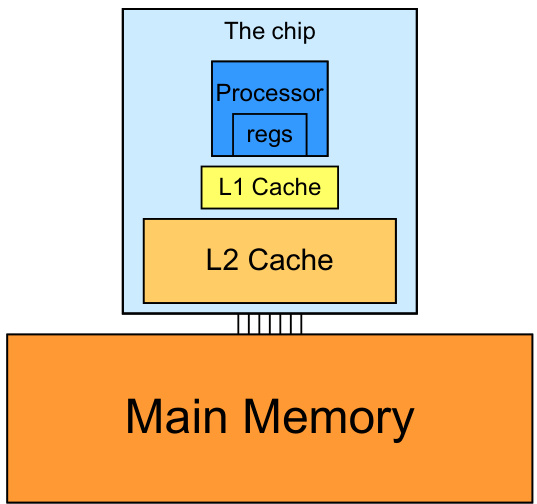

## Otimização da Granularidade de Threads em CUDA para Performance Aprimorada

### Introdução

Em programação CUDA, a granularidade de threads representa a quantidade de trabalho atribuída a cada thread individual dentro de um kernel. A escolha da granularidade de threads é um fator crítico que impacta diretamente a performance das aplicações CUDA. Este capítulo explora como a manipulação da granularidade de threads, especialmente através do aumento do trabalho por thread e da redução do número de threads, pode levar a otimizações significativas, minimizando instruções redundantes e acelerando a execução do kernel. A seguir, exploraremos detalhadamente as vantagens de ajustar a granularidade de threads em CUDA, conforme mencionado no contexto fornecido [^1].

### Conceitos Fundamentais

A **granularidade de threads** refere-se à quantidade de computação que cada thread executa. Uma granularidade fina implica que cada thread executa uma pequena quantidade de trabalho, enquanto uma granularidade grossa significa que cada thread executa uma quantidade maior de trabalho.

**Instruções Redundantes e Impacto na Performance:** Em muitas aplicações CUDA, observa-se que diferentes threads executam tarefas similares ou compartilham dados. Em configurações com granularidade fina, essa similaridade pode resultar em redundância computacional, onde instruções idênticas são executadas por múltiplos threads. Essa redundância desperdiça ciclos de clock e largura de banda de memória, diminuindo a eficiência geral.

**Ajuste da Granularidade para Redução da Redundância:** A estratégia central para otimizar a granularidade de threads consiste em alocar mais trabalho para cada thread. Ao fazer isso, o número total de threads necessários para completar a tarefa diminui. Essa redução no número de threads tem o efeito de consolidar operações similares dentro de um único thread, eliminando a necessidade de execução redundante das mesmas instruções em threads separados [^1].

**Exemplo Prático:** Considere uma operação de suavização de imagem onde cada thread calcula a média de um pixel e seus vizinhos. Em uma implementação com granularidade fina, cada thread poderia ser responsável por calcular a média de um único pixel. No entanto, pixels adjacentes compartilham muitos dos mesmos vizinhos. Aumentando a granularidade, um único thread poderia calcular a média para múltiplos pixels adjacentes, reutilizando os cálculos dos vizinhos compartilhados e eliminando a redundância.

**Benefícios da Granularidade Ajustada:** A otimização da granularidade de threads leva a vários benefícios:

1.  **Redução do Overhead de Thread:** Menos threads significam menos overhead associado ao gerenciamento e sincronização de threads.
2.  **Melhor Utilização da Cache:** Ao consolidar operações em menos threads, aumenta-se a probabilidade de que os dados necessários permaneçam na cache, reduzindo a latência de acesso à memória.

3.  **Menos Instruções Redundantes:** A principal vantagem é a eliminação de cálculos redundantes, permitindo que cada unidade de processamento se concentre em trabalho único e necessário.
4.  **Aceleração da Execução do Kernel:** A combinação desses fatores resulta em uma execução mais rápida do kernel, aumentando a taxa de transferência global da aplicação.

**Considerações e Limitações:** Embora aumentar a granularidade de threads seja geralmente benéfico, é crucial considerar as limitações de hardware e a natureza da aplicação. Uma granularidade excessivamente grossa pode levar a um desequilíbrio de carga entre os threads, onde alguns threads completam seu trabalho mais rapidamente que outros, resultando em ociosidade e perda de performance. Além disso, a quantidade de memória compartilhada e registradores disponíveis em cada bloco de threads impõe um limite superior à quantidade de trabalho que pode ser atribuída a cada thread.

**Implementação e Experimentação:** A otimização da granularidade de threads é um processo iterativo que envolve experimentação e análise de performance. É recomendado começar com uma implementação base e, em seguida, ajustar gradualmente a granularidade, monitorando o impacto na performance através de ferramentas de profiling CUDA.

### Conclusão

A granularidade de threads é um parâmetro crucial na otimização de aplicações CUDA. Ajustar a granularidade para reduzir instruções redundantes é uma técnica eficaz para melhorar a performance do kernel. Aumentar o trabalho por thread e diminuir o número total de threads pode resultar em menor overhead, melhor utilização da cache e, consequentemente, uma execução mais rápida. No entanto, é essencial equilibrar a granularidade com as limitações de hardware e as características da aplicação para evitar desequilíbrios de carga e garantir a otimização ideal [^1].

### Referências

[^1]: Thread granularity is a crucial factor in CUDA performance tuning. It is often advantageous to put more work into each thread and use fewer threads, especially when there is redundant work between threads. Increasing thread granularity reduces redundant instructions and improves kernel execution speed.

<!-- END -->