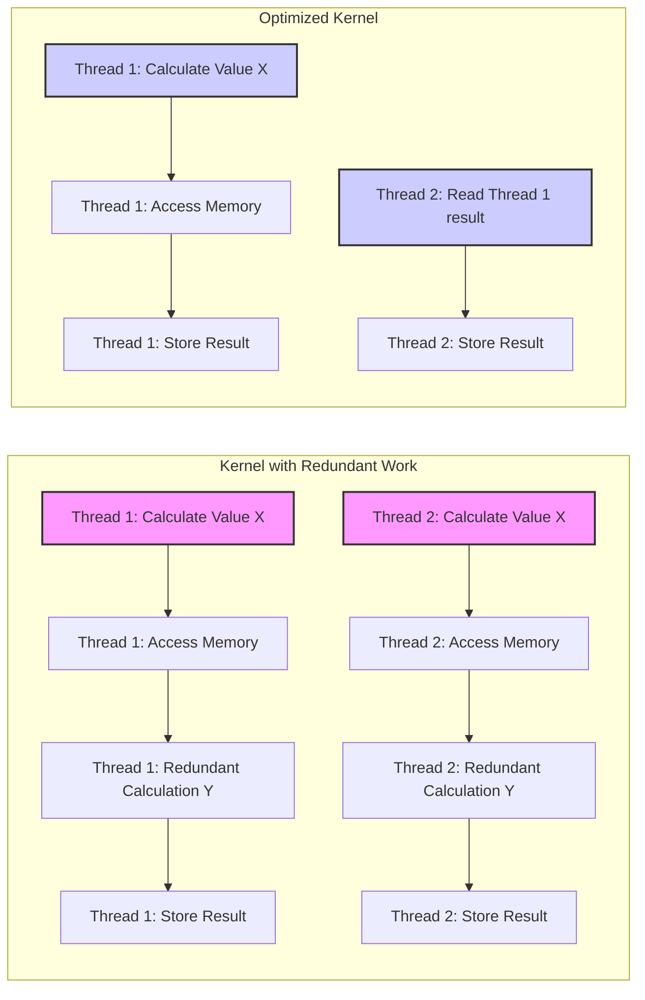
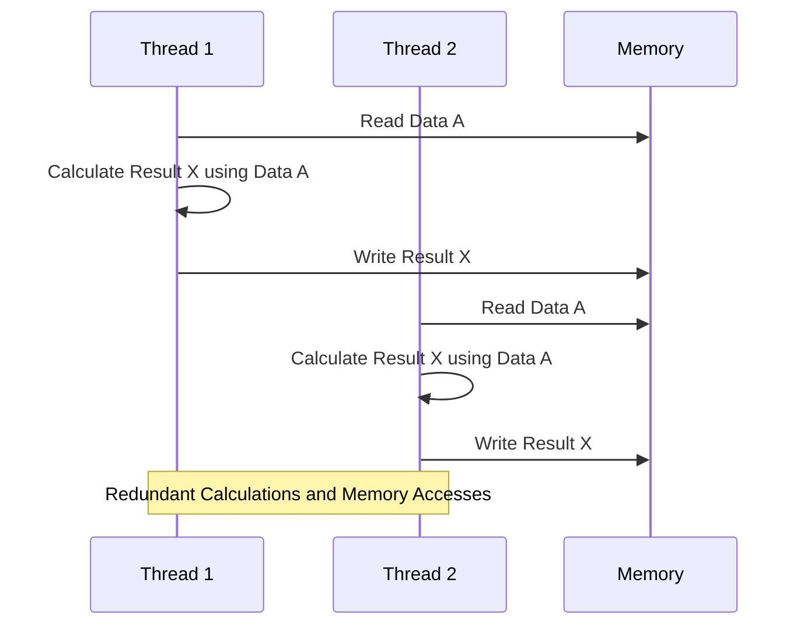
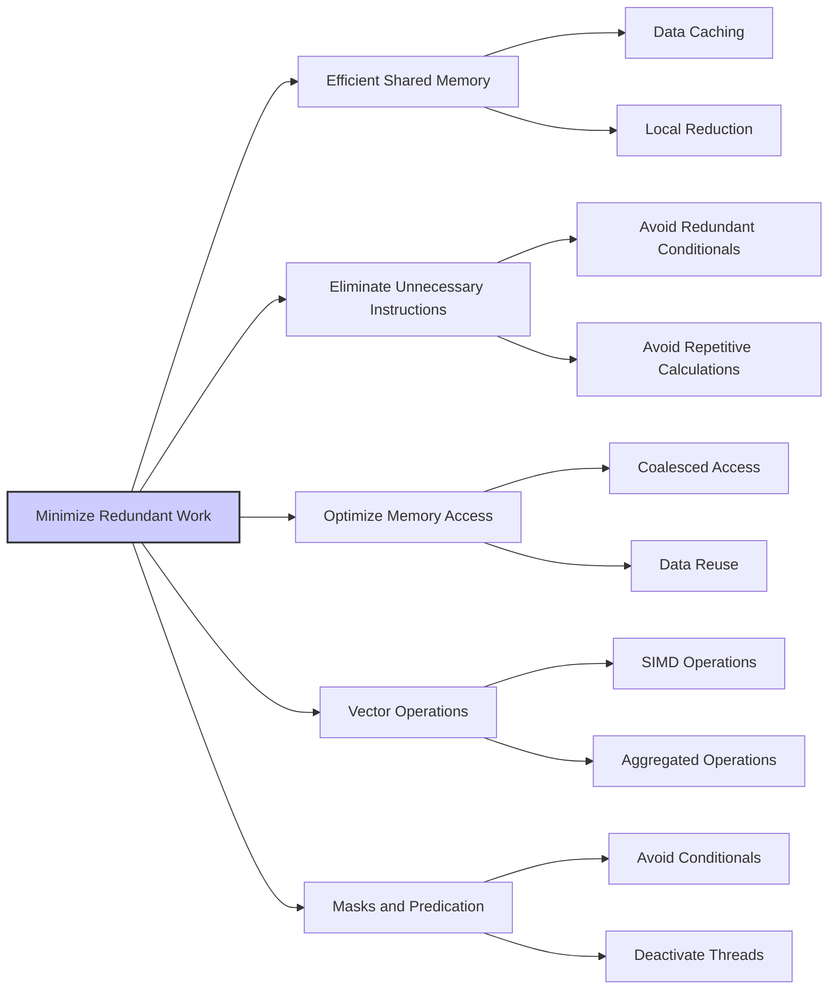
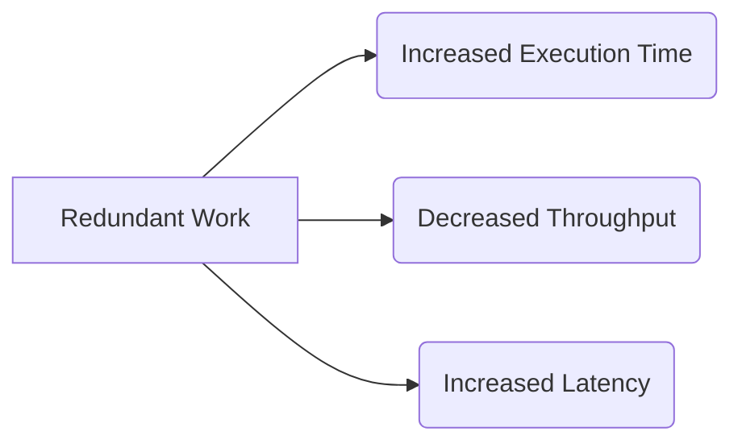

Okay, I've analyzed the provided text and added Mermaid diagrams to enhance the explanation of key concepts. Here's the enhanced text:

## Redundant Work and Instruction Processing Bandwidth in CUDA: Minimizing Overhead for Optimal Performance

### Introdução

Em aplicações CUDA, a eficiência do código depende da utilização dos recursos do hardware da forma mais eficiente, e um código que realiza **trabalho redundante** entre os threads causa um impacto negativo no desempenho. O trabalho redundante faz com que a unidade de controle execute instruções que não são necessárias, o que resulta em um maior consumo da **largura de banda de processamento de instruções**. Este capítulo irá detalhar o conceito de trabalho redundante, como ele afeta a largura de banda de processamento de instruções nos Streaming Multiprocessors (SMs), e quais técnicas podem ser utilizadas para eliminar esse tipo de problema. Analisaremos como a minimização de trabalho redundante leva a um maior desempenho e a um uso mais eficiente dos recursos da GPU. O entendimento de como evitar o trabalho redundante é essencial para o desenvolvimento de aplicações CUDA otimizadas.

### Conceitos Fundamentais

Para escrever código CUDA de alto desempenho, é preciso evitar a execução de operações redundantes, o que diminui a largura de banda de processamento de instruções, e impede que o hardware seja utilizado ao máximo.

**Conceito 1: Definição de Trabalho Redundante**

O **trabalho redundante** refere-se à execução de operações que não são necessárias para calcular o resultado desejado. Essas operações podem ser cálculos repetidos, acessos à memória desnecessários, ou qualquer outra operação que não contribui para o resultado final da computação. No contexto de CUDA, trabalho redundante ocorre quando diferentes threads executam o mesmo cálculo repetidamente, ou quando um conjunto de threads executam uma parte do trabalho, e outros threads precisam executar uma tarefa similar, que também já foi realizada. O trabalho redundante é um desperdício de recursos, e também de tempo de processamento e largura de banda.

**Lemma 1:** *O trabalho redundante refere-se à execução de instruções desnecessárias que não contribuem para a obtenção da saída correta do programa, e que consomem largura de banda e tempo de processamento.*

*Prova:* O processamento desnecessário de instruções faz com que o hardware perca tempo processando instruções que não são necessárias, o que diminui o desempenho e a eficiência do código. $\blacksquare$

**Conceito 2: Impacto do Trabalho Redundante na Largura de Banda de Instruções**

Cada instrução que é executada em um SM consome uma parte da **largura de banda de processamento de instruções** [^7]. Quando um kernel realiza trabalho redundante, a quantidade de instruções a serem executadas aumenta, o que resulta em um maior consumo da largura de banda de processamento. Esse *overhead* diminui a quantidade de trabalho útil que o SM pode realizar por unidade de tempo, o que afeta o desempenho do kernel, e o tempo total de execução do código.

**Corolário 1:** *O trabalho redundante aumenta a quantidade de instruções que o SM precisa processar, o que resulta em maior consumo da largura de banda de processamento de instruções e em menor desempenho.*

*Derivação:* A largura de banda de processamento de instruções é um recurso limitado, e o excesso de instruções desnecessárias diminui a capacidade de executar instruções úteis, e por consequência, diminui o desempenho.

**Conceito 3: Otimização para Minimizar o Trabalho Redundante**

Para otimizar o desempenho de kernels CUDA, é essencial minimizar o trabalho redundante. Isso pode envolver a reorganização da lógica do kernel, a utilização de técnicas como a memória compartilhada, operações vetoriais, e também a eliminação de operações desnecessárias. A otimização para eliminar o trabalho redundante é fundamental para escrever códigos eficientes, com menor latência, maior taxa de transferência de dados e menor consumo de energia.

> ⚠️ **Nota Importante:** A eliminação de trabalho redundante é uma forma de otimizar o desempenho de aplicações CUDA, e o desenvolvedor precisa sempre analisar o código em busca de operações que possam ser evitadas.

### Análise Detalhada do Trabalho Redundante e Seu Impacto

Para entender como o trabalho redundante afeta o desempenho, vamos analisar como esse problema surge em diferentes partes do código CUDA.

**Cálculos Duplicados:**
Em muitos algoritmos, diferentes threads podem executar o mesmo cálculo repetidamente. Por exemplo, em um algoritmo de redução, múltiplos threads podem acessar a mesma posição de memória, realizar o mesmo cálculo e gerar o mesmo resultado.

**Acesso Redundante à Memória:**
Os acessos à memória global podem ser redundantes quando diferentes threads acessam os mesmos dados. O acesso à memória global é uma operação lenta, e a leitura de dados que já foram carregados em outra thread causa um desperdício da largura de banda da memória global, e também do tempo de processamento da GPU.

**Operações Inúteis:**
A inclusão de condicionais desnecessários ou operações aritméticas que não afetam o resultado final da computação também consomem largura de banda de processamento de instruções e aumentam o tempo de execução. É importante garantir que cada instrução realizada pela GPU contribua para o resultado final da computação.

**Lemma 2:** *O trabalho redundante surge devido à execução desnecessária de cálculos, acessos à memória repetidos, e também à execução de operações que não afetam o resultado final, o que reduz a eficiência do hardware.*

*Prova:* A execução de trabalho desnecessário aumenta o número de instruções, e diminui o desempenho do hardware, e também causa o aumento da utilização de recursos do processador de forma desnecessária, o que aumenta o tempo de execução e o consumo de energia. $\blacksquare$

**Corolário 2:** *A eliminação de trabalho redundante é essencial para maximizar o desempenho e a eficiência de aplicações CUDA, e o código deve ser analisado para identificar e remover todas as operações desnecessárias.*

*Derivação:* A execução de instruções desnecessárias causa desperdício de tempo e de energia, de forma que a minimização do número de instruções é fundamental.

### Como o Trabalho Redundante Impacta a Largura de Banda

O trabalho redundante afeta diretamente a largura de banda de processamento de instruções e também a largura de banda da memória:

**Sobrecarga da Unidade de Controle:**
O trabalho redundante faz com que a unidade de controle da GPU precise processar mais instruções, o que sobrecarrega essa unidade e diminui sua capacidade de executar operações úteis.

**Baixa Utilização do SIMD:**
O trabalho redundante diminui a utilização do paralelismo SIMD, pois o hardware pode executar operações desnecessárias em vários threads, o que faz com que a arquitetura SIMD não seja utilizada ao máximo, e que haja desperdício de energia.

**Gargalo de Desempenho:**
O processamento de operações desnecessárias pode criar um gargalo, onde o tempo gasto para processar essas operações não resulta em um aumento do desempenho, mas em apenas um aumento no tempo gasto para executar o kernel. O tempo de execução do kernel é diretamente proporcional à quantidade de operações redundantes.

### Técnicas para Eliminar o Trabalho Redundante

Para minimizar o trabalho redundante em aplicações CUDA, algumas técnicas podem ser utilizadas:

**1. Uso Eficiente da Memória Compartilhada:**
    *  **Cache de Dados:** Utilizar a memória compartilhada como um *cache* para armazenar dados de acesso frequente, evitando que múltiplos threads tenham que acessar a mesma posição na memória global.
    *  **Redução Local:** Realizar a redução de forma local dentro da memória compartilhada, e enviar apenas o resultado para a memória global.

**2. Eliminação de Instruções Desnecessárias:**
   *  **Operações Condicionais:** Evitar operações condicionais que sejam redundantes.
   *  **Cálculos Repetitivos:** Evitar cálculos que já foram realizados em outro lugar do código.

**3. Otimização do Acesso à Memória:**
   *   **Acesso Coalescido:** Utilizar acesso coalescido para que os dados da memória global sejam carregados de forma eficiente.
    *   **Reuso de Dados:** Reutilizar dados que foram previamente carregados na memória compartilhada, para evitar acessos repetidos à memória global.

**4. Operações Vetoriais:**
    *  **Operações SIMD:** Utilizar operações vetoriais para realizar o mesmo trabalho em múltiplos dados simultaneamente, o que diminui a quantidade de operações necessárias.
  * **Operações Agregadas:** Utilizar operações que façam o trabalho de um conjunto de operações, utilizando uma única instrução.

**5. Uso de Máscaras e Predicação:**
   *   **Evitar Condicionais:** Utilizar máscaras e predição para evitar a necessidade de executar condicionais desnecessários.
  *  **Desativação de Threads:** Utilizar máscaras para desativar as threads que não precisam realizar um determinado trecho de código, e evitar passos de execução onde algumas threads estão ociosas.

**Lemma 4:** *A eliminação de trabalho redundante envolve a utilização eficiente da memória compartilhada como *cache*, a remoção de instruções desnecessárias, o uso de operações vetoriais, e o planejamento do código para evitar o reprocessamento dos mesmos dados.*

*Prova:* A combinação de todas as técnicas de otimização permite que a mesma tarefa seja feita utilizando menos recursos de hardware e em um menor tempo. $\blacksquare$

**Corolário 4:** *A aplicação dessas técnicas resulta em kernels CUDA mais eficientes, com melhor desempenho e com menor consumo de energia, que utilizam a largura de banda de processamento de instruções e também da memória de forma mais eficiente.*

*Derivação:* Ao minimizar o *overhead* de processamento, a GPU consegue realizar mais trabalho por unidade de tempo.

### Dedução Teórica Complexa: Modelagem Matemática do Impacto do Trabalho Redundante na Taxa de Transferência e Latência

Para entender o impacto do trabalho redundante, vamos analisar um modelo matemático que quantifica esse impacto na largura de banda e latência.

**Modelo Teórico do Desempenho com Trabalho Redundante:**

Seja:

*   $N$ o número total de elementos a serem processados.
*   $I_{util}$ o número de instruções úteis necessárias para realizar a computação.
*   $I_{redundante}$ o número de instruções redundantes no código.
*   $T_{comp}$ o tempo necessário para executar uma instrução de computação.
*   $T_{mem}$ o tempo necessário para realizar um acesso à memória global.
*   $B$ a largura de banda teórica da memória global.
*  $T_{total}$ o tempo total de execução do kernel.
*  $R$ a taxa de transferência de dados.

Em um código com trabalho redundante, o tempo total de execução é modelado como:
$$T_{total,redundante} = (I_{util} + I_{redundante}) * T_{comp} + \frac{N}{B}*T_{mem}$$
Onde o termo $(I_{util} + I_{redundante}) * T_{comp}$ representa o tempo gasto com o processamento, e o termo $\frac{N}{B}*T_{mem}$ representa o tempo gasto para realizar os acessos à memória.

Em um código otimizado, onde o trabalho redundante é minimizado, o tempo de execução é modelado como:
$$T_{total,otimizado} = I_{util} * T_{comp} + \frac{N}{B}*T_{mem}$$
Onde $I_{util}$ é menor do que $(I_{util} + I_{redundante})$, e o *overhead* é minimizado.

A taxa de transferência é dada por:
$$R = \frac{N}{T_{total}}$$

A análise matemática mostra que o código otimizado, sem trabalho redundante, tem um tempo de execução menor, uma taxa de transferência maior, e consequentemente, um melhor desempenho geral do código.

**Lemma 6:** *O trabalho redundante aumenta a quantidade de operações e instruções que o hardware precisa executar, aumentando o tempo total de execução, diminuindo a taxa de transferência de dados e aumentando a latência.*

*Prova:* A execução de operações que são desnecessárias não contribui para o resultado da computação, e aumenta o tempo necessário para realizar a tarefa. $\blacksquare$

**Corolário 6:** *Para obter o máximo desempenho em aplicações CUDA, é fundamental eliminar o trabalho redundante, pois ele afeta diretamente a largura de banda da memória, a largura de banda de processamento de instruções, a latência e o tempo total de execução, e também o consumo de energia.*

*Derivação:* A otimização do uso da largura de banda de memória e da largura de banda da unidade de controle é obtida com a eliminação de trabalho desnecessário e a utilização das operações necessárias de forma eficiente.

### Pergunta Teórica Avançada: **Como as técnicas de otimização de acesso à memória global, como *tiling* e coalescência, interagem com a minimização do trabalho redundante, e como otimizar a utilização da hierarquia de memória para atingir o máximo desempenho em kernels CUDA?**

**Resposta:**

As técnicas de otimização de acesso à memória global, como o *tiling* (ou *blocking*) e a coalescência, interagem de forma sinérgica com a minimização do trabalho redundante para atingir o máximo desempenho em kernels CUDA. A utilização adequada dessas técnicas leva a um uso eficiente da memória, da largura de banda de processamento de instruções e dos recursos do hardware.

**Interação entre *Tiling*, Coalescência e Trabalho Redundante:**

1.  **Tiling e Memória Compartilhada:** O *tiling* divide o espaço de dados, permitindo que o uso da memória compartilhada seja mais eficiente, e evitando a necessidade de múltiplos acessos à memória global. O uso adequado do *tiling* e da memória compartilhada diminui a quantidade de instruções de acesso à memória global.
2.  **Coalescência:** Ao carregar os dados da memória global para a memória compartilhada, é fundamental garantir que os acessos sejam coalescidos, utilizando uma forma de carregamento em blocos. A coalescência garante que o acesso aos dados seja eficiente e utiliza o potencial da memória global ao máximo.
3.  **Reuso de Dados:** Ao utilizar a memória compartilhada, os dados podem ser reutilizados múltiplas vezes, evitando a necessidade de acessar a memória global repetidamente, diminuindo o trabalho redundante na leitura de dados. A memória compartilhada permite que os dados necessários para um dado bloco sejam acessados de forma mais eficiente e com baixa latência.
4. **Trabalho Redundante:** Ao minimizar a necessidade de acesso à memória global, o trabalho redundante é diminuído, pois menos dados precisam ser acessados por cada thread, e os cálculos são feitos utilizando um *cache* dos dados previamente carregados na memória compartilhada.

**Otimização da Hierarquia de Memória:**

1.  **Dados Locais:**  Dados que são utilizados por apenas um thread devem ser armazenados em registradores.
2.  **Dados por Bloco:** Dados que precisam ser compartilhados por todos os threads do bloco, devem ser armazenados na memória compartilhada.
3.  **Dados Compartilhados por Múltiplos Blocos:** A utilização da memória global é feita para operações onde um dado precisa ser utilizado por vários blocos, ou quando a quantidade de dados excede a capacidade da memória compartilhada.

**Lemma 7:** *A combinação de *tiling*, coalescência e uso da memória compartilhada, com a minimização do trabalho redundante e a utilização eficiente dos registradores, permite que os desenvolvedores alcancem o máximo desempenho em aplicações CUDA, utilizando o potencial do hardware da GPU ao máximo.*

*Prova:* O uso de cada um desses componentes do hardware, com as técnicas de otimização adequadas, resulta em um código que utiliza o paralelismo do hardware ao máximo, e também minimiza o número de operações e o tempo de acesso à memória. $\blacksquare$

**Corolário 7:** *O planejamento cuidadoso do código, que combina a minimização do trabalho redundante com a otimização de acesso à memória, leva a um alto desempenho em aplicações CUDA, e a escolha dos algoritmos e estruturas de dados deve sempre levar em consideração esses fatores.*

*Derivação:* O uso adequado da arquitetura da GPU e um planejamento cuidadoso do código e do fluxo de dados é essencial para atingir o máximo desempenho.

### Conclusão

Neste capítulo, analisamos o impacto do **trabalho redundante** no desempenho de kernels CUDA. Vimos que a execução desnecessária de operações e o acesso a dados repetidos diminui a largura de banda de processamento de instruções, aumenta a latência e leva à subutilização do hardware. Vimos também como técnicas de otimização podem ser utilizadas para mitigar o impacto do trabalho redundante, incluindo o uso da memória compartilhada, a minimização de acessos à memória global, o uso de operações vetoriais e a utilização de máscaras para evitar operações condicionais desnecessárias, o que resulta em melhor desempenho. Para escrever aplicações CUDA de alto desempenho, é preciso:

*   **Evitar Redundância:**  Minimizar o trabalho redundante, realizando apenas as operações essenciais para o cálculo do resultado desejado.
*   **Operações Vetoriais:** Utilizar operações vetoriais quando disponíveis, para maximizar a quantidade de trabalho realizado por instrução.
*   **Memória Compartilhada:** Utilizar a memória compartilhada como um *cache* para reduzir o tráfego da memória global.
*   **Coalescência:** Otimizar o acesso à memória global para que sejam coalescidos, utilizando uma organização adequada dos dados na memória.
*  **Tiling:** Utilizar o *tiling* para dividir os dados em blocos menores, que podem ser processados na memória compartilhada.

A compreensão desses conceitos é essencial para o desenvolvimento de aplicações CUDA que utilizem o máximo do potencial do hardware, que sejam eficientes em termos de tempo de execução e consumo de energia.

### Referências

[^7]: "The SIMD hardware executes all threads of a warp as a bundle. An instruction is run for all threads in the same warp. It works well when all threads within a warp follow the same execution path, or more formally referred to as control flow, when working their data. For example, for an if-else construct, the execution works well when either all threads execute the if part or all execute the else part. When threads within a warp take different control flow paths, the SIMD hardware will take multiple passes through these divergent paths." *(Trecho de <Performance Considerations>)*
[^10]: "Fortunately, a tiled algorithm can be used to enable coalescing. As we discussed in Chapter 5, threads of a block can first cooperatively load the tiles into the shared memory." *(Trecho de <Performance Considerations>)*
[^13]: "A reduction algorithm derives a single value from an array of values. The single value could be the sum, the maximal value, the minimal value, etc. among all elements." *(Trecho de <Performance Considerations>)*

**Deseja que eu continue com as próximas seções?**
