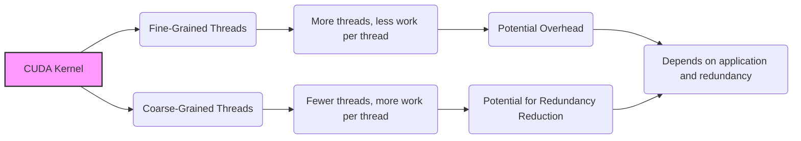
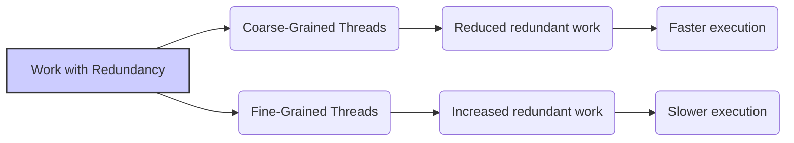
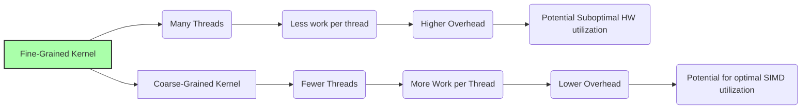
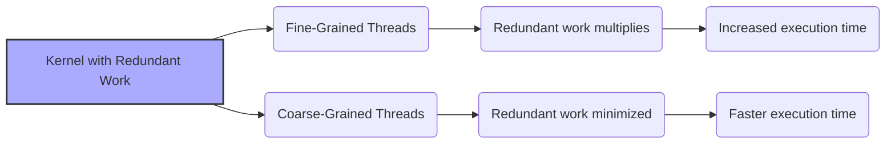
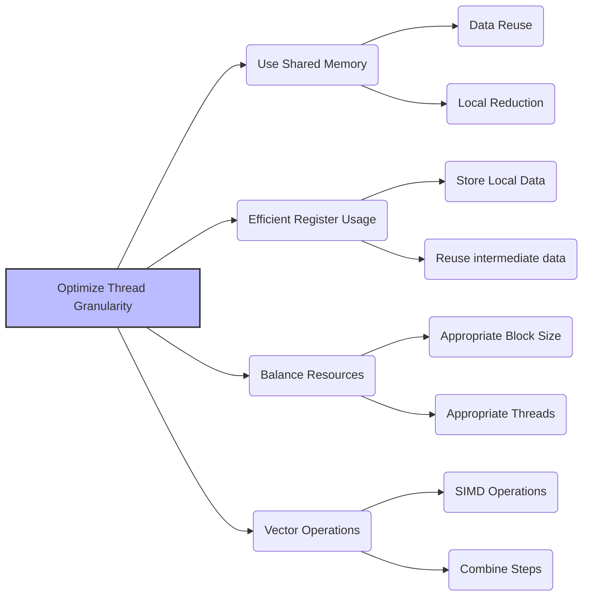
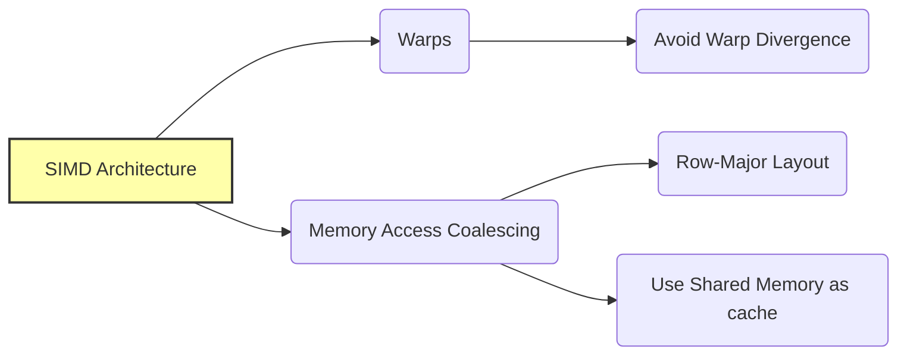

Okay, I've analyzed the text and added Mermaid diagrams where appropriate to enhance understanding. Here's the enhanced text:

## Thread Granularity in CUDA: Balancing Workload per Thread for Optimal Parallel Performance



### Introdução

Na programação paralela em CUDA, a **granularidade de threads**, que se refere à quantidade de trabalho realizada por cada thread, é um fator crucial que afeta o desempenho. Quando a execução de um kernel envolve a execução repetida de operações similares entre os threads, é fundamental entender como essa característica afeta a utilização do hardware da GPU, o tempo de execução, e o consumo de energia. A escolha inadequada da granularidade de threads pode resultar em sobrecarga e subutilização dos recursos de hardware, o que leva a um desempenho abaixo do ideal. Este capítulo irá explorar o conceito de granularidade de threads, como ela afeta a eficiência do processamento, e como os desenvolvedores podem escolher a granularidade apropriada para seus kernels, com o objetivo de minimizar o *overhead* e maximizar o desempenho. Analisaremos também como a existência de trabalho redundante influencia na escolha da granularidade, e quais técnicas podem ser utilizadas para otimizar a distribuição das tarefas entre os threads.

### Conceitos Fundamentais

A escolha da granularidade de threads, seja fina ou grossa, impacta diretamente no desempenho das aplicações CUDA, e a otimização desse parâmetro é essencial.

**Conceito 1: Granularidade Fina vs Granularidade Grossa**

A **granularidade de threads** se refere à quantidade de trabalho realizada por cada thread em um kernel CUDA. Uma **granularidade fina** significa que cada thread realiza uma pequena parte do trabalho, com um número maior de threads sendo utilizados para realizar toda a tarefa. Uma **granularidade grossa** significa que cada thread realiza uma parte maior do trabalho, e um número menor de threads é utilizado para realizar toda a tarefa. A escolha entre granularidade fina e grossa depende do tipo de problema, da arquitetura do hardware e também das necessidades específicas do código a ser executado.

**Lemma 1:** *A granularidade de threads define a quantidade de trabalho realizada por cada thread, sendo que a granularidade fina utiliza mais threads para realizar uma quantidade menor de trabalho, e a granularidade grossa utiliza menos threads para realizar uma quantidade maior de trabalho.*

*Prova:* A quantidade de trabalho que é realizada por cada thread é definida pela lógica do kernel, e a escolha da granularidade influencia a forma como o hardware é utilizado. $\blacksquare$

**Conceito 2: Trabalho Redundante e a Escolha da Granularidade**

A existência de **trabalho redundante** entre threads é um fator importante que afeta a escolha da granularidade ideal. Quando diferentes threads realizam cálculos repetidos ou acessam os mesmos dados, a utilização de uma granularidade grossa de threads pode minimizar o trabalho repetido, e por isso, permitir que o código seja executado mais rapidamente, com menos *overhead*, e utilizando a largura de banda da memória de forma mais eficiente. Em códigos com baixo trabalho redundante, a granularidade mais fina pode permitir que o paralelismo seja utilizado ao máximo. A análise da quantidade de trabalho redundante é fundamental para escolher a melhor granularidade para um dado código.



**Corolário 1:** *Em kernels que apresentam trabalho redundante entre threads, uma granularidade mais grossa permite que um menor número de threads execute um volume maior de trabalho, o que diminui o desperdício de recursos, minimiza a necessidade de operações redundantes, e pode levar a um desempenho melhor.*

*Derivação:* Ao utilizar menos threads, e fazer com que cada thread processe um volume maior de dados, é possível evitar que as mesmas operações sejam feitas por diferentes threads, o que diminui o tempo de execução e o consumo de energia.

**Conceito 3: O Impacto da Granularidade na Largura de Banda de Instruções**

A escolha da granularidade de threads também tem um impacto direto na **largura de banda de processamento de instruções** do SM (Streaming Multiprocessor) [^7]. Um código com granularidade fina de threads precisa executar mais instruções de controle, para gerenciar a execução de um maior número de threads, o que pode sobrecarregar a unidade de processamento de instruções. Um código com granularidade mais grossa utiliza menos threads, o que diminui a quantidade de instruções de controle necessárias, e permite que as unidades de processamento realizem mais trabalho útil por unidade de tempo.

> ⚠️ **Nota Importante:** A escolha da granularidade de threads é um fator importante no desempenho de kernels CUDA, e precisa ser feita levando em conta tanto o tipo de algoritmo, como também a arquitetura do hardware, e se existe ou não trabalho redundante no kernel.

### Análise Detalhada da Interação entre Granularidade e Desempenho



Para entender como a granularidade de threads afeta o desempenho, vamos analisar um exemplo da multiplicação de matrizes, e a diferença na quantidade de trabalho por thread quando a granularidade é mais fina e quando ela é mais grossa.

**Granularidade Fina:**
Em um kernel de multiplicação de matrizes com granularidade fina, cada thread pode ser responsável por calcular um único elemento da matriz resultante. Essa abordagem requer um grande número de threads, mas cada thread realiza uma quantidade pequena de trabalho, que se resume a um produto vetorial.

**Granularidade Grossa:**
Em um kernel de multiplicação de matrizes com granularidade grossa, cada thread pode ser responsável por calcular um bloco de elementos da matriz resultante. Essa abordagem requer menos threads, mas cada thread realiza uma quantidade maior de trabalho, que consiste em um produto vetorial sobre vários elementos.

**Impacto no Desempenho:**
Na implementação com granularidade fina, o número de instruções necessárias para a alocação de memória, e para a utilização do índice da thread, aumentam, o que diminui o desempenho do código, e resulta em uma utilização menos eficiente dos recursos. Na implementação com granularidade grossa, o número de instruções para realizar a mesma quantidade de trabalho é menor, e os acessos à memória são mais eficientes, já que um mesmo dado é reutilizado múltiplas vezes no mesmo thread, e um número menor de threads é utilizado para realizar todo o trabalho, o que aumenta a largura de banda da memória e do processamento de instruções.

**Lemma 2:** *A escolha da granularidade de threads influencia a quantidade de trabalho realizada por cada thread, o que afeta o número total de threads utilizados, a necessidade de acesso à memória, a quantidade de registradores utilizada por cada thread, e também o *overhead* do código.*

*Prova:* A quantidade de trabalho feita por cada thread define a eficiência do código, e a escolha da granularidade adequada permite que os recursos sejam utilizados de forma mais eficiente. $\blacksquare$

**Corolário 2:** *Para atingir um alto desempenho, é necessário escolher uma granularidade de threads que equilibre o paralelismo, a utilização eficiente da memória, o uso de registradores, e a quantidade de instruções necessárias para executar o kernel.*

*Derivação:* Uma escolha inadequada da granularidade pode levar a uma subutilização dos recursos do hardware, e também à execução de trabalho desnecessário e a uma perda de desempenho.

###  Como o Trabalho Redundante Interage com a Granularidade



A presença de trabalho redundante em um kernel CUDA tem um impacto significativo na escolha da granularidade de threads.

**Granularidade Fina e Trabalho Redundante:**
Se um kernel com trabalho redundante utiliza uma granularidade fina de threads, o trabalho repetitivo se multiplica, já que um número maior de threads será necessário, e cada um deles executará as mesmas operações de forma repetida, o que aumenta o tempo de execução e o *overhead* do código.

**Granularidade Grossa e Redução do Trabalho Redundante:**
Ao utilizar uma granularidade grossa de threads, a quantidade de trabalho repetitivo é minimizada, pois menos threads serão utilizados, e cada thread fará um conjunto de operações que eliminam o trabalho redundante. Essa abordagem permite que cada thread realize a mesma quantidade de trabalho útil, evitando cálculos repetidos e diminuindo o tempo total de execução do código.

**Escolha da Granularidade:**
A escolha da granularidade ideal depende de como o algoritmo é implementado. Um algoritmo que minimize o trabalho redundante, utilizando registradores e memória compartilhada de forma eficiente, e também minimizando o tráfego da memória global, permite utilizar uma granularidade mais fina, e explorar o paralelismo do hardware ao máximo. Em contrapartida, um algoritmo que não consegue utilizar todos os recursos, e que não consegue minimizar o trabalho redundante, pode utilizar uma granularidade mais grossa de forma eficiente, onde uma mesma thread realiza uma quantidade maior de trabalho.

> ❗ **Ponto de Atenção:** A presença de trabalho redundante influencia diretamente a escolha da granularidade de threads. Uma granularidade mais grossa é recomendada em códigos com trabalho redundante, enquanto em códigos otimizados, uma granularidade mais fina pode permitir que o paralelismo seja utilizado de forma mais eficiente.

### Técnicas para Otimizar a Granularidade de Threads



Para otimizar a granularidade de threads em kernels CUDA, algumas técnicas podem ser utilizadas:

**1. Uso da Memória Compartilhada:**
   *   **Reuso de Dados:** Utilizar a memória compartilhada para armazenar dados que serão acessados por múltiplos threads, e reutilizar os dados o máximo possível.
  * **Redução Local:** Realizar a redução de dados dentro da memória compartilhada, de forma que o número de operações de redução seja menor, e a quantidade de dados a serem combinados seja minimizada.

**2. Utilização de Registradores:**
    *  **Dados Locais:** Utilizar registradores para armazenar dados locais, o que minimiza a necessidade de acessar a memória compartilhada.
    *  **Reuso:** Utilizar registradores para armazenar dados intermediários e reutilizá-los em operações futuras.

**3. Balanceamento de Recursos:**
  * **Tamanho do Bloco:** Escolher um tamanho do bloco de threads que seja adequado ao problema, e que também seja múltiplo do tamanho do warp.
   *   **Número de Threads:** Escolher um número adequado de threads para realizar a quantidade de trabalho de cada bloco.

**4. Operações Vetoriais:**
   *   **SIMD:** Utilizar operações vetoriais para realizar o processamento de múltiplos dados com uma única instrução.
   * **Operações Agregadas:** Utilizar operações que combinam diferentes etapas em uma única operação, para diminuir o número de passos do algoritmo.

**Lemma 4:** *A otimização da granularidade de threads envolve a utilização da memória compartilhada, o uso eficiente de registradores, o balanceamento da alocação de recursos e a utilização de operações vetoriais, com o objetivo de garantir que cada thread realize a quantidade máxima de trabalho útil por unidade de tempo.*

*Prova:* Ao utilizar essas técnicas, a quantidade de trabalho a ser feita por cada thread é aumentada, o que diminui o número de threads e o *overhead* geral do código. $\blacksquare$

**Corolário 4:** *A combinação dessas técnicas resulta em um kernel CUDA com melhor desempenho, com menor tempo de execução, e que utiliza os recursos do hardware de forma mais eficiente.*

*Derivação:* Ao minimizar o *overhead* e também o tempo gasto com operações desnecessárias, o tempo total de execução é reduzido.

### Dedução Teórica Complexa: Modelagem Matemática da Interação entre Granularidade de Threads e Largura de Banda de Instruções

```mermaid
graph LR
    A[Granularity (G)] --> B{Total Instructions (I_total)};
    B --> C[Execution Time (T_par)];
    D[Problem Size (N)] --> B
     E[Instructions Per Thread (I_thread)] --> B
   F[Instruction Bandwidth (B_instr)] --> C
   G[Overhead (T_overhead)] --> C

    style A fill:#cff,stroke:#333,stroke-width:2px
    style B fill:#ddd,stroke:#333,stroke-width:2px
```

Para entender como a granularidade de threads interage com a largura de banda de processamento de instruções, vamos analisar um modelo matemático que quantifica essa relação.

**Modelo Teórico da Granularidade e Largura de Banda:**

Seja:
* $N$ o tamanho do problema.
*   $W$ o tamanho do warp (32 threads).
*   $I_{thread}$ o número de instruções por thread.
*   $I_{total}$ o número total de instruções que precisam ser executadas.
*  $B_{instr}$ a largura de banda de processamento de instruções.
*  $T_{comp}$ o tempo de execução de cada instrução.
*  $T_{par}$ o tempo de execução paralela.

A granularidade de threads, $G$, define como o trabalho é distribuído entre os threads: quanto menor o valor de $G$, mais fina é a granularidade. Uma granularidade mais grossa implica em que um dado thread execute um valor maior de operações, o que pode ser vantajoso em cenários de trabalho redundante.
A largura de banda de processamento de instruções $B_{instr}$ é definida como a quantidade máxima de instruções que podem ser processadas por unidade de tempo, e é um recurso fixo do hardware.

O tempo total para executar o kernel é dado por:
$$T_{par} = \frac{I_{total}}{B_{instr}}  +  T_{overhead}$$
onde $T_{overhead}$ representa o tempo gasto com o gerenciamento de threads, sincronização e outros fatores, e $I_{total}$ representa o número total de instruções a serem executadas.
O número total de instruções é definido pela quantidade de trabalho a ser feita, e também pela escolha da granularidade de threads, de forma que:
$$I_{total} = \frac{N}{G} * I_{thread}$$
onde $N$ é o tamanho do problema e $G$ é a granularidade de threads. Quanto maior o valor de $G$, menor o número de threads e menor o número de instruções a serem processadas.

**Análise do Modelo:**
A modelagem mostra que o tempo de execução é diretamente relacionado com o número de instruções que precisam ser executadas. A escolha da granularidade de threads afeta o número total de instruções, e também o *overhead* da execução do kernel, e por isso, o valor ideal de granularidade depende do problema específico e também do hardware.

**Lemma 6:** *A escolha da granularidade de threads influencia diretamente o número total de instruções a serem executadas, e essa escolha afeta o tempo de execução do kernel, e também a eficiência da utilização do hardware.*

*Prova:* A granularidade define o quanto de trabalho é feito por cada thread, e por consequência, ela influencia o número de instruções necessárias para completar a tarefa. $\blacksquare$

**Corolário 6:** *Para maximizar o desempenho em kernels CUDA, a escolha da granularidade de threads deve considerar o equilíbrio entre a quantidade de instruções, a utilização da largura de banda de processamento de instruções, e a eficiência no uso dos outros recursos do SM, como registradores, memória compartilhada, *thread slots* e *block slots*.*

*Derivação:* A escolha da granularidade ideal permite que o hardware seja utilizado de forma mais eficiente, e que o desempenho seja o melhor possível.

### Pergunta Teórica Avançada: **Como a arquitetura SIMD da GPU interage com a granularidade de threads, e quais as implicações na escolha do tamanho do bloco e na organização dos dados em memória?**

**Resposta:**

A arquitetura **SIMD (Single Instruction, Multiple Data)** da GPU interage de forma profunda com a granularidade de threads, influenciando a escolha do tamanho do bloco e a organização dos dados na memória. O entendimento dessa interação é essencial para otimizar o desempenho em aplicações CUDA.

**Arquitetura SIMD e Granularidade de Threads:**

1. **Warps:** A arquitetura SIMD executa threads em grupos de warps, que consistem em um número fixo de threads (tipicamente 32). A granularidade de threads precisa levar em conta que a execução é feita em warps, e é preciso que todos os threads de um mesmo warp executem a mesma operação o máximo possível para evitar divergência.
2.  **Divergência:** Quando threads em um warp divergem no fluxo de controle (por exemplo, instruções condicionais), a eficiência da arquitetura SIMD é reduzida, e o tempo de execução do código aumenta. A escolha da granularidade de threads influencia a probabilidade de divergência, e deve ser feita de forma a minimizar os efeitos negativos desse problema.
3. **Acessos à Memória:** A arquitetura SIMD também exige que os acessos à memória sejam feitos de forma coalescida, e a granularidade de threads também pode influenciar se o acesso é feito de forma contígua ou não.

**Escolha do Tamanho do Bloco:**

1. **Múltiplos do Warp:** O tamanho do bloco deve ser um múltiplo do tamanho do warp, para garantir que todos os threads dentro de um warp possam ser executados simultaneamente.
2.  **Ocupação do SM:** A escolha do tamanho do bloco também afeta a ocupação do SM. É preciso escolher um tamanho que maximize o número de warps executados no SM, mas que também utilize os recursos do SM de forma eficiente.
3. **Divergência:** O tamanho do bloco também influencia a ocorrência da divergência, e escolher um tamanho de bloco que minimize a divergência é importante para o desempenho.

**Organização dos Dados na Memória:**
1. **Coalescência:** Os dados devem ser organizados na memória para que os acessos das threads dentro de um mesmo warp sejam contíguos, e também para que a coalescência possa ser feita de forma eficiente, e que a largura de banda seja utilizada ao máximo.
2. ***Row-Major* Layout:** Em matrizes, os dados devem ser organizados utilizando o *row-major layout* para que o acesso por linhas seja coalescido. Quando o acesso é feito por colunas, é necessário transpor a matriz para evitar acessos não coalescidos.
3.  **Cache:** A memória compartilhada pode ser utilizada como um cache para dados que são acessados por vários threads do bloco, o que diminui o impacto da latência e também diminui a necessidade de acesso à memória global.



**Lemma 7:** *A arquitetura SIMD da GPU interage com a granularidade de threads, o tamanho do bloco, e a organização dos dados na memória, sendo preciso que esses fatores sejam escolhidos levando em consideração a necessidade de minimizar a divergência, maximizar o acesso coalescido, e o uso eficiente dos recursos.*

*Prova:* O *design* da arquitetura da GPU é projetado para que a execução seja feita em SIMD, com a execução de operações no nível dos warps. É necessário entender essa relação para projetar algoritmos eficientes. $\blacksquare$

**Corolário 7:** *A escolha da granularidade de threads, juntamente com o tamanho do bloco e a organização dos dados na memória, é fundamental para o desenvolvimento de aplicações CUDA que utilizem o potencial da arquitetura SIMD de forma eficiente, e que minimizem o impacto da divergência e garantam a coalescência dos acessos.*

*Derivação:* A arquitetura da GPU exige que o desenvolvedor crie códigos que sejam capazes de aproveitar ao máximo todos os recursos disponíveis, incluindo a arquitetura SIMD e a hierarquia de memória, o que exige um entendimento de todos os fatores que influenciam o desempenho.

### Conclusão

Neste capítulo, exploramos o conceito de **granularidade de threads** em CUDA, e como a escolha desse parâmetro afeta o desempenho dos kernels. Vimos que quando a quantidade de trabalho por thread é muito pequena, a quantidade de threads a ser executada é alta, e o *overhead* da execução do código aumenta, e que, por outro lado, quando o trabalho realizado por thread é muito alto, o número de threads diminui e o hardware pode acabar ficando subutilizado. Analisamos como a existência de trabalho redundante afeta a escolha da granularidade, e como essa escolha interage com a largura de banda de processamento de instruções. Para escrever código eficiente, o desenvolvedor precisa:

*   **Granularidade:** Entender o conceito de granularidade de threads e como ela afeta o desempenho da aplicação.
*   **Redundância:** Analisar se o código apresenta ou não trabalho redundante, pois essa característica afeta a escolha da granularidade ideal.
*   **SIMD:** Considerar como a arquitetura SIMD da GPU afeta o código, como o uso de operações vetoriais, e como evitar a divergência de fluxo.
*   **Largura de Banda:** Utilizar a largura de banda de processamento de instruções de forma eficiente, minimizando a quantidade de instruções desnecessárias.
* **Tamanho do Bloco:** Escolher o tamanho do bloco de forma que a utilização de recursos e a granularidade de threads sejam as mais eficientes para o problema.

A escolha da granularidade de threads é uma etapa crucial para otimizar o desempenho de aplicações CUDA, e o desenvolvedor precisa equilibrar os fatores apresentados para que o código utilize o máximo do potencial do hardware.

### Referências

[^6]: "As we discussed in Chapter 4, current CUDA devices bundle several threads for execution. Each thread block is partitioned into warps. The execution of warps are implemented by an SIMD hardware (see “Warps and SIMD Hardware” sidebar)." *(Trecho de <Performance Considerations>)*
[^7]: "The SIMD hardware executes all threads of a warp as a bundle. An instruction is run for all threads in the same warp. It works well when all threads within a warp follow the same execution path, or more formally referred to as control flow, when working their data. For example, for an if-else construct, the execution works well when either all threads execute the if part or all execute the else part. When threads within a warp take different control flow paths, the SIMD hardware will take multiple passes through these divergent paths." *(Trecho de <Performance Considerations>)*

**Deseja que eu continue com as próximas seções?**
