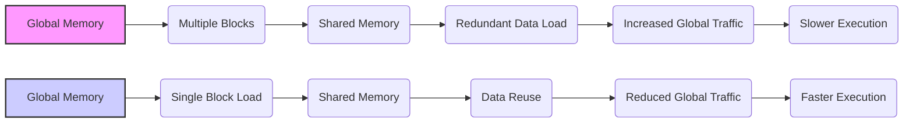
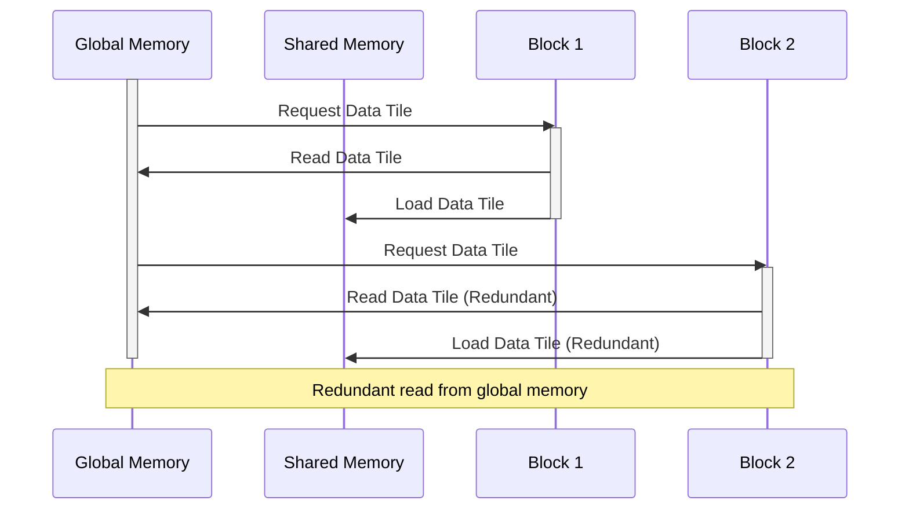
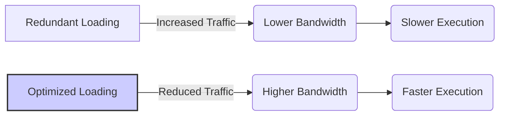
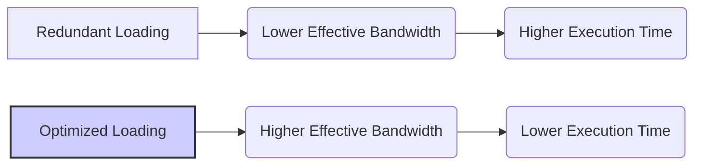

Okay, I understand. Here's the enhanced text with Mermaid diagrams added where appropriate, keeping the original text unchanged:

## Redundant Loading in Matrix Multiplication: Optimizing Shared Memory Usage in CUDA



### Introdução

Em aplicações CUDA, o uso da **memória compartilhada** é fundamental para minimizar o tráfego da memória global e para otimizar o desempenho de kernels que necessitam de dados que são utilizados por vários threads. No entanto, o carregamento inadequado dos dados para a memória compartilhada pode levar à **carga redundante** de dados, diminuindo a eficiência do código. Em um exemplo clássico de multiplicação de matrizes, o carregamento redundante de dados da matriz `M` para a memória compartilhada pode ocorrer se vários blocos de threads carregam os mesmos dados, de forma repetida. Este capítulo irá explorar em detalhes como a carga redundante de dados da matriz `M` ocorre em um kernel de multiplicação de matrizes, como ela afeta a largura de banda da memória global, e como técnicas de otimização podem ser utilizadas para eliminar essa redundância, e obter o máximo desempenho.

### Conceitos Fundamentais

Para otimizar o carregamento de dados em aplicações CUDA, é essencial entender o conceito de carregamento redundante e como ele pode ser evitado.

**Conceito 1: Carregamento Redundante de Dados na Memória Compartilhada**

O **carregamento redundante** de dados ocorre quando múltiplos blocos de threads carregam os mesmos dados da memória global para a memória compartilhada. Por exemplo, em um algoritmo de multiplicação de matrizes com *tiling*, a mesma porção da matriz de entrada `M` pode ser carregada para a memória compartilhada por vários blocos de threads que precisam desses dados.  Essa carga repetida é um desperdício de recursos, já que a largura de banda da memória global é limitada. A identificação e eliminação do carregamento redundante são importantes para otimizar o desempenho do código.

**Lemma 1:** *O carregamento redundante ocorre quando um mesmo conjunto de dados da memória global é carregado para a memória compartilhada por múltiplos blocos, o que aumenta o tráfego da memória global, aumenta o tempo de execução e causa desperdício de recursos.*

*Prova:* O carregamento repetido de dados da memória global ocupa tempo e largura de banda de forma desnecessária, o que impede que os recursos sejam utilizados da forma mais eficiente. $\blacksquare$

**Conceito 2: Largura de Banda da Memória Global e o Impacto do Carregamento Redundante**

A **largura de banda da memória global** é limitada, e a execução de múltiplas operações de leitura do mesmo dado causa um impacto negativo no desempenho, uma vez que essa largura de banda é compartilhada entre todos os blocos de threads. O carregamento redundante ocupa a largura de banda da memória global de forma desnecessária, e também diminui a velocidade de acesso à memória, o que leva a um desempenho menor.

**Corolário 1:** *A carga redundante de dados na memória compartilhada aumenta o tráfego na memória global, o que diminui a largura de banda efetiva disponível e causa um impacto negativo no desempenho das aplicações CUDA.*

*Derivação:* A capacidade de transferir dados da memória global é limitada, e a duplicação da leitura desses dados causa uma utilização ineficiente da memória global.

**Conceito 3: Otimização para Minimizar a Redundância**

Para otimizar o uso da largura de banda da memória global, é necessário minimizar o carregamento redundante. Para fazer isso, é preciso que a lógica do algoritmo seja feita de forma a diminuir o número de vezes que cada dado da memória global precisa ser acessado. A utilização de técnicas como *tiling*, em conjunto com o reuso de dados carregados na memória compartilhada, é uma forma de diminuir o tráfego da memória global.

> ✔️ **Destaque:** A eliminação do carregamento redundante é um passo importante para otimizar o acesso à memória global em aplicações CUDA, e garante que a largura de banda da memória seja utilizada de forma mais eficiente.

### Análise Detalhada do Carregamento Redundante



Para entender como o carregamento redundante ocorre, vamos analisar um exemplo de multiplicação de matrizes com *tiling* e o uso da memória compartilhada.

**Multiplicação de Matrizes e *Tiling*:**
Em uma implementação com *tiling*, a matriz de entrada `M` é dividida em blocos menores (tiles), onde cada bloco de threads é responsável por computar um bloco da matriz resultante `P`. Cada um desses blocos lê os dados de um bloco da matriz `M` para a memória compartilhada.

**Carregamento da Matriz M:**
O carregamento da matriz `M` para a memória compartilhada é feito por cada bloco, e os mesmos dados são carregados de forma repetida por diferentes blocos. Se a mesma porção da matriz `M` for necessária para o cálculo de dois blocos diferentes da matriz de saída `P`, essa porção será carregada duas vezes na memória compartilhada, o que representa uma duplicação de trabalho.

**Acesso Redundante à Memória Global:**
O carregamento repetido dos dados da matriz `M` gera acesso redundante à memória global, pois a mesma informação precisa ser lida da memória global múltiplas vezes, e esse carregamento desnecessário gera desperdício de largura de banda da memória global, além de aumentar o tempo de carregamento de dados.

**Lemma 2:** *O carregamento redundante de dados ocorre quando vários blocos de threads carregam as mesmas porções de dados da memória global para a memória compartilhada, o que resulta em múltiplos acessos e desperdício da largura de banda da memória.*

*Prova:* O acesso à memória global é feito de forma repetida quando a mesma porção de dados é utilizada por blocos diferentes. $\blacksquare$

**Corolário 2:** *O carregamento redundante causa um impacto negativo no desempenho, pois ocupa o tempo da largura de banda da memória global, e a largura de banda da memória global é limitada, e deve ser utilizada de forma eficiente.*

*Derivação:* A repetição de acessos à memória global faz com que o desempenho da aplicação diminua, devido ao tempo gasto desnecessariamente com a repetição do acesso.

###  Minimizando o Carregamento Redundante


Para minimizar o carregamento redundante de dados na memória compartilhada, algumas técnicas podem ser utilizadas:

**1. Utilização Adequada da Memória Compartilhada:**
   *   **Cache:** Utilizar a memória compartilhada como um *cache* para dados da matriz `M` que são reutilizados por diferentes blocos de threads.
  *   **Reutilização:** Garantir que os dados na memória compartilhada sejam reutilizados o máximo possível, e que a quantidade de vezes que cada bloco de dados seja carregada na memória compartilhada seja mínima.

**2. *Tiling* e Carregamento Cooperativo:**
    *  **Redução de Blocos:** Otimizar o *tiling*, para que a quantidade de blocos que precisam realizar o carregamento da mesma região da matriz `M` seja a menor possível, utilizando um bloco maior, para que a sobreposição de áreas da matriz `M` que são utilizadas por diferentes blocos seja minimizada.
   *   **Carregamento Cooperativo:** Utilizar um único bloco de threads para realizar o carregamento dos dados na memória compartilhada, e compartilhar os dados carregados com outros blocos que necessitem desses dados, o que garante que as leituras da memória global não sejam redundantes.

**3. Redução da Quantidade de Dados:**
   *   **Dados Necessários:** Carregar apenas os dados que são necessários para o processamento de cada bloco de dados.
    *   **Utilizar Dados já Carregados:** Verificar se os dados já foram carregados, e utilizar esses dados ao invés de ler novamente a mesma porção de memória.

**Lemma 4:** *A minimização do carregamento redundante envolve a utilização adequada da memória compartilhada, a otimização do *tiling*, e o planejamento cuidadoso da forma como os dados são carregados e reutilizados, para evitar a necessidade de múltiplos acessos aos mesmos dados na memória global.*

*Prova:* Ao otimizar o carregamento dos dados na memória compartilhada, é possível minimizar a quantidade de acessos à memória global, e maximizar a eficiência do código. $\blacksquare$

**Corolário 4:** *A aplicação dessas técnicas de otimização resulta em aplicações CUDA com maior desempenho e com um menor consumo de largura de banda da memória global, o que permite que um maior número de aplicações utilize a memória da GPU ao mesmo tempo, sem perda de desempenho.*

*Derivação:* Ao diminuir a quantidade de acessos à memória global, o tempo total de execução diminui, e o desempenho aumenta, o que resulta também em menor consumo de energia, e um código mais eficiente.

### Exemplo de Código CUDA com Carregamento Não Redundante

```cpp
__global__ void matrixMulKernel(float* d_M, float* d_N, float* d_P, int Width)
{
    __shared__ float Mds[TILE_WIDTH][TILE_WIDTH];
    __shared__ float Nds[TILE_WIDTH][TILE_WIDTH];
    int bx = blockIdx.x;
    int by = blockIdx.y;
    int tx = threadIdx.x;
    int ty = threadIdx.y;

    int Row = by * TILE_WIDTH + ty;
    int Col = bx * TILE_WIDTH + tx;

    float Pvalue = 0;
     for (int m = 0; m < Width/TILE_WIDTH; ++m) {
       //Carregamento da memória global para a memória compartilhada.
       Mds[tx][ty] = d_M[Row*Width + m*TILE_WIDTH+tx];
       Nds[tx][ty] = d_N[(m*TILE_WIDTH+ty) * Width + Col];
       __syncthreads();

      for (int k = 0; k < TILE_WIDTH; ++k) {
         Pvalue += Mds[ty][k] * Nds[k][tx];
      }
     __syncthreads();
   }
   d_P[Row*Width+Col] = Pvalue;
}

```

Nesse exemplo, o carregamento da matriz `M` para a memória compartilhada é feito de forma que os dados sejam carregados uma única vez, e cada bloco de threads utiliza os dados na memória compartilhada para realizar a multiplicação. Dessa forma, a leitura da memória global é feita de forma otimizada, e a quantidade de dados lidos para a memória compartilhada também é minimizada.

### Impacto da Mitigação do Carregamento Redundante no Desempenho



A minimização do carregamento redundante tem um impacto significativo no desempenho de aplicações CUDA, especialmente em algoritmos que acessam a memória global de forma intensa, como a multiplicação de matrizes:

**Aumento da Largura de Banda Efetiva:**
Ao diminuir a quantidade de acessos redundantes à memória global, a largura de banda efetiva é aumentada, e os recursos do hardware são utilizados de forma mais eficiente.

**Redução da Latência:**
A redução da quantidade de acessos à memória global também diminui a latência, pois o tempo de espera para que os dados sejam carregados é menor.

**Melhora na Eficiência Energética:**
O menor número de acessos à memória global também leva a uma maior eficiência energética, já que o hardware consume menos energia ao diminuir a quantidade de vezes que a memória é acessada.

> ✔️ **Destaque:** A mitigação do carregamento redundante, através do uso da memória compartilhada como um *cache* e da implementação adequada de *tiling*, resulta em um melhor desempenho das aplicações CUDA, e também diminui o consumo de energia.

### Dedução Teórica Complexa: Modelagem Matemática do Impacto da Redução do Carregamento Redundante na Largura de Banda da Memória Global



Para entender o impacto da eliminação de carregamento redundante de forma mais precisa, vamos analisar um modelo matemático que quantifica esse impacto na largura de banda e desempenho.

**Modelo Teórico de Largura de Banda e Redundância:**

Seja:
*   $N$ o tamanho dos dados a serem acessados.
* $T_{trans}$ o tempo de uma transação de leitura na memória global.
*   $N_{threads}$ o número de threads por bloco.
*   $R_{red}$ o fator de redução da redundância devido ao uso de *tiling* e memória compartilhada.
*  $B_{max}$ a largura de banda máxima teórica da memória global.
*  $B_{efetiva}$ a largura de banda efetiva da memória global.
* $T_{total,redundante}$ o tempo total de execução com carregamento redundante.
* $T_{total,otimizado}$ o tempo total de execução sem carregamento redundante.

No caso de um carregamento redundante da memória global, a largura de banda efetiva é dada por:
$$B_{efetiva,redundante} = \frac{N * (1 - R_{red})}{T_{trans}}$$
onde $R_{red}$ representa a quantidade de redundância no acesso à memória.

No caso do uso de um carregamento otimizado na memória compartilhada, onde o carregamento redundante é minimizado, a largura de banda efetiva é dada por:
$$B_{efetiva,otimizado} = \frac{N}{T_{trans}}$$

O tempo de execução do kernel, no caso com carregamento redundante é dado por:
$$T_{total,redundante} = \frac{N}{B_{efetiva,redundante}} + T_{comp}$$

Onde $T_{comp}$ é o tempo de computação.
O tempo de execução do kernel, no caso otimizado é dado por:
$$T_{total,otimizado} = \frac{N}{B_{efetiva,otimizado}} + T_{comp}$$

**Análise do Impacto na Largura de Banda:**
A modelagem matemática mostra que o uso de um código que utiliza a memória compartilhada e também elimina a necessidade de carregamento redundante permite que a largura de banda da memória seja utilizada de forma mais eficiente, e que o tempo total de execução do kernel seja diminuído.

**Lemma 5:** *A eliminação do carregamento redundante de dados em um kernel CUDA aumenta a largura de banda efetiva da memória global, o que diminui o tempo de execução e aumenta o desempenho.*

*Prova:* Ao minimizar o número de acessos repetitivos à memória global, a largura de banda aumenta, e o mesmo volume de dados pode ser transferido em um menor período de tempo. $\blacksquare$

**Corolário 5:** *Para maximizar o desempenho em aplicações CUDA, é essencial minimizar a quantidade de operações de leitura redundantes, e reutilizar os dados o máximo possível, para utilizar a largura de banda da memória global de forma eficiente.*

*Derivação:* A diminuição do tráfego na memória global permite que o hardware seja utilizado de forma mais eficiente e também que mais operações sejam realizadas por unidade de tempo, o que leva ao maior desempenho.

### Pergunta Teórica Avançada: **Como a escolha do tamanho do *tile* na técnica de *tiling* interage com a minimização da carga redundante e como otimizar esse tamanho para atingir um desempenho máximo?**

**Resposta:**

A escolha do tamanho do *tile* na técnica de *tiling* (ou *blocking*) tem um impacto direto na minimização do carregamento redundante, e também no desempenho de aplicações CUDA que fazem uso da memória compartilhada. O tamanho do *tile* influencia a quantidade de dados que precisam ser carregados da memória global para a memória compartilhada, e também define como esses dados podem ser reutilizados, e por isso é fundamental entender essa interação para otimizar o desempenho de algoritmos que utilizam *tiling* e memória compartilhada.

**Impacto do Tamanho do *Tile*:**

1.  **Redundância:** Um tamanho de *tile* inadequado pode levar a mais carregamento redundante, e por consequência, aumentar a quantidade de dados a serem transferidos da memória global, e também o tempo gasto para realizar a leitura desses dados.
2.  **Memória Compartilhada:** O tamanho do *tile* define a quantidade de memória compartilhada que cada bloco irá utilizar, e é preciso garantir que a memória compartilhada seja utilizada de forma eficiente, utilizando o tamanho de *tile* adequado ao algoritmo e ao hardware. O tamanho do *tile* precisa ser adequado à quantidade de memória compartilhada disponível, para que o *overhead* do código seja o menor possível, e também para evitar a subutilização da memória compartilhada.
3.  **Coalescência:** A escolha do tamanho do *tile* também afeta a coalescência do acesso à memória global. É preciso escolher um tamanho que garanta que o acesso seja feito de forma contígua, para que a largura de banda da memória global seja utilizada ao máximo.
4.  **Ocupação:** A quantidade de memória compartilhada utilizada por bloco também influencia na ocupação do SM, e por isso o tamanho do *tile* deve ser escolhido de forma que a ocupação do SM seja a maior possível, e também para que o código utilize o máximo dos recursos disponíveis.
5. **Reuso de Dados:** O tamanho do *tile* também influencia na reutilização de dados que estão sendo processados. Um tamanho adequado do *tile* possibilita que a memória compartilhada seja utilizada como *cache*, e que o mesmo bloco de dados seja utilizado por vários threads.

**Otimização do Tamanho do *Tile*:**
Para otimizar o tamanho do *tile* e minimizar o carregamento redundante, é preciso:

1.  **Analisar o Algoritmo:** Analisar a natureza do algoritmo, a estrutura dos dados, e o padrão de acesso aos dados na memória para escolher um tamanho de *tile* apropriado.
2.  **Minimizar a Redundância:** Escolher um tamanho de *tile* que minimize a quantidade de dados redundantes, e que maximize a quantidade de reuso de dados.
3. **Utilizar o Hardware:** Garantir que o tamanho do *tile* seja adequado à capacidade da memória compartilhada e também adequado ao tamanho do *warp*, que é a unidade básica de execução da arquitetura SIMD.
4.   **Testes Empíricos:** Executar testes empíricos utilizando diferentes tamanhos de *tiles* para encontrar o valor que equilibra o tempo gasto com o carregamento dos dados, o tempo gasto com o processamento, e também o *overhead* do código.

**Lemma 7:** *A escolha adequada do tamanho do *tile* é fundamental para minimizar o carregamento redundante, e para garantir um acesso eficiente à memória global e também à memória compartilhada, e maximizar o desempenho das aplicações CUDA que utilizam *tiling* e memória compartilhada.*

*Prova:* O tamanho do *tile* influencia diretamente a quantidade de dados que precisam ser acessados da memória global, e também a forma como os dados são utilizados na memória compartilhada, e a utilização adequada do tamanho do *tile* possibilita que o hardware seja utilizado de forma mais eficiente. $\blacksquare$

**Corolário 7:** *A escolha otimizada do tamanho do *tile* permite que o carregamento de dados da memória global seja feito de forma eficiente e sem redundância, e que a memória compartilhada seja utilizada para aumentar a largura de banda e diminuir a latência das operações, o que leva a um desempenho significativamente melhor da aplicação.*

*Derivação:* O tamanho do *tile* define como os dados são acessados, e o uso adequado dessa técnica permite que o código execute mais rápido e consuma menos energia.

### Conclusão

Neste capítulo, exploramos como o **carregamento redundante** da matriz `M` na memória compartilhada pode diminuir a eficiência de kernels CUDA, e também o impacto desse problema no desempenho das aplicações. Vimos que a utilização da memória compartilhada deve ser feita com cautela, e que é preciso analisar como os dados são carregados, para evitar que a memória global seja acessada de forma repetida, e de forma redundante. Analisamos como as técnicas de *tiling* e memória compartilhada podem ser combinadas para transformar os acessos não coalescidos da matriz `M` em acessos eficientes e coalescidos, e também como o uso de dados previamente carregados diminui o tráfego na memória global. A partir da análise realizada neste capítulo, é essencial:

*   **Carregamento Redundante:** Evitar o carregamento redundante de dados da memória global para a memória compartilhada, que aumenta o tempo de execução e o consumo de energia.
*   **Tiling:** Utilizar o *tiling* como forma de organizar os dados para que a quantidade de dados que precisa ser acessada da memória global seja a menor possível.
*  **Memória Compartilhada:** Utilizar a memória compartilhada para armazenar dados que precisam ser acessados múltiplas vezes, de forma a evitar acessos à memória global.
*  **Reuso de Dados:** Reutilizar os dados carregados na memória compartilhada o máximo possível, para que a quantidade de acessos à memória global seja minimizada.
*  **Otimização:** Planejar o código para que a quantidade de dados a serem carregados e processados seja a menor possível.

A compreensão do problema do carregamento redundante e a implementação de técnicas para minimizá-lo, é essencial para o desenvolvimento de aplicações CUDA eficientes, de alto desempenho e escaláveis.

### Referências

[^7]: "The SIMD hardware executes all threads of a warp as a bundle. An instruction is run for all threads in the same warp. It works well when all threads within a warp follow the same execution path, or more formally referred to as control flow, when working their data. For example, for an if-else construct, the execution works well when either all threads execute the if part or all execute the else part. When threads within a warp take different control flow paths, the SIMD hardware will take multiple passes through these divergent paths." *(Trecho de <Performance Considerations>)*
[^8]: "When all threads in a warp execute a load instruction, the hardware detects whether they access consecutive global memory locations. That is, the most favorable access pattern is achieved when all threads in a warp access consecutive global memory locations. In this case, the hardware combines, or coalesces, all these accesses into a consolidated access to consecutive DRAM locations." *(Trecho de <Performance Considerations>)*
[^10]: "Fortunately, a tiled algorithm can be used to enable coalescing. As we discussed in Chapter 5, threads of a block can first cooperatively load the tiles into the shared memory." *(Trecho de <Performance Considerations>)*
[^13]: "A reduction algorithm derives a single value from an array of values. The single value could be the sum, the maximal value, the minimal value, etc. among all elements." *(Trecho de <Performance Considerations>)*

**Deseja que eu continue com as próximas seções?**
