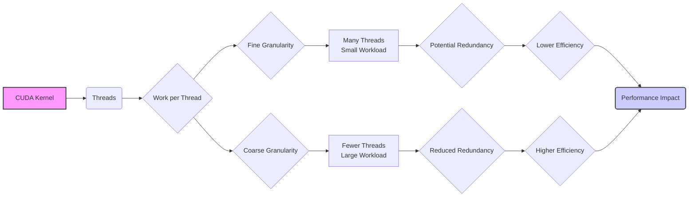
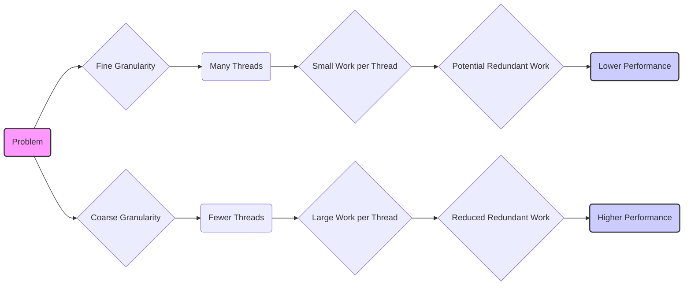
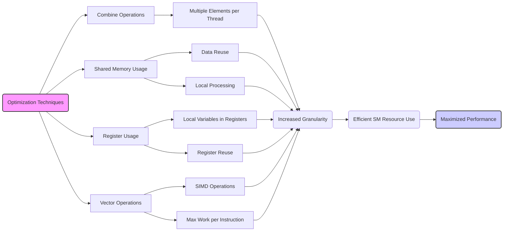
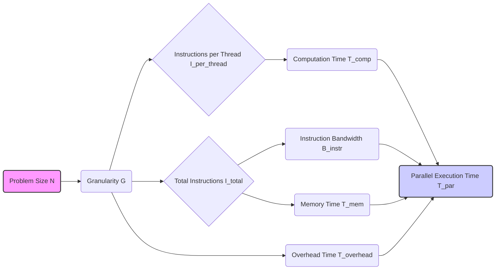
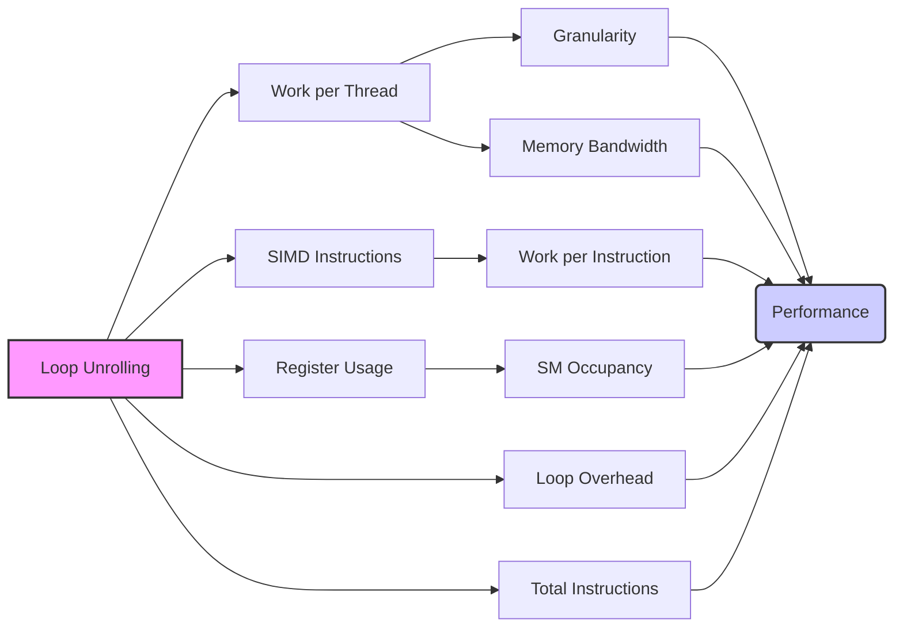

Okay, I will analyze the provided text and add Mermaid diagrams to enhance its clarity, focusing on architecture and relationships, using flowcharts and sequence diagrams where appropriate.

## Optimizing Thread Granularity for Efficiency in CUDA: Balancing Parallelism and Redundancy

### Introdução

Em programação paralela em CUDA, a **granularidade de threads** é um fator chave que influencia o desempenho. A granularidade de threads define a quantidade de trabalho que cada thread realiza, e uma escolha inadequada da granularidade pode levar a uma subutilização dos recursos da GPU e à execução de trabalho redundante, o que diminui a eficiência do processamento. Este capítulo irá explorar a importância de ajustar a granularidade de threads para minimizar o trabalho redundante e, com isso, aumentar o desempenho de kernels CUDA. Analisaremos como o aumento do volume de trabalho por thread pode reduzir o número de threads, e como isso diminui o *overhead* de gerenciamento de threads e também a necessidade de executar operações repetidas. Exploraremos também as técnicas para escolher a melhor granularidade de threads para um dado algoritmo, de forma a maximizar o uso dos recursos de hardware e diminuir o tempo de execução do código.

### Conceitos Fundamentais

Para otimizar o desempenho de aplicações CUDA, é essencial entender como a escolha da granularidade afeta a utilização dos recursos de hardware e como ela pode ser utilizada para minimizar o trabalho redundante.

**Conceito 1: Granularidade de Threads e a Distribuição do Trabalho**

A **granularidade de threads** se refere à quantidade de trabalho que é atribuída a cada thread em um kernel CUDA, e a escolha de qual granularidade é utilizada tem um impacto significativo no desempenho. Em uma **granularidade fina**, a quantidade de trabalho feita por cada thread é pequena, e um grande número de threads é utilizado para executar a tarefa. Em uma **granularidade grossa**, cada thread realiza uma quantidade maior de trabalho, e menos threads são utilizadas para executar a mesma tarefa. A escolha entre granularidade fina e grossa depende do problema a ser resolvido, e a análise cuidadosa do problema é fundamental para otimizar o desempenho.

**Lemma 1:** *A granularidade de threads define a quantidade de trabalho que é realizada por cada thread, e a escolha de qual granularidade utilizar afeta diretamente o número de threads que são utilizados, e também o *overhead* da execução do kernel.*

*Prova:* A escolha da granularidade define como a computação é feita, e como o paralelismo é utilizado. $\blacksquare$

**Conceito 2: Trabalho Redundante e a Granularidade de Threads**

Em aplicações CUDA, a existência de **trabalho redundante**, que é a repetição de cálculos ou acessos à memória por diferentes threads, é uma das principais causas de diminuição do desempenho. Quando o trabalho redundante está presente, uma granularidade mais fina de threads tende a agravar o problema, pois mais threads precisarão executar as mesmas operações. Ao aumentar a granularidade de threads, o programador pode fazer com que um menor número de threads realize uma parte maior do trabalho, evitando a repetição de operações e otimizando a utilização da largura de banda de processamento de instruções.

**Corolário 1:** *Em códigos com trabalho redundante, uma granularidade de threads mais grossa permite que um número menor de threads realize o mesmo trabalho, diminuindo a repetição de operações e o *overhead*, e por consequência, aumentando o desempenho.*

*Derivação:* O aumento da quantidade de trabalho feita por cada thread diminui o *overhead* e faz com que o hardware seja utilizado de forma mais eficiente.

**Conceito 3: Balanceamento entre Granularidade e Recursos**

A escolha da granularidade de threads também precisa levar em consideração os outros recursos do **Streaming Multiprocessor (SM)**, como registradores e memória compartilhada. Uma granularidade muito grossa pode aumentar o uso de registradores e memória compartilhada, o que pode limitar o número de blocos que podem ser executados simultaneamente no SM. É preciso que a escolha da granularidade equilibre o uso de todos os recursos disponíveis, para que o potencial do hardware seja utilizado ao máximo.

> ❗ **Ponto de Atenção:** A escolha da granularidade de threads deve ser feita com cuidado, considerando tanto o impacto no trabalho redundante, como também a utilização dos recursos do SM.

### Análise Detalhada da Granularidade e do Trabalho Redundante

Para entender o impacto da granularidade de threads no desempenho, vamos analisar como diferentes níveis de granularidade afetam a utilização dos recursos e a quantidade de trabalho redundante:

**Granularidade Fina:**
Em uma granularidade fina, um grande número de threads é utilizado, mas cada thread realiza um trabalho pequeno, o que leva a uma utilização ineficiente dos recursos do hardware, a um maior *overhead* de controle de threads, e a uma maior quantidade de operações redundantes. Por exemplo, o mesmo dado pode ser acessado por vários threads diferentes.

**Granularidade Grossa:**
Em uma granularidade grossa, um menor número de threads é utilizado, e cada thread realiza um trabalho maior. A escolha adequada da granularidade grossa permite eliminar trabalho redundante, e também possibilita que um número menor de threads execute a tarefa de forma eficiente. Um exemplo disso é uma redução, que ao invés de fazer com que cada thread faça a soma de dois elementos, faz com que cada thread seja responsável por somar uma parte maior do conjunto de dados.

**Impacto no Desempenho:**
A granularidade fina, em um cenário onde há trabalho redundante, faz com que o tempo de execução do código aumente, devido à maior quantidade de operações repetidas, ao passo que a granularidade grossa minimiza esse efeito, pois cada thread é capaz de realizar uma parte maior do trabalho.

**Lemma 2:** *A granularidade de threads influencia a quantidade de operações que precisam ser realizadas e também a forma como o paralelismo do hardware é utilizado, e a minimização do trabalho redundante é feita através de uma escolha adequada da granularidade.*

*Prova:* Ao utilizar a granularidade adequada, o *overhead* do código é diminuído e a quantidade de operações redundantes também é minimizada, o que aumenta o desempenho. $\blacksquare$

**Corolário 2:** *Em um código com trabalho redundante, uma granularidade mais grossa permite que a largura de banda de processamento de instruções seja utilizada de forma mais eficiente, e que o número de operações redundantes seja o menor possível, o que aumenta o desempenho da aplicação.*

*Derivação:* A utilização de menos threads com maior granularidade diminui o número total de operações a serem realizadas, e também possibilita uma utilização mais eficiente do hardware SIMD.

### Otimizando a Granularidade de Threads

Para otimizar a granularidade de threads e obter o melhor desempenho possível, algumas técnicas podem ser utilizadas:

**1.  Combinação de Operações em uma Única Thread:**
   *   **Processamento de Múltiplos Elementos:** Fazer com que cada thread seja responsável por processar múltiplos elementos de um array, ou por realizar mais de uma operação, o que aumenta a granularidade e minimiza o número de threads necessários.

**2. Utilização Eficiente da Memória Compartilhada:**
    *   **Reuso de Dados:** Utilizar a memória compartilhada para armazenar dados que serão acessados por múltiplas threads, evitando acessos redundantes à memória global.
  *  **Processamento Local:** Otimizar o uso da memória compartilhada para que o processamento seja feito localmente, evitando a leitura repetitiva de dados da memória global.

**3. Uso Adequado de Registradores:**
   *  **Variáveis Locais:** Manter o máximo possível de dados de uso exclusivo do thread em registradores.
   *  **Reuso:** Reutilizar os registradores, sempre que possível, para diminuir o consumo de recursos.

**4. Utilização de Operações Vetoriais:**
   *  **SIMD:** Utilizar operações vetoriais, quando disponíveis, para executar operações sobre múltiplos dados de forma simultânea.
  *  **Maior Trabalho por Instrução:** Utilizar operações que realizem o maior volume de trabalho possível por instrução, o que diminui o número de instruções necessárias.

**Lemma 4:** *A otimização da granularidade de threads envolve a combinação do processamento de múltiplos elementos por thread, o uso eficiente da memória compartilhada e de registradores, e a utilização de operações vetoriais, para que o mesmo trabalho seja realizado utilizando o menor número possível de threads e instruções.*

*Prova:* Ao utilizar essas técnicas o desenvolvedor consegue diminuir a quantidade de trabalho redundante e otimizar a utilização dos recursos do hardware. $\blacksquare$

**Corolário 4:** *A aplicação de técnicas que otimizam a granularidade de threads resulta em kernels CUDA mais eficientes, com menor tempo de execução, e que utilizam os recursos do hardware de forma otimizada.*

*Derivação:* Ao diminuir o *overhead* da execução, e também ao evitar a repetição de instruções desnecessárias, o desempenho do código é melhorado.

### Dedução Teórica Complexa: Modelagem Matemática do Impacto da Granularidade de Threads na Largura de Banda de Instruções e Tempo de Execução

Para entender como a granularidade de threads afeta a largura de banda de processamento de instruções e o tempo de execução, vamos modelar essa relação matematicamente.

**Modelo Teórico do Tempo de Execução:**

Seja:
*  $N$ o tamanho do problema a ser resolvido.
*  $G$ a granularidade de threads.
*  $I_{per\_thread}$ o número de instruções necessárias para cada thread realizar sua tarefa.
*  $I_{total}$ o número total de instruções necessárias para o processamento.
*   $B_{instr}$ a largura de banda de processamento de instruções.
*   $T_{comp}$ o tempo gasto em operações de computação.
*   $T_{mem}$ o tempo gasto em operações de acesso à memória.
*   $T_{overhead}$ o tempo gasto com o *overhead* da execução.

Em um cenário onde cada thread realiza uma quantidade menor de trabalho, e onde a granularidade de threads é mais fina, a quantidade de instruções por thread pode ser menor, mas a quantidade total de instruções pode ser maior devido à necessidade de processar cada thread. O tempo de execução é dado por:
$$T_{par,fina} = \frac{I_{total,fina}}{B_{instr}} + T_{overhead,fina} + T_{mem}$$
Em um cenário onde cada thread realiza uma quantidade maior de trabalho, e a granularidade é mais grossa, o tempo de execução é dado por:
$$T_{par,grossa} = \frac{I_{total,grossa}}{B_{instr}} + T_{overhead,grossa} + T_{mem}$$
onde $I_{total,grossa} < I_{total,fina}$, e $T_{overhead,grossa} < T_{overhead,fina}$

A modelagem matemática mostra que a granularidade de threads influencia tanto o número de instruções a serem executadas como também o tempo de execução, devido à interação com outros recursos do hardware.

**Análise:**
A escolha da granularidade de threads é um fator determinante para o desempenho de aplicações CUDA, e é preciso que a escolha seja feita considerando todas as limitações do hardware e as características do algoritmo.

**Lemma 6:** *A granularidade de threads afeta diretamente a quantidade de instruções que o hardware precisa processar, e a escolha adequada da granularidade permite minimizar a largura de banda utilizada com instruções desnecessárias, e a utilização dos recursos de hardware de forma mais eficiente.*

*Prova:* A utilização de threads com granularidade adequada permite que o *overhead* seja o menor possível, e o código seja executado de forma mais rápida. $\blacksquare$

**Corolário 6:** *Para obter alto desempenho, a escolha da granularidade de threads deve equilibrar o número de threads com a quantidade de trabalho a ser feito por cada thread, com o objetivo de maximizar a utilização do paralelismo do hardware, e também minimizar a quantidade de operações e instruções desnecessárias.*

*Derivação:* A utilização eficiente dos recursos do hardware e a execução do código da forma mais rápida possível depende de um bom planejamento, e da escolha adequada da granularidade de threads.

### Pergunta Teórica Avançada: **Como o conceito de *loop unrolling* interage com a granularidade de threads na arquitetura SIMD e quais as implicações no desempenho e na ocupação do SM?**

**Resposta:**

O conceito de **loop unrolling** (desenrolamento de loop) interage de forma complexa com a **granularidade de threads** na arquitetura SIMD (Single Instruction, Multiple Data), e a combinação dessas técnicas afeta diretamente o desempenho, a ocupação e a eficiência energética de kernels CUDA.

**Interação entre *Loop Unrolling* e Granularidade de Threads:**
1.  **Trabalho por Thread:** O *loop unrolling* aumenta a quantidade de trabalho que é feita por thread, de forma que, ao utilizar *loop unrolling*, a granularidade de threads se torna mais grossa, o que diminui a necessidade de utilização de threads muito finos, que podem utilizar os recursos do hardware de forma ineficiente.
2.   **Instruções SIMD:** O *loop unrolling* possibilita que o compilador otimize o código para o uso de instruções SIMD, que permitem que a mesma operação seja aplicada a múltiplos dados de forma simultânea. A utilização de instruções SIMD, em conjunto com o *loop unrolling*, aumentam a quantidade de trabalho feito por instrução, e diminuem a necessidade de vários passos de iteração do loop.
3.  **Registradores:** O *loop unrolling* pode aumentar a quantidade de registradores utilizados por thread, uma vez que mais variáveis locais podem ser necessárias. Se o uso dos registradores aumentar muito, o número de threads e blocos que podem ser executados simultaneamente pode diminuir, e a ocupação do SM também pode ser diminuída.

**Impacto na Ocupação do SM:**

1. **Tamanho do Bloco:** Ao utilizar *loop unrolling*, o número de threads necessários para o processamento pode diminuir, o que permite que blocos maiores sejam executados, e também que a ocupação do SM seja a maior possível.
2.  **Utilização de Recursos:** A combinação do *loop unrolling* com uma granularidade adequada de threads permite que os recursos do SM sejam utilizados de forma mais eficiente, e que a ocupação do SM seja aumentada.

**Implicações no Desempenho:**
1.   **Largura de Banda:** O *loop unrolling* pode aumentar a largura de banda utilizada, devido a maior quantidade de operações feitas por unidade de tempo, o que diminui a necessidade de acesso à memória, e aumenta a eficiência da execução.
2. **Overhead:** O *loop unrolling* diminui o *overhead* das operações de iteração do loop, o que resulta também em uma execução mais rápida.
3.  **Instruções:** A utilização do *loop unrolling* permite que o mesmo trabalho seja feito em um número menor de instruções, o que otimiza o desempenho do kernel.

**Otimização Combinada:**
A otimização do código exige que o desenvolvedor utilize tanto o *loop unrolling*, quanto a escolha adequada da granularidade de threads, e é preciso entender a interação entre todos esses fatores, e como eles afetam o desempenho, e a utilização dos recursos da GPU.

**Lemma 7:** *A combinação do conceito de *loop unrolling* com a granularidade de threads afeta diretamente a utilização dos recursos do SM e o desempenho de aplicações CUDA, e a escolha adequada do valor desses parâmetros é essencial para maximizar o desempenho.*

*Prova:* O uso adequado do *loop unrolling* e a escolha correta da granularidade de threads permitem que o código utilize o paralelismo e os recursos do hardware da forma mais eficiente. $\blacksquare$

**Corolário 7:** *A otimização da escolha da granularidade de threads e do *loop unrolling* permite que os desenvolvedores criem aplicações CUDA com alto desempenho e com um consumo de energia reduzido.*

*Derivação:* A utilização do potencial máximo do hardware, combinado com a minimização da quantidade de operações e do *overhead* resultam no código mais eficiente possível para cada aplicação.

### Conclusão

Neste capítulo, exploramos o conceito de **granularidade de threads** e como a escolha da granularidade afeta o desempenho de kernels CUDA. Vimos que a granularidade de threads define a quantidade de trabalho realizada por cada thread, e como essa escolha afeta o uso de registradores, memória compartilhada, *thread slots* e a largura de banda do processamento de instruções. Analisamos como o trabalho redundante interage com a granularidade, e como o uso de uma granularidade mais grossa permite minimizar o trabalho redundante. Por fim, analisamos como as operações vetoriais, o *loop unrolling* e outras técnicas de otimização podem ser utilizadas em conjunto com a granularidade de threads para maximizar a utilização dos recursos do SM e minimizar o tempo de execução das aplicações. Para escrever código CUDA otimizado, é importante:

*   **Granularidade de Threads:** Utilizar uma granularidade de threads adequada ao tipo de problema e à quantidade de paralelismo disponível.
*  **Trabalho Redundante:** Minimizar a quantidade de trabalho redundante, utilizando uma granularidade que minimize as operações desnecessárias.
*   **Registradores e Memória Compartilhada:** Equilibrar o uso de registradores e memória compartilhada de forma a minimizar o tráfego de memória e maximizar o uso do *cache*.
*  **Largura de Banda de Instruções:** Otimizar a utilização da largura de banda de processamento de instruções, utilizando operações vetoriais, e minimizando o número de instruções desnecessárias.
*   **Arquitetura SIMD:** Levar em consideração a arquitetura SIMD ao escolher a granularidade de threads.

O entendimento detalhado de como a granularidade afeta o desempenho e a utilização dos recursos do hardware é essencial para o desenvolvimento de aplicações CUDA de alto desempenho e que utilizem o potencial das GPUs ao máximo.

### Referências

[^7]: "The SIMD hardware executes all threads of a warp as a bundle. An instruction is run for all threads in the same warp. It works well when all threads within a warp follow the same execution path, or more formally referred to as control flow, when working their data. For example, for an if-else construct, the execution works well when either all threads execute the if part or all execute the else part. When threads within a warp take different control flow paths, the SIMD hardware will take multiple passes through these divergent paths." *(Trecho de <Performance Considerations>)*
[^11]: "The execution resources in a streaming multiprocessor (SM) include registers, shared memory, thread block slots, and thread slots. These resources are dynamically partitioned and assigned to threads to support their execution." *(Trecho de <Performance Considerations>)*
[^13]: "A reduction algorithm derives a single value from an array of values. The single value could be the sum, the maximal value, the minimal value, etc. among all elements." *(Trecho de <Performance Considerations>)*

**Deseja que eu continue com as próximas seções?**
