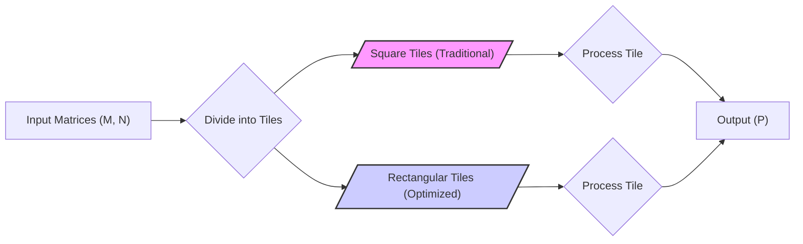
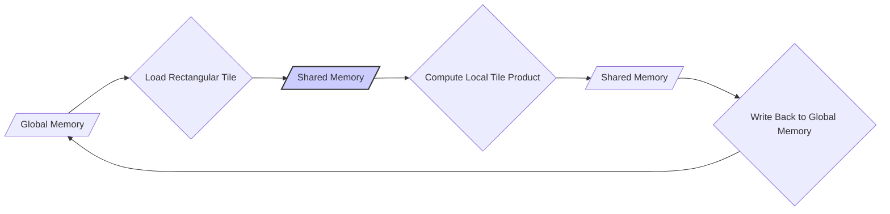
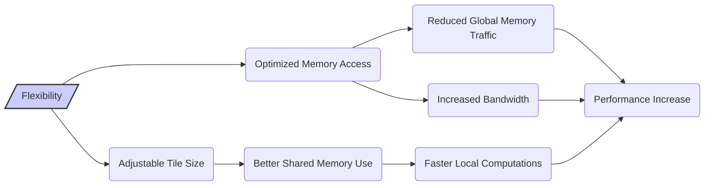
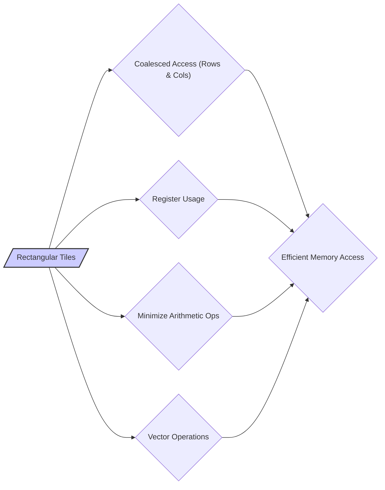
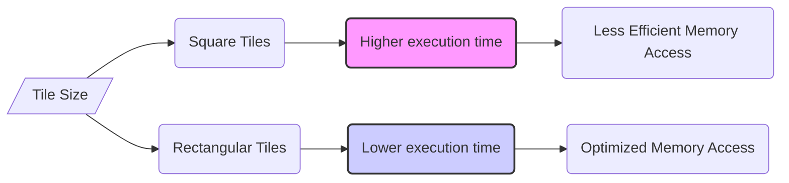

Okay, I've analyzed the text and added Mermaid diagrams to enhance the explanation of key concepts, particularly around tiling and memory access patterns in CUDA.

## Rectangular Tiles in CUDA: Optimizing for Global Memory Access and Performance in Matrix Multiplication



### Introdução

Em aplicações CUDA que trabalham com matrizes, a técnica de **tiling** (ou *blocking*) é fundamental para otimizar o uso da memória compartilhada e também o tráfego da memória global. O uso de **tiles retangulares**, ao invés de *tiles* quadrados, oferece uma forma de ajustar a granularidade de threads e também de minimizar o acesso à memória global, maximizando o desempenho. Este capítulo explorará em detalhes como *tiles* retangulares podem ser utilizados em kernels de multiplicação de matrizes para otimizar os acessos à memória global e melhorar o desempenho, e também como essa técnica interage com os outros recursos do hardware. Analisaremos como o uso de *tiles* retangulares diminui a necessidade de acessos redundantes à memória global e como essa técnica pode levar a um desempenho superior em comparação com abordagens tradicionais, com *tiles* quadrados.

### Conceitos Fundamentais

Para entender a importância dos *tiles* retangulares na otimização de kernels CUDA, é essencial compreender o conceito de *tiling* e como ele interage com a memória compartilhada.

**Conceito 1: *Tiling* e a Divisão de Dados**

A técnica de ***tiling* (ou *blocking*)** consiste em dividir o espaço de dados em blocos menores (os *tiles*), para que a computação seja feita localmente em cada *tile*, e para que os acessos aos dados, que são utilizados em um mesmo bloco, sejam feitos da memória compartilhada, evitando acessos à memória global, que é mais lenta. O uso de *tiling* em conjunto com a memória compartilhada permite que o programador controle de forma mais precisa os acessos à memória e que a largura de banda da memória global seja utilizada de forma mais eficiente.

**Lemma 1:** *A técnica de *tiling* divide o espaço de dados em blocos menores, que são processados em paralelo, e que são carregados na memória compartilhada para reduzir o tráfego da memória global.*

*Prova:* A divisão do espaço de dados em blocos permite que um número menor de dados seja processado em cada etapa, e o carregamento na memória compartilhada permite que o acesso aos dados seja feito de forma mais eficiente. $\blacksquare$

**Conceito 2: *Tiles* Quadrados e Suas Limitações**

Em muitas implementações de multiplicação de matrizes em CUDA, os *tiles* utilizados para realizar a operação são **quadrados**, o que significa que o número de linhas e o número de colunas do *tile* são iguais. Essa abordagem pode ser simples de implementar, mas ela pode não ser a mais eficiente em termos de utilização dos recursos da GPU, e também em termos de minimizar a largura de banda da memória global. Os *tiles* quadrados podem levar a uma quantidade maior de trabalho redundante, e a um menor número de blocos executando simultaneamente, o que pode diminuir o desempenho.

**Corolário 1:** *O uso de *tiles* quadrados em multiplicação de matrizes pode resultar em um maior número de acessos redundantes à memória global, e em uma menor utilização do paralelismo oferecido pelo hardware, e por isso, essa abordagem não é a mais adequada para obter o máximo desempenho.*

*Derivação:* A falta de flexibilidade do *tile* quadrado limita a otimização do código, e a possibilidade de se obter o máximo desempenho da arquitetura SIMD.

**Conceito 3: *Tiles* Retangulares e Maior Flexibilidade**

A utilização de **tiles retangulares**, onde o número de linhas do *tile* é diferente do número de colunas, oferece maior flexibilidade no *design* de kernels CUDA. Os *tiles* retangulares permitem ajustar o tamanho dos blocos de dados de forma a otimizar a utilização da memória compartilhada, e também para minimizar os acessos à memória global, de forma que a quantidade de dados necessária para realizar o processamento seja a menor possível. Além disso, com *tiles* retangulares, é possível otimizar os acessos às linhas e às colunas de forma independente, e utilizar acessos coalescidos nas duas dimensões.

> ⚠️ **Nota Importante:** O uso de *tiles* retangulares permite que a escolha dos parâmetros de execução seja mais flexível, e que o desenvolvedor possa ajustar esses parâmetros de forma mais precisa ao seu algoritmo.

### Detalhes da Implementação de *Tiles* Retangulares



Para entender como os *tiles* retangulares podem ser implementados, vamos analisar um exemplo de multiplicação de matrizes.

**Divisão da Matriz:**
Em uma implementação com *tiles* retangulares, a matriz `M` e a matriz `N` são divididas em *tiles* retangulares, onde o número de linhas e o número de colunas de cada *tile* podem ser diferentes. Essa flexibilidade no tamanho dos *tiles* permite que o desenvolvedor ajuste a granularidade de threads de forma mais precisa.

**Carregamento na Memória Compartilhada:**
Cada bloco de threads carrega um *tile* retangular de `M` e um *tile* retangular de `N` para a memória compartilhada. O carregamento de cada matriz é feito da forma mais eficiente para o padrão de acesso, e o acesso a dados dentro da memória compartilhada é mais rápido.

**Cálculo Local:**
Após o carregamento dos dados na memória compartilhada, o kernel utiliza esses dados para calcular um bloco da matriz resultante `P`. A utilização da memória compartilhada diminui a necessidade de acessar dados da memória global, o que aumenta a eficiência da execução, e também do uso da largura de banda da memória global.

**Lemma 2:** *O uso de *tiles* retangulares permite a otimização do carregamento de dados em memória compartilhada e da execução local da matriz, e também aumenta a flexibilidade na forma como o código é implementado.*

*Prova:* A utilização de *tiles* com diferentes dimensões permite um melhor balanceamento entre a necessidade de acesso a dados e a capacidade da memória compartilhada, de forma que os dados possam ser acessados de forma mais eficiente, utilizando a memória compartilhada como um *cache*. $\blacksquare$

**Corolário 2:** *O uso de *tiles* retangulares resulta em um maior desempenho do código, já que permite minimizar o acesso à memória global, e também otimizar o uso da memória compartilhada.*

*Derivação:* A possibilidade de utilizar *tiles* retangulares permite que a arquitetura do hardware seja utilizada da forma mais eficiente.

### Implementação de *Tiling* Retangular em Código CUDA

```cpp
__global__ void matrixMulKernelRect(float* d_M, float* d_N, float* d_P, int Width) {
    __shared__ float Mds[TILE_HEIGHT][TILE_WIDTH];
    __shared__ float Nds[TILE_WIDTH][TILE_WIDTH];
    int bx = blockIdx.x;
    int by = blockIdx.y;
    int tx = threadIdx.x;
    int ty = threadIdx.y;

    int Row = by * TILE_HEIGHT + ty;
    int Col = bx * TILE_WIDTH + tx;

    float Pvalue = 0;

    for (int m = 0; m < Width/TILE_WIDTH; ++m) {
        // Carregamento Coalescido da Matriz M para a Memória Compartilhada
        Mds[ty][tx] = d_M[Row * Width + m*TILE_WIDTH+tx];
         // Carregamento Coalescido da Matriz N para a Memória Compartilhada
        Nds[ty][tx] = d_N[(m*TILE_WIDTH+ty)*Width + Col];
      __syncthreads();

        // Operação do Produto Vetorial Local
        for(int k=0; k<TILE_WIDTH; ++k) {
           Pvalue += Mds[ty][k] * Nds[k][tx];
        }
         __syncthreads();
    }
   d_P[Row*Width+Col] = Pvalue;
}
```

Nesse exemplo, os dados da matriz `M` são carregados com um tamanho de `TILE_HEIGHT` para o número de linhas, e `TILE_WIDTH` para o número de colunas, utilizando acessos coalescidos à memória global, e armazenados na memória compartilhada. O mesmo tipo de carregamento, utilizando um tamanho de *tile* diferente, é realizado na matriz `N`.  O uso dos diferentes tamanhos de *tile* permite uma melhor organização da utilização da memória compartilhada e dos acessos à memória global. A escolha de diferentes valores para `TILE_HEIGHT` e `TILE_WIDTH` pode otimizar a utilização do hardware e minimizar o *overhead* do kernel.

### Vantagens do Uso de *Tiles* Retangulares



O uso de *tiles* retangulares em multiplicação de matrizes apresenta várias vantagens:

**Aumento da Flexibilidade:**
*Tiles* retangulares oferecem maior flexibilidade na escolha dos parâmetros de execução do kernel. É possível utilizar diferentes dimensões de *tiles* para otimizar o acesso à memória global, e também a utilização da memória compartilhada.

**Minimização do Tráfego de Memória Global:**
A escolha adequada do tamanho dos *tiles* retangulares permite minimizar o tráfego de dados na memória global, já que o carregamento dos dados é feito em blocos menores, de forma que a quantidade de dados a serem acessados em um mesmo passo do código seja a menor possível.

**Maximização da Largura de Banda:**
A técnica de *tiling* permite que a largura de banda da memória global seja utilizada de forma mais eficiente. O *tiling* é um método que aumenta o número de acessos contíguos à memória, maximizando a quantidade de dados transferidos por unidade de tempo.

**Melhor Utilização da Memória Compartilhada:**
O uso da memória compartilhada se torna mais eficiente ao utilizar o *tiling*, já que a memória compartilhada pode ser utilizada como um *cache* dos dados utilizados pelos blocos de threads.

> ✔️ **Destaque:** O uso de *tiles* retangulares aumenta a flexibilidade na otimização de kernels CUDA, e permite um acesso mais eficiente à memória global, diminuindo a latência, e maximizando a largura de banda, o que resulta em maior desempenho em aplicações de multiplicação de matrizes.

### Técnicas de Otimização Adicionais com *Tiles* Retangulares



Para otimizar o uso de *tiles* retangulares em multiplicação de matrizes, algumas técnicas adicionais podem ser utilizadas:

**1. Acesso Coalescido nas Duas Dimensões:**
    *   **Organização de Dados:** Utilizar o conceito de acesso coalescido tanto para linhas como para colunas dos *tiles*, de forma que o carregamento dos dados para a memória compartilhada seja o mais eficiente possível.

**2. Utilização de Registradores:**
  *   **Armazenamento Local:** Armazenar dados que serão reutilizados por cada thread em registradores, evitando o acesso repetido à memória compartilhada.
  *  **Operações Locais:** Utilizar registradores para realizar operações locais nos dados, antes de utilizar os dados na memória compartilhada.

**3. Minimização de Operações Aritméticas:**
   *   **Cálculo Prévio:** Realizar cálculos que não dependem dos dados dentro do loop antes do loop, de forma que os cálculos não sejam repetidos, e o desempenho do código seja aumentado.
   *   **Instruções Eficientes:** Utilizar operações mais eficientes, que façam mais trabalho em um único passo.

**4. Operações Vetoriais:**
  *  **SIMD:** Utilizar operações vetoriais, quando disponíveis, para realizar as operações de multiplicação e soma, o que diminui a quantidade de instruções necessárias para realizar o produto vetorial.
   *  **Instruções Únicas:** Utilizar operações que realizem mais de uma instrução em um passo, e que também permitam minimizar a necessidade de realizar acessos à memória, em cada passo do algoritmo.

**Lemma 4:** *A otimização do uso de *tiles* retangulares envolve a utilização de acessos coalescidos em ambas as dimensões, o uso eficiente de registradores, a minimização das operações aritméticas e o uso de operações vetoriais para maximizar o desempenho e o uso eficiente da memória compartilhada.*

*Prova:* A combinação de todas as técnicas leva a um código mais eficiente, e a uma melhor utilização da arquitetura da GPU, o que resulta em menor tempo de execução e melhor utilização dos recursos. $\blacksquare$

**Corolário 4:** *A utilização das técnicas apresentadas resulta em kernels de multiplicação de matrizes que utilizam o hardware da forma mais eficiente, com a largura de banda da memória global utilizada ao máximo, e também o potencial de processamento das unidades de processamento da GPU.*

*Derivação:* A otimização da forma como os dados são acessados e processados, resulta em um código mais eficiente, com maior desempenho, e também com menor consumo de energia.

### Dedução Teórica Complexa: Modelagem Matemática do Desempenho com *Tiles* Retangulares



Para entender como os *tiles* retangulares afetam o desempenho de kernels CUDA, vamos analisar um modelo matemático que descreve o tempo de execução e a largura de banda em operações de multiplicação de matrizes.

**Modelo Teórico do Tempo de Execução:**

Seja:
*   $N$ o tamanho das matrizes quadradas a serem multiplicadas.
*   $T_{comp}$ o tempo de computação de um elemento da matriz resultante.
*   $T_{mem,global}$ o tempo para acessar um elemento da memória global.
* $T_{trans,coalesced}$ o tempo de uma transação de leitura coalescida na memória global.
*   $T_{trans,nocoalesced}$ o tempo de uma transação de leitura não coalescida na memória global.
*  $T_{shared}$ o tempo de acesso à memória compartilhada.
*   $T_{total,quadrados}$ o tempo de execução do kernel utilizando *tiles* quadrados.
*   $T_{total,retangulares}$ o tempo de execução do kernel utilizando *tiles* retangulares.
* $B_{efetiva,coalesced}$ a largura de banda efetiva da memória global com acesso coalescido.
* $B_{efetiva,nocoalesced}$ a largura de banda efetiva da memória global com acesso não coalescido.

Em um kernel que utiliza *tiles* quadrados, o tempo de execução é dado por:
$$T_{total,quadrados} = \frac{N^3}{P} * T_{comp} + \frac{N^2}{B_{efetiva,nocoalesced}} + T_{shared}$$
onde o termo $ \frac{N^2}{B_{efetiva,nocoalesced}}$ representa o tempo gasto com acessos à memória global, que não são coalescidos.
Em um kernel que utiliza *tiles* retangulares, o tempo de execução é dado por:
$$T_{total,retangulares} = \frac{N^3}{P} * T_{comp} + \frac{N^2}{B_{efetiva,coalesced}} + T_{shared}$$

O modelo mostra que a largura de banda e o tempo de execução são influenciados pela forma como os dados são acessados na memória global, e ao otimizar a forma como os acessos são realizados, a utilização de *tiles* retangulares permite que a largura de banda seja utilizada de forma mais eficiente.

**Análise:**

A modelagem matemática mostra que o uso de *tiles* retangulares pode levar a um menor tempo de execução, e também que o *overhead* das operações de leitura e escrita na memória global pode ser minimizado, o que resulta em maior eficiência e em melhor desempenho.

**Lemma 7:** *O uso de *tiles* retangulares permite otimizar o acesso à memória global, e a largura de banda é maximizada através da coalescência dos acessos, resultando em um tempo de execução menor e com o uso mais eficiente do hardware.*

*Prova:* Ao permitir que acessos por linhas e colunas sejam feitos de forma separada e com parâmetros otimizados para cada tipo de acesso, a utilização da memória se torna mais eficiente. $\blacksquare$

**Corolário 7:** *A modelagem matemática mostra que os acessos à memória com *tiles* retangulares, e o uso eficiente da largura de banda da memória global permite que o desempenho do código seja maximizado.*

*Derivação:* O tempo de acesso à memória tem um impacto direto no desempenho do código, e a diminuição da latência e o aumento da largura de banda resultam em menor tempo de execução e em uma aplicação que utilize o hardware de forma otimizada.

### Conclusão

Neste capítulo, exploramos o uso de **tiles retangulares** em kernels de multiplicação de matrizes em CUDA, e como essa técnica permite aumentar o desempenho ao otimizar o acesso à memória global. Vimos que o *row-major layout* dificulta o acesso coalescido a colunas de matrizes e que os *tiles* retangulares podem ser utilizados para que o acesso à matriz seja feito com eficiência, tanto por linhas, quanto por colunas. Analisamos um exemplo de implementação de código CUDA que utiliza *tiles* retangulares para multiplicação de matrizes, e como o uso combinado da memória compartilhada com essa técnica resulta em uma melhor utilização do hardware.  A partir da análise realizada, é possível concluir:

*   **Tiles Retangulares:** O uso de *tiles* retangulares permite que o desempenho seja otimizado, e que os acessos à memória global sejam feitos da forma mais eficiente possível, com a minimização de trabalho redundante.
*   **Acesso Coalescido:** Ao fazer o carregamento dos dados utilizando acesso coalescido, a largura de banda da memória é utilizada ao máximo, diminuindo o tempo gasto em operações de leitura da memória global.
*   **Memória Compartilhada:** A memória compartilhada pode ser utilizada como um *cache* para os dados, de forma que a leitura seja feita de forma mais rápida, e sem a necessidade de acesso constante à memória global.
*  **Otimização:** A otimização do uso da memória e do *tiling* é essencial para o bom desempenho em aplicações que utilizam multiplicação de matrizes.

A otimização dos acessos à memória global é um aspecto fundamental para o desenvolvimento de aplicações CUDA de alto desempenho, e o uso de *tiles* retangulares é uma técnica que permite que os desenvolvedores atinjam esse objetivo.

### Referências

[^6]: "As we discussed in Chapter 4, current CUDA devices bundle several threads for execution. Each thread block is partitioned into warps. The execution of warps are implemented by an SIMD hardware (see “Warps and SIMD Hardware” sidebar)." *(Trecho de <Performance Considerations>)*
[^7]: "The SIMD hardware executes all threads of a warp as a bundle. An instruction is run for all threads in the same warp. It works well when all threads within a warp follow the same execution path, or more formally referred to as control flow, when working their data. For example, for an if-else construct, the execution works well when either all threads execute the if part or all execute the else part. When threads within a warp take different control flow paths, the SIMD hardware will take multiple passes through these divergent paths." *(Trecho de <Performance Considerations>)*
[^8]: "When all threads in a warp execute a load instruction, the hardware detects whether they access consecutive global memory locations. That is, the most favorable access pattern is achieved when all threads in a warp access consecutive global memory locations. In this case, the hardware combines, or coalesces, all these accesses into a consolidated access to consecutive DRAM locations." *(Trecho de <Performance Considerations>)*
[^10]: "Fortunately, a tiled algorithm can be used to enable coalescing. As we discussed in Chapter 5, threads of a block can first cooperatively load the tiles into the shared memory." *(Trecho de <Performance Considerations>)*
[^13]: "A reduction algorithm derives a single value from an array of values. The single value could be the sum, the maximal value, the minimal value, etc. among all elements." *(Trecho de <Performance Considerations>)*

**Deseja que eu continue com as próximas seções?**
