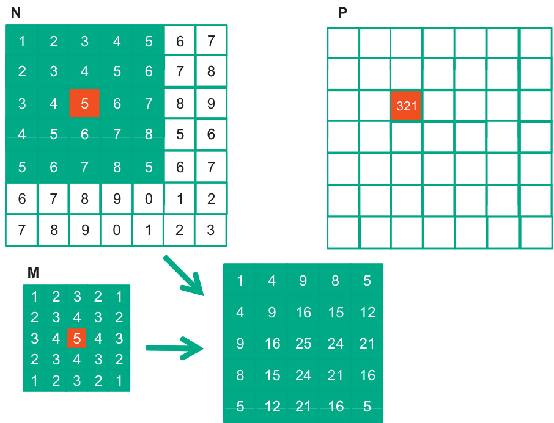
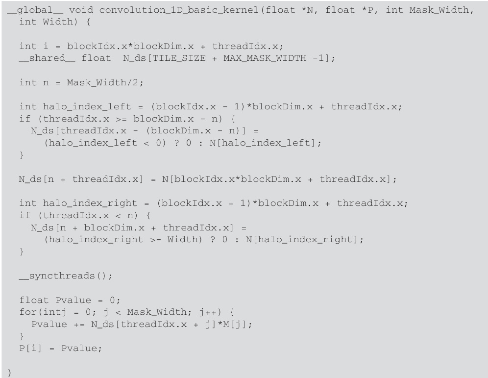
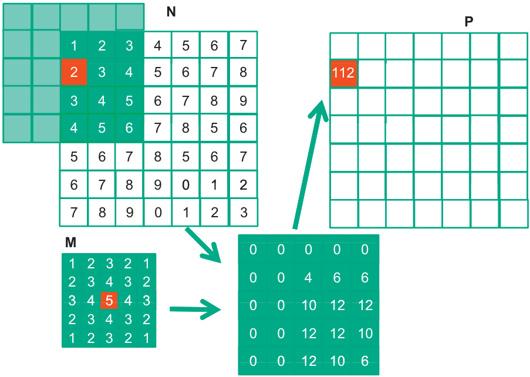

The image illustrates data access patterns in a CUDA program, showcasing how a 5x5 stencil filter operation transforms an input matrix (N) using a kernel (M) to produce an output matrix (P), a central topic in Chapter 6 regarding performance considerations. This figure is likely used to explain concepts such as memory access patterns, data locality, and optimization techniques relevant to kernel design and data processing, as discussed in sections related to memory bandwidth and instruction mix, aiming to maximize efficiency in CUDA programming. The image highlights the transformation process where the kernel M, centered around the value '5', is applied to a neighborhood in input matrix N, resulting in the calculated value '321' at a corresponding position in output matrix P.

This image illustrates a parallel sum reduction algorithm, likely referenced in Section 6.1 of the document concerning Warps and Thread Execution or Section 6.2 on Global Memory Bandwidth, discussing performance considerations in CUDA programming. It depicts arrays N, M, and P, where elements from N and M are combined in an intermediate step resulting in a new set of values that are summed into elements of P, demonstrating data reduction and parallel processing techniques. The highlighted elements represent actively processed or updated values during a reduction step.

A imagem mostra o código de um kernel CUDA para realizar uma convolução 1D. O kernel `convolution_1D_ba_sic_kernel` é definido com parâmetros como `N` (entrada), `P` (saída), `Mask_Width` (largura da máscara) e `Width` (largura da imagem). O código calcula um índice global `i`, inicializa um valor `Pvalue` e um ponto de partida `N_start_point`, e itera sobre a máscara de convolução, aplicando-a aos dados de entrada `N` e `M` para calcular o valor de saída `Pvalue`, que é então atribuído ao elemento de saída `P[i]`. Este kernel, como discutido no Capítulo 6 do documento anexado, é otimizado para garantir coalescência de memória e minimizar a divergência de warp, elementos cruciais para alto desempenho em CUDA.

The image presents a CUDA kernel for 1D convolution, demonstrating memory access patterns and thread synchronization techniques crucial for optimizing GPU performance, as discussed in Chapter 6 of the document, particularly sections related to thread execution and global memory bandwidth. The kernel, named `convolution_1D_basic_kernel`, takes floating-point arrays `N` and `P`, a `Mask_Width`, and a `Width` as inputs, utilizing shared memory (`N_ds`) to perform the convolution, and includes halo handling for boundary conditions, illustrating shared memory usage and thread synchronization for parallel computation (pages 132-133). The code initializes thread indices, computes halo indices to handle boundary conditions, and synchronizes threads before computing the convolution, highlighting aspects of optimizing global memory access and minimizing thread divergence within warps (page 127).

The diagram illustrates a simplified memory hierarchy within a computer system, as potentially relevant to the discussion of CUDA kernel performance in Chapter 6. It shows a conceptual breakdown of memory components, including the main memory, L2 cache, L1 cache, registers, and processor, arranged to indicate their proximity and interconnection within the system. Understanding this hierarchy is crucial for optimizing CUDA applications by managing data access patterns and minimizing memory access latency.

The image illustrates a parallel reduction operation using multiple arrays (N, P, and M). Initially, array N is populated with values 0 to 7, and array P has the value 38 at index P[1]. Array M, containing values [3, 4, 5, 4, 3], is used in conjunction with arrays N and P to perform a reduction. The final reduced result is stored in a separate array, where elements are combined based on the depicted operation, resulting in values such as 0, 4, 10, 12, and 12.

The image depicts a conceptual diagram illustrating how a one-dimensional array 'N' is divided into tiles within a CUDA programming context, as described in Chapter 6 of the document. The diagram shows 'N' partitioned into tiles 0, 1, 2, and 3, with each tile containing a subset of array elements, demonstrating data locality and access patterns that influence memory coalescing, crucial for optimizing CUDA kernel performance.

The image illustrates a convolution operation in image processing, where the kernel 'M' (a 5x5 matrix) is applied to an input image 'N' to produce an output image 'P'. The central element of the kernel (highlighted in orange) is multiplied with the corresponding neighborhood in the input image, and the results are summed to produce a single pixel value in the output image. The calculation results in the value '112', which then becomes the value of the top-left pixel of the output image 'P'.

The image depicts a data loading scheme used in GPU computing, specifically for matrix operations, relevant to section 6.2 about global memory bandwidth on page 134. It shows an array 'N' with padded zeros and elements N[0] to N[6], and an array 'P' representing threads P[0] to P[6], demonstrating how each thread loads consecutive memory locations. This coalesced access pattern is crucial for maximizing memory bandwidth and performance in CUDA kernels, as it allows the hardware to combine multiple memory accesses into a single, efficient transaction.

The image illustrates the hierarchical structure of a CUDA grid, comprising blocks and threads, and their interaction with different memory spaces. It shows a grid containing two blocks, Block (0, 0) and Block (1, 0), each containing threads (0, 0), (0, 1), (1, 0) and (1, 1). These threads have access to registers and shared memory/L1 cache within their blocks. Blocks communicate with Global Memory and Constant Memory, and the host system interacts with both of these memory spaces, representing data transfer and kernel execution control. This structure is fundamental to understanding CUDA's parallel processing model as discussed in Chapter 6, particularly sections related to thread execution and memory bandwidth.

The image depicts a diagram illustrating a data reduction or transformation process, possibly within the context of CUDA programming as discussed in Chapter 6 of the document. It shows arrays labeled N, M, and P, with arrows indicating how data elements from N and M are combined or processed to produce values in P. Specifically, elements N[3], N[4] and M[2] are processed to create P[2], which suggests a reduction operation consolidating data into a single location.
