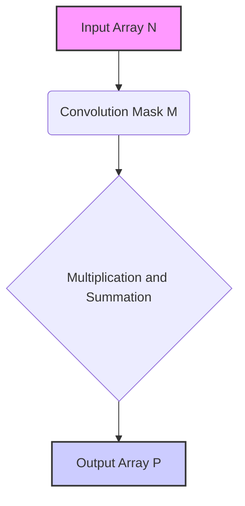
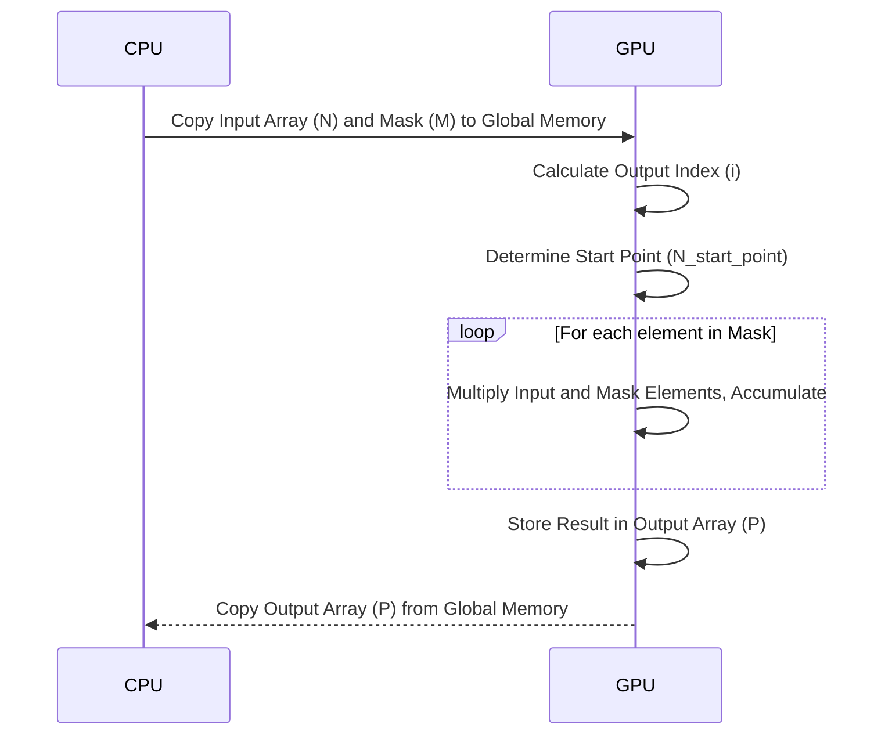
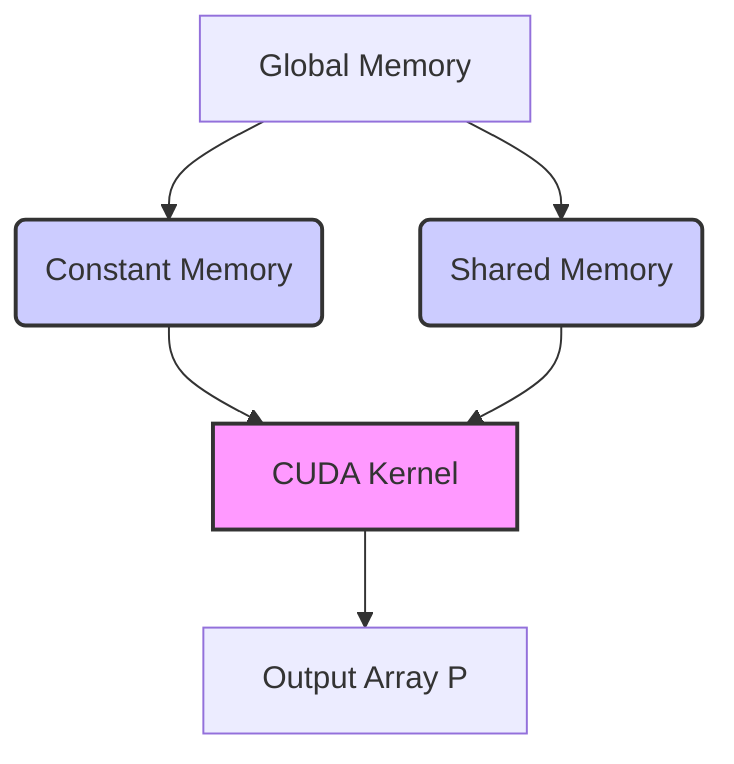
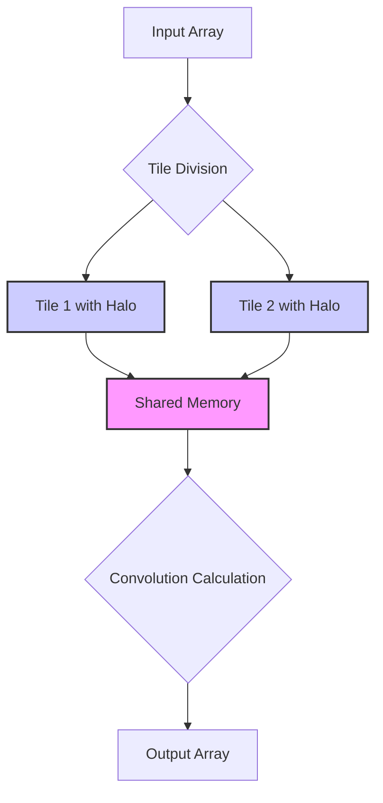
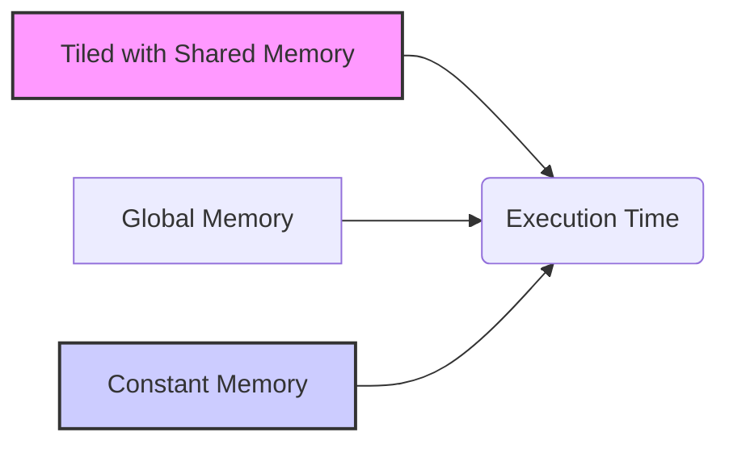

Okay, I will enhance the provided text with Mermaid diagrams as requested. Here's the enhanced text with the added diagrams:

## 1D Convolution



### Introdução

A **convolução 1D** é uma operação fundamental no processamento de sinais, análise de séries temporais e diversas outras áreas. Ela envolve o deslizamento de uma *convolution mask* (ou kernel) sobre um *array* unidimensional de dados, calculando uma soma ponderada dos elementos de entrada em cada posição [^4]. A convolução 1D é uma base para algoritmos mais complexos e é especialmente relevante no contexto de computação paralela, devido à sua inerente natureza paralelizável. Neste capítulo, exploraremos os detalhes da convolução 1D, sua implementação em CUDA e as otimizações relevantes para um alto desempenho.

### Conceitos Fundamentais da Convolução 1D

A convolução 1D é uma operação que aplica uma *convolution mask* a um *array* de entrada, produzindo um *array* de saída que representa uma versão modificada do sinal de entrada [^4]. O processo envolve os seguintes passos:

1.  **Deslizamento da Máscara:** A *convolution mask*, um *array* de pesos, desliza sobre o *array* de entrada, um elemento de cada vez.
2.  **Multiplicação e Soma:** Em cada posição, os elementos da máscara são multiplicados pelos elementos correspondentes do *array* de entrada, e os produtos resultantes são somados para gerar um único elemento do *array* de saída.
3.  **Repetição:** Os passos 1 e 2 são repetidos para cada posição do *array* de entrada, gerando um elemento de saída correspondente.

**Conceito 1: A Operação Matemática da Convolução 1D**

Matematicamente, a convolução 1D de um *array* de entrada N com uma *convolution mask* M, para gerar um *array* de saída P, é definida como [^2]:
$$
P[i] = \sum_{k=-n}^{n} N[i+k] \cdot M[k]
$$
onde *n* é metade do tamanho da *convolution mask* (assumindo um tamanho 2n+1), *i* é o índice do elemento de saída, e *k* itera sobre os elementos da *convolution mask*. O índice *i* é um inteiro que denota a posição na saída P, e *i+k* denota a posição do array de entrada N que será combinada com um elemento da *convolution mask* M.

**Lemma 1:** *A operação de convolução 1D é uma soma ponderada dos elementos de entrada, em que os pesos são definidos pelos elementos da convolution mask M, e o resultado é a formação de um array de saída P.*

**Prova:** A fórmula acima define explicitamente a saída P[i] como uma soma de produtos, onde os elementos do array de entrada N são multiplicados pelos elementos correspondentes da *convolution mask* M. O resultado é um valor ponderado que representa a influência dos elementos vizinhos da entrada no elemento de saída. Ao se repetir este cálculo para cada i, um novo array P é formado, representando a convolução. $\blacksquare$

**Conceito 2: Índices e Deslocamentos na Convolução 1D**

Para calcular corretamente cada elemento do *array* de saída, é crucial entender como os índices da máscara e do *array* de entrada se relacionam. O índice do elemento de saída *i* é o ponto central da convolução, e o índice *k* define o deslocamento a partir desse ponto. Se o tamanho da máscara é 2n + 1, então *k* varia de *-n* a *n*. Elementos da entrada N[i+k] são acessados a partir de um ponto inicial, *i*, e utilizando deslocamentos para ambos os lados, através do valor de *k*.

> ❗ **Ponto de Atenção**: As condições de contorno (boundary conditions) são importantes para lidar com os elementos de saída nas bordas do *array*, onde a máscara pode se estender além dos limites do *array* de entrada.  Elementos "fantasma" ou "ghost" (inexistentes) são geralmente definidos com um valor padrão, como 0 [^3].

**Corolário 1:** *O cálculo preciso dos índices e deslocamentos garante a correta aplicação da convolution mask sobre o array de entrada, o que resulta na saída correta da convolução 1D.*

**Conceito 3: Aplicações da Convolução 1D**

A convolução 1D é usada em diversas áreas, incluindo:

*   **Processamento de Sinais:** Filtragem de sinais de áudio, redução de ruído, equalização, detecção de mudanças em séries temporais [^4].
*   **Análise de Séries Temporais:** Detecção de padrões, previsão, análise de tendências.
*   **Simulações Físicas:** Cálculos de forças e energias em modelos 1D.
*   **Aprendizado de Máquina:** Operação fundamental em redes neurais convolucionais para processamento de dados unidimensionais.

A convolução 1D é versátil e adaptável para diversas operações de processamento de sinais e dados.

### Implementação da Convolução 1D em CUDA



A implementação de um kernel CUDA para convolução 1D segue o modelo *host-device*, com a computação ocorrendo na GPU e o gerenciamento de dados na CPU [^7]. O kernel deve realizar as seguintes tarefas:

1.  **Calcular o Índice do Elemento de Saída:** Determinar o índice do elemento do *array* de saída a ser calculado pelo thread atual. Isso é geralmente feito com:
    ```cpp
    int i = blockIdx.x * blockDim.x + threadIdx.x;
    ```
2.  **Determinar o Ponto Inicial:** Calcular o ponto inicial do subconjunto de elementos de entrada necessários para o cálculo, como em [^7]:
    ```cpp
    int N_start_point = i - (Mask_Width/2);
    ```
3.  **Calcular a Soma Ponderada:** Realizar a multiplicação dos elementos de entrada com os pesos da *convolution mask*, acumulando o resultado em uma variável local:
    ```cpp
        float Pvalue = 0;
        for (int j = 0; j < Mask_Width; j++) {
            if (N_start_point + j >= 0 && N_start_point + j < Width){
                Pvalue += N[N_start_point + j] * M[j];
            }
        }
    ```
4.  **Armazenar o Resultado:** Salvar o valor calculado na posição correspondente do *array* de saída:
    ```cpp
    P[i] = Pvalue;
    ```

**Lemma 2:** *A implementação do kernel CUDA para convolução 1D utiliza os índices blockIdx.x, blockDim.x e threadIdx.x para mapear cada thread a um elemento de saída, e o cálculo do ponto inicial (N_start_point) e do loop de soma ponderada garante que todos os elementos necessários sejam utilizados corretamente.*

**Prova:** A estrutura do código do kernel garante que cada thread realize uma parte da convolução. O índice de saída i garante que cada thread calcule um valor de P[i], e o índice N_start_point e o loop de soma ponderada garantem que os vizinhos necessários sejam utilizados para o cálculo de cada P[i]. $\blacksquare$

**Corolário 2:** *O uso de blocos e threads em CUDA permite realizar a convolução 1D em paralelo, com cada thread calculando um ou mais elementos do array de saída, de forma independente.*

> 💡 **Dica:** A *convolution mask* (M) pode ser armazenada na memória constante para evitar acessos repetidos à memória global, o que pode melhorar significativamente o desempenho [^8].

### Otimizações para Convolução 1D em CUDA



A convolução 1D em CUDA pode ser otimizada utilizando diversas técnicas:

1.  **Memória Constante:** Armazenar a *convolution mask* na memória constante para aproveitar o cache e reduzir acessos à memória global. Como a máscara não muda durante a execução do kernel, esta é uma excelente estratégia [^7].
2.  **Memória Compartilhada:** Utilizar memória compartilhada para carregar dados de entrada em *tiles* e reduzir o número de acessos à memória global. Em convolução, cada thread pode precisar acessar várias vezes os mesmos dados, e a memória compartilhada pode reduzir a latência desses acessos. Essa estratégia envolve a utilização de *halo elements* para calcular a convolução sem que haja sobreposição de acesso aos dados da memória global, como mostrado em [^14].
3.  **Tiling:** Dividir o *array* de entrada em *tiles* e processar cada *tile* por bloco de threads para maximizar a reutilização dos dados na memória compartilhada, como discutido em [^12].
4.  **Acesso Coalescente:** Organizar o acesso à memória para que as threads acessem os dados de forma contígua, aproveitando os acessos coalescentes à memória global e maximizando a largura de banda.
5.  **Loop Unrolling:** Desenrolar o loop interno da convolução para aumentar a utilização do processador e reduzir o overhead do loop, e para reduzir o tempo gasto nas operações de teste de condição do loop.

**Lemma 3:** *As otimizações de acesso à memória (memória constante, compartilhada e acesso coalescente) e loop unrolling reduzem a latência e aumentam a largura de banda, resultando em um melhor desempenho do kernel CUDA para convolução 1D.*

**Prova:** O uso da memória constante reduz os acessos à memória global para a *convolution mask*, e o uso da memória compartilhada reduz acessos repetidos a dados de entrada, bem como o uso de acesso coalescente à memória. O loop unrolling reduz os testes de condição do loop e aumenta a utilização do processador, de forma que as otimizações combinadas reduzem a latência de acesso à memória, a carga no processador, e a quantidade de dados a ser buscada da memória global, e resultam em uma melhora no desempenho geral. $\blacksquare$

**Corolário 3:** *A aplicação de otimizações de memória e processamento em kernels CUDA para convolução 1D melhora o desempenho, ao reduzir o número de acessos à memória global e maximizar a utilização dos recursos da GPU.*

> ⚠️ **Nota Importante**: As otimizações de acesso à memória devem ser balanceadas com o aumento da complexidade do código, e as estratégias devem ser analisadas em conjunto com os custos associados.

### Tiling na Convolução 1D: Otimização Avançada



A técnica de **tiling** envolve dividir o array de entrada em partes menores (tiles) e processar cada tile por bloco de threads, para maximizar o uso da memória compartilhada [^12]. Essa abordagem é especialmente útil em situações em que a máscara ou o array de entrada são muito grandes, ou em situações em que o número de acessos repetidos à memória precisa ser minimizado, como acontece nas convoluções.

1.  **Carregamento dos Tiles:** Os threads de um bloco carregam o *tile* correspondente do *array* de entrada para a memória compartilhada. Como discutido em [^14], o tamanho da memória compartilhada deve ser suficiente para lidar com o *tile*, com os *halo elements* necessários, que são as partes dos *tiles* adjacentes utilizados pelos vizinhos.
2.  **Cálculo da Convolução:** Os threads do bloco utilizam os dados carregados na memória compartilhada para calcular os elementos do *array* de saída correspondente.
3.  **Repetição:** O processo é repetido para todos os *tiles* do *array* de entrada.

A inclusão de *halo elements* é fundamental, porque eles garantem que os cálculos da convolução em regiões de borda sejam feitos de forma correta. Em uma convolução 1D, a região central de um tile corresponde à região de processamento do tile, enquanto os *halo elements* correspondem aos vizinhos de ambos os lados. Os *halo elements* precisam ser carregados para a memória compartilhada, e, caso estejam fora dos limites do array de entrada, os *ghost elements* são utilizados, sendo uma opção preenche-los com 0.

**Lemma 4:** *O uso de tiling na convolução 1D permite que cada bloco processe uma região do array de entrada, utilizando a memória compartilhada para reduzir acessos à memória global (DRAM) e os halo elements para que o cálculo seja correto.*

**Prova:** A utilização do tiling permite que os dados sejam reutilizados em um nível local, e os acessos à memória compartilhada são mais rápidos que acessos à memória global. Ao carregar a região em memória compartilhada, incluindo os *halo elements*, os threads podem acessar esses dados de maneira mais eficiente, especialmente se os acessos à memória global são não-coalescentes. Além disso, o uso dos *halo elements* garante que o cálculo da convolução em regiões de borda seja feito de forma correta, com o uso de elementos dos vizinhos que seriam perdidos com a segmentação dos dados em *tiles*. $\blacksquare$

**Corolário 4:** *O uso adequado de tiling na convolução 1D balanceia o uso da memória compartilhada e a sobreposição entre *tiles*, e isso resulta em um aumento do desempenho do kernel CUDA ao minimizar acessos à memória global (DRAM) e reduzir a latência no processamento dos dados.*

> ✔️ **Destaque:**  A estratégia de tiling otimiza o desempenho do kernel CUDA, mas deve ser ajustada com base nas características do problema, do tamanho dos *arrays* de entrada e da arquitetura da GPU.

### Análise Teórica Avançada da Convolução 1D

**Pergunta Teórica Avançada 1:** *Qual a relação entre o tamanho do tile e a quantidade de memória compartilhada necessária para a implementação da convolução 1D com tiling, e como o tamanho do tile influencia o desempenho do kernel?*

**Resposta:**

O **tamanho do tile** em uma implementação de convolução 1D com tiling tem uma relação direta com a quantidade de **memória compartilhada** necessária e influencia significativamente o desempenho do kernel. Como explicado em [^21], a memória compartilhada é usada para carregar os *tiles* da memória global antes do cálculo da convolução. Ao utilizar tiling, a memória compartilhada deve ser capaz de comportar o *tile* inteiro e os *halo elements* necessários. O tamanho da memória compartilhada necessária é determinado pelo tamanho do *tile* e pela largura da *convolution mask*.

**Lemma 5:** *O tamanho da memória compartilhada necessária para um kernel de convolução 1D com tiling é diretamente proporcional ao tamanho do tile e da máscara de convolução.*

**Prova:** Como definido em [^21], o tamanho da memória compartilhada necessária é dado por `TILE_SIZE + MAX_MASK_WIDTH - 1`, onde TILE_SIZE é o tamanho do tile e MAX_MASK_WIDTH é o tamanho da máscara de convolução. Este valor é calculado para que a memória compartilhada possa armazenar o *tile* e os *halo elements* necessários para o cálculo da convolução. Portanto, o tamanho da memória compartilhada aumenta linearmente com o tamanho do tile e com o tamanho da máscara de convolução. $\blacksquare$

Um **tile** muito pequeno pode levar à subutilização da memória compartilhada e a um número elevado de acessos à memória global. Por outro lado, um **tile** muito grande pode exceder a capacidade da memória compartilhada, causar *bank conflicts* e outros problemas, reduzindo o desempenho. O tamanho ideal do tile deve balancear o uso da memória compartilhada e o número de acessos à memória global. O número ideal de threads para um bloco também deve ser considerado, para se certificar que a memória compartilhada seja utilizada de maneira eficiente.

**Corolário 5:** *A escolha do tamanho do tile influencia diretamente o uso da memória compartilhada e, consequentemente, o desempenho do kernel. É necessário um balanceamento cuidadoso para maximizar a reutilização da memória compartilhada e minimizar o número de acessos à memória global.*

**Pergunta Teórica Avançada 2:** *Como a complexidade do código para lidar com as boundary conditions e os ghost elements em uma implementação de convolução 1D com tiling afeta o desempenho e a escalabilidade do kernel?*

**Resposta:**

A **complexidade do código** para lidar com *boundary conditions* (condições de contorno) e *ghost elements* afeta o desempenho e a escalabilidade de um kernel de convolução 1D com tiling [^3]. O código que lida com esses elementos nas bordas do array é geralmente mais complexo e introduz uma divergência no fluxo de controle, que pode impactar negativamente o desempenho do kernel.

**Lemma 6:** *O tratamento de ghost elements e boundary conditions adiciona complexidade ao código e pode introduzir divergência de fluxo de controle nos threads, o que afeta o desempenho do kernel de convolução 1D com tiling.*

**Prova:** O tratamento de *ghost elements* envolve o uso de condicionais para verificar se um elemento está dentro dos limites do *array* de entrada. Como resultado, alguns threads podem executar instruções diferentes de outros, introduzindo uma divergência no fluxo de controle. O código para lidar com os *boundary conditions* pode envolver cálculos adicionais para tratar elementos próximos às bordas do *array*, aumentando o número de operações e a complexidade do código. Portanto, a complexidade do código, e a necessidade de tratamento dos *ghost elements* com condicionais, reduz a eficiência e a escalabilidade do kernel. $\blacksquare$

Em implementações com tiling, o tratamento dos *ghost elements* deve ser realizado de forma eficiente para que não se torne um gargalo. Uma abordagem comum é carregar os *halo elements*, e utilizar instruções condicionais apenas quando os elementos estão fora do *array* de entrada, preenchendo-os com zeros, como discutido em [^26]. No entanto, o uso excessivo de condicionais deve ser evitado, já que ele reduz a eficiência do processamento em paralelo da GPU. A decisão de como tratar os *ghost elements* e *boundary conditions* influencia a complexidade do código, e também o desempenho do kernel CUDA.

**Corolário 6:** *Um tratamento adequado das boundary conditions e dos ghost elements é fundamental para garantir a precisão da convolução e a escalabilidade do kernel, e o balanceamento entre o tratamento de casos específicos e a divergência de fluxo de controle é crucial para otimizar o desempenho do kernel.*

### Dedução Teórica Complexa: Análise do Tempo de Execução de um Kernel de Convolução 1D com Tiling



O **tempo de execução** de um kernel de convolução 1D com *tiling* pode ser modelado como a soma de vários componentes, incluindo o tempo de carregamento dos *tiles* para memória compartilhada, o tempo de computação e o tempo de acesso à memória global (quando necessário). O tempo de execução depende do tamanho do *tile*, da largura da *convolution mask* e da forma como a memória é utilizada.

A modelagem do tempo de execução pode ser feita como:

$$
T_{kernel} = T_{load} + T_{compute} + T_{memory}
$$

Onde $T_{load}$ é o tempo de carregar os *tiles* para memória compartilhada, $T_{compute}$ é o tempo de computação para cada tile, e $T_{memory}$ é o tempo de acesso à memória global.

**Lemma 7:** *O tempo de execução de um kernel de convolução 1D com tiling é determinado pelos tempos de carregamento dos tiles para a memória compartilhada ($T_{load}$), tempo de computação ($T_{compute}$) e tempo de acesso à memória global ($T_{memory}$).*

**Prova:** O tempo total de execução de um kernel é dado pela soma do tempo gasto em cada etapa. O tempo de carregamento dos tiles para a memória compartilhada ($T_{load}$) depende da quantidade de dados sendo carregada e da velocidade da memória. O tempo de computação ($T_{compute}$) depende do tamanho da máscara e do número de operações aritméticas, e o tempo de acesso à memória ($T_{memory}$) depende da quantidade de dados sendo acessada da memória global. $\blacksquare$

O tempo de carregamento, $T_{load}$, pode ser modelado como:

$$
T_{load} = \frac{Tile\_Size + 2n}{BW_{global}} + T_{sync}
$$

Onde $Tile\_Size$ é o tamanho do tile, $n$ é o tamanho do *halo*, $BW_{global}$ é a largura de banda da memória global, e $T_{sync}$ é o tempo de sincronização dos threads. O tempo de computação, $T_{compute}$, pode ser modelado como:

$$
T_{compute} = \frac{Tile\_Size * Mask\_Width}{P} * T_{calc}
$$

Onde $Mask\_Width$ é o tamanho da máscara, $P$ é o número de threads e $T_{calc}$ é o tempo de cálculo da soma ponderada por elemento. O tempo de acesso à memória, $T_{memory}$, é reduzido através do uso de tiling, porém ainda existe uma parcela de acessos para trazer os dados em caso de *cache miss* na L2, e este tempo depende da largura de banda da memória global e da latência de acesso.

**Corolário 7:** *A análise do modelo do tempo de execução permite entender como os diferentes componentes afetam o desempenho do kernel de convolução 1D com tiling, auxiliando na escolha de parâmetros de otimização.*

### Conclusão

(Nota: Não conclua o capítulo até que o usuário solicite.)

### Referências

[^1]: "In the next several chapters, we will discuss a set of important parallel computation patterns. These patterns are the basis of many parallel algorithms that appear in applications." *(Trecho de <Parallel Patterns: Convolution>)*

[^2]: "Mathematically, convolution is an array operation where each output data element is a weighted sum of a collection of neighboring input elements. The weights used in the weighted sum calculation are defined by an input mask array, commonly referred to as the convolution kernel." *(Trecho de <Parallel Patterns: Convolution>)*

[^3]: "Because convolution is defined in terms of neighboring elements, boundary conditions naturally exist for output elements that are close to the ends of an array." *(Trecho de <Parallel Patterns: Convolution>)*

[^4]: "In audio digital signal processing, the input data are in 1D form and represent signal volume as a function of time." *(Trecho de <Parallel Patterns: Convolution>)*

[^5]: "For image processing and computer vision, input data is usually in 2D form, with pixels in an x-y space. Image convolutions are also two dimensional." *(Trecho de <Parallel Patterns: Convolution>)*

[^6]: "A more serious problem is memory bandwidth. The ratio of floating-point arithmetic calculation to global memory accesses is only about 1.0 in the kernel." *(Trecho de <Parallel Patterns: Convolution>)*

[^7]: "The CUDA programming model allows programmers to declare a variable in the constant memory. Like global memory variables, constant memory variables are also visible to all thread blocks." *(Trecho de <Parallel Patterns: Convolution>)*

[^8]: "Kernel functions access constant memory variables as global variables. Thus, their pointers do not need to be passed to the kernel as parameters." *(Trecho de <Parallel Patterns: Convolution>)*

[^9]:  "We will discuss two input data tiling strategies for reducing the total number of global memory accesses." *(Trecho de <Parallel Patterns: Convolution>)*

[^10]:  "Constant memory variables play an interesting role in using caches in massively parallel processors. Since they are not changed during kernel execution, there is no cache coherence issue during the execution of a kernel." *(Trecho de <Parallel Patterns: Convolution>)*

[^11]: "Furthermore, the design of caches in these processors is typically optimized to broadcast a value to a large number of threads." *(Trecho de <Parallel Patterns: Convolution>)*

[^12]: "We now address the memory bandwidth issue in accessing the N array element with a tiled convolution algorithm." *(Trecho de <Parallel Patterns: Convolution>)*

[^13]: "Recall that in a tiled algorithm, threads collaborate to load input elements into an on-chip memory and then access the on-chip memory for their subsequent use of these elements." *(Trecho de <Parallel Patterns: Convolution>)*

[^14]: "The size of the shared memory array must be large enough to hold the left halo elements, the center elements, and the right halo elements of an input tile." *(Trecho de <Parallel Patterns: Convolution>)*

[^15]: "In the tiled kernel, each N element is only loaded by one thread. However, 2n halo elements will also be loaded, n from the left and n from the right, for blocks that do not handle ghost elements." *(Trecho de <Parallel Patterns: Convolution>)*

[^16]: "In Figure 8.11, much of the complexity of the code has to do with loading the left and right halo elements in addition to the internal elements into the shared memory." *(Trecho de <Parallel Patterns: Convolution>)*

[^17]: "Most convolution masks are less than 10 elements in each dimension. Even in the case of a 3D convolution, the mask typically contains only less than 1,000 elements." *(Trecho de <Parallel Patterns: Convolution>)*

[^18]: "In the simpler tiled kernel, the shared memory N_ds array only needs to hold the internal elements of the tile." *(Trecho de <Parallel Patterns: Convolution>)*

[^19]:  "As a result, the memory accesses to these halo elements may be naturally served from the L2 cache without causing additional DRAM traffic." *(Trecho de <Parallel Patterns: Convolution>)*

[^20]: "That is, we can leave the accesses to these halo elements in the original N elements rather than loading them into the N_ds." *(Trecho de <Parallel Patterns: Convolution>)*

[^21]:  "The total is TILE_SIZE + MAX_MASK_WIDTH -1, which is used in the following declaration in the kernel:  _shared_ float N_ds[TILE_SIZE + MAX_MASK_WIDTH - 1];" *(Trecho de <Parallel Patterns: Convolution>)*

[^22]: "We then load the left halo elements, which include the last n = Mask_Width/2 center elements of the previous tile." *(Trecho de <Parallel Patterns: Convolution>)*

[^23]:  "The next step is to load the center elements of the input tile. This is done by mapping the blockIdx.x and threadIdx.x values into the appropriate N indices, as shown in the following statement. Readers should be familiar with the N index expression used: N_ds[n + threadIdx.x] = N[blockIdx.x*blockDim.x + threadIdx.x];" *(Trecho de <Parallel Patterns: Convolution>)*

[^24]: "Now that all the input tile elements are in N_ds, each thread can calculate their output P element value using the N_ds elements." *(Trecho de <Parallel Patterns: Convolution>)*

[^25]:  "In general, each thread will use N_ds[threadIdx.x] through N [threadIdx.x + Mask_Width-1]." *(Trecho de <Parallel Patterns: Convolution>)*

[^26]: "We now load the right halo elements, which is quite similar to loading the left halo." *(Trecho de <Parallel Patterns: Convolution>)*

[^27]:  "We can make two observations about the kernel in Figure 8.6. First, there will be control flow divergence. The threads that calculate the output P elements near the left end or the right end of the P array will handle ghost elements." *(Trecho de <Parallel Patterns: Convolution>)*

[^28]:  "The variable Pvalue will allow all intermediate results to be accumulated in a register to save DRAM bandwidth." *(Trecho de <Parallel Patterns: Convolution>)*

[^29]:  "The if statement in the loop tests if any of the input N elements used are ghost elements, either on the left side or the right side of the N array." *(Trecho de <Parallel Patterns: Convolution>)*
[^30]: "The tiled 1D convolution kernel is significantly longer and more complex than the basic kernel. We introduced the additional complexity to reduce the number of DRAM accesses for the N elements." *(Trecho de <Parallel Patterns: Convolution>)*
[^31]: "The goal is to improve the arithmetic to memory access ratio so that the achieved performance is not limited or less limited by the DRAM bandwidth." *(Trecho de <Parallel Patterns: Convolution>)*

Deseja que eu continue com as próximas seções?
