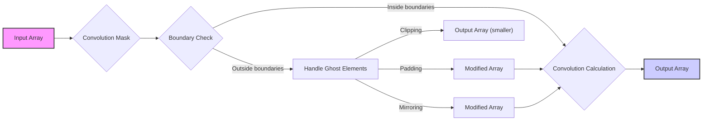
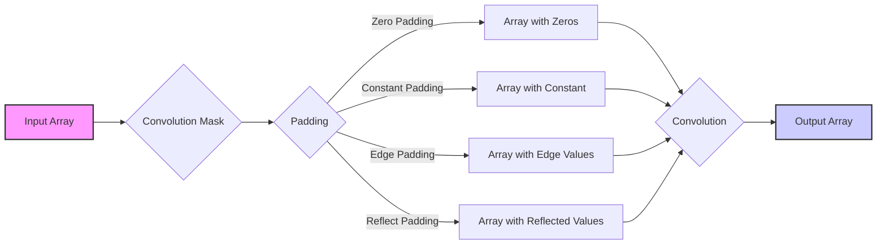
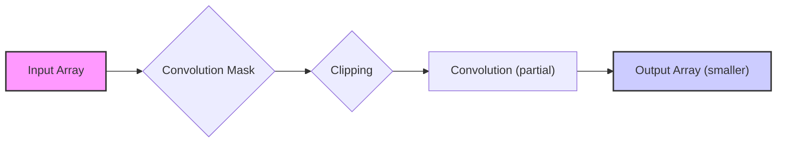
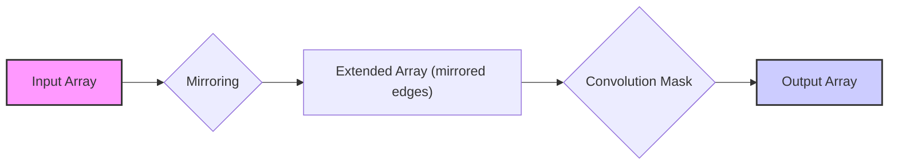
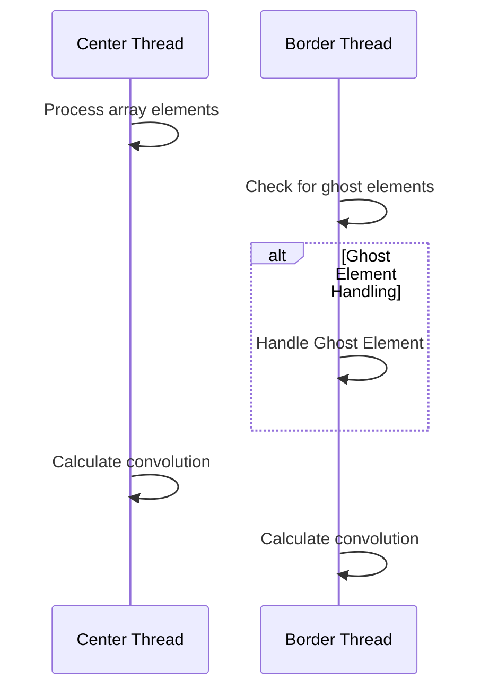
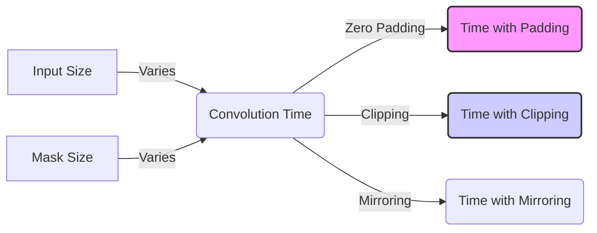

Okay, I understand. Here's the enhanced text with Mermaid diagrams:

## Boundary Conditions in Convolution

### Introdução

As **boundary conditions** (condições de contorno) são um aspecto crucial na operação de convolução, especialmente quando aplicada a *arrays* de tamanho finito. Elas referem-se à forma como os elementos nas bordas de um *array* são tratados durante o processo de convolução, já que a aplicação da *convolution mask* pode necessitar de elementos que estão além dos limites do *array*. Ignorar ou lidar inadequadamente com as *boundary conditions* pode levar a resultados incorretos, especialmente em processamento de sinais e imagens. Neste capítulo, exploraremos em detalhe as *boundary conditions* na convolução, as abordagens comuns para lidar com elas, e seus impactos no resultado final.

### Conceitos Fundamentais das Boundary Conditions

As *boundary conditions* surgem porque a operação de convolução envolve a combinação de elementos vizinhos de um *array* de entrada, usando uma *convolution mask*. Quando a máscara é aplicada em elementos próximos às bordas, parte dela pode se estender para além dos limites do *array* de entrada. A forma como esses elementos "fora dos limites" são tratados define as *boundary conditions*. Esses elementos são frequentemente referidos como **ghost elements** [^3].

**Conceito 1: A Natureza do Problema das Boundary Conditions**

O problema das *boundary conditions* surge devido à definição da convolução:
$$
P[i] = \sum_{k=-n}^{n} N[i+k] \cdot M[k]
$$
Quando o índice *i* está próximo das bordas do *array* de entrada N, o índice *i + k* pode ser menor que 0 ou maior que o tamanho do *array* N. Para calcular o valor de P[i] corretamente, é necessário fornecer um valor para os elementos de N que estão fora dos limites [^3]. As *boundary conditions* definem o valor desses elementos "fora dos limites".

**Lemma 1:** *As boundary conditions são uma consequência direta da necessidade de acesso a elementos de entrada fora dos limites do array ao aplicar a convolution mask, nas bordas, e isso precisa de um tratamento especial.*

**Prova:** A fórmula da convolução requer acesso a elementos N[i+k]. Quando i está próximo das bordas do array, a operação i+k pode levar a acessar índices que são menores do que zero ou maiores do que o tamanho do array N.  Esses acessos geram o problema das boundary conditions. Portanto, o problema das boundary conditions surge da própria natureza da convolução e da necessidade de tratar esses casos. $\blacksquare$

**Conceito 2: Ghost Elements e sua Representação**

Os **ghost elements** são os elementos do *array* de entrada que estão fora dos limites, mas que seriam necessários para o cálculo da convolução nas bordas. Em outras palavras, o índice de um elemento "ghost" seria um valor menor que 0 ou maior que o tamanho do array N.  Esses elementos não existem no array original, mas são necessários para que a operação de convolução seja aplicada em todo o array de entrada, sem que haja perda de dados em nenhuma parte.

> ❗ **Ponto de Atenção**: A forma como os *ghost elements* são representados (com 0 ou outro valor) tem um impacto significativo no resultado da convolução nas bordas.

**Corolário 1:** *A representação e o tratamento dos ghost elements são componentes importantes das boundary conditions e garantem a aplicação correta da operação de convolução em todas as posições de um array de tamanho finito.*

**Conceito 3: O Impacto das Boundary Conditions no Resultado da Convolução**

As *boundary conditions* afetam o resultado da convolução, especialmente nas bordas do *array*. A escolha de como tratar os *ghost elements* determina o comportamento do filtro de convolução nas extremidades do *array*. Uma má escolha das *boundary conditions* pode gerar resultados indesejados nas bordas, como artefatos, perda de informações, ou suavização excessiva das bordas.

### Abordagens Comuns para Lidar com Boundary Conditions

Existem várias abordagens comuns para lidar com as *boundary conditions* em convolução:

1.  **Padding (Preenchimento):** Adiciona elementos fictícios às bordas do *array* de entrada, permitindo que a convolução seja aplicada sem a necessidade de acessar elementos fora dos limites do array original [^3]. O preenchimento mais comum é com zeros, mas outros valores podem ser usados, dependendo da aplicação.

    *   **Zero Padding:** Preenche as bordas com 0, que é útil para minimizar o efeito dos *ghost elements* em imagens e sinais.
    *   **Constant Padding:** Preenche as bordas com um valor constante diferente de zero. Útil para certos tipos de filtragem ou para imitar condições específicas do problema.
    *   **Edge Padding:** Preenche as bordas com os valores dos elementos das bordas, o que pode preservar o conteúdo das bordas.
    *   **Reflect Padding:** Reflete os valores dos elementos da borda, o que é útil para evitar artefatos de borda.

2.  **Clipping (Corte):** Ignora os elementos de saída para os quais a máscara se estende além dos limites do array. Isso resulta em um array de saída menor que o array de entrada. A operação de clipping é usada quando a preocupação não é preservar os dados nas bordas, mas sim evitar os problemas da utilização dos ghost elements.

3.  **Espelhamento da Borda:** Reflete os elementos do *array* de entrada nas bordas, para que a *convolution mask* tenha acesso a dados dentro dos limites do *array*, criando assim uma simulação de continuidade nas bordas.

**Lemma 2:** *As abordagens de padding, clipping e espelhamento são formas de lidar com os ghost elements e garantir que a operação de convolução possa ser realizada mesmo quando os limites de um array de tamanho finito são alcançados.*

**Prova:** Cada uma das abordagens modifica o array de entrada nas bordas de uma forma diferente. O padding cria novos elementos nas bordas, o clipping simplesmente ignora as saídas, e o espelhamento cria um espelho das bordas para fora do array. A escolha da abordagem depende da aplicação específica, e de qual modificação no array de entrada vai levar à melhor resposta da convolução nas bordas. $\blacksquare$

**Corolário 2:** *A escolha da abordagem para lidar com as boundary conditions afeta o tamanho do array de saída e a forma como os elementos nas bordas são processados e deve considerar os objetivos da aplicação e as necessidades específicas do problema.*

### Impacto do Padding na Convolução 1D

O **padding** é uma das abordagens mais comuns para lidar com *boundary conditions* na convolução. Ao adicionar elementos fictícios nas bordas, é possível evitar a necessidade de acessar *ghost elements*, e isso permite que a operação de convolução seja realizada normalmente em todo o *array* de entrada [^3]. O tipo de padding a ser escolhido depende da aplicação específica e do efeito desejado nas bordas do array.

1.  **Zero Padding:** Adiciona zeros nas bordas do *array*. Isso é simples de implementar e útil quando se deseja minimizar a influência dos *ghost elements*. A desvantagem do zero padding é que ele reduz a magnitude da resposta da convolução nas bordas.

2.  **Constant Padding:** Adiciona um valor constante nas bordas do array. Este valor pode ser ajustado com base nas necessidades do problema, e é útil para simular condições específicas do domínio da aplicação.

3.  **Edge Padding:** Repete os elementos das bordas, o que ajuda a manter o contraste na região de borda. Útil em situações em que os elementos da borda são importantes e o conteúdo nas bordas precisa ser preservado.

4.  **Reflect Padding:** Reflete os elementos nas bordas, criando um efeito de espelho. Isso ajuda a manter o padrão do sinal nas bordas.

**Lemma 3:** *O tipo de padding utilizado na convolução 1D tem um impacto direto na resposta da convolução nas bordas do array de saída, e a escolha do padding deve considerar a aplicação específica, e se o objetivo é preservar ou minimizar a influência dos ghost elements.*

**Prova:** Cada tipo de padding modifica o sinal nas bordas de uma forma específica, e isso leva a resultados diferentes na operação de convolução. O zero padding minimiza a influencia de elementos externos na convolução, o que pode ser desejável em alguns casos. O constant padding permite aplicar uma influencia controlada sobre a resposta, o edge padding preserva o contraste, e o reflect padding preserva o padrão do sinal nas bordas, e a escolha do método de padding deve considerar qual é a resposta desejada. $\blacksquare$

> ✔️ **Destaque:** A escolha do padding afeta a forma como a convolução interage com as bordas, e deve ser feita de maneira consistente com a aplicação desejada.

**Corolário 3:** *A escolha do método de padding (zero, constant, edge ou reflect) deve considerar o comportamento desejado para as bordas do array, e sua escolha tem um impacto direto nos resultados nas bordas, o que deve ser analisado com cuidado para cada tipo de aplicação.*

### O Impacto do Clipping na Convolução 1D

A abordagem de **clipping** para *boundary conditions* na convolução 1D ignora os elementos de saída para os quais a *convolution mask* se estende para fora dos limites do *array* de entrada. Ou seja, as operações de convolução que precisam de dados fora dos limites do *array* de entrada não são realizadas, e o *array* de saída acaba sendo menor que o *array* de entrada. O *clipping* é uma abordagem simples, mas que leva a uma perda de informações nas bordas [^3].

1.  **Ignorar Elementos de Borda:** Elementos de saída nas bordas são simplesmente ignorados na saída, já que os cálculos não podem ser realizados completamente, e elementos fora dos limites seriam necessários.

2.  **Redução do Array de Saída:** Como os cálculos de convolução não são realizados nas bordas, o *array* de saída resultante é menor do que o *array* de entrada.

**Lemma 4:** *A abordagem de clipping resulta em uma redução do tamanho do array de saída, já que elementos nas bordas do array de entrada são ignorados, e sua saída na convolução não é calculada.*

**Prova:** A definição do clipping é de não calcular os elementos de saída onde a *convolution mask* se estende para fora dos limites do *array* de entrada, resultando em uma redução no número de elementos de saída em relação ao número de elementos de entrada. $\blacksquare$

**Corolário 4:** *O clipping é uma abordagem simples para lidar com as boundary conditions, mas a perda de informações nas bordas pode ser um problema em algumas aplicações, já que a convolução não é feita em toda a região do array de entrada.*

### O Impacto do Espelhamento da Borda na Convolução 1D

O **espelhamento da borda** é uma abordagem que replica os elementos de entrada nas bordas para fora do *array*, permitindo que a *convolution mask* acesse dados dentro dos limites do *array* "espelhado" [^3]. Essa técnica tem como objetivo simular a continuidade dos dados nas bordas e preservar informações de borda, e isso evita que o problema da *boundary condition* seja tratado com valores de *ghost elements*, ou com a simples omissão dos cálculos de saída.

1.  **Replicar Elementos da Borda:** Os elementos da borda são repetidos e refletidos para fora do *array*, como um espelho. Para uma borda esquerda, o índice 0 é repetido, e para uma borda direita, o último elemento do *array* é repetido. Isso cria uma extensão simétrica do *array* original.

2.  **Convolução com Elementos Espelhados:** A *convolution mask* é aplicada ao *array* com os elementos espelhados, permitindo que os cálculos sejam realizados nas bordas sem a necessidade de *ghost elements*.

**Lemma 5:** *A abordagem de espelhamento da borda cria um array de entrada estendido de maneira simétrica, o que permite uma convolução completa em todas as posições do array de entrada original, e a resposta da convolução não é afetada por elementos artificiais introduzidos por padding, ou pela omissão da convolução, como acontece em clipping.*

**Prova:** O espelhamento replica o array de entrada de forma simétrica nas bordas, permitindo que a *convolution mask* acesse dados de ambos os lados sem introduzir valores artificiais como zero (zero padding) ou elementos com valores arbitrários (constant padding). Com a simulação de continuidade do sinal nas bordas, os cálculos da convolução nas bordas são consistentes com os cálculos no centro do array, e todos os dados são aproveitados. $\blacksquare$

**Corolário 5:** *O espelhamento da borda é uma abordagem para lidar com boundary conditions que preserva as características do sinal nas bordas e evita a necessidade de introduzir elementos artificiais, ou de ignorar as saídas nas bordas, e por isso ela é usada em diversos tipos de aplicações.*

### Análise Teórica Avançada das Boundary Conditions

**Pergunta Teórica Avançada 1:** *Como a escolha de diferentes estratégias de tratamento de boundary conditions (padding, clipping, espelhamento) afeta a resposta em frequência de uma *convolution mask* em convolução 1D?*

**Resposta:**

A escolha da estratégia para lidar com *boundary conditions* afeta a resposta em frequência de uma *convolution mask*, especialmente nas bordas do *array*. A resposta em frequência de uma *convolution mask* descreve o comportamento do filtro no domínio da frequência, mostrando quais componentes de frequência são amplificados ou atenuados. O tratamento das bordas afeta a forma com que a máscara interage com a região nas bordas, e os artefatos gerados na convolução podem criar ou eliminar frequências.

**Lemma 6:** *A escolha da estratégia de tratamento das boundary conditions afeta a resposta em frequência de uma convolution mask, através da introdução ou supressão de artefatos e da alteração do sinal nas bordas do array.*

**Prova:** Cada estratégia para tratar as boundary conditions introduz alterações no array de entrada, que são refletidas no domínio da frequência. O zero-padding, por exemplo, introduz uma descontinuidade na borda que leva a oscilações no domínio da frequência, enquanto o edge padding ou o reflect padding preservam algumas das características da borda, e afetam a resposta em frequência de maneira diferente. O clipping, por sua vez, simplesmente ignora os dados, e isso leva a uma alteração no sinal de saída que pode ser interpretado como um filtro, e o espectro de frequência resultante também é afetado. $\blacksquare$

O **zero-padding** introduz componentes de frequência adicionais devido à descontinuidade causada pela adição de zeros nas bordas. Isso pode levar a artefatos e distorções no sinal de saída. O **espelhamento de borda** tende a preservar as frequências existentes no sinal original, o que é preferível em muitas aplicações, já que ele preserva a forma do sinal nas bordas. O **clipping** leva a uma perda de informações e a uma mudança no sinal de saída. Portanto, a escolha da abordagem para lidar com as boundary conditions tem um impacto significativo na resposta em frequência e deve considerar o efeito desejado e a necessidade de preservar as frequências.

**Corolário 6:** *A análise da resposta em frequência, de uma convolution mask com diferentes tratamentos de boundary conditions, pode fornecer informações úteis sobre o comportamento de filtros em frequências mais altas ou baixas, e deve ser utilizado para a escolha da estratégia mais adequada.*

**Pergunta Teórica Avançada 2:** *Como a divergência de fluxo de controle, introduzida pelo tratamento de ghost elements em kernels CUDA, afeta o desempenho da convolução 1D em comparação com abordagens sem tratamento de ghost elements como clipping?*

**Resposta:**

O tratamento de *ghost elements* em kernels CUDA, embora necessário para uma convolução precisa nas bordas, introduz **divergência de fluxo de controle**, já que os threads que processam elementos de borda executam um código diferente dos threads que processam elementos no centro do *array*. Essa divergência, como discutido em [^27], pode levar a uma perda de desempenho, e pode ser comparado com outras abordagens que não utilizam tratamento de *ghost elements*, como o *clipping*.

**Lemma 7:** *O tratamento de ghost elements em kernels CUDA, através de condicionais, causa divergência de fluxo de controle entre os threads e reduz a eficiência do processamento paralelo, e isso afeta negativamente o desempenho em relação a métodos que não utilizam os ghost elements, como o clipping.*

**Prova:** A divergência de fluxo de controle ocorre quando threads dentro de um bloco executam diferentes caminhos de código. No caso do tratamento dos *ghost elements*, os threads nas bordas precisam executar instruções condicionais para lidar com os elementos fora dos limites do array, enquanto threads no centro do array não precisam. Essa divergência reduz a eficiência do processamento em paralelo, pois as threads não podem executar o mesmo código simultaneamente. Em comparação com o clipping, onde a convolução não é realizada nos elementos nas bordas, a execução é mais eficiente, por não haver necessidade de lidar com os elementos fora dos limites. $\blacksquare$

O *clipping*, por outro lado, evita essa divergência, já que threads que processam os elementos nas bordas são simplesmente desativados e não realizam nenhuma operação, não introduzindo nenhuma divergência no fluxo de controle. No entanto, o *clipping* tem a desvantagem de reduzir o tamanho do array de saída e perder informações das bordas. A escolha entre as abordagens deve considerar o efeito desejado e o impacto no desempenho e precisão da convolução.

**Corolário 7:** *O tratamento de ghost elements com condicionais em kernels CUDA é necessário para o cálculo da convolução em toda a extensão do array, mas ele pode introduzir divergência de fluxo de controle e reduzir o desempenho do kernel quando comparado com abordagens sem tratamento dos ghost elements como o clipping.*

### Dedução Teórica Complexa: Modelagem do Tempo de Execução da Convolução 1D com Boundary Conditions

O **tempo de execução** de uma convolução 1D com *boundary conditions* pode ser modelado levando em consideração o tempo de processamento dos dados na região central e o tempo adicional gasto no tratamento dos dados nas bordas, seja com *padding*, *clipping* ou *espelhamento*. A diferença entre a implementação do kernel com diferentes *boundary conditions* está na região de borda. O tempo de execução em uma região central é similar para todas as abordagens.

O tempo de execução pode ser modelado como:
$$
T_{total} = T_{central} + T_{bordas}
$$
Onde $T_{central}$ representa o tempo de execução na região central e $T_{bordas}$ o tempo de execução nas bordas.

**Lemma 8:** *O tempo de execução de uma convolução 1D com boundary conditions é dado pela soma do tempo de processamento da região central do array e do tempo de processamento das bordas, com cada componente dependendo da abordagem utilizada para lidar com as boundary conditions.*

**Prova:** O tempo total de execução corresponde à soma de cada componente. O tempo de processamento da região central é similar para todas as abordagens. O tempo de execução nas bordas é que diferencia as abordagens. No caso do padding, existe um custo computacional para lidar com elementos adicionais nas bordas. No caso do clipping, o custo é baixo, pois essas regiões não são computadas, e no caso do espelhamento, os cálculos nas bordas levam mais tempo, já que são computados de acordo com a simulação da continuidade do sinal, o que exige mais acesso à memória. Portanto, o tempo total de execução é dado pela soma do tempo gasto em todas essas etapas. $\blacksquare$

O tempo de execução na região central pode ser aproximado como:
$$
T_{central} = \frac{(N-2n)*M_{w}}{P}*T_{op}
$$
Onde N é o tamanho do *array* de entrada, $n$ é metade do tamanho da máscara, $M_w$ é o tamanho da *convolution mask*, P é o número de threads e $T_{op}$ é o tempo de execução de uma operação de convolução simples. O tempo de execução nas bordas vai depender da estratégia utilizada:

*   **Padding:**
    $$
    T_{bordas}^{padding} = \frac{2n * M_w}{P}*T_{op} + T_{padding}
    $$
    Onde $T_{padding}$ corresponde ao tempo para preencher os *ghost elements* com os valores corretos.

*   **Clipping:**
    $$
      T_{bordas}^{clipping} = 0
    $$
    Não há custo computacional, já que a região de borda não é processada, e o tempo é zero.

*   **Espelhamento da Borda:**
    $$
      T_{bordas}^{espelhamento} = \frac{2n*M_w}{P}*T_{op} + T_{acesso}
    $$
    Onde $T_{acesso}$ representa um tempo maior para acesso à memória já que os dados são replicados a partir do array de entrada.

O modelo apresentado mostra que o tempo de execução das *boundary conditions* é diretamente proporcional a largura da máscara e ao tempo gasto para cada operação, e o modelo pode guiar na escolha da abordagem para se lidar com as *boundary conditions*, de acordo com os objetivos e prioridades de uma aplicação específica.

**Corolário 8:** *A modelagem do tempo de execução de uma convolução 1D com boundary conditions permite analisar o custo computacional de cada abordagem (padding, clipping, espelhamento) e otimizar o kernel para obter o melhor desempenho.*

### Conclusão

(Nota: Não conclua o capítulo até que o usuário solicite.)

### Referências

[^1]: "In the next several chapters, we will discuss a set of important parallel computation patterns. These patterns are the basis of many parallel algorithms that appear in applications." *(Trecho de <Parallel Patterns: Convolution>)*

[^2]: "Mathematically, convolution is an array operation where each output data element is a weighted sum of a collection of neighboring input elements. The weights used in the weighted sum calculation are defined by an input mask array, commonly referred to as the convolution kernel." *(Trecho de <Parallel Patterns: Convolution>)*

[^3]: "Because convolution is defined in terms of neighboring elements, boundary conditions naturally exist for output elements that are close to the ends of an array." *(Trecho de <Parallel Patterns: Convolution>)*

[^4]: "In audio digital signal processing, the input data are in 1D form and represent signal volume as a function of time." *(Trecho de <Parallel Patterns: Convolution>)*

[^5]: "For image processing and computer vision, input data is usually in 2D form, with pixels in an x-y space. Image convolutions are also two dimensional." *(Trecho de <Parallel Patterns: Convolution>)*

[^6]: "A more serious problem is memory bandwidth. The ratio of floating-point arithmetic calculation to global memory accesses is only about 1.0 in the kernel." *(Trecho de <Parallel Patterns: Convolution>)*

[^7]: "The CUDA programming model allows programmers to declare a variable in the constant memory. Like global memory variables, constant memory variables are also visible to all thread blocks." *(Trecho de <Parallel Patterns: Convolution>)*

[^8]: "Kernel functions access constant memory variables as global variables. Thus, their pointers do not need to be passed to the kernel as parameters." *(Trecho de <Parallel Patterns: Convolution>)*

[^9]:  "We will discuss two input data tiling strategies for reducing the total number of global memory accesses." *(Trecho de <Parallel Patterns: Convolution>)*

[^10]:  "Constant memory variables play an interesting role in using caches in massively parallel processors. Since they are not changed during kernel execution, there is no cache coherence issue during the execution of a kernel." *(Trecho de <Parallel Patterns: Convolution>)*

[^11]: "Furthermore, the design of caches in these processors is typically optimized to broadcast a value to a large number of threads." *(Trecho de <Parallel Patterns: Convolution>)*

[^12]: "We now address the memory bandwidth issue in accessing the N array element with a tiled convolution algorithm." *(Trecho de <Parallel Patterns: Convolution>)*

[^13]: "Recall that in a tiled algorithm, threads collaborate to load input elements into an on-chip memory and then access the on-chip memory for their subsequent use of these elements." *(Trecho de <Parallel Patterns: Convolution>)*

[^14]: "The size of the shared memory array must be large enough to hold the left halo elements, the center elements, and the right halo elements of an input tile." *(Trecho de <Parallel Patterns: Convolution>)*

[^15]: "In the tiled kernel, each N element is only loaded by one thread. However, 2n halo elements will also be loaded, n from the left and n from the right, for blocks that do not handle ghost elements." *(Trecho de <Parallel Patterns: Convolution>)*

[^16]: "In Figure 8.11, much of the complexity of the code has to do with loading the left and right halo elements in addition to the internal elements into the shared memory." *(Trecho de <Parallel Patterns: Convolution>)*

[^17]: "Most convolution masks are less than 10 elements in each dimension. Even in the case of a 3D convolution, the mask typically contains only less than 1,000 elements." *(Trecho de <Parallel Patterns: Convolution>)*

[^18]: "In the simpler tiled kernel, the shared memory N_ds array only needs to hold the internal elements of the tile." *(Trecho de <Parallel Patterns: Convolution>)*

[^19]:  "As a result, the memory accesses to these halo elements may be naturally served from the L2 cache without causing additional DRAM traffic." *(Trecho de <Parallel Patterns: Convolution>)*

[^20]: "That is, we can leave the accesses to these halo elements in the original N elements rather than loading them into the N_ds." *(Trecho de <Parallel Patterns: Convolution>)*

[^21]: "The total is TILE_SIZE + MAX_MASK_WIDTH -1, which is used in the following declaration in the kernel:  _shared_ float N_ds[TILE_SIZE + MAX_MASK_WIDTH - 1];" *(Trecho de <Parallel Patterns: Convolution>)*

[^22]: "We then load the left halo elements, which include the last n = Mask_Width/2 center elements of the previous tile." *(Trecho de <Parallel Patterns: Convolution>)*

[^23]:  "The next step is to load the center elements of the input tile. This is done by mapping the blockIdx.x and threadIdx.x values into the appropriate N indices, as shown in the following statement. Readers should be familiar with the N index expression used: N_ds[n + threadIdx.x] = N[blockIdx.x*blockDim.x + threadIdx.x];" *(Trecho de <Parallel Patterns: Convolution>)*

[^24]: "Now that all the input tile elements are in N_ds, each thread can calculate their output P element value using the N_ds elements." *(Trecho de <Parallel Patterns: Convolution>)*

[^25]:  "In general, each thread will use N_ds[threadIdx.x] through N [threadIdx.x + Mask_Width-1]." *(Trecho de <Parallel Patterns: Convolution>)*

[^26]: "For the threads used, we also need to check if their halo elements are ghost elements. This can be checked by testing if the calculated halo_index_left value is negative." *(Trecho de <Parallel Patterns: Convolution>)*

[^27]: "We can make two observations about the kernel in Figure 8.6. First, there will be control flow divergence. The threads that calculate the output P elements near the left end or the right end of the P array will handle ghost elements." *(Trecho de <Parallel Patterns: Convolution>)*
[^28]:  "The variable Pvalue will allow all intermediate results to be accumulated in a register to save DRAM bandwidth." *(Trecho de <Parallel Patterns: Convolution>)*
[^29]:  "The if statement in the loop tests if any of the input N elements used are ghost elements, either on the left side or the right side of the N array." *(Trecho de <Parallel Patterns: Convolution>)*
[^30]: "The tiled 1D convolution kernel is significantly longer and more complex than the basic kernel. We introduced the additional complexity to reduce the number of DRAM accesses for the N elements." *(Trecho de <Parallel Patterns: Convolution>)*
[^31]: "The goal is to improve the arithmetic to memory access ratio so that the achieved performance is not limited or less limited by the DRAM bandwidth." *(Trecho de <Parallel Patterns: Convolution>)*
[^32]: "We will evaluate improvement by comparing the number of DRAM accesses performed by each thread block for the kernels in Figure 8.8 and Figure 8.11." *(Trecho de <Parallel Patterns: Convolution>)*

Deseja que eu continue com as próximas seções?
