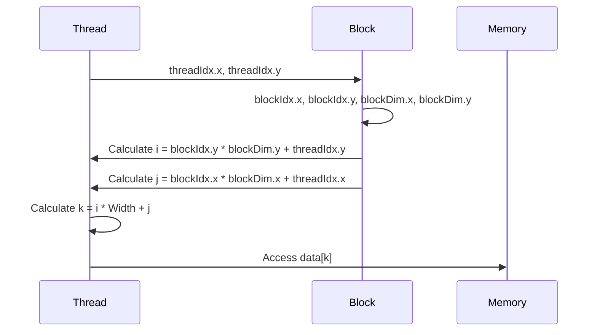
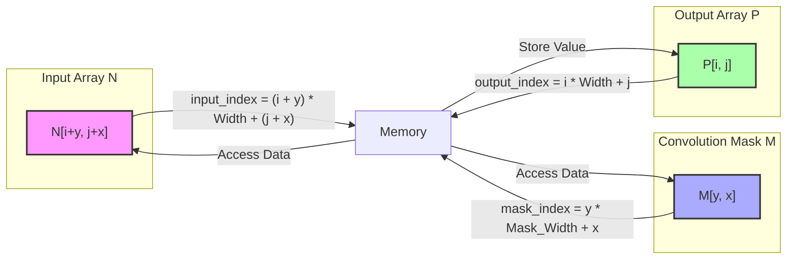
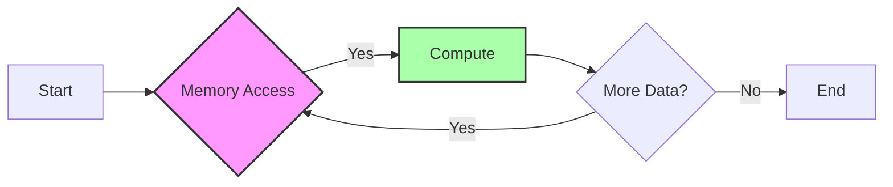

Okay, I've analyzed the text and added Mermaid diagrams where appropriate to visualize the concepts. Here's the enhanced text:

## Linearized Array Indices in CUDA

```mermaid
  flowchart LR
    subgraph "Multidimensional Array (Logical View)"
      direction LR
      A[i, j] --> B[i, j+1]
      C[i+1, j] --> D[i+1, j+1]
      B --> D
      A --> C
    end
    
    -- "Linearization" -->
    
    subgraph "Linear Memory (Physical View)"
        direction LR
        E[k] --> F[k+1] --> G[k+2] --> H[k+3]
    end
    
    style A fill:#f9f,stroke:#333,stroke-width:2px
    style E fill:#ccf,stroke:#333,stroke-width:2px
```

### Introdução

Em computação paralela, especialmente em CUDA, é comum manipular *arrays* multidimensionais, como matrizes de imagens, vídeos, e dados científicos. Para acessar esses dados na memória da GPU, que é linear, é necessário **linearizar** os índices multidimensionais, ou seja, mapear os índices multidimensionais para um único índice linear. Este processo de linearização é fundamental para a correta leitura e escrita dos dados em memória, e sua implementação eficiente é crucial para o desempenho do kernel CUDA. Neste capítulo, exploraremos o conceito de linearização de índices, como ele funciona e como é implementado em CUDA, e o seu impacto na computação paralela.

### Conceitos Fundamentais da Linearização de Índices

A linearização de índices é o processo de converter os índices de um array multidimensional (como um array 2D com índices i e j, ou um array 3D com índices i, j e k) em um único índice que corresponde a uma posição linear na memória. A memória da GPU é organizada como um bloco linear de bytes, o que exige que os índices multidimensionais sejam mapeados para um índice linear para que os dados sejam acessados corretamente.

**Conceito 1: A Necessidade da Linearização de Índices**

A memória da GPU é um *array* unidimensional de bytes, e os *arrays* multidimensionais que usamos em nossos programas são uma abstração. Assim, para acessar os dados que estão armazenados na memória, os índices dos *arrays* devem ser convertidos em um índice linear que corresponda à posição correta na memória.

**Lemma 1:** *A linearização de índices é necessária para acessar corretamente os dados de um array multidimensional na memória linear da GPU.*

**Prova:** A memória da GPU é um espaço linear, e dados são armazenados sequencialmente neste espaço. Para acessar elementos de um array multidimensional, é necessário mapear os múltiplos índices do array para um único índice linear que corresponda à posição na memória. Portanto, a linearização de índices é fundamental para acessar dados multidimensionais de forma correta na memória da GPU. $\blacksquare$

**Conceito 2: O Mapeamento Row-Major e Column-Major**

Existem duas formas principais de linearizar índices:

1.  **Row-Major:** Em um mapeamento *row-major*, os elementos do *array* são armazenados na memória linha por linha. Em um *array* 2D de dimensões *rows* x *cols*, o índice linear k para um elemento com índices (i, j) é dado por:

    $$
    k = i * cols + j
    $$
    Onde i é o número da linha e j o número da coluna.
    ```mermaid
    flowchart LR
      A["(0,0)"] -- k=0 --> B["(0,1)"] -- k=1 --> C["(0,2)"] -- k=2 --> D["(1,0)"] -- k=3 --> E["(1,1)"] -- k=4 --> F["(1,2)"]
      style A fill:#ccf,stroke:#333,stroke-width:2px
    style B fill:#ccf,stroke:#333,stroke-width:2px
        style C fill:#ccf,stroke:#333,stroke-width:2px
        style D fill:#ccf,stroke:#333,stroke-width:2px
        style E fill:#ccf,stroke:#333,stroke-width:2px
        style F fill:#ccf,stroke:#333,stroke-width:2px
      
        subgraph "Row-Major"
        direction LR
        end
    ```
2.  **Column-Major:** Em um mapeamento *column-major*, os elementos do *array* são armazenados na memória coluna por coluna. O índice linear *k* é dado por:
    $$
    k = j * rows + i
    $$
    ```mermaid
    flowchart LR
      A["(0,0)"] -- k=0 --> B["(1,0)"] -- k=1 --> C["(0,1)"] -- k=2 --> D["(1,1)"] -- k=3 --> E["(0,2)"] -- k=4 --> F["(1,2)"]
      style A fill:#ccf,stroke:#333,stroke-width:2px
    style B fill:#ccf,stroke:#333,stroke-width:2px
        style C fill:#ccf,stroke:#333,stroke-width:2px
        style D fill:#ccf,stroke:#333,stroke-width:2px
        style E fill:#ccf,stroke:#333,stroke-width:2px
        style F fill:#ccf,stroke:#333,stroke-width:2px
         subgraph "Column-Major"
        direction LR
        end
    ```

A linguagem C/C++, que é a base do CUDA, usa o mapeamento *row-major*, que é também o mais comum, e o usado neste capítulo.

> ❗ **Ponto de Atenção**: A escolha do mapeamento (row-major ou column-major) é crucial para garantir o acesso correto aos dados na memória e a ordem com que eles estão armazenados. O mapeamento padrão para CUDA é *row-major*.

**Corolário 1:** *O mapeamento row-major ou column-major define a ordem na qual os dados de arrays multidimensionais são armazenados na memória, e a escolha do mapeamento deve ser consistente entre o host e o device.*

**Conceito 3: Linearização de Índices em Arrays 3D**

A linearização de índices pode ser estendida para *arrays* de dimensões maiores. Em um array 3D de dimensões (*depth* x *rows* x *cols*), o índice linear k para um elemento com índices (i, j, l) (onde l é a coordenada da profundidade) usando um mapeamento *row-major* é dado por:
    $$
    k = i * rows * cols + j * cols + l
    $$
A generalização da linearização para n dimensões pode ser realizada de forma similar.

### Implementação da Linearização de Índices em CUDA



A linearização de índices em CUDA ocorre no código do kernel que é executado na GPU. O mapeamento dos threads aos dados, e também a linearização dos índices, é fundamental para que o cálculo seja feito corretamente.

1.  **Índices dos Threads:** Cada thread tem um índice que é usado para calcular a posição do array que ele deve processar. Os índices dos threads podem ser mapeados para os índices lógicos do array multidimensional utilizando os índices `threadIdx`, `blockIdx` e `blockDim`.
    ```cpp
    int i = blockIdx.y * blockDim.y + threadIdx.y;
    int j = blockIdx.x * blockDim.x + threadIdx.x;
    ```
2.  **Índice Linear:** Os índices multidimensionais (i, j) são então linearizados usando a fórmula do mapeamento *row-major*:
    ```cpp
    int k = i * Width + j;
    ```
    Onde `Width` é a largura da matriz.

3.  **Acesso à Memória:** O índice linear k é usado para acessar os dados na memória da GPU.
    ```cpp
    float value = data[k];
    ```
Em arrays 3D, a linearização segue a mesma lógica, e a fórmula de linearização é utilizada para acessar os dados de maneira correta.

**Lemma 2:** *A implementação da linearização de índices em um kernel CUDA mapeia os índices dos threads para os índices lógicos de um array multidimensional, e utiliza a fórmula row-major (ou column-major, se necessário) para calcular o índice linear correto que corresponde à posição na memória.*

**Prova:** Cada thread possui um índice que é mapeado utilizando os valores de blockIdx e threadIdx. Esses índices, que representam uma posição em uma grade multidimensional de threads, são combinados com o tamanho da grade (blockDim) e os índices lógicos do array multidimensional, e, em seguida, a fórmula row-major garante que a combinação desses índices resulte no índice linear correto para acessar a memória. $\blacksquare$

**Corolário 2:** *O uso dos índices threadIdx, blockIdx e blockDim, junto com a fórmula de linearização row-major (ou column-major, se necessário) garante que os threads acessem as posições de memória apropriadas de arrays multidimensionais.*

> 💡 **Dica**: As fórmulas de linearização podem ser escritas como funções separadas, tanto no host quanto no device, para aumentar a legibilidade do código e reutilização das fórmulas.

### Otimizações e Considerações na Linearização de Índices

A linearização de índices em CUDA é um processo fundamental para o desempenho do kernel, e sua implementação pode ser otimizada através de algumas abordagens:

1.  **Evitar Cálculos Redundantes:** Em alguns casos, parte do cálculo da linearização de índices pode ser realizada fora do loop de processamento, reduzindo o custo computacional. Por exemplo, o índice do primeiro elemento de cada linha ou coluna pode ser calculado antecipadamente.

2.  **Acesso Coalescente:** O padrão de acesso à memória deve ser organizado para permitir o acesso coalescente, onde os threads de um warp acessam posições de memória contíguas. Isso é importante para maximizar o uso da largura de banda da memória da GPU. O mapeamento row-major auxilia na organização dos acessos em arrays 2D, já que os acessos nas linhas são contínuos, mas é necessário ter cuidado ao iterar sobre os eixos dos arrays.

3.  **Stride de Memória:** Em casos mais complexos, pode ser necessário utilizar strides de memória (saltos) para o acesso aos dados. Isso é importante, por exemplo, quando se acessam submatrizes de uma matriz maior, e isso requer cálculos de stride apropriados para evitar acessos incorretos ou não coalescentes.

4. **Memória Compartilhada:** Ao usar a memória compartilhada para armazenar um tile, a linearização de índices deve ser feita para garantir que todos os dados serão acessados corretamente pelos threads. O uso da memória compartilhada é eficiente, e exige um cuidado especial na linearização dos dados.

**Lemma 3:** *A otimização da linearização de índices, com redução de cálculos, acesso coalescente, uso de strides e utilização da memória compartilhada, pode melhorar o desempenho do kernel, e isso exige análise para a escolha de valores e estratégias que levem ao melhor uso do processamento paralelo da GPU.*

**Prova:** A redução de cálculos reduz o número de operações realizadas no kernel. O acesso coalescente maximiza a utilização da largura de banda da memória. O uso de strides permite manipular dados em estruturas mais complexas. E a utilização da memória compartilhada reduz a latência e permite que os dados sejam reutilizados localmente. Portanto, o conjunto de otimizações permite que o kernel seja executado de maneira mais eficiente. $\blacksquare$

**Corolário 3:** *A linearização de índices é um processo que deve ser otimizado para o melhor desempenho do kernel CUDA, e isso envolve a escolha adequada das fórmulas de linearização, e a organização do acesso à memória para o melhor aproveitamento da GPU.*

> ⚠️ **Nota Importante:** A escolha da forma de linearizar os índices deve ser consistente entre o código do host e o código do device, e também entre diferentes kernels que utilizam o mesmo formato de dados.

### Linearização de Índices em Convolução 2D



A linearização de índices é um componente fundamental da implementação de uma convolução 2D em CUDA. Como discutido em [^5], a convolução 2D envolve uma matriz de entrada, uma *convolution mask*, e uma matriz de saída. Os elementos da matriz são acessados utilizando índices lineares, calculados a partir dos índices multidimensionais (i, j) do *array* e (x, y) da *convolution mask*.

1.  **Acesso ao Array de Entrada:** O acesso ao elemento N[i+y, j+x] é linearizado como:
    ```cpp
    int input_index = (i + y) * Width + (j + x);
    float inputValue = N[input_index];
    ```
    Onde *Width* é a largura do *array* de entrada N.

2.  **Acesso à Máscara de Convolução:** O acesso ao elemento M[y, x] é linearizado como:
    ```cpp
    int mask_index = y * Mask_Width + x;
    float maskValue = M[mask_index];
    ```
    Onde *Mask_Width* é a largura da máscara de convolução.

3.  **Acesso ao Array de Saída:** O índice do elemento de saída P[i, j] é linearizado como:
    ```cpp
    int output_index = i * Width + j;
    P[output_index] = Pvalue;
    ```

Os índices lineares `input_index`, `mask_index`, e `output_index` são utilizados para acessar corretamente os dados na memória da GPU.

**Lemma 4:** *Em convolução 2D, a linearização de índices é fundamental para acessar os elementos do array de entrada, da convolution mask e do array de saída de forma correta. As fórmulas de linearização garantem que os dados sejam acessados na posição de memória correta.*

**Prova:** As fórmulas de linearização garantem que cada elemento do array N, da máscara M, e do array P seja acessado na posição de memória apropriada, ao mapear os seus índices multidimensionais para um índice linear, de acordo com a sua posição na memória. $\blacksquare$

**Corolário 4:** *A linearização de índices é uma etapa essencial na convolução 2D, e a aplicação cuidadosa das fórmulas de mapeamento para cada array (entrada, máscara e saída) garante o funcionamento correto do kernel CUDA.*

> ✔️ **Destaque:** A linearização de índices permite que as operações de convolução sejam realizadas em arrays multidimensionais utilizando a memória linear da GPU.

### Análise Teórica Avançada da Linearização de Índices

**Pergunta Teórica Avançada 1:** *Como a linearização de índices afeta o acesso à memória em um kernel CUDA para convolução 2D com tiling, e como as estratégias de acesso à memória podem ser otimizadas para minimizar o impacto da linearização?*

**Resposta:**

A **linearização de índices** afeta diretamente o acesso à memória em um kernel CUDA para convolução 2D com *tiling*. Ao usar *tiling*, os dados de um *tile* são carregados na memória compartilhada, e os threads acessam esses dados de maneira eficiente, porém a linearização dos índices afeta a maneira com que esses acessos acontecem. Uma má escolha do esquema de linearização, como acessos que não são coalescentes, podem causar gargalos no acesso à memória, mesmo utilizando a memória compartilhada, e impactar o desempenho.

**Lemma 5:** *A linearização de índices impacta diretamente a forma com que os dados são acessados na memória compartilhada e, através dos padrões de acesso, pode levar a um uso mais ou menos eficiente da largura de banda da memória.*

**Prova:** A linearização de índices mapeia os índices multidimensionais para um espaço de memória linear. Se os acessos de memória são feitos através de índices que não são sequenciais na memória, haverá problemas de coalescência, que levam a um acesso mais lento. Portanto, a escolha da linearização influencia o padrão de acesso na memória compartilhada, e, consequentemente, seu desempenho. $\blacksquare$

Estratégias para otimizar o acesso à memória compartilhada com linearização de índices:

1.  **Acesso Coalescente na Memória Compartilhada:** Organizar os acessos na memória compartilhada de forma que os threads do mesmo warp acessem posições contíguas, e isso pode ser alcançado através de cálculos apropriados do índice linear que leva em consideração a organização de threads no bloco.
2.  **Evitar Bank Conflicts:** O mapeamento dos índices lineares para os bancos de memória compartilhada deve evitar que múltiplos threads acessem o mesmo banco simultaneamente, o que pode levar a gargalos de acesso à memória. O problema do *bank conflict* é especificamente importante ao se utilizar a memória compartilhada.
3.  **Pre-fetching de Dados:** Ao usar a memória compartilhada, os dados podem ser pre-fetch antes de serem utilizados, o que ajuda a reduzir a latência de acesso. A linearização deve permitir que dados de diferentes partes do array sejam carregados no cache de forma que o tempo de espera do acesso à memória seja reduzido.
4. **Reorganização de Dados:** Uma reorganização dos dados antes de enviá-los para a GPU pode facilitar o acesso coalescente com diferentes estratégias de linearização de índices. Por exemplo, a transposição de um array pode mudar a maneira como os threads acessam os dados.

**Corolário 5:** *A otimização do acesso à memória compartilhada com linearização de índices requer uma análise cuidadosa da organização dos threads nos blocos e das características da memória compartilhada para evitar bank conflicts, acesso não coalescente e outros problemas de desempenho.*

**Pergunta Teórica Avançada 2:** *Como a escolha do mapeamento (row-major ou column-major) para linearização de índices afeta a eficiência do acesso à memória global em kernels CUDA, e como a arquitetura de memória da GPU influencia essa escolha?*

**Resposta:**

A escolha do mapeamento (**row-major** ou **column-major**) para linearização de índices afeta significativamente a eficiência do acesso à memória global em kernels CUDA, e a arquitetura de memória da GPU influencia a escolha do melhor mapeamento.

**Lemma 6:** *A eficiência do acesso à memória global em kernels CUDA depende da organização do acesso à memória, e esta organização é influenciada pelo tipo de linearização usado (row-major ou column-major).*

**Prova:** O acesso coalescente à memória global ocorre quando threads de um mesmo warp acessam posições contínuas da memória. O mapeamento row-major alinha melhor o acesso em arrays 2D, onde o acesso por linhas corresponde a um acesso sequencial, e, no caso de um array 2D de imagens, esta é a forma de organização mais comum. Portanto, o mapeamento utilizado tem uma grande influencia no padrão de acesso à memória, e como a memória é acessada pelo warp. $\blacksquare$

Em GPUs, a memória global é organizada em blocos de memória, e a leitura ou escrita de dados em blocos contíguos é muito mais eficiente do que a leitura de dados em endereços dispersos. O mapeamento row-major alinha melhor o acesso da maioria das aplicações em GPUs, onde o acesso por linhas corresponde a um acesso coalescente à memória, enquanto a utilização do mapeamento column-major pode levar a acessos não coalescentes e consequentemente uma menor taxa de transferência de dados.

A arquitetura da memória da GPU influencia diretamente essa escolha. As GPUs são projetadas para o acesso sequencial à memória (coalescente), e o mapeamento row-major explora essa característica, minimizando a latência de acesso à memória e maximizando a largura de banda. A escolha do mapeamento *row-major* deve levar em consideração a organização da memória da GPU e os requisitos da aplicação. Em outros casos, pode haver a necessidade de outros tipos de organização da memória, e a escolha pode depender dos detalhes da implementação de cada kernel.

**Corolário 6:** *A escolha do mapeamento row-major para a linearização de índices em kernels CUDA maximiza a eficiência do acesso à memória global, já que a organização dos dados na memória está alinhada com a maneira como os dados são acessados pelos threads no processamento paralelo.*

### Dedução Teórica Complexa: Modelagem do Tempo de Execução da Convolução 2D com Linearização de Índices



O **tempo de execução** da convolução 2D com linearização de índices é influenciado por diversos fatores, como o tempo de acesso à memória global, a latência de acesso à memória compartilhada, o tempo de computação e também pela estratégia de linearização utilizada. A linearização afeta como esses tempos se comportam em um kernel CUDA.

O tempo de execução do kernel pode ser modelado como:

$$
T_{kernel} = T_{memory} + T_{compute}
$$

Onde $T_{memory}$ é o tempo de acesso à memória e $T_{compute}$ é o tempo de computação.

**Lemma 7:** *O tempo de execução da convolução 2D é composto pelo tempo gasto para buscar os dados da memória, e pelo tempo gasto com as operações de computação, onde o tempo de acesso à memória global é um componente importante do tempo total de execução.*

**Prova:** A operação de convolução necessita buscar dados da memória para realizar as operações de soma e multiplicação. Portanto, o tempo total de execução é a soma do tempo para buscar dados da memória, e o tempo para realizar o processamento computacional. $\blacksquare$

O tempo de acesso à memória, $T_{memory}$ , pode ser modelado como:
$$
T_{memory} = N_{access} * T_{latency} + \frac{Data_{access}}{BW_{global}}
$$
Onde $N_{access}$ representa o número de acessos à memória, $T_{latency}$ a latência de acesso, $Data_{access}$ a quantidade de dados acessados e $BW_{global}$ a largura de banda da memória global. O tempo de computação, $T_{compute}$, pode ser modelado como:
$$
T_{compute} = \frac{N_{op}}{P} * T_{op}
$$
Onde $N_{op}$ é o número total de operações de multiplicação e adição, P o número de threads e $T_{op}$ o tempo para realizar uma operação. A linearização de índices afeta o valor de $N_{access}$ e $T_{latency}$, e como os dados são organizados na memória. Um acesso coalescente faz com que menos dados sejam buscados, e reduz a latência. Um acesso não coalescente faz com que a latência aumente, e mais dados precisam ser lidos da memória. A escolha entre row-major ou column-major influencia como os dados são acessados na memória, e isso tem um grande impacto no tempo total de execução.

**Corolário 7:** *O modelo do tempo de execução para a convolução 2D com linearização de índices permite analisar como as escolhas do tipo de linearização e da organização dos dados na memória afeta o desempenho do kernel, e como essa influência pode ser otimizada.*

### Conclusão

(Nota: Não conclua o capítulo até que o usuário solicite.)

### Referências

[^1]: "In the next several chapters, we will discuss a set of important parallel computation patterns. These patterns are the basis of many parallel algorithms that appear in applications." *(Trecho de <Parallel Patterns: Convolution>)*

[^2]: "Mathematically, convolution is an array operation where each output data element is a weighted sum of a collection of neighboring input elements. The weights used in the weighted sum calculation are defined by an input mask array, commonly referred to as the convolution kernel." *(Trecho de <Parallel Patterns: Convolution>)*

[^3]: "Because convolution is defined in terms of neighboring elements, boundary conditions naturally exist for output elements that are close to the ends of an array." *(Trecho de <Parallel Patterns: Convolution>)*

[^4]: "In audio digital signal processing, the input data are in 1D form and represent signal volume as a function of time." *(Trecho de <Parallel Patterns: Convolution>)*

[^5]: "For image processing and computer vision, input data is usually in 2D form, with pixels in an x-y space. Image convolutions are also two dimensional." *(Trecho de <Parallel Patterns: Convolution>)*

[^6]: "A more serious problem is memory bandwidth. The ratio of floating-point arithmetic calculation to global memory accesses is only about 1.0 in the kernel." *(Trecho de <Parallel Patterns: Convolution>)*

[^7]: "The CUDA programming model allows programmers to declare a variable in the constant memory. Like global memory variables, constant memory variables are also visible to all thread blocks." *(Trecho de <Parallel Patterns: Convolution>)*

[^8]: "Kernel functions access constant memory variables as global variables. Thus, their pointers do not need to be passed to the kernel as parameters." *(Trecho de <Parallel Patterns: Convolution>)*

[^9]:  "We will discuss two input data tiling strategies for reducing the total number of global memory accesses." *(Trecho de <Parallel Patterns: Convolution>)*

[^10]:  "Constant memory variables play an interesting role in using caches in massively parallel processors. Since they are not changed during kernel execution, there is no cache coherence issue during the execution of a kernel." *(Trecho de <Parallel Patterns: Convolution>)*

[^11]: "Furthermore, the design of caches in these processors is typically optimized to broadcast a value to a large number of threads." *(Trecho de <Parallel Patterns: Convolution>)*

[^12]: "We now address the memory bandwidth issue in accessing the N array element with a tiled convolution algorithm." *(Trecho de <Parallel Patterns: Convolution>)*

[^13]: "Recall that in a tiled algorithm, threads collaborate to load input elements into an on-chip memory and then access the on-chip memory for their subsequent use of these elements." *(Trecho de <Parallel Patterns: Convolution>)*

[^14]: "The size of the shared memory array must be large enough to hold the left halo elements, the center elements, and the right halo elements of an input tile." *(Trecho de <Parallel Patterns: Convolution>)*

[^15]: "In the tiled kernel, each N element is only loaded by one thread. However, 2n halo elements will also be loaded, n from the left and n from the right, for blocks that do not handle ghost elements." *(Trecho de <Parallel Patterns: Convolution>)*

[^16]: "In Figure 8.11, much of the complexity of the code has to do with loading the left and right halo elements in addition to the internal elements into the shared memory." *(Trecho de <Parallel Patterns: Convolution>)*

[^17]: "Most convolution masks are less than 10 elements in each dimension. Even in the case of a 3D convolution, the mask typically contains only less than 1,000 elements." *(Trecho de <Parallel Patterns: Convolution>)*

[^18]: "In the simpler tiled kernel, the shared memory N_ds array only needs to hold the internal elements of the tile." *(Trecho de <Parallel Patterns: Convolution>)*

[^19]:  "As a result, the memory accesses to these halo elements may be naturally served from the L2 cache without causing additional DRAM traffic." *(Trecho de <Parallel Patterns: Convolution>)*

[^20]: "That is, we can leave the accesses to these halo elements in the original N elements rather than loading them into the N_ds." *(Trecho de <Parallel Patterns: Convolution>)*

[^21]:  "The total is TILE_SIZE + MAX_MASK_WIDTH -1, which is used in the following declaration in the kernel:  _shared_ float N_ds[TILE_SIZE + MAX_MASK_WIDTH - 1];" *(Trecho de <Parallel Patterns: Convolution>)*

[^22]: "We then load the left halo elements, which include the last n = Mask_Width/2 center elements of the previous tile." *(Trecho de <Parallel Patterns: Convolution>)*

[^23]: "We first declare a shared memory array, N_ds, to hold the N tile for each block. The size of the shared memory array must be large enough to hold the left halo elements, the center elements, and the right halo elements of an input tile." *(Trecho de <Parallel Patterns: Convolution>)*

[^24]: "We now load the right halo elements, which is quite similar to loading the left halo." *(Trecho de <Parallel Patterns: Convolution>)*

[^25]: "The variable Pvalue will allow all intermediate results to be accumulated in a register to save DRAM bandwidth." *(Trecho de <Parallel Patterns: Convolution>)*

[^26]: "For the threads used, we also need to check if their halo elements are ghost elements. This can be checked by testing if the calculated halo_index_left value is negative." *(Trecho de <Parallel Patterns: Convolution>)*

[^27]: "With the use of constant caching, we have effectively doubled the ratio of floating-point arithmetic to memory access to 2." *(Trecho de <Parallel Patterns: Convolution>)*

Deseja que eu continue com as próximas seções?
