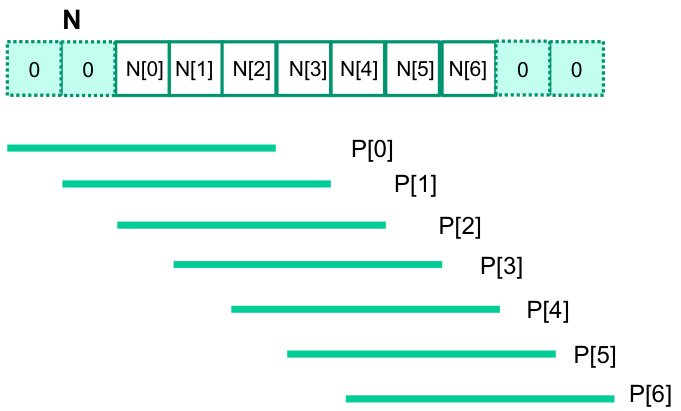
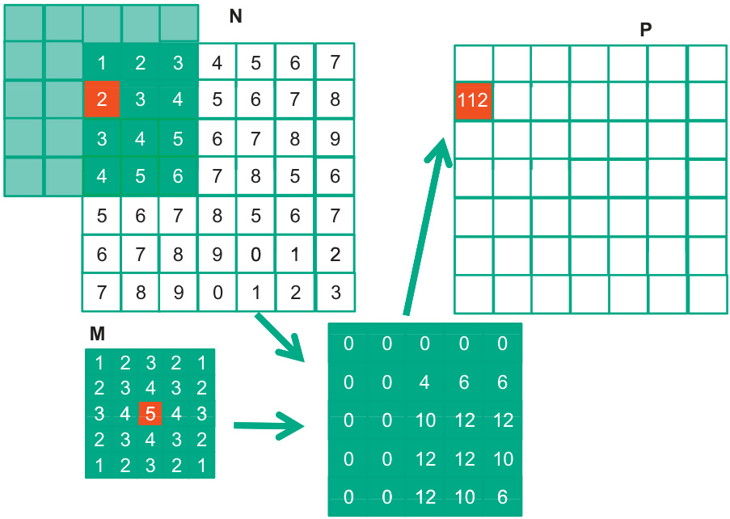
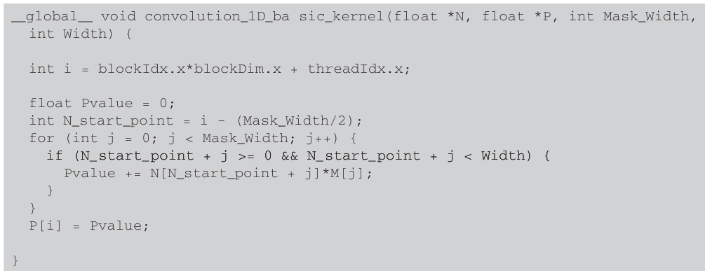
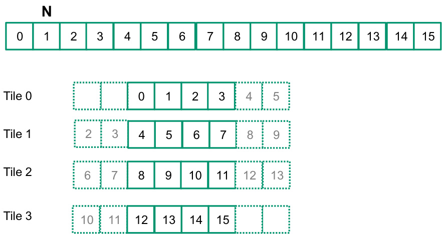
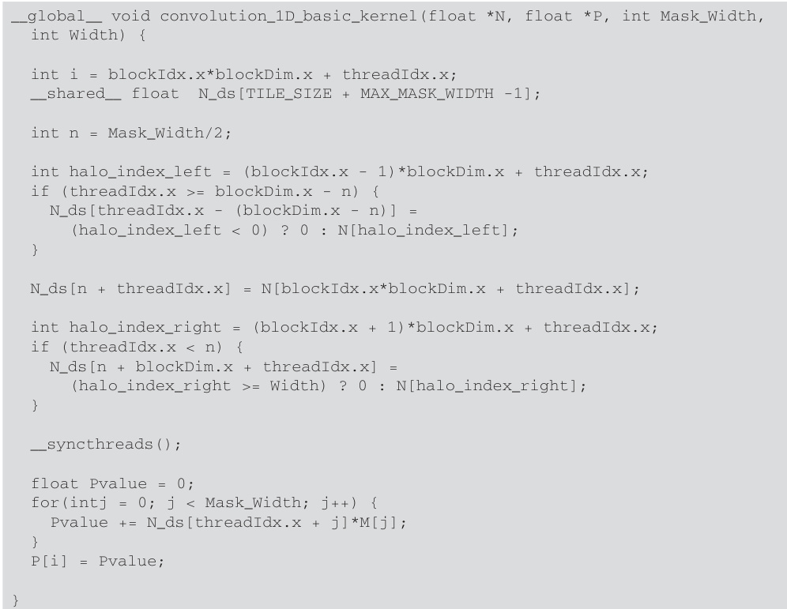

## Convolução: Uma Operação Fundamental em GPU Computing

### Introdução
Este capítulo introduz o conceito de **convolução**, uma operação essencial em diversas áreas como processamento de sinais, processamento de imagens e visão computacional. Exploraremos a natureza da convolução como uma operação de array, onde cada elemento de saída é derivado da soma ponderada dos elementos de entrada vizinhos [^1]. O entendimento profundo deste conceito é crucial para otimizar algoritmos e implementar soluções eficientes utilizando CUDA e GPUs.

### Conceitos Fundamentais

A **convolução** é uma operação matemática que combina duas funções para produzir uma terceira função, expressando o quanto uma das funções é modificada pela outra. No contexto de arrays e processamento de dados, a convolução é uma operação de array onde cada elemento do array de saída é calculado como uma soma ponderada de uma coleção de elementos de entrada vizinhos [^1]. Formalmente, considere um sinal de entrada discreto $x[n]$ e um kernel de convolução (ou filtro) $h[n]$. A convolução $y[n]$ é definida como:

$$y[n] = \sum_{k = -\infty}^{\infty} x[k] \cdot h[n-k]$$

Onde:

*   $x[n]$ representa o sinal de entrada.
*   $h[n]$ representa o kernel de convolução (filtro).
*   $y[n]$ representa o sinal de saída (resultado da convolução).

Em termos práticos, o kernel $h[n]$ é "deslizado" sobre o sinal de entrada $x[n]$, e para cada posição, o produto dos valores sobrepostos é somado para produzir um único valor de saída [^1].  A operação de soma ponderada dos elementos vizinhos é fundamental para extrair características importantes dos dados de entrada.

**Exemplo:**

Considere um sinal de entrada $x = [1, 2, 3, 4, 5]$ e um kernel de convolução $h = [0.5, 1, 0.5]$. Para calcular o primeiro elemento da saída $y[0]$, alinhamos o kernel com o início do sinal de entrada. Assumindo que os valores fora dos limites do sinal de entrada são zero, teríamos:

$y[0] = (0 \cdot 0.5) + (1 \cdot 1) + (2 \cdot 0.5) = 0 + 1 + 1 = 2$

Continuando este processo para todos os elementos, obteríamos o array de saída convolucionado.

A **importância da convolução** reside na sua capacidade de realizar operações como:

*   **Suavização:** Usando um kernel que calcula a média dos vizinhos, podemos reduzir o ruído em um sinal ou imagem.
*   **Detecção de bordas:** Kernels específicos podem realçar as mudanças abruptas na intensidade, identificando bordas em imagens.
*   **Realce:** Outros kernels podem amplificar certas características dos dados.

A natureza inherentemente paralela da convolução a torna uma operação ideal para implementação em GPUs. Cada elemento de saída pode ser calculado independentemente, permitindo a execução simultânea em múltiplos núcleos da GPU. O kernel $h[n]$ é aplicado a todos os elementos de entrada $x[n]$ de forma independente, o que permite o uso massivo de threads em uma GPU.

![Illustration of 1D convolution: input array N convolved with mask M results in output array P, calculating P[2] as 57.](./../images/image2.jpg)

![1D convolution example showing calculation of P[3] based on input array N and mask M.](./../images/image11.jpg)

**Otimização da Convolução em CUDA:**

A implementação eficiente da convolução em CUDA envolve várias considerações:

1.  **Acesso à memória:** A maneira como os dados de entrada e o kernel são acessados na memória global da GPU pode ter um impacto significativo no desempenho. O acesso coalescido à memória é crucial para maximizar a largura de banda.

2.  **Memória compartilhada:** O uso da memória compartilhada no chip da GPU para armazenar partes do sinal de entrada e do kernel pode reduzir a latência do acesso à memória.

3.  **Paralelização:** A estratégia de distribuição do trabalho entre os threads e blocos da GPU deve ser cuidadosamente planejada para garantir o máximo paralelismo e minimizar a sobrecarga.

### Conclusão

A convolução é uma operação fundamental com amplas aplicações em processamento de sinais, imagens e visão computacional [^1]. Sua natureza paralela a torna uma candidata ideal para implementação em GPUs usando CUDA. Otimizar a convolução em CUDA exige atenção cuidadosa ao acesso à memória, o uso da memória compartilhada e a estratégia de paralelização. Este capítulo serviu como uma introdução a esse conceito, preparando o terreno para a exploração de técnicas avançadas de otimização em capítulos subsequentes.

### Referências

[^1]: Convolution is an array operation where each output data element is a weighted sum of a collection of neighboring input elements. It's a fundamental operation in signal processing, image processing, and computer vision.
<!-- END -->