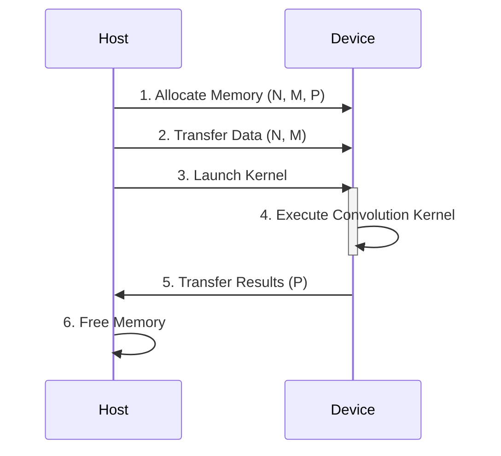

## Convolution as a Weighted Sum

```mermaid
flowchart LR
    A[Input Array "N"] --> B(Convolution Mask "M");
    B --> C{Weighted Sum};
    C --> D[Output Array "P"];
    style A fill:#f9f,stroke:#333,stroke-width:2px
    style D fill:#ccf,stroke:#333,stroke-width:2px
    style B fill:#cfc,stroke:#333,stroke-width:2px
    style C fill:#ffc,stroke:#333,stroke-width:2px
```

### Introdução

O conceito de **convolução** é fundamental em diversas áreas da computação, desde o processamento de sinais e imagens até simulações físicas complexas [^1]. Essencialmente, a convolução é uma operação de *array* que calcula cada elemento de saída como uma soma ponderada de elementos de entrada vizinhos. A ponderação é definida por um *array* de máscara, também conhecido como **kernel de convolução** [^2]. Dada sua capacidade de realizar transformações e filtragens, a convolução é uma ferramenta poderosa na computação paralela. Neste capítulo, exploraremos os princípios da convolução, especialmente em relação à sua implementação utilizando CUDA.

### Conceitos Fundamentais

A convolução envolve a aplicação de um **mask** (máscara ou kernel) a um conjunto de dados de entrada. O resultado é um novo conjunto de dados em que cada elemento é uma combinação ponderada dos elementos de entrada vizinhos. É importante ressaltar que, apesar do termo *kernel*, não se refere aos *kernel functions* de CUDA, mas sim a um array de pesos. Para evitar confusão, vamos nos referir a esse array de pesos como **convolution mask** [^2].

**Conceito 1: Data Parallelism na Convolução**

A convolução é uma operação inerentemente paralela, já que cada elemento de saída pode ser calculado independentemente dos outros [^1]. Essa característica a torna ideal para o uso em arquiteturas de computação paralela como as GPUs com CUDA. Em um cenário de **Data Parallelism**, cada thread pode ser responsável por calcular um único elemento do array de saída, levando a uma computação eficiente e escalável.

**Lemma 1:** *O cálculo de cada elemento do array de saída em uma operação de convolução é independente dos cálculos dos outros elementos.*

**Prova:** A fórmula de convolução para um elemento de saída P[i] depende apenas de um subconjunto do array de entrada N e do mask M, como detalhado em [^2]:
$$
P[i] = \sum_{k=-n}^{n} N[i+k] \cdot M[k]
$$
onde *n* define o tamanho da máscara e *k* itera sobre os elementos da máscara. Como cada P[i] utiliza um conjunto de dados de entrada distinto (com sobreposição), e o cálculo para cada P[i] não depende de outros P[j], o cálculo de cada elemento é independente. $\blacksquare$

**Conceito 2: Estrutura de um Programa CUDA para Convolução**

Um programa CUDA para convolução normalmente segue a arquitetura **host-device**, na qual a CPU (host) gerencia a alocação de memória e a transferência de dados para a GPU (device). O código da convolução é executado na GPU usando um **kernel function**, que é lançado pela CPU. O kernel é executado em múltiplos threads simultaneamente para calcular o array de saída [^7]. A estrutura básica envolve:

1.  **Alocação de Memória:** Alocação de memória na CPU e GPU para os arrays de entrada (N), máscara (M) e array de saída (P).
2.  **Transferência de Dados:** Transferência dos arrays de entrada e máscara da CPU para a GPU.
3.  **Lançamento do Kernel:** Lançamento do kernel CUDA na GPU, com a configuração de grid e bloco de threads apropriada.
4.  **Execução do Kernel:** Execução do código da convolução em paralelo pelos threads da GPU.
5.  **Transferência de Resultados:** Transferência do array de saída (P) da GPU para a CPU.
6.  **Liberação da Memória:** Liberação da memória alocada.



**Corolário 1:** *A estrutura de um programa CUDA para convolução é consistente com o modelo host-device, onde a CPU gerencia a execução do kernel na GPU para computação paralela.*

**Conceito 3: Kernel Functions e o Modelo de Execução de Threads em Convolução 1D**

Um **kernel function** em CUDA é um trecho de código que é executado por vários threads em paralelo na GPU [^4]. Cada thread pode ser responsável pelo cálculo de um elemento de saída na convolução. Em uma convolução 1D, cada thread pode calcular um elemento P[i] utilizando os elementos N[i-n] até N[i+n] e os pesos de M. O modelo de execução de threads é organizado em grids de blocos, onde cada bloco contém um conjunto de threads [^5]. Os índices de blocos e threads são utilizados para mapear os threads para os elementos do array de saída.

> ⚠️ **Nota Importante**: O tamanho do kernel de convolução (mask) influencia diretamente o número de acessos à memória e a complexidade do cálculo. Máscaras maiores requerem mais dados de entrada para cada cálculo de saída e aumentam o custo computacional [^2].

### Convolução 1D: Um Algoritmo Básico

```mermaid
flowchart LR
    A[Thread] --> B{Calculate Output Index i};
    B --> C{Determine Start Point};
    C --> D{Calculate Weighted Sum};
    D --> E{Store Result in P[i]};
    style A fill:#f9f,stroke:#333,stroke-width:2px
    style E fill:#ccf,stroke:#333,stroke-width:2px
    style B fill:#cfc,stroke:#333,stroke-width:2px
    style C fill:#ffc,stroke:#333,stroke-width:2px
        style D fill:#ccf,stroke:#333,stroke-width:2px
```

A implementação de um algoritmo básico de convolução 1D em CUDA envolve a criação de um **kernel function** que é executado por vários threads em paralelo. O código do kernel deve realizar as seguintes tarefas:

1.  **Calcular o Índice do Elemento de Saída:** Cada thread deve calcular o índice do elemento do array de saída que é responsável por calcular. Isso é geralmente feito utilizando os índices `blockIdx.x`, `blockDim.x` e `threadIdx.x` [^6].

    ```cpp
    int i = blockIdx.x * blockDim.x + threadIdx.x;
    ```

2.  **Calcular o Ponto Inicial:** Determinar o ponto inicial do subconjunto de elementos de entrada para calcular o elemento de saída. Este ponto inicial é afetado pelo tamanho do mask e pelo índice do elemento de saída. Por exemplo, o ponto inicial pode ser `i - (Mask_Width / 2)` [^7].
    ```cpp
    int N_start_point = i - (Mask_Width/2);
    ```
3.  **Calcular a Soma Ponderada:** Implementar um loop que itere sobre os elementos da máscara, multiplicando-os pelos elementos de entrada correspondentes e acumulando o resultado em uma variável `Pvalue` [^7].
    ```cpp
    float Pvalue = 0;
    for (int j = 0; j < Mask_Width; j++) {
      if (N_start_point + j >= 0 && N_start_point + j < Width){
        Pvalue += N[N_start_point + j] * M[j];
      }
    }
    ```
4.  **Armazenar o Resultado:** Armazenar o valor acumulado na posição de saída apropriada, `P[i] = Pvalue;` [^7].

**Lemma 2:** *Em um kernel de convolução 1D, o índice de um elemento do array de saída P[i] é calculado utilizando os índices `blockIdx.x`, `blockDim.x` e `threadIdx.x`, e o ponto inicial do subconjunto de elementos de entrada é calculado como  `i - (Mask_Width / 2)`.*

**Prova:** A organização dos threads em um grid 1D é dada por `i = blockIdx.x * blockDim.x + threadIdx.x`, onde `blockIdx.x` é o índice do bloco, `blockDim.x` é o tamanho do bloco e `threadIdx.x` é o índice do thread no bloco. O subconjunto de elementos de entrada para P[i] começa em `i - (Mask_Width / 2)` considerando a simetria do kernel, onde `Mask_Width` é o tamanho do mask. Portanto, os cálculos dos índices estão corretos e adequados para o mapeamento de threads para os dados apropriados em uma operação de convolução 1D. $\blacksquare$

**Corolário 2:** *O uso de `blockIdx.x`, `blockDim.x` e `threadIdx.x` para calcular o índice de saída `i` permite que cada thread acesse um segmento único e contíguo do array de saída e, através de `i - (Mask_Width/2)`, cada thread calcula a posição inicial para coletar os dados de entrada, garantindo um correto cálculo da convolução.*

> ❗ **Ponto de Atenção**: As condições de contorno são cruciais em convolução, especialmente em elementos próximos às extremidades do array. Elementos de entrada "ghost" (inexistentes) são geralmente definidos com um valor padrão, como 0 [^3].

### Análise Teórica Avançada da Convolução 1D

**Pergunta Teórica Avançada 1:** *Como a escolha do tamanho do bloco de threads afeta o desempenho de um kernel de convolução 1D básico, considerando o acesso à memória global e a divergência de fluxo de controle?*

**Resposta:**

O **tamanho do bloco de threads** influencia o desempenho do kernel de convolução 1D de diversas formas, impactando diretamente o acesso à memória global e a divergência do fluxo de controle. O tamanho do bloco afeta diretamente o número de threads que trabalham em conjunto para calcular a convolução. Um bloco menor pode levar a um baixo aproveitamento da capacidade de processamento paralelo da GPU, enquanto um bloco muito grande pode levar a um uso ineficiente dos recursos da GPU.

**Lemma 3:** *A escolha de um tamanho de bloco muito pequeno em um kernel de convolução 1D resulta em subutilização da capacidade de processamento paralelo da GPU, enquanto um tamanho muito grande pode levar a problemas de desempenho devido ao compartilhamento de memória.*

**Prova:** O tamanho do bloco de threads determina o número de threads executados simultaneamente em um SM (Streaming Multiprocessor) de uma GPU. Se o tamanho do bloco for muito pequeno, haverá menos threads sendo executadas do que o SM é capaz de lidar, resultando em subutilização da GPU. Se o tamanho do bloco for muito grande, haverá mais threads que precisam compartilhar os recursos de memória, e o overhead de gerenciamento desses recursos pode levar a problemas de desempenho. $\blacksquare$

O **acesso à memória global** é outro fator crítico. Se os threads dentro de um bloco acessarem elementos de memória global de forma não coalescente, haverá um grande overhead para acessos à memória, reduzindo o desempenho da computação. Um bloco maior pode dar mais flexibilidade na organização do acesso à memória, mas se o bloco é muito grande, os acessos podem ser não coalescentes, resultando em um desempenho inferior.

A **divergência do fluxo de controle** ocorre quando os threads dentro de um bloco seguem caminhos de execução diferentes, por exemplo, devido aos limites do array. No caso do algoritmo de convolução, o uso do `if` para lidar com os elementos "ghost" introduz divergência de fluxo de controle. Se um número significativo de threads dentro de um bloco executar um código diferente, o desempenho do bloco será prejudicado. Em geral, blocos menores tendem a ter uma divergência de fluxo de controle mais controlada do que blocos maiores em cenários de contorno em bordas de arrays, pois blocos maiores podem acabar incluindo mais threads que precisam lidar com os casos especiais do contorno. No entanto, isso deve ser balanceado com o potencial da subutilização dos recursos de hardware com blocos muito pequenos.

**Corolário 3:** *A escolha de um tamanho de bloco ideal em um kernel de convolução 1D envolve um balanço entre maximizar o uso do processamento paralelo da GPU, garantir o acesso coalescente à memória global e minimizar a divergência do fluxo de controle.*

**Pergunta Teórica Avançada 2:** *Qual a relação entre o tamanho do mask de convolução e o número de operações aritméticas e acessos à memória em um kernel de convolução 1D básico?*

**Resposta:**

O tamanho do **mask de convolução (Mask_Width)** influencia diretamente o número de operações aritméticas e acessos à memória em um kernel de convolução 1D básico. O número de operações aritméticas por elemento de saída é linearmente proporcional a Mask_Width, e a cada iteração do loop na função kernel, uma multiplicação e uma adição (ou uma soma acumulada) são realizadas, assim como no caso de acessos à memória.

**Lemma 4:** *O número de operações aritméticas para cada elemento de saída em um kernel de convolução 1D básico é diretamente proporcional ao tamanho do mask, Mask_Width, dado que o número de multiplicações e adições é igual a Mask_Width para cada elemento de saída.*

**Prova:** Para cada elemento de saída P[i], o kernel executa um loop que itera sobre todos os elementos do mask de convolução, realizando uma multiplicação e uma adição para cada elemento do mask. O número total de iterações, e consequentemente, o número total de multiplicações e adições, é igual a Mask_Width. Portanto, o número de operações aritméticas é proporcional a Mask_Width. $\blacksquare$

Em relação ao número de **acessos à memória**, o kernel precisa acessar Mask_Width elementos do array de entrada N, além de Mask_Width elementos da máscara M. Como a máscara M pode ser armazenada na memória constante (e acessada via cache), os acessos a N dominam o tempo de acesso à memória, ou seja, o número de acessos à memória ao longo do array de entrada também é diretamente proporcional a Mask_Width. O número total de acessos à memória é dado pelo número de threads multiplicado pelo tamanho do mask, que influencia o tempo de execução.

**Corolário 4:** *O aumento do tamanho do mask em um kernel de convolução 1D básico leva a um aumento linear no número de operações aritméticas e acessos à memória, impactando diretamente o tempo de execução do kernel.*

**Pergunta Teórica Avançada 3:** *Como a utilização de memória constante (constant memory) para a máscara de convolução (M) afeta o desempenho de um kernel de convolução 1D?*

**Resposta:**

A utilização de **memória constante** para o armazenamento da máscara de convolução em CUDA é uma otimização que impacta positivamente o desempenho de um kernel de convolução 1D. A memória constante é uma área de memória na GPU que é projetada para armazenar dados que não são alterados durante a execução do kernel [^9]. A memória constante é tipicamente acessada através de um cache, permitindo que múltiplas threads acessem os mesmos dados sem a necessidade de leituras adicionais da memória global (DRAM), como explicado em [^11].

```mermaid
flowchart LR
    A[Global Memory "DRAM"] --> B[Constant Memory Cache]
    B --> C[Threads on GPU]
     style A fill:#f9f,stroke:#333,stroke-width:2px
    style B fill:#ccf,stroke:#333,stroke-width:2px
     style C fill:#cfc,stroke:#333,stroke-width:2px
```

**Lemma 5:** *O armazenamento da máscara de convolução na memória constante e o uso de caches reduzem o tráfego da memória global, diminuindo a latência e aumentando a eficiência da execução do kernel.*

**Prova:** A memória constante é otimizada para acessos broadcast, ou seja, quando várias threads acessam o mesmo dado. Como todos os threads em um bloco acessam os mesmos elementos da máscara M, o hardware de cache da GPU pode transmitir esses dados de forma eficiente, evitando múltiplos acessos redundantes à memória global. A memória constante é armazenada em um cache que tem uma latência menor que a memória global, além de reduzir os acessos de leitura da memória global. Portanto, o uso da memória constante para a máscara de convolução reduz a latência de acesso e o tráfego na memória global. $\blacksquare$

Quando a máscara é armazenada em memória global, cada thread precisa ler seus elementos correspondentes individualmente da DRAM, e esse processo pode gerar gargalos devido à alta latência e baixa largura de banda da DRAM. Ao utilizar a memória constante, a máscara é carregada uma única vez em cache, e todos os threads podem acessá-la via cache, reduzindo significativamente a latência dos acessos à memória. Além disso, a memória constante em GPUs CUDA é normalmente armazenada em caches L1 e L2, o que resulta em acesso mais rápido que a memória global [^10].

**Corolário 5:** *O uso da memória constante para a máscara de convolução aumenta significativamente o desempenho de um kernel de convolução 1D, ao reduzir o número de acessos à memória global e otimizar o acesso através do cache.*

### Dedução Teórica Complexa: Modelagem do Tempo de Execução de um Kernel de Convolução 1D


O **tempo de execução** de um kernel de convolução 1D pode ser modelado como a soma de vários componentes, incluindo o tempo de lançamento do kernel, o tempo gasto com computação, o tempo de acesso à memória global e o tempo de acesso à memória compartilhada e constante. Esta modelagem pode nos auxiliar no estudo de otimizações para essa operação.

O tempo de execução de um kernel CUDA pode ser modelado como [^23]:
$$
T_{kernel} = T_{launch} + \frac{N}{P} \times T_{compute} + T_{memory}
$$

Onde $T_{launch}$ é o tempo de lançamento do kernel, $N$ é o tamanho dos dados, $P$ é o número de threads, $T_{compute}$ é o tempo de computação por elemento e $T_{memory}$ é o tempo de acesso à memória.

**Lemma 6:** *O tempo total de execução de um kernel de convolução é dominado pelo tempo de acesso à memória global (DRAM) e pelo tempo de computação, que por sua vez são influenciados pela latência da memória, largura de banda e complexidade computacional.*

**Prova:** O tempo de lançamento do kernel,  $T_{launch}$, é uma constante e, geralmente, é pequeno comparado com outros fatores. O tempo de computação, $T_{compute}$, depende do número de operações aritméticas por elemento de saída, que é proporcional ao tamanho do mask de convolução. O tempo de acesso à memória,  $T_{memory}$, é afetado pelo número de acessos à memória global, sua largura de banda e sua latência.  O número de acessos à memória global depende da maneira que a convolução está implementada, e o cache desempenha um papel muito importante no tempo de acesso à memória.  Portanto, o tempo de execução total é dominado pelo tempo de computação e, principalmente, pelo tempo de acesso à memória global. $\blacksquare$

A análise da equação de tempo de execução, juntamente com o Lemma acima, pode guiar as otimizações. A otimização do número de operações por thread pode ser feita através do uso de *unrolling* de loop ou da análise da ordem das operações para minimizar o número de acessos à memória. O acesso à memória global pode ser minimizado através do uso de memória compartilhada, memória constante e estratégias de coalescência de acesso à memória. O tamanho do mask também tem uma influência direta no tempo de computação e no tempo de acesso à memória, então balancear esse tamanho e a precisão desejada é fundamental.

**Corolário 6:** *Para otimizar o desempenho de um kernel de convolução, é necessário reduzir tanto o tempo de computação por elemento quanto o tempo de acesso à memória, através de técnicas como uso eficiente de caches, otimizações de código e minimização dos acessos à memória global (DRAM). E, claro, a escolha de um tamanho de mask adequado.*

### Prova ou Demonstração Matemática Avançada: Escalabilidade do Paralelismo de Dados na Convolução

O **Teorema da Escalabilidade do Paralelismo de Dados**, como definido em [^31], afirma que para problemas inerentemente paralelizáveis por dados, como a convolução, o speedup obtido ao aumentar o número de processadores é linear, até um certo limite. Vamos provar este teorema para a operação de convolução.

**Teorema da Escalabilidade do Paralelismo de Dados (Convolução):** Para uma convolução 1D de um array de tamanho N, onde cada elemento de saída é computado independentemente, o *speedup* obtido ao aumentar o número de threads (processadores) é linear até um certo ponto, onde os fatores de overhead começam a dominar o desempenho.

**Prova:**

1.  **Premissas:**
    *   O tamanho do array de entrada é N.
    *   Cada elemento de saída é calculado independentemente dos outros.
    *   Cada thread computa o valor de um único elemento do array de saída.
    *   O tempo de computação por elemento é constante e igual a $T_c$.
    *   O tempo de acesso à memória para cada elemento é $T_m$ (aproximadamente constante para um acesso otimizado à memória).
    *   Ignoramos o tempo de lançamento do kernel ($T_{launch}$) e o tempo de sincronização, assumindo que estes são desprezíveis.

2.  **Cálculo do Tempo Serial:**
    *   Em um cenário serial, o tempo total de execução para computar todos os elementos do array de saída é dado por:
        $$
        T_{serial} = N \times (T_c + T_m)
        $$
        onde N é o número total de elementos.

3.  **Cálculo do Tempo Paralelo com P threads:**
    *   Se dividirmos a tarefa em P threads, cada thread computará N/P elementos, e o tempo de execução paralelo é dado por:
        $$
        T_{paralelo} = \frac{N}{P} \times (T_c + T_m)
        $$
        assumindo que a divisão seja perfeita.

4.  **Cálculo do Speedup:**
    *   O *speedup* é definido como a razão entre o tempo serial e o tempo paralelo:
        $$
        Speedup = \frac{T_{serial}}{T_{paralelo}} = \frac{N \times (T_c + T_m)}{\frac{N}{P} \times (T_c + T_m)} = P
        $$
        Isso demonstra que o *speedup* é linearmente proporcional ao número de threads (P), assumindo que não há overheads.

5.  **Overhead e Limitações:**
    *   Na prática, o *speedup* não é perfeitamente linear, especialmente quando o número de threads (P) se torna muito grande. Os principais fatores limitantes são:
        *   **Overhead de Sincronização:** Threads precisam sincronizar antes de usarem os dados em memória compartilhada.
        *   **Overhead de Comunicação:** Threads podem precisar comunicar-se entre si, principalmente na leitura dos dados de entrada.
        *   **Largura de Banda de Memória:** Se o número de threads excede a largura de banda da memória, o tempo de acesso à memória torna-se um gargalo.
        *   **Divergência de Fluxo:** Divergência do fluxo de controle em blocos de threads em bordas de arrays pode levar a uma subutilização de recursos.

**Lemma 7:** *Em situações práticas, o speedup em convolução não é perfeitamente linear devido à presença de fatores de overhead, como sincronização, comunicação entre threads, largura de banda da memória e divergência de fluxo de controle.*

**Prova:** A escalabilidade linear é um modelo idealizado que não considera os overheads associados à computação paralela. O tempo de sincronização entre threads, a comunicação entre eles e os acessos à memória se tornam fatores limitantes quando o número de threads aumenta. Portanto, o speedup real em computação paralela em convolução é limitado devido a fatores práticos inerentes ao hardware e à implementação. $\blacksquare$

**Corolário 7:** *O Teorema da Escalabilidade do Paralelismo de Dados se aplica à convolução até um certo limite, onde os fatores de overhead e a largura de banda de memória começam a limitar o speedup linear.*

> ✔️ **Destaque**: O Teorema da Escalabilidade do Paralelismo de Dados fornece uma base teórica para entender como o paralelismo de dados pode ser utilizado para acelerar a convolução, porém, a implementação prática precisa considerar os fatores de overhead para maximizar o speedup.

### Pergunta Teórica Avançada: Como a estratégia de tiling afeta o desempenho de um kernel de convolução 1D em CUDA?

**Resposta:**

A estratégia de **tiling** (processamento em blocos ou ladrilhos) é uma técnica crucial para otimizar o desempenho de kernels de convolução 1D, e para qualquer kernel de processamento de dados em arquiteturas como as GPUs [^13]. Em vez de processar o array de entrada inteiro em paralelo, o tiling divide o array em partes menores (tiles), que são processadas sequencialmente. Essa estratégia tem como objetivo maximizar o uso da memória compartilhada e reduzir o número de acessos à memória global (DRAM).

A estratégia de tiling afeta diretamente a **localidade dos dados**, ou seja, quão frequentemente os dados necessários para o cálculo de um tile estão em cache ou em memória compartilhada. Ao usar tiling, os dados de um tile são carregados em memória compartilhada antes de ser processado, permitindo que os threads do bloco acessem esses dados de maneira rápida e eficiente. O objetivo é que esses dados já estejam na memória local, sem a necessidade de acessos à memória global.

**Lemma 8:** *A estratégia de tiling permite que os threads acessem os dados necessários em memória compartilhada, com menor latência, e reduza a demanda por acessos à memória global (DRAM).*

**Prova:** Sem tiling, cada thread acessaria diretamente a memória global para buscar os dados necessários, causando gargalos devido à alta latência e baixa largura de banda da DRAM. Ao carregar dados de um tile em memória compartilhada, os threads dentro de um bloco podem acessá-los de maneira rápida e eficiente. Portanto, a estratégia de tiling melhora a localidade dos dados e reduz o número de acessos à memória global. $\blacksquare$

Além da localidade, o tiling também afeta a **divergência de fluxo de controle**. A introdução de ghost elements e cálculos de borda pode levar à divergência de fluxo, e uma estratégia de tiling cuidadosa pode minimizar essa divergência. O tamanho dos tiles, por sua vez, influencia o número de acessos à memória compartilhada e o uso eficiente dos recursos da GPU.

Outro ponto a ser observado é que a utilização da memória compartilhada também traz um custo associado ao tempo de carregamento dos dados na memória compartilhada, e ao tempo de sincronização dos threads.

```mermaid
flowchart LR
    A[Global Memory "DRAM"] --> B[Shared Memory]
    B --> C[Threads within a Tile]
    style A fill:#f9f,stroke:#333,stroke-width:2px
    style B fill:#ccf,stroke:#333,stroke-width:2px
     style C fill:#cfc,stroke:#333,stroke-width:2px
```

**Corolário 8:** *A escolha de um tamanho de tile apropriado envolve um equilíbrio entre maximizar a localidade dos dados, minimizar o número de acessos à memória global e reduzir a divergência do fluxo de controle, bem como uma análise do custo do uso da memória compartilhada e da sincronização.*

> ⚠️ **Ponto Crucial**: A escolha do tamanho do tile deve considerar as características da arquitetura da GPU e o tamanho do problema para otimizar o desempenho, considerando a memória compartilhada, e os requisitos de acesso à memória.

### Conclusão

(Nota: Não conclua o capítulo até que o usuário solicite.)

### Referências

[^1]: "In the next several chapters, we will discuss a set of important parallel computation patterns. These patterns are the basis of many parallel algorithms that appear in applications." *(Trecho de <Parallel Patterns: Convolution>)*

[^2]: "Mathematically, convolution is an array operation where each output data element is a weighted sum of a collection of neighboring input elements. The weights used in the weighted sum calculation are defined by an input mask array, commonly referred to as the convolution kernel." *(Trecho de <Parallel Patterns: Convolution>)*

[^3]: "Because convolution is defined in terms of neighboring elements, boundary conditions naturally exist for output elements that are close to the ends of an array. As shown in Figure 8.3, when we calculate P[1], there is only one N element to the left of N[1]." *(Trecho de <Parallel Patterns: Convolution>)*

[^4]: "Kernel functions access constant memory variables as global variables. Thus, their pointers do not need to be passed to the kernel as parameters." *(Trecho de <Parallel Patterns: Convolution>)*

[^5]: "The second step is to determine and implement the mapping of threads to output elements. Since the output array is one dimensional, a simple and good approach is to organize the threads into a 1D grid and have each thread in the grid calculate one output element." *(Trecho de <Parallel Patterns: Convolution>)*

[^6]: "Therefore, we can use the following statement to calculate an output element index from the block index, block dimension, and thread index for each thread: int i = blockIdx.x*blockDim.x + threadIdx.x;" *(Trecho de <Parallel Patterns: Convolution>)*

[^7]: "The calculation of P[i] will use N[i-n], N[i-n+1],..., N[i-1], N[i], N[i + 1], N[i + n-1], N[i + n]. We can use a simple loop to do this calculation in the kernel: float Pvalue = 0; int N_start_point = i - (Mask_Width/2); for (int j = 0; j < Mask_Width; j++){ if (N_start_point + j >= 0 && N_start_point + j < Width){ Pvalue += N[N_start_point + j]*M[j]; } } P[i] = Pvalue;" *(Trecho de <Parallel Patterns: Convolution>)*

[^8]: "Like global memory variables, constant memory variables are also located in DRAM. However, because the CUDA runtime knows that constant memory variables are not modified during kernel execution, it directs the hardware to aggressively cache the constant memory variables during kernel execution." *(Trecho de <Parallel Patterns: Convolution>)*

[^9]: "The CUDA programming model allows programmers to declare a variable in the constant memory." *(Trecho de <Parallel Patterns: Convolution>)*

[^10]: "Constant memory variables play an interesting role in using caches in massively parallel processors. Since they are not changed during kernel execution, there is no cache coherence issue during the execution of a kernel." *(Trecho de <Parallel Patterns: Convolution>)*

[^11]: "Furthermore, the design of caches in these processors is typically optimized to broadcast a value to a large number of threads." *(Trecho de <Parallel Patterns: Convolution>)*

[^12]: "We will discuss two input data tiling strategies for reducing the total number of global memory accesses." *(Trecho de <Parallel Patterns: Convolution>)*

[^13]:  "Recall that in a tiled algorithm, threads collaborate to load input elements into an on-chip memory and then access the on-chip memory for their subsequent use of these elements." *(Trecho de <Parallel Patterns: Convolution>)*

[^14]: "We now address the memory bandwidth issue in accessing the N array element with a tiled convolution algorithm." *(Trecho de <Parallel Patterns: Convolution>)*

[^15]: "A cache coherence mechanism is needed to ensure that the contents of the caches of the other processor cores are updated." *(Trecho de <Parallel Patterns: Convolution>)*

[^16]: "A more serious problem is memory bandwidth. The ratio of floating-point arithmetic calculation to global memory accesses is only about 1.0 in the kernel." *(Trecho de <Parallel Patterns: Convolution>)*

[^17]: "We can make three interesting observations about the way the mask array M is used in convolution. First, the size of the M array is typically small. Most convolution masks are less than 10 elements in each dimension." *(Trecho de <Parallel Patterns: Convolution>)*

[^18]: "For large input arrays and small masks, the control divergence only occurs to a small portion of the output elements, which will keep the effect of control divergence small." *(Trecho de <Parallel Patterns: Convolution>)*

[^19]: "With the use of constant caching, we have effectively doubled the ratio of floating-point arithmetic to memory access to 2." *(Trecho de <Parallel Patterns: Convolution>)*

[^20]: "The accesses to the input N array elements can also benefit from caching in more recent devices." *(Trecho de <Parallel Patterns: Convolution>)*

[^21]: "The total is TILE_SIZE + MAX_MASK_WIDTH -1, which is used in the following declaration in the kernel:  _shared_ float N_ds[TILE_SIZE + MAX_MASK_WIDTH - 1];" *(Trecho de <Parallel Patterns: Convolution>)*

[^22]:  "We then load the left halo elements, which include the last n = Mask_Width/2 center elements of the previous tile." *(Trecho de <Parallel Patterns: Convolution>)*

[^23]:  "The next step is to load the center elements of the input tile. This is done by mapping the blockIdx.x and threadIdx.x values into the appropriate N indices, as shown in the following statement. Readers should be familiar with the N index expression used: N_ds[n + threadIdx.x] = N[blockIdx.x*blockDim.x + threadIdx.x];" *(Trecho de <Parallel Patterns: Convolution>)*

[^24]: "Now that all the input tile elements are in N_ds, each thread can calculate their output P element value using the N_ds elements." *(Trecho de <Parallel Patterns: Convolution>)*

[^25]:  "In general, each thread will use N_ds[threadIdx.x] through N [threadIdx.x + Mask_Width-1]." *(Trecho de <Parallel Patterns: Convolution>)*

[^26]: "The goal is to improve the arithmetic to memory access ratio so that the achieved performance is not limited or less limited by the DRAM bandwidth." *(Trecho de <Parallel Patterns: Convolution>)*

[^27]: "We will evaluate improvement by comparing the number of DRAM accesses