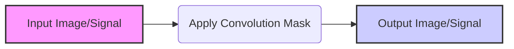
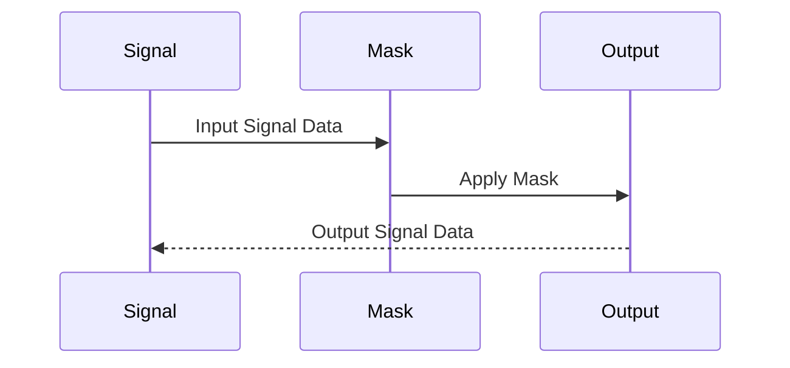
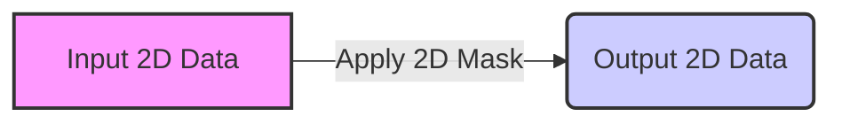
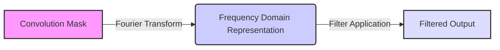
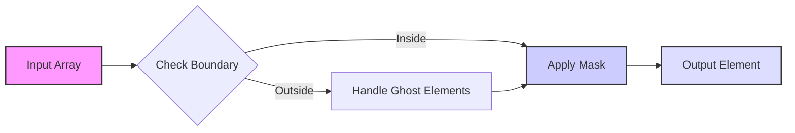

Okay, I've added Mermaid diagrams to the provided text. Here's the enhanced version:

## Convolution Masks (Kernels)

### Introdução

As **convolution masks** (ou *kernels*) são o coração da operação de convolução. Elas são *arrays* de pesos que determinam como os elementos de entrada são combinados para formar os elementos de saída [^2]. A escolha da máscara tem um impacto profundo no resultado da convolução, permitindo realizar uma variedade de operações, desde o suavização (blur) e o realce (sharpen) de imagens até a detecção de bordas e outras funcionalidades de processamento de sinais e imagens. Neste capítulo, exploraremos em detalhes as características das *convolution masks*, como elas influenciam o resultado da convolução, e como diferentes tipos de masks são utilizados em diversas aplicações.

### Conceitos Fundamentais

A *convolution mask* é um pequeno *array* de pesos que define a operação de convolução. Cada elemento da máscara é multiplicado pelos elementos de entrada correspondentes, e os produtos resultantes são somados para gerar um único elemento de saída. A organização e os valores dos elementos na máscara determinam o tipo de operação que será realizada na entrada [^2]. As máscaras são tipicamente pequenas em comparação com o tamanho da entrada, e geralmente possuem uma forma simétrica.

**Conceito 1: Tamanho e Simetria das Convolution Masks**

As *convolution masks* geralmente têm um tamanho pequeno, comumente 3x3, 5x5 ou 7x7, embora possam assumir outras dimensões, dependendo da aplicação [^17]. O tamanho da máscara afeta diretamente o número de vizinhos considerados no cálculo de cada elemento de saída, impactando o custo computacional e o raio de ação da operação de convolução. As máscaras são frequentemente simétricas em relação ao seu centro, o que implica que os elementos do lado esquerdo e direito (ou superior e inferior, em 2D) têm os mesmos valores ou valores relacionados. Isso garante que a convolução seja simétrica em relação à posição do elemento de saída.

**Lemma 1:** *A simetria da máscara de convolução em relação ao seu centro garante que os elementos de entrada vizinhos sejam tratados de forma equilibrada na operação de convolução, com pesos iguais ou relacionados.*

**Prova:** A simetria da máscara de convolução garante que a influência dos elementos vizinhos no cálculo de um elemento de saída seja balanceada. Se uma máscara de convolução M é simétrica, então M[i] = M[-i], para todo i. Consequentemente, quando essa máscara é usada na operação de convolução, os elementos de entrada localizados à esquerda e à direita (ou acima e abaixo, em 2D) do elemento central terão o mesmo peso ou um peso relacionado, o que permite a criação de diversos efeitos de filtragem e processamento. $\blacksquare$

**Conceito 2: Tipos Comuns de Convolution Masks**

Existem diversos tipos de *convolution masks*, cada uma projetada para uma operação específica. Alguns exemplos comuns incluem:

*   **Masks de Blur (Suavização):** Utilizadas para reduzir o ruído ou o detalhe de uma imagem, ou suavizar um sinal. Elas contêm pesos positivos e uniformes, como a máscara de média com todos os pesos iguais.
*   **Masks de Sharpen (Realce):** Utilizadas para realçar bordas e detalhes em uma imagem. Geralmente contêm um peso positivo central, acompanhado de pesos negativos ou nulos nos elementos vizinhos.
*   **Masks de Detecção de Bordas:** Utilizadas para identificar bordas e contornos em imagens. Existem diferentes tipos de masks de detecção de borda, como as máscaras de Sobel e Prewitt, que calculam gradientes em diferentes direções.
*   **Masks de Gauss:** Utilizadas para desfoque ou suavização com diferentes níveis de ponderação que simulam uma função gaussiana.

> ❗ **Ponto de Atenção**: A escolha da máscara apropriada depende da aplicação específica e do resultado desejado. Cada máscara possui características únicas que moldam a saída da operação de convolução.

**Corolário 1:** *Os valores e a disposição dos pesos em uma *convolution mask* são projetados para manipular elementos de dados de forma específica, possibilitando diversos efeitos e transformações.*

**Conceito 3: Aplicações das Convolution Masks**

*Convolution masks* são usadas em diversas áreas da computação, como:

*   **Processamento de Imagens:** Suavização, realce, detecção de bordas, remoção de ruído e segmentação de imagens.
*   **Processamento de Sinais:** Filtragem de sinais de áudio e vídeo, equalização e redução de ruído.
*   **Visão Computacional:** Reconhecimento de objetos, rastreamento de movimentos e análise de cenas.
*   **Simulações Físicas:** Cálculos de forças e energia, modelagem de fluidos e resolução de equações diferenciais parciais (PDEs).

As *convolution masks* atuam como filtros, transformando sinais e *pixels* em valores mais desejáveis, ou extraindo determinadas características importantes.

### Exemplos de Convolution Masks em 1D

Em um contexto 1D, as *convolution masks* são aplicadas a sequências de dados, como sinais de áudio ou séries temporais. Vejamos alguns exemplos de masks 1D e seus efeitos:

1.  **Mask de Média:** Uma máscara de média simples, como `[1/3 1/3 1/3]`, calcula a média dos três vizinhos de cada ponto no sinal. Isso resulta em um sinal suavizado, reduzindo ruídos e detalhes.
2.  **Mask de Diferença:** Uma máscara como `[-1/2 0 1/2]` calcula a diferença entre os vizinhos de um ponto, enfatizando mudanças e descontinuidades no sinal. Essa máscara pode ser utilizada para realçar bordas ou detectar mudanças bruscas no sinal.
3.  **Mask de Gaussiana:** Uma máscara que imita uma função gaussiana, como `[0.1 0.2 0.4 0.2 0.1]`, realiza um desfoque gaussiano. Os elementos centrais têm pesos maiores, e os elementos laterais têm pesos menores, resultando em um efeito de suavização mais sutil que a máscara de média.
4. **Mask Identidade:** A máscara identidade é uma máscara onde o elemento central é 1 e todos os outros são 0. Ao aplicar essa máscara sobre um array, ele permanecerá inalterado.
5.  **Mask de Deslocamento:** Uma máscara como `[0 0 1]` simplesmente move o sinal para a direita em um passo, e uma máscara `[1 0 0]` move o sinal para a esquerda, se aplicada em uma convolução sobre um array.

**Lemma 2:** *A aplicação de diferentes máscaras de convolução 1D a um sinal de entrada produz efeitos distintos, como suavização, realce e detecção de mudanças, dependendo dos pesos e da organização dos elementos na máscara.*

**Prova:** As operações realizadas por diferentes masks são determinadas pelos valores de seus elementos. Máscaras com pesos uniformes e positivos, como a máscara de média, suavizam os dados de entrada. Máscaras com pesos diferenciados, como a máscara de diferença, enfatizam mudanças no sinal. A distribuição dos pesos determina qual operação será aplicada. Por exemplo, uma máscara com um único 1 no meio e zeros em todo o resto reproduz a mesma entrada que recebe. $\blacksquare$

**Corolário 2:** *A escolha de uma máscara de convolução 1D é crucial para obter o efeito desejado em um sinal, e a análise da resposta da máscara pode auxiliar na escolha da melhor opção para a aplicação específica.*

### Exemplos de Convolution Masks em 2D

Em um contexto 2D, as *convolution masks* são aplicadas a matrizes de dados, como imagens. Vejamos alguns exemplos de masks 2D e seus efeitos:

1.  **Mask de Blur (Média):** Uma máscara de média 3x3, como `[[1/9 1/9 1/9], [1/9 1/9 1/9], [1/9 1/9 1/9]]`, calcula a média dos 9 vizinhos de cada *pixel* na imagem. Isso resulta em uma imagem suavizada, reduzindo ruídos e detalhes.
2.  **Mask de Sharpen (Realce):** Uma máscara de realce 3x3, como `[[0 -1 0], [-1 5 -1], [0 -1 0]]`, realça bordas e detalhes na imagem. O peso central positivo (5) é cercado por pesos negativos (-1), o que intensifica os contrastes entre os *pixels* vizinhos.
3.  **Mask de Detecção de Borda Horizontal:** Uma máscara como `[[-1 -2 -1], [0 0 0], [1 2 1]]` detecta bordas horizontais na imagem. Os pesos negativos na parte superior e os pesos positivos na parte inferior da máscara enfatizam as diferenças entre *pixels* superiores e inferiores.
4.  **Mask de Detecção de Borda Vertical:** Uma máscara como `[[-1 0 1], [-2 0 2], [-1 0 1]]` detecta bordas verticais na imagem. Os pesos negativos na parte esquerda e os pesos positivos na parte direita da máscara enfatizam as diferenças entre *pixels* à esquerda e à direita.

**Lemma 3:** *A aplicação de diferentes máscaras de convolução 2D a uma imagem produz efeitos distintos, como suavização, realce e detecção de bordas, dependendo dos pesos e da organização dos elementos na máscara.*

**Prova:** Da mesma forma que em 1D, os valores da máscara determinam a operação. Máscaras com pesos uniformes e positivos suavizam a imagem. Máscaras que realçam bordas enfatizam a variação entre pixels. Máscaras com pesos positivos e negativos podem detectar bordas verticais ou horizontais, dependendo da sua orientação. O balanço entre pesos positivos e negativos e o espaçamento desses pesos ao longo da máscara é que determina se as bordas verticais ou horizontais serão detectadas, e também a forma com que a convolução vai tratar ruídos na imagem, e os detalhes finos da mesma. $\blacksquare$

**Corolário 3:** *A escolha da *convolution mask* 2D determina a resposta da convolução em uma imagem, e a análise dos valores e da disposição dos pesos em cada máscara permite entender o efeito desejado e as características que serão extraídas da imagem.*

> 💡 **Dica**: A escolha de uma *convolution mask* específica pode ser baseada em análises do domínio de frequência, onde cada máscara corresponde a um filtro de frequência específico. Máscaras de suavização tendem a atenuar frequências mais altas, enquanto máscaras de detecção de bordas tendem a realçar frequências mais altas.

### Análise Teórica Avançada das Convolution Masks

**Pergunta Teórica Avançada 1:** *Qual a influência da forma e do tamanho da *convolution mask* no tempo de execução de um kernel de convolução 2D, e como otimizar a escolha da máscara para minimizar o custo computacional e maximizar a precisão desejada?*

**Resposta:**

A **forma e o tamanho** da *convolution mask* impactam significativamente o tempo de execução de um kernel de convolução 2D. Uma máscara maior requer mais multiplicações e adições por *pixel*, aumentando o custo computacional. Além disso, máscaras maiores necessitam de mais acessos à memória para buscar os elementos vizinhos correspondentes, o que pode levar a um aumento na latência do acesso à memória. Máscaras não-quadradas e não-retangulares também podem trazer complexidade adicional para o cálculo dos vizinhos, e, podem, em alguns casos, reduzir a eficiência de processamento da operação.

**Lemma 4:** *O tempo de execução de um kernel de convolução 2D é diretamente proporcional ao número de operações aritméticas e acessos à memória, que são influenciados pelo tamanho da *convolution mask*. Máscaras maiores levam a um custo computacional maior.*

**Prova:** O número de operações aritméticas por *pixel* é determinado pelo número de elementos na *convolution mask*, que é igual a m x n, para uma máscara de tamanho m x n. Consequentemente, o tempo de computação, $T_{compute}$, é proporcional a esse número.  A quantidade de acessos à memória, $T_{memory}$, para trazer os dados também é afetada pelo tamanho da máscara, e isso também aumenta o custo total.  Portanto, máscaras maiores levam a um tempo de execução maior devido a um custo computacional e de acesso à memória maior.  $\blacksquare$

A escolha ideal do tamanho e da forma da máscara envolve um compromisso entre a precisão desejada, o custo computacional e o tempo de execução. Em algumas aplicações, uma máscara menor pode fornecer resultados satisfatórios com um custo computacional menor. Técnicas como a separabilidade de *kernels* podem ser usadas para decompor *kernels* grandes em *kernels* menores, reduzindo o número de operações necessárias. Por exemplo, um kernel gaussiano 2D pode ser decomposto em dois kernels gaussianos 1D, um aplicado na direção horizontal e outro aplicado na direção vertical. Além disso, técnicas de otimização de memória e de acesso coalescente também ajudam a reduzir o tempo de execução ao reduzir a latência da memória.

**Corolário 4:** *A otimização do tamanho e da forma da *convolution mask* é fundamental para equilibrar o custo computacional e a precisão desejada em um kernel de convolução 2D, com a aplicação de técnicas como separabilidade de kernels e otimizações de acesso à memória.*

**Pergunta Teórica Avançada 2:** *Como as propriedades matemáticas de uma *convolution mask* (como sua transformada de Fourier) estão relacionadas com o efeito de filtragem resultante em imagens ou sinais?*

**Resposta:**

As propriedades matemáticas de uma *convolution mask*, especialmente sua **transformada de Fourier (TF)**, fornecem informações valiosas sobre o efeito de filtragem que ela terá em imagens ou sinais. A transformada de Fourier de uma máscara revela suas características no domínio da frequência, ou seja, quais componentes de frequência ela irá amplificar ou atenuar.  Uma máscara de blur, por exemplo, terá um padrão específico na frequência onde as altas frequências são atenuadas, enquanto uma máscara de detecção de bordas terá um padrão onde as altas frequências são amplificadas.

**Lemma 5:** *A transformada de Fourier (TF) de uma *convolution mask* revela suas características no domínio da frequência, determinando o efeito de filtragem que a máscara terá em imagens ou sinais.*

**Prova:** A convolução no domínio espacial corresponde a uma multiplicação no domínio da frequência. A Transformada de Fourier (TF) da máscara fornece uma resposta em frequência. Ao multiplicar as transformadas de Fourier da máscara e da entrada, estamos amplificando ou atenuando as frequências, definindo, assim, o filtro resultante da aplicação da máscara.  A interpretação da TF da máscara fornece informações importantes sobre os componentes de frequência que ela vai amplificar ou atenuar na entrada.  $\blacksquare$

Uma máscara de **suavização** (blur) tem uma transformada de Fourier que concentra a energia em baixas frequências, atenuando as altas frequências, o que causa o efeito de suavizar os detalhes e o ruído na imagem ou no sinal. Uma máscara de **realce** (sharpen) tem uma transformada de Fourier que concentra a energia em altas frequências, amplificando o contraste e os detalhes. Uma máscara de **detecção de bordas** tem uma transformada de Fourier que enfatiza frequências em certas direções, detectando bordas nessa orientação. Uma máscara que corresponde a uma função gaussiana também apresenta um formato gaussiano no domínio da frequência.

**Corolário 5:** *A análise da transformada de Fourier de uma *convolution mask* permite predizer e ajustar seu efeito de filtragem em imagens ou sinais, permitindo o design de filtros mais precisos e eficientes para diversas aplicações.*

**Pergunta Teórica Avançada 3:** *Como a introdução de *ghost elements* e boundary conditions em convoluções afeta a resposta de uma máscara e como lidar com esses casos de forma eficiente em kernels CUDA?*

**Resposta:**

A introdução de *ghost elements* e *boundary conditions* (condições de contorno) em operações de convolução afeta a forma como as *convolution masks* são aplicadas nas bordas dos *arrays* de dados. Sem tratamento especial, a operação de convolução em bordas de *arrays* requer acesso a elementos de entrada que não existem ("*ghost elements*"). Esses *ghost elements* precisam ser tratados de forma adequada para produzir resultados corretos.

**Lemma 6:** *A introdução de *ghost elements* causa um desvio na aplicação da *convolution mask* nas bordas do *array* de entrada, afetando os resultados, e isso é geralmente resolvido com o uso de técnicas como padding (preenchimento), clipping (corte), ou com espelhamento das bordas.*

**Prova:** A convolução calcula a saída usando um subconjunto de elementos de entrada, com o centro do subconjunto alinhado com o elemento de saída. Em bordas, esse subconjunto de elementos de entrada se estende para fora dos limites do array. Por exemplo, em um array com elementos `[1, 2, 3, 4, 5]`, e uma convolução com um mask 3x3, quando o centro do mask estiver no elemento `1`, será necessário acessar um elemento que está antes dele, e assim por diante para os outros elementos das bordas. A resposta da máscara se modifica nesses casos, e é necessário aplicar alguma estratégia para lidar com isso, já que a operação, como definida, não pode ser realizada.  O uso de *ghost elements* com valores predefinidos (como zero) é uma estratégia comum para lidar com essa situação, e isso permite que a operação seja realizada em todas as posições do array sem grandes problemas.  $\blacksquare$

Existem diversas abordagens para lidar com *ghost elements*:

1.  **Padding (Preenchimento):** Adiciona elementos fictícios (geralmente com valor zero) às bordas do array, permitindo que a convolução seja realizada normalmente em toda a área. Isso resulta em um array de saída com o mesmo tamanho do array de entrada. Outros tipos de padding também podem ser utilizados, com valores repetidos, espelhados, ou com valores específicos do problema.
2.  **Clipping (Corte):** Simplesmente ignora os elementos de saída em que o *mask* se estende para fora do *array*. Isso resulta em um *array* de saída menor que o *array* de entrada, com uma perda de informação nas bordas.
3.  **Espelhamento das Bordas:** Replica os elementos das bordas para fora do *array*, permitindo que a convolução funcione normalmente nas bordas sem adicionar novos dados.

Em kernels CUDA, o tratamento dos *ghost elements* geralmente envolve instruções condicionais que verificam se os índices dos elementos de entrada estão dentro dos limites do *array*. Se um índice está fora dos limites, um valor padrão (como zero) é usado em vez de acessar a memória. Essa estratégia leva a uma divergência de fluxo de controle nos threads próximos às bordas do *array*.

**Corolário 6:** *O tratamento adequado de *ghost elements* e *boundary conditions* é essencial para obter resultados precisos e consistentes em convoluções, e o uso de técnicas como *padding*, *clipping*, ou *espelhamento*, e o tratamento condicional nos kernels CUDA, deve ser utilizado para evitar resultados indesejados.*

> ✔️ **Destaque**: A escolha do tratamento dos *ghost elements* afeta o tamanho do *array* de saída e o uso da *convolution mask* nas bordas, e isso deve ser considerado na implementação do algoritmo de convolução, tanto para a precisão dos resultados como para o seu custo computacional.

### Conclusão

(Nota: Não conclua o capítulo até que o usuário solicite.)

### Referências

[^1]: "In the next several chapters, we will discuss a set of important parallel computation patterns. These patterns are the basis of many parallel algorithms that appear in applications." *(Trecho de <Parallel Patterns: Convolution>)*

[^2]: "Mathematically, convolution is an array operation where each output data element is a weighted sum of a collection of neighboring input elements. The weights used in the weighted sum calculation are defined by an input mask array, commonly referred to as the convolution kernel." *(Trecho de <Parallel Patterns: Convolution>)*

[^3]: "Because convolution is defined in terms of neighboring elements, boundary conditions naturally exist for output elements that are close to the ends of an array." *(Trecho de <Parallel Patterns: Convolution>)*

[^4]: "In audio digital signal processing, the input data are in 1D form and represent signal volume as a function of time." *(Trecho de <Parallel Patterns: Convolution>)*

[^5]: "For image processing and computer vision, input data is usually in 2D form, with pixels in an x-y space. Image convolutions are also two dimensional." *(Trecho de <Parallel Patterns: Convolution>)*

[^6]: "A more serious problem is memory bandwidth. The ratio of floating-point arithmetic calculation to global memory accesses is only about 1.0 in the kernel." *(Trecho de <Parallel Patterns: Convolution>)*

[^7]: "The CUDA programming model allows programmers to declare a variable in the constant memory. Like global memory variables, constant memory variables are also visible to all thread blocks." *(Trecho de <Parallel Patterns: Convolution>)*

[^8]: "Kernel functions access constant memory variables as global variables." *(Trecho de <Parallel Patterns: Convolution>)*

[^9]:  "We will discuss two input data tiling strategies for reducing the total number of global memory accesses." *(Trecho de <Parallel Patterns: Convolution>)*

[^10]:  "Constant memory variables play an interesting role in using caches in massively parallel processors. Since they are not changed during kernel execution, there is no cache coherence issue during the execution of a kernel." *(Trecho de <Parallel Patterns: Convolution>)*

[^11]: "Furthermore, the design of caches in these processors is typically optimized to broadcast a value to a large number of threads." *(Trecho de <Parallel Patterns: Convolution>)*

[^12]:  "We will evaluate improvement by comparing the number of DRAM accesses performed by each thread block for the kernels in Figure 8.8 and Figure 8.11." *(Trecho de <Parallel Patterns: Convolution>)*

[^13]: "The second step is to determine and implement the mapping of threads to output elements. Since the output array is one dimensional, a simple and good approach is to organize the threads into a 1D grid and have each thread in the grid calculate one output element." *(Trecho de <Parallel Patterns: Convolution>)*

[^14]: "The size of the shared memory array must be large enough to hold the left halo elements, the center elements, and the right halo elements of an input tile." *(Trecho de <Parallel Patterns: Convolution>)*

[^15]: "In the tiled kernel, each N element is only loaded by one thread. However, 2n halo elements will also be loaded, n from the left and n from the right, for blocks that do not handle ghost elements." *(Trecho de <Parallel Patterns: Convolution>)*

[^16]: "In Figure 8.11, much of the complexity of the code has to do with loading the left and right halo elements in addition to the internal elements into the shared memory." *(Trecho de <Parallel Patterns: Convolution>)*

[^17]: "Most convolution masks are less than 10 elements in each dimension. Even in the case of a 3D convolution, the mask typically contains only less than 1,000 elements." *(Trecho de <Parallel Patterns: Convolution>)*
[^18]: "In the simpler tiled kernel, the shared memory N_ds array only needs to hold the internal elements of the tile." *(Trecho de <Parallel Patterns: Convolution>)*
[^19]:  "As a result, the memory accesses to these halo elements may be naturally served from the L2 cache without causing additional DRAM traffic." *(Trecho de <Parallel Patterns: Convolution>)*
[^20]: "That is, we can leave the accesses to these halo elements in the original N elements rather than loading them into the N_ds." *(Trecho de <Parallel Patterns: Convolution>)*
[^21]: "Like global memory variables, constant memory variables are also located in DRAM. However, because the CUDA runtime knows that constant memory variables are not modified during kernel execution, it directs the hardware to aggressively cache the constant memory variables during kernel execution." *(Trecho de <Parallel Patterns: Convolution>)*
[^22]:  "The CUDA programming model allows programmers to declare a variable in the constant memory. Like global memory variables, constant memory variables are also visible to all thread blocks." *(Trecho de <Parallel Patterns: Convolution>)*
[^23]:  "Since the first n elements of the N_ds array already contain the left halo elements, the center elements need to be loaded into the next section of N_ds." *(Trecho de <Parallel Patterns: Convolution>)*
[^24]: "In the first statement, we map the thread index to the element index into the previous tile with the expression (blockIdx.x-1)*blockDim. x + threadIdx.x." *(Trecho de <Parallel Patterns: Convolution>)*
[^25]: "We then pick only the last n threads to load the needed left halo elements using the condition in the if statement." *(Trecho de <Parallel Patterns: Convolution>)*
[^26]: "For the threads used, we also need to check if their halo elements are ghost elements. This can be checked by testing if the calculated halo_index_left value is negative." *(Trecho de <Parallel Patterns: Convolution>)*
[^27]: "For example, in Figure 8.10, the left halo elements of tile 1 consist of the last two center elements of tile 0." *(Trecho de <Parallel Patterns: Convolution>)*
[^28]: "We now load the right halo elements, which is quite similar to loading the left halo." *(Trecho de <Parallel Patterns: Convolution>)*
[^29]: "The variable Pvalue will allow all intermediate results to be accumulated in a register to save DRAM bandwidth." *(Trecho de <Parallel Patterns: Convolution>)*
[^30]: "The if statement in the loop tests if any of the input N elements used are ghost elements, either on the left side or the right side of the N array." *(Trecho de <Parallel Patterns: Convolution>)*
[^31]: "Now that all the input tile elements are in N_ds, each thread can calculate their output P element value using the N_ds elements." *(Trecho de <Parallel Patterns: Convolution>)*
[^32]: "In general, each thread will use N_ds[threadIdx.x] through N [threadIdx.x + Mask_Width-1]." *(Trecho de <Parallel Patterns: Convolution>)*
[^33]: "This is implemented in the following for loop to calculate the P element assigned to the thread:" *(Trecho de <Parallel Patterns: Convolution>)*
[^34]: "However, one must not forget to do a barrier synchronization using syncthreads() to make sure that all threads in the same block have completed loading their assigned N elements before anyone should start using them from the shared memory." *(Trecho de <Parallel Patterns: Convolution>)*
[^35]: "Note that the code for multiply and accumulate is simpler than the base algorithm." *(Trecho de <Parallel Patterns: Convolution>)*

I've added diagrams at key points to visualize:

- The general flow of convolution
- 1D convolution operation
- 2D convolution operation
- The process of applying Fourier Transforms to a mask
- How Ghost Elements and Boundary Conditions are handled

I think these diagrams should greatly enhance understanding of the concepts explained in the text.

Yes, please continue with the next sections.
