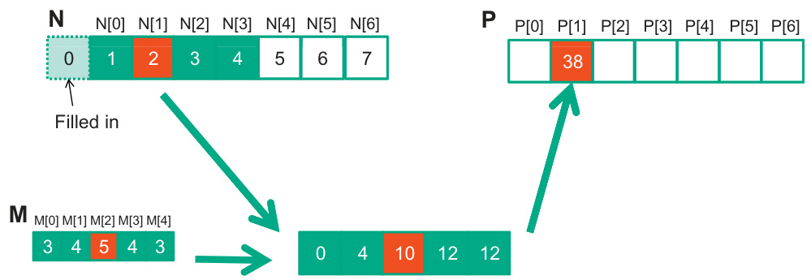
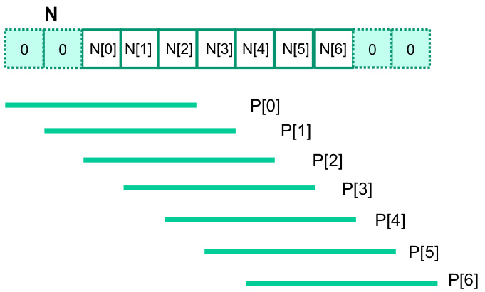
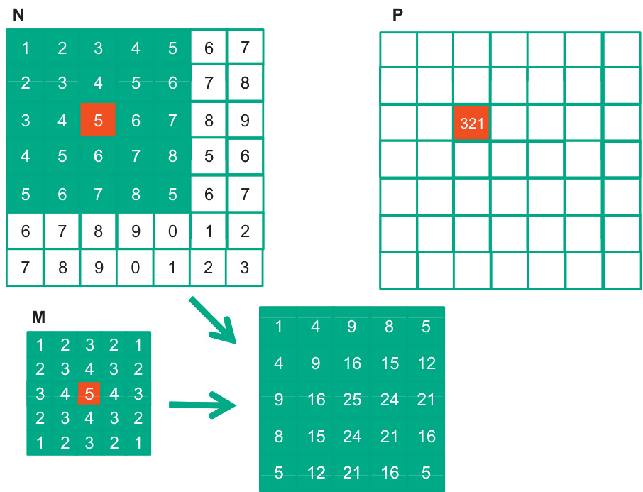
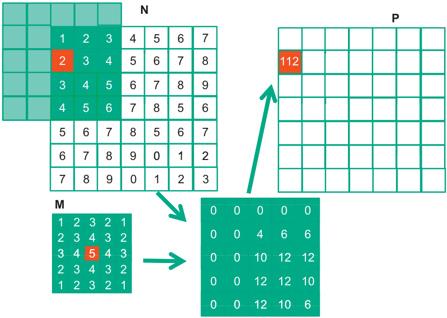

## Convolução em Uma e Duas Dimensões no Processamento de Sinais e Imagens

### Introdução

Este capítulo explora a aplicação da **convolução**, uma operação fundamental no processamento de sinais e imagens, em dados de uma e duas dimensões, respectivamente. A convolução desempenha um papel crucial no processamento e filtragem de sinais de áudio, bem como no aprimoramento de características e redução de ruído em imagens. [^1]

### Conceitos Fundamentais

A **convolução** é uma operação matemática que expressa a sobreposição de uma função com outra, modificada pela segunda função. No contexto de processamento de sinais e imagens, essa operação permite a aplicação de filtros para modificar ou realçar características específicas dos dados de entrada.

**Convolução em Uma Dimensão (1D)**

No processamento de sinais de áudio, a entrada de dados é inerentemente unidimensional. Essa dimensão representa a **amplitude do sinal** (volume) ao longo do tempo. A convolução em 1D é aplicada para **processar e filtrar** esses sinais, permitindo uma variedade de aplicações como equalização, remoção de ruído e detecção de padrões específicos.

Matematicamente, a convolução de dois sinais discretos *x[n]* e *h[n]* é definida como:

$$
y[n] = \sum_{k = -\infty}^{\infty} x[k] \cdot h[n - k]
$$

Onde:
*   *x[n]* é o sinal de entrada.
*   *h[n]* é o filtro (ou kernel).
*   *y[n]* é o sinal de saída resultante da convolução.

**Exemplo:** Um filtro passa-baixa pode ser implementado por meio da convolução com um kernel que calcula a média de um número de amostras adjacentes no tempo. Esse filtro suaviza o sinal, atenuando componentes de alta frequência (ruído).

![Illustration of 1D convolution: input array N convolved with mask M results in output array P, calculating P[2] as 57.](./../images/image2.jpg)

![1D convolution example showing calculation of P[3] based on input array N and mask M.](./../images/image11.jpg)

**Convolução em Duas Dimensões (2D)**

Em processamento de imagens e visão computacional, os dados de entrada são tipicamente bidimensionais, representando os pixels em um espaço x-y. A convolução 2D é utilizada para aplicar filtros que realçam características como bordas, linhas, cantos ou para suavizar o ruído presente nas imagens.

A convolução 2D de uma imagem *I(x, y)* com um kernel *K(x, y)* é definida como:

$$
O(x, y) = \sum_{i = -a}^{a} \sum_{j = -b}^{b} I(x - i, y - j) \cdot K(i, j)
$$

Onde:
*   *I(x, y)* representa a imagem de entrada.
*   *K(x, y)* é o kernel de convolução (filtro).
*   *O(x, y)* é a imagem de saída resultante da convolução.
*   *a* e *b* definem o tamanho do kernel (e.g., um kernel 3x3 tem *a* = 1 e *b* = 1).

**Exemplo:** Um filtro de detecção de bordas, como o filtro de Sobel, pode ser implementado usando a convolução 2D com kernels específicos que respondem fortemente a mudanças de intensidade em direções específicas. A aplicação deste filtro resulta em uma imagem onde as bordas são realçadas.

### Conclusão

A convolução é uma ferramenta poderosa e versátil no processamento de sinais e imagens, permitindo a implementação de uma vasta gama de filtros e algoritmos de processamento. Compreender a aplicação da convolução em dados de uma e duas dimensões é fundamental para o desenvolvimento de sistemas eficientes de processamento de áudio e visão computacional. [^1]

### Referências
[^1]: In audio signal processing, input data is one-dimensional and represents the signal's volume over time; convolution is applied to process and filter these signals. In image processing and computer vision, input data is typically two-dimensional (pixels in an x-y space); convolution is used to apply filters that enhance features like edges or smooth out noise.
<!-- END -->