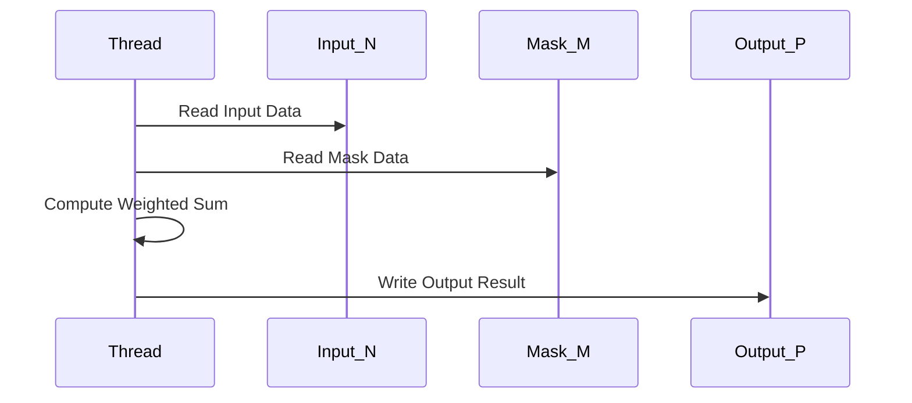
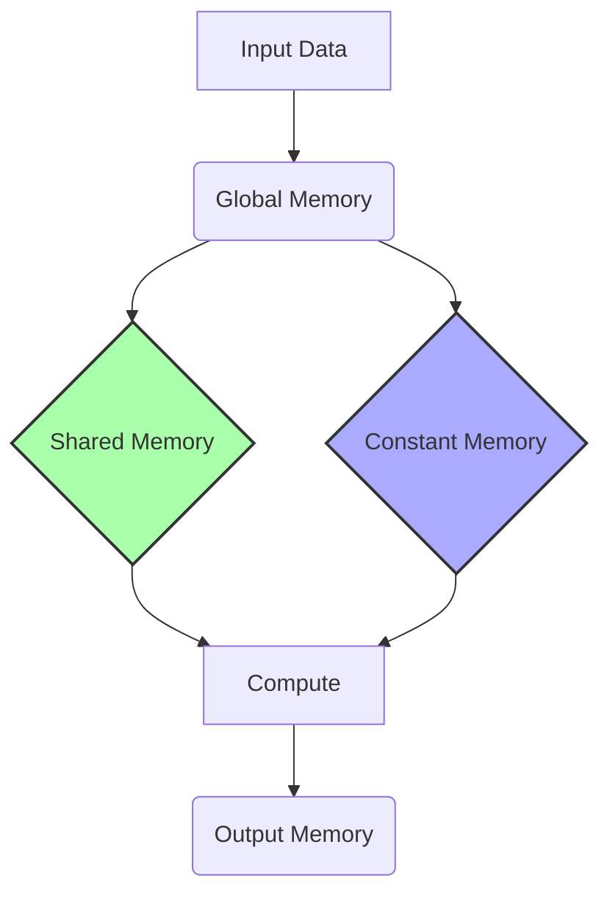
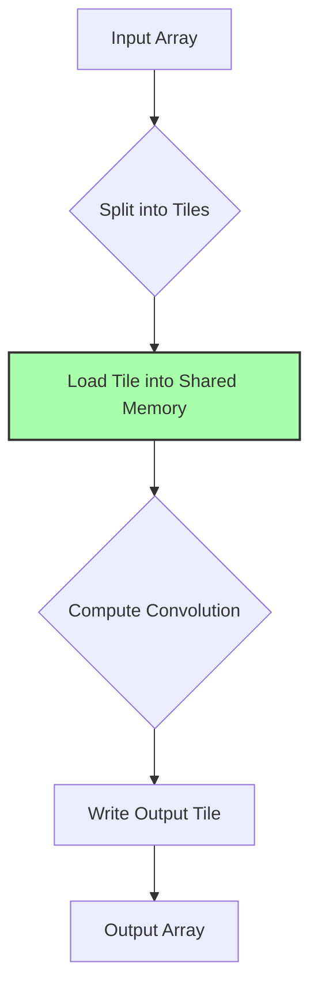
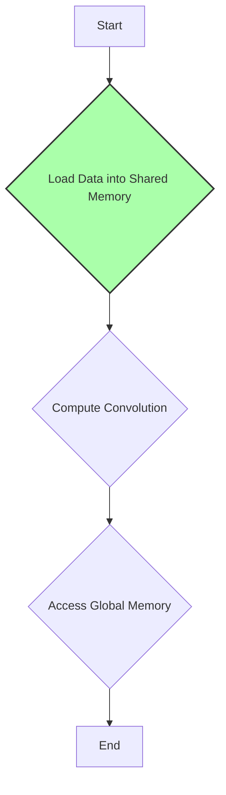

Okay, I will add Mermaid diagrams to enhance the text, focusing on architectural and system relationships using flowcharts and sequence diagrams.

## 2D Convolution

```mermaid
flowchart TD
    A[Input Array "N"] --> B{Apply Convolution Mask "M"};
    B --> C[Output Array "P"];
    style A fill:#f9f,stroke:#333,stroke-width:2px
    style C fill:#ccf,stroke:#333,stroke-width:2px
```

### Introdução

A **convolução 2D** é uma operação fundamental no processamento de imagens, visão computacional e outras aplicações que envolvem dados bidimensionais. Ela estende o conceito da convolução 1D, aplicando uma *convolution mask* 2D a um *array* de entrada 2D, calculando uma soma ponderada dos vizinhos de cada *pixel*. A convolução 2D é uma ferramenta essencial para uma variedade de tarefas, desde o suavização e o realce de imagens até a detecção de bordas e a extração de características. Neste capítulo, exploraremos os detalhes da convolução 2D, sua implementação em CUDA e as otimizações necessárias para atingir alto desempenho.

### Conceitos Fundamentais da Convolução 2D

A convolução 2D é uma operação que aplica uma *convolution mask* 2D a um *array* de entrada 2D, gerando um *array* de saída 2D que representa uma versão modificada da entrada [^5]. O processo envolve os seguintes passos:

1.  **Deslizamento da Máscara:** Uma *convolution mask* 2D (kernel) desliza sobre o *array* de entrada 2D, tanto horizontalmente quanto verticalmente, um elemento de cada vez.
2.  **Multiplicação e Soma:** Em cada posição, os elementos da máscara são multiplicados pelos elementos correspondentes do *array* de entrada, e os produtos resultantes são somados para gerar um único elemento do *array* de saída.
3.  **Repetição:** Os passos 1 e 2 são repetidos para cada posição do *array* de entrada, produzindo um elemento de saída correspondente.

**Conceito 1: A Operação Matemática da Convolução 2D**

Matematicamente, a convolução 2D de um *array* de entrada N de dimensões ($N_h$ x $N_w$) com uma *convolution mask* M de dimensões ($M_h$ x $M_w$), para gerar um *array* de saída P, é definida como:

$$
P[i, j] = \sum_{y=-n_h}^{n_h} \sum_{x=-n_w}^{n_w} N[i+y, j+x] \cdot M[y, x]
$$

Onde $n_h$ e $n_w$ são metade da altura e largura da máscara, respectivamente. *i* e *j* são os índices do elemento de saída e *x* e *y* são os deslocamentos nos eixos horizontal e vertical, respectivamente.

**Lemma 1:** *A operação de convolução 2D é uma soma ponderada dos elementos vizinhos da entrada, onde os pesos são definidos pela convolution mask M, resultando no array de saída P.*

**Prova:** A fórmula define que a saída P[i, j] é uma soma de produtos, onde os elementos do array N são multiplicados pelos elementos da *convolution mask* M, e a soma resultante desses produtos representa o valor da saída. $\blacksquare$

**Conceito 2: Índices e Deslocamentos na Convolução 2D**

Para calcular cada elemento do *array* de saída corretamente, é crucial entender como os índices da máscara e do *array* de entrada se relacionam. Os índices do elemento de saída *i* e *j* definem o ponto central da convolução, e os índices *x* e *y* definem o deslocamento a partir desse ponto nas direções horizontal e vertical. Se a largura da máscara é $2n_w + 1$ e a altura é $2n_h + 1$, então *x* varia de $-n_w$ a $n_w$ e *y* varia de $-n_h$ a $n_h$.

> ❗ **Ponto de Atenção**: Assim como na convolução 1D, as *boundary conditions* são importantes para lidar com os elementos de saída nas bordas do array, onde a máscara pode se estender para além dos limites do *array* de entrada.

**Corolário 1:** *O cálculo preciso dos índices e deslocamentos garante a correta aplicação da convolution mask sobre o array de entrada, resultando na saída correta da convolução 2D.*

**Conceito 3: Aplicações da Convolução 2D**

A convolução 2D é amplamente utilizada em diversas áreas:

*   **Processamento de Imagens:** Suavização, realce, detecção de bordas, remoção de ruído, segmentação de imagens.
*   **Visão Computacional:** Reconhecimento de padrões, rastreamento de objetos, extração de características, classificação de imagens.
*   **Simulações Físicas:** Cálculos de forças e energias em modelos 2D, modelagem de fluidos.
*  **Aprendizado de Máquina:** Camadas convolucionais em redes neurais profundas (CNNs) para processamento de dados bidimensionais.

A convolução 2D é um componente essencial para a análise e manipulação de dados bidimensionais.

### Implementação da Convolução 2D em CUDA



A implementação de um kernel CUDA para convolução 2D segue os mesmos princípios básicos da implementação 1D, mas com uma maior complexidade no cálculo dos índices e no tratamento das dimensões adicionais [^5]. O kernel deve realizar as seguintes tarefas:

1.  **Calcular o Índice do Elemento de Saída:** Determinar o índice do elemento do *array* de saída que o thread atual vai calcular utilizando:
    ```cpp
    int i = blockIdx.y * blockDim.y + threadIdx.y;
    int j = blockIdx.x * blockDim.x + threadIdx.x;
    ```
2.  **Determinar o Ponto Inicial:** Calcular o ponto inicial (superior esquerdo) do subconjunto de elementos de entrada necessários para o cálculo, como em [^5]:
    ```cpp
    int N_start_y = i - (Mask_Height/2);
    int N_start_x = j - (Mask_Width/2);
    ```
3.  **Calcular a Soma Ponderada:** Realizar a multiplicação dos elementos de entrada com os pesos da *convolution mask* e acumular o resultado, de acordo com a fórmula da convolução 2D:
   ```cpp
    float Pvalue = 0;
    for (int y = 0; y < Mask_Height; y++){
        for (int x = 0; x < Mask_Width; x++){
            if( (N_start_y + y >= 0 && N_start_y + y < Height) && (N_start_x + x >= 0 && N_start_x + x < Width)){
                Pvalue += N[(N_start_y + y) * Width + (N_start_x + x)] * M[y*Mask_Width + x];
            }
        }
    }
    ```
4.  **Armazenar o Resultado:** Salvar o valor acumulado na posição de saída correspondente:
   ```cpp
    P[i*Width + j] = Pvalue;
   ```
**Lemma 2:** *A implementação do kernel CUDA para convolução 2D utiliza os índices blockIdx.x, blockIdx.y, blockDim.x, blockDim.y, threadIdx.x e threadIdx.y para mapear cada thread a um elemento de saída, e o cálculo do ponto inicial (N_start_x, N_start_y) e dos loops de soma ponderada garantem que todos os elementos necessários sejam utilizados corretamente.*

**Prova:** A organização dos threads é realizada através de blocos e grids 2D, onde cada thread calcula uma parte da convolução. Os índices i e j garantem que cada thread calcule um valor de P[i, j], e os índices N_start_x e N_start_y juntamente com os loops aninhados garantem que os vizinhos necessários sejam utilizados para o cálculo de cada P[i, j], de acordo com a fórmula da convolução 2D. $\blacksquare$

**Corolário 2:** *O uso de blocos e grids 2D em CUDA permite que a convolução 2D seja realizada em paralelo, com cada thread calculando um ou mais elementos do array de saída, de forma independente.*

> 💡 **Dica:** A máscara de convolução (M) pode ser armazenada na memória constante, para reduzir o número de acessos à memória global, o que pode melhorar significativamente o desempenho [^8].

### Otimizações para Convolução 2D em CUDA



A convolução 2D em CUDA pode ser otimizada utilizando diversas técnicas, similares às otimizações da convolução 1D, mas com considerações adicionais devido às dimensões adicionais [^13]:

1.  **Memória Constante:** Armazenar a *convolution mask* na memória constante para aproveitar o cache e reduzir os acessos à memória global, já que a máscara não muda durante a execução do kernel [^8].
2.  **Memória Compartilhada:** Utilizar memória compartilhada para carregar os *tiles* do *array* de entrada e para reutilizar dados entre os threads do mesmo bloco, reduzindo acessos à memória global. O uso de halo elements é necessário para que todos os dados sejam utilizados sem sobreposição de leitura de elementos na memória global [^14].
3.  **Tiling:** Dividir o array de entrada em tiles 2D e processar cada tile por bloco de threads, para maximizar a reutilização dos dados na memória compartilhada, e otimizar o acesso à memória global [^12].
4.  **Acesso Coalescente:** Organizar o acesso à memória para que as threads acessem os dados de forma contígua, aproveitando os acessos coalescentes à memória global e maximizando a largura de banda.
5.  **Loop Unrolling:** Desenrolar os loops internos da convolução para aumentar a utilização do processador e reduzir o overhead dos loops. O *loop unrolling* permite um maior aproveitamento do processamento paralelo na GPU.

**Lemma 3:** *As otimizações de acesso à memória (memória constante, compartilhada e coalescente) e loop unrolling, reduzem a latência e aumentam a largura de banda, o que melhora o desempenho do kernel CUDA para convolução 2D.*

**Prova:** A utilização da memória constante e da memória compartilhada reduzem a quantidade de acessos à memória global, e o acesso coalescente otimiza os acessos à memória global. O *loop unrolling* permite que mais instruções sejam executadas em paralelo no hardware, e assim, o conjunto dessas otimizações reduz a latência e o overhead do kernel, melhorando a eficiência do processamento paralelo. $\blacksquare$

**Corolário 3:** *A aplicação de otimizações de memória e processamento nos kernels CUDA para convolução 2D melhora o desempenho, ao reduzir o número de acessos à memória global, minimizar a latência, e maximizar a utilização dos recursos da GPU.*

> 💡 **Dica:**  O tamanho do *tile* na convolução 2D deve ser escolhido de forma cuidadosa, para balancear o uso da memória compartilhada, os acessos coalescentes à memória global, e as características do hardware da GPU.

### Tiling na Convolução 2D: Otimização Avançada



A técnica de **tiling** divide o array de entrada 2D em partes menores (tiles) 2D, e cada bloco de threads processa um tile. Isso permite o uso eficiente da memória compartilhada e minimiza o número de acessos à memória global [^12]. O processo de tiling na convolução 2D envolve:

1.  **Carregamento dos Tiles:** Os threads de um bloco carregam o tile correspondente do array de entrada na memória compartilhada. O tamanho da memória compartilhada deve ser suficiente para lidar com o tile e com os *halo elements* necessários, como explicado em [^14].
2.  **Cálculo da Convolução:** Os threads do bloco utilizam os dados carregados na memória compartilhada para calcular os elementos correspondentes do array de saída.
3.  **Repetição:** O processo é repetido para todos os tiles do array de entrada, até que todos os dados sejam processados.

Os **halo elements** também são necessários para o cálculo da convolução em regiões de borda. Em uma convolução 2D, eles correspondem a uma borda ao redor do *tile* que será processado, permitindo que o cálculo da convolução em todas as posições do array seja feito de maneira correta, sem perda de dados.

**Lemma 4:** *A utilização de tiling na convolução 2D permite que cada bloco processe uma região do array de entrada de forma independente, utilizando memória compartilhada para reduzir acessos à memória global e os halo elements para garantir que o cálculo seja correto.*

**Prova:** O tiling divide o array de entrada em partes menores que são processadas de forma independente. Cada bloco carrega o seu tile correspondente na memória compartilhada e realiza o cálculo da convolução, reutilizando os dados locais, o que reduz o número de acessos à memória global. A utilização dos halo elements garante que as operações nas bordas são executadas corretamente. $\blacksquare$

**Corolário 4:** *A escolha de um tamanho de tile adequado deve balancear o uso da memória compartilhada e os acessos à memória global, para obter o melhor desempenho do kernel CUDA para convolução 2D.*

> ⚠️ **Nota Importante:** O tamanho dos tiles deve ser ajustado com base nas características do problema, no tamanho dos arrays de entrada e na arquitetura da GPU, com foco em maximizar o uso da memória compartilhada e do processamento paralelo.

### Análise Teórica Avançada da Convolução 2D

**Pergunta Teórica Avançada 1:** *Como a dimensionalidade da *convolution mask* (e da entrada) afeta a escalabilidade da convolução em CUDA?*

**Resposta:**

A **dimensionalidade** da *convolution mask* e do array de entrada afeta a escalabilidade da convolução em CUDA de maneira significativa. Em convoluções 1D, a operação é realizada sobre um único eixo, e em 2D a operação é realizada em dois eixos. À medida que a dimensionalidade aumenta (como em uma convolução 3D), o número de operações e acessos à memória aumenta exponencialmente, o que influencia a escalabilidade do kernel.

**Lemma 5:** *O aumento da dimensionalidade da convolution mask e do array de entrada leva a um aumento exponencial do número de operações aritméticas e de acessos à memória, o que impacta diretamente a escalabilidade do kernel.*

**Prova:** Em convolução 1D, o número de operações para cada elemento é proporcional à largura da máscara. Em convolução 2D, o número de operações é proporcional ao número de elementos da máscara (largura x altura), e em convoluções 3D o número de operações é proporcional ao volume da máscara (largura x altura x profundidade). Portanto, o aumento da dimensionalidade leva a um crescimento exponencial do número de operações e de acessos à memória para cada elemento de saída, o que impacta a escalabilidade do kernel em um dispositivo de processamento paralelo, como uma GPU. $\blacksquare$

Em arquiteturas de hardware como GPUs, onde a computação paralela é realizada em blocos de threads, a escalabilidade pode ser afetada pela complexidade dos cálculos de índices, pelo uso da memória compartilhada e pela quantidade de dados transferidos entre a CPU e a GPU. À medida que a dimensionalidade aumenta, os problemas de sincronização e comunicação entre os threads podem se tornar um gargalo. Além disso, os problemas associados ao tratamento das *boundary conditions* também são amplificados, e o uso de tiling também fica mais complexo.

**Corolário 5:** *A escalabilidade de um kernel de convolução em CUDA é inversamente proporcional à dimensionalidade dos dados e da máscara. É necessário otimizar tanto o código quanto a arquitetura para lidar com esse aumento da complexidade computacional e de acesso à memória.*

**Pergunta Teórica Avançada 2:** *Quais são as vantagens e desvantagens do uso da memória compartilhada na convolução 2D com tiling, e como otimizar seu uso para maximizar o desempenho do kernel?*

**Resposta:**

O uso da **memória compartilhada** em convoluções 2D com tiling apresenta vantagens e desvantagens que devem ser consideradas para otimizar o desempenho do kernel [^14]. A memória compartilhada é uma área de memória de baixo nível, rápida e acessível a todos os threads dentro de um bloco.

**Vantagens:**

1.  **Redução de acessos à memória global:** Ao carregar os tiles na memória compartilhada, os threads podem reutilizar os dados, reduzindo os acessos à memória global (DRAM), que é mais lenta.
2.  **Aumento da largura de banda:** A memória compartilhada tem uma largura de banda significativamente maior do que a memória global, o que permite um acesso mais rápido aos dados.
3.  **Redução da latência:** O acesso à memória compartilhada tem uma latência menor do que o acesso à memória global, o que melhora o desempenho do kernel.

**Desvantagens:**

1.  **Capacidade limitada:** A capacidade da memória compartilhada é limitada, o que pode restringir o tamanho dos tiles e, consequentemente, reduzir a eficiência da convolução.
2.  **Complexidade de gerenciamento:** O uso da memória compartilhada requer gerenciamento explícito por parte do programador, com o uso de sincronização de threads, o que adiciona complexidade ao código.
3.  **Bank Conflicts:** Threads que acessam bancos de memória compartilhada simultaneamente podem causar conflitos, o que reduz o desempenho do kernel. É necessário organizar o acesso à memória compartilhada, para que diferentes threads não acessem o mesmo banco simultaneamente.

**Lemma 7:** *O uso adequado da memória compartilhada na convolução 2D com tiling leva a uma redução nos acessos à memória global, e uma melhor utilização do processamento paralelo, mas a complexidade do gerenciamento e a capacidade limitada da memória compartilhada devem ser consideradas.*

**Prova:** A memória compartilhada permite que os dados do array de entrada sejam utilizados localmente, ao invés de buscar os dados da memória global a cada acesso, o que reduz o tempo de execução. No entanto, o seu uso tem como desvantagem a limitação da sua capacidade e o overhead adicional necessário para carregar os dados da memória global para a memória compartilhada. $\blacksquare$

A **otimização do uso da memória compartilhada** envolve:

*   Escolher um tamanho de tile que maximize a reutilização dos dados e que caiba na memória compartilhada.
*   Utilizar técnicas de *padding* para evitar que as bordas dos tiles se estendam para fora dos limites do array de entrada.
*   Organizar o acesso à memória compartilhada para minimizar os *bank conflicts*.
*   Utilizar as funções de sincronização de threads (como `syncthreads()`) para garantir que todos os threads tenham acesso aos dados corretamente carregados na memória compartilhada.

**Corolário 7:** *O uso eficiente da memória compartilhada é crucial para otimizar o desempenho da convolução 2D com tiling, e as vantagens e desvantagens precisam ser balanceadas para que o desempenho do kernel seja maximizado.*

### Dedução Teórica Complexa: Modelagem do Tempo de Execução da Convolução 2D com Tiling



O **tempo de execução** de um kernel de convolução 2D com *tiling* pode ser modelado como a soma do tempo gasto no carregamento dos dados para a memória compartilhada ($T_{load}$), no tempo gasto para realizar as operações computacionais ($T_{compute}$) e no tempo gasto acessando a memória global ($T_{memory}$). Este modelo pode ser utilizado para guiar as otimizações necessárias.

A modelagem do tempo de execução pode ser feita como:
$$
T_{kernel} = T_{load} + T_{compute} + T_{memory}
$$
Onde $T_{load}$ representa o tempo de carregamento, $T_{compute}$ o tempo de computação e $T_{memory}$ o tempo gasto acessando a memória global (DRAM).

**Lemma 8:** *O tempo de execução de um kernel de convolução 2D com tiling pode ser modelado como a soma do tempo gasto para o carregamento de tiles para a memória compartilhada, o tempo gasto com o cálculo da convolução, e o tempo de acesso à memória global.*

**Prova:** O tempo total de execução do kernel corresponde à soma do tempo gasto em cada etapa. Cada parte é influenciada por diversos fatores como o tamanho do tile, o tamanho da máscara, o número de threads e a largura de banda de acesso à memória. A análise do tempo gasto em cada etapa permite direcionar as otimizações de forma adequada. $\blacksquare$

O tempo de carregamento, $T_{load}$, pode ser aproximado como:
$$
T_{load} = \frac{(Tile\_Height * Tile\_Width + Halo\_Size)}{BW_{global}} + T_{sync}
$$
Onde  $Tile\_Height$ e $Tile\_Width$ são a altura e largura do tile, $Halo\_Size$ é o tamanho dos halo elements, $BW_{global}$ é a largura de banda da memória global, e $T_{sync}$ o tempo de sincronização dos threads. O tempo de computação, $T_{compute}$ , pode ser aproximado como:
$$
T_{compute} = \frac{(Tile\_Height * Tile\_Width) * (Mask\_Height * Mask\_Width)}{P} * T_{op}
$$
Onde $Mask\_Height$ e $Mask\_Width$ são a altura e largura da máscara, P é o número de threads e $T_{op}$ é o tempo gasto para uma operação de convolução simples. O tempo de acesso à memória global, $T_{memory}$ depende do número de acessos necessários quando ocorre um *cache miss*, ou seja, depende da taxa de acerto do cache.

O modelo apresentado mostra como o tempo de execução é influenciado pelos diferentes componentes, e este modelo pode auxiliar na escolha de valores adequados para os parâmetros dos kernels. Uma otimização eficaz envolve reduzir cada um desses componentes, minimizando o tempo de carregamento, o tempo de computação e o tempo de acesso à memória, o que pode ser feito através de técnicas de otimização de memória, de computação e com a escolha adequada dos parâmetros de execução.

**Corolário 8:** *O modelo do tempo de execução da convolução 2D com tiling permite analisar os componentes que influenciam o desempenho, como os tempos de carregamento, computação e acesso à memória global, e isso pode direcionar as escolhas de otimizações para a implementação do kernel em CUDA.*

### Conclusão

(Nota: Não conclua o capítulo até que o usuário solicite.)

### Referências

[^1]: "In the next several chapters, we will discuss a set of important parallel computation patterns. These patterns are the basis of many parallel algorithms that appear in applications." *(Trecho de <Parallel Patterns: Convolution>)*

[^2]: "Mathematically, convolution is an array operation where each output data element is a weighted sum of a collection of neighboring input elements. The weights used in the weighted sum calculation are defined by an input mask array, commonly referred to as the convolution kernel." *(Trecho de <Parallel Patterns: Convolution>)*

[^3]: "Because convolution is defined in terms of neighboring elements, boundary conditions naturally exist for output elements that are close to the ends of an array." *(Trecho de <Parallel Patterns: Convolution>)*

[^4]: "In audio digital signal processing, the input data are in 1D form and represent signal volume as a function of time." *(Trecho de <Parallel Patterns: Convolution>)*

[^5]: "For image processing and computer vision, input data is usually in 2D form, with pixels in an x-y space. Image convolutions are also two dimensional." *(Trecho de <Parallel Patterns: Convolution>)*

[^6]: "A more serious problem is memory bandwidth. The ratio of floating-point arithmetic calculation to global memory accesses is only about 1.0 in the kernel." *(Trecho de <Parallel Patterns: Convolution>)*

[^7]: "The CUDA programming model allows programmers to declare a variable in the constant memory. Like global memory variables, constant memory variables are also visible to all thread blocks." *(Trecho de <Parallel Patterns: Convolution>)*

[^8]: "Kernel functions access constant memory variables as global variables. Thus, their pointers do not need to be passed to the kernel as parameters." *(Trecho de <Parallel Patterns: Convolution>)*

[^9]:  "We will discuss two input data tiling strategies for reducing the total number of global memory accesses." *(Trecho de <Parallel Patterns: Convolution>)*

[^10]:  "Constant memory variables play an interesting role in using caches in massively parallel processors. Since they are not changed during kernel execution, there is no cache coherence issue during the execution of a kernel." *(Trecho de <Parallel Patterns: Convolution>)*

[^11]: "Furthermore, the design of caches in these processors is typically optimized to broadcast a value to a large number of threads." *(Trecho de <Parallel Patterns: Convolution>)*

[^12]: "We now address the memory bandwidth issue in accessing the N array element with a tiled convolution algorithm." *(Trecho de <Parallel Patterns: Convolution>)*

[^13]: "Recall that in a tiled algorithm, threads collaborate to load input elements into an on-chip memory and then access the on-chip memory for their subsequent use of these elements." *(Trecho de <Parallel Patterns: Convolution>)*

[^14]: "The size of the shared memory array must be large enough to hold the left halo elements, the center elements, and the right halo elements of an input tile." *(Trecho de <Parallel Patterns: Convolution>)*

[^15]: "In the tiled kernel, each N element is only loaded by one thread. However, 2n halo elements will also be loaded, n from the left and n from the right, for blocks that do not handle ghost elements." *(Trecho de <Parallel Patterns: Convolution>)*

[^16]: "In Figure 8.11, much of the complexity of the code has to do with loading the left and right halo elements in addition to the internal elements into the shared memory." *(Trecho de <Parallel Patterns: Convolution>)*

[^17]: "Most convolution masks are less than 10 elements in each dimension. Even in the case of a 3D convolution, the mask typically contains only less than 1,000 elements." *(Trecho de <Parallel Patterns: Convolution>)*

[^18]: "In the simpler tiled kernel, the shared memory N_ds array only needs to hold the internal elements of the tile." *(Trecho de <Parallel Patterns: Convolution>)*

[^19]:  "As a result, the memory accesses to these halo elements may be naturally served from the L2 cache without causing additional DRAM traffic." *(Trecho de <Parallel Patterns: Convolution>)*

[^20]: "That is, we can leave the accesses to these halo elements in the original N elements rather than loading them into the N_ds." *(Trecho de <Parallel Patterns: Convolution>)*

[^21]:  "The total is TILE_SIZE + MAX_MASK_WIDTH -1, which is used in the following declaration in the kernel:  _shared_ float N_ds[TILE_SIZE + MAX_MASK_WIDTH - 1];" *(Trecho de <Parallel Patterns: Convolution>)*

[^22]: "We then load the left halo elements, which include the last n = Mask_Width/2 center elements of the previous tile." *(Trecho de <Parallel Patterns: Convolution>)*
[^23]: "We first declare a shared memory array, N_ds, to hold the N tile for each block. The size of the shared memory array must be large enough to hold the left halo elements, the center elements, and the right halo elements of an input tile." *(Trecho de <Parallel Patterns: Convolution>)*
[^24]: "We now load the right halo elements, which is quite similar to loading the left halo." *(Trecho de <Parallel Patterns: Convolution>)*
[^25]: "The if statement in the loop tests if any of the input N elements used are ghost elements, either on the left side or the right side of the N array." *(Trecho de <Parallel Patterns: Convolution>)*
[^26]:  "We can calculate the reduced number of memory accesses by enumerating the number of threads that use each ghost element." *(Trecho de <Parallel Patterns: Convolution>)*

Deseja que eu continue com as próximas seções?
